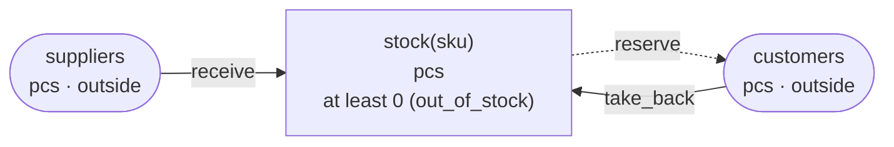

# chobo 設計文書

在庫、お金、ポイント、予約の枠のように、数で持っていて、勘定から勘定へ動かすものを書く小さな言語。書いた帳簿（`.book`）を検査し、参照インタプリタで動かし、PostgreSQL のテーブルと関数、TigerBeetle を呼ぶクライアント（TypeScript・Python・Go）へ出す。PostgreSQL を呼ぶクライアントも、同じ三つの言語で出す。

名前は帳簿から取った。ファイルの拡張子は `.book`。

看板の言い方の案は「勘定に下限と上限を書く。どの振替も、一度の書き込みの中でそれを守る。」（英語では "Put bounds on accounts. Every transfer keeps them, in one write."）。芯は 0.1 に書く。

この文書は段階 A（設計）で書き、段階 B（言語の芯：字句・構文・型、検査、参照インタプリタ、シナリオ、`check`・`run`・`scenarios`・`api`・`explain`）、段階 C（PostgreSQL と TigerBeetle への出力、三つの言語のクライアント、突き合わせ）、段階 D（`doc`、四つの例、README、`docs/`、エージェント向けのスキル）の実装に合わせて直した。3 章の診断と報告、4 章の SQL とクライアントの形、7 章のページは、実装の実際の出力である。TigerBeetle と PostgreSQL の振る舞いとして書いたもの（4 章）と、測った時間と件数は、実際に走らせて確かめたもので、出力をそのまま貼ってある。

## 0. 全体像

```
.book ── 構文解析 ── 名前と単位の解決 ── 型を付けた帳簿
                                       ├── 検査（単位、境界、キー、仮押さえ、勘定のあいだの流れ）と、振替の種類ごとの報告
                                       ├── 参照インタプリタ ── シナリオの自動生成と、同時の操作の順序の数え上げ
                                       ├── PostgreSQL（スキーマ、テーブル、制約、関数）
                                       ├── クライアント（TypeScript・Python・Go）：PostgreSQL を呼ぶものと TigerBeetle を呼ぶもの
                                       ├── `chobo api`：呼び方、断られうる理由、仮押さえのステートマシン（JSON）
                                       └── `chobo doc`：経理や運用の人が読むページ（Markdown と HTML）
```

### 0.1 芯：守る条件を、勘定の上限と下限に絞る

**決定**：帳簿に書ける条件は、勘定ごとの下限（`at least`）と上限（`at most`）だけにする。

これが chobo の境界である。勘定の下限や上限は、その勘定の行だけを見れば確かめられる。だから、振替が勘定の行を書き換える一度の書き込みの中で、条件も確かめられる。ほかの行を読まないので、読んでから書くまでのあいだに、ほかの書き込みが割り込む余地が無い。

二つの勘定にまたがる条件は、そうはいかない。「返金は売上を超えない」を、売上の勘定と返金の勘定を比べる条件として書くと、二つの返金が同時に来たとき、どちらも同じ売上と同じ返金を読み、どちらも通ってしまう（書き込みスキュー）。防ぐには、PostgreSQL なら SERIALIZABLE か明示のロックが要り、TigerBeetle にはそれを書く方法が無い。

そこで、またがる条件は、勘定を一つ足して、一つの勘定の条件に直す。「返金は売上を超えない」は、注文ごとに「返金できる残り」という勘定を立て、売上で増やし、返金で減らし、下限を 0 にする。二つの返金が同時に来ても、同じ行を書き換えるので、後から来た方は前の方が減らしたあとの残りで確かめられ、足りなければ断られる。「一日 120 席まで」という予約の枠も、「その日の空き席」という勘定の下限 0 に直せる。枠を広げるときは空き席を足す振替を一つ流せばよく、上限の数を書き換える必要が無い。

rulec はセルを自分の列への単項テストに絞り、そのおかげで完全性と重なりを厳密に決められる。chobo の絞り方も同じ形をしていて、条件を一つの勘定の境界に絞ったおかげで、どの条件もどのデータベースでも一度の書き込みの中で守れる。曲げてよいのは勘定の立て方（どの量を勘定にするか）だけで、条件の形は曲げない。

要るのは、行に条件を付けて書き換えること（条件つきの UPDATE か、行の制約）と、複数の行をまとめて書く原子的な書き込みの二つだけである。この設計では PostgreSQL と TigerBeetle に出し、どちらでもこの形で守れることを段階 A に確かめた（4.1、4.2）。同じ二つはほかのデータベースにもある（DynamoDB の TransactWriteItems と条件式など）が、確かめていない。

**捨てたもの**：

- **二つ以上の勘定にまたがる条件**（「返金 ≦ 売上」をそのまま書く）：上の理由。勘定を足して直す。
- **勘定の合計についての条件**（「全 SKU の合計 ≦ 倉庫の容量」）：「倉庫の空き」という勘定を立て、入荷のたびに同じ振替の別の移動で減らす。
- **期間や回数の条件**（「返金は月に三回まで」）：「その月の返金の残り回数」という勘定（単位は `回`）に直す。
- **計算する条件**（「手数料は売値の 10%」）：計算は rulec の規則に置き、chobo には計算した額を渡す（P6）。

### 0.2 前提

- **P1**：守る条件は、勘定ごとの下限と上限だけ（0.1）。
- **P2**：勘定の残高は「入った量 − 出た量」で見せる。外の世界を表す勘定（`outside`）はマイナスになってよく、境界を持たない。
- **P3**：量は単位のいちばん小さい単位で数えた整数（円なら 1 円、ドルなら 1 セント）。単位の違う勘定のあいだでは動かせない。
- **P4**：どの振替も、帳簿に書いたキーで識別する。同じキーで同じ中身なら、二度目は何もしない。中身が違えば断る。
- **P5**：意味を決めるのは参照インタプリタ一つ。PostgreSQL と TigerBeetle は、どれもそれと突き合わせて確かめる。
- **P6**：chobo は計算しない。移動の額は、引数かリテラルのどちらかで、足し算もしない。額を決めるのは呼ぶ側か rulec の規則である。
- **P7**：仮押さえは、確定、取消、有効期限切れのどれかで終わる。確定と取消は呼ぶ側がし、有効期限切れは外の時計で起きる。

### 0.3 rulec と dandori との分担

rulec の規則は純関数で、時刻も在庫も入力として渡す（rulec の P3）。在庫や残高そのものは呼ぶ側が持つことになり、chobo はそこを受け持つ。額の計算（手数料の率、ポイントの率、丸め）は rulec の規則に置き、chobo には計算した額を渡す。

dandori は一つの案件のワークフローを動かす。最後の一個を二つの注文が取り合うとき、どちらの注文のワークフローも自分の分しか知らないので、どちらが取るかを決められない。決められるのはデータベースの一度の書き込みだけで、それが chobo の振替である。在庫や残高を守るコードはいま利用者が書いていて、売り越し、返金のしすぎ、リトライでの二重計上、片づけ忘れた仮押さえは、どれもそのコードで起きる。

dandori は chobo の振替をタスクとして呼び、仮押さえを案件として追う（5 章）。ワークフローがどう進んでも仮押さえを片づけてから終わるかは、dandori が案件のステートマシンで確かめる（dandori の E020）。chobo はそのステートマシンを `chobo api` の JSON に出す。

**決定**：chobo は rulec も dandori も呼ばない。dandori は将来 `chobo api` の JSON を読む。dandori が rulec を読むのと同じく、CLI の出力だけを読み、chobo は dandori を知らない。今回 dandori は変えない。

### 0.4 似たもの

**Numscript**（Formance の台帳の上で動く、お金の移動の言語。0.0.26、2026-09-25）。一回の取引をスクリプトとして書く（`send [USD/2 100] (source = @a destination = @b)`）。文法にある文は `send`・`save`・関数の呼び出しだけで（Numscript.g4）、仮押さえ、有効期限、冪等のキーは言語の外にある。どこまでマイナスにしてよいかは、勘定ではなく `send` ごとに元の側へ書く（`allowing overdraft up to`、`allowing unbounded overdraft`）。`@world` は境界の無い元になる（インタプリタのソースで、名前が `world` の勘定は借越しの上限を外す）。インタプリタは元の勘定の残高を読み、いくら取れるかを計算して振り分ける（順に取る元、`max`、`kept`、`remaining`、`balance()`）。取れなければ `MissingFundsErr` になる。

chobo との違いは三つある。一つ、境界は勘定に一度だけ書き、どの振替もそれで確かめる。どこまでマイナスにしてよいかが、振替を書いた人ごとに変わることはない。二つ、振替は残高を読んで額を決めない。額は呼ぶ側が決め、chobo は「通すか、どの境界で断るか」だけを決める。だから、どの振替がどの境界で断られうるかを、走らせる前に一覧にできる。三つ、仮押さえとキーを言語に入れ、データベースへ出す。chobo 自身は台帳を持たない。

**TigerBeetle**（0.17.9、2026-07-06）。勘定のフラグで残高の下限 0 を守るデータベースで、仮押さえ（pending）と timeout、linked でつないだ一続きの振替（以下チェーン）を持つ。言語は持たない。上限や 0 でない下限は、管理用の勘定と linked の振替を組み合わせるレシピで書く。TigerBeetle の文書は、上限のレシピについて「振替ごとに組み込まなければならず、組み込み忘れた振替では上限を超えられる」と書いている。chobo は、帳簿の一つの宣言から、どの振替にもそのチェーンを書く（4.2）。

**FinProof**（0.1.0、2026-09-05、crates.io）。複式簿記の取引を書く言語で、字句解析からバイトコードまで自前で持ち、自前の VM と台帳で動かして確かめる。chobo は自前の台帳を持たず、データベースへ出す。

**台帳のライブラリ**。振替ごとの釣り合いと冪等を守るライブラリは多い。chobo が足すのは、境界で断られうる理由を振替の種類ごとに走らせる前に並べることと、仮押さえのライフサイクルを、ワークフローの検査（dandori）が読める形で出すことである。ワークフローがどう進んでも仮押さえを片づけてから終わるかは、ここに挙げたもののどれも確かめない。

## 1. 言語

### 1.1 ファイルの形

在庫の引当の帳簿（テストの帳簿 `tests/books/在庫.book`。例の `examples/inventory` は、同じ形の帳簿を英語の版 `inventory.book` と日本語の版 `inventory.ja.book` で書いたもの。7 章）。

```
book 在庫 v1
description "SKU ごとの在庫。入荷で増え、注文のために 30 分押さえ、出荷で確定し、キャンセルで取り消す"

unit 個

account 在庫(sku: string) : 個
  description "倉庫の棚にある数"
  at least 0 refused as 在庫切れ
account 仕入先 : 個 outside
account 客 : 個 outside

transfer 入荷(納品書: string, sku: string, 数: 個)
  key 納品書, sku
  move 数 from 仕入先 to 在庫(sku)

transfer 引当(注文: string, sku: string, 数: 個)
  description "確定は出荷、取消はキャンセル"
  key 注文, sku
  pending expires after 30 minutes
  move 数 from 在庫(sku) to 客

transfer 返品(返品伝票: string, sku: string, 数: 個)
  key 返品伝票, sku
  move 数 from 客 to 在庫(sku)
```

字下げがブロックを表す。コメントは `#` から行末まで。キーワードは英語で、名前（帳簿、単位、勘定、振替の種類、引数、断る理由）は日本語でも書ける。rulec と dandori と同じ線引きで、道具の語（英語）と業務の語（日本語）が、見ただけで分かれる。

### 1.2 単位

```
unit 個
unit 円
unit USD scale 2
```

**決定**：量は、単位のいちばん小さい単位で数えた整数（P3）。`scale` は、帳簿に書くリテラルと `doc` の表示で小数を何桁使うかで、`USD scale 2` なら `12.50` と書いて 1250 セントになる。値として運ぶのはいつも整数で、範囲は 0 から 2⁶³ − 1 まで（PostgreSQL の `bigint` に収まる範囲。TigerBeetle は 128 ビットだが、こちらに合わせる）。

一つの移動の元の勘定と先の勘定と額は、同じ単位でなければならない（E010）。換算はしない。両替は、単位ごとに外の勘定を置いて、単位の違う二つの移動で書く。

単位は名前だけを比べる。リンゴの `個` と予約の枠の `個` を分けたいなら、`unit 席` のように別の単位を宣言する。

### 1.3 勘定

```
account 在庫(sku: string) : 個
  at least 0 refused as 在庫切れ
account 空き席(日: string) : 席
  at least 0 refused as 満席
account ウォレット(会員: string) : 円
  at least 0 refused as 残高不足
  at most 1000000 refused as 上限超え
account 仕入先 : 個 outside
```

- **引数**：勘定は引数ごとに分かれる（SKU ごと、日ごと、会員ごと）。引数は `string` だけ。勘定の一つ一つ（`在庫("A-1")`）は、初めて使ったときに残高 0 でできる。勘定の同一性は（帳簿の名前、テナント、勘定の名前、引数の値）で、帳簿のバージョンは入らない。帳簿を v2 にしても勘定は続く。
- **残高**：「入った量 − 出た量」（P2）。外の世界の勘定（`outside`）もこの向きで、仕入先から入荷すれば仕入先の残高はマイナスになり、客に出荷すれば客の残高はプラスになる。
- **境界**：中の勘定（`outside` でない勘定）は、`at least` か `at most` の少なくとも一つを持つ（E020）。どちらにも `refused as <名前>` で断る理由の名前を付ける（E023）。この名前が、呼ぶ側の受け取る断りの理由になり、dandori のタスクのエラーの名前になる。外の勘定は境界を持たない（E021）。
- **上限は 0 以上**（E022）。下限は 0 より大きくてもよい（安全在庫の「3 個を残して引き当てない」）。下限が 0 より大きい勘定は、0 から始まるので、はじめは下限を下回っている。境界は動きを確かめるもので、状態を確かめるものではない（2.2）。出ていく動きが下限を割るなら断り、入ってくる動きは下限に関係しない。

**決定（勘定の向き）**：利用者には「入った量 − 出た量」を見せ、借方と貸方を見せない。chobo の帳簿は総勘定元帳ではなく、量を守るためのものである。借方と貸方のどちらで増えるかは勘定の種類（資産か負債か）で変わり、運用の人や開発者には読みにくい。どの勘定も同じ向きにしておけば、`at least 0` はいつも「マイナスにしない」の意味になる。その代わりに、外の世界を表す、マイナスになってよい勘定（`outside`）が要る。TigerBeetle では、どの勘定も「貸方 − 借方」を残高にした貸方残高の勘定になる（4.2）。

**決定（境界は種類ごとの定数）**：境界の数は勘定の種類に書く定数で、勘定の一つ一つ（会員ごと）には変えられない。会員ごとに違う与信枠は、「使える枠」という勘定にして、枠を広げる振替で入れる（0.1 と同じ直し方）。境界の数を v2 で変えることは、すでにある勘定については扱わない（2.8、11 章）。

### 1.4 振替の種類

```
transfer 引当(注文: string, sku: string, 数: 個)
  key 注文, sku
  pending expires after 30 minutes
  move 数 from 在庫(sku) to 客

transfer 売上(注文: string, 店: string, 代金: 円, 手数料: 円)
  key 注文
  move 代金 from 買い手 to 店の売上(店)
  move 手数料 from 店の売上(店) to 手数料収入
```

- **引数**：`string` か、単位の名前（その単位の額）。
- **キー**（`key`）：振替を識別する引数の並び。どの振替の種類にも要る（E030）。額の引数はキーに入れられない（E031。額だけが違う二つの呼び出しが、どちらも通ってしまう）。
- **仮押さえ**（`pending`）：書けば仮押さえの振替になり、書かなければすぐに確定する振替になる。仮押さえには終わり方を必ず書く。`pending expires after <n> seconds|minutes|hours|days` か `pending never expires`（E040）。有効期限は 1 秒以上、2³² − 1 秒以下（TigerBeetle の timeout は 32 ビットの秒。E041）。
- **移動**（`move <額> from <勘定> to <勘定>`）：一行が一つの移動。額は引数かリテラル。移動は一つ以上で、どれも通るか、どれも通らないかのどちらか（全部か無し）。移動は書いた順に行い、一つ行うごとに境界を確かめる（2.2）。

**決定（キーは帳簿に書く）**：キーは呼ぶ側が作る文字列ではなく、帳簿に引数の並びとして書く。「注文と SKU ごとに一回」「納品書と SKU ごとに一回」が、経理や運用の人の読む仕様になる。同じ注文のワークフローが二つ走ってしまったときの重複も、同じキーになるので防げる。確定と取消は、仮押さえのキーで識別する（2.3）。キーに入れない引数があれば、その引数だけが違う二つの呼び出しは、キーでは同じ振替になり、二つ目は `key_conflict` で断られる。検査はそれを例つきで報告する（3 章）。

**捨てたもの（呼ぶ側が作るキー）**：TigerBeetle の勧めるやり方で、呼ぶ側が ID を作って保存し、リトライのたびにそれを送る。chobo では、キーの作り方が帳簿に無いと、検査が「キーのぶつかり」を言えない。dandori の冪等キー（実行の名前と呼び出しの場所から作る）は、同じ実行のリトライしかまとめられない。

### 1.5 操作と結果

すぐに確定する振替には操作が一つ、仮押さえの振替には三つある。

| 操作 | 振替 | すること |
|---|---|---|
| `do` | すぐに確定する振替 | 書いた移動を行う |
| `hold` | 仮押さえの振替 | 移動する量を仮押さえとして押さえる |
| `post` | 仮押さえの振替 | 確定する。額の引数を渡さなければ全額、渡せばその額（一部の確定。残りは元に戻る） |
| `void` | 仮押さえの振替 | 取り消す |

どの操作の結果も、次の三つのどれかである。

- `done`：いま済んだ。
- `done_before`：同じキーで同じ中身の操作が、前に済んでいる。何もしない。
- `refused`：断った。理由（2.7）を一つ添える。何も変えない。

断りは業務の答え（在庫が無い）で、失敗ではない。だから例外ではなく結果として返す。データベースにつながらない、引数の型が違う、額が範囲の外（0 から 2⁶³ − 1 まで）、といったものは失敗で、生成するクライアントは例外（Go ではエラー）にする。動かしたあとの残高が 64 ビットの整数（PostgreSQL の `bigint`）の範囲を出る操作も失敗にする（参照インタプリタは何も変えずに失敗を返す）。失敗した操作は、同じ引数でリトライしてよい。キーが同じなので、二重には動かない。

読む操作も二つ出す。`balance`（勘定の、確定した残高、出ていく仮押さえ、入ってくる仮押さえ）と、`status`（仮押さえが、押さえ中・確定・取消・期限切れのどれか）。

### 1.6 名前とキーワード

名前は書いたとおりに比べ、Unicode の正規化はしない。正規化には Unicode の表が要り、依存を足さないと決めているからである。その代わり、結合文字（U+0300〜U+036F、U+3099、U+309A）を含む名前は E001 で断り、合成済みの文字で書くよう言う。macOS のファイル名からコピーした「か + 濁点」のような分解された形は、これで止まる。引数の値も正規化しない（呼ぶ側がそろえる）。勘定の同一性は値のバイト列で決まるので、正規化の違う二つの文字列は別の勘定になる。

| 位置 | 語 |
|---|---|
| 行頭 | `book` `description` `unit` `account` `transfer` `key` `pending` `move` |
| 修飾 | `scale` `outside` `at least` `at most` `refused as` `expires after` `never expires` `from` `to` |
| 型 | `string` と、宣言した単位の名前 |
| 時間 | `second` `seconds` `minute` `minutes` `hour` `hours` `day` `days` |

名前に使えないのは、行頭と修飾と型の語（`at least` なら `at` と `least`）である（E001）。時間の語は `expires after <数>` のあとでだけキーワードとして読み、ほかでは名前に使える。予約の枠を日ごとに分ける勘定で、引数を `day` と名付けられるようにするためである。表は `src/syntax.rs` の `KEYWORDS` にそのまま置いてある。

断る理由のうち chobo が決めている名前（2.7 の表の名前）は、境界の理由に使えない（E023）。

## 2. 意味（参照インタプリタ）

### 2.1 状態

参照インタプリタは、テナントごとに次を持つ。

- 勘定の一つ一つの、確定した残高（posted）、出ていく仮押さえ（held out）、入ってくる仮押さえ（held in）。初めて使うときは三つとも 0。
- 仮押さえの一つ一つの、移動ごとの額、状態（押さえ中・確定・取消・期限切れ）、作った時刻と有効期限。
- 使ったキー（振替の種類と操作ごとの名前空間で）と、その中身、結果。

### 2.2 境界の確かめ方

**決定**：境界は、安全側に数えて、移動を一つ行うごとに確かめる。

- 下限 L のある勘定から a を出す移動は、`posted − held_out − a ≥ L` のときだけ通る。入ってくる仮押さえ（held in）は数えない。
- 上限 U のある勘定へ a を入れる移動は、`posted + held_in + a ≤ U` のときだけ通る。出ていく仮押さえ（held out）は数えない。
- 仮押さえの移動も同じ式で確かめ、通れば held out と held in に足す。
- 確定は、仮押さえの額（一部の確定ならその額）を held から posted に移し、残りを元に戻す。取消と期限切れは held から引く。どれも境界を確かめない。仮押さえを作ったときに一番悪い場合で確かめてあるので、確定も取消も、境界を割ることがない。
- 移動は書いた順に行い、一つ行うごとに確かめる。どこかの移動で断られたら、それまでの移動も戻し、最初に断った移動の境界の理由を返す。

安全側に数えるのは、仮押さえを作ったあと、確定が断られないようにするためである。確定が断られうるなら、仮押さえは押さえたことにならない。TigerBeetle の `debits_must_not_exceed_credits` も同じ数え方で（`debits_pending + debits_posted + amount > credits_posted` なら断る）、入ってくる仮押さえは使えない。段階 A に確かめた（4.2 の (j)）。

移動を一つずつ確かめるのは、TigerBeetle がチェーンの振替を一つずつ処理し、そのたびに確かめるからで、PostgreSQL でも同じにする。そのため、移動の順序で結果が変わることがある。すぐに確定する振替で、前の移動が勘定から取り、後の移動が同じ勘定へ入れると、合わせれば足りるのに前の移動で断られる（下限）。前の移動が入れ、後の移動が取る形も、上限のある勘定では同じことになる。検査はどちらも W103 で、例を添えて言う。仮押さえでは、同じ仮押さえのほかの移動が入れた額は入ってくる仮押さえで、取るときに数えない。取る額も出ていく仮押さえで、入れるときの空きにならない。だから、一つの仮押さえの中で同じ勘定から取り、同じ勘定へ入れる形は、順序を変えても通らない（W104）。

**捨てたもの（移動を全部行ったあとの残高で確かめる）**：利用者には分かりやすいが、TigerBeetle でそうするには、フラグの付いた勘定ごとに入る移動を出る移動より先に並べ直し、上限もある勘定や、移動が輪になる振替では、最後に確かめる仮押さえを足すことになる。チェーンが長くなり、どの境界の理由を返すかも並べ直した順で決まる。書いた順で確かめれば、意味は帳簿から読める。

### 2.3 冪等のキー

- **名前空間**：キーは、振替の種類と操作（`do`・`hold`・`post`・`void`）ごとに分かれる。別の種類で同じキーを使っても、ぶつからない。確定と取消は仮押さえのキーで識別する。一つの仮押さえは一度しか確定できないので、確定は仮押さえごとに一回である。
- **中身**：`do` と `hold` は全部の引数、`post` は移動ごとの確定する額（全額なら押さえた額にする）、`void` は無し。
- **同じキーで同じ中身**：`done_before`。何もしない。TigerBeetle の `exists`。
- **同じキーで違う中身**：`refused`（`key_conflict`）。前の振替はそのまま。TigerBeetle の `exists_with_different_*`。
- **境界で断られたキー**：二度目からは、中身にかかわらず `refused`（`already_refused`）。あとで残高が足りるようになっても通らない。TigerBeetle は、残高で断った振替の ID を覚え、同じ ID の二度目を `id_already_failed` で断る（段階 A に確かめた。4.2 の (d)(e)）。同じキーの答えが変わらないので、リトライで結果が変わることはない。もう一度試すなら、キーを変える（キーに試行の番号を入れる）。
- **境界のほかの理由で断られたキー**：使わなかったことになる。二度目は、その時点の状態でもう一度確かめる。仮押さえの状態（確定済み・取消済み・期限切れ）は二度と変わらないので、`already_posted` などは何度でも同じ答えになる。`no_such_hold` だけは、仮押さえがあとからできれば変わりうる。
- **確かめる順**：`do` と `hold` は、(1) 元と先が同じ勘定になる移動が無いか（`same_account`）、(2) キー、(3) 移動を書いた順に境界、の順に確かめる。`same_account` を先にするのは、呼び出しの引数だけで決まり、TigerBeetle のクライアントが送る前に自分で確かめられるからである。`post` と `void` は、仮押さえがあるか、その状態、期限、額（`over_hold`）の順に確かめる（2.4 の表）。

確定の中身は、全額を「押さえた額」に読み替えてから比べる。全額で確定したあとに、押さえた額を明示して確定し直すのは同じ中身で、`done_before` になる。一部を確定したあとに全額で確定し直すのは違う中身で、`key_conflict` になる。TigerBeetle は文書でこれを違う形に書いている（全額を確定したあとなら、押さえた額以上のどの額も `exists`）が、0.17.9 を走らせると、押さえた額か `amount_max` だけが `exists` で、それより大きい額は `exists_with_different_amount` だった（4.2 の (f)）。chobo は走らせた方に合わせる。

**仮押さえのキーを、終わったあとに使い直すことはできない**。期限切れや取消のあとに同じキーでもう一度仮押さえを頼むと、`done_before` が返り、何も押さえない。TigerBeetle の `exists` がそうだからで（4.2 の二つ目の出力）、PostgreSQL でも同じにする。`done_before` は「前に頼まれて済んだ」という意味で、いま押さえていることは言わない。押さえ直すときはキーを変える。検査は、仮押さえの振替ごとにこれを例で報告する（3.2）。

### 2.4 仮押さえのライフサイクル

```
             post（確定）
         ┌─────────────────▶ 確定
押さえ中 ─┼─ void（取消）─────▶ 取消
         └─ expire（外で起きる）▶ 期限切れ
```

| 状態 | post | void | expire |
|---|---|---|---|
| 押さえ中 | 確定（期限の時刻になっていれば `expired` で断る） | 取消（期限の時刻になっていれば `expired` で断る） | 期限切れ |
| 確定 | 同じ中身なら `done_before`、違えば `key_conflict` | `already_posted` | 起きない |
| 取消 | `already_voided` | `done_before` | 起きない |
| 期限切れ | `expired` | `expired` | 起きない |
| 無い | `no_such_hold` | `no_such_hold` | 起きない |

- **一部の確定**：`post` に額の引数を渡すと、どの移動も、その引数で額を求め直して確定し、残りは元に戻る。額の引数は全部渡すか、一つも渡さないか（全額）のどちらか。押さえた額を超える移動があれば `over_hold` で断る。リテラルの額の移動は、いつも全額で確定する。
- **有効期限**：作った時刻に有効期限を足した時刻（期限）になると、確定と取消は `expired` で断られる。期限ちょうどの時刻も、もう `expired` である。TigerBeetle がちょうどの時刻をどちらに数えるかは確かめていない（時計がナノ秒なので、突き合わせでちょうどになることは無い）。押さえていた量が元に戻るのは、外で `expire` が起きたときである。TigerBeetle は期限を過ぎたあと自分で戻すが、ちょうど期限に戻すとは限らない（文書がそう書いている）。PostgreSQL は時計で動かないので、期限の切れた仮押さえを戻す関数を出し、呼ぶ側が定期的に呼ぶ（4.1）。期限を過ぎてから戻るまでのあいだは、押さえた量はまだ数えられる。
- **`never expires`**：外で `expire` が起きない。終わらせるのは呼ぶ側だけで、dandori の案件で追えば、終わらせ忘れたワークフローを検査が止める（5 章）。

### 2.5 時刻

参照インタプリタの時計は、シナリオの始まりからの秒で、シナリオの `pass <時間>` だけが進める。時計が仮押さえの期限に達すると、その時点で `expire` が起きる（期限を過ぎてから戻るまでのあいだを、シナリオでは作らない。戻るまでの時間はデータベースによって違い、そこで起きた操作の結果がデータベースによって変わるからである）。

突き合わせ（6 章）では、テストのコピーの有効期限を数秒に縮め、`pass` を本当に待つ。TigerBeetle の時刻はクラスタの時計で、テストから動かせない。PostgreSQL も同じ扱いにそろえ、`pass` のあと期限の切れた仮押さえを戻す関数を呼ぶ。TigerBeetle では、勘定の held out が戻るまで読み直して待つ。

### 2.6 同時の操作

シナリオの `together` は、別々の呼び出し元から同時に来る操作の並びを書く（二つの注文が最後の一個を取りに来る）。どの操作も一つずつ原子的に処理されるので、結果は、操作をどれかの順序で一つずつ処理した結果のどれかになる。参照インタプリタは、呼び出し元ごとの順序を保ったまま、すべての順序を数え上げ、とりうる結果（操作ごとの結果と、終わりの残高と仮押さえの状態）の集まりを出す。データベースの結果は、その中のどれかでなければならない。

TigerBeetle はリクエストを一つずつ処理し、一つの操作は一つのリクエスト（一つのチェーン）なので、どれかの順序になる。PostgreSQL は一つの操作を一つのトランザクションで処理し、勘定の行をロックしてから確かめるので、どれかの順序になる（4.1）。

同じ結果になる順序は一つにまとめる。在庫の帳簿で、最後の一個を二つの注文が同時に押さえに来るシナリオを `chobo run` で流すと、こうなる。

```
在庫.book (together: two callers take the last 1 of 在庫(sku) with 引当.hold): 2 ステップ、とりうる結果は 2 通り
結果 1:
    1  入荷.do(納品書: 納品書-1, sku: sku-2, 数: 1)                通る
    2  together
         呼び出し元 1: 引当.hold(注文: 注文-3, sku: sku-2, 数: 1)  通る
         呼び出し元 2: 引当.hold(注文: 注文-4, sku: sku-2, 数: 1)  在庫切れ で断られる
  勘定:
    在庫(sku-2)  確定 1、出ていく仮押さえ 1、入ってくる仮押さえ 0
    仕入先       確定 -1、出ていく仮押さえ 0、入ってくる仮押さえ 0
    客           確定 0、出ていく仮押さえ 0、入ってくる仮押さえ 1
  仮押さえ:
    引当(注文-3, sku-2)  押さえ中
結果 2:
    1  入荷.do(納品書: 納品書-1, sku: sku-2, 数: 1)                通る
    2  together
         呼び出し元 1: 引当.hold(注文: 注文-3, sku: sku-2, 数: 1)  在庫切れ で断られる
         呼び出し元 2: 引当.hold(注文: 注文-4, sku: sku-2, 数: 1)  通る
  勘定:
    在庫(sku-2)  確定 1、出ていく仮押さえ 1、入ってくる仮押さえ 0
    仕入先       確定 -1、出ていく仮押さえ 0、入ってくる仮押さえ 0
    客           確定 0、出ていく仮押さえ 0、入ってくる仮押さえ 1
  仮押さえ:
    引当(注文-4, sku-2)  押さえ中
```

一つの `together` に入れられる操作は合わせて 8 までにする（呼び出し元が三つ以上でもよい）。それを超えると数え上げる順序が多くなりすぎるので、シナリオを読むときに断る。

### 2.7 断る理由

| 理由 | いつ | キーを使ったことになるか |
|---|---|---|
| 境界に付けた名前（`在庫切れ`） | 移動が境界を割る | なる（二度目から `already_refused`） |
| `key_conflict` | 同じキーで違う中身 | ならない（前の振替のまま） |
| `already_refused` | 境界で断られたキーの二度目 | — |
| `same_account` | 一つの移動の元と先が同じ勘定になった（引数の値が同じ） | ならない |
| `no_such_hold` | 確定か取消を頼んだ仮押さえが無い | ならない |
| `already_posted` | 確定済みの仮押さえを取り消そうとした | ならない |
| `already_voided` | 取消済みの仮押さえを確定しようとした | ならない |
| `expired` | 期限を過ぎた仮押さえを確定か取消しようとした | ならない |
| `over_hold` | 押さえた額を超えて確定しようとした | ならない |

### 2.8 帳簿のバージョン

帳簿は `v<n>` を持つ。勘定の同一性にも振替の ID にもバージョンは入らないので、v2 にしても勘定と仮押さえは続く。そのため、すでにある勘定や仮押さえの意味を変える変更は、v2 にしても扱えない。

- 勘定の種類の単位、`scale`、外の勘定かどうか、引数、境界を変える（E050）。
- 振替の種類の引数、キー、仮押さえの終わり方（仮押さえかどうかと有効期限の長さ）、移動を変える（E051）。どれも 4.2 の定義のハッシュに入るので、呼んでいる途中の操作をリトライすると `key_conflict` になり、仮押さえ中のものを確定できなくなる。
- 勘定や振替の種類を消す、帳簿の名前を変える（W107）。データベースには残高と仮押さえが残る。

`chobo check --diff-base <リビジョン>` は、git のそのリビジョンの帳簿と比べてこれを言う。実行のときにも、PostgreSQL は勘定の行に作ったときの境界を持ち、帳簿と違えばエラーにする（断りではない）。TigerBeetle も、境界から作る勘定の開始の振替が `exists_with_different_amount` になるので、エラーにする（4.2）。境界を変えたいなら、新しい名前の勘定の種類を作り、残高を移す振替を書く。変わりうる限度は、はじめから勘定にしておく（0.1）。

## 3. 検査

### 3.1 診断

診断の形は dandori にそろえる。一行目にコードと場所と言うこと、次に原文の行、そのあとに、あれば `そうなる例:`（英語は `the operations that get there:`）と操作の列、最後に `ヒント:`。どの診断にも、そこに至る具体的な入力か操作の列を添える。

- 帳簿の書き方の誤り（E001〜E005、E010、E011、E013、E020〜E023、E030、E031、E040、E041）と、前のリビジョンとの比較（E050、E051、W107）は、原文の行が具体的な入力になる。帳簿が組み立てられないか、操作が関わらないからである。E010 は、元の勘定、先の勘定、額のそれぞれの単位を言う（帳簿の型が合わないので、参照インタプリタでは流せない）。E060 は、TigerBeetle のリクエストに入らなくなる呼び出しを一つ添え、E061 は、長すぎる名前と、それが何バイトかを言う（どちらも `chobo build` が出す）。
- 使われない宣言と効かない境界（W105、W106）は、原文の行と、その宣言を使う振替が無いことを言う。
- それ以外（E012、W101〜W104）は、そこに至る操作の列を添える。操作の列は、検査が参照インタプリタで実際に流して、言ったとおりの結果になることを確かめてから出す。確かめられなかったら、その診断を出さない。
- 書き方の誤りが一つでもあると、そこで止まる。読めない行（E001）があれば名前の解決をせず、名前や型の誤りがあれば、呼ぶと分かること（E012、W101〜W106）を調べない。どちらも、そこから先は推測になるからである。

操作の列は次のように探す。まず呼び出しの引数に、ほかと重ならない値（`注文-1`、`sku-2`）と小さな額を入れ、取る元の勘定が足りなければ、その勘定へ入れる振替を探して先に呼ぶ（その振替の取る元も足りなければ同じように探し、三つ先までたどる）。それで言いたい結果にならなければ、額を 1、2、3、5、10、100、1000 から組み合わせて試す。前の移動が入れた額を後の移動が取る振替（分配の帳簿の `売上`）は、前の額のほうが大きくないと通らないので、ここで見つかる。値の番号は、列の中で最初に出てくる順に振り直す。

| コード | 内容 |
|---|---|
| E001 | 構文（知らない語、字下げ、閉じていない文字列、行の形、名前に使ったキーワード、BOM、タブ、結合文字） |
| E002 | 名前が無い（単位、勘定、型、振替の引数） |
| E003 | 二度の宣言（単位、勘定、振替、引数、一つの勘定や振替の下の `description`・`at least`・`at most`・`key`・`pending`、キーの中の同じ引数） |
| E004 | 勘定に渡す引数の数が、勘定の宣言と違う |
| E005 | 型が合わない（`string` の引数を額にする、額の引数を勘定の引数にする、勘定の引数を `string` 以外にする） |
| E010 | 一つの移動の元の勘定・先の勘定・額の単位が合わない |
| E011 | 数が単位に収まらない（`scale` を超える小数、負の額、±(2⁶³ − 1) の外） |
| E012 | 一つの移動の元と先が、引数まで同じ勘定（いつも `same_account`） |
| E013 | 振替に `move` の行が無い |
| E020 | 中の勘定に境界が無い |
| E021 | 外の勘定に境界がある |
| E022 | 境界に収まる残高が無い（下限が上限より大きい）、上限が 0 より小さい |
| E023 | 境界に `refused as` が無い、または理由の名前が chobo の決めている名前と同じ |
| E030 | 振替にキーが無い、キーに書いた名前が引数に無い |
| E031 | キーに額の引数がある |
| E040 | `pending` に終わり方が無い |
| E041 | 有効期限が 1 秒より短い、2³² − 1 秒より長い、整数でない |
| E050 | 前のリビジョンからある勘定の種類の、単位・`scale`・外の勘定かどうか・引数・境界が変わった（`--diff-base`） |
| E051 | 前のリビジョンからある振替の種類の、引数・キー・仮押さえの終わり方・移動が変わった（`--diff-base`） |
| E060 | 一つの操作のチェーンが、TigerBeetle の一つのリクエスト（253 件）に入らない（`chobo build` の TigerBeetle のターゲットが言う） |
| E061 | 名前が PostgreSQL の識別子の長さ（63 バイト）を超える（`chobo build` の PostgreSQL のターゲットが言う） |
| W101 | 入れる移動はあるのに、取る移動がどこにも無い中の勘定（残高がたまる一方） |
| W102 | いつも断られる振替（取る元の勘定の下限が 0 以上で、その勘定へ入れる移動がどこにも無い） |
| W103 | すぐに確定する振替が、移動の順序のせいで断られる（下限のある勘定から前の移動が取り、後の移動が入れる。上限のある勘定へ前の移動が入れ、後の移動が取る） |
| W104 | 仮押さえの中で、ある移動が、同じ仮押さえのほかの移動が入れる勘定から取る（または、取る勘定へ入れる）。押さえた額は数えないので、順序を変えても通らない |
| W105 | 使われない宣言（単位、勘定、引数） |
| W106 | 効かない境界（上限のある勘定へ入れる移動が無い。下限のある勘定から取る移動が無い。W101 と W105 で言ったものは除く） |
| W107 | 前のリビジョンにあった勘定や振替の種類が無くなった、帳簿の名前が変わった（残高と仮押さえはデータベースに残る。`--diff-base`） |

E013 は段階 B で足した。移動の無い振替は構文としては読めるが、何も動かさないので、書き方の誤りとして止める。

「条件がどのデータベースでも一度の書き込みの中で守れるか」は、書ける条件を境界に絞ったことで、書けた時点で成り立つ。検査が見るのは、境界の数が出力先で表せるか（E011、E022）である。出力先ごとの限り（TigerBeetle の一つのリクエストに入る件数 E060、PostgreSQL の名前の長さ E061）は、dandori の E040 と同じく、その出力先へのビルドで言う。PostgreSQL にしか出さない帳簿が、TigerBeetle の限りで止められないようにするためである。

**決定（E060 は 253 件で止める）**：TigerBeetle の一つのリクエストに入る件数は、レプリカの立て方で変わる。`--development` を付けて立てたレプリカには 253 件まで入る（0.17.9 で、253 件のチェーンは通り、254 件はクライアントが `Too much data was sent or requested in this batch.` で断った）。本番の構成、つまり `--development` を付けずに立てたレプリカなら、一つのリクエストで 8189 件まで送れる（TigerBeetle の文書の値で、chobo では確かめていない）。それでも E060 は 253 件で止める。chobo が実際に走らせて確かめられるのは、手元で立てられる `--development` のレプリカだけだからである。8189 件で止めると、254 件から 8189 件のチェーンを持つ帳簿がビルドを通り、その帳簿は手元のレプリカでは動かず、突き合わせのテストもできない。一つの移動は、境界によって多いときで 6 件の振替になる（4.2）ので、253 件を超えるのは、境界のある勘定のあいだの移動を 43 個書いた振替からで、そこまで大きい振替は移動の少ないいくつかの振替に分けられる。勘定と開始の振替はチェーンの外で、要るだけのリクエストに分けて送る（4.2）ので、E060 が数えるのはチェーンだけである。

**捨てたもの（8189 件で止める）**：本番の構成でしか動かない帳簿を通してしまい、その帳簿が正しく動くかを確かめる手段が無い。

実際の出力（`tests/fixtures` の帳簿から。golden に固定してある）：

```
warning[W103]: 順序.book:15:3: move 1 takes from 店の売上(店) before move 2 puts into it: when 店の売上(店) is short at that point, the call is refused with 売上不足, even when the two moves together would leave enough
    15 |   move 手数料 from 店の売上(店) to 手数料収入
  the operations that get there:
       1  売上.do(注文: 注文-1, 店: 店-2, 代金: 1, 手数料: 1)  refused: 売上不足 (move 1 takes 1 from 店の売上(店-2): posted 0, held out 0)
  hint: write the move that puts into 店の売上(店) first
```

```
警告[W104]: 仮押さえの順序.book:14:3: 仮押さえでは、1 つ目の移動が 預り(注文) へ入れる額は入ってくる仮押さえになり、2 つ目の移動が 預り(注文) から取るときに数えられません。預り(注文) にはじめから足りるだけの残高が無ければ、預り不足 で断られます
    14 |   move 代金 from 預り(注文) to 店への支払
  そうなる例:
       1  決済.hold(注文: 注文-1, 代金: 1)  預り不足 で断られる（2 つ目の移動が 預り(注文-1) から 1 を取る。確定 0、出ていく仮押さえ 0、入ってくる仮押さえ 1）
  ヒント: 取る分をはじめから 預り(注文) に入れておくか、確定のあとで取る別の振替にします
```

`chobo explain <コード>` は、コードごとに、いつ出るか、どう直すか、最小の再現の帳簿を出す（`src/codes.rs`）。テストが、どの再現の帳簿もそのコードを出すことを確かめる。

### 3.2 振替の種類ごとの報告

`chobo check` は、診断のあとに、振替の種類と操作ごとに、断られうる理由とキーのぶつかりを報告する。dandori のタスクが宣言するエラーにあたる。どの理由にも、そうなる操作の列を添える（テキストでは理由の名前だけを並べ、`--format json`、`chobo api`、`chobo doc` が例まで出す。7 章）。

```
在庫.book: ok
  入荷.do    断られうる理由: key_conflict
  引当.hold  断られうる理由: 在庫切れ（在庫(sku) at least 0）、key_conflict、already_refused
  引当.post  断られうる理由: key_conflict、already_voided、expired、over_hold、no_such_hold
  引当.void  断られうる理由: already_posted、expired、no_such_hold
  返品.do    断られうる理由: key_conflict
  キー: 入荷 は 納品書, sku ごとに一回。数 だけが違う二度目は key_conflict で断られる
  キー: 引当 は 注文, sku ごとに一回。数 だけが違う二度目は key_conflict で断られる。押さえが終わったあとに同じキーで押さえ直すと done_before になり、何も押さえない
  キー: 返品 は 返品伝票, sku ごとに一回。数 だけが違う二度目は key_conflict で断られる
```

```
在庫.book: ok
  入荷.do    may be refused: key_conflict
  引当.hold  may be refused: 在庫切れ (在庫(sku) at least 0), key_conflict, already_refused
  引当.post  may be refused: key_conflict, already_voided, expired, over_hold, no_such_hold
  引当.void  may be refused: already_posted, expired, no_such_hold
  返品.do    may be refused: key_conflict
  key: 入荷 once per 納品書, sku; a second call that differs only in 数 is refused with key_conflict
  key: 引当 once per 注文, sku; a second call that differs only in 数 is refused with key_conflict; holding again with the same key after the hold has ended answers done_before and holds nothing
  key: 返品 once per 返品伝票, sku; a second call that differs only in 数 is refused with key_conflict
```

断られうる理由の候補は、移動が触る勘定の境界（取る元の下限、入れる先の上限）と、キー（`key_conflict` は額かキーに入らない引数があるとき、`already_refused` は境界で断られうるとき）、`same_account`（同じ種類の勘定のあいだの移動があるとき）、仮押さえの状態から決まる。どの候補も 3.1 のやり方で操作の列を探し、見つかったものだけを載せる。たとえば `never expires` の仮押さえには `expired` が載らず、同じ仮押さえの中の移動どうしが頼り合って（W104）押さえられない振替には、確定と取消の `no_such_hold` しか載らない。

## 4. 出力先

### 4.1 PostgreSQL

`chobo build --target postgres` は SQL のファイルを一つ書く（`<帳簿の名前>.sql`）。`CREATE … IF NOT EXISTS` と `CREATE OR REPLACE FUNCTION` で書くので、何度流してもよい。帳簿ごとにスキーマを一つ作る。

- **テーブル**：`accounts`（テナント、勘定の ID、種類、引数、単位、作ったときの下限と上限、posted、held_in、held_out。主キーはテナントと ID）、`holds`（テナント、仮押さえの ID、種類、キー、移動ごとの元と先の ID と額、状態、作った時刻、期限、確定した額）、`keys`（テナント、種類、操作、キー、中身、定義のハッシュ、結果、断った理由、時刻。主キーはテナント、種類、操作、キー）、`entries`（勘定ごとの変化の記録。監査と、残高を記録から計算し直す確かめのため）。仮押さえの ID は、TigerBeetle で仮押さえのチェーンの一件目になる振替の ID（4.3）である。
- **制約**：`accounts` の行に、下限と上限の CHECK を付ける（`within_lower`：`lower_bound is null or posted − held_out ≥ least(lower_bound, 0)`、`within_upper`：`upper_bound is null or posted + held_in ≤ greatest(upper_bound, 0)`）。下限が 0 より大きい勘定は 0 から始まるので、制約は 0 までしか言わない。関数は境界そのものを確かめるので、制約は、関数を通らない書き込みを止める最後の歯止めである。
- **関数**：振替の種類と操作ごとに一つで、名前は `"<振替の種類>_<操作>"`（`"在庫"."引当_hold"(p_tenant, "p_注文", p_sku, "p_数")`）。答えは型 `result`（`result`、`reason`）の一行。読む関数（`"<振替の種類>_status"` は状態を文字列で、`"balance_<勘定>"` は型 `balance`（`posted`、`held_in`、`held_out`）で答える）と、期限の切れた仮押さえを戻す `expire(p_max integer default 1000)`、ID を求める `chobo_id(parts text[])` も出す。引数は、テナント、帳簿の引数の順で、名前の前に `p_` を付ける。関数の中の名前は、列の名前と `p_…`、`v_…` だけになり、引数が列と読み違えられることが無い。`post` の引数は、キーの引数のあとに額の引数を `default null` で持つ（全部 null なら全額）。スキーマ、関数、引数の名前は、PostgreSQL の識別子の長さ（63 バイト。日本語は一字 3 バイトなので 21 字まで）に収まらなければならない（E061）。収まらない名前を PostgreSQL は黙って切り詰めるので、ビルドで止める。
- **`do` と `hold` の流れ**：(0) 元と先が同じ勘定になる移動があれば、キーに触る前に `same_account` を返す（2.3 の順）。(1) `keys` にキーを入れる（`INSERT … ON CONFLICT DO NOTHING`）。入らなければ前の行を読み、断った行なら `already_refused`、中身と定義のハッシュが同じなら `done_before`、違えば `key_conflict` を返す。同じキーの操作が同時に来ると、後の方はここで前の方のコミットを待つ。中身は引数の JSON、定義のハッシュは 4.2 の `user_data_128` に入れるのと同じもので、帳簿を変えたあとのリトライは TigerBeetle と同じく `key_conflict` になる。(2) 使う勘定の行を、なければ ID の順に作り、ID の順に `SELECT … FOR UPDATE` でロックして、残高を配列に読む。行の境界が帳簿と違えば、断りではなくエラー（`CB001`）にする。(3) 読んだ値で、移動を書いた順に行いながら確かめる。どこかの境界で断るなら、キーの行を断ったことに書き換えて返す。まだ何も書いていないので、戻すものは無い。(4) どの移動も通れば、行を書き換え、`entries` に記録し、仮押さえなら `holds` に一行足す。
- **`post` と `void` の流れ**：仮押さえの行を `FOR UPDATE` で読み（無ければ `no_such_hold`）、2.4 の表のとおりに答える。確定と取消も `keys` に行を書く。確定済みの仮押さえへの確定と、取消済みの仮押さえへの取消は、その行の中身（確定した額）と定義のハッシュが同じなら `done_before`、違えば `key_conflict` を返す。押さえた額を超える確定は、状態を見たあとで `over_hold` にする（2.4 の順）。
- **状態**：`"<振替の種類>_status"` は、期限を過ぎた仮押さえを、`expire()` が戻す前でも `expired` と答える。TigerBeetle も同じに答える（4.2）。
- **ロックの順序**：勘定の行は、どの操作も ID の順にロックする（`expire()` はテナントと ID の順）。`do` と `hold` はキーの行を、`post` と `void` は仮押さえの行を、勘定より先に取る。どの操作も、勘定より先に取る行は一つだけで、`expire()` は仮押さえの行を期限、テナント、ID の順に取り、ほかの操作が持っている行は待たずに飛ばす（`SKIP LOCKED`）。勘定の行を待つ操作は、勘定より先に取る行をもう待たないので、ロックの待ちが輪にならない（デッドロックにならない）。
- **分離レベル**：READ COMMITTED で正しく動く。条件はロックした行だけを見るので、ほかの行を読み直す必要が無い。REPEATABLE READ と SERIALIZABLE でも正しいが、同時の操作がシリアライズの失敗（40001）で返ることがあり、生成するクライアントは同じ引数で 10 回までリトライする（キーが同じなので二重には動かない）。リトライのあいだは、0 から 1、2、4 … 128 ミリ秒までのランダムな時間だけ待ち、一緒に失敗した呼び出しどうしがまたぶつからないようにする。呼ぶ側のトランザクションの中で失敗すると、二度目はトランザクションが中断されている（25P02）ので、最初のエラーを返す。呼ぶ側のトランザクションの中で呼べば、注文の行を書くことと一緒にコミットできる。これは PostgreSQL だけの利点である。
- **時刻**：期限は関数の中で一度だけ読む `clock_timestamp()` と比べる。PostgreSQL は時計で動かないので、期限の切れた仮押さえは `expire()` が戻すまで数えられたままになる。`expire()` は pg_cron か呼ぶ側の定期のジョブで呼ぶ。`expire()` は、ほかの操作や、同時に走るほかの `expire()` が持っている仮押さえを飛ばす。だから `expire()` が返っても、期限の切れた仮押さえが全部戻っているとは限らない（もう一方の `expire()` がまだコミットしていないことがある）。ジョブは一つにして、一度に一つずつ呼ぶ。
- **ID**：勘定と仮押さえの ID は、TigerBeetle と同じ 128 ビットの値（4.3）を `uuid` 型に入れる。二つの出力先で同じ勘定は同じ ID になる。`chobo_id` は `sha256(bytea)` で 4.3 のとおりに求め、PLAN 0.3 の表の ID を全部同じに出す（`tests/postgres.rs`）。

`引当.hold` の (3) と (4) は、こう書かれる（`chobo build --target postgres` の出力から）。

```sql
  -- move 数 from 在庫(sku) to 客
  v_from := array_position(v_ids, v_from_1);
  v_to := array_position(v_ids, v_to_1);
  if v_posted[v_from] - v_held_out[v_from] - "p_数" < 0 then
    -- refused by a bound: nothing has moved, and the key stays used
    update "在庫".keys k set result = 'refused', reason = '在庫切れ'
     where k.tenant = p_tenant and k.kind = '引当' and k.op = 'hold' and k.key = v_key;
    return ('refused', '在庫切れ')::"在庫".result;
  end if;
  v_held_out[v_from] := v_held_out[v_from] + "p_数";
  v_held_in[v_to] := v_held_in[v_to] + "p_数";

  -- (4) every move went through: the rows take what the moves left
  update "在庫".accounts a set posted = x.posted, held_in = x.held_in, held_out = x.held_out
    from unnest(v_ids, v_posted, v_held_in, v_held_out) as x (id, posted, held_in, held_out)
   where a.tenant = p_tenant and a.id = x.id;
```

**決定（移動はロックした値で確かめ、全部通ってから書く）**：移動ごとに条件つきの UPDATE を流し、断ったら例外のブロックで前の移動を戻す書き方も作ったが、捨てた。例外のブロックは呼び出しごとにサブトランザクションになり、一つのトランザクションの中で何度も呼ぶと遅くなる。一つの `SELECT` の中で `引当_hold` を 1 万回呼ぶと、例外のブロックでは 77.6 秒、ロックした値で確かめる形では 5.5 秒かかった（PostgreSQL 18.0。どちらも同じ 100 個の勘定に）。呼び出しを一回ずつのトランザクションにすると、psql 一本から 5000 回で 0.82 秒（一回 0.16 ミリ秒）である。

`expire()` の速さ：期限を過ぎた仮押さえ 1000 件を一度に戻すと 62 ミリ秒、14000 件で 1.36 秒、5000 件で 0.35 秒かかった（一件 0.07〜0.1 ミリ秒。同じマシン）。既定の `p_max` は 1000 件である。

段階 A に、使い捨てのクラスタ（PostgreSQL 18.0）で、前提にする振る舞いを確かめた。一つ目のセッションが最後の一個を条件つきの UPDATE で押さえ、二秒トランザクションを開けたままにする。0.5 秒後に二つ目のセッションが同じ UPDATE を流す。

```sql
update accounts set held_out = held_out + 1
 where id = 1 and posted - held_out - 1 >= coalesce(lower_bound, posted - held_out - 1)
 returning …;
```

```
B waited 1.5 s
A: A took it, held_out=1
B:  (no row means refused)
stock: posted=1 held_out=1
```

二つ目は一つ目のコミットを待ち、コミットされた行で条件を確かめ直して、何も書き換えなかった。同じキーの INSERT を二つ同時に流すと、二つ目は 1.5 秒待ってから何もせず、一つ目の中身を読めた。

```
second waited 1.5 s
first: first inserted
second: second sees: c1
```

関数を通らずに境界を割る UPDATE は、CHECK で止まった（`new row for relation "accounts" violates check constraint "accounts_check"`）。

### 4.2 TigerBeetle

TigerBeetle にはデータベースの中で動くコードが無いので、chobo はクライアントを出す。クライアントが、操作ごとに一つのチェーンを組み立てて、一つの `create_transfers` のリクエストで送る。一つのリクエストは原子的に処理され、チェーンの振替は全部か無しなので、一つの操作は一度の書き込みになる。

**対応**：

- 勘定の一つ一つが TigerBeetle の勘定一つ。残高は「貸方 − 借方」（credits − debits）で、chobo の「入った量 − 出た量」と同じ向き。移動は「元の勘定を借方、先の勘定を貸方」にした振替一つ。
- **ledger**：単位ごとに一つ。単位の名前と `scale` から 32 ビットの値を作る（4.3 の ID と同じハッシュ）。単位の違う勘定のあいだの振替は、検査が先に止める（E010）。
- **code**：勘定の種類と振替の種類の名前から 16 ビットの値を作る。表示と問い合わせのためだけに使い、ぶつかっても害は無い（chobo は code で振替を見分けない。確定と取消は code に 0 を送り、仮押さえのものを引き継がせる）。
- **ID**：キーから決める 128 ビットの値（4.3）。勘定は（帳簿、テナント、勘定の種類、引数の値）から、振替は（帳簿、テナント、振替の種類、操作、キーの値、チェーンの中の位置）から。
- **user_data_128**：操作の中身のハッシュ。中身に、振替の種類の定義（移動、境界）のハッシュも入れる。リトライのあいだに帳簿の定義が変わると、`exists_with_different_user_data_128` で `key_conflict` になり、古いチェーンの上で新しい移動だけが行われることは無い。
- **timeout**：仮押さえの振替（と、その移動の境界のための振替）に、有効期限を秒で入れる。

**境界をチェーンに書く**：TigerBeetle のフラグが守れるのは下限 0 だけなので、ほかの境界は勘定と振替を足して書く。

| 境界 | 書き方 |
|---|---|
| 下限 0 | 勘定に `debits_must_not_exceed_credits` を付ける。足す振替は無い |
| 下限 L > 0 | 勘定にフラグを付け、移動のすぐあとに、その勘定から受け皿の勘定へ L の仮押さえを作り、すぐに取り消す。仮押さえが通るのは、移動のあとに L が残るときだけ |
| 下限 L < 0 | 勘定にはフラグを付けない。フラグを付けた「下限までの余裕」の勘定を作り、作ったときに −L を入れておく。勘定から出る移動には余裕から同じ額を出す振替を、入る移動には余裕へ同じ額を入れる振替を並べる。仮押さえかどうかは移動に合わせる |
| 上限 U | フラグを付けた「上限までの空き」の勘定を作り、作ったときに U を入れておく。勘定へ入る移動には空きから同じ額を出す振替を、出る移動には空きへ同じ額を入れる振替を並べる |

余裕と空きの勘定は、その勘定の境界までの残りをそのまま残高として持つ。入ってくる仮押さえは空きを仮押さえで減らすので数えられ、出ていく仮押さえは空きを仮押さえで増やすだけなので数えられない。2.2 の安全側の数え方と同じになる。受け皿の勘定は、単位とテナントごとに一つ、フラグを付けない。余裕と空きの勘定に最初に入れる振替（開始の振替）の ID は、余裕や空きの勘定の ID から決める。帳簿の境界の数が変わると、開始の振替が `exists_with_different_amount` になるので、クライアントはエラーにする（2.8）。

一つの移動は、多いときで 6 件の振替になる。下限が 0 より大きく上限もある勘定から、下限が 0 より小さく上限もある勘定への移動で、移動そのもの、下限の仮押さえとその取消、元の勘定の空きを戻す振替、先の勘定の空きを減らす振替、先の勘定の余裕を戻す振替が並ぶ。余裕を減らす振替は下限が 0 より小さい勘定から出る移動に付くので、下限の仮押さえと一緒にはならない。確定と取消のチェーンは、仮押さえにした移動の振替と、余裕と空きの振替を、同じ順に確定か取消する（下限の仮押さえはもう取り消してあるので入らない）。

**勘定を先に作る**：TigerBeetle は、無い勘定への振替を `debit_account_not_found` で断り、その ID を二度と使えなくする（`id_already_failed`）。クライアントは、操作の前に、使う勘定（余裕、空き、受け皿も）と開始の振替を作る。勘定は消えないので、作ったことを帳簿の値（`tigerbeetle(client)` が返すもの）ごとに覚えて、二度目からは送らない。勘定と開始の振替は、チェーンとは別のリクエストで、253 件ずつに分けて送る。作った勘定が `exists_with_different_*` なら勘定の定義が変わった、開始の振替が `exists_with_different_amount` なら境界が変わったというエラーにする（`tests/tigerbeetle.rs` が、上限を変えた帳簿を同じテナントで呼んで確かめる）。その前に、元と先が同じ勘定になる移動が無いかを自分で確かめ、あれば何も送らずに `same_account` を返す（2.3）。

受け皿と開始の振替の `code` と `user_data`、作る勘定の並べ方は PLAN 0.3 に決めてある。`src/ids.rs` がそのとおりにチェーンを組み、テストの帳簿の全シナリオの全操作の分を `tests/books/<帳簿>.chains.json` に固定してある。三つの言語のクライアントは、これと一字ずつ同じものを送る（6 章で、全シナリオの全操作について確かめる）。

**確定と取消の前に仮押さえを読む**：TigerBeetle は、無い仮押さえの確定を `pending_transfer_not_found` で断り、その確定の ID を二度と使えなくする。仮押さえより先に確定が届くと、その仮押さえは永久に確定できなくなる。クライアントは、確定と取消の前に `lookup_transfers` で仮押さえにした移動の振替を読み、無ければ送らずに `no_such_hold` を返す（キーを使わない。2.7）。全額の確定では、ここで読んだ額が確定の中身になる（2.3）。仮押さえは消えないので、読んだあとに無くなることは無い。

**状態を読む**：TigerBeetle の振替には、仮押さえが確定、取消、期限切れのどれで終わったかを示すフィールドが無い。クライアントの `status` は、仮押さえの一件目の振替を取り消す振替と、必ず断られる振替（借方と貸方が同じ）を linked でつないで送る。二件目が断られるので、TigerBeetle は何も書かない。一件目の結果は、その仮押さえをいま取り消そうとしたときの答えなので、そこから状態が分かる。二つの振替の ID は毎回ランダムに作る。0.17.9 で、四つの状態の仮押さえと、無い仮押さえに送った結果：

```
held       linked_event_failed, accounts_must_be_different
posted     pending_transfer_already_posted, linked_event_failed
voided     pending_transfer_already_voided, linked_event_failed
expired    pending_transfer_expired, linked_event_failed
not there  pending_transfer_not_found, linked_event_failed
```

期限を過ぎた仮押さえは、TigerBeetle が押さえた量を戻す前でも `expired` と読める。PostgreSQL の `_status` も同じに答える（4.1）。捨てた形は、仮押さえの振替の時刻と timeout を、クライアントの時計と比べること（クラスタの時計とずれうる）と、TigerBeetle の `get_change_events`（文書に無い、実験段階の API）を読むこと。

**押さえた額を超える確定**：TigerBeetle は、確定する額を、仮押さえが終わっているかより先に確かめる。押さえ中、取消済み、期限切れの仮押さえに、押さえた額（3）を超える 5 の確定を新しい ID で送った結果：

```
post 5 of 3, held:     exceeds_pending_transfer_amount
post 5 of 3, voided:   exceeds_pending_transfer_amount
post 5 of 3, expired:  exceeds_pending_transfer_amount
```

参照インタプリタは状態を先に見る（2.4）。そこでクライアントは、先に読んだ額と頼まれた額を比べ、超えていれば確定を送らずに状態を読むチェーンを送り、押さえ中なら `over_hold`、確定済みなら `key_conflict`、取消済みなら `already_voided`、期限切れなら `expired` を返す。`exceeds_pending_transfer_amount` と `pending_transfer_expired` は ID を使わない（同じ ID で正しい額を送り直すと `created`、期限切れの仮押さえにもう一度送るとまた `pending_transfer_expired` だった）。`tests/books/在庫.more.json` が、取消、期限切れ、確定のあとに押さえた額を超えて確定するシナリオを、全部の出力先で流す。

**結果の読み方**：0.17.9 は、チェーンの振替の一件ずつに結果を返す。チェーンの結果は、`created` でも `linked_event_failed` でもない最初の振替で決まる（TigerBeetle は、断った振替のほかを、前のものも含めて `linked_event_failed` にする）。

| `created` でも `linked_event_failed` でもない最初の振替の結果 | chobo の結果 |
|---|---|
| どれも `created` | `done` |
| 一件目が `exists` | `done_before` |
| `exists_with_different_*` | `key_conflict` |
| 二件目より後が `exists` | `key_conflict`（前の版の定義で作ったチェーンと形が違う） |
| `id_already_failed` | `already_refused` |
| `exceeds_credits` | 移動そのもの、下限の仮押さえ、余裕を減らす振替なら元の勘定の下限の理由。先の勘定の空きを減らす振替なら先の勘定の上限の理由（ほかの振替は、フラグの付いた勘定へ入れるだけで断られない） |
| `accounts_must_be_different` | `same_account` |
| `pending_transfer_already_posted`・`_already_voided`・`_expired` | `already_posted`・`already_voided`・`expired` |
| `exceeds_pending_transfer_amount` | `over_hold` |
| ほかの結果 | エラー（chobo のクライアントの誤り） |

**違う中身のリトライ（参照インタプリタと違うところ）**：境界で断られたキーで、違う額のリトライが来ると、参照インタプリタは中身にかかわらず `already_refused` を返す（2.3）。TigerBeetle が二度と使わせないのは、前のチェーンで断った振替の ID だけである。違う額では、それより前の振替が、自分の確かめる境界で先に断られることがあり、そのときクライアントはその境界の理由を返す（その振替の ID も使えなくなる）。どちらでも何も動かず、違うのは理由の名前だけである。同じキーで違う額を送るのは呼ぶ側の誤りで、TigerBeetle で ID が使えなくなったかを、使わずに確かめる方法が無いので、合わせる仕組みは足していない。生成するシナリオ（同じ引数のリトライ）には出てこない（11 章）。

**決定（64 ビットを出る残高は、読むときにエラーにする）**：TigerBeetle の残高は 128 ビットなので、動かしたあとの残高が 64 ビットの整数の範囲を出る操作も通る。参照インタプリタと PostgreSQL では失敗になる（1.5）。TigerBeetle のクライアントは、範囲を出た残高を `balance` で読んだときにエラーにする。境界の無い勘定へ 2⁶³ − 1 に近い額を何度も入れたときにしか起きない。送る前に残高を読んで確かめる形は、同時の操作とのあいだで読み直しが要り、一度の書き込みでなくなるので捨てた。

**有効期限**：timeout は TigerBeetle が自分で数え、期限を過ぎた仮押さえを戻す。chobo のクライアントは何もしない。期限を過ぎた確定と取消は、戻す前でも `pending_transfer_expired` で断られる（ソースで、期限と、確定や取消が届いた時刻を比べている）。移動が二つ以上ある仮押さえは、移動ごとに別の振替なので、TigerBeetle は移動ごとに戻す。期限は同じチェーンの中でナノ秒ずつ違い、戻すのは期限の順である。移動を一つずつ戻すあいだに別の操作が入りうるかは確かめていない（ソースには、一回の処理で戻しきれないときについての TODO がある）。参照インタプリタは、`expire` を一度に起きるものとして扱う（11 章）。

**段階 A に確かめたこと**：GitHub のリリースの 0.17.9（macOS のユニバーサルバイナリ）で、`format`（`--development`、1.1 GB のデータファイル、4.4 秒）と `start`（一つのレプリカ、初期化で 1517 MiB を確保）をし、Node のクライアント（tigerbeetle-node 0.17.9）から振替を送った。Python（tigerbeetle 0.17.9）と Go（tigerbeetle-go v0.17.9、cgo）のクライアントからも一回ずつ振替を送れた。出力（ID は試しの番号）：

```
(a) receive 1 into stock                     created
    stock: posted 1, held out 0, held in 0
(b) hold 1 (timeout 60s)                     created
(c) hold 1 more                              exceeds_credits
(d) the same again                           id_already_failed
(e) same id, amount 5                        id_already_failed
(f) post the hold (amount_max)               created
    retry, amount_max                        exists
    retry, amount 1                          exists
    retry, amount 5                          exists_with_different_amount
    retry, amount 0                          exists_with_different_amount
(g) void the posted hold                     pending_transfer_already_posted
    retry                                    pending_transfer_already_posted
    post a hold that is not there            pending_transfer_not_found
    retry                                    id_already_failed
(h) receive 1, hold it with timeout 1s       created, created
    stock: posted 1, held out 1, held in 0
    post after 1.05s                         pending_transfer_expired
    stock: posted 1, held out 0, held in 0
    the hold was released 1098 ms after it was made
    void after release                       pending_transfer_expired
(i) chain: +5 into stock, -100 out of it     linked_event_failed, exceeds_credits
    retry                                    linked_event_failed, id_already_failed
    first alone                              created
(j) pending: supplier->escrow, escrow->cust  linked_event_failed, exceeds_credits
(k) open room with 3                         created
    +2 into capped (room -2)                 created, created
    +2 more                                  linked_event_failed, exceeds_credits
    hold +1 into capped                      created, created
    hold +1 more                             linked_event_failed, exceeds_credits
    capped: posted 2, held out 0, held in 1 | room: posted 1, held out 1, held in 0
(l) put 5 into safety                        created
    take 3 (probe 3 must fit after)          linked_event_failed, exceeds_credits, linked_event_failed
    take 2                                   created, created, created
    safety: posted 3, held out 0, held in 0
```

- (c)〜(e)：残高で断られた ID は、同じ中身でも違う中身でも `id_already_failed`。
- (f)：全額を確定したあとのリトライは、押さえた額（1）と `amount_max` だけが `exists`。
- (g)：確定済みの取消は何度でも `pending_transfer_already_posted`（ID を使わない）。無い仮押さえの確定は、二度目から `id_already_failed`（ID を使う）。
- (h)：期限を過ぎた確定は `pending_transfer_expired`。作ってから 1.05 秒（期限の 0.05 秒あと）に確定を送り、その直後に読むと、押さえた量はもう戻っていた。
- (i)：チェーンの一つが残高で断られると全体が断られ、断った振替の ID だけが使えなくなる（一件目は単独なら通った）。
- (j)：入ってくる仮押さえは使えない（W104）。
- (k)：上限 3 を「空き」の勘定で守れる。仮押さえも数えられる。
- (l)：下限 3 を、仮押さえを作ってすぐ取り消す振替で守れる。ちょうど 3 が残る取り出しは通る。

続けて、勘定を作り直すこと、一部の確定、期限切れのあとの同じ仮押さえ、チェーンのリトライを確かめた（抜粋）。

```
create_accounts                              created, created, created
    the same again                           exists
    A with another flag                      exists_with_different_flags
put 10 into A                                created
hold 3 out of A                              created
post 1 of the 3                              created
    retry, amount 1                          exists
    retry, amount_max                        exists_with_different_amount
    retry, amount 3                          exists_with_different_amount
hold 2 out of A, timeout 1s                  created
    A after 1.5s: posted 9, held out 0
    the same hold again                      exists
    A: posted 9, held out 0
chain: A->B 3, A->C 2                            created, created
    the same chain again                         exists, linked_event_failed
    chain with a new first event                 linked_event_failed, exists
    user_data_128 differs on the first           exists_with_different_user_data_128, linked_event_failed
    post both again                              exists, linked_event_failed
    void both                                    pending_transfer_already_posted, linked_event_failed
```

- 同じ勘定をもう一度作ると `exists`、フラグを変えて作ると `exists_with_different_flags`。クライアントが勘定を作りにいくのが二度目でも害は無く、勘定の定義が変わったことは分かる。
- 一部を確定したあとのリトライは、同じ額だけが `exists`。
- 期限切れのあとに同じ仮押さえを送ると `exists` で、何も押さえない（2.3）。
- 通ったチェーンを送り直すと、一件目が `exists` になり、そこでチェーンが切れる（`exists` もチェーンを切る。ソースは `created` でない結果でチェーンを切っている）。後ろの振替だけが既にあるチェーンは、何も動かさない。

### 4.3 クライアントと ID

`chobo build --target` は、出力先ごとに一つの言語のクライアントを書く。

| ターゲット | 書くもの |
|---|---|
| `postgres` | スキーマ、テーブル、制約、関数の SQL |
| `postgres-typescript`・`postgres-python`・`postgres-go` | その SQL の関数を呼ぶクライアント |
| `tigerbeetle-typescript`・`tigerbeetle-python`・`tigerbeetle-go` | チェーンを組み立てて送るクライアント |

**決定（PostgreSQL を呼ぶクライアントも出す）**：出す。理由は三つ。一つ、二つの出力先のクライアントは、名前も引数も結果も同じにするので、出力先を替えても呼ぶ側のコードは変わらない。二つ、突き合わせのテスト（6 章）を、どちらの出力先でも同じクライアントを通して流せる。三つ、PostgreSQL を呼ぶ側にも誤りの起きる所がある（シリアライズの失敗のリトライ、結果の読み方）。SQL の関数は契約として残るので、ほかの言語からは関数を直接呼べる。

**決定（出力先と言語ごとに一つのターゲット）**：TypeScript と Python は、使うドライバを呼ぶ側から受け取れるので、一つのクライアントに二つの出力先を入れられる。Go は import をあとに延ばせず、使わない出力先のモジュール（tigerbeetle-go は cgo を使う）も go.mod に要ることになるので、分けた。三つの言語をそろえるため、どれも分ける。

- **ファイル**：TypeScript は `<帳簿の名前>.ts` を一つ、Python は `<帳簿の名前>.py` を一つ、Go は `<パッケージ>/book.go` と `<パッケージ>/runtime.go` を書く。どれも、帳簿ごとに違う部分（型、呼び方、帳簿の定義の表）と、どの帳簿でも同じ部分（ID、チェーン、TigerBeetle の答えの読み方。`src/client/runtime/` のファイルを一字も変えずに入れる）でできている。TypeScript は Node が型を剥がすだけで走る書き方にし（`enum`、実行時のコードを含む `namespace`、コンストラクタの引数でのプロパティ宣言を使わない）、`tsc --strict --erasableSyntaxOnly` を通す。
- **形**：TypeScript では `tigerbeetle(client, { tenant })` か `postgres(db, { tenant })` が帳簿の値を返す。

  ```ts
  import { createClient } from "tigerbeetle-node";
  import { tigerbeetle } from "./在庫.ts";
  const client = createClient({ cluster_id: 0n, replica_addresses: ["127.0.0.1:3312"] });
  const book = tigerbeetle(client, { tenant: "" });
  console.log(await book.入荷.do({ 納品書: "d-1", sku: "A-1", 数: 3n }));
  console.log(await book.引当.hold({ 注文: "o-1", sku: "A-1", 数: 3n }));
  console.log(await book.引当.post({ 注文: "o-1", sku: "A-1" }, { 数: 2n })); // 一部の確定。額を渡さなければ全額
  console.log(await book.引当.status({ 注文: "o-1", sku: "A-1" }));           // 仮押さえが無ければ null
  console.log(await book.balance.在庫({ sku: "A-1" }));
  console.log(await book.引当.hold({ 注文: "o-2", sku: "A-1", 数: 5n }));
  ```

  を、`--development` で立てたレプリカ一つに流した出力：

  ```
  { result: 'done' }
  { result: 'done' }
  { result: 'done' }
  posted
  { posted: 1n, held_in: 0n, held_out: 0n }
  { result: 'refused', reason: '在庫切れ' }
  ```

  結果は `{ result: "done" } | { result: "done_before" } | { result: "refused"; reason: Reason }` で、`Reason` は帳簿の境界の理由と chobo の理由（2.7）を並べた型である。Python は同じ名前をキーワード引数で受け取る（`book.引当.hold(注文="o-1", sku="A-1", 数=3)` が `Result("done")`、`book.引当.post(注文="o-1", sku="A-1", 数=2)`、`status` は `str` か `None`、`balance.在庫(sku="A-1")` は `Balance(posted, held_in, held_out)`）。Go は（パッケージが `book` のとき）`book.TigerBeetle(c, tenant)` か `book.Postgres(q, tenant)` が `*Book` を返し、どのメソッドも `context.Context` を最初に受け取る（`b.X引当.Hold(ctx, book.X引当Args{X注文: "o-1", Sku: "A-1", X数: 3})` が `(Result{Outcome, Reason}, error)`、`Post(ctx, key, *X引当Amounts)` は `nil` で全額、`Status` は `HoldState`（無ければ `""`）、`b.Balance.X在庫(ctx, book.X在庫Account{Sku: "A-1"})`）。外から見える名前で日本語の名前には、dandori と同じく前に `X` を付ける。額は TypeScript では `bigint`、Python では `int`、Go では `int64`。PostgreSQL の帳簿の値には、期限の切れた仮押さえを戻す `expire()` が足される。どの言語でも、振替の種類の名前は `balance` と `expire`（Go では `Balance` と `Expire`）を避けて付け、二つの出力先で同じ名前になる。名前が言語のキーワードなら、Python は後ろに `_` を付ける。同じ名前になる二つは、後の方に `_2` を付ける。
- **ドライバ**：PostgreSQL は、呼ぶ側の接続を受け取り、SQL の関数を一つ呼ぶ。TypeScript は `query(text, values)` を持つもの（`pg` の `Client`、`Pool`、`PoolClient`）、Python は DB-API の接続（psycopg 3 か psycopg2。プレースホルダーは `%s`）、Go は `QueryRow` を持つもの（pgx の `*pgx.Conn`、`*pgxpool.Pool`、`pgx.Tx`）。クライアントはコミットもロールバックもしない。TigerBeetle は公式のクライアント（tigerbeetle-node 0.17.9、Python の tigerbeetle 0.17.9 の `ClientSync`、tigerbeetle-go v0.17.9）を受け取る。Go は、受け取るものをインターフェース（`Querier`、`TigerBeetleClient`）にして、テストが包めるようにした。
- **テナント**：一つの帳簿を、いくつかの独立した残高の組として使うための名前。ID と PostgreSQL のキーに入る。既定は空の文字列。テストでは、シナリオごとに別のテナントを使い、一つのデータベースで全部のシナリオを同時に流す。

**ID の決め方**：

```
id = SHA-256(enc("chobo/1") ‖ enc(役目) ‖ enc(部品1) ‖ enc(部品2) ‖ …) の先頭 16 バイトを、ビッグエンディアンの 128 ビットの整数として読んだもの
enc(s) = s の UTF-8 のバイト長（ビッグエンディアンの 32 ビット） ‖ s の UTF-8
```

| 役目 | 部品 |
|---|---|
| `account` | 帳簿、テナント、勘定の種類、引数の値（宣言の順） |
| `floor`・`room` | 元の勘定の ID（16 進 32 桁） |
| `sink` | 帳簿、テナント、単位 |
| `opening` | 余裕か空きの勘定の ID |
| `transfer` | 帳簿、テナント、振替の種類、操作、キーの値（宣言の順）、チェーンの中の位置（10 進） |
| `kind` | 帳簿、テナント、勘定の種類（勘定の `user_data_128`） |
| `content` | 帳簿、テナント、振替の種類、操作、定義のハッシュ、中身（2.3） |
| `ledger` | 単位、`scale`（先頭 4 バイトを 32 ビットに。0 なら 1） |
| `code` | 帳簿、`account`・`transfer`・`sink` のどれか、種類の名前（受け皿なら単位の名前）（先頭 2 バイトを 16 ビットに。0 なら 1） |

長さを前に付けるので、`("a:b", "c")` と `("a", "b:c")` は別の ID になる。0 と 2¹²⁸ − 1 は TigerBeetle が ID に使わせないので、0 になったら 1 に、2¹²⁸ − 1 になったら 2¹²⁸ − 2 にする。SHA-256 は、Rust では自分で書き（依存を足さない）、生成するクライアントでは各言語の標準ライブラリを使う。三つの言語と Rust が同じ ID を出すことを、テストで全シナリオの全操作について確かめる（6 章）。ID が言語ごとに違えば、別の言語のサービスが同じキーで送った振替が二重に動く。

**捨てたもの（TigerBeetle の勧める時刻つきの ID）**：TigerBeetle は、上位 48 ビットを時刻にした ID を勧めている。ID が増える順に並ぶと LSM 木が速いからで、文書はランダムな ID を「スループットがかなり落ちる」と書いている。chobo の ID はキーのハッシュなので、ランダムに並ぶ。リトライで同じ ID を出すには、時刻を入れられない（入れるなら、呼ぶ側が ID を保存してリトライに渡すことになり、キーを帳簿に書く意味が無くなる）。どれだけ遅くなるかは測っていない（11 章）。

### 4.4 二つの出力先でそろえたこと

| こと | PostgreSQL | TigerBeetle |
|---|---|---|
| 一度の書き込み | 関数一つを一つのトランザクションで | チェーン一つを一つのリクエストで |
| 下限 0 | 関数の確かめと CHECK | 勘定のフラグ |
| ほかの下限、上限 | 関数の確かめと CHECK | 下限の仮押さえ、余裕と空きの勘定（4.2） |
| 仮押さえの数え方 | held_in、held_out の列 | `credits_pending`、`debits_pending` |
| 冪等 | `keys` の行と中身の比較 | ID と `exists`・`exists_with_different_*`、user_data_128 |
| 境界で断られたキー | `keys` に断ったことを残す | `id_already_failed` |
| 同時の操作 | 勘定の行を ID の順にロック | リクエストを一つずつ処理する |
| 有効期限 | `clock_timestamp()` と比べ、`expire()` が戻す | timeout、TigerBeetle が戻す |
| 無い仮押さえの確定 | `holds` を読んで `no_such_hold` | 先に読んで `no_such_hold`（送らない） |
| 仮押さえの状態を読む | `holds` の行（期限を過ぎていれば `expired`） | 取消と断られる振替のチェーンを送り、何も残さずに答えを読む |
| 押さえた額を超える確定 | 関数が状態を先に見る | 先に読んだ額で分かれば、送らずに状態を読んで答える |
| 64 ビットを出る残高 | その操作が失敗する（`bigint` があふれる） | 操作は通り、`balance` で読むときにエラー |
| 違う中身の、断られたキーのリトライ | `already_refused` | 前の振替が先に断られれば、その境界の理由（4.2） |
| 呼ぶ側のトランザクションに入れる | できる | できない |

## 5. `chobo api` と dandori

`chobo api <file.book>` は、呼び方と断られうる理由と仮押さえのステートマシンを JSON で出す。dandori が rulec の `api` と `certificate` を読むのと同じく、将来の dandori が CLI の出力だけを読めるようにする。

- **振替の種類ごと**：引数（名前、型、単位）、キー、仮押さえかどうかと有効期限、移動、操作ごとの断られうる理由（名前、どの境界か、キーを使ったことになるか、そうなる操作の列）、`code` と定義のハッシュ。
- **出力先ごと**（`targets`）：PostgreSQL のスキーマ、操作ごとの関数の名前と引数の名前（`default null` の引数も）、勘定ごとの `balance_…`、`expire`。TypeScript と Python のファイル、帳簿の値を作る関数、振替の種類ごとのメンバーの名前（TypeScript は引数の型の名前も、Python は引数のキーワードの名前も）。Go のパッケージ、帳簿の値を作る関数、振替の種類ごとのフィールドと型とフィールドの名前、勘定ごとのメソッドの名前。TigerBeetle の一つのリクエストに入る件数と、操作ごとのチェーンの並び（移動と役目）。生成したコードを読まずに、ほかの道具（将来の dandori）が呼び方を組み立てられるように。
- **勘定の種類ごと**：引数、単位、境界と理由の名前、外の勘定か。
- **ID の決め方**（4.3 の表）。ほかの道具が自分で ID を求められるように。
- **仮押さえのステートマシン**：仮押さえの振替の種類ごとに一つ。dandori の `src/rulec.rs` が rulec のステートマシンを読むのと同じフィールドで書く。`name`、`carry`（`input`・`output`・`enum`）、`held`（空）、`states`（`held`・`posted`・`voided`・`expired`）、`initial`（`held`）、`final`（`posted`・`voided`・`expired`）に、chobo で足す `events`（`post`・`void`・`expire`）と `external`（`expire`。`never expires` なら空）。その下の `certificate` に、rulec の証明書と同じ形で、`machine`（`table`、`carry`、`axis`、状態の番号での `initial` と `finals`、行ごとの `to` か `stay`）と、`tables`（軸は `event` と `state`、`decides` は `next_state`・`refused`・`reason`、行ごとの `accepts` と `produces`）と `enums` を入れる。2.4 の表がそのまま行になる。`never expires` の種類は、`events` と軸から `expire` を、表から `expire` の行を除き、行の番号を 1 から振り直す。dandori の読み方（`machine(&api["machine"], &cert)`）に、そのステートマシンと `certificate` を渡せば読める形にしてある。

dandori の側の書き方は、将来こうなると見ている（dandori は今回変えない）。

```
use book 在庫 from "在庫.book"

case 押さえ : 引当 follows 在庫.引当
  external expire
  refused when refused = true

task 引き当てる(注文: string, sku: string, 数: int) -> 引当
  book 在庫.引当.hold
  starts 在庫.引当
  errors 在庫切れ
```

仮押さえを作るタスクが案件を始め、確定と取消のタスクが `post` と `void` を送る。ワークフローが押さえ中の仮押さえを残して終われば、dandori の E020 が止める。`expire` は外で起きるので、確定の前に期限切れでありうることも、dandori が数える（dandori の 2.2）。断りの理由は、dandori のタスクが宣言するエラーの名前としてそのまま使える。chobo の操作はキーで冪等なので、dandori の E030（キーなしのリトライ）にはあたらない（`idempotent` として読める）。

## 6. 確かめ方

- **参照インタプリタ**（`chobo run`）：シナリオ（操作、`pass`、`together` の並び）を流し、操作ごとの結果と、終わりの残高と仮押さえの状態を出す。`together` では、とりうる結果の集まりを出す。

  ```
  在庫.book (pass: 引当 expires, then is posted and voided): 5 steps
    1  入荷.do(納品書: 納品書-1, sku: sku-2, 数: 2)  done
    2  引当.hold(注文: 注文-3, sku: sku-2, 数: 2)    done
    3  pass 31 minutes                               引当(注文-3, sku-2) expired
    4  引当.post(注文: 注文-3, sku: sku-2)           refused: expired
    5  引当.void(注文: 注文-3, sku: sku-2)           refused: expired
  accounts:
    在庫(sku-2)  posted 2, held out 0, held in 0
    仕入先       posted -2, held out 0, held in 0
    客           posted 0, held out 0, held in 0
  holds:
    引当(注文-3, sku-2)  expired
  ```

- **シナリオの自動生成**（`chobo scenarios`）：帳簿から、少なくとも次を作る。
  - 境界ごとに、その境界を確かめる振替について、境界の手前・ちょうど・超える（入れる振替で残高を作ってから取る）。
  - 振替の種類ごとに、同じキーの二度目（同じ中身、違う中身）と、境界で断られたキーの二度目。
  - 仮押さえの振替ごとに、全額の確定、一部の確定、取消、確定のあとの取消、取消のあとの確定、押さえた額を超える確定、無い仮押さえの確定、有効期限切れのあとの確定と取消、期限切れのあとに同じキーで押さえ直すこと。
  - 移動が二つ以上ある振替ごとに、どれか一つの移動が断られる（どの移動も行われていないことを、終わりの残高で確かめる）。
  - 下限のある勘定から取る振替ごとに、二つの呼び出し元が同時に最後の一つを取りに来る（`together`）。上限のある勘定へ入れる振替ごとに、二つが同時に最後の空きを取りに来る。
  - 元と先が同じ種類の勘定になる移動ごとに、引数を同じ値にして `same_account` で断られる。
  - 引数の値は、一つのシナリオの中でどれも違う値にする（dandori と同じ理由。同じ値ばかりだと、取り違えが突き合わせに出ない）。値の番号は、シナリオの中で最初に出てくる順に振る。
  - どのシナリオも、参照インタプリタで実際に流しながら組み立て、名前に書いた結果にならなければ捨てる。境界の手前・ちょうど・超えるは、その移動の勘定が同じ振替のほかの移動に出てこないときだけ作る（出てくる振替は、移動の順序のシナリオが受け持つ）。
  - 名前は英語で、名前に入る数は単位の桁で書く（7 章）。`chobo doc --lang ja` のために、同じ中身の日本語の題も一緒に作る（`scenarios::generate_titled`）。

  テストの帳簿 6 冊から 125 本、例の 8 冊から 208 本のシナリオを作る。テストの帳簿については、参照インタプリタの結果を `tests/books/<帳簿>.runs.json` に、TigerBeetle に送る 340 の操作のチェーンを `<帳簿>.chains.json` に固定してある（例の帳簿の結果は、7 章のページが固定している）。手で書いたシナリオ（`<帳簿>.more.json`）の結果は `<帳簿>.more.runs.json` に固定する。
- **突き合わせ**（`tests/backends.rs`）：全部の帳簿（テストの帳簿 6 冊と例の 8 冊）の全部のシナリオを、七つの組み合わせで流し、参照インタプリタと比べる。七つは、SQL そのもの（psql から関数を呼ぶ）、PostgreSQL × 三つの言語のクライアント、TigerBeetle × 三つの言語のクライアントである。操作ごとの結果と、終わりの残高と仮押さえの状態が一致すること、`together` のシナリオでは参照インタプリタの出す集まりに入ることを確かめる。生成したシナリオのほかに、帳簿の横に置いた `<帳簿>.more.json` の、手で書いたシナリオも流す。いまは 6 本で、在庫のテストの帳簿の 4 本（押さえた額を超える確定を、取消、期限切れ、確定のあとに送るものと、0 を確定するもの）と、返金の例の英語と日本語の版の 1 本ずつ（30.00 の売上に 20.00 の返金が二つ同時に来るもの）である。
  - PostgreSQL は、テストのたびに使い捨てのクラスタ（`initdb`、ソケットだけで待ち受け、`fsync=off`）を立て、帳簿ごとのスキーマに SQL を入れる。バイナリは PATH か `CHOBO_PG_BIN` から、ソケットは `CHOBO_PG_SOCKET_DIR`（無ければ `/tmp`）の下に置く（ソケットのパスは 103 バイトまで）。TigerBeetle は、テストのたびにデータファイル（1.1 GB）を作り、レプリカを一つ立てる（`tools/tigerbeetle/tigerbeetle` か `CHOBO_TIGERBEETLE`）。TigerBeetle は自分のコピー（一つ 256 MB）を一時ディレクトリに置いて動くので、テストの一時ディレクトリを `TMPDIR` として渡す。どちらも、終わったら（失敗しても）止めて消す。テストのプロセスが殺されて残ったものは、次のテストのプロセスが、記録しておいたプロセス ID で止めてから消す。
  - テストのコピーとして、帳簿の `pending expires after …` を全部 3 秒に書き換えた帳簿から、SQL とクライアントを作る（書き換える場所が見つからなければ失敗）。生成するシナリオの `pass` は、作った仮押さえの期限をどれも越えるので、コピーでも参照インタプリタの答えは変わらない（テストが全シナリオで確かめる）。ランナーは、そのシナリオで作った仮押さえの期限をどれも 0.3 秒越えるまで本当に待つ。そのあと PostgreSQL では `expire()` を呼び（一つのランナーの中では一度に一つずつ。4.1）、TigerBeetle では、勘定の出ていく仮押さえが、期限の無い仮押さえの分だけになるまで読み直す（10 秒で打ち切る）。
  - 組み合わせごとにランナーのプロセス（`tools/runner` の `runner.ts` と `runner.py`、Go はテストが組み立てる一つのバイナリ）を一つ起こし、全部の帳簿の全部のシナリオを同時に流す。シナリオごとに別のテナントを使う。PostgreSQL へは 20 本の接続を、TigerBeetle へは四つのクライアントを使い回す（TigerBeetle のクラスタが覚えるクライアントは 64 まで）。`together` は、呼び出し元ごとに別の帳簿の値と別の接続（TigerBeetle では別のクライアント）から、本当に同時に送る。
  - PostgreSQL の四つの組み合わせを順に流し、それと並べて、TigerBeetle の三つを順に流す。最後に、PostgreSQL のどの勘定の残高も、`entries` を足し合わせたものと等しいことを確かめる。
- **段階 C の結果**：テストの帳簿 6 冊の 125 本と、手で書いた 4 本の計 129 本が、七つの組み合わせのどれでも参照インタプリタと一致した（`together` の 11 本は、とりうる結果のどれかに入った）。最後の二回の実行で、`tests/backends.rs` は 21.7 秒と 22.0 秒（組み合わせごとに 3.4〜5.4 秒）、`cargo test` の全体は 43.9 秒と 50.9 秒だった（`tests/tigerbeetle.rs` が 15.6 秒と 16.2 秒、`tests/postgres.rs` が 5.4 秒と 5.7 秒。どれも Go のビルドのキャッシュが温まっているとき）。テストのあいだ、TigerBeetle のレプリカが 1.5 GB ほどのメモリを取る（段階 A に測った）。
- **段階 D の結果**：例を足して 14 冊になり、生成した 333 本と手で書いた 6 本の計 339 本が、七つの組み合わせのどれでも参照インタプリタと一致した（`together` の 27 本は、とりうる結果のどれかに入った）。最後の二回の実行で、`tests/backends.rs` は 25.3 秒と 24.7 秒（組み合わせごとに 3.6〜6.7 秒で、TigerBeetle の三つが 5.9〜6.7 秒）、`cargo test` の全体は 58.5 秒と 56.7 秒だった（`tests/tigerbeetle.rs` が 15.8 秒と 15.2 秒、`tests/postgres.rs` が 5.9 秒と 5.5 秒、`tests/doc.rs` が 4.3 秒と 4.4 秒。どれも Go のビルドのキャッシュが温まっているとき）。
- **送ったもの**：三つの言語のクライアントが送ったものを、ランナーが操作ごとに書き留め、`chobo run --show` と比べる。PostgreSQL では呼んだ SQL と引数（Python の `%s` は `$1`、`$2` … に直して比べる）、TigerBeetle では、確定と取消の前に読む仮押さえの ID、作った勘定と開始の振替、チェーンの全部のフィールドである。勘定と開始の振替は帳簿の値ごとに初めて要るときだけ送るので、`--show` の並びの一部であることと、`--show` に出てくる勘定がどれも一度は送られたことを見る。状態を読むチェーン（4.2）の ID はランダムなので、`--show` では `random` と書き、ほかのフィールドを比べる。これで、三つの言語が Rust と同じ ID とチェーンを送ることを、全シナリオの全操作について確かめる。
- **PostgreSQL だけのもの**（`tests/postgres.rs`）：反対の向きの移し替えを四つのセッションから百回ずつ同時に流してデッドロックが起きないこと。REPEATABLE READ の接続で、四つの呼び出し元が 50 回ずつ同じ勘定に入れ、三つの言語のクライアントがどれもシリアライズの失敗をリトライして、200 回の呼び出しが全部 `done` になること（シリアライズの失敗は、一回の実行で言語ごとに 12〜17 回起きた。四回の実行から）。関数を通らない UPDATE を CHECK が止めること。境界を書き換えた行で `CB001` になること。`expire()` が戻した数と、残高と `entries`。PLAN 0.3 の ID の表を `chobo_id` で求めて一致すること。長い名前の帳簿が E061 でビルドされないこと。
- **TigerBeetle だけのもの**（`tests/tigerbeetle.rs`）：上限を変えた帳簿を同じテナントで呼ぶと、開始の振替の額が違ってエラーになること。無い仮押さえの確定が、読むだけで何も送らずに `no_such_hold` になり、そのあと仮押さえを作れば同じキーで確定できること。どちらも三つの言語で確かめる。ほかに、移動の多い帳簿が E060 でビルドされないこと。
- **生成したコード**（`tests/generated.rs`）：TypeScript を `tsc --strict`（typescript 7.0.2、`erasableSyntaxOnly` と `noUnusedLocals` も）に、Python を `py_compile` に、Go を `gofmt -l`（何も言わないこと）と `go vet` に通す。
- **診断**：テストの帳簿の診断を、英語と日本語の両方で golden に固定する（`CHOBO_BLESS=1` で書き直す）。どの診断コードにも走る最小の再現を `chobo explain` に持たせ、テストがそのコードが出ることを確かめる。E060 と E061 は、`tests/fixtures` の帳簿の横の `<名前>.target` に書いたターゲットでビルドしたときの出力を golden にする。診断の帳簿は 22 冊で（段階 D で、README が見せる英語の名前の W103 の帳簿 `split.book` を足した）、28 のコード全部が両方の言語で golden に出る。
- **ページ**（`tests/doc.rs`）：`chobo doc` のページを golden に固定し、残高を参照インタプリタと、図を Mermaid と、HTML を Chrome で確かめる（7 章）。
- **文書**（`tests/docs.rs`、`tests/skill.rs`）：README.md、README.ja.md、`docs/`、`skills/` の診断の抜粋が `tests/fixtures` の golden にそのまま含まれること。` ```book ` のブロックのどの行も、例かテストの帳簿か `chobo explain` の再現の帳簿の行であること。` ```console ` のブロックに出力つきで書いた `chobo` のコマンドを、リポジトリの根で実際に走らせ、書いた行が書いた順に出ること（`…` の行は、省いた行を表す）。文書の中の相対リンクの先があること。`docs/codes.md` と `codes.ja.md` が `chobo explain --all --format markdown` の出力と同じであること。README に書いたコードの数とシナリオの数が実際の数であること。`docs/reference.md` のキーワードの表が `src/syntax.rs` の `KEYWORDS` と同じ順で同じであること。スキルの中のページのコピーが `skills/sync.sh` の作るものと同じで、スキルの中のリンクがスキルの外を指さず、`SKILL.md` の frontmatter が Agent Skills の形に合うこと。
- **外の道具**：PostgreSQL、TigerBeetle、node、python、go、Chrome、`tools/mermaid` の Mermaid、それぞれの依存が無ければ、`SKIP: <理由>` の行を出して通す。

## 7. `chobo doc`

経理や運用の人が読むページ。`chobo doc <file.book>` は Markdown（GitHub が描く Mermaid の図を入れる）を、`--format html` は一つの HTML（図は chobo が SVG で描き、外のスクリプト、フォント、画像を読まない）を書く。`--lang ja` で日本語になる。エラーのある帳簿は描かない（診断を標準エラーに出して exit 1）。警告は、ページの「検査の警告」の節に `chobo check` と同じ形で載せる。文を作るのは `src/doc.rs`、HTML と図を書くのは `src/draw.rs` で、Markdown と HTML は同じ中身を持つ。

1. **見出し**：帳簿の名前とバージョン、`description`、ページの読み方（残高は入った量から出た量を引いたもの、境界を守れない振替は境界の名前で断られて何も動かない、`do`・`hold`・`post`・`void`）。
2. **勘定の表**：名前、分け方（引数）、単位、境界と断る理由（外の勘定はそう書く）、`description`。
3. **勘定のあいだの流れの図**：勘定が四角、振替の移動が矢印。四角には引数、単位、境界と理由を書く。外の勘定は角の丸い四角（HTML では角の丸い破線の四角）、仮押さえの振替の矢印は破線にする。移動が二つ以上ある振替は、矢印に額を添える（`sale (fee)`、`売上（手数料）`）。
4. **振替の節**：移動（二つ以上なら番号を付け、書いた順に行い全部か無しと書く）、キー（キーに入らない引数だけが違う二度目の `key_conflict`、押さえ直しの `done_before`）、仮押さえの終わり方。仮押さえの振替には、ライフサイクルの図（状態、確定・取消・期限切れ、断られる操作）と、状態ごとに `post` と `void` が何を返すかの表（2.4 の表を、その振替の有効期限で書いたもの）を付ける。そのあとに、操作ごとの断られうる理由とその意味の表と、理由ごとの「そうなる操作の列」（3.2 の報告の例を参照インタプリタで流し直し、境界で断られたところの残高まで書く。折りたたんだ節に入れる）。
5. **シナリオ**：`chobo scenarios` が作るシナリオの全部。ステップごとに、そのあとの残高（確定した量と、あれば括弧の中に仮押さえ）を並べる。`together` のあるシナリオは、とりうる結果ごとに分ける。Markdown では一本ずつ折りたたみ（`<details>`）、表にする。HTML では一本を選び、一ステップずつ進める（ボタン、矢印キー、ステップを押す）。そのステップのあとの残高と仮押さえの表を出し、前のステップから変わったところに色を付ける。図では、そのステップで呼んだ振替の矢印に色を付ける（断られたものは赤）。選んだシナリオ、結果、ステップは URL の `#scenario=3&step=2&outcome=1` に残る。残高は参照インタプリタで求め（`scenario::trace`、ステップごとの状態を持った `run`）、JSON でページに入れる。

在庫の例（`examples/inventory/inventory.book`）の流れの図は、Markdown ではこうなる（`examples/inventory/doc.md` から）。



**決定（数は単位の桁で書く）**：ページの数は、帳簿のリテラルと同じく単位の `scale` の桁で書く（`USD scale 2` の 3 セントは `0.03`）。読み手は経理や運用の人で、データベースに入るいちばん小さい単位の整数ではなく、帳簿に書く形で数を読むからである。生成するシナリオの名前に入る数（`one above at least 0.00`）も、同じく単位の桁で書く。`chobo run` のテキストと診断の操作の列は、シナリオの JSON と同じ整数のままにする。シナリオを書く人が、JSON に書いた数と同じ数を見られるように。

**決定（シナリオの題は両方の言語で作る）**：シナリオの名前は英語で、JSON の約束の一部である（PLAN 0.3）。`--lang ja` のページには、`scenarios::generate_titled` が名前と一緒に作る日本語の題を出す。英語の題は名前そのものである。

**決定（Markdown の図は Mermaid、HTML の図は chobo が描く）**：GitHub は Markdown の中の Mermaid を描くので、プルリクエストに貼ったページがそのまま図になる（流れは `flowchart LR`、ライフサイクルは `stateDiagram-v2`）。HTML は外のスクリプトを読まないので Mermaid を使えず、chobo が SVG を描く。流れの図は、勘定を左から右への列に並べる。まず、何も入ってこない勘定（無ければ、帳簿が最初に取る外の勘定）から移動をたどる。たどる途中の勘定へ戻る移動（返品、返金）は数えず、ほかの移動の先を、元より右の列に置く。列の中の順は、隣の列で移動がつながる勘定の位置の平均で、左から右へ、右から左へと四回ずつ並べ直し、矢印が交わりにくくする。同じ列のあいだの移動は四角の右に膨らませ、二列以上をまたぐ移動は四角の下を回し、同じ勘定の種類のあいだの移動は四角の上に輪を描く。ラベルが重なれば下へずらす。

**決定（ページに出力先の中身を出さない）**：TigerBeetle の余裕と空きの勘定、チェーン、PostgreSQL のテーブルは出さない。読み手はデータベースを動かす人ではなく、帳簿の決まりを確かめる人だからである。それは `chobo run --show` と `docs/targets.md` が受け持つ。

HTML は、明るい配色と暗い配色（`prefers-color-scheme`）を持つ。幅の狭い画面では、表と図とコードがそれぞれの枠の中で横に動き、ページは横にはみ出さない（360 ピクセルの幅で、Chrome の画面を撮って確かめた）。図は縮めずに元の大きさで描く。ページの大きさは、例で 50〜60 KB である。

例は四つで、どれも英語の版の横に日本語の版を置く（`examples/<名前>/<名前>.book` と `<名前>.ja.book`）。

- **在庫の引当**（`inventory`、`在庫の引当`）：入荷、引当（仮押さえ 30 分、出荷で確定、キャンセルで取消）、返品。
- **ポイント**（`points`、`ポイント`）：付与（返品の期間が過ぎるまで `never expires` で押さえる）、利用（会計のあいだ 15 分押さえる）、失効。会員ごとのポイントに上限もある。
- **返金は売上を超えない**（`refunds`、`返金`）：注文ごとの返金できる残りの勘定。売上で増やし、返金（承認を待つあいだ 7 日押さえる）で減らす。二つの返金が同時に最後の残りを取りに来るシナリオがページに出る。
- **マーケットプレイスの手数料の分け方**（`marketplace`、`マーケットプレイス`）：売上は、店の売上金と手数料への二つの移動（額は呼ぶ側が計算して渡す）。振込は `never expires` で押さえ、返金は二つの移動を戻す（全部か無し）。

英語の版の単位は `pcs`、`pt`、`USD scale 2`、日本語の版は `個`、`pt`、`円`。突き合わせは全部の帳簿を一つのデータベースに入れ、PostgreSQL のスキーマは帳簿の名前なので、例の帳簿にはテストの帳簿と違う名前を付けた（同じ名前だと、二つの帳簿が関数を上書きし合う）。どの例も警告なしで検査を通る。例の横には `chobo doc` が書いたページ（英語の版の `doc.md`、日本語の版の `doc.ja.md`）を置き、GitHub で読めるようにする。返金の例には、30.00 の売上に 20.00 の返金が二つ同時に来て、そのあと 10.00 を返金するシナリオを手で書いて置き（`refunds.more.json`、`refunds.ja.more.json`）、README が `chobo run` で見せる。このシナリオも七つの組み合わせで流す。

確かめ方は 6 章に書く。

**捨てたもの**：

- **Mermaid を読み込む HTML**：外のスクリプトを読まないと決めている（一つのファイルで、ネットにつながらない場所でも開ける）。
- **Markdown にシナリオを全部開いて並べる**：例の帳簿で 19〜39 本あり、勘定と振替の節が埋もれる。一本ずつ折りたたむ。
- **流れの図で、外の勘定を左右の端に固定する**：返品や返金のように同じ外の勘定から出入りする帳簿で、二列をまたぐ矢印が中の勘定の四角を横切った。移動をたどって列を決める形にした。
- **図を画面の幅まで縮める**：幅の狭い画面で文字が読めなくなった。図の枠の中で横に動かす。

## 8. コマンド

形は rulec と dandori にそろえる。コマンドとフラグは一枚の表に置き、`--help` と引数の解析が同じ表を引く。知らないフラグは exit 2 で止める（rulec の 12.1 と同じ理由。黙って無視すると、エージェントは要求が通ったと信じて進む）。

```
chobo check <file.book>... [--format json] [--diff-base <リビジョン>]
chobo run <file.book> --scenario <file.json> [--show postgres|tigerbeetle] [--format json]
chobo scenarios <file.book> [--out <dir>]
chobo build <file.book> --target postgres|postgres-typescript|postgres-python|postgres-go|tigerbeetle-typescript|tigerbeetle-python|tigerbeetle-go [--out <dir>]
chobo doc <file.book> [--format html] [--out <dir>]
chobo api <file.book>
chobo explain <コード> | --all [--format markdown]
```

段階 B で `check`、`run`、`scenarios`、`api`、`explain` と `--help`、`--version` を、段階 C で `build` と `run --show` を、段階 D で `doc` を作った。`doc` は標準出力に書き、`--out <dir>` があれば、帳簿のファイル名から `<名前>.md` か `<名前>.html` を書く（`build` と違い、帳簿の名前ではなくファイル名を使う。英語の版と日本語の版が同じディレクトリにあっても、ぶつからない）。`run` の `--scenario` には、シナリオを一つ書いたファイルか、`chobo scenarios` が出す配列をそのまま渡せる。`build` は、書いたファイルのパスを一つずつ標準エラーに出す。帳簿にエラーがあるとき、出力先が帳簿を受け取れないとき（E060、E061）は何も書かずに exit 1 で終わる。

どのコマンドにも `--lang ja` を付けられ、無ければ環境変数 `CHOBO_LANG`、無ければ英語（rulec と同じ。システムのロケールは見ない）。exit code は、0（問題なし、警告だけ）、1（エラー）、2（使い方の誤り、内部の異常）。`--format json` の診断のキーは、`--lang` にかかわらず英語で固定する。`chobo run --show` は、参照インタプリタの結果の代わりに、操作ごとにその出力先へ送るものを出す（テナントは空の文字列）。PostgreSQL では呼ぶ SQL と引数、TigerBeetle では、確定と取消の前に読む仮押さえの ID、作る勘定、開始の振替、チェーンである。`--format json` では、クライアントが送るものと一字ずつ比べられる形で、テキストでは勘定を帳簿の名前で書いた表で出す。

## 9. 捨てたもの

- **残高を読んで額を決める振替**（Numscript の順に取る元、`max`、`balance()`。TigerBeetle の `balancing_debit`）：額が処理した時点の残高で決まり、結果が「通すか、断るか」の二つに収まらない。呼ぶ側が残高を読んで額を決め、そのあと変わっていれば断られる、という形にする（P6）。
- **借方と貸方で見せる**：1.3。
- **時間の語をキーワードとして予約する**：`day` を引数の名前に使えなくなる。時間の語は `expires after <数>` のあとにしか出てこないので、そこでだけキーワードとして読む（1.6）。
- **E010 に例の呼び出しを添える**：単位の合わない帳簿は組み立てられず、参照インタプリタで流せないので、確かめていない呼び出しを書くことになる。代わりに、元の勘定、先の勘定、額のそれぞれの単位を言う（3.1）。
- **勘定の一つ一つで変わる境界**：1.3。勘定にして振替で入れる。
- **期限で自動的に確定する仮押さえ**：TigerBeetle の timeout は取り消す方向にしか働かない。「30 日たったら確定」は、呼ぶ側（dandori のワークフローの `wait`）が確定する。
- **データベースの中のインタプリタ**：帳簿の定義を表に入れ、汎用の関数がそれを読んで振替を処理する形。帳簿ごとに読めるコードを出す方を取った（rulec の P5、実行時のランタイムを持たない）。振替の種類ごとの関数は、経理の人の読む帳簿と一行ずつ対応する。
- **chobo のサーバー**：データベースの前に chobo のプロセスを置く形。一度の書き込みの性質をデータベースに任せられるのに、そこを通る道を一つ増やすことになる。
- **移動を全部行ったあとの残高で確かめる**：2.2。
- **呼ぶ側が作るキー**：1.4。
- **TigerBeetle の時刻つきの ID**：4.3。

## 10. 名前

chobo は帳簿から取った。拡張子 `.book` も同じ。

## 11. まだやっていないこと

段階 A から D までで残したことを、まとめて書く。

### 11.1 言語と意味

- 勘定の境界を、すでにある勘定について変えること（2.8）。運用の手順（誰がいつ流すか、新しい境界を割っている勘定をどうするか）と、TigerBeetle の余裕と空きの勘定の差額の振替を決めることになる。いまは新しい勘定の種類を作って残高を移す。
- 引数の値の正規化（1.6）。いまは正規化の違う二つの文字列が別の勘定になる。
- `chobo check` の断られうる理由は、例が見つかった理由だけを載せる（3.2）。例の探し方は額に 1、2、3、5、10、100、1000 を試し、入れる振替を三つ先までたどる（3.1）ので、それで届かない理由は載らない。たとえば `tests/fixtures/split.book` の `sale.do` は、手数料を 0 にすれば通るので `key_conflict` も起きうるが、例の探し方が 0 を試さないので載らない（この帳簿は W103 で、移動の順を直すよう言われる）。

### 11.2 dandori の側

- dandori が `chobo api` を読むこと（`use book`、案件が chobo の仮押さえに従う形、タスクの呼び方。5 章）。dandori を変えるときに決める。

### 11.3 出力先

- PostgreSQL と TigerBeetle のほかのデータベース（SQLite、MySQL、DynamoDB）。0.1 の性質はあるはずだが確かめていない。DynamoDB の TransactWriteItems は条件を書き込む前の状態で確かめ、一つのトランザクションで同じ項目を二度書けないので、勘定ごとに移動をまとめ、書いた順に動かしたときの一番低い残高を条件にすることになる。
- 勘定と振替の記録を読むこと（TigerBeetle の `get_account_transfers`、PostgreSQL の `entries`）を、クライアントから読む操作として出すこと。
- TigerBeetle で、動かしたあとの残高が 64 ビットの整数の範囲を出る操作（1.5）を失敗にすること。いまは操作が通り、`balance` で読むときにエラーになる（4.2）。参照インタプリタと PostgreSQL では操作が失敗する。生成するシナリオの額は小さいので、突き合わせには出てこない。
- TigerBeetle で、境界で断られたキーに違う額のリトライが来たとき、参照インタプリタと同じく `already_refused` を返すこと（4.2）。いまは、チェーンの前の振替が先に断られれば、その境界の理由を返す。どちらでも何も動かない。`docs/targets.md` に、使う人向けに書いてある。
- Python のクライアントの、名前の NFKC。Python はソースの識別子を NFKC で正規化するので、正規化で変わる文字（全角の英字、半角のカナ）を含む名前は、Python の中では正規化した形になる。ソースに書いた呼び出しも同じく正規化されるので通るが、名前を文字列で渡す呼び方（`getattr`、`**args`）では合わない。chobo は名前を正規化しない（1.6）。

### 11.4 確かめていないこと

- TigerBeetle の本番の構成（六つのレプリカ、一つのリクエストに 8189 件）での確認。テストは `--development` のレプリカ一つで流す（3.1 の E060）。
- TigerBeetle が、移動が二つ以上ある仮押さえを期限切れで戻すあいだに、ほかの操作が入ること（4.2）。参照インタプリタは、`expire` を一度に起きるものとして扱う。
- TigerBeetle が、期限ちょうどの時刻をどちらに数えるか。突き合わせは期限を 0.3 秒過ぎてから確定と取消を送るので、ちょうどの時刻は試していない。
- キーのハッシュの ID が TigerBeetle のスループットをどれだけ落とすかの測定（4.3）。
- `chobo doc` の HTML を、Chrome のほかのブラウザで開くこと。テストは Chrome で、二つのページの 12 のステップを確かめ、幅の狭い画面は Chrome の画面を撮って目で確かめた。

### 11.5 配り方

- インストールは、リポジトリを取ってきて `cargo install --path .` とするだけである。リリースのバイナリ、crates.io、Homebrew は無い。
