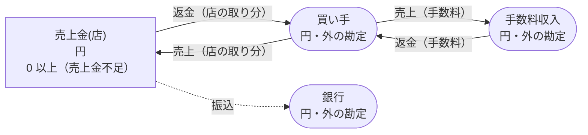
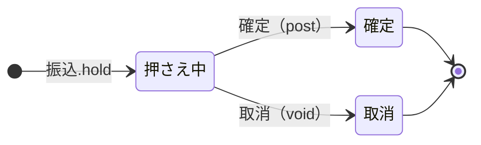

<!-- `chobo doc examples/marketplace/marketplace.ja.book --lang ja` の出力です。手で編集しないでください。 -->

# マーケットプレイス v1

店ごとに売上金を持つ。売上は、買い手が払った額を店の売上金と手数料に分ける（額は呼ぶ側が計算して渡す。手数料は規則が決める）。振込は銀行が受け付けるまで押さえ、返金は両方を戻す

`chobo doc` が `examples/marketplace/marketplace.ja.book` から作ったページ。勘定ごとに残高を持ち、残高は入った量から出た量を引いたもの。どの振替も勘定の下限と上限を守り、守れない振替は、その境界に付けた名前で断られて、どの移動も行われない。振替には、すぐに動かすもの（`do`）と、動かす量をまず押さえるもの（`hold`）がある。押さえた分は、あとで確定される（`post`。全部か一部）か、取り消される（`void`）か、有効期限で切れる。

## 勘定

| 勘定 | 分け方 | 単位 | 境界 | 説明 |
|---|---|---|---|---|
| `売上金` | `店` ごと | 円 | 0 以上。下回る振替は `売上金不足` で断る | マーケットプレイスが店に払う分 |
| `買い手` | 一つだけ | 円 | 外の勘定。境界は無く、マイナスにもなる |  |
| `手数料収入` | 一つだけ | 円 | 外の勘定。境界は無く、マイナスにもなる |  |
| `銀行` | 一つだけ | 円 | 外の勘定。境界は無く、マイナスにもなる |  |

## 勘定のあいだの流れ



四角は勘定で、矢印は振替の移動。角の丸い四角は外の勘定で、境界を持たない。破線の矢印は仮押さえの振替で、まず押さえ、確定したときに動く。

## 振替

### 売上

店の取り分と手数料を足すと、買い手が払った額になる。手数料は呼ぶ側が計算する

- 移動は 2 つ。書いた順に行い、どれか一つでも断られたら、どれも行わない:
    1. `買い手` から `売上金(店)` へ `店の取り分`
    2. `買い手` から `手数料収入` へ `手数料`
- キー: `注文` ごとに一回。同じ呼び出しの二度目は何もせず、`done_before` を返す。`店`、`店の取り分` か `手数料` だけが違う二度目は `key_conflict` で断られる。
- すぐに動かす（`do`）。

| 操作 | 断られうる理由 | いつ |
|---|---|---|
| `売上.do` | `key_conflict` | `注文` が同じで、ほかの引数が違う呼び出しが、前に済んでいる |

<details><summary>断られる例</summary>

#### 売上.do: key_conflict

```text
 1  売上.do(注文: 注文-1, 店: 店-2, 店の取り分: 1, 手数料: 2)  通る
 2  売上.do(注文: 注文-1, 店: 店-2, 店の取り分: 3, 手数料: 2)  key_conflict で断られる
```

</details>

### 返金

手数料と店の取り分を、両方とも戻すか、どちらも戻さない

- 移動は 2 つ。書いた順に行い、どれか一つでも断られたら、どれも行わない:
    1. `手数料収入` から `買い手` へ `手数料`
    2. `売上金(店)` から `買い手` へ `店の取り分`
- キー: `返金番号` ごとに一回。同じ呼び出しの二度目は何もせず、`done_before` を返す。`店`、`店の取り分` か `手数料` だけが違う二度目は `key_conflict` で断られる。
- すぐに動かす（`do`）。

| 操作 | 断られうる理由 | いつ |
|---|---|---|
| `返金.do` | `売上金不足` | 2 つ目の移動で `売上金(店)` が 0 を下回る |
| `返金.do` | `key_conflict` | `返金番号` が同じで、ほかの引数が違う呼び出しが、前に済んでいる |
| `返金.do` | `already_refused` | `返金番号` が同じ呼び出しが、前に境界で断られている。境界で断られたキーは、あとで足りるようになっても通らない |

<details><summary>断られる例</summary>

#### 返金.do: 売上金不足

```text
 1  返金.do(返金番号: 返金番号-1, 店: 店-2, 店の取り分: 1, 手数料: 2)  売上金不足 で断られる（2 つ目の移動が 売上金(店-2) から 1 を取る。確定 0、出ていく仮押さえ 0）
```

#### 返金.do: key_conflict

```text
 1  売上.do(注文: 注文-1, 店: 店-2, 店の取り分: 1, 手数料: 3)          通る
 2  返金.do(返金番号: 返金番号-3, 店: 店-2, 店の取り分: 1, 手数料: 2)  通る
 3  返金.do(返金番号: 返金番号-3, 店: 店-2, 店の取り分: 4, 手数料: 2)  key_conflict で断られる
```

#### 返金.do: already_refused

```text
 1  返金.do(返金番号: 返金番号-1, 店: 店-2, 店の取り分: 1, 手数料: 2)  売上金不足 で断られる（2 つ目の移動が 売上金(店-2) から 1 を取る。確定 0、出ていく仮押さえ 0）
 2  返金.do(返金番号: 返金番号-1, 店: 店-2, 店の取り分: 1, 手数料: 2)  already_refused で断られる
```

</details>

### 振込

銀行振込を始めたときに押さえる。銀行が受け付けたら確定し、失敗したら取り消す

- 移動: `売上金(店)` から `銀行` へ `額`。
- キー: `振込番号` ごとに一回。同じ呼び出しの二度目は何もせず、`done_before` を返す。`店` か `額` だけが違う二度目は `key_conflict` で断られる。押さえが終わったあとに同じキーで押さえ直すと `done_before` になり、何も押さえない。
- 仮押さえ: まず押さえる。確定と取消は呼ぶ側がする。期限は無く、どちらかが来るまで押さえたまま。



| 仮押さえの状態 | post（確定） | void（取消） |
|---|---|---|
| 押さえ中 | 確定する。額を渡せばその額、渡さなければ全額で、残りは元に戻る。押さえた額を超えれば `over_hold` で断る | 取り消す。押さえた量は元に戻る |
| 確定 | 同じ額なら `done_before`、違う額なら `key_conflict` で断る | `already_posted` で断る |
| 取消 | `already_voided` で断る | `done_before` |
| 仮押さえが無い | `no_such_hold` で断る | `no_such_hold` で断る |

| 操作 | 断られうる理由 | いつ |
|---|---|---|
| `振込.hold` | `売上金不足` | `売上金(店)` が 0 を下回る |
| `振込.hold` | `key_conflict` | `振込番号` が同じで、ほかの引数が違う呼び出しが、前に済んでいる |
| `振込.hold` | `already_refused` | `振込番号` が同じ呼び出しが、前に境界で断られている。境界で断られたキーは、あとで足りるようになっても通らない |
| `振込.post` | `key_conflict` | 仮押さえは、違う額で確定済み |
| `振込.post` | `already_voided` | 仮押さえはもう取り消されている |
| `振込.post` | `over_hold` | 押さえた額より多く確定しようとした |
| `振込.post` | `no_such_hold` | その `振込番号` の仮押さえが無い |
| `振込.void` | `already_posted` | 仮押さえはもう確定している |
| `振込.void` | `no_such_hold` | その `振込番号` の仮押さえが無い |

<details><summary>断られる例</summary>

#### 振込.hold: 売上金不足

```text
 1  振込.hold(振込番号: 振込番号-1, 店: 店-2, 額: 1)  売上金不足 で断られる（1 つ目の移動が 売上金(店-2) から 1 を取る。確定 0、出ていく仮押さえ 0）
```

#### 振込.hold: key_conflict

```text
 1  売上.do(注文: 注文-1, 店: 店-2, 店の取り分: 1, 手数料: 2)  通る
 2  振込.hold(振込番号: 振込番号-3, 店: 店-2, 額: 1)           通る
 3  振込.hold(振込番号: 振込番号-3, 店: 店-2, 額: 3)           key_conflict で断られる
```

#### 振込.hold: already_refused

```text
 1  振込.hold(振込番号: 振込番号-1, 店: 店-2, 額: 1)  売上金不足 で断られる（1 つ目の移動が 売上金(店-2) から 1 を取る。確定 0、出ていく仮押さえ 0）
 2  振込.hold(振込番号: 振込番号-1, 店: 店-2, 額: 1)  already_refused で断られる
```

#### 振込.post: key_conflict

```text
 1  売上.do(注文: 注文-1, 店: 店-2, 店の取り分: 2, 手数料: 3)  通る
 2  振込.hold(振込番号: 振込番号-3, 店: 店-2, 額: 2)           通る
 3  振込.post(振込番号: 振込番号-3)                            通る
 4  振込.post(振込番号: 振込番号-3, 額: 1)                     key_conflict で断られる
```

#### 振込.post: already_voided

```text
 1  売上.do(注文: 注文-1, 店: 店-2, 店の取り分: 2, 手数料: 3)  通る
 2  振込.hold(振込番号: 振込番号-3, 店: 店-2, 額: 2)           通る
 3  振込.void(振込番号: 振込番号-3)                            通る
 4  振込.post(振込番号: 振込番号-3)                            already_voided で断られる
```

#### 振込.post: over_hold

```text
 1  売上.do(注文: 注文-1, 店: 店-2, 店の取り分: 2, 手数料: 3)  通る
 2  振込.hold(振込番号: 振込番号-3, 店: 店-2, 額: 2)           通る
 3  振込.post(振込番号: 振込番号-3, 額: 3)                     over_hold で断られる
```

#### 振込.post: no_such_hold

```text
 1  振込.post(振込番号: 振込番号-1)  no_such_hold で断られる
```

#### 振込.void: already_posted

```text
 1  売上.do(注文: 注文-1, 店: 店-2, 店の取り分: 2, 手数料: 3)  通る
 2  振込.hold(振込番号: 振込番号-3, 店: 店-2, 額: 2)           通る
 3  振込.post(振込番号: 振込番号-3)                            通る
 4  振込.void(振込番号: 振込番号-3)                            already_posted で断られる
```

#### 振込.void: no_such_hold

```text
 1  振込.void(振込番号: 振込番号-1)  no_such_hold で断られる
```

</details>

## シナリオ

`chobo scenarios` が帳簿から作ったシナリオ 25 本。境界の手前・ちょうど・超える、同じキーの二度目、仮押さえの終わり方、二つの呼び出し元が同時に最後の一つを取りに来るもの、などがある。どれも参照インタプリタで流し、ステップごとに、そのあとの残高を載せる。残高は確定した量で、仮押さえがあれば括弧の中に書く。

<details><summary>1. 境界: 返金.do の 2 つ目の移動が 売上金(店) を 1 まで減らす。<code>at least 0</code> の 1 つ手前</summary>

| # | 操作 | 結果 | 売上金(店-2) | 買い手 | 手数料収入 |
|---|---|---|---|---|---|
| 1 | 売上.do(注文: 注文-1, 店: 店-2, 店の取り分: 2, 手数料: 3) | 通る | 2 | -5 | 3 |
| 2 | 返金.do(返金番号: 返金番号-3, 店: 店-2, 店の取り分: 1, 手数料: 2) | 通る | 1 | -2 | 1 |

</details>

<details><summary>2. 境界: 返金.do の 2 つ目の移動が 売上金(店) をちょうど 0 まで減らす。<code>at least 0</code> ちょうど</summary>

| # | 操作 | 結果 | 売上金(店-2) | 買い手 | 手数料収入 |
|---|---|---|---|---|---|
| 1 | 売上.do(注文: 注文-1, 店: 店-2, 店の取り分: 2, 手数料: 3) | 通る | 2 | -5 | 3 |
| 2 | 返金.do(返金番号: 返金番号-3, 店: 店-2, 店の取り分: 2, 手数料: 1) | 通る | 0 | -2 | 2 |

</details>

<details><summary>3. 境界: 返金.do の 2 つ目の移動は 売上金(店) を -1 まで減らすので断られる。<code>at least 0</code> を割る</summary>

| # | 操作 | 結果 | 売上金(店-2) | 買い手 | 手数料収入 |
|---|---|---|---|---|---|
| 1 | 売上.do(注文: 注文-1, 店: 店-2, 店の取り分: 2, 手数料: 4) | 通る | 2 | -6 | 4 |
| 2 | 返金.do(返金番号: 返金番号-3, 店: 店-2, 店の取り分: 3, 手数料: 1) | 売上金不足 で断られる | 2 | -6 | 4 |

</details>

<details><summary>4. 境界: 振込.hold が 売上金(店) を 1 まで減らす。<code>at least 0</code> の 1 つ手前</summary>

| # | 操作 | 結果 | 売上金(店-2) | 買い手 | 手数料収入 | 銀行 |
|---|---|---|---|---|---|---|
| 1 | 売上.do(注文: 注文-1, 店: 店-2, 店の取り分: 2, 手数料: 3) | 通る | 2 | -5 | 3 | 0 |
| 2 | 振込.hold(振込番号: 振込番号-3, 店: 店-2, 額: 1) | 通る | 2（出ていく仮押さえ 1） | -5 | 3 | 0（入ってくる仮押さえ 1） |

</details>

<details><summary>5. 境界: 振込.hold が 売上金(店) をちょうど 0 まで減らす。<code>at least 0</code> ちょうど</summary>

| # | 操作 | 結果 | 売上金(店-2) | 買い手 | 手数料収入 | 銀行 |
|---|---|---|---|---|---|---|
| 1 | 売上.do(注文: 注文-1, 店: 店-2, 店の取り分: 2, 手数料: 1) | 通る | 2 | -3 | 1 | 0 |
| 2 | 振込.hold(振込番号: 振込番号-3, 店: 店-2, 額: 2) | 通る | 2（出ていく仮押さえ 2） | -3 | 1 | 0（入ってくる仮押さえ 2） |

</details>

<details><summary>6. 境界: 振込.hold は 売上金(店) を -1 まで減らすので断られる。<code>at least 0</code> を割る</summary>

| # | 操作 | 結果 | 売上金(店-2) | 買い手 | 手数料収入 | 銀行 |
|---|---|---|---|---|---|---|
| 1 | 売上.do(注文: 注文-1, 店: 店-2, 店の取り分: 2, 手数料: 1) | 通る | 2 | -3 | 1 | 0 |
| 2 | 振込.hold(振込番号: 振込番号-3, 店: 店-2, 額: 3) | 売上金不足 で断られる | 2 | -3 | 1 | 0 |

</details>

<details><summary>7. キー: 売上.do を同じ引数で二度呼ぶ</summary>

| # | 操作 | 結果 | 売上金(店-2) | 買い手 | 手数料収入 |
|---|---|---|---|---|---|
| 1 | 売上.do(注文: 注文-1, 店: 店-2, 店の取り分: 1, 手数料: 2) | 通る | 1 | -3 | 2 |
| 2 | 売上.do(注文: 注文-1, 店: 店-2, 店の取り分: 1, 手数料: 2) | done_before（前に済んでいる） | 1 | -3 | 2 |

</details>

<details><summary>8. キー: 売上.do を 店の取り分 だけ変えてもう一度呼ぶ</summary>

| # | 操作 | 結果 | 売上金(店-2) | 買い手 | 手数料収入 |
|---|---|---|---|---|---|
| 1 | 売上.do(注文: 注文-1, 店: 店-2, 店の取り分: 1, 手数料: 2) | 通る | 1 | -3 | 2 |
| 2 | 売上.do(注文: 注文-1, 店: 店-2, 店の取り分: 3, 手数料: 2) | key_conflict で断られる | 1 | -3 | 2 |

</details>

<details><summary>9. キー: 返金.do を同じ引数で二度呼ぶ</summary>

| # | 操作 | 結果 | 売上金(店-2) | 買い手 | 手数料収入 |
|---|---|---|---|---|---|
| 1 | 売上.do(注文: 注文-1, 店: 店-2, 店の取り分: 1, 手数料: 3) | 通る | 1 | -4 | 3 |
| 2 | 返金.do(返金番号: 返金番号-3, 店: 店-2, 店の取り分: 1, 手数料: 2) | 通る | 0 | -1 | 1 |
| 3 | 返金.do(返金番号: 返金番号-3, 店: 店-2, 店の取り分: 1, 手数料: 2) | done_before（前に済んでいる） | 0 | -1 | 1 |

</details>

<details><summary>10. キー: 返金.do を 店の取り分 だけ変えてもう一度呼ぶ</summary>

| # | 操作 | 結果 | 売上金(店-2) | 買い手 | 手数料収入 |
|---|---|---|---|---|---|
| 1 | 売上.do(注文: 注文-1, 店: 店-2, 店の取り分: 1, 手数料: 3) | 通る | 1 | -4 | 3 |
| 2 | 返金.do(返金番号: 返金番号-3, 店: 店-2, 店の取り分: 1, 手数料: 2) | 通る | 0 | -1 | 1 |
| 3 | 返金.do(返金番号: 返金番号-3, 店: 店-2, 店の取り分: 4, 手数料: 2) | key_conflict で断られる | 0 | -1 | 1 |

</details>

<details><summary>11. キー: 返金.do が 売上金不足 で断られ、同じ引数でもう一度、売上金(店) が足りるようになってからもう一度呼ぶ</summary>

| # | 操作 | 結果 | 売上金(店-2) | 買い手 | 手数料収入 |
|---|---|---|---|---|---|
| 1 | 返金.do(返金番号: 返金番号-1, 店: 店-2, 店の取り分: 1, 手数料: 2) | 売上金不足 で断られる | 0 | 0 | 0 |
| 2 | 返金.do(返金番号: 返金番号-1, 店: 店-2, 店の取り分: 1, 手数料: 2) | already_refused で断られる | 0 | 0 | 0 |
| 3 | 売上.do(注文: 注文-3, 店: 店-2, 店の取り分: 1, 手数料: 3) | 通る | 1 | -4 | 3 |
| 4 | 返金.do(返金番号: 返金番号-1, 店: 店-2, 店の取り分: 1, 手数料: 2) | already_refused で断られる | 1 | -4 | 3 |

</details>

<details><summary>12. キー: 振込.hold を同じ引数で二度呼ぶ</summary>

| # | 操作 | 結果 | 売上金(店-2) | 買い手 | 手数料収入 | 銀行 |
|---|---|---|---|---|---|---|
| 1 | 売上.do(注文: 注文-1, 店: 店-2, 店の取り分: 1, 手数料: 2) | 通る | 1 | -3 | 2 | 0 |
| 2 | 振込.hold(振込番号: 振込番号-3, 店: 店-2, 額: 1) | 通る | 1（出ていく仮押さえ 1） | -3 | 2 | 0（入ってくる仮押さえ 1） |
| 3 | 振込.hold(振込番号: 振込番号-3, 店: 店-2, 額: 1) | done_before（前に済んでいる） | 1（出ていく仮押さえ 1） | -3 | 2 | 0（入ってくる仮押さえ 1） |

</details>

<details><summary>13. キー: 振込.hold を 額 だけ変えてもう一度呼ぶ</summary>

| # | 操作 | 結果 | 売上金(店-2) | 買い手 | 手数料収入 | 銀行 |
|---|---|---|---|---|---|---|
| 1 | 売上.do(注文: 注文-1, 店: 店-2, 店の取り分: 1, 手数料: 2) | 通る | 1 | -3 | 2 | 0 |
| 2 | 振込.hold(振込番号: 振込番号-3, 店: 店-2, 額: 1) | 通る | 1（出ていく仮押さえ 1） | -3 | 2 | 0（入ってくる仮押さえ 1） |
| 3 | 振込.hold(振込番号: 振込番号-3, 店: 店-2, 額: 3) | key_conflict で断られる | 1（出ていく仮押さえ 1） | -3 | 2 | 0（入ってくる仮押さえ 1） |

</details>

<details><summary>14. キー: 振込.hold が 売上金不足 で断られ、同じ引数でもう一度、売上金(店) が足りるようになってからもう一度呼ぶ</summary>

| # | 操作 | 結果 | 売上金(店-2) | 買い手 | 手数料収入 | 銀行 |
|---|---|---|---|---|---|---|
| 1 | 振込.hold(振込番号: 振込番号-1, 店: 店-2, 額: 1) | 売上金不足 で断られる | 0 | 0 | 0 | 0 |
| 2 | 振込.hold(振込番号: 振込番号-1, 店: 店-2, 額: 1) | already_refused で断られる | 0 | 0 | 0 | 0 |
| 3 | 売上.do(注文: 注文-3, 店: 店-2, 店の取り分: 1, 手数料: 2) | 通る | 1 | -3 | 2 | 0 |
| 4 | 振込.hold(振込番号: 振込番号-1, 店: 店-2, 額: 1) | already_refused で断られる | 1 | -3 | 2 | 0 |

</details>

<details><summary>15. 仮押さえ: 振込 を全額で確定する</summary>

| # | 操作 | 結果 | 売上金(店-2) | 買い手 | 手数料収入 | 銀行 |
|---|---|---|---|---|---|---|
| 1 | 売上.do(注文: 注文-1, 店: 店-2, 店の取り分: 2, 手数料: 3) | 通る | 2 | -5 | 3 | 0 |
| 2 | 振込.hold(振込番号: 振込番号-3, 店: 店-2, 額: 2) | 通る | 2（出ていく仮押さえ 2） | -5 | 3 | 0（入ってくる仮押さえ 2） |
| 3 | 振込.post(振込番号: 振込番号-3) | 通る | 0 | -5 | 3 | 2 |

</details>

<details><summary>16. 仮押さえ: 振込 を一部だけ確定する</summary>

| # | 操作 | 結果 | 売上金(店-2) | 買い手 | 手数料収入 | 銀行 |
|---|---|---|---|---|---|---|
| 1 | 売上.do(注文: 注文-1, 店: 店-2, 店の取り分: 2, 手数料: 3) | 通る | 2 | -5 | 3 | 0 |
| 2 | 振込.hold(振込番号: 振込番号-3, 店: 店-2, 額: 2) | 通る | 2（出ていく仮押さえ 2） | -5 | 3 | 0（入ってくる仮押さえ 2） |
| 3 | 振込.post(振込番号: 振込番号-3, 額: 1) | 通る | 1 | -5 | 3 | 1 |

</details>

<details><summary>17. 仮押さえ: 振込 を取り消す</summary>

| # | 操作 | 結果 | 売上金(店-2) | 買い手 | 手数料収入 | 銀行 |
|---|---|---|---|---|---|---|
| 1 | 売上.do(注文: 注文-1, 店: 店-2, 店の取り分: 2, 手数料: 3) | 通る | 2 | -5 | 3 | 0 |
| 2 | 振込.hold(振込番号: 振込番号-3, 店: 店-2, 額: 2) | 通る | 2（出ていく仮押さえ 2） | -5 | 3 | 0（入ってくる仮押さえ 2） |
| 3 | 振込.void(振込番号: 振込番号-3) | 通る | 2 | -5 | 3 | 0 |

</details>

<details><summary>18. 仮押さえ: 振込 を確定してから取り消そうとする</summary>

| # | 操作 | 結果 | 売上金(店-2) | 買い手 | 手数料収入 | 銀行 |
|---|---|---|---|---|---|---|
| 1 | 売上.do(注文: 注文-1, 店: 店-2, 店の取り分: 2, 手数料: 3) | 通る | 2 | -5 | 3 | 0 |
| 2 | 振込.hold(振込番号: 振込番号-3, 店: 店-2, 額: 2) | 通る | 2（出ていく仮押さえ 2） | -5 | 3 | 0（入ってくる仮押さえ 2） |
| 3 | 振込.post(振込番号: 振込番号-3) | 通る | 0 | -5 | 3 | 2 |
| 4 | 振込.void(振込番号: 振込番号-3) | already_posted で断られる | 0 | -5 | 3 | 2 |

</details>

<details><summary>19. 仮押さえ: 振込 を取り消してから確定しようとする</summary>

| # | 操作 | 結果 | 売上金(店-2) | 買い手 | 手数料収入 | 銀行 |
|---|---|---|---|---|---|---|
| 1 | 売上.do(注文: 注文-1, 店: 店-2, 店の取り分: 2, 手数料: 3) | 通る | 2 | -5 | 3 | 0 |
| 2 | 振込.hold(振込番号: 振込番号-3, 店: 店-2, 額: 2) | 通る | 2（出ていく仮押さえ 2） | -5 | 3 | 0（入ってくる仮押さえ 2） |
| 3 | 振込.void(振込番号: 振込番号-3) | 通る | 2 | -5 | 3 | 0 |
| 4 | 振込.post(振込番号: 振込番号-3) | already_voided で断られる | 2 | -5 | 3 | 0 |

</details>

<details><summary>20. 仮押さえ: 振込 を押さえた額より多く確定しようとし、押さえた額で確定する</summary>

| # | 操作 | 結果 | 売上金(店-2) | 買い手 | 手数料収入 | 銀行 |
|---|---|---|---|---|---|---|
| 1 | 売上.do(注文: 注文-1, 店: 店-2, 店の取り分: 2, 手数料: 3) | 通る | 2 | -5 | 3 | 0 |
| 2 | 振込.hold(振込番号: 振込番号-3, 店: 店-2, 額: 2) | 通る | 2（出ていく仮押さえ 2） | -5 | 3 | 0（入ってくる仮押さえ 2） |
| 3 | 振込.post(振込番号: 振込番号-3, 額: 3) | over_hold で断られる | 2（出ていく仮押さえ 2） | -5 | 3 | 0（入ってくる仮押さえ 2） |
| 4 | 振込.post(振込番号: 振込番号-3, 額: 2) | 通る | 0 | -5 | 3 | 2 |

</details>

<details><summary>21. 仮押さえ: 振込 を押さえる前に確定しようとし、押さえてから確定する</summary>

| # | 操作 | 結果 | 売上金(店-2) | 買い手 | 手数料収入 | 銀行 |
|---|---|---|---|---|---|---|
| 1 | 振込.post(振込番号: 振込番号-1) | no_such_hold で断られる | 0 | 0 | 0 | 0 |
| 2 | 売上.do(注文: 注文-1, 店: 店-2, 店の取り分: 1, 手数料: 2) | 通る | 1 | -3 | 2 | 0 |
| 3 | 振込.hold(振込番号: 振込番号-1, 店: 店-2, 額: 1) | 通る | 1（出ていく仮押さえ 1） | -3 | 2 | 0（入ってくる仮押さえ 1） |
| 4 | 振込.post(振込番号: 振込番号-1) | 通る | 0 | -3 | 2 | 1 |

</details>

<details><summary>22. 仮押さえ: 振込 を二度確定する。同じ額で、そして違う額で</summary>

| # | 操作 | 結果 | 売上金(店-2) | 買い手 | 手数料収入 | 銀行 |
|---|---|---|---|---|---|---|
| 1 | 売上.do(注文: 注文-1, 店: 店-2, 店の取り分: 2, 手数料: 3) | 通る | 2 | -5 | 3 | 0 |
| 2 | 振込.hold(振込番号: 振込番号-3, 店: 店-2, 額: 2) | 通る | 2（出ていく仮押さえ 2） | -5 | 3 | 0（入ってくる仮押さえ 2） |
| 3 | 振込.post(振込番号: 振込番号-3) | 通る | 0 | -5 | 3 | 2 |
| 4 | 振込.post(振込番号: 振込番号-3) | done_before（前に済んでいる） | 0 | -5 | 3 | 2 |
| 5 | 振込.post(振込番号: 振込番号-3, 額: 2) | done_before（前に済んでいる） | 0 | -5 | 3 | 2 |
| 6 | 振込.post(振込番号: 振込番号-3, 額: 1) | key_conflict で断られる | 0 | -5 | 3 | 2 |

</details>

<details><summary>23. 移動: 返金.do が 2 つ目の移動（売上金(店)）で断られ、どの移動も行われない</summary>

| # | 操作 | 結果 | 売上金(店-2) | 買い手 | 手数料収入 |
|---|---|---|---|---|---|
| 1 | 返金.do(返金番号: 返金番号-1, 店: 店-2, 店の取り分: 1, 手数料: 2) | 売上金不足 で断られる | 0 | 0 | 0 |

</details>

<details><summary>24. 同時: 二つの呼び出し元が 返金.do で 売上金(店) の最後の 1 を取り合う</summary>

同時の操作の順序によって、結果は 2 通りある。

結果 1:

| # | 操作 | 結果 | 売上金(店-2) | 買い手 | 手数料収入 |
|---|---|---|---|---|---|
| 1 | 売上.do(注文: 注文-1, 店: 店-2, 店の取り分: 1, 手数料: 4) | 通る | 1 | -5 | 4 |
| 2 | together<br>呼び出し元 1: 返金.do(返金番号: 返金番号-3, 店: 店-2, 店の取り分: 1, 手数料: 2)<br>呼び出し元 2: 返金.do(返金番号: 返金番号-4, 店: 店-2, 店の取り分: 1, 手数料: 3) | <br>通る<br>売上金不足 で断られる | 0 | -2 | 2 |

結果 2:

| # | 操作 | 結果 | 売上金(店-2) | 買い手 | 手数料収入 |
|---|---|---|---|---|---|
| 1 | 売上.do(注文: 注文-1, 店: 店-2, 店の取り分: 1, 手数料: 4) | 通る | 1 | -5 | 4 |
| 2 | together<br>呼び出し元 1: 返金.do(返金番号: 返金番号-3, 店: 店-2, 店の取り分: 1, 手数料: 2)<br>呼び出し元 2: 返金.do(返金番号: 返金番号-4, 店: 店-2, 店の取り分: 1, 手数料: 3) | <br>売上金不足 で断られる<br>通る | 0 | -1 | 1 |

</details>

<details><summary>25. 同時: 二つの呼び出し元が 振込.hold で 売上金(店) の最後の 1 を取り合う</summary>

同時の操作の順序によって、結果は 2 通りある。

結果 1:

| # | 操作 | 結果 | 売上金(店-2) | 買い手 | 手数料収入 | 銀行 |
|---|---|---|---|---|---|---|
| 1 | 売上.do(注文: 注文-1, 店: 店-2, 店の取り分: 1, 手数料: 2) | 通る | 1 | -3 | 2 | 0 |
| 2 | together<br>呼び出し元 1: 振込.hold(振込番号: 振込番号-3, 店: 店-2, 額: 1)<br>呼び出し元 2: 振込.hold(振込番号: 振込番号-4, 店: 店-2, 額: 1) | <br>通る<br>売上金不足 で断られる | 1（出ていく仮押さえ 1） | -3 | 2 | 0（入ってくる仮押さえ 1） |

結果 2:

| # | 操作 | 結果 | 売上金(店-2) | 買い手 | 手数料収入 | 銀行 |
|---|---|---|---|---|---|---|
| 1 | 売上.do(注文: 注文-1, 店: 店-2, 店の取り分: 1, 手数料: 2) | 通る | 1 | -3 | 2 | 0 |
| 2 | together<br>呼び出し元 1: 振込.hold(振込番号: 振込番号-3, 店: 店-2, 額: 1)<br>呼び出し元 2: 振込.hold(振込番号: 振込番号-4, 店: 店-2, 額: 1) | <br>売上金不足 で断られる<br>通る | 1（出ていく仮押さえ 1） | -3 | 2 | 0（入ってくる仮押さえ 1） |

</details>

