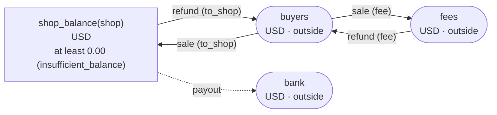
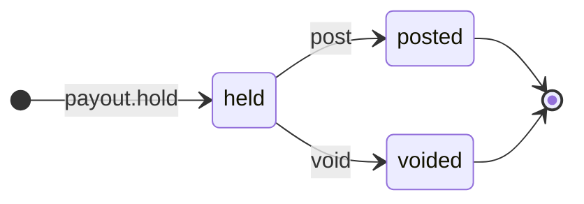

<!-- The output of `chobo doc examples/marketplace/marketplace.book`. Do not edit by hand. -->

# marketplace v1

The marketplace keeps a balance for each shop. A sale splits what the buyer paid between the shop's balance and the marketplace's fee, in amounts the caller works out (a rule decides the fee). A payout is held until the bank confirms it, and a refund takes both parts back

`examples/marketplace/marketplace.book`, as `chobo doc` writes it. Each account keeps a balance: what came in, less what went out. Every transfer keeps the bounds of the accounts: one that would break a bound is refused with the name the book gives that bound, and nothing of it moves. A transfer either moves at once (`do`), or first holds what it moves (`hold`); a hold is then posted (`post`, all of it or part), voided (`void`), or expires.

## Accounts

| Account | One for each | Unit | Bounds | What it is |
|---|---|---|---|---|
| `shop_balance` | `shop` | USD | at least 0.00; a transfer that would go below is refused with `insufficient_balance` | what the marketplace owes the shop |
| `buyers` | one account | USD | outside the book: no bounds, and it may go below 0 |  |
| `fees` | one account | USD | outside the book: no bounds, and it may go below 0 |  |
| `bank` | one account | USD | outside the book: no bounds, and it may go below 0 |  |

## How things move



A box is an account, and an arrow a move of a transfer. A rounded box is an account outside the book, which has no bounds. A dashed arrow belongs to a transfer that holds first, and moves when the hold is posted.

## Transfers

### sale

to_shop and fee add up to what the buyer paid; the caller works out the fee

- 2 moves, made in this order, all or none:
    1. `to_shop` from `buyers` to `shop_balance(shop)`
    2. `fee` from `buyers` to `fees`
- Key: once per `order`. The same call again does nothing, and answers `done_before`; one that differs only in `shop`, `to_shop` or `fee` is refused with `key_conflict`.
- Moves at once (`do`).

| Operation | May be refused with | When |
|---|---|---|
| `sale.do` | `key_conflict` | a call with the same `order` and other arguments came before |

<details><summary>How each refusal comes about</summary>

#### sale.do: key_conflict

```text
 1  sale.do(order: order-1, shop: shop-2, to_shop: 0.01, fee: 0.02)  done
 2  sale.do(order: order-1, shop: shop-2, to_shop: 0.03, fee: 0.02)  refused: key_conflict
```

</details>

### refund

gives back the fee and the shop's part, both or neither

- 2 moves, made in this order, all or none:
    1. `fee` from `fees` to `buyers`
    2. `to_shop` from `shop_balance(shop)` to `buyers`
- Key: once per `refund_id`. The same call again does nothing, and answers `done_before`; one that differs only in `shop`, `to_shop` or `fee` is refused with `key_conflict`.
- Moves at once (`do`).

| Operation | May be refused with | When |
|---|---|---|
| `refund.do` | `insufficient_balance` | move 2 would take `shop_balance(shop)` below 0.00 |
| `refund.do` | `key_conflict` | a call with the same `refund_id` and other arguments came before |
| `refund.do` | `already_refused` | a call with the same `refund_id` was refused by a bound before; a key a bound refused stays refused, even once there is enough |

<details><summary>How each refusal comes about</summary>

#### refund.do: insufficient_balance

```text
 1  refund.do(refund_id: refund_id-1, shop: shop-2, to_shop: 0.01, fee: 0.02)  refused: insufficient_balance (move 2 takes 0.01 from shop_balance(shop-2): posted 0.00, held out 0.00)
```

#### refund.do: key_conflict

```text
 1  sale.do(order: order-1, shop: shop-2, to_shop: 0.01, fee: 0.03)            done
 2  refund.do(refund_id: refund_id-3, shop: shop-2, to_shop: 0.01, fee: 0.02)  done
 3  refund.do(refund_id: refund_id-3, shop: shop-2, to_shop: 0.04, fee: 0.02)  refused: key_conflict
```

#### refund.do: already_refused

```text
 1  refund.do(refund_id: refund_id-1, shop: shop-2, to_shop: 0.01, fee: 0.02)  refused: insufficient_balance (move 2 takes 0.01 from shop_balance(shop-2): posted 0.00, held out 0.00)
 2  refund.do(refund_id: refund_id-1, shop: shop-2, to_shop: 0.01, fee: 0.02)  refused: already_refused
```

</details>

### payout

held when the bank transfer starts: posted when the bank confirms it, voided when it fails

- Moves `amount` from `shop_balance(shop)` to `bank`.
- Key: once per `payout_id`. The same call again does nothing, and answers `done_before`; one that differs only in `shop` or `amount` is refused with `key_conflict`; holding again with the same key after the hold has ended answers `done_before`, and holds nothing.
- Holds first: the caller posts or voids the hold. It never expires, and stays held until one of them comes.



| The hold | post | void |
|---|---|---|
| held | posts it: the amounts given, or all of it, and the rest goes back; more than it holds is refused with `over_hold` | voids it: what it holds goes back |
| posted | `done_before` with the same amounts; refused with `key_conflict` with others | refused with `already_posted` |
| voided | refused with `already_voided` | `done_before` |
| no hold with the key | refused with `no_such_hold` | refused with `no_such_hold` |

| Operation | May be refused with | When |
|---|---|---|
| `payout.hold` | `insufficient_balance` | `shop_balance(shop)` would go below 0.00 |
| `payout.hold` | `key_conflict` | a call with the same `payout_id` and other arguments came before |
| `payout.hold` | `already_refused` | a call with the same `payout_id` was refused by a bound before; a key a bound refused stays refused, even once there is enough |
| `payout.post` | `key_conflict` | the hold was posted before, for other amounts |
| `payout.post` | `already_voided` | the hold is voided already |
| `payout.post` | `over_hold` | more than the hold holds |
| `payout.post` | `no_such_hold` | there is no hold with that `payout_id` |
| `payout.void` | `already_posted` | the hold is posted already |
| `payout.void` | `no_such_hold` | there is no hold with that `payout_id` |

<details><summary>How each refusal comes about</summary>

#### payout.hold: insufficient_balance

```text
 1  payout.hold(payout_id: payout_id-1, shop: shop-2, amount: 0.01)  refused: insufficient_balance (move 1 takes 0.01 from shop_balance(shop-2): posted 0.00, held out 0.00)
```

#### payout.hold: key_conflict

```text
 1  sale.do(order: order-1, shop: shop-2, to_shop: 0.01, fee: 0.02)  done
 2  payout.hold(payout_id: payout_id-3, shop: shop-2, amount: 0.01)  done
 3  payout.hold(payout_id: payout_id-3, shop: shop-2, amount: 0.03)  refused: key_conflict
```

#### payout.hold: already_refused

```text
 1  payout.hold(payout_id: payout_id-1, shop: shop-2, amount: 0.01)  refused: insufficient_balance (move 1 takes 0.01 from shop_balance(shop-2): posted 0.00, held out 0.00)
 2  payout.hold(payout_id: payout_id-1, shop: shop-2, amount: 0.01)  refused: already_refused
```

#### payout.post: key_conflict

```text
 1  sale.do(order: order-1, shop: shop-2, to_shop: 0.02, fee: 0.03)  done
 2  payout.hold(payout_id: payout_id-3, shop: shop-2, amount: 0.02)  done
 3  payout.post(payout_id: payout_id-3)                              done
 4  payout.post(payout_id: payout_id-3, amount: 0.01)                refused: key_conflict
```

#### payout.post: already_voided

```text
 1  sale.do(order: order-1, shop: shop-2, to_shop: 0.02, fee: 0.03)  done
 2  payout.hold(payout_id: payout_id-3, shop: shop-2, amount: 0.02)  done
 3  payout.void(payout_id: payout_id-3)                              done
 4  payout.post(payout_id: payout_id-3)                              refused: already_voided
```

#### payout.post: over_hold

```text
 1  sale.do(order: order-1, shop: shop-2, to_shop: 0.02, fee: 0.03)  done
 2  payout.hold(payout_id: payout_id-3, shop: shop-2, amount: 0.02)  done
 3  payout.post(payout_id: payout_id-3, amount: 0.03)                refused: over_hold
```

#### payout.post: no_such_hold

```text
 1  payout.post(payout_id: payout_id-1)  refused: no_such_hold
```

#### payout.void: already_posted

```text
 1  sale.do(order: order-1, shop: shop-2, to_shop: 0.02, fee: 0.03)  done
 2  payout.hold(payout_id: payout_id-3, shop: shop-2, amount: 0.02)  done
 3  payout.post(payout_id: payout_id-3)                              done
 4  payout.void(payout_id: payout_id-3)                              refused: already_posted
```

#### payout.void: no_such_hold

```text
 1  payout.void(payout_id: payout_id-1)  refused: no_such_hold
```

</details>

## Scenarios

25 scenarios, which `chobo scenarios` makes from the book: among them each bound just before, at and past it, each key used twice, every way a hold ends, and two callers after the last of something at the same time. The reference interpreter ran each one; after each step come the balances it left. A balance is what is posted, with what is held in brackets.

<details><summary>1. bound: refund.do move 2 takes shop_balance(shop) to 0.01, one above <code>at least 0.00</code></summary>

| # | Operation | Result | shop_balance(shop-2) | buyers | fees |
|---|---|---|---|---|---|
| 1 | sale.do(order: order-1, shop: shop-2, to_shop: 0.02, fee: 0.03) | done | 0.02 | -0.05 | 0.03 |
| 2 | refund.do(refund_id: refund_id-3, shop: shop-2, to_shop: 0.01, fee: 0.02) | done | 0.01 | -0.02 | 0.01 |

</details>

<details><summary>2. bound: refund.do move 2 takes shop_balance(shop) to exactly 0.00, its <code>at least 0.00</code></summary>

| # | Operation | Result | shop_balance(shop-2) | buyers | fees |
|---|---|---|---|---|---|
| 1 | sale.do(order: order-1, shop: shop-2, to_shop: 0.02, fee: 0.03) | done | 0.02 | -0.05 | 0.03 |
| 2 | refund.do(refund_id: refund_id-3, shop: shop-2, to_shop: 0.02, fee: 0.01) | done | 0.00 | -0.02 | 0.02 |

</details>

<details><summary>3. bound: refund.do move 2 would take shop_balance(shop) to -0.01, below <code>at least 0.00</code></summary>

| # | Operation | Result | shop_balance(shop-2) | buyers | fees |
|---|---|---|---|---|---|
| 1 | sale.do(order: order-1, shop: shop-2, to_shop: 0.02, fee: 0.04) | done | 0.02 | -0.06 | 0.04 |
| 2 | refund.do(refund_id: refund_id-3, shop: shop-2, to_shop: 0.03, fee: 0.01) | refused: insufficient_balance | 0.02 | -0.06 | 0.04 |

</details>

<details><summary>4. bound: payout.hold takes shop_balance(shop) to 0.01, one above <code>at least 0.00</code></summary>

| # | Operation | Result | shop_balance(shop-2) | buyers | fees | bank |
|---|---|---|---|---|---|---|
| 1 | sale.do(order: order-1, shop: shop-2, to_shop: 0.02, fee: 0.03) | done | 0.02 | -0.05 | 0.03 | 0.00 |
| 2 | payout.hold(payout_id: payout_id-3, shop: shop-2, amount: 0.01) | done | 0.02 (held out 0.01) | -0.05 | 0.03 | 0.00 (held in 0.01) |

</details>

<details><summary>5. bound: payout.hold takes shop_balance(shop) to exactly 0.00, its <code>at least 0.00</code></summary>

| # | Operation | Result | shop_balance(shop-2) | buyers | fees | bank |
|---|---|---|---|---|---|---|
| 1 | sale.do(order: order-1, shop: shop-2, to_shop: 0.02, fee: 0.01) | done | 0.02 | -0.03 | 0.01 | 0.00 |
| 2 | payout.hold(payout_id: payout_id-3, shop: shop-2, amount: 0.02) | done | 0.02 (held out 0.02) | -0.03 | 0.01 | 0.00 (held in 0.02) |

</details>

<details><summary>6. bound: payout.hold would take shop_balance(shop) to -0.01, below <code>at least 0.00</code></summary>

| # | Operation | Result | shop_balance(shop-2) | buyers | fees | bank |
|---|---|---|---|---|---|---|
| 1 | sale.do(order: order-1, shop: shop-2, to_shop: 0.02, fee: 0.01) | done | 0.02 | -0.03 | 0.01 | 0.00 |
| 2 | payout.hold(payout_id: payout_id-3, shop: shop-2, amount: 0.03) | refused: insufficient_balance | 0.02 | -0.03 | 0.01 | 0.00 |

</details>

<details><summary>7. key: sale.do twice with the same arguments</summary>

| # | Operation | Result | shop_balance(shop-2) | buyers | fees |
|---|---|---|---|---|---|
| 1 | sale.do(order: order-1, shop: shop-2, to_shop: 0.01, fee: 0.02) | done | 0.01 | -0.03 | 0.02 |
| 2 | sale.do(order: order-1, shop: shop-2, to_shop: 0.01, fee: 0.02) | done_before | 0.01 | -0.03 | 0.02 |

</details>

<details><summary>8. key: sale.do again with another to_shop</summary>

| # | Operation | Result | shop_balance(shop-2) | buyers | fees |
|---|---|---|---|---|---|
| 1 | sale.do(order: order-1, shop: shop-2, to_shop: 0.01, fee: 0.02) | done | 0.01 | -0.03 | 0.02 |
| 2 | sale.do(order: order-1, shop: shop-2, to_shop: 0.03, fee: 0.02) | refused: key_conflict | 0.01 | -0.03 | 0.02 |

</details>

<details><summary>9. key: refund.do twice with the same arguments</summary>

| # | Operation | Result | shop_balance(shop-2) | buyers | fees |
|---|---|---|---|---|---|
| 1 | sale.do(order: order-1, shop: shop-2, to_shop: 0.01, fee: 0.03) | done | 0.01 | -0.04 | 0.03 |
| 2 | refund.do(refund_id: refund_id-3, shop: shop-2, to_shop: 0.01, fee: 0.02) | done | 0.00 | -0.01 | 0.01 |
| 3 | refund.do(refund_id: refund_id-3, shop: shop-2, to_shop: 0.01, fee: 0.02) | done_before | 0.00 | -0.01 | 0.01 |

</details>

<details><summary>10. key: refund.do again with another to_shop</summary>

| # | Operation | Result | shop_balance(shop-2) | buyers | fees |
|---|---|---|---|---|---|
| 1 | sale.do(order: order-1, shop: shop-2, to_shop: 0.01, fee: 0.03) | done | 0.01 | -0.04 | 0.03 |
| 2 | refund.do(refund_id: refund_id-3, shop: shop-2, to_shop: 0.01, fee: 0.02) | done | 0.00 | -0.01 | 0.01 |
| 3 | refund.do(refund_id: refund_id-3, shop: shop-2, to_shop: 0.04, fee: 0.02) | refused: key_conflict | 0.00 | -0.01 | 0.01 |

</details>

<details><summary>11. key: refund.do refused with insufficient_balance, then again, and again once shop_balance(shop) has enough</summary>

| # | Operation | Result | shop_balance(shop-2) | buyers | fees |
|---|---|---|---|---|---|
| 1 | refund.do(refund_id: refund_id-1, shop: shop-2, to_shop: 0.01, fee: 0.02) | refused: insufficient_balance | 0.00 | 0.00 | 0.00 |
| 2 | refund.do(refund_id: refund_id-1, shop: shop-2, to_shop: 0.01, fee: 0.02) | refused: already_refused | 0.00 | 0.00 | 0.00 |
| 3 | sale.do(order: order-3, shop: shop-2, to_shop: 0.01, fee: 0.03) | done | 0.01 | -0.04 | 0.03 |
| 4 | refund.do(refund_id: refund_id-1, shop: shop-2, to_shop: 0.01, fee: 0.02) | refused: already_refused | 0.01 | -0.04 | 0.03 |

</details>

<details><summary>12. key: payout.hold twice with the same arguments</summary>

| # | Operation | Result | shop_balance(shop-2) | buyers | fees | bank |
|---|---|---|---|---|---|---|
| 1 | sale.do(order: order-1, shop: shop-2, to_shop: 0.01, fee: 0.02) | done | 0.01 | -0.03 | 0.02 | 0.00 |
| 2 | payout.hold(payout_id: payout_id-3, shop: shop-2, amount: 0.01) | done | 0.01 (held out 0.01) | -0.03 | 0.02 | 0.00 (held in 0.01) |
| 3 | payout.hold(payout_id: payout_id-3, shop: shop-2, amount: 0.01) | done_before | 0.01 (held out 0.01) | -0.03 | 0.02 | 0.00 (held in 0.01) |

</details>

<details><summary>13. key: payout.hold again with another amount</summary>

| # | Operation | Result | shop_balance(shop-2) | buyers | fees | bank |
|---|---|---|---|---|---|---|
| 1 | sale.do(order: order-1, shop: shop-2, to_shop: 0.01, fee: 0.02) | done | 0.01 | -0.03 | 0.02 | 0.00 |
| 2 | payout.hold(payout_id: payout_id-3, shop: shop-2, amount: 0.01) | done | 0.01 (held out 0.01) | -0.03 | 0.02 | 0.00 (held in 0.01) |
| 3 | payout.hold(payout_id: payout_id-3, shop: shop-2, amount: 0.03) | refused: key_conflict | 0.01 (held out 0.01) | -0.03 | 0.02 | 0.00 (held in 0.01) |

</details>

<details><summary>14. key: payout.hold refused with insufficient_balance, then again, and again once shop_balance(shop) has enough</summary>

| # | Operation | Result | shop_balance(shop-2) | buyers | fees | bank |
|---|---|---|---|---|---|---|
| 1 | payout.hold(payout_id: payout_id-1, shop: shop-2, amount: 0.01) | refused: insufficient_balance | 0.00 | 0.00 | 0.00 | 0.00 |
| 2 | payout.hold(payout_id: payout_id-1, shop: shop-2, amount: 0.01) | refused: already_refused | 0.00 | 0.00 | 0.00 | 0.00 |
| 3 | sale.do(order: order-3, shop: shop-2, to_shop: 0.01, fee: 0.02) | done | 0.01 | -0.03 | 0.02 | 0.00 |
| 4 | payout.hold(payout_id: payout_id-1, shop: shop-2, amount: 0.01) | refused: already_refused | 0.01 | -0.03 | 0.02 | 0.00 |

</details>

<details><summary>15. hold: payout posted in full</summary>

| # | Operation | Result | shop_balance(shop-2) | buyers | fees | bank |
|---|---|---|---|---|---|---|
| 1 | sale.do(order: order-1, shop: shop-2, to_shop: 0.02, fee: 0.03) | done | 0.02 | -0.05 | 0.03 | 0.00 |
| 2 | payout.hold(payout_id: payout_id-3, shop: shop-2, amount: 0.02) | done | 0.02 (held out 0.02) | -0.05 | 0.03 | 0.00 (held in 0.02) |
| 3 | payout.post(payout_id: payout_id-3) | done | 0.00 | -0.05 | 0.03 | 0.02 |

</details>

<details><summary>16. hold: payout posted in part</summary>

| # | Operation | Result | shop_balance(shop-2) | buyers | fees | bank |
|---|---|---|---|---|---|---|
| 1 | sale.do(order: order-1, shop: shop-2, to_shop: 0.02, fee: 0.03) | done | 0.02 | -0.05 | 0.03 | 0.00 |
| 2 | payout.hold(payout_id: payout_id-3, shop: shop-2, amount: 0.02) | done | 0.02 (held out 0.02) | -0.05 | 0.03 | 0.00 (held in 0.02) |
| 3 | payout.post(payout_id: payout_id-3, amount: 0.01) | done | 0.01 | -0.05 | 0.03 | 0.01 |

</details>

<details><summary>17. hold: payout voided</summary>

| # | Operation | Result | shop_balance(shop-2) | buyers | fees | bank |
|---|---|---|---|---|---|---|
| 1 | sale.do(order: order-1, shop: shop-2, to_shop: 0.02, fee: 0.03) | done | 0.02 | -0.05 | 0.03 | 0.00 |
| 2 | payout.hold(payout_id: payout_id-3, shop: shop-2, amount: 0.02) | done | 0.02 (held out 0.02) | -0.05 | 0.03 | 0.00 (held in 0.02) |
| 3 | payout.void(payout_id: payout_id-3) | done | 0.02 | -0.05 | 0.03 | 0.00 |

</details>

<details><summary>18. hold: payout posted, then voided</summary>

| # | Operation | Result | shop_balance(shop-2) | buyers | fees | bank |
|---|---|---|---|---|---|---|
| 1 | sale.do(order: order-1, shop: shop-2, to_shop: 0.02, fee: 0.03) | done | 0.02 | -0.05 | 0.03 | 0.00 |
| 2 | payout.hold(payout_id: payout_id-3, shop: shop-2, amount: 0.02) | done | 0.02 (held out 0.02) | -0.05 | 0.03 | 0.00 (held in 0.02) |
| 3 | payout.post(payout_id: payout_id-3) | done | 0.00 | -0.05 | 0.03 | 0.02 |
| 4 | payout.void(payout_id: payout_id-3) | refused: already_posted | 0.00 | -0.05 | 0.03 | 0.02 |

</details>

<details><summary>19. hold: payout voided, then posted</summary>

| # | Operation | Result | shop_balance(shop-2) | buyers | fees | bank |
|---|---|---|---|---|---|---|
| 1 | sale.do(order: order-1, shop: shop-2, to_shop: 0.02, fee: 0.03) | done | 0.02 | -0.05 | 0.03 | 0.00 |
| 2 | payout.hold(payout_id: payout_id-3, shop: shop-2, amount: 0.02) | done | 0.02 (held out 0.02) | -0.05 | 0.03 | 0.00 (held in 0.02) |
| 3 | payout.void(payout_id: payout_id-3) | done | 0.02 | -0.05 | 0.03 | 0.00 |
| 4 | payout.post(payout_id: payout_id-3) | refused: already_voided | 0.02 | -0.05 | 0.03 | 0.00 |

</details>

<details><summary>20. hold: payout posted for more than it holds, then for what it holds</summary>

| # | Operation | Result | shop_balance(shop-2) | buyers | fees | bank |
|---|---|---|---|---|---|---|
| 1 | sale.do(order: order-1, shop: shop-2, to_shop: 0.02, fee: 0.03) | done | 0.02 | -0.05 | 0.03 | 0.00 |
| 2 | payout.hold(payout_id: payout_id-3, shop: shop-2, amount: 0.02) | done | 0.02 (held out 0.02) | -0.05 | 0.03 | 0.00 (held in 0.02) |
| 3 | payout.post(payout_id: payout_id-3, amount: 0.03) | refused: over_hold | 0.02 (held out 0.02) | -0.05 | 0.03 | 0.00 (held in 0.02) |
| 4 | payout.post(payout_id: payout_id-3, amount: 0.02) | done | 0.00 | -0.05 | 0.03 | 0.02 |

</details>

<details><summary>21. hold: payout posted before it is held, then held and posted</summary>

| # | Operation | Result | shop_balance(shop-2) | buyers | fees | bank |
|---|---|---|---|---|---|---|
| 1 | payout.post(payout_id: payout_id-1) | refused: no_such_hold | 0.00 | 0.00 | 0.00 | 0.00 |
| 2 | sale.do(order: order-1, shop: shop-2, to_shop: 0.01, fee: 0.02) | done | 0.01 | -0.03 | 0.02 | 0.00 |
| 3 | payout.hold(payout_id: payout_id-1, shop: shop-2, amount: 0.01) | done | 0.01 (held out 0.01) | -0.03 | 0.02 | 0.00 (held in 0.01) |
| 4 | payout.post(payout_id: payout_id-1) | done | 0.00 | -0.03 | 0.02 | 0.01 |

</details>

<details><summary>22. hold: payout posted twice, with the same amounts and with others</summary>

| # | Operation | Result | shop_balance(shop-2) | buyers | fees | bank |
|---|---|---|---|---|---|---|
| 1 | sale.do(order: order-1, shop: shop-2, to_shop: 0.02, fee: 0.03) | done | 0.02 | -0.05 | 0.03 | 0.00 |
| 2 | payout.hold(payout_id: payout_id-3, shop: shop-2, amount: 0.02) | done | 0.02 (held out 0.02) | -0.05 | 0.03 | 0.00 (held in 0.02) |
| 3 | payout.post(payout_id: payout_id-3) | done | 0.00 | -0.05 | 0.03 | 0.02 |
| 4 | payout.post(payout_id: payout_id-3) | done_before | 0.00 | -0.05 | 0.03 | 0.02 |
| 5 | payout.post(payout_id: payout_id-3, amount: 0.02) | done_before | 0.00 | -0.05 | 0.03 | 0.02 |
| 6 | payout.post(payout_id: payout_id-3, amount: 0.01) | refused: key_conflict | 0.00 | -0.05 | 0.03 | 0.02 |

</details>

<details><summary>23. moves: refund.do refused at move 2 (shop_balance(shop)), and no move is made</summary>

| # | Operation | Result | shop_balance(shop-2) | buyers | fees |
|---|---|---|---|---|---|
| 1 | refund.do(refund_id: refund_id-1, shop: shop-2, to_shop: 0.01, fee: 0.02) | refused: insufficient_balance | 0.00 | 0.00 | 0.00 |

</details>

<details><summary>24. together: two callers take the last 0.01 of shop_balance(shop) with refund.do</summary>

It can come out 2 ways, by the order the operations at the same time go in.

Outcome 1:

| # | Operation | Result | shop_balance(shop-2) | buyers | fees |
|---|---|---|---|---|---|
| 1 | sale.do(order: order-1, shop: shop-2, to_shop: 0.01, fee: 0.04) | done | 0.01 | -0.05 | 0.04 |
| 2 | together<br>caller 1: refund.do(refund_id: refund_id-3, shop: shop-2, to_shop: 0.01, fee: 0.02)<br>caller 2: refund.do(refund_id: refund_id-4, shop: shop-2, to_shop: 0.01, fee: 0.03) | <br>done<br>refused: insufficient_balance | 0.00 | -0.02 | 0.02 |

Outcome 2:

| # | Operation | Result | shop_balance(shop-2) | buyers | fees |
|---|---|---|---|---|---|
| 1 | sale.do(order: order-1, shop: shop-2, to_shop: 0.01, fee: 0.04) | done | 0.01 | -0.05 | 0.04 |
| 2 | together<br>caller 1: refund.do(refund_id: refund_id-3, shop: shop-2, to_shop: 0.01, fee: 0.02)<br>caller 2: refund.do(refund_id: refund_id-4, shop: shop-2, to_shop: 0.01, fee: 0.03) | <br>refused: insufficient_balance<br>done | 0.00 | -0.01 | 0.01 |

</details>

<details><summary>25. together: two callers take the last 0.01 of shop_balance(shop) with payout.hold</summary>

It can come out 2 ways, by the order the operations at the same time go in.

Outcome 1:

| # | Operation | Result | shop_balance(shop-2) | buyers | fees | bank |
|---|---|---|---|---|---|---|
| 1 | sale.do(order: order-1, shop: shop-2, to_shop: 0.01, fee: 0.02) | done | 0.01 | -0.03 | 0.02 | 0.00 |
| 2 | together<br>caller 1: payout.hold(payout_id: payout_id-3, shop: shop-2, amount: 0.01)<br>caller 2: payout.hold(payout_id: payout_id-4, shop: shop-2, amount: 0.01) | <br>done<br>refused: insufficient_balance | 0.01 (held out 0.01) | -0.03 | 0.02 | 0.00 (held in 0.01) |

Outcome 2:

| # | Operation | Result | shop_balance(shop-2) | buyers | fees | bank |
|---|---|---|---|---|---|---|
| 1 | sale.do(order: order-1, shop: shop-2, to_shop: 0.01, fee: 0.02) | done | 0.01 | -0.03 | 0.02 | 0.00 |
| 2 | together<br>caller 1: payout.hold(payout_id: payout_id-3, shop: shop-2, amount: 0.01)<br>caller 2: payout.hold(payout_id: payout_id-4, shop: shop-2, amount: 0.01) | <br>refused: insufficient_balance<br>done | 0.01 (held out 0.01) | -0.03 | 0.02 | 0.00 (held in 0.01) |

</details>

