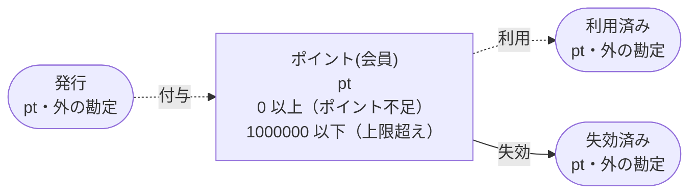
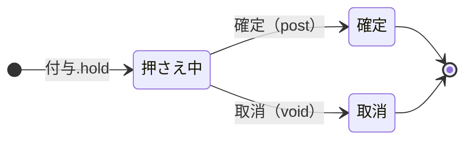
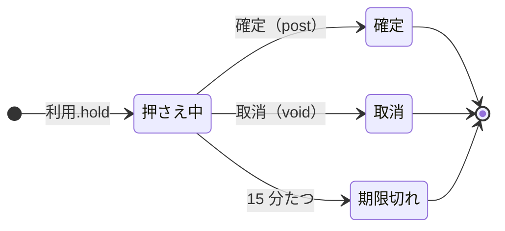

<!-- `chobo doc examples/points/points.ja.book --lang ja` の出力です。手で編集しないでください。 -->

# ポイント v1

会員ごとのポイント。購入で付く分は返品の期間が過ぎるまで押さえ、会計で使う分は支払いが通るまで 15 分押さえる。期間の終わりに使われずに残った分は失効する

`chobo doc` が `examples/points/points.ja.book` から作ったページ。勘定ごとに残高を持ち、残高は入った量から出た量を引いたもの。どの振替も勘定の下限と上限を守り、守れない振替は、その境界に付けた名前で断られて、どの移動も行われない。振替には、すぐに動かすもの（`do`）と、動かす量をまず押さえるもの（`hold`）がある。押さえた分は、あとで確定される（`post`。全部か一部）か、取り消される（`void`）か、有効期限で切れる。

## 勘定

| 勘定 | 分け方 | 単位 | 境界 | 説明 |
|---|---|---|---|---|
| `ポイント` | `会員` ごと | pt | 0 以上。下回る振替は `ポイント不足` で断る<br>1000000 以下。超える振替は `上限超え` で断る |  |
| `発行` | 一つだけ | pt | 外の勘定。境界は無く、マイナスにもなる |  |
| `利用済み` | 一つだけ | pt | 外の勘定。境界は無く、マイナスにもなる |  |
| `失効済み` | 一つだけ | pt | 外の勘定。境界は無く、マイナスにもなる |  |

## 勘定のあいだの流れ



四角は勘定で、矢印は振替の移動。角の丸い四角は外の勘定で、境界を持たない。破線の矢印は仮押さえの振替で、まず押さえ、確定したときに動く。

## 振替

### 付与

返品の期間が過ぎたら確定し、返品されたら取り消す

- 移動: `発行` から `ポイント(会員)` へ `数`。
- キー: `購入` ごとに一度だけ動く。同じ呼び出しの二度目は何もせず、`done_before` を返す。キーが同じで `会員`、`数` のどれかが違う二度目の呼び出しは、`key_conflict` で断られる。仮押さえが終わったあとに同じキーでもう一度押さえると、`done_before` を返し、何も押さえない。
- 仮押さえ: まず押さえる。確定と取消は呼ぶ側がする。期限は無く、どちらかが来るまで押さえたまま。



| 仮押さえの状態 | post（確定） | void（取消） |
|---|---|---|
| 押さえ中 | 確定する。額を渡せばその額、渡さなければ全額で、残りは元に戻る。押さえた額を超えれば `over_hold` で断る | 取り消す。押さえた量は元に戻る |
| 確定 | 同じ額なら `done_before`、違う額なら `key_conflict` で断る | `already_posted` で断る |
| 取消 | `already_voided` で断る | `done_before` |
| 仮押さえが無い | `no_such_hold` で断る | `no_such_hold` で断る |

| 操作 | 断られうる理由 | いつ |
|---|---|---|
| `付与.hold` | `上限超え` | `ポイント(会員)` が 1000000 を超える |
| `付与.hold` | `key_conflict` | `購入` が同じで、ほかの引数が違う呼び出しが、前に済んでいる |
| `付与.hold` | `already_refused` | `購入` が同じ呼び出しが、前に境界で断られている。境界で断られたキーは、あとで足りるようになっても通らない |
| `付与.post` | `key_conflict` | 仮押さえは、違う額で確定済み |
| `付与.post` | `already_voided` | 仮押さえはもう取り消されている |
| `付与.post` | `over_hold` | 押さえた額より多く確定しようとした |
| `付与.post` | `no_such_hold` | その `購入` の仮押さえが無い |
| `付与.void` | `already_posted` | 仮押さえはもう確定している |
| `付与.void` | `no_such_hold` | その `購入` の仮押さえが無い |

<details><summary>断られる例</summary>

#### 付与.hold: 上限超え

```text
 1  付与.hold(購入: 購入-1, 会員: 会員-2, 数: 1000000)  通る
 2  付与.post(購入: 購入-1)                             通る
 3  付与.hold(購入: 購入-3, 会員: 会員-2, 数: 1)        上限超え で断られる（1 つ目の移動が ポイント(会員-2) へ 1 を入れようとしたときの残高は、確定 1000000、入ってくる仮押さえ 0）
```

#### 付与.hold: key_conflict

```text
 1  付与.hold(購入: 購入-1, 会員: 会員-2, 数: 1)  通る
 2  付与.hold(購入: 購入-1, 会員: 会員-2, 数: 2)  key_conflict で断られる
```

#### 付与.hold: already_refused

```text
 1  付与.hold(購入: 購入-1, 会員: 会員-2, 数: 1000000)  通る
 2  付与.post(購入: 購入-1)                             通る
 3  付与.hold(購入: 購入-3, 会員: 会員-2, 数: 1)        上限超え で断られる（1 つ目の移動が ポイント(会員-2) へ 1 を入れようとしたときの残高は、確定 1000000、入ってくる仮押さえ 0）
 4  付与.hold(購入: 購入-3, 会員: 会員-2, 数: 1)        already_refused で断られる
```

#### 付与.post: key_conflict

```text
 1  付与.hold(購入: 購入-1, 会員: 会員-2, 数: 2)  通る
 2  付与.post(購入: 購入-1)                       通る
 3  付与.post(購入: 購入-1, 数: 1)                key_conflict で断られる
```

#### 付与.post: already_voided

```text
 1  付与.hold(購入: 購入-1, 会員: 会員-2, 数: 2)  通る
 2  付与.void(購入: 購入-1)                       通る
 3  付与.post(購入: 購入-1)                       already_voided で断られる
```

#### 付与.post: over_hold

```text
 1  付与.hold(購入: 購入-1, 会員: 会員-2, 数: 2)  通る
 2  付与.post(購入: 購入-1, 数: 3)                over_hold で断られる
```

#### 付与.post: no_such_hold

```text
 1  付与.post(購入: 購入-1)  no_such_hold で断られる
```

#### 付与.void: already_posted

```text
 1  付与.hold(購入: 購入-1, 会員: 会員-2, 数: 2)  通る
 2  付与.post(購入: 購入-1)                       通る
 3  付与.void(購入: 購入-1)                       already_posted で断られる
```

#### 付与.void: no_such_hold

```text
 1  付与.void(購入: 購入-1)  no_such_hold で断られる
```

</details>

### 利用

支払いが通ったら確定し、通らなかったら取り消す

- 移動: `ポイント(会員)` から `利用済み` へ `数`。
- キー: `会計` ごとに一度だけ動く。同じ呼び出しの二度目は何もせず、`done_before` を返す。キーが同じで `会員`、`数` のどれかが違う二度目の呼び出しは、`key_conflict` で断られる。仮押さえが終わったあとに同じキーでもう一度押さえると、`done_before` を返し、何も押さえない。
- 仮押さえ: まず押さえる。確定と取消は呼ぶ側がする。押さえてから 15 分で期限が切れ、押さえた量は元に戻る。



| 仮押さえの状態 | post（確定） | void（取消） |
|---|---|---|
| 押さえ中 | 確定する。額を渡せばその額、渡さなければ全額で、残りは元に戻る。押さえた額を超えれば `over_hold` で断る。押さえてから 15 分たっていれば `expired` で断る | 取り消す。押さえた量は元に戻る。押さえてから 15 分たっていれば `expired` で断る |
| 確定 | 同じ額なら `done_before`、違う額なら `key_conflict` で断る | `already_posted` で断る |
| 取消 | `already_voided` で断る | `done_before` |
| 期限切れ | `expired` で断る | `expired` で断る |
| 仮押さえが無い | `no_such_hold` で断る | `no_such_hold` で断る |

| 操作 | 断られうる理由 | いつ |
|---|---|---|
| `利用.hold` | `ポイント不足` | `ポイント(会員)` が 0 を下回る |
| `利用.hold` | `key_conflict` | `会計` が同じで、ほかの引数が違う呼び出しが、前に済んでいる |
| `利用.hold` | `already_refused` | `会計` が同じ呼び出しが、前に境界で断られている。境界で断られたキーは、あとで足りるようになっても通らない |
| `利用.post` | `key_conflict` | 仮押さえは、違う額で確定済み |
| `利用.post` | `already_voided` | 仮押さえはもう取り消されている |
| `利用.post` | `expired` | 仮押さえの期限が切れている |
| `利用.post` | `over_hold` | 押さえた額より多く確定しようとした |
| `利用.post` | `no_such_hold` | その `会計` の仮押さえが無い |
| `利用.void` | `already_posted` | 仮押さえはもう確定している |
| `利用.void` | `expired` | 仮押さえの期限が切れている |
| `利用.void` | `no_such_hold` | その `会計` の仮押さえが無い |

<details><summary>断られる例</summary>

#### 利用.hold: ポイント不足

```text
 1  利用.hold(会計: 会計-1, 会員: 会員-2, 数: 1)  ポイント不足 で断られる（1 つ目の移動が ポイント(会員-2) から 1 を取ろうとしたときの残高は、確定 0、出ていく仮押さえ 0）
```

#### 利用.hold: key_conflict

```text
 1  付与.hold(購入: 購入-1, 会員: 会員-2, 数: 1)  通る
 2  付与.post(購入: 購入-1)                       通る
 3  利用.hold(会計: 会計-3, 会員: 会員-2, 数: 1)  通る
 4  利用.hold(会計: 会計-3, 会員: 会員-2, 数: 2)  key_conflict で断られる
```

#### 利用.hold: already_refused

```text
 1  利用.hold(会計: 会計-1, 会員: 会員-2, 数: 1)  ポイント不足 で断られる（1 つ目の移動が ポイント(会員-2) から 1 を取ろうとしたときの残高は、確定 0、出ていく仮押さえ 0）
 2  利用.hold(会計: 会計-1, 会員: 会員-2, 数: 1)  already_refused で断られる
```

#### 利用.post: key_conflict

```text
 1  付与.hold(購入: 購入-1, 会員: 会員-2, 数: 2)  通る
 2  付与.post(購入: 購入-1)                       通る
 3  利用.hold(会計: 会計-3, 会員: 会員-2, 数: 2)  通る
 4  利用.post(会計: 会計-3)                       通る
 5  利用.post(会計: 会計-3, 数: 1)                key_conflict で断られる
```

#### 利用.post: already_voided

```text
 1  付与.hold(購入: 購入-1, 会員: 会員-2, 数: 2)  通る
 2  付与.post(購入: 購入-1)                       通る
 3  利用.hold(会計: 会計-3, 会員: 会員-2, 数: 2)  通る
 4  利用.void(会計: 会計-3)                       通る
 5  利用.post(会計: 会計-3)                       already_voided で断られる
```

#### 利用.post: expired

```text
 1  付与.hold(購入: 購入-1, 会員: 会員-2, 数: 2)  通る
 2  付与.post(購入: 購入-1)                       通る
 3  利用.hold(会計: 会計-3, 会員: 会員-2, 数: 2)  通る
 4  pass 15 分                                    利用(会計-3) が期限切れ
 5  利用.post(会計: 会計-3)                       expired で断られる
```

#### 利用.post: over_hold

```text
 1  付与.hold(購入: 購入-1, 会員: 会員-2, 数: 2)  通る
 2  付与.post(購入: 購入-1)                       通る
 3  利用.hold(会計: 会計-3, 会員: 会員-2, 数: 2)  通る
 4  利用.post(会計: 会計-3, 数: 3)                over_hold で断られる
```

#### 利用.post: no_such_hold

```text
 1  利用.post(会計: 会計-1)  no_such_hold で断られる
```

#### 利用.void: already_posted

```text
 1  付与.hold(購入: 購入-1, 会員: 会員-2, 数: 2)  通る
 2  付与.post(購入: 購入-1)                       通る
 3  利用.hold(会計: 会計-3, 会員: 会員-2, 数: 2)  通る
 4  利用.post(会計: 会計-3)                       通る
 5  利用.void(会計: 会計-3)                       already_posted で断られる
```

#### 利用.void: expired

```text
 1  付与.hold(購入: 購入-1, 会員: 会員-2, 数: 2)  通る
 2  付与.post(購入: 購入-1)                       通る
 3  利用.hold(会計: 会計-3, 会員: 会員-2, 数: 2)  通る
 4  pass 15 分                                    利用(会計-3) が期限切れ
 5  利用.void(会計: 会計-3)                       expired で断られる
```

#### 利用.void: no_such_hold

```text
 1  利用.void(会計: 会計-1)  no_such_hold で断られる
```

</details>

### 失効

その期間に使われなかった分

- 移動: `ポイント(会員)` から `失効済み` へ `数`。
- キー: `会員` と `期間` の組ごとに一度だけ動く。同じ呼び出しの二度目は何もせず、`done_before` を返す。キーが同じで `数` が違う二度目の呼び出しは、`key_conflict` で断られる。
- すぐに動かす（`do`）。

| 操作 | 断られうる理由 | いつ |
|---|---|---|
| `失効.do` | `ポイント不足` | `ポイント(会員)` が 0 を下回る |
| `失効.do` | `key_conflict` | `会員` と `期間` が同じで、ほかの引数が違う呼び出しが、前に済んでいる |
| `失効.do` | `already_refused` | `会員` と `期間` が同じ呼び出しが、前に境界で断られている。境界で断られたキーは、あとで足りるようになっても通らない |

<details><summary>断られる例</summary>

#### 失効.do: ポイント不足

```text
 1  失効.do(会員: 会員-1, 期間: 期間-2, 数: 1)  ポイント不足 で断られる（1 つ目の移動が ポイント(会員-1) から 1 を取ろうとしたときの残高は、確定 0、出ていく仮押さえ 0）
```

#### 失効.do: key_conflict

```text
 1  付与.hold(購入: 購入-1, 会員: 会員-2, 数: 1)  通る
 2  付与.post(購入: 購入-1)                       通る
 3  失効.do(会員: 会員-2, 期間: 期間-3, 数: 1)    通る
 4  失効.do(会員: 会員-2, 期間: 期間-3, 数: 2)    key_conflict で断られる
```

#### 失効.do: already_refused

```text
 1  失効.do(会員: 会員-1, 期間: 期間-2, 数: 1)  ポイント不足 で断られる（1 つ目の移動が ポイント(会員-1) から 1 を取ろうとしたときの残高は、確定 0、出ていく仮押さえ 0）
 2  失効.do(会員: 会員-1, 期間: 期間-2, 数: 1)  already_refused で断られる
```

</details>

## シナリオ

`chobo scenarios` が帳簿から作ったシナリオ 39 本。境界の手前・ちょうど・超える、同じキーの二度目、仮押さえの終わり方、二つの呼び出し元が同時に最後の一つを取りに来るもの、などがある。どれも参照インタプリタで流したもので、ステップごとに、そのあとの残高を載せている。残高は確定した量で、仮押さえがあれば、その量を括弧の中に添えている。

<details><summary>1. 境界: 付与.hold が ポイント(会員) を 999999 まで増やす（<code>at most 1000000</code> の 1 つ手前）</summary>

| # | 操作 | 結果 | ポイント(会員-2) | 発行 |
|---|---|---|---|---|
| 1 | 付与.hold(購入: 購入-1, 会員: 会員-2, 数: 999998) | 通る | 0（入ってくる仮押さえ 999998） | 0（出ていく仮押さえ 999998） |
| 2 | 付与.post(購入: 購入-1) | 通る | 999998 | -999998 |
| 3 | 付与.hold(購入: 購入-3, 会員: 会員-2, 数: 1) | 通る | 999998（入ってくる仮押さえ 1） | -999998（出ていく仮押さえ 1） |

</details>

<details><summary>2. 境界: 付与.hold が ポイント(会員) をちょうど 1000000 まで増やす（<code>at most 1000000</code> ちょうど）</summary>

| # | 操作 | 結果 | ポイント(会員-2) | 発行 |
|---|---|---|---|---|
| 1 | 付与.hold(購入: 購入-1, 会員: 会員-2, 数: 999998) | 通る | 0（入ってくる仮押さえ 999998） | 0（出ていく仮押さえ 999998） |
| 2 | 付与.post(購入: 購入-1) | 通る | 999998 | -999998 |
| 3 | 付与.hold(購入: 購入-3, 会員: 会員-2, 数: 2) | 通る | 999998（入ってくる仮押さえ 2） | -999998（出ていく仮押さえ 2） |

</details>

<details><summary>3. 境界: 付与.hold は ポイント(会員) を 1000001 まで増やすので断られる（<code>at most 1000000</code> を超える）</summary>

| # | 操作 | 結果 | ポイント(会員-2) | 発行 |
|---|---|---|---|---|
| 1 | 付与.hold(購入: 購入-1, 会員: 会員-2, 数: 999998) | 通る | 0（入ってくる仮押さえ 999998） | 0（出ていく仮押さえ 999998） |
| 2 | 付与.post(購入: 購入-1) | 通る | 999998 | -999998 |
| 3 | 付与.hold(購入: 購入-3, 会員: 会員-2, 数: 3) | 上限超え で断られる | 999998 | -999998 |

</details>

<details><summary>4. 境界: 利用.hold が ポイント(会員) を 1 まで減らす（<code>at least 0</code> の 1 つ手前）</summary>

| # | 操作 | 結果 | ポイント(会員-2) | 発行 | 利用済み |
|---|---|---|---|---|---|
| 1 | 付与.hold(購入: 購入-1, 会員: 会員-2, 数: 2) | 通る | 0（入ってくる仮押さえ 2） | 0（出ていく仮押さえ 2） | 0 |
| 2 | 付与.post(購入: 購入-1) | 通る | 2 | -2 | 0 |
| 3 | 利用.hold(会計: 会計-3, 会員: 会員-2, 数: 1) | 通る | 2（出ていく仮押さえ 1） | -2 | 0（入ってくる仮押さえ 1） |

</details>

<details><summary>5. 境界: 利用.hold が ポイント(会員) をちょうど 0 まで減らす（<code>at least 0</code> ちょうど）</summary>

| # | 操作 | 結果 | ポイント(会員-2) | 発行 | 利用済み |
|---|---|---|---|---|---|
| 1 | 付与.hold(購入: 購入-1, 会員: 会員-2, 数: 2) | 通る | 0（入ってくる仮押さえ 2） | 0（出ていく仮押さえ 2） | 0 |
| 2 | 付与.post(購入: 購入-1) | 通る | 2 | -2 | 0 |
| 3 | 利用.hold(会計: 会計-3, 会員: 会員-2, 数: 2) | 通る | 2（出ていく仮押さえ 2） | -2 | 0（入ってくる仮押さえ 2） |

</details>

<details><summary>6. 境界: 利用.hold は ポイント(会員) を -1 まで減らすので断られる（<code>at least 0</code> を割る）</summary>

| # | 操作 | 結果 | ポイント(会員-2) | 発行 | 利用済み |
|---|---|---|---|---|---|
| 1 | 付与.hold(購入: 購入-1, 会員: 会員-2, 数: 2) | 通る | 0（入ってくる仮押さえ 2） | 0（出ていく仮押さえ 2） | 0 |
| 2 | 付与.post(購入: 購入-1) | 通る | 2 | -2 | 0 |
| 3 | 利用.hold(会計: 会計-3, 会員: 会員-2, 数: 3) | ポイント不足 で断られる | 2 | -2 | 0 |

</details>

<details><summary>7. 境界: 失効.do が ポイント(会員) を 1 まで減らす（<code>at least 0</code> の 1 つ手前）</summary>

| # | 操作 | 結果 | ポイント(会員-2) | 発行 | 失効済み |
|---|---|---|---|---|---|
| 1 | 付与.hold(購入: 購入-1, 会員: 会員-2, 数: 2) | 通る | 0（入ってくる仮押さえ 2） | 0（出ていく仮押さえ 2） | 0 |
| 2 | 付与.post(購入: 購入-1) | 通る | 2 | -2 | 0 |
| 3 | 失効.do(会員: 会員-2, 期間: 期間-3, 数: 1) | 通る | 1 | -2 | 1 |

</details>

<details><summary>8. 境界: 失効.do が ポイント(会員) をちょうど 0 まで減らす（<code>at least 0</code> ちょうど）</summary>

| # | 操作 | 結果 | ポイント(会員-2) | 発行 | 失効済み |
|---|---|---|---|---|---|
| 1 | 付与.hold(購入: 購入-1, 会員: 会員-2, 数: 2) | 通る | 0（入ってくる仮押さえ 2） | 0（出ていく仮押さえ 2） | 0 |
| 2 | 付与.post(購入: 購入-1) | 通る | 2 | -2 | 0 |
| 3 | 失効.do(会員: 会員-2, 期間: 期間-3, 数: 2) | 通る | 0 | -2 | 2 |

</details>

<details><summary>9. 境界: 失効.do は ポイント(会員) を -1 まで減らすので断られる（<code>at least 0</code> を割る）</summary>

| # | 操作 | 結果 | ポイント(会員-2) | 発行 | 失効済み |
|---|---|---|---|---|---|
| 1 | 付与.hold(購入: 購入-1, 会員: 会員-2, 数: 2) | 通る | 0（入ってくる仮押さえ 2） | 0（出ていく仮押さえ 2） | 0 |
| 2 | 付与.post(購入: 購入-1) | 通る | 2 | -2 | 0 |
| 3 | 失効.do(会員: 会員-2, 期間: 期間-3, 数: 3) | ポイント不足 で断られる | 2 | -2 | 0 |

</details>

<details><summary>10. キー: 付与.hold を同じ引数で二度呼ぶ</summary>

| # | 操作 | 結果 | ポイント(会員-2) | 発行 |
|---|---|---|---|---|
| 1 | 付与.hold(購入: 購入-1, 会員: 会員-2, 数: 1) | 通る | 0（入ってくる仮押さえ 1） | 0（出ていく仮押さえ 1） |
| 2 | 付与.hold(購入: 購入-1, 会員: 会員-2, 数: 1) | done_before（前に済んでいる） | 0（入ってくる仮押さえ 1） | 0（出ていく仮押さえ 1） |

</details>

<details><summary>11. キー: 付与.hold を 数 だけ変えてもう一度呼ぶ</summary>

| # | 操作 | 結果 | ポイント(会員-2) | 発行 |
|---|---|---|---|---|
| 1 | 付与.hold(購入: 購入-1, 会員: 会員-2, 数: 1) | 通る | 0（入ってくる仮押さえ 1） | 0（出ていく仮押さえ 1） |
| 2 | 付与.hold(購入: 購入-1, 会員: 会員-2, 数: 2) | key_conflict で断られる | 0（入ってくる仮押さえ 1） | 0（出ていく仮押さえ 1） |

</details>

<details><summary>12. キー: 付与.hold が 上限超え で断られたあと、同じ引数でもう一度呼ぶ</summary>

| # | 操作 | 結果 | ポイント(会員-2) | 発行 |
|---|---|---|---|---|
| 1 | 付与.hold(購入: 購入-1, 会員: 会員-2, 数: 1000000) | 通る | 0（入ってくる仮押さえ 1000000） | 0（出ていく仮押さえ 1000000） |
| 2 | 付与.post(購入: 購入-1) | 通る | 1000000 | -1000000 |
| 3 | 付与.hold(購入: 購入-3, 会員: 会員-2, 数: 1) | 上限超え で断られる | 1000000 | -1000000 |
| 4 | 付与.hold(購入: 購入-3, 会員: 会員-2, 数: 1) | already_refused で断られる | 1000000 | -1000000 |

</details>

<details><summary>13. キー: 利用.hold を同じ引数で二度呼ぶ</summary>

| # | 操作 | 結果 | ポイント(会員-2) | 発行 | 利用済み |
|---|---|---|---|---|---|
| 1 | 付与.hold(購入: 購入-1, 会員: 会員-2, 数: 1) | 通る | 0（入ってくる仮押さえ 1） | 0（出ていく仮押さえ 1） | 0 |
| 2 | 付与.post(購入: 購入-1) | 通る | 1 | -1 | 0 |
| 3 | 利用.hold(会計: 会計-3, 会員: 会員-2, 数: 1) | 通る | 1（出ていく仮押さえ 1） | -1 | 0（入ってくる仮押さえ 1） |
| 4 | 利用.hold(会計: 会計-3, 会員: 会員-2, 数: 1) | done_before（前に済んでいる） | 1（出ていく仮押さえ 1） | -1 | 0（入ってくる仮押さえ 1） |

</details>

<details><summary>14. キー: 利用.hold を 数 だけ変えてもう一度呼ぶ</summary>

| # | 操作 | 結果 | ポイント(会員-2) | 発行 | 利用済み |
|---|---|---|---|---|---|
| 1 | 付与.hold(購入: 購入-1, 会員: 会員-2, 数: 1) | 通る | 0（入ってくる仮押さえ 1） | 0（出ていく仮押さえ 1） | 0 |
| 2 | 付与.post(購入: 購入-1) | 通る | 1 | -1 | 0 |
| 3 | 利用.hold(会計: 会計-3, 会員: 会員-2, 数: 1) | 通る | 1（出ていく仮押さえ 1） | -1 | 0（入ってくる仮押さえ 1） |
| 4 | 利用.hold(会計: 会計-3, 会員: 会員-2, 数: 2) | key_conflict で断られる | 1（出ていく仮押さえ 1） | -1 | 0（入ってくる仮押さえ 1） |

</details>

<details><summary>15. キー: 利用.hold が ポイント不足 で断られたあと、同じ引数ですぐにもう一度呼び、ポイント(会員) が足りるようになってからもう一度呼ぶ</summary>

| # | 操作 | 結果 | ポイント(会員-2) | 発行 | 利用済み |
|---|---|---|---|---|---|
| 1 | 利用.hold(会計: 会計-1, 会員: 会員-2, 数: 1) | ポイント不足 で断られる | 0 | 0 | 0 |
| 2 | 利用.hold(会計: 会計-1, 会員: 会員-2, 数: 1) | already_refused で断られる | 0 | 0 | 0 |
| 3 | 付与.hold(購入: 購入-3, 会員: 会員-2, 数: 1) | 通る | 0（入ってくる仮押さえ 1） | 0（出ていく仮押さえ 1） | 0 |
| 4 | 付与.post(購入: 購入-3) | 通る | 1 | -1 | 0 |
| 5 | 利用.hold(会計: 会計-1, 会員: 会員-2, 数: 1) | already_refused で断られる | 1 | -1 | 0 |

</details>

<details><summary>16. キー: 失効.do を同じ引数で二度呼ぶ</summary>

| # | 操作 | 結果 | ポイント(会員-2) | 発行 | 失効済み |
|---|---|---|---|---|---|
| 1 | 付与.hold(購入: 購入-1, 会員: 会員-2, 数: 1) | 通る | 0（入ってくる仮押さえ 1） | 0（出ていく仮押さえ 1） | 0 |
| 2 | 付与.post(購入: 購入-1) | 通る | 1 | -1 | 0 |
| 3 | 失効.do(会員: 会員-2, 期間: 期間-3, 数: 1) | 通る | 0 | -1 | 1 |
| 4 | 失効.do(会員: 会員-2, 期間: 期間-3, 数: 1) | done_before（前に済んでいる） | 0 | -1 | 1 |

</details>

<details><summary>17. キー: 失効.do を 数 だけ変えてもう一度呼ぶ</summary>

| # | 操作 | 結果 | ポイント(会員-2) | 発行 | 失効済み |
|---|---|---|---|---|---|
| 1 | 付与.hold(購入: 購入-1, 会員: 会員-2, 数: 1) | 通る | 0（入ってくる仮押さえ 1） | 0（出ていく仮押さえ 1） | 0 |
| 2 | 付与.post(購入: 購入-1) | 通る | 1 | -1 | 0 |
| 3 | 失効.do(会員: 会員-2, 期間: 期間-3, 数: 1) | 通る | 0 | -1 | 1 |
| 4 | 失効.do(会員: 会員-2, 期間: 期間-3, 数: 2) | key_conflict で断られる | 0 | -1 | 1 |

</details>

<details><summary>18. キー: 失効.do が ポイント不足 で断られたあと、同じ引数ですぐにもう一度呼び、ポイント(会員) が足りるようになってからもう一度呼ぶ</summary>

| # | 操作 | 結果 | ポイント(会員-1) | 発行 | 失効済み |
|---|---|---|---|---|---|
| 1 | 失効.do(会員: 会員-1, 期間: 期間-2, 数: 1) | ポイント不足 で断られる | 0 | 0 | 0 |
| 2 | 失効.do(会員: 会員-1, 期間: 期間-2, 数: 1) | already_refused で断られる | 0 | 0 | 0 |
| 3 | 付与.hold(購入: 購入-3, 会員: 会員-1, 数: 1) | 通る | 0（入ってくる仮押さえ 1） | 0（出ていく仮押さえ 1） | 0 |
| 4 | 付与.post(購入: 購入-3) | 通る | 1 | -1 | 0 |
| 5 | 失効.do(会員: 会員-1, 期間: 期間-2, 数: 1) | already_refused で断られる | 1 | -1 | 0 |

</details>

<details><summary>19. 仮押さえ: 付与 を全額で確定する</summary>

| # | 操作 | 結果 | ポイント(会員-2) | 発行 |
|---|---|---|---|---|
| 1 | 付与.hold(購入: 購入-1, 会員: 会員-2, 数: 2) | 通る | 0（入ってくる仮押さえ 2） | 0（出ていく仮押さえ 2） |
| 2 | 付与.post(購入: 購入-1) | 通る | 2 | -2 |

</details>

<details><summary>20. 仮押さえ: 付与 を一部だけ確定する</summary>

| # | 操作 | 結果 | ポイント(会員-2) | 発行 |
|---|---|---|---|---|
| 1 | 付与.hold(購入: 購入-1, 会員: 会員-2, 数: 2) | 通る | 0（入ってくる仮押さえ 2） | 0（出ていく仮押さえ 2） |
| 2 | 付与.post(購入: 購入-1, 数: 1) | 通る | 1 | -1 |

</details>

<details><summary>21. 仮押さえ: 付与 を取り消す</summary>

| # | 操作 | 結果 | ポイント(会員-2) | 発行 |
|---|---|---|---|---|
| 1 | 付与.hold(購入: 購入-1, 会員: 会員-2, 数: 2) | 通る | 0（入ってくる仮押さえ 2） | 0（出ていく仮押さえ 2） |
| 2 | 付与.void(購入: 購入-1) | 通る | 0 | 0 |

</details>

<details><summary>22. 仮押さえ: 付与 を確定してから取り消そうとする</summary>

| # | 操作 | 結果 | ポイント(会員-2) | 発行 |
|---|---|---|---|---|
| 1 | 付与.hold(購入: 購入-1, 会員: 会員-2, 数: 2) | 通る | 0（入ってくる仮押さえ 2） | 0（出ていく仮押さえ 2） |
| 2 | 付与.post(購入: 購入-1) | 通る | 2 | -2 |
| 3 | 付与.void(購入: 購入-1) | already_posted で断られる | 2 | -2 |

</details>

<details><summary>23. 仮押さえ: 付与 を取り消してから確定しようとする</summary>

| # | 操作 | 結果 | ポイント(会員-2) | 発行 |
|---|---|---|---|---|
| 1 | 付与.hold(購入: 購入-1, 会員: 会員-2, 数: 2) | 通る | 0（入ってくる仮押さえ 2） | 0（出ていく仮押さえ 2） |
| 2 | 付与.void(購入: 購入-1) | 通る | 0 | 0 |
| 3 | 付与.post(購入: 購入-1) | already_voided で断られる | 0 | 0 |

</details>

<details><summary>24. 仮押さえ: 付与 を押さえた額より多く確定しようとし、押さえた額で確定する</summary>

| # | 操作 | 結果 | ポイント(会員-2) | 発行 |
|---|---|---|---|---|
| 1 | 付与.hold(購入: 購入-1, 会員: 会員-2, 数: 2) | 通る | 0（入ってくる仮押さえ 2） | 0（出ていく仮押さえ 2） |
| 2 | 付与.post(購入: 購入-1, 数: 3) | over_hold で断られる | 0（入ってくる仮押さえ 2） | 0（出ていく仮押さえ 2） |
| 3 | 付与.post(購入: 購入-1, 数: 2) | 通る | 2 | -2 |

</details>

<details><summary>25. 仮押さえ: 付与 を押さえる前に確定しようとし、押さえてから確定する</summary>

| # | 操作 | 結果 | ポイント(会員-2) | 発行 |
|---|---|---|---|---|
| 1 | 付与.post(購入: 購入-1) | no_such_hold で断られる | 0 | 0 |
| 2 | 付与.hold(購入: 購入-1, 会員: 会員-2, 数: 1) | 通る | 0（入ってくる仮押さえ 1） | 0（出ていく仮押さえ 1） |
| 3 | 付与.post(購入: 購入-1) | 通る | 1 | -1 |

</details>

<details><summary>26. 仮押さえ: 付与 を確定したあと、同じ額でもう一度、違う額でもう一度確定する</summary>

| # | 操作 | 結果 | ポイント(会員-2) | 発行 |
|---|---|---|---|---|
| 1 | 付与.hold(購入: 購入-1, 会員: 会員-2, 数: 2) | 通る | 0（入ってくる仮押さえ 2） | 0（出ていく仮押さえ 2） |
| 2 | 付与.post(購入: 購入-1) | 通る | 2 | -2 |
| 3 | 付与.post(購入: 購入-1) | done_before（前に済んでいる） | 2 | -2 |
| 4 | 付与.post(購入: 購入-1, 数: 2) | done_before（前に済んでいる） | 2 | -2 |
| 5 | 付与.post(購入: 購入-1, 数: 1) | key_conflict で断られる | 2 | -2 |

</details>

<details><summary>27. 仮押さえ: 利用 を全額で確定する</summary>

| # | 操作 | 結果 | ポイント(会員-2) | 発行 | 利用済み |
|---|---|---|---|---|---|
| 1 | 付与.hold(購入: 購入-1, 会員: 会員-2, 数: 2) | 通る | 0（入ってくる仮押さえ 2） | 0（出ていく仮押さえ 2） | 0 |
| 2 | 付与.post(購入: 購入-1) | 通る | 2 | -2 | 0 |
| 3 | 利用.hold(会計: 会計-3, 会員: 会員-2, 数: 2) | 通る | 2（出ていく仮押さえ 2） | -2 | 0（入ってくる仮押さえ 2） |
| 4 | 利用.post(会計: 会計-3) | 通る | 0 | -2 | 2 |

</details>

<details><summary>28. 仮押さえ: 利用 を一部だけ確定する</summary>

| # | 操作 | 結果 | ポイント(会員-2) | 発行 | 利用済み |
|---|---|---|---|---|---|
| 1 | 付与.hold(購入: 購入-1, 会員: 会員-2, 数: 2) | 通る | 0（入ってくる仮押さえ 2） | 0（出ていく仮押さえ 2） | 0 |
| 2 | 付与.post(購入: 購入-1) | 通る | 2 | -2 | 0 |
| 3 | 利用.hold(会計: 会計-3, 会員: 会員-2, 数: 2) | 通る | 2（出ていく仮押さえ 2） | -2 | 0（入ってくる仮押さえ 2） |
| 4 | 利用.post(会計: 会計-3, 数: 1) | 通る | 1 | -2 | 1 |

</details>

<details><summary>29. 仮押さえ: 利用 を取り消す</summary>

| # | 操作 | 結果 | ポイント(会員-2) | 発行 | 利用済み |
|---|---|---|---|---|---|
| 1 | 付与.hold(購入: 購入-1, 会員: 会員-2, 数: 2) | 通る | 0（入ってくる仮押さえ 2） | 0（出ていく仮押さえ 2） | 0 |
| 2 | 付与.post(購入: 購入-1) | 通る | 2 | -2 | 0 |
| 3 | 利用.hold(会計: 会計-3, 会員: 会員-2, 数: 2) | 通る | 2（出ていく仮押さえ 2） | -2 | 0（入ってくる仮押さえ 2） |
| 4 | 利用.void(会計: 会計-3) | 通る | 2 | -2 | 0 |

</details>

<details><summary>30. 仮押さえ: 利用 を確定してから取り消そうとする</summary>

| # | 操作 | 結果 | ポイント(会員-2) | 発行 | 利用済み |
|---|---|---|---|---|---|
| 1 | 付与.hold(購入: 購入-1, 会員: 会員-2, 数: 2) | 通る | 0（入ってくる仮押さえ 2） | 0（出ていく仮押さえ 2） | 0 |
| 2 | 付与.post(購入: 購入-1) | 通る | 2 | -2 | 0 |
| 3 | 利用.hold(会計: 会計-3, 会員: 会員-2, 数: 2) | 通る | 2（出ていく仮押さえ 2） | -2 | 0（入ってくる仮押さえ 2） |
| 4 | 利用.post(会計: 会計-3) | 通る | 0 | -2 | 2 |
| 5 | 利用.void(会計: 会計-3) | already_posted で断られる | 0 | -2 | 2 |

</details>

<details><summary>31. 仮押さえ: 利用 を取り消してから確定しようとする</summary>

| # | 操作 | 結果 | ポイント(会員-2) | 発行 | 利用済み |
|---|---|---|---|---|---|
| 1 | 付与.hold(購入: 購入-1, 会員: 会員-2, 数: 2) | 通る | 0（入ってくる仮押さえ 2） | 0（出ていく仮押さえ 2） | 0 |
| 2 | 付与.post(購入: 購入-1) | 通る | 2 | -2 | 0 |
| 3 | 利用.hold(会計: 会計-3, 会員: 会員-2, 数: 2) | 通る | 2（出ていく仮押さえ 2） | -2 | 0（入ってくる仮押さえ 2） |
| 4 | 利用.void(会計: 会計-3) | 通る | 2 | -2 | 0 |
| 5 | 利用.post(会計: 会計-3) | already_voided で断られる | 2 | -2 | 0 |

</details>

<details><summary>32. 仮押さえ: 利用 を押さえた額より多く確定しようとし、押さえた額で確定する</summary>

| # | 操作 | 結果 | ポイント(会員-2) | 発行 | 利用済み |
|---|---|---|---|---|---|
| 1 | 付与.hold(購入: 購入-1, 会員: 会員-2, 数: 2) | 通る | 0（入ってくる仮押さえ 2） | 0（出ていく仮押さえ 2） | 0 |
| 2 | 付与.post(購入: 購入-1) | 通る | 2 | -2 | 0 |
| 3 | 利用.hold(会計: 会計-3, 会員: 会員-2, 数: 2) | 通る | 2（出ていく仮押さえ 2） | -2 | 0（入ってくる仮押さえ 2） |
| 4 | 利用.post(会計: 会計-3, 数: 3) | over_hold で断られる | 2（出ていく仮押さえ 2） | -2 | 0（入ってくる仮押さえ 2） |
| 5 | 利用.post(会計: 会計-3, 数: 2) | 通る | 0 | -2 | 2 |

</details>

<details><summary>33. 仮押さえ: 利用 を押さえる前に確定しようとし、押さえてから確定する</summary>

| # | 操作 | 結果 | ポイント(会員-2) | 発行 | 利用済み |
|---|---|---|---|---|---|
| 1 | 利用.post(会計: 会計-1) | no_such_hold で断られる | 0 | 0 | 0 |
| 2 | 付与.hold(購入: 購入-1, 会員: 会員-2, 数: 1) | 通る | 0（入ってくる仮押さえ 1） | 0（出ていく仮押さえ 1） | 0 |
| 3 | 付与.post(購入: 購入-1) | 通る | 1 | -1 | 0 |
| 4 | 利用.hold(会計: 会計-1, 会員: 会員-2, 数: 1) | 通る | 1（出ていく仮押さえ 1） | -1 | 0（入ってくる仮押さえ 1） |
| 5 | 利用.post(会計: 会計-1) | 通る | 0 | -1 | 1 |

</details>

<details><summary>34. 仮押さえ: 利用 を確定したあと、同じ額でもう一度、違う額でもう一度確定する</summary>

| # | 操作 | 結果 | ポイント(会員-2) | 発行 | 利用済み |
|---|---|---|---|---|---|
| 1 | 付与.hold(購入: 購入-1, 会員: 会員-2, 数: 2) | 通る | 0（入ってくる仮押さえ 2） | 0（出ていく仮押さえ 2） | 0 |
| 2 | 付与.post(購入: 購入-1) | 通る | 2 | -2 | 0 |
| 3 | 利用.hold(会計: 会計-3, 会員: 会員-2, 数: 2) | 通る | 2（出ていく仮押さえ 2） | -2 | 0（入ってくる仮押さえ 2） |
| 4 | 利用.post(会計: 会計-3) | 通る | 0 | -2 | 2 |
| 5 | 利用.post(会計: 会計-3) | done_before（前に済んでいる） | 0 | -2 | 2 |
| 6 | 利用.post(会計: 会計-3, 数: 2) | done_before（前に済んでいる） | 0 | -2 | 2 |
| 7 | 利用.post(会計: 会計-3, 数: 1) | key_conflict で断られる | 0 | -2 | 2 |

</details>

<details><summary>35. 期限切れ: 利用 が期限切れになってから、確定と取消を試す</summary>

| # | 操作 | 結果 | ポイント(会員-2) | 発行 | 利用済み |
|---|---|---|---|---|---|
| 1 | 付与.hold(購入: 購入-1, 会員: 会員-2, 数: 2) | 通る | 0（入ってくる仮押さえ 2） | 0（出ていく仮押さえ 2） | 0 |
| 2 | 付与.post(購入: 購入-1) | 通る | 2 | -2 | 0 |
| 3 | 利用.hold(会計: 会計-3, 会員: 会員-2, 数: 2) | 通る | 2（出ていく仮押さえ 2） | -2 | 0（入ってくる仮押さえ 2） |
| 4 | pass 16 分 | 利用(会計-3) が期限切れ | 2 | -2 | 0 |
| 5 | 利用.post(会計: 会計-3) | expired で断られる | 2 | -2 | 0 |
| 6 | 利用.void(会計: 会計-3) | expired で断られる | 2 | -2 | 0 |

</details>

<details><summary>36. 期限切れ: 利用 が期限切れになってから、同じキーで押さえ直す</summary>

| # | 操作 | 結果 | ポイント(会員-2) | 発行 | 利用済み |
|---|---|---|---|---|---|
| 1 | 付与.hold(購入: 購入-1, 会員: 会員-2, 数: 2) | 通る | 0（入ってくる仮押さえ 2） | 0（出ていく仮押さえ 2） | 0 |
| 2 | 付与.post(購入: 購入-1) | 通る | 2 | -2 | 0 |
| 3 | 利用.hold(会計: 会計-3, 会員: 会員-2, 数: 2) | 通る | 2（出ていく仮押さえ 2） | -2 | 0（入ってくる仮押さえ 2） |
| 4 | pass 16 分 | 利用(会計-3) が期限切れ | 2 | -2 | 0 |
| 5 | 利用.hold(会計: 会計-3, 会員: 会員-2, 数: 2) | done_before（前に済んでいる） | 2 | -2 | 0 |

</details>

<details><summary>37. 同時: 二つの呼び出し元が 付与.hold で ポイント(会員) の最後の空き 1 を取り合う</summary>

同時の操作の順序によって、結果は 2 通りある。

結果 1:

| # | 操作 | 結果 | ポイント(会員-2) | 発行 |
|---|---|---|---|---|
| 1 | 付与.hold(購入: 購入-1, 会員: 会員-2, 数: 999999) | 通る | 0（入ってくる仮押さえ 999999） | 0（出ていく仮押さえ 999999） |
| 2 | 付与.post(購入: 購入-1) | 通る | 999999 | -999999 |
| 3 | together<br>呼び出し元 1: 付与.hold(購入: 購入-3, 会員: 会員-2, 数: 1)<br>呼び出し元 2: 付与.hold(購入: 購入-4, 会員: 会員-2, 数: 1) | <br>通る<br>上限超え で断られる | 999999（入ってくる仮押さえ 1） | -999999（出ていく仮押さえ 1） |

結果 2:

| # | 操作 | 結果 | ポイント(会員-2) | 発行 |
|---|---|---|---|---|
| 1 | 付与.hold(購入: 購入-1, 会員: 会員-2, 数: 999999) | 通る | 0（入ってくる仮押さえ 999999） | 0（出ていく仮押さえ 999999） |
| 2 | 付与.post(購入: 購入-1) | 通る | 999999 | -999999 |
| 3 | together<br>呼び出し元 1: 付与.hold(購入: 購入-3, 会員: 会員-2, 数: 1)<br>呼び出し元 2: 付与.hold(購入: 購入-4, 会員: 会員-2, 数: 1) | <br>上限超え で断られる<br>通る | 999999（入ってくる仮押さえ 1） | -999999（出ていく仮押さえ 1） |

</details>

<details><summary>38. 同時: 二つの呼び出し元が 利用.hold で ポイント(会員) の最後の 1 を取り合う</summary>

同時の操作の順序によって、結果は 2 通りある。

結果 1:

| # | 操作 | 結果 | ポイント(会員-2) | 発行 | 利用済み |
|---|---|---|---|---|---|
| 1 | 付与.hold(購入: 購入-1, 会員: 会員-2, 数: 1) | 通る | 0（入ってくる仮押さえ 1） | 0（出ていく仮押さえ 1） | 0 |
| 2 | 付与.post(購入: 購入-1) | 通る | 1 | -1 | 0 |
| 3 | together<br>呼び出し元 1: 利用.hold(会計: 会計-3, 会員: 会員-2, 数: 1)<br>呼び出し元 2: 利用.hold(会計: 会計-4, 会員: 会員-2, 数: 1) | <br>通る<br>ポイント不足 で断られる | 1（出ていく仮押さえ 1） | -1 | 0（入ってくる仮押さえ 1） |

結果 2:

| # | 操作 | 結果 | ポイント(会員-2) | 発行 | 利用済み |
|---|---|---|---|---|---|
| 1 | 付与.hold(購入: 購入-1, 会員: 会員-2, 数: 1) | 通る | 0（入ってくる仮押さえ 1） | 0（出ていく仮押さえ 1） | 0 |
| 2 | 付与.post(購入: 購入-1) | 通る | 1 | -1 | 0 |
| 3 | together<br>呼び出し元 1: 利用.hold(会計: 会計-3, 会員: 会員-2, 数: 1)<br>呼び出し元 2: 利用.hold(会計: 会計-4, 会員: 会員-2, 数: 1) | <br>ポイント不足 で断られる<br>通る | 1（出ていく仮押さえ 1） | -1 | 0（入ってくる仮押さえ 1） |

</details>

<details><summary>39. 同時: 二つの呼び出し元が 失効.do で ポイント(会員) の最後の 1 を取り合う</summary>

同時の操作の順序によって、結果は 2 通りある。

結果 1:

| # | 操作 | 結果 | ポイント(会員-2) | 発行 | 失効済み |
|---|---|---|---|---|---|
| 1 | 付与.hold(購入: 購入-1, 会員: 会員-2, 数: 1) | 通る | 0（入ってくる仮押さえ 1） | 0（出ていく仮押さえ 1） | 0 |
| 2 | 付与.post(購入: 購入-1) | 通る | 1 | -1 | 0 |
| 3 | together<br>呼び出し元 1: 失効.do(会員: 会員-2, 期間: 期間-3, 数: 1)<br>呼び出し元 2: 失効.do(会員: 会員-2, 期間: 期間-4, 数: 1) | <br>通る<br>ポイント不足 で断られる | 0 | -1 | 1 |

結果 2:

| # | 操作 | 結果 | ポイント(会員-2) | 発行 | 失効済み |
|---|---|---|---|---|---|
| 1 | 付与.hold(購入: 購入-1, 会員: 会員-2, 数: 1) | 通る | 0（入ってくる仮押さえ 1） | 0（出ていく仮押さえ 1） | 0 |
| 2 | 付与.post(購入: 購入-1) | 通る | 1 | -1 | 0 |
| 3 | together<br>呼び出し元 1: 失効.do(会員: 会員-2, 期間: 期間-3, 数: 1)<br>呼び出し元 2: 失効.do(会員: 会員-2, 期間: 期間-4, 数: 1) | <br>ポイント不足 で断られる<br>通る | 0 | -1 | 1 |

</details>

