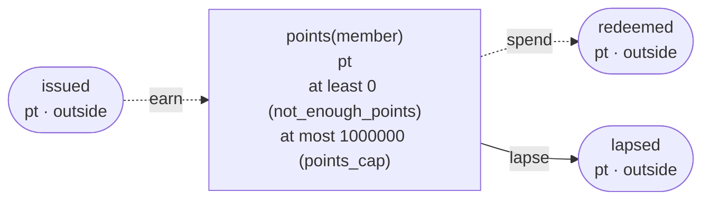
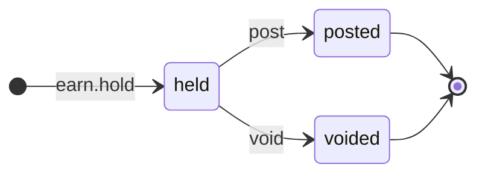
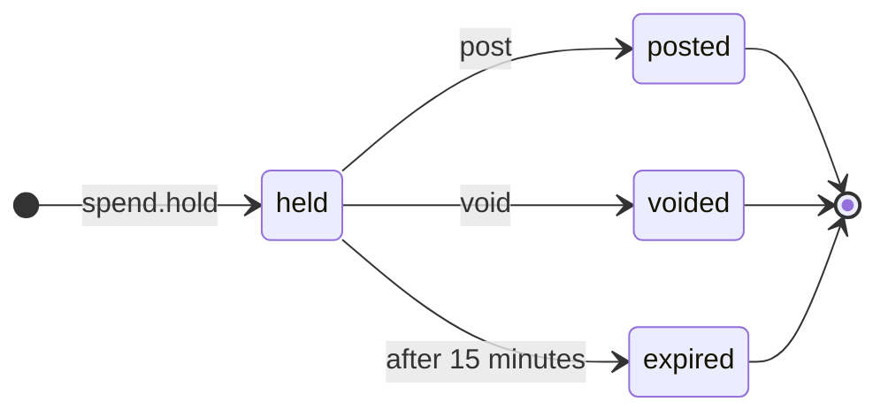

<!-- The output of `chobo doc examples/points/points.book`. Do not edit by hand. -->

# points v1

Loyalty points per member. What a purchase earns is held until its return period is over, what a checkout spends is held for 15 minutes while the payment goes through, and what is left unused at the end of a period lapses

`examples/points/points.book`, as `chobo doc` writes it. Each account keeps a balance: what came in, less what went out. Every transfer keeps the bounds of the accounts: one that would break a bound is refused with the name the book gives that bound, and nothing of it moves. A transfer either moves at once (`do`), or first holds what it moves (`hold`); a hold is then posted (`post`, all of it or part), voided (`void`), or expires.

## Accounts

| Account | One for each | Unit | Bounds | What it is |
|---|---|---|---|---|
| `points` | `member` | pt | at least 0; a transfer that would go below is refused with `not_enough_points`<br>at most 1000000; a transfer that would go above is refused with `points_cap` |  |
| `issued` | one account | pt | outside the book: no bounds, and it may go below 0 |  |
| `redeemed` | one account | pt | outside the book: no bounds, and it may go below 0 |  |
| `lapsed` | one account | pt | outside the book: no bounds, and it may go below 0 |  |

## How things move



A box is an account, and an arrow a move of a transfer. A rounded box is an account outside the book, which has no bounds. A dashed arrow belongs to a transfer that holds first, and moves when the hold is posted.

## Transfers

### earn

posted when the return period is over, voided when the purchase is returned

- Moves `pts` from `issued` to `points(member)`.
- Key: once per `purchase`. The same call again does nothing, and answers `done_before`; one that differs only in `member` or `pts` is refused with `key_conflict`; holding again with the same key after the hold has ended answers `done_before`, and holds nothing.
- Holds first: the caller posts or voids the hold. It never expires, and stays held until one of them comes.



| The hold | post | void |
|---|---|---|
| held | posts it: the amounts given, or all of it, and the rest goes back; more than it holds is refused with `over_hold` | voids it: what it holds goes back |
| posted | `done_before` with the same amounts; refused with `key_conflict` with others | refused with `already_posted` |
| voided | refused with `already_voided` | `done_before` |
| no hold with the key | refused with `no_such_hold` | refused with `no_such_hold` |

| Operation | May be refused with | When |
|---|---|---|
| `earn.hold` | `points_cap` | `points(member)` would go above 1000000 |
| `earn.hold` | `key_conflict` | a call with the same `purchase` and other arguments came before |
| `earn.hold` | `already_refused` | a call with the same `purchase` was refused by a bound before; a key a bound refused stays refused, even once there is enough |
| `earn.post` | `key_conflict` | the hold was posted before, for other amounts |
| `earn.post` | `already_voided` | the hold is voided already |
| `earn.post` | `over_hold` | more than the hold holds |
| `earn.post` | `no_such_hold` | there is no hold with that `purchase` |
| `earn.void` | `already_posted` | the hold is posted already |
| `earn.void` | `no_such_hold` | there is no hold with that `purchase` |

<details><summary>How each refusal comes about</summary>

#### earn.hold: points_cap

```text
 1  earn.hold(purchase: purchase-1, member: member-2, pts: 1000000)  done
 2  earn.post(purchase: purchase-1)                                  done
 3  earn.hold(purchase: purchase-3, member: member-2, pts: 1)        refused: points_cap (move 1 puts 1 into points(member-2): posted 1000000, held in 0)
```

#### earn.hold: key_conflict

```text
 1  earn.hold(purchase: purchase-1, member: member-2, pts: 1)  done
 2  earn.hold(purchase: purchase-1, member: member-2, pts: 2)  refused: key_conflict
```

#### earn.hold: already_refused

```text
 1  earn.hold(purchase: purchase-1, member: member-2, pts: 1000000)  done
 2  earn.post(purchase: purchase-1)                                  done
 3  earn.hold(purchase: purchase-3, member: member-2, pts: 1)        refused: points_cap (move 1 puts 1 into points(member-2): posted 1000000, held in 0)
 4  earn.hold(purchase: purchase-3, member: member-2, pts: 1)        refused: already_refused
```

#### earn.post: key_conflict

```text
 1  earn.hold(purchase: purchase-1, member: member-2, pts: 2)  done
 2  earn.post(purchase: purchase-1)                            done
 3  earn.post(purchase: purchase-1, pts: 1)                    refused: key_conflict
```

#### earn.post: already_voided

```text
 1  earn.hold(purchase: purchase-1, member: member-2, pts: 2)  done
 2  earn.void(purchase: purchase-1)                            done
 3  earn.post(purchase: purchase-1)                            refused: already_voided
```

#### earn.post: over_hold

```text
 1  earn.hold(purchase: purchase-1, member: member-2, pts: 2)  done
 2  earn.post(purchase: purchase-1, pts: 3)                    refused: over_hold
```

#### earn.post: no_such_hold

```text
 1  earn.post(purchase: purchase-1)  refused: no_such_hold
```

#### earn.void: already_posted

```text
 1  earn.hold(purchase: purchase-1, member: member-2, pts: 2)  done
 2  earn.post(purchase: purchase-1)                            done
 3  earn.void(purchase: purchase-1)                            refused: already_posted
```

#### earn.void: no_such_hold

```text
 1  earn.void(purchase: purchase-1)  refused: no_such_hold
```

</details>

### spend

posted when the payment goes through, voided when it fails

- Moves `pts` from `points(member)` to `redeemed`.
- Key: once per `checkout`. The same call again does nothing, and answers `done_before`; one that differs only in `member` or `pts` is refused with `key_conflict`; holding again with the same key after the hold has ended answers `done_before`, and holds nothing.
- Holds first: the caller posts or voids the hold. It expires 15 minutes after it was made, and what it holds goes back.



| The hold | post | void |
|---|---|---|
| held | posts it: the amounts given, or all of it, and the rest goes back; more than it holds is refused with `over_hold`; once 15 minutes have passed since it was held, refused with `expired` | voids it: what it holds goes back; once 15 minutes have passed since it was held, refused with `expired` |
| posted | `done_before` with the same amounts; refused with `key_conflict` with others | refused with `already_posted` |
| voided | refused with `already_voided` | `done_before` |
| expired | refused with `expired` | refused with `expired` |
| no hold with the key | refused with `no_such_hold` | refused with `no_such_hold` |

| Operation | May be refused with | When |
|---|---|---|
| `spend.hold` | `not_enough_points` | `points(member)` would go below 0 |
| `spend.hold` | `key_conflict` | a call with the same `checkout` and other arguments came before |
| `spend.hold` | `already_refused` | a call with the same `checkout` was refused by a bound before; a key a bound refused stays refused, even once there is enough |
| `spend.post` | `key_conflict` | the hold was posted before, for other amounts |
| `spend.post` | `already_voided` | the hold is voided already |
| `spend.post` | `expired` | the hold has expired |
| `spend.post` | `over_hold` | more than the hold holds |
| `spend.post` | `no_such_hold` | there is no hold with that `checkout` |
| `spend.void` | `already_posted` | the hold is posted already |
| `spend.void` | `expired` | the hold has expired |
| `spend.void` | `no_such_hold` | there is no hold with that `checkout` |

<details><summary>How each refusal comes about</summary>

#### spend.hold: not_enough_points

```text
 1  spend.hold(checkout: checkout-1, member: member-2, pts: 1)  refused: not_enough_points (move 1 takes 1 from points(member-2): posted 0, held out 0)
```

#### spend.hold: key_conflict

```text
 1  earn.hold(purchase: purchase-1, member: member-2, pts: 1)   done
 2  earn.post(purchase: purchase-1)                             done
 3  spend.hold(checkout: checkout-3, member: member-2, pts: 1)  done
 4  spend.hold(checkout: checkout-3, member: member-2, pts: 2)  refused: key_conflict
```

#### spend.hold: already_refused

```text
 1  spend.hold(checkout: checkout-1, member: member-2, pts: 1)  refused: not_enough_points (move 1 takes 1 from points(member-2): posted 0, held out 0)
 2  spend.hold(checkout: checkout-1, member: member-2, pts: 1)  refused: already_refused
```

#### spend.post: key_conflict

```text
 1  earn.hold(purchase: purchase-1, member: member-2, pts: 2)   done
 2  earn.post(purchase: purchase-1)                             done
 3  spend.hold(checkout: checkout-3, member: member-2, pts: 2)  done
 4  spend.post(checkout: checkout-3)                            done
 5  spend.post(checkout: checkout-3, pts: 1)                    refused: key_conflict
```

#### spend.post: already_voided

```text
 1  earn.hold(purchase: purchase-1, member: member-2, pts: 2)   done
 2  earn.post(purchase: purchase-1)                             done
 3  spend.hold(checkout: checkout-3, member: member-2, pts: 2)  done
 4  spend.void(checkout: checkout-3)                            done
 5  spend.post(checkout: checkout-3)                            refused: already_voided
```

#### spend.post: expired

```text
 1  earn.hold(purchase: purchase-1, member: member-2, pts: 2)   done
 2  earn.post(purchase: purchase-1)                             done
 3  spend.hold(checkout: checkout-3, member: member-2, pts: 2)  done
 4  pass 15 minutes                                             spend(checkout-3) expired
 5  spend.post(checkout: checkout-3)                            refused: expired
```

#### spend.post: over_hold

```text
 1  earn.hold(purchase: purchase-1, member: member-2, pts: 2)   done
 2  earn.post(purchase: purchase-1)                             done
 3  spend.hold(checkout: checkout-3, member: member-2, pts: 2)  done
 4  spend.post(checkout: checkout-3, pts: 3)                    refused: over_hold
```

#### spend.post: no_such_hold

```text
 1  spend.post(checkout: checkout-1)  refused: no_such_hold
```

#### spend.void: already_posted

```text
 1  earn.hold(purchase: purchase-1, member: member-2, pts: 2)   done
 2  earn.post(purchase: purchase-1)                             done
 3  spend.hold(checkout: checkout-3, member: member-2, pts: 2)  done
 4  spend.post(checkout: checkout-3)                            done
 5  spend.void(checkout: checkout-3)                            refused: already_posted
```

#### spend.void: expired

```text
 1  earn.hold(purchase: purchase-1, member: member-2, pts: 2)   done
 2  earn.post(purchase: purchase-1)                             done
 3  spend.hold(checkout: checkout-3, member: member-2, pts: 2)  done
 4  pass 15 minutes                                             spend(checkout-3) expired
 5  spend.void(checkout: checkout-3)                            refused: expired
```

#### spend.void: no_such_hold

```text
 1  spend.void(checkout: checkout-1)  refused: no_such_hold
```

</details>

### lapse

what the member did not use in the period

- Moves `pts` from `points(member)` to `lapsed`.
- Key: once per `member` and `period`. The same call again does nothing, and answers `done_before`; one that differs only in `pts` is refused with `key_conflict`.
- Moves at once (`do`).

| Operation | May be refused with | When |
|---|---|---|
| `lapse.do` | `not_enough_points` | `points(member)` would go below 0 |
| `lapse.do` | `key_conflict` | a call with the same `member` and `period` and other arguments came before |
| `lapse.do` | `already_refused` | a call with the same `member` and `period` was refused by a bound before; a key a bound refused stays refused, even once there is enough |

<details><summary>How each refusal comes about</summary>

#### lapse.do: not_enough_points

```text
 1  lapse.do(member: member-1, period: period-2, pts: 1)  refused: not_enough_points (move 1 takes 1 from points(member-1): posted 0, held out 0)
```

#### lapse.do: key_conflict

```text
 1  earn.hold(purchase: purchase-1, member: member-2, pts: 1)  done
 2  earn.post(purchase: purchase-1)                            done
 3  lapse.do(member: member-2, period: period-3, pts: 1)       done
 4  lapse.do(member: member-2, period: period-3, pts: 2)       refused: key_conflict
```

#### lapse.do: already_refused

```text
 1  lapse.do(member: member-1, period: period-2, pts: 1)  refused: not_enough_points (move 1 takes 1 from points(member-1): posted 0, held out 0)
 2  lapse.do(member: member-1, period: period-2, pts: 1)  refused: already_refused
```

</details>

## Scenarios

39 scenarios, which `chobo scenarios` makes from the book: among them each bound just before, at and past it, each key used twice, every way a hold ends, and two callers after the last of something at the same time. The reference interpreter ran each one; after each step come the balances it left. A balance is what is posted, with what is held in brackets.

<details><summary>1. bound: earn.hold fills points(member) to 999999, one below <code>at most 1000000</code></summary>

| # | Operation | Result | points(member-2) | issued |
|---|---|---|---|---|
| 1 | earn.hold(purchase: purchase-1, member: member-2, pts: 999998) | done | 0 (held in 999998) | 0 (held out 999998) |
| 2 | earn.post(purchase: purchase-1) | done | 999998 | -999998 |
| 3 | earn.hold(purchase: purchase-3, member: member-2, pts: 1) | done | 999998 (held in 1) | -999998 (held out 1) |

</details>

<details><summary>2. bound: earn.hold fills points(member) to exactly 1000000, its <code>at most 1000000</code></summary>

| # | Operation | Result | points(member-2) | issued |
|---|---|---|---|---|
| 1 | earn.hold(purchase: purchase-1, member: member-2, pts: 999998) | done | 0 (held in 999998) | 0 (held out 999998) |
| 2 | earn.post(purchase: purchase-1) | done | 999998 | -999998 |
| 3 | earn.hold(purchase: purchase-3, member: member-2, pts: 2) | done | 999998 (held in 2) | -999998 (held out 2) |

</details>

<details><summary>3. bound: earn.hold would fill points(member) to 1000001, past <code>at most 1000000</code></summary>

| # | Operation | Result | points(member-2) | issued |
|---|---|---|---|---|
| 1 | earn.hold(purchase: purchase-1, member: member-2, pts: 999998) | done | 0 (held in 999998) | 0 (held out 999998) |
| 2 | earn.post(purchase: purchase-1) | done | 999998 | -999998 |
| 3 | earn.hold(purchase: purchase-3, member: member-2, pts: 3) | refused: points_cap | 999998 | -999998 |

</details>

<details><summary>4. bound: spend.hold takes points(member) to 1, one above <code>at least 0</code></summary>

| # | Operation | Result | points(member-2) | issued | redeemed |
|---|---|---|---|---|---|
| 1 | earn.hold(purchase: purchase-1, member: member-2, pts: 2) | done | 0 (held in 2) | 0 (held out 2) | 0 |
| 2 | earn.post(purchase: purchase-1) | done | 2 | -2 | 0 |
| 3 | spend.hold(checkout: checkout-3, member: member-2, pts: 1) | done | 2 (held out 1) | -2 | 0 (held in 1) |

</details>

<details><summary>5. bound: spend.hold takes points(member) to exactly 0, its <code>at least 0</code></summary>

| # | Operation | Result | points(member-2) | issued | redeemed |
|---|---|---|---|---|---|
| 1 | earn.hold(purchase: purchase-1, member: member-2, pts: 2) | done | 0 (held in 2) | 0 (held out 2) | 0 |
| 2 | earn.post(purchase: purchase-1) | done | 2 | -2 | 0 |
| 3 | spend.hold(checkout: checkout-3, member: member-2, pts: 2) | done | 2 (held out 2) | -2 | 0 (held in 2) |

</details>

<details><summary>6. bound: spend.hold would take points(member) to -1, below <code>at least 0</code></summary>

| # | Operation | Result | points(member-2) | issued | redeemed |
|---|---|---|---|---|---|
| 1 | earn.hold(purchase: purchase-1, member: member-2, pts: 2) | done | 0 (held in 2) | 0 (held out 2) | 0 |
| 2 | earn.post(purchase: purchase-1) | done | 2 | -2 | 0 |
| 3 | spend.hold(checkout: checkout-3, member: member-2, pts: 3) | refused: not_enough_points | 2 | -2 | 0 |

</details>

<details><summary>7. bound: lapse.do takes points(member) to 1, one above <code>at least 0</code></summary>

| # | Operation | Result | points(member-2) | issued | lapsed |
|---|---|---|---|---|---|
| 1 | earn.hold(purchase: purchase-1, member: member-2, pts: 2) | done | 0 (held in 2) | 0 (held out 2) | 0 |
| 2 | earn.post(purchase: purchase-1) | done | 2 | -2 | 0 |
| 3 | lapse.do(member: member-2, period: period-3, pts: 1) | done | 1 | -2 | 1 |

</details>

<details><summary>8. bound: lapse.do takes points(member) to exactly 0, its <code>at least 0</code></summary>

| # | Operation | Result | points(member-2) | issued | lapsed |
|---|---|---|---|---|---|
| 1 | earn.hold(purchase: purchase-1, member: member-2, pts: 2) | done | 0 (held in 2) | 0 (held out 2) | 0 |
| 2 | earn.post(purchase: purchase-1) | done | 2 | -2 | 0 |
| 3 | lapse.do(member: member-2, period: period-3, pts: 2) | done | 0 | -2 | 2 |

</details>

<details><summary>9. bound: lapse.do would take points(member) to -1, below <code>at least 0</code></summary>

| # | Operation | Result | points(member-2) | issued | lapsed |
|---|---|---|---|---|---|
| 1 | earn.hold(purchase: purchase-1, member: member-2, pts: 2) | done | 0 (held in 2) | 0 (held out 2) | 0 |
| 2 | earn.post(purchase: purchase-1) | done | 2 | -2 | 0 |
| 3 | lapse.do(member: member-2, period: period-3, pts: 3) | refused: not_enough_points | 2 | -2 | 0 |

</details>

<details><summary>10. key: earn.hold twice with the same arguments</summary>

| # | Operation | Result | points(member-2) | issued |
|---|---|---|---|---|
| 1 | earn.hold(purchase: purchase-1, member: member-2, pts: 1) | done | 0 (held in 1) | 0 (held out 1) |
| 2 | earn.hold(purchase: purchase-1, member: member-2, pts: 1) | done_before | 0 (held in 1) | 0 (held out 1) |

</details>

<details><summary>11. key: earn.hold again with another pts</summary>

| # | Operation | Result | points(member-2) | issued |
|---|---|---|---|---|
| 1 | earn.hold(purchase: purchase-1, member: member-2, pts: 1) | done | 0 (held in 1) | 0 (held out 1) |
| 2 | earn.hold(purchase: purchase-1, member: member-2, pts: 2) | refused: key_conflict | 0 (held in 1) | 0 (held out 1) |

</details>

<details><summary>12. key: earn.hold refused with points_cap, then again</summary>

| # | Operation | Result | points(member-2) | issued |
|---|---|---|---|---|
| 1 | earn.hold(purchase: purchase-1, member: member-2, pts: 1000000) | done | 0 (held in 1000000) | 0 (held out 1000000) |
| 2 | earn.post(purchase: purchase-1) | done | 1000000 | -1000000 |
| 3 | earn.hold(purchase: purchase-3, member: member-2, pts: 1) | refused: points_cap | 1000000 | -1000000 |
| 4 | earn.hold(purchase: purchase-3, member: member-2, pts: 1) | refused: already_refused | 1000000 | -1000000 |

</details>

<details><summary>13. key: spend.hold twice with the same arguments</summary>

| # | Operation | Result | points(member-2) | issued | redeemed |
|---|---|---|---|---|---|
| 1 | earn.hold(purchase: purchase-1, member: member-2, pts: 1) | done | 0 (held in 1) | 0 (held out 1) | 0 |
| 2 | earn.post(purchase: purchase-1) | done | 1 | -1 | 0 |
| 3 | spend.hold(checkout: checkout-3, member: member-2, pts: 1) | done | 1 (held out 1) | -1 | 0 (held in 1) |
| 4 | spend.hold(checkout: checkout-3, member: member-2, pts: 1) | done_before | 1 (held out 1) | -1 | 0 (held in 1) |

</details>

<details><summary>14. key: spend.hold again with another pts</summary>

| # | Operation | Result | points(member-2) | issued | redeemed |
|---|---|---|---|---|---|
| 1 | earn.hold(purchase: purchase-1, member: member-2, pts: 1) | done | 0 (held in 1) | 0 (held out 1) | 0 |
| 2 | earn.post(purchase: purchase-1) | done | 1 | -1 | 0 |
| 3 | spend.hold(checkout: checkout-3, member: member-2, pts: 1) | done | 1 (held out 1) | -1 | 0 (held in 1) |
| 4 | spend.hold(checkout: checkout-3, member: member-2, pts: 2) | refused: key_conflict | 1 (held out 1) | -1 | 0 (held in 1) |

</details>

<details><summary>15. key: spend.hold refused with not_enough_points, then again, and again once points(member) has enough</summary>

| # | Operation | Result | points(member-2) | issued | redeemed |
|---|---|---|---|---|---|
| 1 | spend.hold(checkout: checkout-1, member: member-2, pts: 1) | refused: not_enough_points | 0 | 0 | 0 |
| 2 | spend.hold(checkout: checkout-1, member: member-2, pts: 1) | refused: already_refused | 0 | 0 | 0 |
| 3 | earn.hold(purchase: purchase-3, member: member-2, pts: 1) | done | 0 (held in 1) | 0 (held out 1) | 0 |
| 4 | earn.post(purchase: purchase-3) | done | 1 | -1 | 0 |
| 5 | spend.hold(checkout: checkout-1, member: member-2, pts: 1) | refused: already_refused | 1 | -1 | 0 |

</details>

<details><summary>16. key: lapse.do twice with the same arguments</summary>

| # | Operation | Result | points(member-2) | issued | lapsed |
|---|---|---|---|---|---|
| 1 | earn.hold(purchase: purchase-1, member: member-2, pts: 1) | done | 0 (held in 1) | 0 (held out 1) | 0 |
| 2 | earn.post(purchase: purchase-1) | done | 1 | -1 | 0 |
| 3 | lapse.do(member: member-2, period: period-3, pts: 1) | done | 0 | -1 | 1 |
| 4 | lapse.do(member: member-2, period: period-3, pts: 1) | done_before | 0 | -1 | 1 |

</details>

<details><summary>17. key: lapse.do again with another pts</summary>

| # | Operation | Result | points(member-2) | issued | lapsed |
|---|---|---|---|---|---|
| 1 | earn.hold(purchase: purchase-1, member: member-2, pts: 1) | done | 0 (held in 1) | 0 (held out 1) | 0 |
| 2 | earn.post(purchase: purchase-1) | done | 1 | -1 | 0 |
| 3 | lapse.do(member: member-2, period: period-3, pts: 1) | done | 0 | -1 | 1 |
| 4 | lapse.do(member: member-2, period: period-3, pts: 2) | refused: key_conflict | 0 | -1 | 1 |

</details>

<details><summary>18. key: lapse.do refused with not_enough_points, then again, and again once points(member) has enough</summary>

| # | Operation | Result | points(member-1) | issued | lapsed |
|---|---|---|---|---|---|
| 1 | lapse.do(member: member-1, period: period-2, pts: 1) | refused: not_enough_points | 0 | 0 | 0 |
| 2 | lapse.do(member: member-1, period: period-2, pts: 1) | refused: already_refused | 0 | 0 | 0 |
| 3 | earn.hold(purchase: purchase-3, member: member-1, pts: 1) | done | 0 (held in 1) | 0 (held out 1) | 0 |
| 4 | earn.post(purchase: purchase-3) | done | 1 | -1 | 0 |
| 5 | lapse.do(member: member-1, period: period-2, pts: 1) | refused: already_refused | 1 | -1 | 0 |

</details>

<details><summary>19. hold: earn posted in full</summary>

| # | Operation | Result | points(member-2) | issued |
|---|---|---|---|---|
| 1 | earn.hold(purchase: purchase-1, member: member-2, pts: 2) | done | 0 (held in 2) | 0 (held out 2) |
| 2 | earn.post(purchase: purchase-1) | done | 2 | -2 |

</details>

<details><summary>20. hold: earn posted in part</summary>

| # | Operation | Result | points(member-2) | issued |
|---|---|---|---|---|
| 1 | earn.hold(purchase: purchase-1, member: member-2, pts: 2) | done | 0 (held in 2) | 0 (held out 2) |
| 2 | earn.post(purchase: purchase-1, pts: 1) | done | 1 | -1 |

</details>

<details><summary>21. hold: earn voided</summary>

| # | Operation | Result | points(member-2) | issued |
|---|---|---|---|---|
| 1 | earn.hold(purchase: purchase-1, member: member-2, pts: 2) | done | 0 (held in 2) | 0 (held out 2) |
| 2 | earn.void(purchase: purchase-1) | done | 0 | 0 |

</details>

<details><summary>22. hold: earn posted, then voided</summary>

| # | Operation | Result | points(member-2) | issued |
|---|---|---|---|---|
| 1 | earn.hold(purchase: purchase-1, member: member-2, pts: 2) | done | 0 (held in 2) | 0 (held out 2) |
| 2 | earn.post(purchase: purchase-1) | done | 2 | -2 |
| 3 | earn.void(purchase: purchase-1) | refused: already_posted | 2 | -2 |

</details>

<details><summary>23. hold: earn voided, then posted</summary>

| # | Operation | Result | points(member-2) | issued |
|---|---|---|---|---|
| 1 | earn.hold(purchase: purchase-1, member: member-2, pts: 2) | done | 0 (held in 2) | 0 (held out 2) |
| 2 | earn.void(purchase: purchase-1) | done | 0 | 0 |
| 3 | earn.post(purchase: purchase-1) | refused: already_voided | 0 | 0 |

</details>

<details><summary>24. hold: earn posted for more than it holds, then for what it holds</summary>

| # | Operation | Result | points(member-2) | issued |
|---|---|---|---|---|
| 1 | earn.hold(purchase: purchase-1, member: member-2, pts: 2) | done | 0 (held in 2) | 0 (held out 2) |
| 2 | earn.post(purchase: purchase-1, pts: 3) | refused: over_hold | 0 (held in 2) | 0 (held out 2) |
| 3 | earn.post(purchase: purchase-1, pts: 2) | done | 2 | -2 |

</details>

<details><summary>25. hold: earn posted before it is held, then held and posted</summary>

| # | Operation | Result | points(member-2) | issued |
|---|---|---|---|---|
| 1 | earn.post(purchase: purchase-1) | refused: no_such_hold | 0 | 0 |
| 2 | earn.hold(purchase: purchase-1, member: member-2, pts: 1) | done | 0 (held in 1) | 0 (held out 1) |
| 3 | earn.post(purchase: purchase-1) | done | 1 | -1 |

</details>

<details><summary>26. hold: earn posted twice, with the same amounts and with others</summary>

| # | Operation | Result | points(member-2) | issued |
|---|---|---|---|---|
| 1 | earn.hold(purchase: purchase-1, member: member-2, pts: 2) | done | 0 (held in 2) | 0 (held out 2) |
| 2 | earn.post(purchase: purchase-1) | done | 2 | -2 |
| 3 | earn.post(purchase: purchase-1) | done_before | 2 | -2 |
| 4 | earn.post(purchase: purchase-1, pts: 2) | done_before | 2 | -2 |
| 5 | earn.post(purchase: purchase-1, pts: 1) | refused: key_conflict | 2 | -2 |

</details>

<details><summary>27. hold: spend posted in full</summary>

| # | Operation | Result | points(member-2) | issued | redeemed |
|---|---|---|---|---|---|
| 1 | earn.hold(purchase: purchase-1, member: member-2, pts: 2) | done | 0 (held in 2) | 0 (held out 2) | 0 |
| 2 | earn.post(purchase: purchase-1) | done | 2 | -2 | 0 |
| 3 | spend.hold(checkout: checkout-3, member: member-2, pts: 2) | done | 2 (held out 2) | -2 | 0 (held in 2) |
| 4 | spend.post(checkout: checkout-3) | done | 0 | -2 | 2 |

</details>

<details><summary>28. hold: spend posted in part</summary>

| # | Operation | Result | points(member-2) | issued | redeemed |
|---|---|---|---|---|---|
| 1 | earn.hold(purchase: purchase-1, member: member-2, pts: 2) | done | 0 (held in 2) | 0 (held out 2) | 0 |
| 2 | earn.post(purchase: purchase-1) | done | 2 | -2 | 0 |
| 3 | spend.hold(checkout: checkout-3, member: member-2, pts: 2) | done | 2 (held out 2) | -2 | 0 (held in 2) |
| 4 | spend.post(checkout: checkout-3, pts: 1) | done | 1 | -2 | 1 |

</details>

<details><summary>29. hold: spend voided</summary>

| # | Operation | Result | points(member-2) | issued | redeemed |
|---|---|---|---|---|---|
| 1 | earn.hold(purchase: purchase-1, member: member-2, pts: 2) | done | 0 (held in 2) | 0 (held out 2) | 0 |
| 2 | earn.post(purchase: purchase-1) | done | 2 | -2 | 0 |
| 3 | spend.hold(checkout: checkout-3, member: member-2, pts: 2) | done | 2 (held out 2) | -2 | 0 (held in 2) |
| 4 | spend.void(checkout: checkout-3) | done | 2 | -2 | 0 |

</details>

<details><summary>30. hold: spend posted, then voided</summary>

| # | Operation | Result | points(member-2) | issued | redeemed |
|---|---|---|---|---|---|
| 1 | earn.hold(purchase: purchase-1, member: member-2, pts: 2) | done | 0 (held in 2) | 0 (held out 2) | 0 |
| 2 | earn.post(purchase: purchase-1) | done | 2 | -2 | 0 |
| 3 | spend.hold(checkout: checkout-3, member: member-2, pts: 2) | done | 2 (held out 2) | -2 | 0 (held in 2) |
| 4 | spend.post(checkout: checkout-3) | done | 0 | -2 | 2 |
| 5 | spend.void(checkout: checkout-3) | refused: already_posted | 0 | -2 | 2 |

</details>

<details><summary>31. hold: spend voided, then posted</summary>

| # | Operation | Result | points(member-2) | issued | redeemed |
|---|---|---|---|---|---|
| 1 | earn.hold(purchase: purchase-1, member: member-2, pts: 2) | done | 0 (held in 2) | 0 (held out 2) | 0 |
| 2 | earn.post(purchase: purchase-1) | done | 2 | -2 | 0 |
| 3 | spend.hold(checkout: checkout-3, member: member-2, pts: 2) | done | 2 (held out 2) | -2 | 0 (held in 2) |
| 4 | spend.void(checkout: checkout-3) | done | 2 | -2 | 0 |
| 5 | spend.post(checkout: checkout-3) | refused: already_voided | 2 | -2 | 0 |

</details>

<details><summary>32. hold: spend posted for more than it holds, then for what it holds</summary>

| # | Operation | Result | points(member-2) | issued | redeemed |
|---|---|---|---|---|---|
| 1 | earn.hold(purchase: purchase-1, member: member-2, pts: 2) | done | 0 (held in 2) | 0 (held out 2) | 0 |
| 2 | earn.post(purchase: purchase-1) | done | 2 | -2 | 0 |
| 3 | spend.hold(checkout: checkout-3, member: member-2, pts: 2) | done | 2 (held out 2) | -2 | 0 (held in 2) |
| 4 | spend.post(checkout: checkout-3, pts: 3) | refused: over_hold | 2 (held out 2) | -2 | 0 (held in 2) |
| 5 | spend.post(checkout: checkout-3, pts: 2) | done | 0 | -2 | 2 |

</details>

<details><summary>33. hold: spend posted before it is held, then held and posted</summary>

| # | Operation | Result | points(member-2) | issued | redeemed |
|---|---|---|---|---|---|
| 1 | spend.post(checkout: checkout-1) | refused: no_such_hold | 0 | 0 | 0 |
| 2 | earn.hold(purchase: purchase-1, member: member-2, pts: 1) | done | 0 (held in 1) | 0 (held out 1) | 0 |
| 3 | earn.post(purchase: purchase-1) | done | 1 | -1 | 0 |
| 4 | spend.hold(checkout: checkout-1, member: member-2, pts: 1) | done | 1 (held out 1) | -1 | 0 (held in 1) |
| 5 | spend.post(checkout: checkout-1) | done | 0 | -1 | 1 |

</details>

<details><summary>34. hold: spend posted twice, with the same amounts and with others</summary>

| # | Operation | Result | points(member-2) | issued | redeemed |
|---|---|---|---|---|---|
| 1 | earn.hold(purchase: purchase-1, member: member-2, pts: 2) | done | 0 (held in 2) | 0 (held out 2) | 0 |
| 2 | earn.post(purchase: purchase-1) | done | 2 | -2 | 0 |
| 3 | spend.hold(checkout: checkout-3, member: member-2, pts: 2) | done | 2 (held out 2) | -2 | 0 (held in 2) |
| 4 | spend.post(checkout: checkout-3) | done | 0 | -2 | 2 |
| 5 | spend.post(checkout: checkout-3) | done_before | 0 | -2 | 2 |
| 6 | spend.post(checkout: checkout-3, pts: 2) | done_before | 0 | -2 | 2 |
| 7 | spend.post(checkout: checkout-3, pts: 1) | refused: key_conflict | 0 | -2 | 2 |

</details>

<details><summary>35. pass: spend expires, then is posted and voided</summary>

| # | Operation | Result | points(member-2) | issued | redeemed |
|---|---|---|---|---|---|
| 1 | earn.hold(purchase: purchase-1, member: member-2, pts: 2) | done | 0 (held in 2) | 0 (held out 2) | 0 |
| 2 | earn.post(purchase: purchase-1) | done | 2 | -2 | 0 |
| 3 | spend.hold(checkout: checkout-3, member: member-2, pts: 2) | done | 2 (held out 2) | -2 | 0 (held in 2) |
| 4 | pass 16 minutes | spend(checkout-3) expired | 2 | -2 | 0 |
| 5 | spend.post(checkout: checkout-3) | refused: expired | 2 | -2 | 0 |
| 6 | spend.void(checkout: checkout-3) | refused: expired | 2 | -2 | 0 |

</details>

<details><summary>36. pass: spend held again with the same key after it expired</summary>

| # | Operation | Result | points(member-2) | issued | redeemed |
|---|---|---|---|---|---|
| 1 | earn.hold(purchase: purchase-1, member: member-2, pts: 2) | done | 0 (held in 2) | 0 (held out 2) | 0 |
| 2 | earn.post(purchase: purchase-1) | done | 2 | -2 | 0 |
| 3 | spend.hold(checkout: checkout-3, member: member-2, pts: 2) | done | 2 (held out 2) | -2 | 0 (held in 2) |
| 4 | pass 16 minutes | spend(checkout-3) expired | 2 | -2 | 0 |
| 5 | spend.hold(checkout: checkout-3, member: member-2, pts: 2) | done_before | 2 | -2 | 0 |

</details>

<details><summary>37. together: two callers fill the last 1 of room in points(member) with earn.hold</summary>

It can come out 2 ways, by the order the operations at the same time go in.

Outcome 1:

| # | Operation | Result | points(member-2) | issued |
|---|---|---|---|---|
| 1 | earn.hold(purchase: purchase-1, member: member-2, pts: 999999) | done | 0 (held in 999999) | 0 (held out 999999) |
| 2 | earn.post(purchase: purchase-1) | done | 999999 | -999999 |
| 3 | together<br>caller 1: earn.hold(purchase: purchase-3, member: member-2, pts: 1)<br>caller 2: earn.hold(purchase: purchase-4, member: member-2, pts: 1) | <br>done<br>refused: points_cap | 999999 (held in 1) | -999999 (held out 1) |

Outcome 2:

| # | Operation | Result | points(member-2) | issued |
|---|---|---|---|---|
| 1 | earn.hold(purchase: purchase-1, member: member-2, pts: 999999) | done | 0 (held in 999999) | 0 (held out 999999) |
| 2 | earn.post(purchase: purchase-1) | done | 999999 | -999999 |
| 3 | together<br>caller 1: earn.hold(purchase: purchase-3, member: member-2, pts: 1)<br>caller 2: earn.hold(purchase: purchase-4, member: member-2, pts: 1) | <br>refused: points_cap<br>done | 999999 (held in 1) | -999999 (held out 1) |

</details>

<details><summary>38. together: two callers take the last 1 of points(member) with spend.hold</summary>

It can come out 2 ways, by the order the operations at the same time go in.

Outcome 1:

| # | Operation | Result | points(member-2) | issued | redeemed |
|---|---|---|---|---|---|
| 1 | earn.hold(purchase: purchase-1, member: member-2, pts: 1) | done | 0 (held in 1) | 0 (held out 1) | 0 |
| 2 | earn.post(purchase: purchase-1) | done | 1 | -1 | 0 |
| 3 | together<br>caller 1: spend.hold(checkout: checkout-3, member: member-2, pts: 1)<br>caller 2: spend.hold(checkout: checkout-4, member: member-2, pts: 1) | <br>done<br>refused: not_enough_points | 1 (held out 1) | -1 | 0 (held in 1) |

Outcome 2:

| # | Operation | Result | points(member-2) | issued | redeemed |
|---|---|---|---|---|---|
| 1 | earn.hold(purchase: purchase-1, member: member-2, pts: 1) | done | 0 (held in 1) | 0 (held out 1) | 0 |
| 2 | earn.post(purchase: purchase-1) | done | 1 | -1 | 0 |
| 3 | together<br>caller 1: spend.hold(checkout: checkout-3, member: member-2, pts: 1)<br>caller 2: spend.hold(checkout: checkout-4, member: member-2, pts: 1) | <br>refused: not_enough_points<br>done | 1 (held out 1) | -1 | 0 (held in 1) |

</details>

<details><summary>39. together: two callers take the last 1 of points(member) with lapse.do</summary>

It can come out 2 ways, by the order the operations at the same time go in.

Outcome 1:

| # | Operation | Result | points(member-2) | issued | lapsed |
|---|---|---|---|---|---|
| 1 | earn.hold(purchase: purchase-1, member: member-2, pts: 1) | done | 0 (held in 1) | 0 (held out 1) | 0 |
| 2 | earn.post(purchase: purchase-1) | done | 1 | -1 | 0 |
| 3 | together<br>caller 1: lapse.do(member: member-2, period: period-3, pts: 1)<br>caller 2: lapse.do(member: member-2, period: period-4, pts: 1) | <br>done<br>refused: not_enough_points | 0 | -1 | 1 |

Outcome 2:

| # | Operation | Result | points(member-2) | issued | lapsed |
|---|---|---|---|---|---|
| 1 | earn.hold(purchase: purchase-1, member: member-2, pts: 1) | done | 0 (held in 1) | 0 (held out 1) | 0 |
| 2 | earn.post(purchase: purchase-1) | done | 1 | -1 | 0 |
| 3 | together<br>caller 1: lapse.do(member: member-2, period: period-3, pts: 1)<br>caller 2: lapse.do(member: member-2, period: period-4, pts: 1) | <br>refused: not_enough_points<br>done | 0 | -1 | 1 |

</details>

