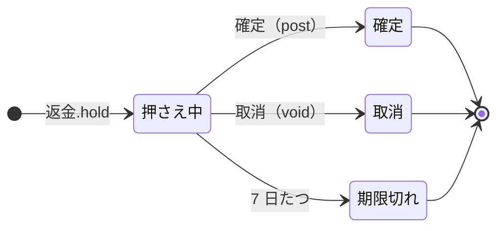

<!-- `chobo doc examples/refunds/refunds.ja.book --lang ja` の出力です。手で編集しないでください。 -->

# 返金 v1

注文ごとに、返金できる残りを勘定にする。売上で増え、返金で減り、0 より下にはならない。返金は承認を待つあいだ押さえる

`chobo doc` が `examples/refunds/refunds.ja.book` から作ったページ。勘定ごとに残高を持ち、残高は入った量から出た量を引いたもの。どの振替も勘定の下限と上限を守り、守れない振替は、その境界に付けた名前で断られて、どの移動も行われない。振替には、すぐに動かすもの（`do`）と、動かす量をまず押さえるもの（`hold`）がある。押さえた分は、あとで確定される（`post`。全部か一部）か、取り消される（`void`）か、有効期限で切れる。

## 勘定

| 勘定 | 分け方 | 単位 | 境界 | 説明 |
|---|---|---|---|---|
| `返金できる残り` | `注文` ごと | 円 | 0 以上。下回る振替は `返金超過` で断る | その注文でまだ返金できる額 |
| `売上` | 一つだけ | 円 | 外の勘定。境界は無く、マイナスにもなる |  |
| `返金済み` | 一つだけ | 円 | 外の勘定。境界は無く、マイナスにもなる |  |

## 勘定のあいだの流れ


四角は勘定で、矢印は振替の移動。角の丸い四角は外の勘定で、境界を持たない。破線の矢印は仮押さえの振替で、まず押さえ、確定したときに動く。

## 振替

### 売上計上

- 移動: `売上` から `返金できる残り(注文)` へ `額`。
- キー: `注文` ごとに一度だけ動く。同じ呼び出しの二度目は何もせず、`done_before` を返す。キーが同じで `額` が違う二度目の呼び出しは、`key_conflict` で断られる。
- すぐに動かす（`do`）。

| 操作 | 断られうる理由 | いつ |
|---|---|---|
| `売上計上.do` | `key_conflict` | `注文` が同じで、ほかの引数が違う呼び出しが、前に済んでいる |

<details><summary>断られる例</summary>

#### 売上計上.do: key_conflict

```text
 1  売上計上.do(注文: 注文-1, 額: 1)  通る
 2  売上計上.do(注文: 注文-1, 額: 2)  key_conflict で断られる
```

</details>

### 返金

承認を待つあいだ押さえる。承認されたら確定し、却下されたら取り消す

- 移動: `返金できる残り(注文)` から `返金済み` へ `額`。
- キー: `申請` ごとに一度だけ動く。同じ呼び出しの二度目は何もせず、`done_before` を返す。キーが同じで `注文`、`額` のどれかが違う二度目の呼び出しは、`key_conflict` で断られる。仮押さえが終わったあとに同じキーでもう一度押さえると、`done_before` を返し、何も押さえない。
- 仮押さえ: まず押さえる。確定と取消は呼ぶ側がする。押さえてから 7 日で期限が切れ、押さえた量は元に戻る。



| 仮押さえの状態 | post（確定） | void（取消） |
|---|---|---|
| 押さえ中 | 確定する。額を渡せばその額、渡さなければ全額で、残りは元に戻る。押さえた額を超えれば `over_hold` で断る。押さえてから 7 日たっていれば `expired` で断る | 取り消す。押さえた量は元に戻る。押さえてから 7 日たっていれば `expired` で断る |
| 確定 | 同じ額なら `done_before`、違う額なら `key_conflict` で断る | `already_posted` で断る |
| 取消 | `already_voided` で断る | `done_before` |
| 期限切れ | `expired` で断る | `expired` で断る |
| 仮押さえが無い | `no_such_hold` で断る | `no_such_hold` で断る |

| 操作 | 断られうる理由 | いつ |
|---|---|---|
| `返金.hold` | `返金超過` | `返金できる残り(注文)` が 0 を下回る |
| `返金.hold` | `key_conflict` | `申請` が同じで、ほかの引数が違う呼び出しが、前に済んでいる |
| `返金.hold` | `already_refused` | `申請` が同じ呼び出しが、前に境界で断られている。境界で断られたキーは、あとで足りるようになっても通らない |
| `返金.post` | `key_conflict` | 仮押さえは、違う額で確定済み |
| `返金.post` | `already_voided` | 仮押さえはもう取り消されている |
| `返金.post` | `expired` | 仮押さえの期限が切れている |
| `返金.post` | `over_hold` | 押さえた額より多く確定しようとした |
| `返金.post` | `no_such_hold` | その `申請` の仮押さえが無い |
| `返金.void` | `already_posted` | 仮押さえはもう確定している |
| `返金.void` | `expired` | 仮押さえの期限が切れている |
| `返金.void` | `no_such_hold` | その `申請` の仮押さえが無い |

<details><summary>断られる例</summary>

#### 返金.hold: 返金超過

```text
 1  返金.hold(申請: 申請-1, 注文: 注文-2, 額: 1)  返金超過 で断られる（1 つ目の移動が 返金できる残り(注文-2) から 1 を取ろうとしたときの残高は、確定 0、出ていく仮押さえ 0）
```

#### 返金.hold: key_conflict

```text
 1  売上計上.do(注文: 注文-1, 額: 1)              通る
 2  返金.hold(申請: 申請-2, 注文: 注文-1, 額: 1)  通る
 3  返金.hold(申請: 申請-2, 注文: 注文-1, 額: 2)  key_conflict で断られる
```

#### 返金.hold: already_refused

```text
 1  返金.hold(申請: 申請-1, 注文: 注文-2, 額: 1)  返金超過 で断られる（1 つ目の移動が 返金できる残り(注文-2) から 1 を取ろうとしたときの残高は、確定 0、出ていく仮押さえ 0）
 2  返金.hold(申請: 申請-1, 注文: 注文-2, 額: 1)  already_refused で断られる
```

#### 返金.post: key_conflict

```text
 1  売上計上.do(注文: 注文-1, 額: 2)              通る
 2  返金.hold(申請: 申請-2, 注文: 注文-1, 額: 2)  通る
 3  返金.post(申請: 申請-2)                       通る
 4  返金.post(申請: 申請-2, 額: 1)                key_conflict で断られる
```

#### 返金.post: already_voided

```text
 1  売上計上.do(注文: 注文-1, 額: 2)              通る
 2  返金.hold(申請: 申請-2, 注文: 注文-1, 額: 2)  通る
 3  返金.void(申請: 申請-2)                       通る
 4  返金.post(申請: 申請-2)                       already_voided で断られる
```

#### 返金.post: expired

```text
 1  売上計上.do(注文: 注文-1, 額: 2)              通る
 2  返金.hold(申請: 申請-2, 注文: 注文-1, 額: 2)  通る
 3  pass 7 日                                     返金(申請-2) が期限切れ
 4  返金.post(申請: 申請-2)                       expired で断られる
```

#### 返金.post: over_hold

```text
 1  売上計上.do(注文: 注文-1, 額: 2)              通る
 2  返金.hold(申請: 申請-2, 注文: 注文-1, 額: 2)  通る
 3  返金.post(申請: 申請-2, 額: 3)                over_hold で断られる
```

#### 返金.post: no_such_hold

```text
 1  返金.post(申請: 申請-1)  no_such_hold で断られる
```

#### 返金.void: already_posted

```text
 1  売上計上.do(注文: 注文-1, 額: 2)              通る
 2  返金.hold(申請: 申請-2, 注文: 注文-1, 額: 2)  通る
 3  返金.post(申請: 申請-2)                       通る
 4  返金.void(申請: 申請-2)                       already_posted で断られる
```

#### 返金.void: expired

```text
 1  売上計上.do(注文: 注文-1, 額: 2)              通る
 2  返金.hold(申請: 申請-2, 注文: 注文-1, 額: 2)  通る
 3  pass 7 日                                     返金(申請-2) が期限切れ
 4  返金.void(申請: 申請-2)                       expired で断られる
```

#### 返金.void: no_such_hold

```text
 1  返金.void(申請: 申請-1)  no_such_hold で断られる
```

</details>

## シナリオ

`chobo scenarios` が帳簿から作ったシナリオ 19 本。境界の手前・ちょうど・超える、同じキーの二度目、仮押さえの終わり方、二つの呼び出し元が同時に最後の一つを取りに来るもの、などがある。どれも参照インタプリタで流したもので、ステップごとに、そのあとの残高を載せている。残高は確定した量で、仮押さえがあれば、その量を括弧の中に添えている。

<details><summary>1. 境界: 返金.hold が 返金できる残り(注文) を 1 まで減らす（<code>at least 0</code> の 1 つ手前）</summary>

| # | 操作 | 結果 | 返金できる残り(注文-1) | 売上 | 返金済み |
|---|---|---|---|---|---|
| 1 | 売上計上.do(注文: 注文-1, 額: 2) | 通る | 2 | -2 | 0 |
| 2 | 返金.hold(申請: 申請-2, 注文: 注文-1, 額: 1) | 通る | 2（出ていく仮押さえ 1） | -2 | 0（入ってくる仮押さえ 1） |

</details>

<details><summary>2. 境界: 返金.hold が 返金できる残り(注文) をちょうど 0 まで減らす（<code>at least 0</code> ちょうど）</summary>

| # | 操作 | 結果 | 返金できる残り(注文-1) | 売上 | 返金済み |
|---|---|---|---|---|---|
| 1 | 売上計上.do(注文: 注文-1, 額: 2) | 通る | 2 | -2 | 0 |
| 2 | 返金.hold(申請: 申請-2, 注文: 注文-1, 額: 2) | 通る | 2（出ていく仮押さえ 2） | -2 | 0（入ってくる仮押さえ 2） |

</details>

<details><summary>3. 境界: 返金.hold は 返金できる残り(注文) を -1 まで減らすので断られる（<code>at least 0</code> を割る）</summary>

| # | 操作 | 結果 | 返金できる残り(注文-1) | 売上 | 返金済み |
|---|---|---|---|---|---|
| 1 | 売上計上.do(注文: 注文-1, 額: 2) | 通る | 2 | -2 | 0 |
| 2 | 返金.hold(申請: 申請-2, 注文: 注文-1, 額: 3) | 返金超過 で断られる | 2 | -2 | 0 |

</details>

<details><summary>4. キー: 売上計上.do を同じ引数で二度呼ぶ</summary>

| # | 操作 | 結果 | 返金できる残り(注文-1) | 売上 |
|---|---|---|---|---|
| 1 | 売上計上.do(注文: 注文-1, 額: 1) | 通る | 1 | -1 |
| 2 | 売上計上.do(注文: 注文-1, 額: 1) | done_before（前に済んでいる） | 1 | -1 |

</details>

<details><summary>5. キー: 売上計上.do を 額 だけ変えてもう一度呼ぶ</summary>

| # | 操作 | 結果 | 返金できる残り(注文-1) | 売上 |
|---|---|---|---|---|
| 1 | 売上計上.do(注文: 注文-1, 額: 1) | 通る | 1 | -1 |
| 2 | 売上計上.do(注文: 注文-1, 額: 2) | key_conflict で断られる | 1 | -1 |

</details>

<details><summary>6. キー: 返金.hold を同じ引数で二度呼ぶ</summary>

| # | 操作 | 結果 | 返金できる残り(注文-1) | 売上 | 返金済み |
|---|---|---|---|---|---|
| 1 | 売上計上.do(注文: 注文-1, 額: 1) | 通る | 1 | -1 | 0 |
| 2 | 返金.hold(申請: 申請-2, 注文: 注文-1, 額: 1) | 通る | 1（出ていく仮押さえ 1） | -1 | 0（入ってくる仮押さえ 1） |
| 3 | 返金.hold(申請: 申請-2, 注文: 注文-1, 額: 1) | done_before（前に済んでいる） | 1（出ていく仮押さえ 1） | -1 | 0（入ってくる仮押さえ 1） |

</details>

<details><summary>7. キー: 返金.hold を 額 だけ変えてもう一度呼ぶ</summary>

| # | 操作 | 結果 | 返金できる残り(注文-1) | 売上 | 返金済み |
|---|---|---|---|---|---|
| 1 | 売上計上.do(注文: 注文-1, 額: 1) | 通る | 1 | -1 | 0 |
| 2 | 返金.hold(申請: 申請-2, 注文: 注文-1, 額: 1) | 通る | 1（出ていく仮押さえ 1） | -1 | 0（入ってくる仮押さえ 1） |
| 3 | 返金.hold(申請: 申請-2, 注文: 注文-1, 額: 2) | key_conflict で断られる | 1（出ていく仮押さえ 1） | -1 | 0（入ってくる仮押さえ 1） |

</details>

<details><summary>8. キー: 返金.hold が 返金超過 で断られたあと、同じ引数ですぐにもう一度呼び、返金できる残り(注文) が足りるようになってからもう一度呼ぶ</summary>

| # | 操作 | 結果 | 返金できる残り(注文-2) | 売上 | 返金済み |
|---|---|---|---|---|---|
| 1 | 返金.hold(申請: 申請-1, 注文: 注文-2, 額: 1) | 返金超過 で断られる | 0 | 0 | 0 |
| 2 | 返金.hold(申請: 申請-1, 注文: 注文-2, 額: 1) | already_refused で断られる | 0 | 0 | 0 |
| 3 | 売上計上.do(注文: 注文-2, 額: 1) | 通る | 1 | -1 | 0 |
| 4 | 返金.hold(申請: 申請-1, 注文: 注文-2, 額: 1) | already_refused で断られる | 1 | -1 | 0 |

</details>

<details><summary>9. 仮押さえ: 返金 を全額で確定する</summary>

| # | 操作 | 結果 | 返金できる残り(注文-1) | 売上 | 返金済み |
|---|---|---|---|---|---|
| 1 | 売上計上.do(注文: 注文-1, 額: 2) | 通る | 2 | -2 | 0 |
| 2 | 返金.hold(申請: 申請-2, 注文: 注文-1, 額: 2) | 通る | 2（出ていく仮押さえ 2） | -2 | 0（入ってくる仮押さえ 2） |
| 3 | 返金.post(申請: 申請-2) | 通る | 0 | -2 | 2 |

</details>

<details><summary>10. 仮押さえ: 返金 を一部だけ確定する</summary>

| # | 操作 | 結果 | 返金できる残り(注文-1) | 売上 | 返金済み |
|---|---|---|---|---|---|
| 1 | 売上計上.do(注文: 注文-1, 額: 2) | 通る | 2 | -2 | 0 |
| 2 | 返金.hold(申請: 申請-2, 注文: 注文-1, 額: 2) | 通る | 2（出ていく仮押さえ 2） | -2 | 0（入ってくる仮押さえ 2） |
| 3 | 返金.post(申請: 申請-2, 額: 1) | 通る | 1 | -2 | 1 |

</details>

<details><summary>11. 仮押さえ: 返金 を取り消す</summary>

| # | 操作 | 結果 | 返金できる残り(注文-1) | 売上 | 返金済み |
|---|---|---|---|---|---|
| 1 | 売上計上.do(注文: 注文-1, 額: 2) | 通る | 2 | -2 | 0 |
| 2 | 返金.hold(申請: 申請-2, 注文: 注文-1, 額: 2) | 通る | 2（出ていく仮押さえ 2） | -2 | 0（入ってくる仮押さえ 2） |
| 3 | 返金.void(申請: 申請-2) | 通る | 2 | -2 | 0 |

</details>

<details><summary>12. 仮押さえ: 返金 を確定してから取り消そうとする</summary>

| # | 操作 | 結果 | 返金できる残り(注文-1) | 売上 | 返金済み |
|---|---|---|---|---|---|
| 1 | 売上計上.do(注文: 注文-1, 額: 2) | 通る | 2 | -2 | 0 |
| 2 | 返金.hold(申請: 申請-2, 注文: 注文-1, 額: 2) | 通る | 2（出ていく仮押さえ 2） | -2 | 0（入ってくる仮押さえ 2） |
| 3 | 返金.post(申請: 申請-2) | 通る | 0 | -2 | 2 |
| 4 | 返金.void(申請: 申請-2) | already_posted で断られる | 0 | -2 | 2 |

</details>

<details><summary>13. 仮押さえ: 返金 を取り消してから確定しようとする</summary>

| # | 操作 | 結果 | 返金できる残り(注文-1) | 売上 | 返金済み |
|---|---|---|---|---|---|
| 1 | 売上計上.do(注文: 注文-1, 額: 2) | 通る | 2 | -2 | 0 |
| 2 | 返金.hold(申請: 申請-2, 注文: 注文-1, 額: 2) | 通る | 2（出ていく仮押さえ 2） | -2 | 0（入ってくる仮押さえ 2） |
| 3 | 返金.void(申請: 申請-2) | 通る | 2 | -2 | 0 |
| 4 | 返金.post(申請: 申請-2) | already_voided で断られる | 2 | -2 | 0 |

</details>

<details><summary>14. 仮押さえ: 返金 を押さえた額より多く確定しようとし、押さえた額で確定する</summary>

| # | 操作 | 結果 | 返金できる残り(注文-1) | 売上 | 返金済み |
|---|---|---|---|---|---|
| 1 | 売上計上.do(注文: 注文-1, 額: 2) | 通る | 2 | -2 | 0 |
| 2 | 返金.hold(申請: 申請-2, 注文: 注文-1, 額: 2) | 通る | 2（出ていく仮押さえ 2） | -2 | 0（入ってくる仮押さえ 2） |
| 3 | 返金.post(申請: 申請-2, 額: 3) | over_hold で断られる | 2（出ていく仮押さえ 2） | -2 | 0（入ってくる仮押さえ 2） |
| 4 | 返金.post(申請: 申請-2, 額: 2) | 通る | 0 | -2 | 2 |

</details>

<details><summary>15. 仮押さえ: 返金 を押さえる前に確定しようとし、押さえてから確定する</summary>

| # | 操作 | 結果 | 返金できる残り(注文-2) | 売上 | 返金済み |
|---|---|---|---|---|---|
| 1 | 返金.post(申請: 申請-1) | no_such_hold で断られる | 0 | 0 | 0 |
| 2 | 売上計上.do(注文: 注文-2, 額: 1) | 通る | 1 | -1 | 0 |
| 3 | 返金.hold(申請: 申請-1, 注文: 注文-2, 額: 1) | 通る | 1（出ていく仮押さえ 1） | -1 | 0（入ってくる仮押さえ 1） |
| 4 | 返金.post(申請: 申請-1) | 通る | 0 | -1 | 1 |

</details>

<details><summary>16. 仮押さえ: 返金 を確定したあと、同じ額でもう一度、違う額でもう一度確定する</summary>

| # | 操作 | 結果 | 返金できる残り(注文-1) | 売上 | 返金済み |
|---|---|---|---|---|---|
| 1 | 売上計上.do(注文: 注文-1, 額: 2) | 通る | 2 | -2 | 0 |
| 2 | 返金.hold(申請: 申請-2, 注文: 注文-1, 額: 2) | 通る | 2（出ていく仮押さえ 2） | -2 | 0（入ってくる仮押さえ 2） |
| 3 | 返金.post(申請: 申請-2) | 通る | 0 | -2 | 2 |
| 4 | 返金.post(申請: 申請-2) | done_before（前に済んでいる） | 0 | -2 | 2 |
| 5 | 返金.post(申請: 申請-2, 額: 2) | done_before（前に済んでいる） | 0 | -2 | 2 |
| 6 | 返金.post(申請: 申請-2, 額: 1) | key_conflict で断られる | 0 | -2 | 2 |

</details>

<details><summary>17. 期限切れ: 返金 が期限切れになってから、確定と取消を試す</summary>

| # | 操作 | 結果 | 返金できる残り(注文-1) | 売上 | 返金済み |
|---|---|---|---|---|---|
| 1 | 売上計上.do(注文: 注文-1, 額: 2) | 通る | 2 | -2 | 0 |
| 2 | 返金.hold(申請: 申請-2, 注文: 注文-1, 額: 2) | 通る | 2（出ていく仮押さえ 2） | -2 | 0（入ってくる仮押さえ 2） |
| 3 | pass 10081 分 | 返金(申請-2) が期限切れ | 2 | -2 | 0 |
| 4 | 返金.post(申請: 申請-2) | expired で断られる | 2 | -2 | 0 |
| 5 | 返金.void(申請: 申請-2) | expired で断られる | 2 | -2 | 0 |

</details>

<details><summary>18. 期限切れ: 返金 が期限切れになってから、同じキーで押さえ直す</summary>

| # | 操作 | 結果 | 返金できる残り(注文-1) | 売上 | 返金済み |
|---|---|---|---|---|---|
| 1 | 売上計上.do(注文: 注文-1, 額: 2) | 通る | 2 | -2 | 0 |
| 2 | 返金.hold(申請: 申請-2, 注文: 注文-1, 額: 2) | 通る | 2（出ていく仮押さえ 2） | -2 | 0（入ってくる仮押さえ 2） |
| 3 | pass 10081 分 | 返金(申請-2) が期限切れ | 2 | -2 | 0 |
| 4 | 返金.hold(申請: 申請-2, 注文: 注文-1, 額: 2) | done_before（前に済んでいる） | 2 | -2 | 0 |

</details>

<details><summary>19. 同時: 二つの呼び出し元が 返金.hold で 返金できる残り(注文) の最後の 1 を取り合う</summary>

同時の操作の順序によって、結果は 2 通りある。

結果 1:

| # | 操作 | 結果 | 返金できる残り(注文-1) | 売上 | 返金済み |
|---|---|---|---|---|---|
| 1 | 売上計上.do(注文: 注文-1, 額: 1) | 通る | 1 | -1 | 0 |
| 2 | together<br>呼び出し元 1: 返金.hold(申請: 申請-2, 注文: 注文-1, 額: 1)<br>呼び出し元 2: 返金.hold(申請: 申請-3, 注文: 注文-1, 額: 1) | <br>通る<br>返金超過 で断られる | 1（出ていく仮押さえ 1） | -1 | 0（入ってくる仮押さえ 1） |

結果 2:

| # | 操作 | 結果 | 返金できる残り(注文-1) | 売上 | 返金済み |
|---|---|---|---|---|---|
| 1 | 売上計上.do(注文: 注文-1, 額: 1) | 通る | 1 | -1 | 0 |
| 2 | together<br>呼び出し元 1: 返金.hold(申請: 申請-2, 注文: 注文-1, 額: 1)<br>呼び出し元 2: 返金.hold(申請: 申請-3, 注文: 注文-1, 額: 1) | <br>返金超過 で断られる<br>通る | 1（出ていく仮押さえ 1） | -1 | 0（入ってくる仮押さえ 1） |

</details>

