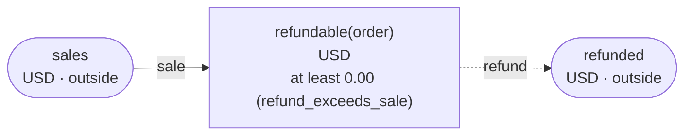
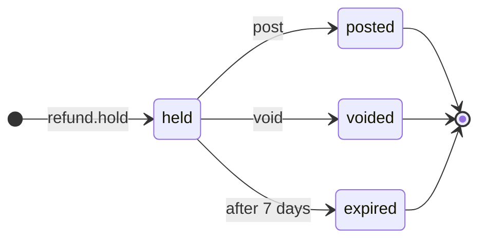

<!-- The output of `chobo doc examples/refunds/refunds.book`. Do not edit by hand. -->

# refunds v1

What is left to refund on each order is an account of its own: the sale adds to it, a refund takes from it, and it never goes below 0. A refund is held while it waits for approval

`examples/refunds/refunds.book`, as `chobo doc` writes it. Each account keeps a balance: what came in, less what went out. Every transfer keeps the bounds of the accounts: one that would break a bound is refused with the name the book gives that bound, and nothing of it moves. A transfer either moves at once (`do`), or first holds what it moves (`hold`); a hold is then posted (`post`, all of it or part), voided (`void`), or expires.

## Accounts

| Account | One for each | Unit | Bounds | What it is |
|---|---|---|---|---|
| `refundable` | `order` | USD | at least 0.00; a transfer that would go below is refused with `refund_exceeds_sale` | what is left to refund on the order |
| `sales` | one account | USD | outside the book: no bounds, and it may go below 0 |  |
| `refunded` | one account | USD | outside the book: no bounds, and it may go below 0 |  |

## How things move



A box is an account, and an arrow a move of a transfer. A rounded box is an account outside the book, which has no bounds. A dashed arrow belongs to a transfer that holds first, and moves when the hold is posted.

## Transfers

### sale

- Moves `amount` from `sales` to `refundable(order)`.
- Key: once per `order`. The same call again does nothing, and answers `done_before`; one that differs only in `amount` is refused with `key_conflict`.
- Moves at once (`do`).

| Operation | May be refused with | When |
|---|---|---|
| `sale.do` | `key_conflict` | a call with the same `order` and other arguments came before |

<details><summary>How each refusal comes about</summary>

#### sale.do: key_conflict

```text
 1  sale.do(order: order-1, amount: 0.01)  done
 2  sale.do(order: order-1, amount: 0.02)  refused: key_conflict
```

</details>

### refund

held while it waits for approval: posted when it is approved, voided when it is turned down

- Moves `amount` from `refundable(order)` to `refunded`.
- Key: once per `request`. The same call again does nothing, and answers `done_before`; one that differs only in `order` or `amount` is refused with `key_conflict`; holding again with the same key after the hold has ended answers `done_before`, and holds nothing.
- Holds first: the caller posts or voids the hold. It expires 7 days after it was made, and what it holds goes back.



| The hold | post | void |
|---|---|---|
| held | posts it: the amounts given, or all of it, and the rest goes back; more than it holds is refused with `over_hold`; once 7 days have passed since it was held, refused with `expired` | voids it: what it holds goes back; once 7 days have passed since it was held, refused with `expired` |
| posted | `done_before` with the same amounts; refused with `key_conflict` with others | refused with `already_posted` |
| voided | refused with `already_voided` | `done_before` |
| expired | refused with `expired` | refused with `expired` |
| no hold with the key | refused with `no_such_hold` | refused with `no_such_hold` |

| Operation | May be refused with | When |
|---|---|---|
| `refund.hold` | `refund_exceeds_sale` | `refundable(order)` would go below 0.00 |
| `refund.hold` | `key_conflict` | a call with the same `request` and other arguments came before |
| `refund.hold` | `already_refused` | a call with the same `request` was refused by a bound before; a key a bound refused stays refused, even once there is enough |
| `refund.post` | `key_conflict` | the hold was posted before, for other amounts |
| `refund.post` | `already_voided` | the hold is voided already |
| `refund.post` | `expired` | the hold has expired |
| `refund.post` | `over_hold` | more than the hold holds |
| `refund.post` | `no_such_hold` | there is no hold with that `request` |
| `refund.void` | `already_posted` | the hold is posted already |
| `refund.void` | `expired` | the hold has expired |
| `refund.void` | `no_such_hold` | there is no hold with that `request` |

<details><summary>How each refusal comes about</summary>

#### refund.hold: refund_exceeds_sale

```text
 1  refund.hold(request: request-1, order: order-2, amount: 0.01)  refused: refund_exceeds_sale (move 1 takes 0.01 from refundable(order-2): posted 0.00, held out 0.00)
```

#### refund.hold: key_conflict

```text
 1  sale.do(order: order-1, amount: 0.01)                          done
 2  refund.hold(request: request-2, order: order-1, amount: 0.01)  done
 3  refund.hold(request: request-2, order: order-1, amount: 0.02)  refused: key_conflict
```

#### refund.hold: already_refused

```text
 1  refund.hold(request: request-1, order: order-2, amount: 0.01)  refused: refund_exceeds_sale (move 1 takes 0.01 from refundable(order-2): posted 0.00, held out 0.00)
 2  refund.hold(request: request-1, order: order-2, amount: 0.01)  refused: already_refused
```

#### refund.post: key_conflict

```text
 1  sale.do(order: order-1, amount: 0.02)                          done
 2  refund.hold(request: request-2, order: order-1, amount: 0.02)  done
 3  refund.post(request: request-2)                                done
 4  refund.post(request: request-2, amount: 0.01)                  refused: key_conflict
```

#### refund.post: already_voided

```text
 1  sale.do(order: order-1, amount: 0.02)                          done
 2  refund.hold(request: request-2, order: order-1, amount: 0.02)  done
 3  refund.void(request: request-2)                                done
 4  refund.post(request: request-2)                                refused: already_voided
```

#### refund.post: expired

```text
 1  sale.do(order: order-1, amount: 0.02)                          done
 2  refund.hold(request: request-2, order: order-1, amount: 0.02)  done
 3  pass 7 days                                                    refund(request-2) expired
 4  refund.post(request: request-2)                                refused: expired
```

#### refund.post: over_hold

```text
 1  sale.do(order: order-1, amount: 0.02)                          done
 2  refund.hold(request: request-2, order: order-1, amount: 0.02)  done
 3  refund.post(request: request-2, amount: 0.03)                  refused: over_hold
```

#### refund.post: no_such_hold

```text
 1  refund.post(request: request-1)  refused: no_such_hold
```

#### refund.void: already_posted

```text
 1  sale.do(order: order-1, amount: 0.02)                          done
 2  refund.hold(request: request-2, order: order-1, amount: 0.02)  done
 3  refund.post(request: request-2)                                done
 4  refund.void(request: request-2)                                refused: already_posted
```

#### refund.void: expired

```text
 1  sale.do(order: order-1, amount: 0.02)                          done
 2  refund.hold(request: request-2, order: order-1, amount: 0.02)  done
 3  pass 7 days                                                    refund(request-2) expired
 4  refund.void(request: request-2)                                refused: expired
```

#### refund.void: no_such_hold

```text
 1  refund.void(request: request-1)  refused: no_such_hold
```

</details>

## Scenarios

19 scenarios, which `chobo scenarios` makes from the book: among them each bound just before, at and past it, each key used twice, every way a hold ends, and two callers after the last of something at the same time. The reference interpreter ran each one; after each step come the balances it left. A balance is what is posted, with what is held in brackets.

<details><summary>1. bound: refund.hold takes refundable(order) to 0.01, one above <code>at least 0.00</code></summary>

| # | Operation | Result | refundable(order-1) | sales | refunded |
|---|---|---|---|---|---|
| 1 | sale.do(order: order-1, amount: 0.02) | done | 0.02 | -0.02 | 0.00 |
| 2 | refund.hold(request: request-2, order: order-1, amount: 0.01) | done | 0.02 (held out 0.01) | -0.02 | 0.00 (held in 0.01) |

</details>

<details><summary>2. bound: refund.hold takes refundable(order) to exactly 0.00, its <code>at least 0.00</code></summary>

| # | Operation | Result | refundable(order-1) | sales | refunded |
|---|---|---|---|---|---|
| 1 | sale.do(order: order-1, amount: 0.02) | done | 0.02 | -0.02 | 0.00 |
| 2 | refund.hold(request: request-2, order: order-1, amount: 0.02) | done | 0.02 (held out 0.02) | -0.02 | 0.00 (held in 0.02) |

</details>

<details><summary>3. bound: refund.hold would take refundable(order) to -0.01, below <code>at least 0.00</code></summary>

| # | Operation | Result | refundable(order-1) | sales | refunded |
|---|---|---|---|---|---|
| 1 | sale.do(order: order-1, amount: 0.02) | done | 0.02 | -0.02 | 0.00 |
| 2 | refund.hold(request: request-2, order: order-1, amount: 0.03) | refused: refund_exceeds_sale | 0.02 | -0.02 | 0.00 |

</details>

<details><summary>4. key: sale.do twice with the same arguments</summary>

| # | Operation | Result | refundable(order-1) | sales |
|---|---|---|---|---|
| 1 | sale.do(order: order-1, amount: 0.01) | done | 0.01 | -0.01 |
| 2 | sale.do(order: order-1, amount: 0.01) | done_before | 0.01 | -0.01 |

</details>

<details><summary>5. key: sale.do again with another amount</summary>

| # | Operation | Result | refundable(order-1) | sales |
|---|---|---|---|---|
| 1 | sale.do(order: order-1, amount: 0.01) | done | 0.01 | -0.01 |
| 2 | sale.do(order: order-1, amount: 0.02) | refused: key_conflict | 0.01 | -0.01 |

</details>

<details><summary>6. key: refund.hold twice with the same arguments</summary>

| # | Operation | Result | refundable(order-1) | sales | refunded |
|---|---|---|---|---|---|
| 1 | sale.do(order: order-1, amount: 0.01) | done | 0.01 | -0.01 | 0.00 |
| 2 | refund.hold(request: request-2, order: order-1, amount: 0.01) | done | 0.01 (held out 0.01) | -0.01 | 0.00 (held in 0.01) |
| 3 | refund.hold(request: request-2, order: order-1, amount: 0.01) | done_before | 0.01 (held out 0.01) | -0.01 | 0.00 (held in 0.01) |

</details>

<details><summary>7. key: refund.hold again with another amount</summary>

| # | Operation | Result | refundable(order-1) | sales | refunded |
|---|---|---|---|---|---|
| 1 | sale.do(order: order-1, amount: 0.01) | done | 0.01 | -0.01 | 0.00 |
| 2 | refund.hold(request: request-2, order: order-1, amount: 0.01) | done | 0.01 (held out 0.01) | -0.01 | 0.00 (held in 0.01) |
| 3 | refund.hold(request: request-2, order: order-1, amount: 0.02) | refused: key_conflict | 0.01 (held out 0.01) | -0.01 | 0.00 (held in 0.01) |

</details>

<details><summary>8. key: refund.hold refused with refund_exceeds_sale, then again, and again once refundable(order) has enough</summary>

| # | Operation | Result | refundable(order-2) | sales | refunded |
|---|---|---|---|---|---|
| 1 | refund.hold(request: request-1, order: order-2, amount: 0.01) | refused: refund_exceeds_sale | 0.00 | 0.00 | 0.00 |
| 2 | refund.hold(request: request-1, order: order-2, amount: 0.01) | refused: already_refused | 0.00 | 0.00 | 0.00 |
| 3 | sale.do(order: order-2, amount: 0.01) | done | 0.01 | -0.01 | 0.00 |
| 4 | refund.hold(request: request-1, order: order-2, amount: 0.01) | refused: already_refused | 0.01 | -0.01 | 0.00 |

</details>

<details><summary>9. hold: refund posted in full</summary>

| # | Operation | Result | refundable(order-1) | sales | refunded |
|---|---|---|---|---|---|
| 1 | sale.do(order: order-1, amount: 0.02) | done | 0.02 | -0.02 | 0.00 |
| 2 | refund.hold(request: request-2, order: order-1, amount: 0.02) | done | 0.02 (held out 0.02) | -0.02 | 0.00 (held in 0.02) |
| 3 | refund.post(request: request-2) | done | 0.00 | -0.02 | 0.02 |

</details>

<details><summary>10. hold: refund posted in part</summary>

| # | Operation | Result | refundable(order-1) | sales | refunded |
|---|---|---|---|---|---|
| 1 | sale.do(order: order-1, amount: 0.02) | done | 0.02 | -0.02 | 0.00 |
| 2 | refund.hold(request: request-2, order: order-1, amount: 0.02) | done | 0.02 (held out 0.02) | -0.02 | 0.00 (held in 0.02) |
| 3 | refund.post(request: request-2, amount: 0.01) | done | 0.01 | -0.02 | 0.01 |

</details>

<details><summary>11. hold: refund voided</summary>

| # | Operation | Result | refundable(order-1) | sales | refunded |
|---|---|---|---|---|---|
| 1 | sale.do(order: order-1, amount: 0.02) | done | 0.02 | -0.02 | 0.00 |
| 2 | refund.hold(request: request-2, order: order-1, amount: 0.02) | done | 0.02 (held out 0.02) | -0.02 | 0.00 (held in 0.02) |
| 3 | refund.void(request: request-2) | done | 0.02 | -0.02 | 0.00 |

</details>

<details><summary>12. hold: refund posted, then voided</summary>

| # | Operation | Result | refundable(order-1) | sales | refunded |
|---|---|---|---|---|---|
| 1 | sale.do(order: order-1, amount: 0.02) | done | 0.02 | -0.02 | 0.00 |
| 2 | refund.hold(request: request-2, order: order-1, amount: 0.02) | done | 0.02 (held out 0.02) | -0.02 | 0.00 (held in 0.02) |
| 3 | refund.post(request: request-2) | done | 0.00 | -0.02 | 0.02 |
| 4 | refund.void(request: request-2) | refused: already_posted | 0.00 | -0.02 | 0.02 |

</details>

<details><summary>13. hold: refund voided, then posted</summary>

| # | Operation | Result | refundable(order-1) | sales | refunded |
|---|---|---|---|---|---|
| 1 | sale.do(order: order-1, amount: 0.02) | done | 0.02 | -0.02 | 0.00 |
| 2 | refund.hold(request: request-2, order: order-1, amount: 0.02) | done | 0.02 (held out 0.02) | -0.02 | 0.00 (held in 0.02) |
| 3 | refund.void(request: request-2) | done | 0.02 | -0.02 | 0.00 |
| 4 | refund.post(request: request-2) | refused: already_voided | 0.02 | -0.02 | 0.00 |

</details>

<details><summary>14. hold: refund posted for more than it holds, then for what it holds</summary>

| # | Operation | Result | refundable(order-1) | sales | refunded |
|---|---|---|---|---|---|
| 1 | sale.do(order: order-1, amount: 0.02) | done | 0.02 | -0.02 | 0.00 |
| 2 | refund.hold(request: request-2, order: order-1, amount: 0.02) | done | 0.02 (held out 0.02) | -0.02 | 0.00 (held in 0.02) |
| 3 | refund.post(request: request-2, amount: 0.03) | refused: over_hold | 0.02 (held out 0.02) | -0.02 | 0.00 (held in 0.02) |
| 4 | refund.post(request: request-2, amount: 0.02) | done | 0.00 | -0.02 | 0.02 |

</details>

<details><summary>15. hold: refund posted before it is held, then held and posted</summary>

| # | Operation | Result | refundable(order-2) | sales | refunded |
|---|---|---|---|---|---|
| 1 | refund.post(request: request-1) | refused: no_such_hold | 0.00 | 0.00 | 0.00 |
| 2 | sale.do(order: order-2, amount: 0.01) | done | 0.01 | -0.01 | 0.00 |
| 3 | refund.hold(request: request-1, order: order-2, amount: 0.01) | done | 0.01 (held out 0.01) | -0.01 | 0.00 (held in 0.01) |
| 4 | refund.post(request: request-1) | done | 0.00 | -0.01 | 0.01 |

</details>

<details><summary>16. hold: refund posted twice, with the same amounts and with others</summary>

| # | Operation | Result | refundable(order-1) | sales | refunded |
|---|---|---|---|---|---|
| 1 | sale.do(order: order-1, amount: 0.02) | done | 0.02 | -0.02 | 0.00 |
| 2 | refund.hold(request: request-2, order: order-1, amount: 0.02) | done | 0.02 (held out 0.02) | -0.02 | 0.00 (held in 0.02) |
| 3 | refund.post(request: request-2) | done | 0.00 | -0.02 | 0.02 |
| 4 | refund.post(request: request-2) | done_before | 0.00 | -0.02 | 0.02 |
| 5 | refund.post(request: request-2, amount: 0.02) | done_before | 0.00 | -0.02 | 0.02 |
| 6 | refund.post(request: request-2, amount: 0.01) | refused: key_conflict | 0.00 | -0.02 | 0.02 |

</details>

<details><summary>17. pass: refund expires, then is posted and voided</summary>

| # | Operation | Result | refundable(order-1) | sales | refunded |
|---|---|---|---|---|---|
| 1 | sale.do(order: order-1, amount: 0.02) | done | 0.02 | -0.02 | 0.00 |
| 2 | refund.hold(request: request-2, order: order-1, amount: 0.02) | done | 0.02 (held out 0.02) | -0.02 | 0.00 (held in 0.02) |
| 3 | pass 10081 minutes | refund(request-2) expired | 0.02 | -0.02 | 0.00 |
| 4 | refund.post(request: request-2) | refused: expired | 0.02 | -0.02 | 0.00 |
| 5 | refund.void(request: request-2) | refused: expired | 0.02 | -0.02 | 0.00 |

</details>

<details><summary>18. pass: refund held again with the same key after it expired</summary>

| # | Operation | Result | refundable(order-1) | sales | refunded |
|---|---|---|---|---|---|
| 1 | sale.do(order: order-1, amount: 0.02) | done | 0.02 | -0.02 | 0.00 |
| 2 | refund.hold(request: request-2, order: order-1, amount: 0.02) | done | 0.02 (held out 0.02) | -0.02 | 0.00 (held in 0.02) |
| 3 | pass 10081 minutes | refund(request-2) expired | 0.02 | -0.02 | 0.00 |
| 4 | refund.hold(request: request-2, order: order-1, amount: 0.02) | done_before | 0.02 | -0.02 | 0.00 |

</details>

<details><summary>19. together: two callers take the last 0.01 of refundable(order) with refund.hold</summary>

It can come out 2 ways, by the order the operations at the same time go in.

Outcome 1:

| # | Operation | Result | refundable(order-1) | sales | refunded |
|---|---|---|---|---|---|
| 1 | sale.do(order: order-1, amount: 0.01) | done | 0.01 | -0.01 | 0.00 |
| 2 | together<br>caller 1: refund.hold(request: request-2, order: order-1, amount: 0.01)<br>caller 2: refund.hold(request: request-3, order: order-1, amount: 0.01) | <br>done<br>refused: refund_exceeds_sale | 0.01 (held out 0.01) | -0.01 | 0.00 (held in 0.01) |

Outcome 2:

| # | Operation | Result | refundable(order-1) | sales | refunded |
|---|---|---|---|---|---|
| 1 | sale.do(order: order-1, amount: 0.01) | done | 0.01 | -0.01 | 0.00 |
| 2 | together<br>caller 1: refund.hold(request: request-2, order: order-1, amount: 0.01)<br>caller 2: refund.hold(request: request-3, order: order-1, amount: 0.01) | <br>refused: refund_exceeds_sale<br>done | 0.01 (held out 0.01) | -0.01 | 0.00 (held in 0.01) |

</details>

