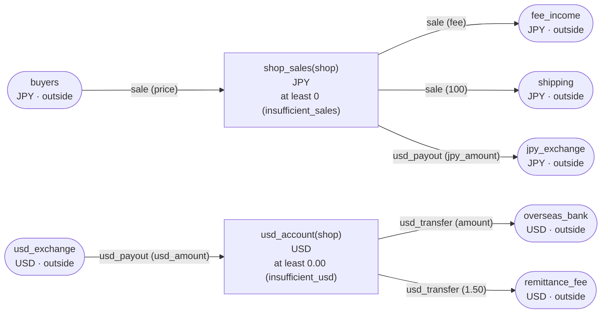

<!-- The output of `chobo doc tests/books/allocation.book`. Do not edit by hand. -->

# allocation v1

A marketplace splits a sale between the shop, the fee and the shipping, and pays out the shop's sales in dollars

`tests/books/allocation.book`, as `chobo doc` writes it. Each account keeps a balance: what came in, less what went out. Every transfer keeps the bounds of the accounts: one that would break a bound is refused with the name the book gives that bound, and nothing of it moves. A transfer either moves at once (`do`), or first holds what it moves (`hold`); a hold is then posted (`post`, all of it or part), voided (`void`), or expires.

## Accounts

| Account | One for each | Unit | Bounds | What it is |
|---|---|---|---|---|
| `buyers` | one account | JPY | outside the book: no bounds, and it may go below 0 |  |
| `fee_income` | one account | JPY | outside the book: no bounds, and it may go below 0 |  |
| `shipping` | one account | JPY | outside the book: no bounds, and it may go below 0 |  |
| `shop_sales` | `shop` | JPY | at least 0; a transfer that would go below is refused with `insufficient_sales` |  |
| `jpy_exchange` | one account | JPY | outside the book: no bounds, and it may go below 0 |  |
| `usd_exchange` | one account | USD | outside the book: no bounds, and it may go below 0 |  |
| `usd_account` | `shop` | USD | at least 0.00; a transfer that would go below is refused with `insufficient_usd` |  |
| `overseas_bank` | one account | USD | outside the book: no bounds, and it may go below 0 |  |
| `remittance_fee` | one account | USD | outside the book: no bounds, and it may go below 0 |  |

## How things move



A box is an account, and an arrow a move of a transfer. A rounded box is an account outside the book, which has no bounds. A dashed arrow belongs to a transfer that holds first, and moves when the hold is posted.

## Transfers

### sale

- 3 moves, made in this order, all or none:
    1. `price` from `buyers` to `shop_sales(shop)`
    2. `fee` from `shop_sales(shop)` to `fee_income`
    3. `100` from `shop_sales(shop)` to `shipping`
- Key: once per `order`. The same call again does nothing, and answers `done_before`; one that differs only in `shop`, `price` or `fee` is refused with `key_conflict`.
- Moves at once (`do`).

| Operation | May be refused with | When |
|---|---|---|
| `sale.do` | `insufficient_sales` | move 2 would take `shop_sales(shop)` below 0 |
| `sale.do` | `key_conflict` | a call with the same `order` and other arguments came before |
| `sale.do` | `already_refused` | a call with the same `order` was refused by a bound before; a key a bound refused stays refused, even once there is enough |

<details><summary>How each refusal comes about</summary>

#### sale.do: insufficient_sales

```text
 1  sale.do(order: order-1, shop: shop-2, price: 1, fee: 2)  refused: insufficient_sales (move 2 takes 2 from shop_sales(shop-2): posted 1, held out 0)
```

#### sale.do: key_conflict

```text
 1  sale.do(order: order-1, shop: shop-2, price: 1000, fee: 1)  done
 2  sale.do(order: order-1, shop: shop-2, price: 3, fee: 1)     refused: key_conflict
```

#### sale.do: already_refused

```text
 1  sale.do(order: order-1, shop: shop-2, price: 1, fee: 2)  refused: insufficient_sales (move 2 takes 2 from shop_sales(shop-2): posted 1, held out 0)
 2  sale.do(order: order-1, shop: shop-2, price: 1, fee: 2)  refused: already_refused
```

</details>

### usd_payout

the caller sets the rate of the exchange, and gives both the yen and the dollar amounts

- 2 moves, made in this order, all or none:
    1. `jpy_amount` from `shop_sales(shop)` to `jpy_exchange`
    2. `usd_amount` from `usd_exchange` to `usd_account(shop)`
- Key: once per `payout_id`. The same call again does nothing, and answers `done_before`; one that differs only in `shop`, `jpy_amount` or `usd_amount` is refused with `key_conflict`.
- Moves at once (`do`).

| Operation | May be refused with | When |
|---|---|---|
| `usd_payout.do` | `insufficient_sales` | move 1 would take `shop_sales(shop)` below 0 |
| `usd_payout.do` | `key_conflict` | a call with the same `payout_id` and other arguments came before |
| `usd_payout.do` | `already_refused` | a call with the same `payout_id` was refused by a bound before; a key a bound refused stays refused, even once there is enough |

<details><summary>How each refusal comes about</summary>

#### usd_payout.do: insufficient_sales

```text
 1  usd_payout.do(payout_id: payout_id-1, shop: shop-2, jpy_amount: 1, usd_amount: 0.02)  refused: insufficient_sales (move 1 takes 1 from shop_sales(shop-2): posted 0, held out 0)
```

#### usd_payout.do: key_conflict

```text
 1  sale.do(order: order-1, shop: shop-2, price: 104, fee: 3)                             done
 2  usd_payout.do(payout_id: payout_id-3, shop: shop-2, jpy_amount: 1, usd_amount: 0.02)  done
 3  usd_payout.do(payout_id: payout_id-3, shop: shop-2, jpy_amount: 4, usd_amount: 0.02)  refused: key_conflict
```

#### usd_payout.do: already_refused

```text
 1  usd_payout.do(payout_id: payout_id-1, shop: shop-2, jpy_amount: 1, usd_amount: 0.02)  refused: insufficient_sales (move 1 takes 1 from shop_sales(shop-2): posted 0, held out 0)
 2  usd_payout.do(payout_id: payout_id-1, shop: shop-2, jpy_amount: 1, usd_amount: 0.02)  refused: already_refused
```

</details>

### usd_transfer

- 2 moves, made in this order, all or none:
    1. `amount` from `usd_account(shop)` to `overseas_bank`
    2. `1.50` from `usd_account(shop)` to `remittance_fee`
- Key: once per `transfer_id`. The same call again does nothing, and answers `done_before`; one that differs only in `shop` or `amount` is refused with `key_conflict`.
- Moves at once (`do`).

| Operation | May be refused with | When |
|---|---|---|
| `usd_transfer.do` | `insufficient_usd` | move 1 would take `usd_account(shop)` below 0.00 |
| `usd_transfer.do` | `key_conflict` | a call with the same `transfer_id` and other arguments came before |
| `usd_transfer.do` | `already_refused` | a call with the same `transfer_id` was refused by a bound before; a key a bound refused stays refused, even once there is enough |

<details><summary>How each refusal comes about</summary>

#### usd_transfer.do: insufficient_usd

```text
 1  usd_transfer.do(transfer_id: transfer_id-1, shop: shop-2, amount: 0.01)  refused: insufficient_usd (move 1 takes 0.01 from usd_account(shop-2): posted 0.00, held out 0.00)
```

#### usd_transfer.do: key_conflict

```text
 1  sale.do(order: order-1, shop: shop-2, price: 105, fee: 3)                             done
 2  usd_payout.do(payout_id: payout_id-3, shop: shop-2, jpy_amount: 2, usd_amount: 1.51)  done
 3  usd_transfer.do(transfer_id: transfer_id-4, shop: shop-2, amount: 0.01)               done
 4  usd_transfer.do(transfer_id: transfer_id-4, shop: shop-2, amount: 0.04)               refused: key_conflict
```

#### usd_transfer.do: already_refused

```text
 1  usd_transfer.do(transfer_id: transfer_id-1, shop: shop-2, amount: 0.01)  refused: insufficient_usd (move 1 takes 0.01 from usd_account(shop-2): posted 0.00, held out 0.00)
 2  usd_transfer.do(transfer_id: transfer_id-1, shop: shop-2, amount: 0.01)  refused: already_refused
```

</details>

## Scenarios

17 scenarios, which `chobo scenarios` makes from the book: among them each bound just before, at and past it, each key used twice, every way a hold ends, and two callers after the last of something at the same time. The reference interpreter ran each one; after each step come the balances it left. A balance is what is posted, with what is held in brackets.

<details><summary>1. bound: usd_payout.do move 1 takes shop_sales(shop) to 1, one above <code>at least 0</code></summary>

| # | Operation | Result | buyers | fee_income | shipping | shop_sales(shop-2) | jpy_exchange | usd_exchange | usd_account(shop-2) |
|---|---|---|---|---|---|---|---|---|---|
| 1 | sale.do(order: order-1, shop: shop-2, price: 105, fee: 3) | done | -105 | 3 | 100 | 2 | 0 | 0.00 | 0.00 |
| 2 | usd_payout.do(payout_id: payout_id-3, shop: shop-2, jpy_amount: 1, usd_amount: 0.02) | done | -105 | 3 | 100 | 1 | 1 | -0.02 | 0.02 |

</details>

<details><summary>2. bound: usd_payout.do move 1 takes shop_sales(shop) to exactly 0, its <code>at least 0</code></summary>

| # | Operation | Result | buyers | fee_income | shipping | shop_sales(shop-2) | jpy_exchange | usd_exchange | usd_account(shop-2) |
|---|---|---|---|---|---|---|---|---|---|
| 1 | sale.do(order: order-1, shop: shop-2, price: 105, fee: 3) | done | -105 | 3 | 100 | 2 | 0 | 0.00 | 0.00 |
| 2 | usd_payout.do(payout_id: payout_id-3, shop: shop-2, jpy_amount: 2, usd_amount: 0.01) | done | -105 | 3 | 100 | 0 | 2 | -0.01 | 0.01 |

</details>

<details><summary>3. bound: usd_payout.do move 1 would take shop_sales(shop) to -1, below <code>at least 0</code></summary>

| # | Operation | Result | buyers | fee_income | shipping | shop_sales(shop-2) | jpy_exchange | usd_exchange | usd_account(shop-2) |
|---|---|---|---|---|---|---|---|---|---|
| 1 | sale.do(order: order-1, shop: shop-2, price: 106, fee: 4) | done | -106 | 4 | 100 | 2 | 0 | 0.00 | 0.00 |
| 2 | usd_payout.do(payout_id: payout_id-3, shop: shop-2, jpy_amount: 3, usd_amount: 0.01) | refused: insufficient_sales | -106 | 4 | 100 | 2 | 0 | 0.00 | 0.00 |

</details>

<details><summary>4. key: sale.do twice with the same arguments</summary>

| # | Operation | Result | buyers | fee_income | shipping | shop_sales(shop-2) |
|---|---|---|---|---|---|---|
| 1 | sale.do(order: order-1, shop: shop-2, price: 1000, fee: 1) | done | -1000 | 1 | 100 | 899 |
| 2 | sale.do(order: order-1, shop: shop-2, price: 1000, fee: 1) | done_before | -1000 | 1 | 100 | 899 |

</details>

<details><summary>5. key: sale.do again with another price</summary>

| # | Operation | Result | buyers | fee_income | shipping | shop_sales(shop-2) |
|---|---|---|---|---|---|---|
| 1 | sale.do(order: order-1, shop: shop-2, price: 1000, fee: 1) | done | -1000 | 1 | 100 | 899 |
| 2 | sale.do(order: order-1, shop: shop-2, price: 3, fee: 1) | refused: key_conflict | -1000 | 1 | 100 | 899 |

</details>

<details><summary>6. key: sale.do refused with insufficient_sales, then again, and again once shop_sales(shop) has enough</summary>

| # | Operation | Result | buyers | fee_income | shipping | shop_sales(shop-2) |
|---|---|---|---|---|---|---|
| 1 | sale.do(order: order-1, shop: shop-2, price: 1, fee: 2) | refused: insufficient_sales | 0 | 0 | 0 | 0 |
| 2 | sale.do(order: order-1, shop: shop-2, price: 1, fee: 2) | refused: already_refused | 0 | 0 | 0 | 0 |
| 3 | sale.do(order: order-3, shop: shop-2, price: 105, fee: 3) | done | -105 | 3 | 100 | 2 |
| 4 | sale.do(order: order-1, shop: shop-2, price: 1, fee: 2) | refused: already_refused | -105 | 3 | 100 | 2 |

</details>

<details><summary>7. key: usd_payout.do twice with the same arguments</summary>

| # | Operation | Result | buyers | fee_income | shipping | shop_sales(shop-2) | jpy_exchange | usd_exchange | usd_account(shop-2) |
|---|---|---|---|---|---|---|---|---|---|
| 1 | sale.do(order: order-1, shop: shop-2, price: 104, fee: 3) | done | -104 | 3 | 100 | 1 | 0 | 0.00 | 0.00 |
| 2 | usd_payout.do(payout_id: payout_id-3, shop: shop-2, jpy_amount: 1, usd_amount: 0.02) | done | -104 | 3 | 100 | 0 | 1 | -0.02 | 0.02 |
| 3 | usd_payout.do(payout_id: payout_id-3, shop: shop-2, jpy_amount: 1, usd_amount: 0.02) | done_before | -104 | 3 | 100 | 0 | 1 | -0.02 | 0.02 |

</details>

<details><summary>8. key: usd_payout.do again with another jpy_amount</summary>

| # | Operation | Result | buyers | fee_income | shipping | shop_sales(shop-2) | jpy_exchange | usd_exchange | usd_account(shop-2) |
|---|---|---|---|---|---|---|---|---|---|
| 1 | sale.do(order: order-1, shop: shop-2, price: 104, fee: 3) | done | -104 | 3 | 100 | 1 | 0 | 0.00 | 0.00 |
| 2 | usd_payout.do(payout_id: payout_id-3, shop: shop-2, jpy_amount: 1, usd_amount: 0.02) | done | -104 | 3 | 100 | 0 | 1 | -0.02 | 0.02 |
| 3 | usd_payout.do(payout_id: payout_id-3, shop: shop-2, jpy_amount: 4, usd_amount: 0.02) | refused: key_conflict | -104 | 3 | 100 | 0 | 1 | -0.02 | 0.02 |

</details>

<details><summary>9. key: usd_payout.do refused with insufficient_sales, then again, and again once shop_sales(shop) has enough</summary>

| # | Operation | Result | buyers | fee_income | shipping | shop_sales(shop-2) | jpy_exchange | usd_exchange | usd_account(shop-2) |
|---|---|---|---|---|---|---|---|---|---|
| 1 | usd_payout.do(payout_id: payout_id-1, shop: shop-2, jpy_amount: 1, usd_amount: 0.02) | refused: insufficient_sales | 0 | 0 | 0 | 0 | 0 | 0.00 | 0.00 |
| 2 | usd_payout.do(payout_id: payout_id-1, shop: shop-2, jpy_amount: 1, usd_amount: 0.02) | refused: already_refused | 0 | 0 | 0 | 0 | 0 | 0.00 | 0.00 |
| 3 | sale.do(order: order-3, shop: shop-2, price: 104, fee: 3) | done | -104 | 3 | 100 | 1 | 0 | 0.00 | 0.00 |
| 4 | usd_payout.do(payout_id: payout_id-1, shop: shop-2, jpy_amount: 1, usd_amount: 0.02) | refused: already_refused | -104 | 3 | 100 | 1 | 0 | 0.00 | 0.00 |

</details>

<details><summary>10. key: usd_transfer.do twice with the same arguments</summary>

| # | Operation | Result | buyers | fee_income | shipping | shop_sales(shop-2) | jpy_exchange | usd_exchange | usd_account(shop-2) | overseas_bank | remittance_fee |
|---|---|---|---|---|---|---|---|---|---|---|---|
| 1 | sale.do(order: order-1, shop: shop-2, price: 105, fee: 3) | done | -105 | 3 | 100 | 2 | 0 | 0.00 | 0.00 | 0.00 | 0.00 |
| 2 | usd_payout.do(payout_id: payout_id-3, shop: shop-2, jpy_amount: 2, usd_amount: 1.51) | done | -105 | 3 | 100 | 0 | 2 | -1.51 | 1.51 | 0.00 | 0.00 |
| 3 | usd_transfer.do(transfer_id: transfer_id-4, shop: shop-2, amount: 0.01) | done | -105 | 3 | 100 | 0 | 2 | -1.51 | 0.00 | 0.01 | 1.50 |
| 4 | usd_transfer.do(transfer_id: transfer_id-4, shop: shop-2, amount: 0.01) | done_before | -105 | 3 | 100 | 0 | 2 | -1.51 | 0.00 | 0.01 | 1.50 |

</details>

<details><summary>11. key: usd_transfer.do again with another amount</summary>

| # | Operation | Result | buyers | fee_income | shipping | shop_sales(shop-2) | jpy_exchange | usd_exchange | usd_account(shop-2) | overseas_bank | remittance_fee |
|---|---|---|---|---|---|---|---|---|---|---|---|
| 1 | sale.do(order: order-1, shop: shop-2, price: 105, fee: 3) | done | -105 | 3 | 100 | 2 | 0 | 0.00 | 0.00 | 0.00 | 0.00 |
| 2 | usd_payout.do(payout_id: payout_id-3, shop: shop-2, jpy_amount: 2, usd_amount: 1.51) | done | -105 | 3 | 100 | 0 | 2 | -1.51 | 1.51 | 0.00 | 0.00 |
| 3 | usd_transfer.do(transfer_id: transfer_id-4, shop: shop-2, amount: 0.01) | done | -105 | 3 | 100 | 0 | 2 | -1.51 | 0.00 | 0.01 | 1.50 |
| 4 | usd_transfer.do(transfer_id: transfer_id-4, shop: shop-2, amount: 0.04) | refused: key_conflict | -105 | 3 | 100 | 0 | 2 | -1.51 | 0.00 | 0.01 | 1.50 |

</details>

<details><summary>12. key: usd_transfer.do refused with insufficient_usd, then again, and again once usd_account(shop) has enough</summary>

| # | Operation | Result | buyers | fee_income | shipping | shop_sales(shop-2) | jpy_exchange | usd_exchange | usd_account(shop-2) | overseas_bank | remittance_fee |
|---|---|---|---|---|---|---|---|---|---|---|---|
| 1 | usd_transfer.do(transfer_id: transfer_id-1, shop: shop-2, amount: 0.01) | refused: insufficient_usd | 0 | 0 | 0 | 0 | 0 | 0.00 | 0.00 | 0.00 | 0.00 |
| 2 | usd_transfer.do(transfer_id: transfer_id-1, shop: shop-2, amount: 0.01) | refused: already_refused | 0 | 0 | 0 | 0 | 0 | 0.00 | 0.00 | 0.00 | 0.00 |
| 3 | sale.do(order: order-3, shop: shop-2, price: 105, fee: 3) | done | -105 | 3 | 100 | 2 | 0 | 0.00 | 0.00 | 0.00 | 0.00 |
| 4 | usd_payout.do(payout_id: payout_id-4, shop: shop-2, jpy_amount: 2, usd_amount: 0.01) | done | -105 | 3 | 100 | 0 | 2 | -0.01 | 0.01 | 0.00 | 0.00 |
| 5 | usd_transfer.do(transfer_id: transfer_id-1, shop: shop-2, amount: 0.01) | refused: already_refused | -105 | 3 | 100 | 0 | 2 | -0.01 | 0.01 | 0.00 | 0.00 |

</details>

<details><summary>13. moves: sale.do refused at move 2 (shop_sales(shop)), and no move is made</summary>

| # | Operation | Result | buyers | fee_income | shipping | shop_sales(shop-2) |
|---|---|---|---|---|---|---|
| 1 | sale.do(order: order-1, shop: shop-2, price: 1, fee: 2) | refused: insufficient_sales | 0 | 0 | 0 | 0 |

</details>

<details><summary>14. moves: sale.do refused at move 3 (shop_sales(shop)), and no move is made</summary>

| # | Operation | Result | buyers | fee_income | shipping | shop_sales(shop-2) |
|---|---|---|---|---|---|---|
| 1 | sale.do(order: order-1, shop: shop-2, price: 2, fee: 1) | refused: insufficient_sales | 0 | 0 | 0 | 0 |

</details>

<details><summary>15. moves: usd_payout.do refused at move 1 (shop_sales(shop)), and no move is made</summary>

| # | Operation | Result | shop_sales(shop-2) | jpy_exchange | usd_exchange | usd_account(shop-2) |
|---|---|---|---|---|---|---|
| 1 | usd_payout.do(payout_id: payout_id-1, shop: shop-2, jpy_amount: 1, usd_amount: 0.02) | refused: insufficient_sales | 0 | 0 | 0.00 | 0.00 |

</details>

<details><summary>16. moves: usd_transfer.do refused at move 1 (usd_account(shop)), and no move is made</summary>

| # | Operation | Result | usd_account(shop-2) | overseas_bank | remittance_fee |
|---|---|---|---|---|---|
| 1 | usd_transfer.do(transfer_id: transfer_id-1, shop: shop-2, amount: 0.01) | refused: insufficient_usd | 0.00 | 0.00 | 0.00 |

</details>

<details><summary>17. together: two callers take the last 1 of shop_sales(shop) with usd_payout.do</summary>

It can come out 2 ways, by the order the operations at the same time go in.

Outcome 1:

| # | Operation | Result | buyers | fee_income | shipping | shop_sales(shop-2) | jpy_exchange | usd_exchange | usd_account(shop-2) |
|---|---|---|---|---|---|---|---|---|---|
| 1 | sale.do(order: order-1, shop: shop-2, price: 105, fee: 4) | done | -105 | 4 | 100 | 1 | 0 | 0.00 | 0.00 |
| 2 | together<br>caller 1: usd_payout.do(payout_id: payout_id-3, shop: shop-2, jpy_amount: 1, usd_amount: 0.02)<br>caller 2: usd_payout.do(payout_id: payout_id-4, shop: shop-2, jpy_amount: 1, usd_amount: 0.03) | <br>done<br>refused: insufficient_sales | -105 | 4 | 100 | 0 | 1 | -0.02 | 0.02 |

Outcome 2:

| # | Operation | Result | buyers | fee_income | shipping | shop_sales(shop-2) | jpy_exchange | usd_exchange | usd_account(shop-2) |
|---|---|---|---|---|---|---|---|---|---|
| 1 | sale.do(order: order-1, shop: shop-2, price: 105, fee: 4) | done | -105 | 4 | 100 | 1 | 0 | 0.00 | 0.00 |
| 2 | together<br>caller 1: usd_payout.do(payout_id: payout_id-3, shop: shop-2, jpy_amount: 1, usd_amount: 0.02)<br>caller 2: usd_payout.do(payout_id: payout_id-4, shop: shop-2, jpy_amount: 1, usd_amount: 0.03) | <br>refused: insufficient_sales<br>done | -105 | 4 | 100 | 0 | 1 | -0.03 | 0.03 |

</details>

