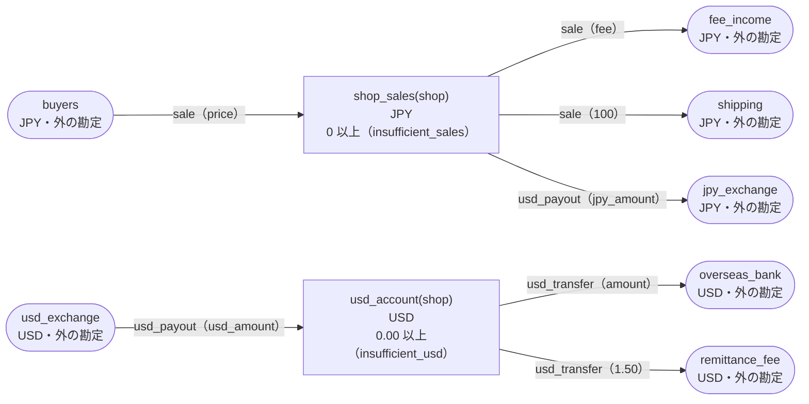

<!-- `chobo doc tests/books/allocation.book --lang ja` の出力です。手で編集しないでください。 -->

# allocation v1

A marketplace splits a sale between the shop, the fee and the shipping, and pays out the shop's sales in dollars

`chobo doc` が `tests/books/allocation.book` から作ったページ。勘定ごとに残高を持ち、残高は入った量から出た量を引いたもの。どの振替も勘定の下限と上限を守り、守れない振替は、その境界に付けた名前で断られて、どの移動も行われない。振替には、すぐに動かすもの（`do`）と、動かす量をまず押さえるもの（`hold`）がある。押さえた分は、あとで確定される（`post`。全部か一部）か、取り消される（`void`）か、有効期限で切れる。

## 勘定

| 勘定 | 分け方 | 単位 | 境界 | 説明 |
|---|---|---|---|---|
| `buyers` | 一つだけ | JPY | 外の勘定。境界は無く、マイナスにもなる |  |
| `fee_income` | 一つだけ | JPY | 外の勘定。境界は無く、マイナスにもなる |  |
| `shipping` | 一つだけ | JPY | 外の勘定。境界は無く、マイナスにもなる |  |
| `shop_sales` | `shop` ごと | JPY | 0 以上。下回る振替は `insufficient_sales` で断る |  |
| `jpy_exchange` | 一つだけ | JPY | 外の勘定。境界は無く、マイナスにもなる |  |
| `usd_exchange` | 一つだけ | USD | 外の勘定。境界は無く、マイナスにもなる |  |
| `usd_account` | `shop` ごと | USD | 0.00 以上。下回る振替は `insufficient_usd` で断る |  |
| `overseas_bank` | 一つだけ | USD | 外の勘定。境界は無く、マイナスにもなる |  |
| `remittance_fee` | 一つだけ | USD | 外の勘定。境界は無く、マイナスにもなる |  |

## 勘定のあいだの流れ



四角は勘定で、矢印は振替の移動。角の丸い四角は外の勘定で、境界を持たない。破線の矢印は仮押さえの振替で、まず押さえ、確定したときに動く。

## 振替

### sale

- 移動は 3 つ。書いた順に行い、どれか一つでも断られたら、どれも行わない:
    1. `buyers` から `shop_sales(shop)` へ `price`
    2. `shop_sales(shop)` から `fee_income` へ `fee`
    3. `shop_sales(shop)` から `shipping` へ `100`
- キー: `order` ごとに一度だけ動く。同じ呼び出しの二度目は何もせず、`done_before` を返す。キーが同じで `shop`、`price`、`fee` のどれかが違う二度目の呼び出しは、`key_conflict` で断られる。
- すぐに動かす（`do`）。

| 操作 | 断られうる理由 | いつ |
|---|---|---|
| `sale.do` | `insufficient_sales` | 2 つ目の移動で `shop_sales(shop)` が 0 を下回る |
| `sale.do` | `key_conflict` | `order` が同じで、ほかの引数が違う呼び出しが、前に済んでいる |
| `sale.do` | `already_refused` | `order` が同じ呼び出しが、前に境界で断られている。境界で断られたキーは、あとで足りるようになっても通らない |

<details><summary>断られる例</summary>

#### sale.do: insufficient_sales

```text
 1  sale.do(order: order-1, shop: shop-2, price: 1, fee: 2)  insufficient_sales で断られる（2 つ目の移動が shop_sales(shop-2) から 2 を取ろうとしたときの残高は、確定 1、出ていく仮押さえ 0）
```

#### sale.do: key_conflict

```text
 1  sale.do(order: order-1, shop: shop-2, price: 1000, fee: 1)  通る
 2  sale.do(order: order-1, shop: shop-2, price: 3, fee: 1)     key_conflict で断られる
```

#### sale.do: already_refused

```text
 1  sale.do(order: order-1, shop: shop-2, price: 1, fee: 2)  insufficient_sales で断られる（2 つ目の移動が shop_sales(shop-2) から 2 を取ろうとしたときの残高は、確定 1、出ていく仮押さえ 0）
 2  sale.do(order: order-1, shop: shop-2, price: 1, fee: 2)  already_refused で断られる
```

</details>

### usd_payout

the caller sets the rate of the exchange, and gives both the yen and the dollar amounts

- 移動は 2 つ。書いた順に行い、どれか一つでも断られたら、どれも行わない:
    1. `shop_sales(shop)` から `jpy_exchange` へ `jpy_amount`
    2. `usd_exchange` から `usd_account(shop)` へ `usd_amount`
- キー: `payout_id` ごとに一度だけ動く。同じ呼び出しの二度目は何もせず、`done_before` を返す。キーが同じで `shop`、`jpy_amount`、`usd_amount` のどれかが違う二度目の呼び出しは、`key_conflict` で断られる。
- すぐに動かす（`do`）。

| 操作 | 断られうる理由 | いつ |
|---|---|---|
| `usd_payout.do` | `insufficient_sales` | 1 つ目の移動で `shop_sales(shop)` が 0 を下回る |
| `usd_payout.do` | `key_conflict` | `payout_id` が同じで、ほかの引数が違う呼び出しが、前に済んでいる |
| `usd_payout.do` | `already_refused` | `payout_id` が同じ呼び出しが、前に境界で断られている。境界で断られたキーは、あとで足りるようになっても通らない |

<details><summary>断られる例</summary>

#### usd_payout.do: insufficient_sales

```text
 1  usd_payout.do(payout_id: payout_id-1, shop: shop-2, jpy_amount: 1, usd_amount: 0.02)  insufficient_sales で断られる（1 つ目の移動が shop_sales(shop-2) から 1 を取ろうとしたときの残高は、確定 0、出ていく仮押さえ 0）
```

#### usd_payout.do: key_conflict

```text
 1  sale.do(order: order-1, shop: shop-2, price: 104, fee: 3)                             通る
 2  usd_payout.do(payout_id: payout_id-3, shop: shop-2, jpy_amount: 1, usd_amount: 0.02)  通る
 3  usd_payout.do(payout_id: payout_id-3, shop: shop-2, jpy_amount: 4, usd_amount: 0.02)  key_conflict で断られる
```

#### usd_payout.do: already_refused

```text
 1  usd_payout.do(payout_id: payout_id-1, shop: shop-2, jpy_amount: 1, usd_amount: 0.02)  insufficient_sales で断られる（1 つ目の移動が shop_sales(shop-2) から 1 を取ろうとしたときの残高は、確定 0、出ていく仮押さえ 0）
 2  usd_payout.do(payout_id: payout_id-1, shop: shop-2, jpy_amount: 1, usd_amount: 0.02)  already_refused で断られる
```

</details>

### usd_transfer

- 移動は 2 つ。書いた順に行い、どれか一つでも断られたら、どれも行わない:
    1. `usd_account(shop)` から `overseas_bank` へ `amount`
    2. `usd_account(shop)` から `remittance_fee` へ `1.50`
- キー: `transfer_id` ごとに一度だけ動く。同じ呼び出しの二度目は何もせず、`done_before` を返す。キーが同じで `shop`、`amount` のどれかが違う二度目の呼び出しは、`key_conflict` で断られる。
- すぐに動かす（`do`）。

| 操作 | 断られうる理由 | いつ |
|---|---|---|
| `usd_transfer.do` | `insufficient_usd` | 1 つ目の移動で `usd_account(shop)` が 0.00 を下回る |
| `usd_transfer.do` | `key_conflict` | `transfer_id` が同じで、ほかの引数が違う呼び出しが、前に済んでいる |
| `usd_transfer.do` | `already_refused` | `transfer_id` が同じ呼び出しが、前に境界で断られている。境界で断られたキーは、あとで足りるようになっても通らない |

<details><summary>断られる例</summary>

#### usd_transfer.do: insufficient_usd

```text
 1  usd_transfer.do(transfer_id: transfer_id-1, shop: shop-2, amount: 0.01)  insufficient_usd で断られる（1 つ目の移動が usd_account(shop-2) から 0.01 を取ろうとしたときの残高は、確定 0.00、出ていく仮押さえ 0.00）
```

#### usd_transfer.do: key_conflict

```text
 1  sale.do(order: order-1, shop: shop-2, price: 105, fee: 3)                             通る
 2  usd_payout.do(payout_id: payout_id-3, shop: shop-2, jpy_amount: 2, usd_amount: 1.51)  通る
 3  usd_transfer.do(transfer_id: transfer_id-4, shop: shop-2, amount: 0.01)               通る
 4  usd_transfer.do(transfer_id: transfer_id-4, shop: shop-2, amount: 0.04)               key_conflict で断られる
```

#### usd_transfer.do: already_refused

```text
 1  usd_transfer.do(transfer_id: transfer_id-1, shop: shop-2, amount: 0.01)  insufficient_usd で断られる（1 つ目の移動が usd_account(shop-2) から 0.01 を取ろうとしたときの残高は、確定 0.00、出ていく仮押さえ 0.00）
 2  usd_transfer.do(transfer_id: transfer_id-1, shop: shop-2, amount: 0.01)  already_refused で断られる
```

</details>

## シナリオ

`chobo scenarios` が帳簿から作ったシナリオ 17 本。境界の手前・ちょうど・超える、同じキーの二度目、仮押さえの終わり方、二つの呼び出し元が同時に最後の一つを取りに来るもの、などがある。どれも参照インタプリタで流したもので、ステップごとに、そのあとの残高を載せている。残高は確定した量で、仮押さえがあれば、その量を括弧の中に添えている。

<details><summary>1. 境界: usd_payout.do の 1 つ目の移動が shop_sales(shop) を 1 まで減らす（<code>at least 0</code> の 1 つ手前）</summary>

| # | 操作 | 結果 | buyers | fee_income | shipping | shop_sales(shop-2) | jpy_exchange | usd_exchange | usd_account(shop-2) |
|---|---|---|---|---|---|---|---|---|---|
| 1 | sale.do(order: order-1, shop: shop-2, price: 105, fee: 3) | 通る | -105 | 3 | 100 | 2 | 0 | 0.00 | 0.00 |
| 2 | usd_payout.do(payout_id: payout_id-3, shop: shop-2, jpy_amount: 1, usd_amount: 0.02) | 通る | -105 | 3 | 100 | 1 | 1 | -0.02 | 0.02 |

</details>

<details><summary>2. 境界: usd_payout.do の 1 つ目の移動が shop_sales(shop) をちょうど 0 まで減らす（<code>at least 0</code> ちょうど）</summary>

| # | 操作 | 結果 | buyers | fee_income | shipping | shop_sales(shop-2) | jpy_exchange | usd_exchange | usd_account(shop-2) |
|---|---|---|---|---|---|---|---|---|---|
| 1 | sale.do(order: order-1, shop: shop-2, price: 105, fee: 3) | 通る | -105 | 3 | 100 | 2 | 0 | 0.00 | 0.00 |
| 2 | usd_payout.do(payout_id: payout_id-3, shop: shop-2, jpy_amount: 2, usd_amount: 0.01) | 通る | -105 | 3 | 100 | 0 | 2 | -0.01 | 0.01 |

</details>

<details><summary>3. 境界: usd_payout.do の 1 つ目の移動は shop_sales(shop) を -1 まで減らすので断られる（<code>at least 0</code> を割る）</summary>

| # | 操作 | 結果 | buyers | fee_income | shipping | shop_sales(shop-2) | jpy_exchange | usd_exchange | usd_account(shop-2) |
|---|---|---|---|---|---|---|---|---|---|
| 1 | sale.do(order: order-1, shop: shop-2, price: 106, fee: 4) | 通る | -106 | 4 | 100 | 2 | 0 | 0.00 | 0.00 |
| 2 | usd_payout.do(payout_id: payout_id-3, shop: shop-2, jpy_amount: 3, usd_amount: 0.01) | insufficient_sales で断られる | -106 | 4 | 100 | 2 | 0 | 0.00 | 0.00 |

</details>

<details><summary>4. キー: sale.do を同じ引数で二度呼ぶ</summary>

| # | 操作 | 結果 | buyers | fee_income | shipping | shop_sales(shop-2) |
|---|---|---|---|---|---|---|
| 1 | sale.do(order: order-1, shop: shop-2, price: 1000, fee: 1) | 通る | -1000 | 1 | 100 | 899 |
| 2 | sale.do(order: order-1, shop: shop-2, price: 1000, fee: 1) | done_before（前に済んでいる） | -1000 | 1 | 100 | 899 |

</details>

<details><summary>5. キー: sale.do を price だけ変えてもう一度呼ぶ</summary>

| # | 操作 | 結果 | buyers | fee_income | shipping | shop_sales(shop-2) |
|---|---|---|---|---|---|---|
| 1 | sale.do(order: order-1, shop: shop-2, price: 1000, fee: 1) | 通る | -1000 | 1 | 100 | 899 |
| 2 | sale.do(order: order-1, shop: shop-2, price: 3, fee: 1) | key_conflict で断られる | -1000 | 1 | 100 | 899 |

</details>

<details><summary>6. キー: sale.do が insufficient_sales で断られたあと、同じ引数ですぐにもう一度呼び、shop_sales(shop) が足りるようになってからもう一度呼ぶ</summary>

| # | 操作 | 結果 | buyers | fee_income | shipping | shop_sales(shop-2) |
|---|---|---|---|---|---|---|
| 1 | sale.do(order: order-1, shop: shop-2, price: 1, fee: 2) | insufficient_sales で断られる | 0 | 0 | 0 | 0 |
| 2 | sale.do(order: order-1, shop: shop-2, price: 1, fee: 2) | already_refused で断られる | 0 | 0 | 0 | 0 |
| 3 | sale.do(order: order-3, shop: shop-2, price: 105, fee: 3) | 通る | -105 | 3 | 100 | 2 |
| 4 | sale.do(order: order-1, shop: shop-2, price: 1, fee: 2) | already_refused で断られる | -105 | 3 | 100 | 2 |

</details>

<details><summary>7. キー: usd_payout.do を同じ引数で二度呼ぶ</summary>

| # | 操作 | 結果 | buyers | fee_income | shipping | shop_sales(shop-2) | jpy_exchange | usd_exchange | usd_account(shop-2) |
|---|---|---|---|---|---|---|---|---|---|
| 1 | sale.do(order: order-1, shop: shop-2, price: 104, fee: 3) | 通る | -104 | 3 | 100 | 1 | 0 | 0.00 | 0.00 |
| 2 | usd_payout.do(payout_id: payout_id-3, shop: shop-2, jpy_amount: 1, usd_amount: 0.02) | 通る | -104 | 3 | 100 | 0 | 1 | -0.02 | 0.02 |
| 3 | usd_payout.do(payout_id: payout_id-3, shop: shop-2, jpy_amount: 1, usd_amount: 0.02) | done_before（前に済んでいる） | -104 | 3 | 100 | 0 | 1 | -0.02 | 0.02 |

</details>

<details><summary>8. キー: usd_payout.do を jpy_amount だけ変えてもう一度呼ぶ</summary>

| # | 操作 | 結果 | buyers | fee_income | shipping | shop_sales(shop-2) | jpy_exchange | usd_exchange | usd_account(shop-2) |
|---|---|---|---|---|---|---|---|---|---|
| 1 | sale.do(order: order-1, shop: shop-2, price: 104, fee: 3) | 通る | -104 | 3 | 100 | 1 | 0 | 0.00 | 0.00 |
| 2 | usd_payout.do(payout_id: payout_id-3, shop: shop-2, jpy_amount: 1, usd_amount: 0.02) | 通る | -104 | 3 | 100 | 0 | 1 | -0.02 | 0.02 |
| 3 | usd_payout.do(payout_id: payout_id-3, shop: shop-2, jpy_amount: 4, usd_amount: 0.02) | key_conflict で断られる | -104 | 3 | 100 | 0 | 1 | -0.02 | 0.02 |

</details>

<details><summary>9. キー: usd_payout.do が insufficient_sales で断られたあと、同じ引数ですぐにもう一度呼び、shop_sales(shop) が足りるようになってからもう一度呼ぶ</summary>

| # | 操作 | 結果 | buyers | fee_income | shipping | shop_sales(shop-2) | jpy_exchange | usd_exchange | usd_account(shop-2) |
|---|---|---|---|---|---|---|---|---|---|
| 1 | usd_payout.do(payout_id: payout_id-1, shop: shop-2, jpy_amount: 1, usd_amount: 0.02) | insufficient_sales で断られる | 0 | 0 | 0 | 0 | 0 | 0.00 | 0.00 |
| 2 | usd_payout.do(payout_id: payout_id-1, shop: shop-2, jpy_amount: 1, usd_amount: 0.02) | already_refused で断られる | 0 | 0 | 0 | 0 | 0 | 0.00 | 0.00 |
| 3 | sale.do(order: order-3, shop: shop-2, price: 104, fee: 3) | 通る | -104 | 3 | 100 | 1 | 0 | 0.00 | 0.00 |
| 4 | usd_payout.do(payout_id: payout_id-1, shop: shop-2, jpy_amount: 1, usd_amount: 0.02) | already_refused で断られる | -104 | 3 | 100 | 1 | 0 | 0.00 | 0.00 |

</details>

<details><summary>10. キー: usd_transfer.do を同じ引数で二度呼ぶ</summary>

| # | 操作 | 結果 | buyers | fee_income | shipping | shop_sales(shop-2) | jpy_exchange | usd_exchange | usd_account(shop-2) | overseas_bank | remittance_fee |
|---|---|---|---|---|---|---|---|---|---|---|---|
| 1 | sale.do(order: order-1, shop: shop-2, price: 105, fee: 3) | 通る | -105 | 3 | 100 | 2 | 0 | 0.00 | 0.00 | 0.00 | 0.00 |
| 2 | usd_payout.do(payout_id: payout_id-3, shop: shop-2, jpy_amount: 2, usd_amount: 1.51) | 通る | -105 | 3 | 100 | 0 | 2 | -1.51 | 1.51 | 0.00 | 0.00 |
| 3 | usd_transfer.do(transfer_id: transfer_id-4, shop: shop-2, amount: 0.01) | 通る | -105 | 3 | 100 | 0 | 2 | -1.51 | 0.00 | 0.01 | 1.50 |
| 4 | usd_transfer.do(transfer_id: transfer_id-4, shop: shop-2, amount: 0.01) | done_before（前に済んでいる） | -105 | 3 | 100 | 0 | 2 | -1.51 | 0.00 | 0.01 | 1.50 |

</details>

<details><summary>11. キー: usd_transfer.do を amount だけ変えてもう一度呼ぶ</summary>

| # | 操作 | 結果 | buyers | fee_income | shipping | shop_sales(shop-2) | jpy_exchange | usd_exchange | usd_account(shop-2) | overseas_bank | remittance_fee |
|---|---|---|---|---|---|---|---|---|---|---|---|
| 1 | sale.do(order: order-1, shop: shop-2, price: 105, fee: 3) | 通る | -105 | 3 | 100 | 2 | 0 | 0.00 | 0.00 | 0.00 | 0.00 |
| 2 | usd_payout.do(payout_id: payout_id-3, shop: shop-2, jpy_amount: 2, usd_amount: 1.51) | 通る | -105 | 3 | 100 | 0 | 2 | -1.51 | 1.51 | 0.00 | 0.00 |
| 3 | usd_transfer.do(transfer_id: transfer_id-4, shop: shop-2, amount: 0.01) | 通る | -105 | 3 | 100 | 0 | 2 | -1.51 | 0.00 | 0.01 | 1.50 |
| 4 | usd_transfer.do(transfer_id: transfer_id-4, shop: shop-2, amount: 0.04) | key_conflict で断られる | -105 | 3 | 100 | 0 | 2 | -1.51 | 0.00 | 0.01 | 1.50 |

</details>

<details><summary>12. キー: usd_transfer.do が insufficient_usd で断られたあと、同じ引数ですぐにもう一度呼び、usd_account(shop) が足りるようになってからもう一度呼ぶ</summary>

| # | 操作 | 結果 | buyers | fee_income | shipping | shop_sales(shop-2) | jpy_exchange | usd_exchange | usd_account(shop-2) | overseas_bank | remittance_fee |
|---|---|---|---|---|---|---|---|---|---|---|---|
| 1 | usd_transfer.do(transfer_id: transfer_id-1, shop: shop-2, amount: 0.01) | insufficient_usd で断られる | 0 | 0 | 0 | 0 | 0 | 0.00 | 0.00 | 0.00 | 0.00 |
| 2 | usd_transfer.do(transfer_id: transfer_id-1, shop: shop-2, amount: 0.01) | already_refused で断られる | 0 | 0 | 0 | 0 | 0 | 0.00 | 0.00 | 0.00 | 0.00 |
| 3 | sale.do(order: order-3, shop: shop-2, price: 105, fee: 3) | 通る | -105 | 3 | 100 | 2 | 0 | 0.00 | 0.00 | 0.00 | 0.00 |
| 4 | usd_payout.do(payout_id: payout_id-4, shop: shop-2, jpy_amount: 2, usd_amount: 0.01) | 通る | -105 | 3 | 100 | 0 | 2 | -0.01 | 0.01 | 0.00 | 0.00 |
| 5 | usd_transfer.do(transfer_id: transfer_id-1, shop: shop-2, amount: 0.01) | already_refused で断られる | -105 | 3 | 100 | 0 | 2 | -0.01 | 0.01 | 0.00 | 0.00 |

</details>

<details><summary>13. 移動: sale.do が 2 つ目の移動（shop_sales(shop)）で断られ、どの移動も行われない</summary>

| # | 操作 | 結果 | buyers | fee_income | shipping | shop_sales(shop-2) |
|---|---|---|---|---|---|---|
| 1 | sale.do(order: order-1, shop: shop-2, price: 1, fee: 2) | insufficient_sales で断られる | 0 | 0 | 0 | 0 |

</details>

<details><summary>14. 移動: sale.do が 3 つ目の移動（shop_sales(shop)）で断られ、どの移動も行われない</summary>

| # | 操作 | 結果 | buyers | fee_income | shipping | shop_sales(shop-2) |
|---|---|---|---|---|---|---|
| 1 | sale.do(order: order-1, shop: shop-2, price: 2, fee: 1) | insufficient_sales で断られる | 0 | 0 | 0 | 0 |

</details>

<details><summary>15. 移動: usd_payout.do が 1 つ目の移動（shop_sales(shop)）で断られ、どの移動も行われない</summary>

| # | 操作 | 結果 | shop_sales(shop-2) | jpy_exchange | usd_exchange | usd_account(shop-2) |
|---|---|---|---|---|---|---|
| 1 | usd_payout.do(payout_id: payout_id-1, shop: shop-2, jpy_amount: 1, usd_amount: 0.02) | insufficient_sales で断られる | 0 | 0 | 0.00 | 0.00 |

</details>

<details><summary>16. 移動: usd_transfer.do が 1 つ目の移動（usd_account(shop)）で断られ、どの移動も行われない</summary>

| # | 操作 | 結果 | usd_account(shop-2) | overseas_bank | remittance_fee |
|---|---|---|---|---|---|
| 1 | usd_transfer.do(transfer_id: transfer_id-1, shop: shop-2, amount: 0.01) | insufficient_usd で断られる | 0.00 | 0.00 | 0.00 |

</details>

<details><summary>17. 同時: 二つの呼び出し元が usd_payout.do で shop_sales(shop) の最後の 1 を取り合う</summary>

同時の操作の順序によって、結果は 2 通りある。

結果 1:

| # | 操作 | 結果 | buyers | fee_income | shipping | shop_sales(shop-2) | jpy_exchange | usd_exchange | usd_account(shop-2) |
|---|---|---|---|---|---|---|---|---|---|
| 1 | sale.do(order: order-1, shop: shop-2, price: 105, fee: 4) | 通る | -105 | 4 | 100 | 1 | 0 | 0.00 | 0.00 |
| 2 | together<br>呼び出し元 1: usd_payout.do(payout_id: payout_id-3, shop: shop-2, jpy_amount: 1, usd_amount: 0.02)<br>呼び出し元 2: usd_payout.do(payout_id: payout_id-4, shop: shop-2, jpy_amount: 1, usd_amount: 0.03) | <br>通る<br>insufficient_sales で断られる | -105 | 4 | 100 | 0 | 1 | -0.02 | 0.02 |

結果 2:

| # | 操作 | 結果 | buyers | fee_income | shipping | shop_sales(shop-2) | jpy_exchange | usd_exchange | usd_account(shop-2) |
|---|---|---|---|---|---|---|---|---|---|
| 1 | sale.do(order: order-1, shop: shop-2, price: 105, fee: 4) | 通る | -105 | 4 | 100 | 1 | 0 | 0.00 | 0.00 |
| 2 | together<br>呼び出し元 1: usd_payout.do(payout_id: payout_id-3, shop: shop-2, jpy_amount: 1, usd_amount: 0.02)<br>呼び出し元 2: usd_payout.do(payout_id: payout_id-4, shop: shop-2, jpy_amount: 1, usd_amount: 0.03) | <br>insufficient_sales で断られる<br>通る | -105 | 4 | 100 | 0 | 1 | -0.03 | 0.03 |

</details>

