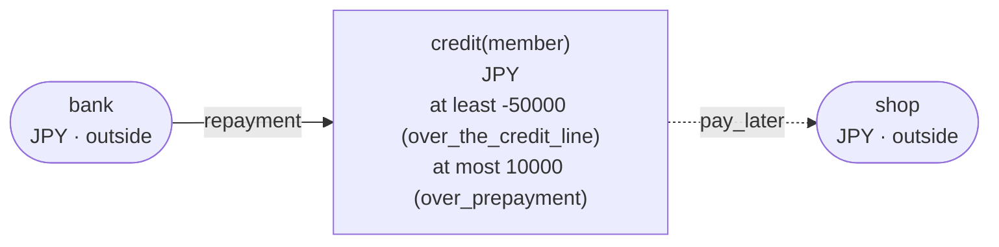
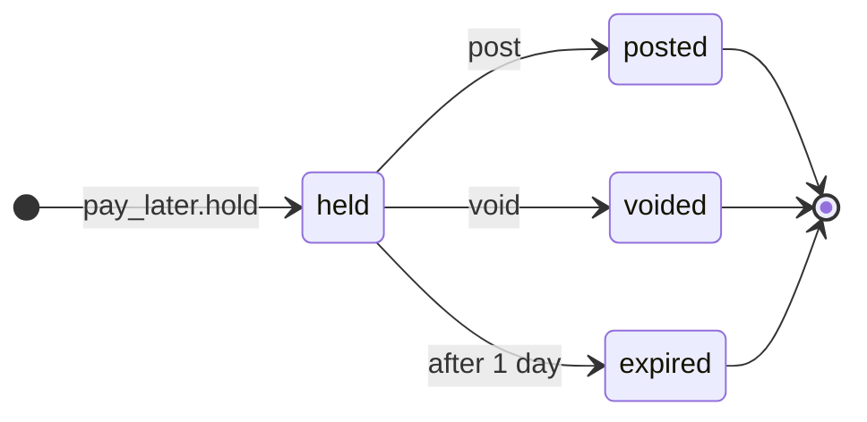

<!-- The output of `chobo doc tests/books/credit.book`. Do not edit by hand. -->

# credit v1

A pay-later line for each member. It can be used down to minus 50000 yen, and prepaid up to 10000 yen

`tests/books/credit.book`, as `chobo doc` writes it. Each account keeps a balance: what came in, less what went out. Every transfer keeps the bounds of the accounts: one that would break a bound is refused with the name the book gives that bound, and nothing of it moves. A transfer either moves at once (`do`), or first holds what it moves (`hold`); a hold is then posted (`post`, all of it or part), voided (`void`), or expires.

## Accounts

| Account | One for each | Unit | Bounds | What it is |
|---|---|---|---|---|
| `credit` | `member` | JPY | at least -50000; a transfer that would go below is refused with `over_the_credit_line`<br>at most 10000; a transfer that would go above is refused with `over_prepayment` |  |
| `shop` | one account | JPY | outside the book: no bounds, and it may go below 0 |  |
| `bank` | one account | JPY | outside the book: no bounds, and it may go below 0 |  |

## How things move



A box is an account, and an arrow a move of a transfer. A rounded box is an account outside the book, which has no bounds. A dashed arrow belongs to a transfer that holds first, and moves when the hold is posted.

## Transfers

### pay_later

- Moves `amount` from `credit(member)` to `shop`.
- Key: once per `order`. The same call again does nothing, and answers `done_before`; one that differs only in `member` or `amount` is refused with `key_conflict`; holding again with the same key after the hold has ended answers `done_before`, and holds nothing.
- Holds first: the caller posts or voids the hold. It expires 1 day after it was made, and what it holds goes back.



| The hold | post | void |
|---|---|---|
| held | posts it: the amounts given, or all of it, and the rest goes back; more than it holds is refused with `over_hold`; once 1 day have passed since it was held, refused with `expired` | voids it: what it holds goes back; once 1 day have passed since it was held, refused with `expired` |
| posted | `done_before` with the same amounts; refused with `key_conflict` with others | refused with `already_posted` |
| voided | refused with `already_voided` | `done_before` |
| expired | refused with `expired` | refused with `expired` |
| no hold with the key | refused with `no_such_hold` | refused with `no_such_hold` |

| Operation | May be refused with | When |
|---|---|---|
| `pay_later.hold` | `over_the_credit_line` | `credit(member)` would go below -50000 |
| `pay_later.hold` | `key_conflict` | a call with the same `order` and other arguments came before |
| `pay_later.hold` | `already_refused` | a call with the same `order` was refused by a bound before; a key a bound refused stays refused, even once there is enough |
| `pay_later.post` | `key_conflict` | the hold was posted before, for other amounts |
| `pay_later.post` | `already_voided` | the hold is voided already |
| `pay_later.post` | `expired` | the hold has expired |
| `pay_later.post` | `over_hold` | more than the hold holds |
| `pay_later.post` | `no_such_hold` | there is no hold with that `order` |
| `pay_later.void` | `already_posted` | the hold is posted already |
| `pay_later.void` | `expired` | the hold has expired |
| `pay_later.void` | `no_such_hold` | there is no hold with that `order` |

<details><summary>How each refusal comes about</summary>

#### pay_later.hold: over_the_credit_line

```text
 1  pay_later.hold(order: order-1, member: member-2, amount: 50001)  refused: over_the_credit_line (move 1 takes 50001 from credit(member-2): posted 0, held out 0)
```

#### pay_later.hold: key_conflict

```text
 1  pay_later.hold(order: order-1, member: member-2, amount: 1)  done
 2  pay_later.hold(order: order-1, member: member-2, amount: 2)  refused: key_conflict
```

#### pay_later.hold: already_refused

```text
 1  pay_later.hold(order: order-1, member: member-2, amount: 50001)  refused: over_the_credit_line (move 1 takes 50001 from credit(member-2): posted 0, held out 0)
 2  pay_later.hold(order: order-1, member: member-2, amount: 50001)  refused: already_refused
```

#### pay_later.post: key_conflict

```text
 1  pay_later.hold(order: order-1, member: member-2, amount: 2)  done
 2  pay_later.post(order: order-1)                               done
 3  pay_later.post(order: order-1, amount: 1)                    refused: key_conflict
```

#### pay_later.post: already_voided

```text
 1  pay_later.hold(order: order-1, member: member-2, amount: 2)  done
 2  pay_later.void(order: order-1)                               done
 3  pay_later.post(order: order-1)                               refused: already_voided
```

#### pay_later.post: expired

```text
 1  pay_later.hold(order: order-1, member: member-2, amount: 2)  done
 2  pass 1 day                                                   pay_later(order-1) expired
 3  pay_later.post(order: order-1)                               refused: expired
```

#### pay_later.post: over_hold

```text
 1  pay_later.hold(order: order-1, member: member-2, amount: 2)  done
 2  pay_later.post(order: order-1, amount: 3)                    refused: over_hold
```

#### pay_later.post: no_such_hold

```text
 1  pay_later.post(order: order-1)  refused: no_such_hold
```

#### pay_later.void: already_posted

```text
 1  pay_later.hold(order: order-1, member: member-2, amount: 2)  done
 2  pay_later.post(order: order-1)                               done
 3  pay_later.void(order: order-1)                               refused: already_posted
```

#### pay_later.void: expired

```text
 1  pay_later.hold(order: order-1, member: member-2, amount: 2)  done
 2  pass 1 day                                                   pay_later(order-1) expired
 3  pay_later.void(order: order-1)                               refused: expired
```

#### pay_later.void: no_such_hold

```text
 1  pay_later.void(order: order-1)  refused: no_such_hold
```

</details>

### repayment

- Moves `amount` from `bank` to `credit(member)`.
- Key: once per `repayment_id`. The same call again does nothing, and answers `done_before`; one that differs only in `member` or `amount` is refused with `key_conflict`.
- Moves at once (`do`).

| Operation | May be refused with | When |
|---|---|---|
| `repayment.do` | `over_prepayment` | `credit(member)` would go above 10000 |
| `repayment.do` | `key_conflict` | a call with the same `repayment_id` and other arguments came before |
| `repayment.do` | `already_refused` | a call with the same `repayment_id` was refused by a bound before; a key a bound refused stays refused, even once there is enough |

<details><summary>How each refusal comes about</summary>

#### repayment.do: over_prepayment

```text
 1  repayment.do(repayment_id: repayment_id-1, member: member-2, amount: 10000)  done
 2  repayment.do(repayment_id: repayment_id-3, member: member-2, amount: 1)      refused: over_prepayment (move 1 puts 1 into credit(member-2): posted 10000, held in 0)
```

#### repayment.do: key_conflict

```text
 1  repayment.do(repayment_id: repayment_id-1, member: member-2, amount: 1)  done
 2  repayment.do(repayment_id: repayment_id-1, member: member-2, amount: 2)  refused: key_conflict
```

#### repayment.do: already_refused

```text
 1  repayment.do(repayment_id: repayment_id-1, member: member-2, amount: 10000)  done
 2  repayment.do(repayment_id: repayment_id-3, member: member-2, amount: 1)      refused: over_prepayment (move 1 puts 1 into credit(member-2): posted 10000, held in 0)
 3  repayment.do(repayment_id: repayment_id-3, member: member-2, amount: 1)      refused: already_refused
```

</details>

## Scenarios

24 scenarios, which `chobo scenarios` makes from the book: among them each bound just before, at and past it, each key used twice, every way a hold ends, and two callers after the last of something at the same time. The reference interpreter ran each one; after each step come the balances it left. A balance is what is posted, with what is held in brackets.

<details><summary>1. bound: pay_later.hold takes credit(member) to -49999, one above <code>at least -50000</code></summary>

| # | Operation | Result | credit(member-2) | shop | bank |
|---|---|---|---|---|---|
| 1 | repayment.do(repayment_id: repayment_id-1, member: member-2, amount: 2) | done | 2 | 0 | -2 |
| 2 | pay_later.hold(order: order-3, member: member-2, amount: 50001) | done | 2 (held out 50001) | 0 (held in 50001) | -2 |

</details>

<details><summary>2. bound: pay_later.hold takes credit(member) to exactly -50000, its <code>at least -50000</code></summary>

| # | Operation | Result | credit(member-2) | shop | bank |
|---|---|---|---|---|---|
| 1 | repayment.do(repayment_id: repayment_id-1, member: member-2, amount: 2) | done | 2 | 0 | -2 |
| 2 | pay_later.hold(order: order-3, member: member-2, amount: 50002) | done | 2 (held out 50002) | 0 (held in 50002) | -2 |

</details>

<details><summary>3. bound: pay_later.hold would take credit(member) to -50001, below <code>at least -50000</code></summary>

| # | Operation | Result | credit(member-2) | shop | bank |
|---|---|---|---|---|---|
| 1 | repayment.do(repayment_id: repayment_id-1, member: member-2, amount: 2) | done | 2 | 0 | -2 |
| 2 | pay_later.hold(order: order-3, member: member-2, amount: 50003) | refused: over_the_credit_line | 2 | 0 | -2 |

</details>

<details><summary>4. bound: repayment.do fills credit(member) to 9999, one below <code>at most 10000</code></summary>

| # | Operation | Result | credit(member-2) | bank |
|---|---|---|---|---|
| 1 | repayment.do(repayment_id: repayment_id-1, member: member-2, amount: 9998) | done | 9998 | -9998 |
| 2 | repayment.do(repayment_id: repayment_id-3, member: member-2, amount: 1) | done | 9999 | -9999 |

</details>

<details><summary>5. bound: repayment.do fills credit(member) to exactly 10000, its <code>at most 10000</code></summary>

| # | Operation | Result | credit(member-2) | bank |
|---|---|---|---|---|
| 1 | repayment.do(repayment_id: repayment_id-1, member: member-2, amount: 9998) | done | 9998 | -9998 |
| 2 | repayment.do(repayment_id: repayment_id-3, member: member-2, amount: 2) | done | 10000 | -10000 |

</details>

<details><summary>6. bound: repayment.do would fill credit(member) to 10001, past <code>at most 10000</code></summary>

| # | Operation | Result | credit(member-2) | bank |
|---|---|---|---|---|
| 1 | repayment.do(repayment_id: repayment_id-1, member: member-2, amount: 9998) | done | 9998 | -9998 |
| 2 | repayment.do(repayment_id: repayment_id-3, member: member-2, amount: 3) | refused: over_prepayment | 9998 | -9998 |

</details>

<details><summary>7. key: pay_later.hold twice with the same arguments</summary>

| # | Operation | Result | credit(member-2) | shop |
|---|---|---|---|---|
| 1 | pay_later.hold(order: order-1, member: member-2, amount: 1) | done | 0 (held out 1) | 0 (held in 1) |
| 2 | pay_later.hold(order: order-1, member: member-2, amount: 1) | done_before | 0 (held out 1) | 0 (held in 1) |

</details>

<details><summary>8. key: pay_later.hold again with another amount</summary>

| # | Operation | Result | credit(member-2) | shop |
|---|---|---|---|---|
| 1 | pay_later.hold(order: order-1, member: member-2, amount: 1) | done | 0 (held out 1) | 0 (held in 1) |
| 2 | pay_later.hold(order: order-1, member: member-2, amount: 2) | refused: key_conflict | 0 (held out 1) | 0 (held in 1) |

</details>

<details><summary>9. key: pay_later.hold refused with over_the_credit_line, then again, and again once credit(member) has enough</summary>

| # | Operation | Result | credit(member-2) | shop | bank |
|---|---|---|---|---|---|
| 1 | pay_later.hold(order: order-1, member: member-2, amount: 50001) | refused: over_the_credit_line | 0 | 0 | 0 |
| 2 | pay_later.hold(order: order-1, member: member-2, amount: 50001) | refused: already_refused | 0 | 0 | 0 |
| 3 | repayment.do(repayment_id: repayment_id-3, member: member-2, amount: 1) | done | 1 | 0 | -1 |
| 4 | pay_later.hold(order: order-1, member: member-2, amount: 50001) | refused: already_refused | 1 | 0 | -1 |

</details>

<details><summary>10. key: repayment.do twice with the same arguments</summary>

| # | Operation | Result | credit(member-2) | bank |
|---|---|---|---|---|
| 1 | repayment.do(repayment_id: repayment_id-1, member: member-2, amount: 1) | done | 1 | -1 |
| 2 | repayment.do(repayment_id: repayment_id-1, member: member-2, amount: 1) | done_before | 1 | -1 |

</details>

<details><summary>11. key: repayment.do again with another amount</summary>

| # | Operation | Result | credit(member-2) | bank |
|---|---|---|---|---|
| 1 | repayment.do(repayment_id: repayment_id-1, member: member-2, amount: 1) | done | 1 | -1 |
| 2 | repayment.do(repayment_id: repayment_id-1, member: member-2, amount: 2) | refused: key_conflict | 1 | -1 |

</details>

<details><summary>12. key: repayment.do refused with over_prepayment, then again</summary>

| # | Operation | Result | credit(member-2) | bank |
|---|---|---|---|---|
| 1 | repayment.do(repayment_id: repayment_id-1, member: member-2, amount: 10000) | done | 10000 | -10000 |
| 2 | repayment.do(repayment_id: repayment_id-3, member: member-2, amount: 1) | refused: over_prepayment | 10000 | -10000 |
| 3 | repayment.do(repayment_id: repayment_id-3, member: member-2, amount: 1) | refused: already_refused | 10000 | -10000 |

</details>

<details><summary>13. hold: pay_later posted in full</summary>

| # | Operation | Result | credit(member-2) | shop |
|---|---|---|---|---|
| 1 | pay_later.hold(order: order-1, member: member-2, amount: 2) | done | 0 (held out 2) | 0 (held in 2) |
| 2 | pay_later.post(order: order-1) | done | -2 | 2 |

</details>

<details><summary>14. hold: pay_later posted in part</summary>

| # | Operation | Result | credit(member-2) | shop |
|---|---|---|---|---|
| 1 | pay_later.hold(order: order-1, member: member-2, amount: 2) | done | 0 (held out 2) | 0 (held in 2) |
| 2 | pay_later.post(order: order-1, amount: 1) | done | -1 | 1 |

</details>

<details><summary>15. hold: pay_later voided</summary>

| # | Operation | Result | credit(member-2) | shop |
|---|---|---|---|---|
| 1 | pay_later.hold(order: order-1, member: member-2, amount: 2) | done | 0 (held out 2) | 0 (held in 2) |
| 2 | pay_later.void(order: order-1) | done | 0 | 0 |

</details>

<details><summary>16. hold: pay_later posted, then voided</summary>

| # | Operation | Result | credit(member-2) | shop |
|---|---|---|---|---|
| 1 | pay_later.hold(order: order-1, member: member-2, amount: 2) | done | 0 (held out 2) | 0 (held in 2) |
| 2 | pay_later.post(order: order-1) | done | -2 | 2 |
| 3 | pay_later.void(order: order-1) | refused: already_posted | -2 | 2 |

</details>

<details><summary>17. hold: pay_later voided, then posted</summary>

| # | Operation | Result | credit(member-2) | shop |
|---|---|---|---|---|
| 1 | pay_later.hold(order: order-1, member: member-2, amount: 2) | done | 0 (held out 2) | 0 (held in 2) |
| 2 | pay_later.void(order: order-1) | done | 0 | 0 |
| 3 | pay_later.post(order: order-1) | refused: already_voided | 0 | 0 |

</details>

<details><summary>18. hold: pay_later posted for more than it holds, then for what it holds</summary>

| # | Operation | Result | credit(member-2) | shop |
|---|---|---|---|---|
| 1 | pay_later.hold(order: order-1, member: member-2, amount: 2) | done | 0 (held out 2) | 0 (held in 2) |
| 2 | pay_later.post(order: order-1, amount: 3) | refused: over_hold | 0 (held out 2) | 0 (held in 2) |
| 3 | pay_later.post(order: order-1, amount: 2) | done | -2 | 2 |

</details>

<details><summary>19. hold: pay_later posted before it is held, then held and posted</summary>

| # | Operation | Result | credit(member-2) | shop |
|---|---|---|---|---|
| 1 | pay_later.post(order: order-1) | refused: no_such_hold | 0 | 0 |
| 2 | pay_later.hold(order: order-1, member: member-2, amount: 1) | done | 0 (held out 1) | 0 (held in 1) |
| 3 | pay_later.post(order: order-1) | done | -1 | 1 |

</details>

<details><summary>20. hold: pay_later posted twice, with the same amounts and with others</summary>

| # | Operation | Result | credit(member-2) | shop |
|---|---|---|---|---|
| 1 | pay_later.hold(order: order-1, member: member-2, amount: 2) | done | 0 (held out 2) | 0 (held in 2) |
| 2 | pay_later.post(order: order-1) | done | -2 | 2 |
| 3 | pay_later.post(order: order-1) | done_before | -2 | 2 |
| 4 | pay_later.post(order: order-1, amount: 2) | done_before | -2 | 2 |
| 5 | pay_later.post(order: order-1, amount: 1) | refused: key_conflict | -2 | 2 |

</details>

<details><summary>21. pass: pay_later expires, then is posted and voided</summary>

| # | Operation | Result | credit(member-2) | shop |
|---|---|---|---|---|
| 1 | pay_later.hold(order: order-1, member: member-2, amount: 2) | done | 0 (held out 2) | 0 (held in 2) |
| 2 | pass 1441 minutes | pay_later(order-1) expired | 0 | 0 |
| 3 | pay_later.post(order: order-1) | refused: expired | 0 | 0 |
| 4 | pay_later.void(order: order-1) | refused: expired | 0 | 0 |

</details>

<details><summary>22. pass: pay_later held again with the same key after it expired</summary>

| # | Operation | Result | credit(member-2) | shop |
|---|---|---|---|---|
| 1 | pay_later.hold(order: order-1, member: member-2, amount: 2) | done | 0 (held out 2) | 0 (held in 2) |
| 2 | pass 1441 minutes | pay_later(order-1) expired | 0 | 0 |
| 3 | pay_later.hold(order: order-1, member: member-2, amount: 2) | done_before | 0 | 0 |

</details>

<details><summary>23. together: two callers take the last 50000 of credit(member) with pay_later.hold</summary>

It can come out 2 ways, by the order the operations at the same time go in.

Outcome 1:

| # | Operation | Result | credit(member-2) | shop |
|---|---|---|---|---|
| 1 | together<br>caller 1: pay_later.hold(order: order-1, member: member-2, amount: 50000)<br>caller 2: pay_later.hold(order: order-3, member: member-2, amount: 50000) | <br>done<br>refused: over_the_credit_line | 0 (held out 50000) | 0 (held in 50000) |

Outcome 2:

| # | Operation | Result | credit(member-2) | shop |
|---|---|---|---|---|
| 1 | together<br>caller 1: pay_later.hold(order: order-1, member: member-2, amount: 50000)<br>caller 2: pay_later.hold(order: order-3, member: member-2, amount: 50000) | <br>refused: over_the_credit_line<br>done | 0 (held out 50000) | 0 (held in 50000) |

</details>

<details><summary>24. together: two callers fill the last 1 of room in credit(member) with repayment.do</summary>

It can come out 2 ways, by the order the operations at the same time go in.

Outcome 1:

| # | Operation | Result | credit(member-2) | bank |
|---|---|---|---|---|
| 1 | repayment.do(repayment_id: repayment_id-1, member: member-2, amount: 9999) | done | 9999 | -9999 |
| 2 | together<br>caller 1: repayment.do(repayment_id: repayment_id-3, member: member-2, amount: 1)<br>caller 2: repayment.do(repayment_id: repayment_id-4, member: member-2, amount: 1) | <br>done<br>refused: over_prepayment | 10000 | -10000 |

Outcome 2:

| # | Operation | Result | credit(member-2) | bank |
|---|---|---|---|---|
| 1 | repayment.do(repayment_id: repayment_id-1, member: member-2, amount: 9999) | done | 9999 | -9999 |
| 2 | together<br>caller 1: repayment.do(repayment_id: repayment_id-3, member: member-2, amount: 1)<br>caller 2: repayment.do(repayment_id: repayment_id-4, member: member-2, amount: 1) | <br>refused: over_prepayment<br>done | 10000 | -10000 |

</details>

