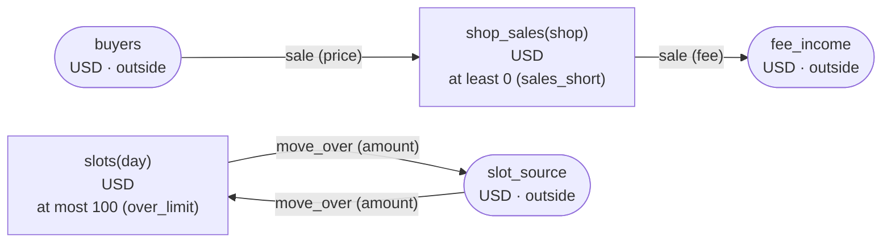

<!-- The output of `chobo doc tests/fixtures/order.book`. Do not edit by hand. -->

# order v1

`tests/fixtures/order.book`, as `chobo doc` writes it. Each account keeps a balance: what came in, less what went out. Every transfer keeps the bounds of the accounts: one that would break a bound is refused with the name the book gives that bound, and nothing of it moves. A transfer either moves at once (`do`), or first holds what it moves (`hold`); a hold is then posted (`post`, all of it or part), voided (`void`), or expires.

## What the check warns about

What `chobo check` says; each comes with the operations that get there.

```text
warning[W103]: tests/fixtures/order.book:15:3: move 1 takes from shop_sales(shop) before move 2 puts into it: when shop_sales(shop) is short at that point, the call is refused with sales_short, even when the two moves together would leave enough
    15 |   move fee from shop_sales(shop) to fee_income
  the operations that get there:
       1  sale.do(order: order-1, shop: shop-2, price: 1, fee: 1)  refused: sales_short (move 1 takes 1 from shop_sales(shop-2): posted 0, held out 0)
  hint: write the move that puts into shop_sales(shop) first
```

```text
warning[W103]: tests/fixtures/order.book:19:3: move 1 puts into slots(day) before move 2 takes from it: when slots(day) has no room at that point, the call is refused with over_limit, even when the two moves together would stay within its bound
    19 |   move amount from slot_source to slots(day)
  the operations that get there:
       1  move_over.do(slip: slip-1, day: day-2, amount: 101)  refused: over_limit (move 1 puts 101 into slots(day-2): posted 0, held in 0)
  hint: write the move that takes from slots(day) first
```

## Accounts

| Account | One for each | Unit | Bounds | What it is |
|---|---|---|---|---|
| `buyers` | one account | USD | outside the book: no bounds, and it may go below 0 |  |
| `fee_income` | one account | USD | outside the book: no bounds, and it may go below 0 |  |
| `shop_sales` | `shop` | USD | at least 0; a transfer that would go below is refused with `sales_short` |  |
| `slots` | `day` | USD | at most 100; a transfer that would go above is refused with `over_limit` |  |
| `slot_source` | one account | USD | outside the book: no bounds, and it may go below 0 |  |

## How things move



A box is an account, and an arrow a move of a transfer. A rounded box is an account outside the book, which has no bounds. A dashed arrow belongs to a transfer that holds first, and moves when the hold is posted.

## Transfers

### sale

- 2 moves, made in this order, all or none:
    1. `fee` from `shop_sales(shop)` to `fee_income`
    2. `price` from `buyers` to `shop_sales(shop)`
- Key: once per `order`. The same call again does nothing, and answers `done_before`.
- Moves at once (`do`).

| Operation | May be refused with | When |
|---|---|---|
| `sale.do` | `sales_short` | move 1 would take `shop_sales(shop)` below 0 |
| `sale.do` | `already_refused` | a call with the same `order` was refused by a bound before; a key a bound refused stays refused, even once there is enough |

<details><summary>How each refusal comes about</summary>

#### sale.do: sales_short

```text
 1  sale.do(order: order-1, shop: shop-2, price: 1, fee: 1)  refused: sales_short (move 1 takes 1 from shop_sales(shop-2): posted 0, held out 0)
```

#### sale.do: already_refused

```text
 1  sale.do(order: order-1, shop: shop-2, price: 1, fee: 1)  refused: sales_short (move 1 takes 1 from shop_sales(shop-2): posted 0, held out 0)
 2  sale.do(order: order-1, shop: shop-2, price: 1, fee: 1)  refused: already_refused
```

</details>

### move_over

- 2 moves, made in this order, all or none:
    1. `amount` from `slot_source` to `slots(day)`
    2. `amount` from `slots(day)` to `slot_source`
- Key: once per `slip`. The same call again does nothing, and answers `done_before`; one that differs only in `day` or `amount` is refused with `key_conflict`.
- Moves at once (`do`).

| Operation | May be refused with | When |
|---|---|---|
| `move_over.do` | `over_limit` | move 1 would take `slots(day)` above 100 |
| `move_over.do` | `key_conflict` | a call with the same `slip` and other arguments came before |
| `move_over.do` | `already_refused` | a call with the same `slip` was refused by a bound before; a key a bound refused stays refused, even once there is enough |

<details><summary>How each refusal comes about</summary>

#### move_over.do: over_limit

```text
 1  move_over.do(slip: slip-1, day: day-2, amount: 101)  refused: over_limit (move 1 puts 101 into slots(day-2): posted 0, held in 0)
```

#### move_over.do: key_conflict

```text
 1  move_over.do(slip: slip-1, day: day-2, amount: 1)  done
 2  move_over.do(slip: slip-1, day: day-2, amount: 2)  refused: key_conflict
```

#### move_over.do: already_refused

```text
 1  move_over.do(slip: slip-1, day: day-2, amount: 101)  refused: over_limit (move 1 puts 101 into slots(day-2): posted 0, held in 0)
 2  move_over.do(slip: slip-1, day: day-2, amount: 101)  refused: already_refused
```

</details>

## Scenarios

5 scenarios, which `chobo scenarios` makes from the book: among them each bound just before, at and past it, each key used twice, every way a hold ends, and two callers after the last of something at the same time. The reference interpreter ran each one; after each step come the balances it left. A balance is what is posted, with what is held in brackets.

<details><summary>1. key: move_over.do twice with the same arguments</summary>

| # | Operation | Result | slots(day-2) | slot_source |
|---|---|---|---|---|
| 1 | move_over.do(slip: slip-1, day: day-2, amount: 1) | done | 0 | 0 |
| 2 | move_over.do(slip: slip-1, day: day-2, amount: 1) | done_before | 0 | 0 |

</details>

<details><summary>2. key: move_over.do again with another amount</summary>

| # | Operation | Result | slots(day-2) | slot_source |
|---|---|---|---|---|
| 1 | move_over.do(slip: slip-1, day: day-2, amount: 1) | done | 0 | 0 |
| 2 | move_over.do(slip: slip-1, day: day-2, amount: 2) | refused: key_conflict | 0 | 0 |

</details>

<details><summary>3. key: move_over.do refused with over_limit, then again</summary>

| # | Operation | Result | slots(day-2) | slot_source |
|---|---|---|---|---|
| 1 | move_over.do(slip: slip-1, day: day-2, amount: 101) | refused: over_limit | 0 | 0 |
| 2 | move_over.do(slip: slip-1, day: day-2, amount: 101) | refused: already_refused | 0 | 0 |

</details>

<details><summary>4. moves: sale.do refused at move 1 (shop_sales(shop)), and no move is made</summary>

| # | Operation | Result | buyers | fee_income | shop_sales(shop-2) |
|---|---|---|---|---|---|
| 1 | sale.do(order: order-1, shop: shop-2, price: 1, fee: 1) | refused: sales_short | 0 | 0 | 0 |

</details>

<details><summary>5. moves: move_over.do refused at move 1 (slots(day)), and no move is made</summary>

| # | Operation | Result | slots(day-2) | slot_source |
|---|---|---|---|---|
| 1 | move_over.do(slip: slip-1, day: day-2, amount: 101) | refused: over_limit | 0 | 0 |

</details>

