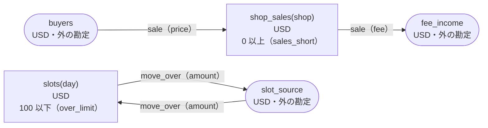

<!-- `chobo doc tests/fixtures/order.book --lang ja` の出力です。手で編集しないでください。 -->

# order v1

`chobo doc` が `tests/fixtures/order.book` から作ったページ。勘定ごとに残高を持ち、残高は入った量から出た量を引いたもの。どの振替も勘定の下限と上限を守り、守れない振替は、その境界に付けた名前で断られて、どの移動も行われない。振替には、すぐに動かすもの（`do`）と、動かす量をまず押さえるもの（`hold`）がある。押さえた分は、あとで確定される（`post`。全部か一部）か、取り消される（`void`）か、有効期限で切れる。

## 検査の警告

`chobo check` が言うこと。どれも、ここに書いた操作の列で起きる。

```text
警告[W103]: tests/fixtures/order.book:15:3: 1 つ目の移動が shop_sales(shop) から取るのは、2 つ目の移動が shop_sales(shop) へ入れるより前です。そのとき shop_sales(shop) が足りないと、二つの移動を合わせれば足りる場合でも sales_short で断られます
    15 |   move fee from shop_sales(shop) to fee_income
  そうなる例:
       1  sale.do(order: order-1, shop: shop-2, price: 1, fee: 1)  sales_short で断られる（1 つ目の移動が shop_sales(shop-2) から 1 を取る。確定 0、出ていく仮押さえ 0）
  ヒント: shop_sales(shop) へ入れる移動を先に書きます
```

```text
警告[W103]: tests/fixtures/order.book:19:3: 1 つ目の移動が slots(day) へ入れるのは、2 つ目の移動が slots(day) から取るより前です。そのとき slots(day) に空きが無いと、二つの移動を合わせれば上限に収まる場合でも over_limit で断られます
    19 |   move amount from slot_source to slots(day)
  そうなる例:
       1  move_over.do(slip: slip-1, day: day-2, amount: 101)  over_limit で断られる（1 つ目の移動が slots(day-2) へ 101 を入れる。確定 0、入ってくる仮押さえ 0）
  ヒント: slots(day) から取る移動を先に書きます
```

## 勘定

| 勘定 | 分け方 | 単位 | 境界 | 説明 |
|---|---|---|---|---|
| `buyers` | 一つだけ | USD | 外の勘定。境界は無く、マイナスにもなる |  |
| `fee_income` | 一つだけ | USD | 外の勘定。境界は無く、マイナスにもなる |  |
| `shop_sales` | `shop` ごと | USD | 0 以上。下回る振替は `sales_short` で断る |  |
| `slots` | `day` ごと | USD | 100 以下。超える振替は `over_limit` で断る |  |
| `slot_source` | 一つだけ | USD | 外の勘定。境界は無く、マイナスにもなる |  |

## 勘定のあいだの流れ



四角は勘定で、矢印は振替の移動。角の丸い四角は外の勘定で、境界を持たない。破線の矢印は仮押さえの振替で、まず押さえ、確定したときに動く。

## 振替

### sale

- 移動は 2 つ。書いた順に行い、どれか一つでも断られたら、どれも行わない:
    1. `shop_sales(shop)` から `fee_income` へ `fee`
    2. `buyers` から `shop_sales(shop)` へ `price`
- キー: `order` ごとに一回。同じ呼び出しの二度目は何もせず、`done_before` を返す。
- すぐに動かす（`do`）。

| 操作 | 断られうる理由 | いつ |
|---|---|---|
| `sale.do` | `sales_short` | 1 つ目の移動で `shop_sales(shop)` が 0 を下回る |
| `sale.do` | `already_refused` | `order` が同じ呼び出しが、前に境界で断られている。境界で断られたキーは、あとで足りるようになっても通らない |

<details><summary>断られる例</summary>

#### sale.do: sales_short

```text
 1  sale.do(order: order-1, shop: shop-2, price: 1, fee: 1)  sales_short で断られる（1 つ目の移動が shop_sales(shop-2) から 1 を取る。確定 0、出ていく仮押さえ 0）
```

#### sale.do: already_refused

```text
 1  sale.do(order: order-1, shop: shop-2, price: 1, fee: 1)  sales_short で断られる（1 つ目の移動が shop_sales(shop-2) から 1 を取る。確定 0、出ていく仮押さえ 0）
 2  sale.do(order: order-1, shop: shop-2, price: 1, fee: 1)  already_refused で断られる
```

</details>

### move_over

- 移動は 2 つ。書いた順に行い、どれか一つでも断られたら、どれも行わない:
    1. `slot_source` から `slots(day)` へ `amount`
    2. `slots(day)` から `slot_source` へ `amount`
- キー: `slip` ごとに一回。同じ呼び出しの二度目は何もせず、`done_before` を返す。`day` か `amount` だけが違う二度目は `key_conflict` で断られる。
- すぐに動かす（`do`）。

| 操作 | 断られうる理由 | いつ |
|---|---|---|
| `move_over.do` | `over_limit` | 1 つ目の移動で `slots(day)` が 100 を超える |
| `move_over.do` | `key_conflict` | `slip` が同じで、ほかの引数が違う呼び出しが、前に済んでいる |
| `move_over.do` | `already_refused` | `slip` が同じ呼び出しが、前に境界で断られている。境界で断られたキーは、あとで足りるようになっても通らない |

<details><summary>断られる例</summary>

#### move_over.do: over_limit

```text
 1  move_over.do(slip: slip-1, day: day-2, amount: 101)  over_limit で断られる（1 つ目の移動が slots(day-2) へ 101 を入れる。確定 0、入ってくる仮押さえ 0）
```

#### move_over.do: key_conflict

```text
 1  move_over.do(slip: slip-1, day: day-2, amount: 1)  通る
 2  move_over.do(slip: slip-1, day: day-2, amount: 2)  key_conflict で断られる
```

#### move_over.do: already_refused

```text
 1  move_over.do(slip: slip-1, day: day-2, amount: 101)  over_limit で断られる（1 つ目の移動が slots(day-2) へ 101 を入れる。確定 0、入ってくる仮押さえ 0）
 2  move_over.do(slip: slip-1, day: day-2, amount: 101)  already_refused で断られる
```

</details>

## シナリオ

`chobo scenarios` が帳簿から作ったシナリオ 5 本。境界の手前・ちょうど・超える、同じキーの二度目、仮押さえの終わり方、二つの呼び出し元が同時に最後の一つを取りに来るもの、などがある。どれも参照インタプリタで流し、ステップごとに、そのあとの残高を載せる。残高は確定した量で、仮押さえがあれば括弧の中に書く。

<details><summary>1. キー: move_over.do を同じ引数で二度呼ぶ</summary>

| # | 操作 | 結果 | slots(day-2) | slot_source |
|---|---|---|---|---|
| 1 | move_over.do(slip: slip-1, day: day-2, amount: 1) | 通る | 0 | 0 |
| 2 | move_over.do(slip: slip-1, day: day-2, amount: 1) | done_before（前に済んでいる） | 0 | 0 |

</details>

<details><summary>2. キー: move_over.do を amount だけ変えてもう一度呼ぶ</summary>

| # | 操作 | 結果 | slots(day-2) | slot_source |
|---|---|---|---|---|
| 1 | move_over.do(slip: slip-1, day: day-2, amount: 1) | 通る | 0 | 0 |
| 2 | move_over.do(slip: slip-1, day: day-2, amount: 2) | key_conflict で断られる | 0 | 0 |

</details>

<details><summary>3. キー: move_over.do が over_limit で断られ、同じ引数でもう一度呼ぶ</summary>

| # | 操作 | 結果 | slots(day-2) | slot_source |
|---|---|---|---|---|
| 1 | move_over.do(slip: slip-1, day: day-2, amount: 101) | over_limit で断られる | 0 | 0 |
| 2 | move_over.do(slip: slip-1, day: day-2, amount: 101) | already_refused で断られる | 0 | 0 |

</details>

<details><summary>4. 移動: sale.do が 1 つ目の移動（shop_sales(shop)）で断られ、どの移動も行われない</summary>

| # | 操作 | 結果 | buyers | fee_income | shop_sales(shop-2) |
|---|---|---|---|---|---|
| 1 | sale.do(order: order-1, shop: shop-2, price: 1, fee: 1) | sales_short で断られる | 0 | 0 | 0 |

</details>

<details><summary>5. 移動: move_over.do が 1 つ目の移動（slots(day)）で断られ、どの移動も行われない</summary>

| # | 操作 | 結果 | slots(day-2) | slot_source |
|---|---|---|---|---|
| 1 | move_over.do(slip: slip-1, day: day-2, amount: 101) | over_limit で断られる | 0 | 0 |

</details>

