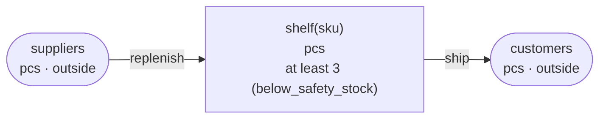

<!-- The output of `chobo doc tests/books/safety_stock.book`. Do not edit by hand. -->

# safety_stock v1

Three pieces stay on the shelf, and nothing below that is shipped

`tests/books/safety_stock.book`, as `chobo doc` writes it. Each account keeps a balance: what came in, less what went out. Every transfer keeps the bounds of the accounts: one that would break a bound is refused with the name the book gives that bound, and nothing of it moves. A transfer either moves at once (`do`), or first holds what it moves (`hold`); a hold is then posted (`post`, all of it or part), voided (`void`), or expires.

## Accounts

| Account | One for each | Unit | Bounds | What it is |
|---|---|---|---|---|
| `shelf` | `sku` | pcs | at least 3; a transfer that would go below is refused with `below_safety_stock` |  |
| `suppliers` | one account | pcs | outside the book: no bounds, and it may go below 0 |  |
| `customers` | one account | pcs | outside the book: no bounds, and it may go below 0 |  |

## How things move



A box is an account, and an arrow a move of a transfer. A rounded box is an account outside the book, which has no bounds. A dashed arrow belongs to a transfer that holds first, and moves when the hold is posted.

## Transfers

### replenish

- Moves `qty` from `suppliers` to `shelf(sku)`.
- Key: once per `slip` and `sku`. The same call again does nothing, and answers `done_before`; one that differs only in `qty` is refused with `key_conflict`.
- Moves at once (`do`).

| Operation | May be refused with | When |
|---|---|---|
| `replenish.do` | `key_conflict` | a call with the same `slip` and `sku` and other arguments came before |

<details><summary>How each refusal comes about</summary>

#### replenish.do: key_conflict

```text
 1  replenish.do(slip: slip-1, sku: sku-2, qty: 1)  done
 2  replenish.do(slip: slip-1, sku: sku-2, qty: 2)  refused: key_conflict
```

</details>

### ship

- Moves `qty` from `shelf(sku)` to `customers`.
- Key: once per `order` and `sku`. The same call again does nothing, and answers `done_before`; one that differs only in `qty` is refused with `key_conflict`.
- Moves at once (`do`).

| Operation | May be refused with | When |
|---|---|---|
| `ship.do` | `below_safety_stock` | `shelf(sku)` would go below 3 |
| `ship.do` | `key_conflict` | a call with the same `order` and `sku` and other arguments came before |
| `ship.do` | `already_refused` | a call with the same `order` and `sku` was refused by a bound before; a key a bound refused stays refused, even once there is enough |

<details><summary>How each refusal comes about</summary>

#### ship.do: below_safety_stock

```text
 1  ship.do(order: order-1, sku: sku-2, qty: 1)  refused: below_safety_stock (move 1 takes 1 from shelf(sku-2): posted 0, held out 0)
```

#### ship.do: key_conflict

```text
 1  replenish.do(slip: slip-1, sku: sku-2, qty: 4)  done
 2  ship.do(order: order-3, sku: sku-2, qty: 1)     done
 3  ship.do(order: order-3, sku: sku-2, qty: 2)     refused: key_conflict
```

#### ship.do: already_refused

```text
 1  ship.do(order: order-1, sku: sku-2, qty: 1)  refused: below_safety_stock (move 1 takes 1 from shelf(sku-2): posted 0, held out 0)
 2  ship.do(order: order-1, sku: sku-2, qty: 1)  refused: already_refused
```

</details>

## Scenarios

9 scenarios, which `chobo scenarios` makes from the book: among them each bound just before, at and past it, each key used twice, every way a hold ends, and two callers after the last of something at the same time. The reference interpreter ran each one; after each step come the balances it left. A balance is what is posted, with what is held in brackets.

<details><summary>1. bound: ship.do takes shelf(sku) to 4, one above <code>at least 3</code></summary>

| # | Operation | Result | shelf(sku-2) | suppliers | customers |
|---|---|---|---|---|---|
| 1 | replenish.do(slip: slip-1, sku: sku-2, qty: 5) | done | 5 | -5 | 0 |
| 2 | ship.do(order: order-3, sku: sku-2, qty: 1) | done | 4 | -5 | 1 |

</details>

<details><summary>2. bound: ship.do takes shelf(sku) to exactly 3, its <code>at least 3</code></summary>

| # | Operation | Result | shelf(sku-2) | suppliers | customers |
|---|---|---|---|---|---|
| 1 | replenish.do(slip: slip-1, sku: sku-2, qty: 5) | done | 5 | -5 | 0 |
| 2 | ship.do(order: order-3, sku: sku-2, qty: 2) | done | 3 | -5 | 2 |

</details>

<details><summary>3. bound: ship.do would take shelf(sku) to 2, below <code>at least 3</code></summary>

| # | Operation | Result | shelf(sku-2) | suppliers | customers |
|---|---|---|---|---|---|
| 1 | replenish.do(slip: slip-1, sku: sku-2, qty: 5) | done | 5 | -5 | 0 |
| 2 | ship.do(order: order-3, sku: sku-2, qty: 3) | refused: below_safety_stock | 5 | -5 | 0 |

</details>

<details><summary>4. key: replenish.do twice with the same arguments</summary>

| # | Operation | Result | shelf(sku-2) | suppliers |
|---|---|---|---|---|
| 1 | replenish.do(slip: slip-1, sku: sku-2, qty: 1) | done | 1 | -1 |
| 2 | replenish.do(slip: slip-1, sku: sku-2, qty: 1) | done_before | 1 | -1 |

</details>

<details><summary>5. key: replenish.do again with another qty</summary>

| # | Operation | Result | shelf(sku-2) | suppliers |
|---|---|---|---|---|
| 1 | replenish.do(slip: slip-1, sku: sku-2, qty: 1) | done | 1 | -1 |
| 2 | replenish.do(slip: slip-1, sku: sku-2, qty: 2) | refused: key_conflict | 1 | -1 |

</details>

<details><summary>6. key: ship.do twice with the same arguments</summary>

| # | Operation | Result | shelf(sku-2) | suppliers | customers |
|---|---|---|---|---|---|
| 1 | replenish.do(slip: slip-1, sku: sku-2, qty: 4) | done | 4 | -4 | 0 |
| 2 | ship.do(order: order-3, sku: sku-2, qty: 1) | done | 3 | -4 | 1 |
| 3 | ship.do(order: order-3, sku: sku-2, qty: 1) | done_before | 3 | -4 | 1 |

</details>

<details><summary>7. key: ship.do again with another qty</summary>

| # | Operation | Result | shelf(sku-2) | suppliers | customers |
|---|---|---|---|---|---|
| 1 | replenish.do(slip: slip-1, sku: sku-2, qty: 4) | done | 4 | -4 | 0 |
| 2 | ship.do(order: order-3, sku: sku-2, qty: 1) | done | 3 | -4 | 1 |
| 3 | ship.do(order: order-3, sku: sku-2, qty: 2) | refused: key_conflict | 3 | -4 | 1 |

</details>

<details><summary>8. key: ship.do refused with below_safety_stock, then again, and again once shelf(sku) has enough</summary>

| # | Operation | Result | shelf(sku-2) | suppliers | customers |
|---|---|---|---|---|---|
| 1 | ship.do(order: order-1, sku: sku-2, qty: 1) | refused: below_safety_stock | 0 | 0 | 0 |
| 2 | ship.do(order: order-1, sku: sku-2, qty: 1) | refused: already_refused | 0 | 0 | 0 |
| 3 | replenish.do(slip: slip-3, sku: sku-2, qty: 4) | done | 4 | -4 | 0 |
| 4 | ship.do(order: order-1, sku: sku-2, qty: 1) | refused: already_refused | 4 | -4 | 0 |

</details>

<details><summary>9. together: two callers take the last 1 of shelf(sku) with ship.do</summary>

It can come out 2 ways, by the order the operations at the same time go in.

Outcome 1:

| # | Operation | Result | shelf(sku-2) | suppliers | customers |
|---|---|---|---|---|---|
| 1 | replenish.do(slip: slip-1, sku: sku-2, qty: 4) | done | 4 | -4 | 0 |
| 2 | together<br>caller 1: ship.do(order: order-3, sku: sku-2, qty: 1)<br>caller 2: ship.do(order: order-4, sku: sku-2, qty: 1) | <br>done<br>refused: below_safety_stock | 3 | -4 | 1 |

Outcome 2:

| # | Operation | Result | shelf(sku-2) | suppliers | customers |
|---|---|---|---|---|---|
| 1 | replenish.do(slip: slip-1, sku: sku-2, qty: 4) | done | 4 | -4 | 0 |
| 2 | together<br>caller 1: ship.do(order: order-3, sku: sku-2, qty: 1)<br>caller 2: ship.do(order: order-4, sku: sku-2, qty: 1) | <br>refused: below_safety_stock<br>done | 3 | -4 | 1 |

</details>

