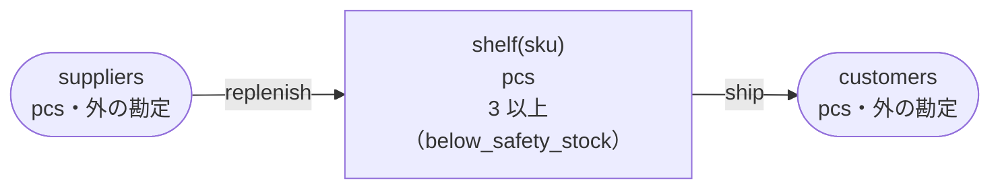

<!-- `chobo doc tests/books/safety_stock.book --lang ja` の出力です。手で編集しないでください。 -->

# safety_stock v1

Three pieces stay on the shelf, and nothing below that is shipped

`chobo doc` が `tests/books/safety_stock.book` から作ったページ。勘定ごとに残高を持ち、残高は入った量から出た量を引いたもの。どの振替も勘定の下限と上限を守り、守れない振替は、その境界に付けた名前で断られて、どの移動も行われない。振替には、すぐに動かすもの（`do`）と、動かす量をまず押さえるもの（`hold`）がある。押さえた分は、あとで確定される（`post`。全部か一部）か、取り消される（`void`）か、有効期限で切れる。

## 勘定

| 勘定 | 分け方 | 単位 | 境界 | 説明 |
|---|---|---|---|---|
| `shelf` | `sku` ごと | pcs | 3 以上。下回る振替は `below_safety_stock` で断る |  |
| `suppliers` | 一つだけ | pcs | 外の勘定。境界は無く、マイナスにもなる |  |
| `customers` | 一つだけ | pcs | 外の勘定。境界は無く、マイナスにもなる |  |

## 勘定のあいだの流れ



四角は勘定で、矢印は振替の移動。角の丸い四角は外の勘定で、境界を持たない。破線の矢印は仮押さえの振替で、まず押さえ、確定したときに動く。

## 振替

### replenish

- 移動: `suppliers` から `shelf(sku)` へ `qty`。
- キー: `slip` と `sku` ごとに一回。同じ呼び出しの二度目は何もせず、`done_before` を返す。`qty` だけが違う二度目は `key_conflict` で断られる。
- すぐに動かす（`do`）。

| 操作 | 断られうる理由 | いつ |
|---|---|---|
| `replenish.do` | `key_conflict` | `slip` と `sku` が同じで、ほかの引数が違う呼び出しが、前に済んでいる |

<details><summary>断られる例</summary>

#### replenish.do: key_conflict

```text
 1  replenish.do(slip: slip-1, sku: sku-2, qty: 1)  通る
 2  replenish.do(slip: slip-1, sku: sku-2, qty: 2)  key_conflict で断られる
```

</details>

### ship

- 移動: `shelf(sku)` から `customers` へ `qty`。
- キー: `order` と `sku` ごとに一回。同じ呼び出しの二度目は何もせず、`done_before` を返す。`qty` だけが違う二度目は `key_conflict` で断られる。
- すぐに動かす（`do`）。

| 操作 | 断られうる理由 | いつ |
|---|---|---|
| `ship.do` | `below_safety_stock` | `shelf(sku)` が 3 を下回る |
| `ship.do` | `key_conflict` | `order` と `sku` が同じで、ほかの引数が違う呼び出しが、前に済んでいる |
| `ship.do` | `already_refused` | `order` と `sku` が同じ呼び出しが、前に境界で断られている。境界で断られたキーは、あとで足りるようになっても通らない |

<details><summary>断られる例</summary>

#### ship.do: below_safety_stock

```text
 1  ship.do(order: order-1, sku: sku-2, qty: 1)  below_safety_stock で断られる（1 つ目の移動が shelf(sku-2) から 1 を取る。確定 0、出ていく仮押さえ 0）
```

#### ship.do: key_conflict

```text
 1  replenish.do(slip: slip-1, sku: sku-2, qty: 4)  通る
 2  ship.do(order: order-3, sku: sku-2, qty: 1)     通る
 3  ship.do(order: order-3, sku: sku-2, qty: 2)     key_conflict で断られる
```

#### ship.do: already_refused

```text
 1  ship.do(order: order-1, sku: sku-2, qty: 1)  below_safety_stock で断られる（1 つ目の移動が shelf(sku-2) から 1 を取る。確定 0、出ていく仮押さえ 0）
 2  ship.do(order: order-1, sku: sku-2, qty: 1)  already_refused で断られる
```

</details>

## シナリオ

`chobo scenarios` が帳簿から作ったシナリオ 9 本。境界の手前・ちょうど・超える、同じキーの二度目、仮押さえの終わり方、二つの呼び出し元が同時に最後の一つを取りに来るもの、などがある。どれも参照インタプリタで流し、ステップごとに、そのあとの残高を載せる。残高は確定した量で、仮押さえがあれば括弧の中に書く。

<details><summary>1. 境界: ship.do が shelf(sku) を 4 まで減らす。<code>at least 3</code> の 1 つ手前</summary>

| # | 操作 | 結果 | shelf(sku-2) | suppliers | customers |
|---|---|---|---|---|---|
| 1 | replenish.do(slip: slip-1, sku: sku-2, qty: 5) | 通る | 5 | -5 | 0 |
| 2 | ship.do(order: order-3, sku: sku-2, qty: 1) | 通る | 4 | -5 | 1 |

</details>

<details><summary>2. 境界: ship.do が shelf(sku) をちょうど 3 まで減らす。<code>at least 3</code> ちょうど</summary>

| # | 操作 | 結果 | shelf(sku-2) | suppliers | customers |
|---|---|---|---|---|---|
| 1 | replenish.do(slip: slip-1, sku: sku-2, qty: 5) | 通る | 5 | -5 | 0 |
| 2 | ship.do(order: order-3, sku: sku-2, qty: 2) | 通る | 3 | -5 | 2 |

</details>

<details><summary>3. 境界: ship.do は shelf(sku) を 2 まで減らすので断られる。<code>at least 3</code> を割る</summary>

| # | 操作 | 結果 | shelf(sku-2) | suppliers | customers |
|---|---|---|---|---|---|
| 1 | replenish.do(slip: slip-1, sku: sku-2, qty: 5) | 通る | 5 | -5 | 0 |
| 2 | ship.do(order: order-3, sku: sku-2, qty: 3) | below_safety_stock で断られる | 5 | -5 | 0 |

</details>

<details><summary>4. キー: replenish.do を同じ引数で二度呼ぶ</summary>

| # | 操作 | 結果 | shelf(sku-2) | suppliers |
|---|---|---|---|---|
| 1 | replenish.do(slip: slip-1, sku: sku-2, qty: 1) | 通る | 1 | -1 |
| 2 | replenish.do(slip: slip-1, sku: sku-2, qty: 1) | done_before（前に済んでいる） | 1 | -1 |

</details>

<details><summary>5. キー: replenish.do を qty だけ変えてもう一度呼ぶ</summary>

| # | 操作 | 結果 | shelf(sku-2) | suppliers |
|---|---|---|---|---|
| 1 | replenish.do(slip: slip-1, sku: sku-2, qty: 1) | 通る | 1 | -1 |
| 2 | replenish.do(slip: slip-1, sku: sku-2, qty: 2) | key_conflict で断られる | 1 | -1 |

</details>

<details><summary>6. キー: ship.do を同じ引数で二度呼ぶ</summary>

| # | 操作 | 結果 | shelf(sku-2) | suppliers | customers |
|---|---|---|---|---|---|
| 1 | replenish.do(slip: slip-1, sku: sku-2, qty: 4) | 通る | 4 | -4 | 0 |
| 2 | ship.do(order: order-3, sku: sku-2, qty: 1) | 通る | 3 | -4 | 1 |
| 3 | ship.do(order: order-3, sku: sku-2, qty: 1) | done_before（前に済んでいる） | 3 | -4 | 1 |

</details>

<details><summary>7. キー: ship.do を qty だけ変えてもう一度呼ぶ</summary>

| # | 操作 | 結果 | shelf(sku-2) | suppliers | customers |
|---|---|---|---|---|---|
| 1 | replenish.do(slip: slip-1, sku: sku-2, qty: 4) | 通る | 4 | -4 | 0 |
| 2 | ship.do(order: order-3, sku: sku-2, qty: 1) | 通る | 3 | -4 | 1 |
| 3 | ship.do(order: order-3, sku: sku-2, qty: 2) | key_conflict で断られる | 3 | -4 | 1 |

</details>

<details><summary>8. キー: ship.do が below_safety_stock で断られ、同じ引数でもう一度、shelf(sku) が足りるようになってからもう一度呼ぶ</summary>

| # | 操作 | 結果 | shelf(sku-2) | suppliers | customers |
|---|---|---|---|---|---|
| 1 | ship.do(order: order-1, sku: sku-2, qty: 1) | below_safety_stock で断られる | 0 | 0 | 0 |
| 2 | ship.do(order: order-1, sku: sku-2, qty: 1) | already_refused で断られる | 0 | 0 | 0 |
| 3 | replenish.do(slip: slip-3, sku: sku-2, qty: 4) | 通る | 4 | -4 | 0 |
| 4 | ship.do(order: order-1, sku: sku-2, qty: 1) | already_refused で断られる | 4 | -4 | 0 |

</details>

<details><summary>9. 同時: 二つの呼び出し元が ship.do で shelf(sku) の最後の 1 を取り合う</summary>

同時の操作の順序によって、結果は 2 通りある。

結果 1:

| # | 操作 | 結果 | shelf(sku-2) | suppliers | customers |
|---|---|---|---|---|---|
| 1 | replenish.do(slip: slip-1, sku: sku-2, qty: 4) | 通る | 4 | -4 | 0 |
| 2 | together<br>呼び出し元 1: ship.do(order: order-3, sku: sku-2, qty: 1)<br>呼び出し元 2: ship.do(order: order-4, sku: sku-2, qty: 1) | <br>通る<br>below_safety_stock で断られる | 3 | -4 | 1 |

結果 2:

| # | 操作 | 結果 | shelf(sku-2) | suppliers | customers |
|---|---|---|---|---|---|
| 1 | replenish.do(slip: slip-1, sku: sku-2, qty: 4) | 通る | 4 | -4 | 0 |
| 2 | together<br>呼び出し元 1: ship.do(order: order-3, sku: sku-2, qty: 1)<br>呼び出し元 2: ship.do(order: order-4, sku: sku-2, qty: 1) | <br>below_safety_stock で断られる<br>通る | 3 | -4 | 1 |

</details>

