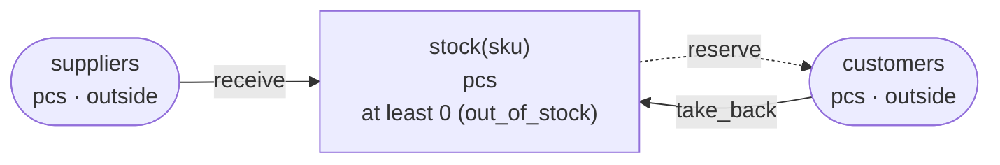
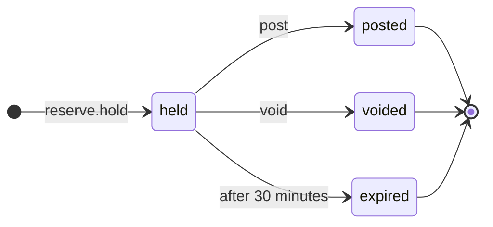

<!-- The output of `chobo doc tests/books/stock_reservation.book`. Do not edit by hand. -->

# stock_reservation v1

Stock per SKU. A delivery adds to it, an order holds what it takes for 30 minutes, shipping posts the hold, cancelling voids it

`tests/books/stock_reservation.book`, as `chobo doc` writes it. Each account keeps a balance: what came in, less what went out. Every transfer keeps the bounds of the accounts: one that would break a bound is refused with the name the book gives that bound, and nothing of it moves. A transfer either moves at once (`do`), or first holds what it moves (`hold`); a hold is then posted (`post`, all of it or part), voided (`void`), or expires.

## Accounts

| Account | One for each | Unit | Bounds | What it is |
|---|---|---|---|---|
| `stock` | `sku` | pcs | at least 0; a transfer that would go below is refused with `out_of_stock` | what is on the shelves |
| `suppliers` | one account | pcs | outside the book: no bounds, and it may go below 0 |  |
| `customers` | one account | pcs | outside the book: no bounds, and it may go below 0 |  |

## How things move



A box is an account, and an arrow a move of a transfer. A rounded box is an account outside the book, which has no bounds. A dashed arrow belongs to a transfer that holds first, and moves when the hold is posted.

## Transfers

### receive

- Moves `qty` from `suppliers` to `stock(sku)`.
- Key: once per `delivery` and `sku`. The same call again does nothing, and answers `done_before`; one that differs only in `qty` is refused with `key_conflict`.
- Moves at once (`do`).

| Operation | May be refused with | When |
|---|---|---|
| `receive.do` | `key_conflict` | a call with the same `delivery` and `sku` and other arguments came before |

<details><summary>How each refusal comes about</summary>

#### receive.do: key_conflict

```text
 1  receive.do(delivery: delivery-1, sku: sku-2, qty: 1)  done
 2  receive.do(delivery: delivery-1, sku: sku-2, qty: 2)  refused: key_conflict
```

</details>

### reserve

posted when the order ships, voided when it is cancelled

- Moves `qty` from `stock(sku)` to `customers`.
- Key: once per `order` and `sku`. The same call again does nothing, and answers `done_before`; one that differs only in `qty` is refused with `key_conflict`; holding again with the same key after the hold has ended answers `done_before`, and holds nothing.
- Holds first: the caller posts or voids the hold. It expires 30 minutes after it was made, and what it holds goes back.



| The hold | post | void |
|---|---|---|
| held | posts it: the amounts given, or all of it, and the rest goes back; more than it holds is refused with `over_hold`; once 30 minutes have passed since it was held, refused with `expired` | voids it: what it holds goes back; once 30 minutes have passed since it was held, refused with `expired` |
| posted | `done_before` with the same amounts; refused with `key_conflict` with others | refused with `already_posted` |
| voided | refused with `already_voided` | `done_before` |
| expired | refused with `expired` | refused with `expired` |
| no hold with the key | refused with `no_such_hold` | refused with `no_such_hold` |

| Operation | May be refused with | When |
|---|---|---|
| `reserve.hold` | `out_of_stock` | `stock(sku)` would go below 0 |
| `reserve.hold` | `key_conflict` | a call with the same `order` and `sku` and other arguments came before |
| `reserve.hold` | `already_refused` | a call with the same `order` and `sku` was refused by a bound before; a key a bound refused stays refused, even once there is enough |
| `reserve.post` | `key_conflict` | the hold was posted before, for other amounts |
| `reserve.post` | `already_voided` | the hold is voided already |
| `reserve.post` | `expired` | the hold has expired |
| `reserve.post` | `over_hold` | more than the hold holds |
| `reserve.post` | `no_such_hold` | there is no hold with that `order` and `sku` |
| `reserve.void` | `already_posted` | the hold is posted already |
| `reserve.void` | `expired` | the hold has expired |
| `reserve.void` | `no_such_hold` | there is no hold with that `order` and `sku` |

<details><summary>How each refusal comes about</summary>

#### reserve.hold: out_of_stock

```text
 1  reserve.hold(order: order-1, sku: sku-2, qty: 1)  refused: out_of_stock (move 1 takes 1 from stock(sku-2): posted 0, held out 0)
```

#### reserve.hold: key_conflict

```text
 1  receive.do(delivery: delivery-1, sku: sku-2, qty: 1)  done
 2  reserve.hold(order: order-3, sku: sku-2, qty: 1)      done
 3  reserve.hold(order: order-3, sku: sku-2, qty: 2)      refused: key_conflict
```

#### reserve.hold: already_refused

```text
 1  reserve.hold(order: order-1, sku: sku-2, qty: 1)  refused: out_of_stock (move 1 takes 1 from stock(sku-2): posted 0, held out 0)
 2  reserve.hold(order: order-1, sku: sku-2, qty: 1)  refused: already_refused
```

#### reserve.post: key_conflict

```text
 1  receive.do(delivery: delivery-1, sku: sku-2, qty: 2)  done
 2  reserve.hold(order: order-3, sku: sku-2, qty: 2)      done
 3  reserve.post(order: order-3, sku: sku-2)              done
 4  reserve.post(order: order-3, sku: sku-2, qty: 1)      refused: key_conflict
```

#### reserve.post: already_voided

```text
 1  receive.do(delivery: delivery-1, sku: sku-2, qty: 2)  done
 2  reserve.hold(order: order-3, sku: sku-2, qty: 2)      done
 3  reserve.void(order: order-3, sku: sku-2)              done
 4  reserve.post(order: order-3, sku: sku-2)              refused: already_voided
```

#### reserve.post: expired

```text
 1  receive.do(delivery: delivery-1, sku: sku-2, qty: 2)  done
 2  reserve.hold(order: order-3, sku: sku-2, qty: 2)      done
 3  pass 30 minutes                                       reserve(order-3, sku-2) expired
 4  reserve.post(order: order-3, sku: sku-2)              refused: expired
```

#### reserve.post: over_hold

```text
 1  receive.do(delivery: delivery-1, sku: sku-2, qty: 2)  done
 2  reserve.hold(order: order-3, sku: sku-2, qty: 2)      done
 3  reserve.post(order: order-3, sku: sku-2, qty: 3)      refused: over_hold
```

#### reserve.post: no_such_hold

```text
 1  reserve.post(order: order-1, sku: sku-2)  refused: no_such_hold
```

#### reserve.void: already_posted

```text
 1  receive.do(delivery: delivery-1, sku: sku-2, qty: 2)  done
 2  reserve.hold(order: order-3, sku: sku-2, qty: 2)      done
 3  reserve.post(order: order-3, sku: sku-2)              done
 4  reserve.void(order: order-3, sku: sku-2)              refused: already_posted
```

#### reserve.void: expired

```text
 1  receive.do(delivery: delivery-1, sku: sku-2, qty: 2)  done
 2  reserve.hold(order: order-3, sku: sku-2, qty: 2)      done
 3  pass 30 minutes                                       reserve(order-3, sku-2) expired
 4  reserve.void(order: order-3, sku: sku-2)              refused: expired
```

#### reserve.void: no_such_hold

```text
 1  reserve.void(order: order-1, sku: sku-2)  refused: no_such_hold
```

</details>

### take_back

- Moves `qty` from `customers` to `stock(sku)`.
- Key: once per `return_slip` and `sku`. The same call again does nothing, and answers `done_before`; one that differs only in `qty` is refused with `key_conflict`.
- Moves at once (`do`).

| Operation | May be refused with | When |
|---|---|---|
| `take_back.do` | `key_conflict` | a call with the same `return_slip` and `sku` and other arguments came before |

<details><summary>How each refusal comes about</summary>

#### take_back.do: key_conflict

```text
 1  take_back.do(return_slip: return_slip-1, sku: sku-2, qty: 1)  done
 2  take_back.do(return_slip: return_slip-1, sku: sku-2, qty: 2)  refused: key_conflict
```

</details>

## Scenarios

21 scenarios, which `chobo scenarios` makes from the book: among them each bound just before, at and past it, each key used twice, every way a hold ends, and two callers after the last of something at the same time. The reference interpreter ran each one; after each step come the balances it left. A balance is what is posted, with what is held in brackets.

<details><summary>1. bound: reserve.hold takes stock(sku) to 1, one above <code>at least 0</code></summary>

| # | Operation | Result | stock(sku-2) | suppliers | customers |
|---|---|---|---|---|---|
| 1 | receive.do(delivery: delivery-1, sku: sku-2, qty: 2) | done | 2 | -2 | 0 |
| 2 | reserve.hold(order: order-3, sku: sku-2, qty: 1) | done | 2 (held out 1) | -2 | 0 (held in 1) |

</details>

<details><summary>2. bound: reserve.hold takes stock(sku) to exactly 0, its <code>at least 0</code></summary>

| # | Operation | Result | stock(sku-2) | suppliers | customers |
|---|---|---|---|---|---|
| 1 | receive.do(delivery: delivery-1, sku: sku-2, qty: 2) | done | 2 | -2 | 0 |
| 2 | reserve.hold(order: order-3, sku: sku-2, qty: 2) | done | 2 (held out 2) | -2 | 0 (held in 2) |

</details>

<details><summary>3. bound: reserve.hold would take stock(sku) to -1, below <code>at least 0</code></summary>

| # | Operation | Result | stock(sku-2) | suppliers | customers |
|---|---|---|---|---|---|
| 1 | receive.do(delivery: delivery-1, sku: sku-2, qty: 2) | done | 2 | -2 | 0 |
| 2 | reserve.hold(order: order-3, sku: sku-2, qty: 3) | refused: out_of_stock | 2 | -2 | 0 |

</details>

<details><summary>4. key: receive.do twice with the same arguments</summary>

| # | Operation | Result | stock(sku-2) | suppliers |
|---|---|---|---|---|
| 1 | receive.do(delivery: delivery-1, sku: sku-2, qty: 1) | done | 1 | -1 |
| 2 | receive.do(delivery: delivery-1, sku: sku-2, qty: 1) | done_before | 1 | -1 |

</details>

<details><summary>5. key: receive.do again with another qty</summary>

| # | Operation | Result | stock(sku-2) | suppliers |
|---|---|---|---|---|
| 1 | receive.do(delivery: delivery-1, sku: sku-2, qty: 1) | done | 1 | -1 |
| 2 | receive.do(delivery: delivery-1, sku: sku-2, qty: 2) | refused: key_conflict | 1 | -1 |

</details>

<details><summary>6. key: reserve.hold twice with the same arguments</summary>

| # | Operation | Result | stock(sku-2) | suppliers | customers |
|---|---|---|---|---|---|
| 1 | receive.do(delivery: delivery-1, sku: sku-2, qty: 1) | done | 1 | -1 | 0 |
| 2 | reserve.hold(order: order-3, sku: sku-2, qty: 1) | done | 1 (held out 1) | -1 | 0 (held in 1) |
| 3 | reserve.hold(order: order-3, sku: sku-2, qty: 1) | done_before | 1 (held out 1) | -1 | 0 (held in 1) |

</details>

<details><summary>7. key: reserve.hold again with another qty</summary>

| # | Operation | Result | stock(sku-2) | suppliers | customers |
|---|---|---|---|---|---|
| 1 | receive.do(delivery: delivery-1, sku: sku-2, qty: 1) | done | 1 | -1 | 0 |
| 2 | reserve.hold(order: order-3, sku: sku-2, qty: 1) | done | 1 (held out 1) | -1 | 0 (held in 1) |
| 3 | reserve.hold(order: order-3, sku: sku-2, qty: 2) | refused: key_conflict | 1 (held out 1) | -1 | 0 (held in 1) |

</details>

<details><summary>8. key: reserve.hold refused with out_of_stock, then again, and again once stock(sku) has enough</summary>

| # | Operation | Result | stock(sku-2) | suppliers | customers |
|---|---|---|---|---|---|
| 1 | reserve.hold(order: order-1, sku: sku-2, qty: 1) | refused: out_of_stock | 0 | 0 | 0 |
| 2 | reserve.hold(order: order-1, sku: sku-2, qty: 1) | refused: already_refused | 0 | 0 | 0 |
| 3 | receive.do(delivery: delivery-3, sku: sku-2, qty: 1) | done | 1 | -1 | 0 |
| 4 | reserve.hold(order: order-1, sku: sku-2, qty: 1) | refused: already_refused | 1 | -1 | 0 |

</details>

<details><summary>9. key: take_back.do twice with the same arguments</summary>

| # | Operation | Result | stock(sku-2) | customers |
|---|---|---|---|---|
| 1 | take_back.do(return_slip: return_slip-1, sku: sku-2, qty: 1) | done | 1 | -1 |
| 2 | take_back.do(return_slip: return_slip-1, sku: sku-2, qty: 1) | done_before | 1 | -1 |

</details>

<details><summary>10. key: take_back.do again with another qty</summary>

| # | Operation | Result | stock(sku-2) | customers |
|---|---|---|---|---|
| 1 | take_back.do(return_slip: return_slip-1, sku: sku-2, qty: 1) | done | 1 | -1 |
| 2 | take_back.do(return_slip: return_slip-1, sku: sku-2, qty: 2) | refused: key_conflict | 1 | -1 |

</details>

<details><summary>11. hold: reserve posted in full</summary>

| # | Operation | Result | stock(sku-2) | suppliers | customers |
|---|---|---|---|---|---|
| 1 | receive.do(delivery: delivery-1, sku: sku-2, qty: 2) | done | 2 | -2 | 0 |
| 2 | reserve.hold(order: order-3, sku: sku-2, qty: 2) | done | 2 (held out 2) | -2 | 0 (held in 2) |
| 3 | reserve.post(order: order-3, sku: sku-2) | done | 0 | -2 | 2 |

</details>

<details><summary>12. hold: reserve posted in part</summary>

| # | Operation | Result | stock(sku-2) | suppliers | customers |
|---|---|---|---|---|---|
| 1 | receive.do(delivery: delivery-1, sku: sku-2, qty: 2) | done | 2 | -2 | 0 |
| 2 | reserve.hold(order: order-3, sku: sku-2, qty: 2) | done | 2 (held out 2) | -2 | 0 (held in 2) |
| 3 | reserve.post(order: order-3, sku: sku-2, qty: 1) | done | 1 | -2 | 1 |

</details>

<details><summary>13. hold: reserve voided</summary>

| # | Operation | Result | stock(sku-2) | suppliers | customers |
|---|---|---|---|---|---|
| 1 | receive.do(delivery: delivery-1, sku: sku-2, qty: 2) | done | 2 | -2 | 0 |
| 2 | reserve.hold(order: order-3, sku: sku-2, qty: 2) | done | 2 (held out 2) | -2 | 0 (held in 2) |
| 3 | reserve.void(order: order-3, sku: sku-2) | done | 2 | -2 | 0 |

</details>

<details><summary>14. hold: reserve posted, then voided</summary>

| # | Operation | Result | stock(sku-2) | suppliers | customers |
|---|---|---|---|---|---|
| 1 | receive.do(delivery: delivery-1, sku: sku-2, qty: 2) | done | 2 | -2 | 0 |
| 2 | reserve.hold(order: order-3, sku: sku-2, qty: 2) | done | 2 (held out 2) | -2 | 0 (held in 2) |
| 3 | reserve.post(order: order-3, sku: sku-2) | done | 0 | -2 | 2 |
| 4 | reserve.void(order: order-3, sku: sku-2) | refused: already_posted | 0 | -2 | 2 |

</details>

<details><summary>15. hold: reserve voided, then posted</summary>

| # | Operation | Result | stock(sku-2) | suppliers | customers |
|---|---|---|---|---|---|
| 1 | receive.do(delivery: delivery-1, sku: sku-2, qty: 2) | done | 2 | -2 | 0 |
| 2 | reserve.hold(order: order-3, sku: sku-2, qty: 2) | done | 2 (held out 2) | -2 | 0 (held in 2) |
| 3 | reserve.void(order: order-3, sku: sku-2) | done | 2 | -2 | 0 |
| 4 | reserve.post(order: order-3, sku: sku-2) | refused: already_voided | 2 | -2 | 0 |

</details>

<details><summary>16. hold: reserve posted for more than it holds, then for what it holds</summary>

| # | Operation | Result | stock(sku-2) | suppliers | customers |
|---|---|---|---|---|---|
| 1 | receive.do(delivery: delivery-1, sku: sku-2, qty: 2) | done | 2 | -2 | 0 |
| 2 | reserve.hold(order: order-3, sku: sku-2, qty: 2) | done | 2 (held out 2) | -2 | 0 (held in 2) |
| 3 | reserve.post(order: order-3, sku: sku-2, qty: 3) | refused: over_hold | 2 (held out 2) | -2 | 0 (held in 2) |
| 4 | reserve.post(order: order-3, sku: sku-2, qty: 2) | done | 0 | -2 | 2 |

</details>

<details><summary>17. hold: reserve posted before it is held, then held and posted</summary>

| # | Operation | Result | stock(sku-2) | suppliers | customers |
|---|---|---|---|---|---|
| 1 | reserve.post(order: order-1, sku: sku-2) | refused: no_such_hold | 0 | 0 | 0 |
| 2 | receive.do(delivery: delivery-1, sku: sku-2, qty: 1) | done | 1 | -1 | 0 |
| 3 | reserve.hold(order: order-1, sku: sku-2, qty: 1) | done | 1 (held out 1) | -1 | 0 (held in 1) |
| 4 | reserve.post(order: order-1, sku: sku-2) | done | 0 | -1 | 1 |

</details>

<details><summary>18. hold: reserve posted twice, with the same amounts and with others</summary>

| # | Operation | Result | stock(sku-2) | suppliers | customers |
|---|---|---|---|---|---|
| 1 | receive.do(delivery: delivery-1, sku: sku-2, qty: 2) | done | 2 | -2 | 0 |
| 2 | reserve.hold(order: order-3, sku: sku-2, qty: 2) | done | 2 (held out 2) | -2 | 0 (held in 2) |
| 3 | reserve.post(order: order-3, sku: sku-2) | done | 0 | -2 | 2 |
| 4 | reserve.post(order: order-3, sku: sku-2) | done_before | 0 | -2 | 2 |
| 5 | reserve.post(order: order-3, sku: sku-2, qty: 2) | done_before | 0 | -2 | 2 |
| 6 | reserve.post(order: order-3, sku: sku-2, qty: 1) | refused: key_conflict | 0 | -2 | 2 |

</details>

<details><summary>19. pass: reserve expires, then is posted and voided</summary>

| # | Operation | Result | stock(sku-2) | suppliers | customers |
|---|---|---|---|---|---|
| 1 | receive.do(delivery: delivery-1, sku: sku-2, qty: 2) | done | 2 | -2 | 0 |
| 2 | reserve.hold(order: order-3, sku: sku-2, qty: 2) | done | 2 (held out 2) | -2 | 0 (held in 2) |
| 3 | pass 31 minutes | reserve(order-3, sku-2) expired | 2 | -2 | 0 |
| 4 | reserve.post(order: order-3, sku: sku-2) | refused: expired | 2 | -2 | 0 |
| 5 | reserve.void(order: order-3, sku: sku-2) | refused: expired | 2 | -2 | 0 |

</details>

<details><summary>20. pass: reserve held again with the same key after it expired</summary>

| # | Operation | Result | stock(sku-2) | suppliers | customers |
|---|---|---|---|---|---|
| 1 | receive.do(delivery: delivery-1, sku: sku-2, qty: 2) | done | 2 | -2 | 0 |
| 2 | reserve.hold(order: order-3, sku: sku-2, qty: 2) | done | 2 (held out 2) | -2 | 0 (held in 2) |
| 3 | pass 31 minutes | reserve(order-3, sku-2) expired | 2 | -2 | 0 |
| 4 | reserve.hold(order: order-3, sku: sku-2, qty: 2) | done_before | 2 | -2 | 0 |

</details>

<details><summary>21. together: two callers take the last 1 of stock(sku) with reserve.hold</summary>

It can come out 2 ways, by the order the operations at the same time go in.

Outcome 1:

| # | Operation | Result | stock(sku-2) | suppliers | customers |
|---|---|---|---|---|---|
| 1 | receive.do(delivery: delivery-1, sku: sku-2, qty: 1) | done | 1 | -1 | 0 |
| 2 | together<br>caller 1: reserve.hold(order: order-3, sku: sku-2, qty: 1)<br>caller 2: reserve.hold(order: order-4, sku: sku-2, qty: 1) | <br>done<br>refused: out_of_stock | 1 (held out 1) | -1 | 0 (held in 1) |

Outcome 2:

| # | Operation | Result | stock(sku-2) | suppliers | customers |
|---|---|---|---|---|---|
| 1 | receive.do(delivery: delivery-1, sku: sku-2, qty: 1) | done | 1 | -1 | 0 |
| 2 | together<br>caller 1: reserve.hold(order: order-3, sku: sku-2, qty: 1)<br>caller 2: reserve.hold(order: order-4, sku: sku-2, qty: 1) | <br>refused: out_of_stock<br>done | 1 (held out 1) | -1 | 0 (held in 1) |

</details>

