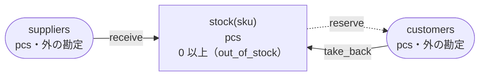
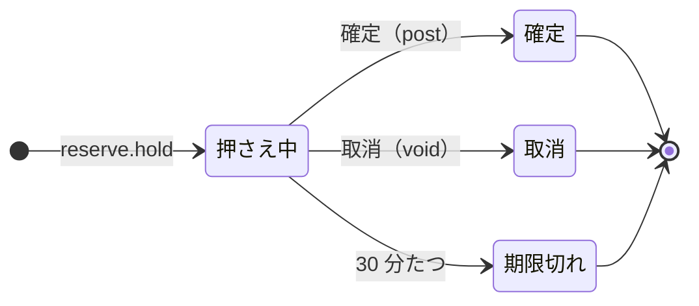

<!-- `chobo doc tests/books/stock_reservation.book --lang ja` の出力です。手で編集しないでください。 -->

# stock_reservation v1

Stock per SKU. A delivery adds to it, an order holds what it takes for 30 minutes, shipping posts the hold, cancelling voids it

`chobo doc` が `tests/books/stock_reservation.book` から作ったページ。勘定ごとに残高を持ち、残高は入った量から出た量を引いたもの。どの振替も勘定の下限と上限を守り、守れない振替は、その境界に付けた名前で拒否されて、どの移動も行われない。振替には、すぐに動かすもの（`do`）と、動かす量をまず押さえるもの（`hold`）がある。押さえた分は、あとで確定される（`post`。全部か一部）か、取り消される（`void`）か、有効期限で切れる。

## 勘定

| 勘定 | 分け方 | 単位 | 境界 | 説明 |
|---|---|---|---|---|
| `stock` | `sku` ごと | pcs | 0 以上。下回る振替は `out_of_stock` で拒否される | what is on the shelves |
| `suppliers` | 一つだけ | pcs | 外の勘定。境界は無く、マイナスにもなる |  |
| `customers` | 一つだけ | pcs | 外の勘定。境界は無く、マイナスにもなる |  |

## 勘定のあいだの流れ



四角は勘定で、矢印は振替の移動。角の丸い四角は外の勘定で、境界を持たない。破線の矢印は仮押さえの振替で、まず押さえ、確定したときに動く。

## 振替

### receive

- 移動: `suppliers` から `stock(sku)` へ `qty`。
- キー: `delivery` と `sku` の組ごとに一度だけ動く。同じ呼び出しの二度目は何もせず、`done_before` を返す。キーが同じで `qty` が違う二度目の呼び出しは、`key_conflict` で拒否される。
- すぐに動かす（`do`）。

| 操作 | 拒否されうる理由 | いつ |
|---|---|---|
| `receive.do` | `key_conflict` | `delivery` と `sku` が同じで、ほかの引数が違う呼び出しが、前に済んでいる |

<details><summary>拒否される例</summary>

#### receive.do: key_conflict

```text
 1  receive.do(delivery: delivery-1, sku: sku-2, qty: 1)  通る
 2  receive.do(delivery: delivery-1, sku: sku-2, qty: 2)  key_conflict で拒否される
```

</details>

### reserve

posted when the order ships, voided when it is cancelled

- 移動: `stock(sku)` から `customers` へ `qty`。
- キー: `order` と `sku` の組ごとに一度だけ動く。同じ呼び出しの二度目は何もせず、`done_before` を返す。キーが同じで `qty` が違う二度目の呼び出しは、`key_conflict` で拒否される。仮押さえが終わったあとに同じキーでもう一度押さえると、`done_before` を返し、何も押さえない。
- 仮押さえ: まず押さえる。確定と取消は呼ぶ側がする。押さえてから 30 分で期限が切れ、押さえた量は元に戻る。



| 仮押さえの状態 | post（確定） | void（取消） |
|---|---|---|
| 押さえ中 | 確定する。額を渡せばその額、渡さなければ全額で、残りは元に戻る。押さえた額を超えれば `over_hold` で拒否される。押さえてから 30 分たっていれば `expired` で拒否される | 取り消す。押さえた量は元に戻る。押さえてから 30 分たっていれば `expired` で拒否される |
| 確定 | 同じ額なら `done_before`、違う額なら `key_conflict` で拒否される | `already_posted` で拒否される |
| 取消 | `already_voided` で拒否される | `done_before` |
| 期限切れ | `expired` で拒否される | `expired` で拒否される |
| 仮押さえが無い | `no_such_hold` で拒否される | `no_such_hold` で拒否される |

| 操作 | 拒否されうる理由 | いつ |
|---|---|---|
| `reserve.hold` | `out_of_stock` | `stock(sku)` が 0 を下回る |
| `reserve.hold` | `key_conflict` | `order` と `sku` が同じで、ほかの引数が違う呼び出しが、前に済んでいる |
| `reserve.hold` | `already_refused` | `order` と `sku` が同じ呼び出しが、前に境界で拒否されている。境界で拒否されたキーは、あとで足りるようになっても通らない |
| `reserve.post` | `key_conflict` | 仮押さえは、違う額で確定済み |
| `reserve.post` | `already_voided` | 仮押さえはもう取り消されている |
| `reserve.post` | `expired` | 仮押さえの期限が切れている |
| `reserve.post` | `over_hold` | 押さえた額より多く確定しようとした |
| `reserve.post` | `no_such_hold` | その `order` と `sku` の仮押さえが無い |
| `reserve.void` | `already_posted` | 仮押さえはもう確定している |
| `reserve.void` | `expired` | 仮押さえの期限が切れている |
| `reserve.void` | `no_such_hold` | その `order` と `sku` の仮押さえが無い |

<details><summary>拒否される例</summary>

#### reserve.hold: out_of_stock

```text
 1  reserve.hold(order: order-1, sku: sku-2, qty: 1)  out_of_stock で拒否される（1 つ目の移動が stock(sku-2) から 1 を取ろうとしたときの残高は、確定 0、出ていく仮押さえ 0）
```

#### reserve.hold: key_conflict

```text
 1  receive.do(delivery: delivery-1, sku: sku-2, qty: 1)  通る
 2  reserve.hold(order: order-3, sku: sku-2, qty: 1)      通る
 3  reserve.hold(order: order-3, sku: sku-2, qty: 2)      key_conflict で拒否される
```

#### reserve.hold: already_refused

```text
 1  reserve.hold(order: order-1, sku: sku-2, qty: 1)  out_of_stock で拒否される（1 つ目の移動が stock(sku-2) から 1 を取ろうとしたときの残高は、確定 0、出ていく仮押さえ 0）
 2  reserve.hold(order: order-1, sku: sku-2, qty: 1)  already_refused で拒否される
```

#### reserve.post: key_conflict

```text
 1  receive.do(delivery: delivery-1, sku: sku-2, qty: 2)  通る
 2  reserve.hold(order: order-3, sku: sku-2, qty: 2)      通る
 3  reserve.post(order: order-3, sku: sku-2)              通る
 4  reserve.post(order: order-3, sku: sku-2, qty: 1)      key_conflict で拒否される
```

#### reserve.post: already_voided

```text
 1  receive.do(delivery: delivery-1, sku: sku-2, qty: 2)  通る
 2  reserve.hold(order: order-3, sku: sku-2, qty: 2)      通る
 3  reserve.void(order: order-3, sku: sku-2)              通る
 4  reserve.post(order: order-3, sku: sku-2)              already_voided で拒否される
```

#### reserve.post: expired

```text
 1  receive.do(delivery: delivery-1, sku: sku-2, qty: 2)  通る
 2  reserve.hold(order: order-3, sku: sku-2, qty: 2)      通る
 3  pass 30 分                                            reserve(order-3, sku-2) が期限切れ
 4  reserve.post(order: order-3, sku: sku-2)              expired で拒否される
```

#### reserve.post: over_hold

```text
 1  receive.do(delivery: delivery-1, sku: sku-2, qty: 2)  通る
 2  reserve.hold(order: order-3, sku: sku-2, qty: 2)      通る
 3  reserve.post(order: order-3, sku: sku-2, qty: 3)      over_hold で拒否される
```

#### reserve.post: no_such_hold

```text
 1  reserve.post(order: order-1, sku: sku-2)  no_such_hold で拒否される
```

#### reserve.void: already_posted

```text
 1  receive.do(delivery: delivery-1, sku: sku-2, qty: 2)  通る
 2  reserve.hold(order: order-3, sku: sku-2, qty: 2)      通る
 3  reserve.post(order: order-3, sku: sku-2)              通る
 4  reserve.void(order: order-3, sku: sku-2)              already_posted で拒否される
```

#### reserve.void: expired

```text
 1  receive.do(delivery: delivery-1, sku: sku-2, qty: 2)  通る
 2  reserve.hold(order: order-3, sku: sku-2, qty: 2)      通る
 3  pass 30 分                                            reserve(order-3, sku-2) が期限切れ
 4  reserve.void(order: order-3, sku: sku-2)              expired で拒否される
```

#### reserve.void: no_such_hold

```text
 1  reserve.void(order: order-1, sku: sku-2)  no_such_hold で拒否される
```

</details>

### take_back

- 移動: `customers` から `stock(sku)` へ `qty`。
- キー: `return_slip` と `sku` の組ごとに一度だけ動く。同じ呼び出しの二度目は何もせず、`done_before` を返す。キーが同じで `qty` が違う二度目の呼び出しは、`key_conflict` で拒否される。
- すぐに動かす（`do`）。

| 操作 | 拒否されうる理由 | いつ |
|---|---|---|
| `take_back.do` | `key_conflict` | `return_slip` と `sku` が同じで、ほかの引数が違う呼び出しが、前に済んでいる |

<details><summary>拒否される例</summary>

#### take_back.do: key_conflict

```text
 1  take_back.do(return_slip: return_slip-1, sku: sku-2, qty: 1)  通る
 2  take_back.do(return_slip: return_slip-1, sku: sku-2, qty: 2)  key_conflict で拒否される
```

</details>

## シナリオ

`chobo scenarios` が帳簿から作ったシナリオ 21 本。境界の手前・ちょうど・超える、同じキーの二度目、仮押さえの終わり方、二つの呼び出し元が同時に最後の一つを取りに来るもの、などがある。どれも参照インタプリタで流したもので、ステップごとに、そのあとの残高を載せている。残高は確定した量で、仮押さえがあれば、その量を括弧の中に添えている。

<details><summary>1. 境界: reserve.hold が stock(sku) を 1 まで減らす（<code>at least 0</code> の 1 つ手前）</summary>

| # | 操作 | 結果 | stock(sku-2) | suppliers | customers |
|---|---|---|---|---|---|
| 1 | receive.do(delivery: delivery-1, sku: sku-2, qty: 2) | 通る | 2 | -2 | 0 |
| 2 | reserve.hold(order: order-3, sku: sku-2, qty: 1) | 通る | 2（出ていく仮押さえ 1） | -2 | 0（入ってくる仮押さえ 1） |

</details>

<details><summary>2. 境界: reserve.hold が stock(sku) をちょうど 0 まで減らす（<code>at least 0</code> ちょうど）</summary>

| # | 操作 | 結果 | stock(sku-2) | suppliers | customers |
|---|---|---|---|---|---|
| 1 | receive.do(delivery: delivery-1, sku: sku-2, qty: 2) | 通る | 2 | -2 | 0 |
| 2 | reserve.hold(order: order-3, sku: sku-2, qty: 2) | 通る | 2（出ていく仮押さえ 2） | -2 | 0（入ってくる仮押さえ 2） |

</details>

<details><summary>3. 境界: reserve.hold は stock(sku) を -1 まで減らすので拒否される（<code>at least 0</code> を割る）</summary>

| # | 操作 | 結果 | stock(sku-2) | suppliers | customers |
|---|---|---|---|---|---|
| 1 | receive.do(delivery: delivery-1, sku: sku-2, qty: 2) | 通る | 2 | -2 | 0 |
| 2 | reserve.hold(order: order-3, sku: sku-2, qty: 3) | out_of_stock で拒否される | 2 | -2 | 0 |

</details>

<details><summary>4. キー: receive.do を同じ引数で二度呼ぶ</summary>

| # | 操作 | 結果 | stock(sku-2) | suppliers |
|---|---|---|---|---|
| 1 | receive.do(delivery: delivery-1, sku: sku-2, qty: 1) | 通る | 1 | -1 |
| 2 | receive.do(delivery: delivery-1, sku: sku-2, qty: 1) | done_before（前に済んでいる） | 1 | -1 |

</details>

<details><summary>5. キー: receive.do を qty だけ変えてもう一度呼ぶ</summary>

| # | 操作 | 結果 | stock(sku-2) | suppliers |
|---|---|---|---|---|
| 1 | receive.do(delivery: delivery-1, sku: sku-2, qty: 1) | 通る | 1 | -1 |
| 2 | receive.do(delivery: delivery-1, sku: sku-2, qty: 2) | key_conflict で拒否される | 1 | -1 |

</details>

<details><summary>6. キー: reserve.hold を同じ引数で二度呼ぶ</summary>

| # | 操作 | 結果 | stock(sku-2) | suppliers | customers |
|---|---|---|---|---|---|
| 1 | receive.do(delivery: delivery-1, sku: sku-2, qty: 1) | 通る | 1 | -1 | 0 |
| 2 | reserve.hold(order: order-3, sku: sku-2, qty: 1) | 通る | 1（出ていく仮押さえ 1） | -1 | 0（入ってくる仮押さえ 1） |
| 3 | reserve.hold(order: order-3, sku: sku-2, qty: 1) | done_before（前に済んでいる） | 1（出ていく仮押さえ 1） | -1 | 0（入ってくる仮押さえ 1） |

</details>

<details><summary>7. キー: reserve.hold を qty だけ変えてもう一度呼ぶ</summary>

| # | 操作 | 結果 | stock(sku-2) | suppliers | customers |
|---|---|---|---|---|---|
| 1 | receive.do(delivery: delivery-1, sku: sku-2, qty: 1) | 通る | 1 | -1 | 0 |
| 2 | reserve.hold(order: order-3, sku: sku-2, qty: 1) | 通る | 1（出ていく仮押さえ 1） | -1 | 0（入ってくる仮押さえ 1） |
| 3 | reserve.hold(order: order-3, sku: sku-2, qty: 2) | key_conflict で拒否される | 1（出ていく仮押さえ 1） | -1 | 0（入ってくる仮押さえ 1） |

</details>

<details><summary>8. キー: reserve.hold が out_of_stock で拒否されたあと、同じ引数ですぐにもう一度呼び、stock(sku) が足りるようになってからもう一度呼ぶ</summary>

| # | 操作 | 結果 | stock(sku-2) | suppliers | customers |
|---|---|---|---|---|---|
| 1 | reserve.hold(order: order-1, sku: sku-2, qty: 1) | out_of_stock で拒否される | 0 | 0 | 0 |
| 2 | reserve.hold(order: order-1, sku: sku-2, qty: 1) | already_refused で拒否される | 0 | 0 | 0 |
| 3 | receive.do(delivery: delivery-3, sku: sku-2, qty: 1) | 通る | 1 | -1 | 0 |
| 4 | reserve.hold(order: order-1, sku: sku-2, qty: 1) | already_refused で拒否される | 1 | -1 | 0 |

</details>

<details><summary>9. キー: take_back.do を同じ引数で二度呼ぶ</summary>

| # | 操作 | 結果 | stock(sku-2) | customers |
|---|---|---|---|---|
| 1 | take_back.do(return_slip: return_slip-1, sku: sku-2, qty: 1) | 通る | 1 | -1 |
| 2 | take_back.do(return_slip: return_slip-1, sku: sku-2, qty: 1) | done_before（前に済んでいる） | 1 | -1 |

</details>

<details><summary>10. キー: take_back.do を qty だけ変えてもう一度呼ぶ</summary>

| # | 操作 | 結果 | stock(sku-2) | customers |
|---|---|---|---|---|
| 1 | take_back.do(return_slip: return_slip-1, sku: sku-2, qty: 1) | 通る | 1 | -1 |
| 2 | take_back.do(return_slip: return_slip-1, sku: sku-2, qty: 2) | key_conflict で拒否される | 1 | -1 |

</details>

<details><summary>11. 仮押さえ: reserve を全額で確定する</summary>

| # | 操作 | 結果 | stock(sku-2) | suppliers | customers |
|---|---|---|---|---|---|
| 1 | receive.do(delivery: delivery-1, sku: sku-2, qty: 2) | 通る | 2 | -2 | 0 |
| 2 | reserve.hold(order: order-3, sku: sku-2, qty: 2) | 通る | 2（出ていく仮押さえ 2） | -2 | 0（入ってくる仮押さえ 2） |
| 3 | reserve.post(order: order-3, sku: sku-2) | 通る | 0 | -2 | 2 |

</details>

<details><summary>12. 仮押さえ: reserve を一部だけ確定する</summary>

| # | 操作 | 結果 | stock(sku-2) | suppliers | customers |
|---|---|---|---|---|---|
| 1 | receive.do(delivery: delivery-1, sku: sku-2, qty: 2) | 通る | 2 | -2 | 0 |
| 2 | reserve.hold(order: order-3, sku: sku-2, qty: 2) | 通る | 2（出ていく仮押さえ 2） | -2 | 0（入ってくる仮押さえ 2） |
| 3 | reserve.post(order: order-3, sku: sku-2, qty: 1) | 通る | 1 | -2 | 1 |

</details>

<details><summary>13. 仮押さえ: reserve を取り消す</summary>

| # | 操作 | 結果 | stock(sku-2) | suppliers | customers |
|---|---|---|---|---|---|
| 1 | receive.do(delivery: delivery-1, sku: sku-2, qty: 2) | 通る | 2 | -2 | 0 |
| 2 | reserve.hold(order: order-3, sku: sku-2, qty: 2) | 通る | 2（出ていく仮押さえ 2） | -2 | 0（入ってくる仮押さえ 2） |
| 3 | reserve.void(order: order-3, sku: sku-2) | 通る | 2 | -2 | 0 |

</details>

<details><summary>14. 仮押さえ: reserve を確定してから取り消そうとする</summary>

| # | 操作 | 結果 | stock(sku-2) | suppliers | customers |
|---|---|---|---|---|---|
| 1 | receive.do(delivery: delivery-1, sku: sku-2, qty: 2) | 通る | 2 | -2 | 0 |
| 2 | reserve.hold(order: order-3, sku: sku-2, qty: 2) | 通る | 2（出ていく仮押さえ 2） | -2 | 0（入ってくる仮押さえ 2） |
| 3 | reserve.post(order: order-3, sku: sku-2) | 通る | 0 | -2 | 2 |
| 4 | reserve.void(order: order-3, sku: sku-2) | already_posted で拒否される | 0 | -2 | 2 |

</details>

<details><summary>15. 仮押さえ: reserve を取り消してから確定しようとする</summary>

| # | 操作 | 結果 | stock(sku-2) | suppliers | customers |
|---|---|---|---|---|---|
| 1 | receive.do(delivery: delivery-1, sku: sku-2, qty: 2) | 通る | 2 | -2 | 0 |
| 2 | reserve.hold(order: order-3, sku: sku-2, qty: 2) | 通る | 2（出ていく仮押さえ 2） | -2 | 0（入ってくる仮押さえ 2） |
| 3 | reserve.void(order: order-3, sku: sku-2) | 通る | 2 | -2 | 0 |
| 4 | reserve.post(order: order-3, sku: sku-2) | already_voided で拒否される | 2 | -2 | 0 |

</details>

<details><summary>16. 仮押さえ: reserve を押さえた額より多く確定しようとし、押さえた額で確定する</summary>

| # | 操作 | 結果 | stock(sku-2) | suppliers | customers |
|---|---|---|---|---|---|
| 1 | receive.do(delivery: delivery-1, sku: sku-2, qty: 2) | 通る | 2 | -2 | 0 |
| 2 | reserve.hold(order: order-3, sku: sku-2, qty: 2) | 通る | 2（出ていく仮押さえ 2） | -2 | 0（入ってくる仮押さえ 2） |
| 3 | reserve.post(order: order-3, sku: sku-2, qty: 3) | over_hold で拒否される | 2（出ていく仮押さえ 2） | -2 | 0（入ってくる仮押さえ 2） |
| 4 | reserve.post(order: order-3, sku: sku-2, qty: 2) | 通る | 0 | -2 | 2 |

</details>

<details><summary>17. 仮押さえ: reserve を押さえる前に確定しようとし、押さえてから確定する</summary>

| # | 操作 | 結果 | stock(sku-2) | suppliers | customers |
|---|---|---|---|---|---|
| 1 | reserve.post(order: order-1, sku: sku-2) | no_such_hold で拒否される | 0 | 0 | 0 |
| 2 | receive.do(delivery: delivery-1, sku: sku-2, qty: 1) | 通る | 1 | -1 | 0 |
| 3 | reserve.hold(order: order-1, sku: sku-2, qty: 1) | 通る | 1（出ていく仮押さえ 1） | -1 | 0（入ってくる仮押さえ 1） |
| 4 | reserve.post(order: order-1, sku: sku-2) | 通る | 0 | -1 | 1 |

</details>

<details><summary>18. 仮押さえ: reserve を確定したあと、同じ額でもう一度、違う額でもう一度確定する</summary>

| # | 操作 | 結果 | stock(sku-2) | suppliers | customers |
|---|---|---|---|---|---|
| 1 | receive.do(delivery: delivery-1, sku: sku-2, qty: 2) | 通る | 2 | -2 | 0 |
| 2 | reserve.hold(order: order-3, sku: sku-2, qty: 2) | 通る | 2（出ていく仮押さえ 2） | -2 | 0（入ってくる仮押さえ 2） |
| 3 | reserve.post(order: order-3, sku: sku-2) | 通る | 0 | -2 | 2 |
| 4 | reserve.post(order: order-3, sku: sku-2) | done_before（前に済んでいる） | 0 | -2 | 2 |
| 5 | reserve.post(order: order-3, sku: sku-2, qty: 2) | done_before（前に済んでいる） | 0 | -2 | 2 |
| 6 | reserve.post(order: order-3, sku: sku-2, qty: 1) | key_conflict で拒否される | 0 | -2 | 2 |

</details>

<details><summary>19. 期限切れ: reserve が期限切れになってから、確定と取消を試す</summary>

| # | 操作 | 結果 | stock(sku-2) | suppliers | customers |
|---|---|---|---|---|---|
| 1 | receive.do(delivery: delivery-1, sku: sku-2, qty: 2) | 通る | 2 | -2 | 0 |
| 2 | reserve.hold(order: order-3, sku: sku-2, qty: 2) | 通る | 2（出ていく仮押さえ 2） | -2 | 0（入ってくる仮押さえ 2） |
| 3 | pass 31 分 | reserve(order-3, sku-2) が期限切れ | 2 | -2 | 0 |
| 4 | reserve.post(order: order-3, sku: sku-2) | expired で拒否される | 2 | -2 | 0 |
| 5 | reserve.void(order: order-3, sku: sku-2) | expired で拒否される | 2 | -2 | 0 |

</details>

<details><summary>20. 期限切れ: reserve が期限切れになってから、同じキーで押さえ直す</summary>

| # | 操作 | 結果 | stock(sku-2) | suppliers | customers |
|---|---|---|---|---|---|
| 1 | receive.do(delivery: delivery-1, sku: sku-2, qty: 2) | 通る | 2 | -2 | 0 |
| 2 | reserve.hold(order: order-3, sku: sku-2, qty: 2) | 通る | 2（出ていく仮押さえ 2） | -2 | 0（入ってくる仮押さえ 2） |
| 3 | pass 31 分 | reserve(order-3, sku-2) が期限切れ | 2 | -2 | 0 |
| 4 | reserve.hold(order: order-3, sku: sku-2, qty: 2) | done_before（前に済んでいる） | 2 | -2 | 0 |

</details>

<details><summary>21. 同時: 二つの呼び出し元が reserve.hold で stock(sku) の最後の 1 を取り合う</summary>

同時の操作の順序によって、結果は 2 通りある。

結果 1:

| # | 操作 | 結果 | stock(sku-2) | suppliers | customers |
|---|---|---|---|---|---|
| 1 | receive.do(delivery: delivery-1, sku: sku-2, qty: 1) | 通る | 1 | -1 | 0 |
| 2 | together<br>呼び出し元 1: reserve.hold(order: order-3, sku: sku-2, qty: 1)<br>呼び出し元 2: reserve.hold(order: order-4, sku: sku-2, qty: 1) | <br>通る<br>out_of_stock で拒否される | 1（出ていく仮押さえ 1） | -1 | 0（入ってくる仮押さえ 1） |

結果 2:

| # | 操作 | 結果 | stock(sku-2) | suppliers | customers |
|---|---|---|---|---|---|
| 1 | receive.do(delivery: delivery-1, sku: sku-2, qty: 1) | 通る | 1 | -1 | 0 |
| 2 | together<br>呼び出し元 1: reserve.hold(order: order-3, sku: sku-2, qty: 1)<br>呼び出し元 2: reserve.hold(order: order-4, sku: sku-2, qty: 1) | <br>out_of_stock で拒否される<br>通る | 1（出ていく仮押さえ 1） | -1 | 0（入ってくる仮押さえ 1） |

</details>

