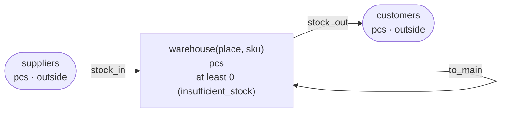

<!-- The output of `chobo doc tests/books/to_itself.book`. Do not edit by hand. -->

# to_itself v1

Moving stock between warehouses

`tests/books/to_itself.book`, as `chobo doc` writes it. Each account keeps a balance: what came in, less what went out. Every transfer keeps the bounds of the accounts: one that would break a bound is refused with the name the book gives that bound, and nothing of it moves. A transfer either moves at once (`do`), or first holds what it moves (`hold`); a hold is then posted (`post`, all of it or part), voided (`void`), or expires.

## Accounts

| Account | One for each | Unit | Bounds | What it is |
|---|---|---|---|---|
| `warehouse` | `place` and `sku` | pcs | at least 0; a transfer that would go below is refused with `insufficient_stock` |  |
| `suppliers` | one account | pcs | outside the book: no bounds, and it may go below 0 |  |
| `customers` | one account | pcs | outside the book: no bounds, and it may go below 0 |  |

## How things move



A box is an account, and an arrow a move of a transfer. A rounded box is an account outside the book, which has no bounds. A dashed arrow belongs to a transfer that holds first, and moves when the hold is posted.

## Transfers

### stock_in

- Moves `qty` from `suppliers` to `warehouse(place, sku)`.
- Key: once per `slip`. The same call again does nothing, and answers `done_before`; one that differs only in `place`, `sku` or `qty` is refused with `key_conflict`.
- Moves at once (`do`).

| Operation | May be refused with | When |
|---|---|---|
| `stock_in.do` | `key_conflict` | a call with the same `slip` and other arguments came before |

<details><summary>How each refusal comes about</summary>

#### stock_in.do: key_conflict

```text
 1  stock_in.do(slip: slip-1, place: place-2, sku: sku-3, qty: 1)  done
 2  stock_in.do(slip: slip-1, place: place-2, sku: sku-3, qty: 2)  refused: key_conflict
```

</details>

### move_stock

- Moves `qty` from `warehouse(from_place, sku)` to `warehouse(to_place, sku)`.
- Key: once per `slip`. The same call again does nothing, and answers `done_before`; one that differs only in `from_place`, `to_place`, `sku` or `qty` is refused with `key_conflict`.
- Moves at once (`do`).

| Operation | May be refused with | When |
|---|---|---|
| `move_stock.do` | `insufficient_stock` | `warehouse(from_place, sku)` would go below 0 |
| `move_stock.do` | `key_conflict` | a call with the same `slip` and other arguments came before |
| `move_stock.do` | `already_refused` | a call with the same `slip` was refused by a bound before; a key a bound refused stays refused, even once there is enough |
| `move_stock.do` | `same_account` | a move would go from an account to itself |

<details><summary>How each refusal comes about</summary>

#### move_stock.do: insufficient_stock

```text
 1  move_stock.do(slip: slip-1, from_place: from_place-2, to_place: to_place-3, sku: sku-4, qty: 1)  refused: insufficient_stock (move 1 takes 1 from warehouse(from_place-2, sku-4): posted 0, held out 0)
```

#### move_stock.do: key_conflict

```text
 1  stock_in.do(slip: slip-1, place: from_place-2, sku: sku-3, qty: 1)                               done
 2  move_stock.do(slip: slip-4, from_place: from_place-2, to_place: to_place-5, sku: sku-3, qty: 1)  done
 3  move_stock.do(slip: slip-4, from_place: from_place-2, to_place: to_place-5, sku: sku-3, qty: 2)  refused: key_conflict
```

#### move_stock.do: already_refused

```text
 1  move_stock.do(slip: slip-1, from_place: from_place-2, to_place: to_place-3, sku: sku-4, qty: 1)  refused: insufficient_stock (move 1 takes 1 from warehouse(from_place-2, sku-4): posted 0, held out 0)
 2  move_stock.do(slip: slip-1, from_place: from_place-2, to_place: to_place-3, sku: sku-4, qty: 1)  refused: already_refused
```

#### move_stock.do: same_account

```text
 1  move_stock.do(slip: slip-1, from_place: from_place-2, to_place: from_place-2, sku: sku-3, qty: 1)  refused: same_account
```

</details>

### to_main

- Moves `qty` from `warehouse(from_place, sku)` to `warehouse("main", sku)`.
- Key: once per `slip`. The same call again does nothing, and answers `done_before`; one that differs only in `from_place`, `sku` or `qty` is refused with `key_conflict`.
- Moves at once (`do`).

| Operation | May be refused with | When |
|---|---|---|
| `to_main.do` | `insufficient_stock` | `warehouse(from_place, sku)` would go below 0 |
| `to_main.do` | `key_conflict` | a call with the same `slip` and other arguments came before |
| `to_main.do` | `already_refused` | a call with the same `slip` was refused by a bound before; a key a bound refused stays refused, even once there is enough |
| `to_main.do` | `same_account` | a move would go from an account to itself |

<details><summary>How each refusal comes about</summary>

#### to_main.do: insufficient_stock

```text
 1  to_main.do(slip: slip-1, from_place: from_place-2, sku: sku-3, qty: 1)  refused: insufficient_stock (move 1 takes 1 from warehouse(from_place-2, sku-3): posted 0, held out 0)
```

#### to_main.do: key_conflict

```text
 1  stock_in.do(slip: slip-1, place: from_place-2, sku: sku-3, qty: 1)      done
 2  to_main.do(slip: slip-4, from_place: from_place-2, sku: sku-3, qty: 1)  done
 3  to_main.do(slip: slip-4, from_place: from_place-2, sku: sku-3, qty: 2)  refused: key_conflict
```

#### to_main.do: already_refused

```text
 1  to_main.do(slip: slip-1, from_place: from_place-2, sku: sku-3, qty: 1)  refused: insufficient_stock (move 1 takes 1 from warehouse(from_place-2, sku-3): posted 0, held out 0)
 2  to_main.do(slip: slip-1, from_place: from_place-2, sku: sku-3, qty: 1)  refused: already_refused
```

#### to_main.do: same_account

```text
 1  to_main.do(slip: slip-1, from_place: main, sku: sku-2, qty: 1)  refused: same_account
```

</details>

### stock_out

- Moves `qty` from `warehouse(place, sku)` to `customers`.
- Key: once per `slip`. The same call again does nothing, and answers `done_before`; one that differs only in `place`, `sku` or `qty` is refused with `key_conflict`.
- Moves at once (`do`).

| Operation | May be refused with | When |
|---|---|---|
| `stock_out.do` | `insufficient_stock` | `warehouse(place, sku)` would go below 0 |
| `stock_out.do` | `key_conflict` | a call with the same `slip` and other arguments came before |
| `stock_out.do` | `already_refused` | a call with the same `slip` was refused by a bound before; a key a bound refused stays refused, even once there is enough |

<details><summary>How each refusal comes about</summary>

#### stock_out.do: insufficient_stock

```text
 1  stock_out.do(slip: slip-1, place: place-2, sku: sku-3, qty: 1)  refused: insufficient_stock (move 1 takes 1 from warehouse(place-2, sku-3): posted 0, held out 0)
```

#### stock_out.do: key_conflict

```text
 1  stock_in.do(slip: slip-1, place: place-2, sku: sku-3, qty: 1)   done
 2  stock_out.do(slip: slip-4, place: place-2, sku: sku-3, qty: 1)  done
 3  stock_out.do(slip: slip-4, place: place-2, sku: sku-3, qty: 2)  refused: key_conflict
```

#### stock_out.do: already_refused

```text
 1  stock_out.do(slip: slip-1, place: place-2, sku: sku-3, qty: 1)  refused: insufficient_stock (move 1 takes 1 from warehouse(place-2, sku-3): posted 0, held out 0)
 2  stock_out.do(slip: slip-1, place: place-2, sku: sku-3, qty: 1)  refused: already_refused
```

</details>

## Scenarios

25 scenarios, which `chobo scenarios` makes from the book: among them each bound just before, at and past it, each key used twice, every way a hold ends, and two callers after the last of something at the same time. The reference interpreter ran each one; after each step come the balances it left. A balance is what is posted, with what is held in brackets.

<details><summary>1. bound: move_stock.do takes warehouse(from_place, sku) to 1, one above <code>at least 0</code></summary>

| # | Operation | Result | warehouse(from_place-2, sku-3) | warehouse(to_place-5, sku-3) | suppliers |
|---|---|---|---|---|---|
| 1 | stock_in.do(slip: slip-1, place: from_place-2, sku: sku-3, qty: 2) | done | 2 | 0 | -2 |
| 2 | move_stock.do(slip: slip-4, from_place: from_place-2, to_place: to_place-5, sku: sku-3, qty: 1) | done | 1 | 1 | -2 |

</details>

<details><summary>2. bound: move_stock.do takes warehouse(from_place, sku) to exactly 0, its <code>at least 0</code></summary>

| # | Operation | Result | warehouse(from_place-2, sku-3) | warehouse(to_place-5, sku-3) | suppliers |
|---|---|---|---|---|---|
| 1 | stock_in.do(slip: slip-1, place: from_place-2, sku: sku-3, qty: 2) | done | 2 | 0 | -2 |
| 2 | move_stock.do(slip: slip-4, from_place: from_place-2, to_place: to_place-5, sku: sku-3, qty: 2) | done | 0 | 2 | -2 |

</details>

<details><summary>3. bound: move_stock.do would take warehouse(from_place, sku) to -1, below <code>at least 0</code></summary>

| # | Operation | Result | warehouse(from_place-2, sku-3) | warehouse(to_place-5, sku-3) | suppliers |
|---|---|---|---|---|---|
| 1 | stock_in.do(slip: slip-1, place: from_place-2, sku: sku-3, qty: 2) | done | 2 | 0 | -2 |
| 2 | move_stock.do(slip: slip-4, from_place: from_place-2, to_place: to_place-5, sku: sku-3, qty: 3) | refused: insufficient_stock | 2 | 0 | -2 |

</details>

<details><summary>4. bound: to_main.do takes warehouse(from_place, sku) to 1, one above <code>at least 0</code></summary>

| # | Operation | Result | warehouse(from_place-2, sku-3) | warehouse(main, sku-3) | suppliers |
|---|---|---|---|---|---|
| 1 | stock_in.do(slip: slip-1, place: from_place-2, sku: sku-3, qty: 2) | done | 2 | 0 | -2 |
| 2 | to_main.do(slip: slip-4, from_place: from_place-2, sku: sku-3, qty: 1) | done | 1 | 1 | -2 |

</details>

<details><summary>5. bound: to_main.do takes warehouse(from_place, sku) to exactly 0, its <code>at least 0</code></summary>

| # | Operation | Result | warehouse(from_place-2, sku-3) | warehouse(main, sku-3) | suppliers |
|---|---|---|---|---|---|
| 1 | stock_in.do(slip: slip-1, place: from_place-2, sku: sku-3, qty: 2) | done | 2 | 0 | -2 |
| 2 | to_main.do(slip: slip-4, from_place: from_place-2, sku: sku-3, qty: 2) | done | 0 | 2 | -2 |

</details>

<details><summary>6. bound: to_main.do would take warehouse(from_place, sku) to -1, below <code>at least 0</code></summary>

| # | Operation | Result | warehouse(from_place-2, sku-3) | warehouse(main, sku-3) | suppliers |
|---|---|---|---|---|---|
| 1 | stock_in.do(slip: slip-1, place: from_place-2, sku: sku-3, qty: 2) | done | 2 | 0 | -2 |
| 2 | to_main.do(slip: slip-4, from_place: from_place-2, sku: sku-3, qty: 3) | refused: insufficient_stock | 2 | 0 | -2 |

</details>

<details><summary>7. bound: stock_out.do takes warehouse(place, sku) to 1, one above <code>at least 0</code></summary>

| # | Operation | Result | warehouse(place-2, sku-3) | suppliers | customers |
|---|---|---|---|---|---|
| 1 | stock_in.do(slip: slip-1, place: place-2, sku: sku-3, qty: 2) | done | 2 | -2 | 0 |
| 2 | stock_out.do(slip: slip-4, place: place-2, sku: sku-3, qty: 1) | done | 1 | -2 | 1 |

</details>

<details><summary>8. bound: stock_out.do takes warehouse(place, sku) to exactly 0, its <code>at least 0</code></summary>

| # | Operation | Result | warehouse(place-2, sku-3) | suppliers | customers |
|---|---|---|---|---|---|
| 1 | stock_in.do(slip: slip-1, place: place-2, sku: sku-3, qty: 2) | done | 2 | -2 | 0 |
| 2 | stock_out.do(slip: slip-4, place: place-2, sku: sku-3, qty: 2) | done | 0 | -2 | 2 |

</details>

<details><summary>9. bound: stock_out.do would take warehouse(place, sku) to -1, below <code>at least 0</code></summary>

| # | Operation | Result | warehouse(place-2, sku-3) | suppliers | customers |
|---|---|---|---|---|---|
| 1 | stock_in.do(slip: slip-1, place: place-2, sku: sku-3, qty: 2) | done | 2 | -2 | 0 |
| 2 | stock_out.do(slip: slip-4, place: place-2, sku: sku-3, qty: 3) | refused: insufficient_stock | 2 | -2 | 0 |

</details>

<details><summary>10. key: stock_in.do twice with the same arguments</summary>

| # | Operation | Result | warehouse(place-2, sku-3) | suppliers |
|---|---|---|---|---|
| 1 | stock_in.do(slip: slip-1, place: place-2, sku: sku-3, qty: 1) | done | 1 | -1 |
| 2 | stock_in.do(slip: slip-1, place: place-2, sku: sku-3, qty: 1) | done_before | 1 | -1 |

</details>

<details><summary>11. key: stock_in.do again with another qty</summary>

| # | Operation | Result | warehouse(place-2, sku-3) | suppliers |
|---|---|---|---|---|
| 1 | stock_in.do(slip: slip-1, place: place-2, sku: sku-3, qty: 1) | done | 1 | -1 |
| 2 | stock_in.do(slip: slip-1, place: place-2, sku: sku-3, qty: 2) | refused: key_conflict | 1 | -1 |

</details>

<details><summary>12. key: move_stock.do twice with the same arguments</summary>

| # | Operation | Result | warehouse(from_place-2, sku-3) | warehouse(to_place-5, sku-3) | suppliers |
|---|---|---|---|---|---|
| 1 | stock_in.do(slip: slip-1, place: from_place-2, sku: sku-3, qty: 1) | done | 1 | 0 | -1 |
| 2 | move_stock.do(slip: slip-4, from_place: from_place-2, to_place: to_place-5, sku: sku-3, qty: 1) | done | 0 | 1 | -1 |
| 3 | move_stock.do(slip: slip-4, from_place: from_place-2, to_place: to_place-5, sku: sku-3, qty: 1) | done_before | 0 | 1 | -1 |

</details>

<details><summary>13. key: move_stock.do again with another qty</summary>

| # | Operation | Result | warehouse(from_place-2, sku-3) | warehouse(to_place-5, sku-3) | suppliers |
|---|---|---|---|---|---|
| 1 | stock_in.do(slip: slip-1, place: from_place-2, sku: sku-3, qty: 1) | done | 1 | 0 | -1 |
| 2 | move_stock.do(slip: slip-4, from_place: from_place-2, to_place: to_place-5, sku: sku-3, qty: 1) | done | 0 | 1 | -1 |
| 3 | move_stock.do(slip: slip-4, from_place: from_place-2, to_place: to_place-5, sku: sku-3, qty: 2) | refused: key_conflict | 0 | 1 | -1 |

</details>

<details><summary>14. key: move_stock.do refused with insufficient_stock, then again, and again once warehouse(from_place, sku) has enough</summary>

| # | Operation | Result | warehouse(from_place-2, sku-4) | warehouse(to_place-3, sku-4) | suppliers |
|---|---|---|---|---|---|
| 1 | move_stock.do(slip: slip-1, from_place: from_place-2, to_place: to_place-3, sku: sku-4, qty: 1) | refused: insufficient_stock | 0 | 0 | 0 |
| 2 | move_stock.do(slip: slip-1, from_place: from_place-2, to_place: to_place-3, sku: sku-4, qty: 1) | refused: already_refused | 0 | 0 | 0 |
| 3 | stock_in.do(slip: slip-5, place: from_place-2, sku: sku-4, qty: 1) | done | 1 | 0 | -1 |
| 4 | move_stock.do(slip: slip-1, from_place: from_place-2, to_place: to_place-3, sku: sku-4, qty: 1) | refused: already_refused | 1 | 0 | -1 |

</details>

<details><summary>15. key: to_main.do twice with the same arguments</summary>

| # | Operation | Result | warehouse(from_place-2, sku-3) | warehouse(main, sku-3) | suppliers |
|---|---|---|---|---|---|
| 1 | stock_in.do(slip: slip-1, place: from_place-2, sku: sku-3, qty: 1) | done | 1 | 0 | -1 |
| 2 | to_main.do(slip: slip-4, from_place: from_place-2, sku: sku-3, qty: 1) | done | 0 | 1 | -1 |
| 3 | to_main.do(slip: slip-4, from_place: from_place-2, sku: sku-3, qty: 1) | done_before | 0 | 1 | -1 |

</details>

<details><summary>16. key: to_main.do again with another qty</summary>

| # | Operation | Result | warehouse(from_place-2, sku-3) | warehouse(main, sku-3) | suppliers |
|---|---|---|---|---|---|
| 1 | stock_in.do(slip: slip-1, place: from_place-2, sku: sku-3, qty: 1) | done | 1 | 0 | -1 |
| 2 | to_main.do(slip: slip-4, from_place: from_place-2, sku: sku-3, qty: 1) | done | 0 | 1 | -1 |
| 3 | to_main.do(slip: slip-4, from_place: from_place-2, sku: sku-3, qty: 2) | refused: key_conflict | 0 | 1 | -1 |

</details>

<details><summary>17. key: to_main.do refused with insufficient_stock, then again, and again once warehouse(from_place, sku) has enough</summary>

| # | Operation | Result | warehouse(from_place-2, sku-3) | warehouse(main, sku-3) | suppliers |
|---|---|---|---|---|---|
| 1 | to_main.do(slip: slip-1, from_place: from_place-2, sku: sku-3, qty: 1) | refused: insufficient_stock | 0 | 0 | 0 |
| 2 | to_main.do(slip: slip-1, from_place: from_place-2, sku: sku-3, qty: 1) | refused: already_refused | 0 | 0 | 0 |
| 3 | stock_in.do(slip: slip-4, place: from_place-2, sku: sku-3, qty: 1) | done | 1 | 0 | -1 |
| 4 | to_main.do(slip: slip-1, from_place: from_place-2, sku: sku-3, qty: 1) | refused: already_refused | 1 | 0 | -1 |

</details>

<details><summary>18. key: stock_out.do twice with the same arguments</summary>

| # | Operation | Result | warehouse(place-2, sku-3) | suppliers | customers |
|---|---|---|---|---|---|
| 1 | stock_in.do(slip: slip-1, place: place-2, sku: sku-3, qty: 1) | done | 1 | -1 | 0 |
| 2 | stock_out.do(slip: slip-4, place: place-2, sku: sku-3, qty: 1) | done | 0 | -1 | 1 |
| 3 | stock_out.do(slip: slip-4, place: place-2, sku: sku-3, qty: 1) | done_before | 0 | -1 | 1 |

</details>

<details><summary>19. key: stock_out.do again with another qty</summary>

| # | Operation | Result | warehouse(place-2, sku-3) | suppliers | customers |
|---|---|---|---|---|---|
| 1 | stock_in.do(slip: slip-1, place: place-2, sku: sku-3, qty: 1) | done | 1 | -1 | 0 |
| 2 | stock_out.do(slip: slip-4, place: place-2, sku: sku-3, qty: 1) | done | 0 | -1 | 1 |
| 3 | stock_out.do(slip: slip-4, place: place-2, sku: sku-3, qty: 2) | refused: key_conflict | 0 | -1 | 1 |

</details>

<details><summary>20. key: stock_out.do refused with insufficient_stock, then again, and again once warehouse(place, sku) has enough</summary>

| # | Operation | Result | warehouse(place-2, sku-3) | suppliers | customers |
|---|---|---|---|---|---|
| 1 | stock_out.do(slip: slip-1, place: place-2, sku: sku-3, qty: 1) | refused: insufficient_stock | 0 | 0 | 0 |
| 2 | stock_out.do(slip: slip-1, place: place-2, sku: sku-3, qty: 1) | refused: already_refused | 0 | 0 | 0 |
| 3 | stock_in.do(slip: slip-4, place: place-2, sku: sku-3, qty: 1) | done | 1 | -1 | 0 |
| 4 | stock_out.do(slip: slip-1, place: place-2, sku: sku-3, qty: 1) | refused: already_refused | 1 | -1 | 0 |

</details>

<details><summary>21. together: two callers take the last 1 of warehouse(from_place, sku) with move_stock.do</summary>

It can come out 2 ways, by the order the operations at the same time go in.

Outcome 1:

| # | Operation | Result | warehouse(from_place-2, sku-3) | warehouse(to_place-5, sku-3) | warehouse(to_place-7, sku-3) | suppliers |
|---|---|---|---|---|---|---|
| 1 | stock_in.do(slip: slip-1, place: from_place-2, sku: sku-3, qty: 1) | done | 1 | 0 | 0 | -1 |
| 2 | together<br>caller 1: move_stock.do(slip: slip-4, from_place: from_place-2, to_place: to_place-5, sku: sku-3, qty: 1)<br>caller 2: move_stock.do(slip: slip-6, from_place: from_place-2, to_place: to_place-7, sku: sku-3, qty: 1) | <br>done<br>refused: insufficient_stock | 0 | 1 | 0 | -1 |

Outcome 2:

| # | Operation | Result | warehouse(from_place-2, sku-3) | warehouse(to_place-5, sku-3) | warehouse(to_place-7, sku-3) | suppliers |
|---|---|---|---|---|---|---|
| 1 | stock_in.do(slip: slip-1, place: from_place-2, sku: sku-3, qty: 1) | done | 1 | 0 | 0 | -1 |
| 2 | together<br>caller 1: move_stock.do(slip: slip-4, from_place: from_place-2, to_place: to_place-5, sku: sku-3, qty: 1)<br>caller 2: move_stock.do(slip: slip-6, from_place: from_place-2, to_place: to_place-7, sku: sku-3, qty: 1) | <br>refused: insufficient_stock<br>done | 0 | 0 | 1 | -1 |

</details>

<details><summary>22. together: two callers take the last 1 of warehouse(from_place, sku) with to_main.do</summary>

It can come out 2 ways, by the order the operations at the same time go in.

Outcome 1:

| # | Operation | Result | warehouse(from_place-2, sku-3) | warehouse(main, sku-3) | suppliers |
|---|---|---|---|---|---|
| 1 | stock_in.do(slip: slip-1, place: from_place-2, sku: sku-3, qty: 1) | done | 1 | 0 | -1 |
| 2 | together<br>caller 1: to_main.do(slip: slip-4, from_place: from_place-2, sku: sku-3, qty: 1)<br>caller 2: to_main.do(slip: slip-5, from_place: from_place-2, sku: sku-3, qty: 1) | <br>done<br>refused: insufficient_stock | 0 | 1 | -1 |

Outcome 2:

| # | Operation | Result | warehouse(from_place-2, sku-3) | warehouse(main, sku-3) | suppliers |
|---|---|---|---|---|---|
| 1 | stock_in.do(slip: slip-1, place: from_place-2, sku: sku-3, qty: 1) | done | 1 | 0 | -1 |
| 2 | together<br>caller 1: to_main.do(slip: slip-4, from_place: from_place-2, sku: sku-3, qty: 1)<br>caller 2: to_main.do(slip: slip-5, from_place: from_place-2, sku: sku-3, qty: 1) | <br>refused: insufficient_stock<br>done | 0 | 1 | -1 |

</details>

<details><summary>23. together: two callers take the last 1 of warehouse(place, sku) with stock_out.do</summary>

It can come out 2 ways, by the order the operations at the same time go in.

Outcome 1:

| # | Operation | Result | warehouse(place-2, sku-3) | suppliers | customers |
|---|---|---|---|---|---|
| 1 | stock_in.do(slip: slip-1, place: place-2, sku: sku-3, qty: 1) | done | 1 | -1 | 0 |
| 2 | together<br>caller 1: stock_out.do(slip: slip-4, place: place-2, sku: sku-3, qty: 1)<br>caller 2: stock_out.do(slip: slip-5, place: place-2, sku: sku-3, qty: 1) | <br>done<br>refused: insufficient_stock | 0 | -1 | 1 |

Outcome 2:

| # | Operation | Result | warehouse(place-2, sku-3) | suppliers | customers |
|---|---|---|---|---|---|
| 1 | stock_in.do(slip: slip-1, place: place-2, sku: sku-3, qty: 1) | done | 1 | -1 | 0 |
| 2 | together<br>caller 1: stock_out.do(slip: slip-4, place: place-2, sku: sku-3, qty: 1)<br>caller 2: stock_out.do(slip: slip-5, place: place-2, sku: sku-3, qty: 1) | <br>refused: insufficient_stock<br>done | 0 | -1 | 1 |

</details>

<details><summary>24. same_account: move_stock.do moves warehouse(from_place, sku) to warehouse(to_place, sku), the same account</summary>

| # | Operation | Result | warehouse(from_place-2, sku-3) |
|---|---|---|---|
| 1 | move_stock.do(slip: slip-1, from_place: from_place-2, to_place: from_place-2, sku: sku-3, qty: 1) | refused: same_account | 0 |

</details>

<details><summary>25. same_account: to_main.do moves warehouse(from_place, sku) to warehouse(&quot;main&quot;, sku), the same account</summary>

| # | Operation | Result | warehouse(main, sku-2) |
|---|---|---|---|
| 1 | to_main.do(slip: slip-1, from_place: main, sku: sku-2, qty: 1) | refused: same_account | 0 |

</details>

