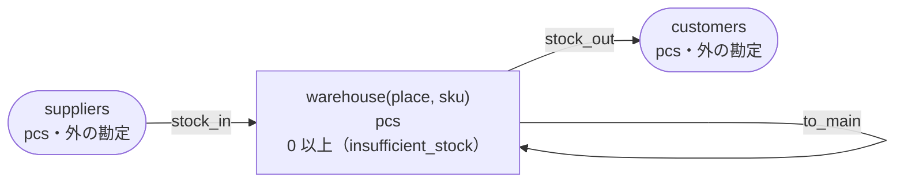

<!-- `chobo doc tests/books/to_itself.book --lang ja` の出力です。手で編集しないでください。 -->

# to_itself v1

Moving stock between warehouses

`chobo doc` が `tests/books/to_itself.book` から作ったページ。勘定ごとに残高を持ち、残高は入った量から出た量を引いたもの。どの振替も勘定の下限と上限を守り、守れない振替は、その境界に付けた名前で断られて、どの移動も行われない。振替には、すぐに動かすもの（`do`）と、動かす量をまず押さえるもの（`hold`）がある。押さえた分は、あとで確定される（`post`。全部か一部）か、取り消される（`void`）か、有効期限で切れる。

## 勘定

| 勘定 | 分け方 | 単位 | 境界 | 説明 |
|---|---|---|---|---|
| `warehouse` | `place` と `sku` ごと | pcs | 0 以上。下回る振替は `insufficient_stock` で断る |  |
| `suppliers` | 一つだけ | pcs | 外の勘定。境界は無く、マイナスにもなる |  |
| `customers` | 一つだけ | pcs | 外の勘定。境界は無く、マイナスにもなる |  |

## 勘定のあいだの流れ



四角は勘定で、矢印は振替の移動。角の丸い四角は外の勘定で、境界を持たない。破線の矢印は仮押さえの振替で、まず押さえ、確定したときに動く。

## 振替

### stock_in

- 移動: `suppliers` から `warehouse(place, sku)` へ `qty`。
- キー: `slip` ごとに一度だけ動く。同じ呼び出しの二度目は何もせず、`done_before` を返す。キーが同じで `place`、`sku`、`qty` のどれかが違う二度目の呼び出しは、`key_conflict` で断られる。
- すぐに動かす（`do`）。

| 操作 | 断られうる理由 | いつ |
|---|---|---|
| `stock_in.do` | `key_conflict` | `slip` が同じで、ほかの引数が違う呼び出しが、前に済んでいる |

<details><summary>断られる例</summary>

#### stock_in.do: key_conflict

```text
 1  stock_in.do(slip: slip-1, place: place-2, sku: sku-3, qty: 1)  通る
 2  stock_in.do(slip: slip-1, place: place-2, sku: sku-3, qty: 2)  key_conflict で断られる
```

</details>

### move_stock

- 移動: `warehouse(from_place, sku)` から `warehouse(to_place, sku)` へ `qty`。
- キー: `slip` ごとに一度だけ動く。同じ呼び出しの二度目は何もせず、`done_before` を返す。キーが同じで `from_place`、`to_place`、`sku`、`qty` のどれかが違う二度目の呼び出しは、`key_conflict` で断られる。
- すぐに動かす（`do`）。

| 操作 | 断られうる理由 | いつ |
|---|---|---|
| `move_stock.do` | `insufficient_stock` | `warehouse(from_place, sku)` が 0 を下回る |
| `move_stock.do` | `key_conflict` | `slip` が同じで、ほかの引数が違う呼び出しが、前に済んでいる |
| `move_stock.do` | `already_refused` | `slip` が同じ呼び出しが、前に境界で断られている。境界で断られたキーは、あとで足りるようになっても通らない |
| `move_stock.do` | `same_account` | 移動の元と先が同じ勘定になる |

<details><summary>断られる例</summary>

#### move_stock.do: insufficient_stock

```text
 1  move_stock.do(slip: slip-1, from_place: from_place-2, to_place: to_place-3, sku: sku-4, qty: 1)  insufficient_stock で断られる（1 つ目の移動が warehouse(from_place-2, sku-4) から 1 を取ろうとしたときの残高は、確定 0、出ていく仮押さえ 0）
```

#### move_stock.do: key_conflict

```text
 1  stock_in.do(slip: slip-1, place: from_place-2, sku: sku-3, qty: 1)                               通る
 2  move_stock.do(slip: slip-4, from_place: from_place-2, to_place: to_place-5, sku: sku-3, qty: 1)  通る
 3  move_stock.do(slip: slip-4, from_place: from_place-2, to_place: to_place-5, sku: sku-3, qty: 2)  key_conflict で断られる
```

#### move_stock.do: already_refused

```text
 1  move_stock.do(slip: slip-1, from_place: from_place-2, to_place: to_place-3, sku: sku-4, qty: 1)  insufficient_stock で断られる（1 つ目の移動が warehouse(from_place-2, sku-4) から 1 を取ろうとしたときの残高は、確定 0、出ていく仮押さえ 0）
 2  move_stock.do(slip: slip-1, from_place: from_place-2, to_place: to_place-3, sku: sku-4, qty: 1)  already_refused で断られる
```

#### move_stock.do: same_account

```text
 1  move_stock.do(slip: slip-1, from_place: from_place-2, to_place: from_place-2, sku: sku-3, qty: 1)  same_account で断られる
```

</details>

### to_main

- 移動: `warehouse(from_place, sku)` から `warehouse("main", sku)` へ `qty`。
- キー: `slip` ごとに一度だけ動く。同じ呼び出しの二度目は何もせず、`done_before` を返す。キーが同じで `from_place`、`sku`、`qty` のどれかが違う二度目の呼び出しは、`key_conflict` で断られる。
- すぐに動かす（`do`）。

| 操作 | 断られうる理由 | いつ |
|---|---|---|
| `to_main.do` | `insufficient_stock` | `warehouse(from_place, sku)` が 0 を下回る |
| `to_main.do` | `key_conflict` | `slip` が同じで、ほかの引数が違う呼び出しが、前に済んでいる |
| `to_main.do` | `already_refused` | `slip` が同じ呼び出しが、前に境界で断られている。境界で断られたキーは、あとで足りるようになっても通らない |
| `to_main.do` | `same_account` | 移動の元と先が同じ勘定になる |

<details><summary>断られる例</summary>

#### to_main.do: insufficient_stock

```text
 1  to_main.do(slip: slip-1, from_place: from_place-2, sku: sku-3, qty: 1)  insufficient_stock で断られる（1 つ目の移動が warehouse(from_place-2, sku-3) から 1 を取ろうとしたときの残高は、確定 0、出ていく仮押さえ 0）
```

#### to_main.do: key_conflict

```text
 1  stock_in.do(slip: slip-1, place: from_place-2, sku: sku-3, qty: 1)      通る
 2  to_main.do(slip: slip-4, from_place: from_place-2, sku: sku-3, qty: 1)  通る
 3  to_main.do(slip: slip-4, from_place: from_place-2, sku: sku-3, qty: 2)  key_conflict で断られる
```

#### to_main.do: already_refused

```text
 1  to_main.do(slip: slip-1, from_place: from_place-2, sku: sku-3, qty: 1)  insufficient_stock で断られる（1 つ目の移動が warehouse(from_place-2, sku-3) から 1 を取ろうとしたときの残高は、確定 0、出ていく仮押さえ 0）
 2  to_main.do(slip: slip-1, from_place: from_place-2, sku: sku-3, qty: 1)  already_refused で断られる
```

#### to_main.do: same_account

```text
 1  to_main.do(slip: slip-1, from_place: main, sku: sku-2, qty: 1)  same_account で断られる
```

</details>

### stock_out

- 移動: `warehouse(place, sku)` から `customers` へ `qty`。
- キー: `slip` ごとに一度だけ動く。同じ呼び出しの二度目は何もせず、`done_before` を返す。キーが同じで `place`、`sku`、`qty` のどれかが違う二度目の呼び出しは、`key_conflict` で断られる。
- すぐに動かす（`do`）。

| 操作 | 断られうる理由 | いつ |
|---|---|---|
| `stock_out.do` | `insufficient_stock` | `warehouse(place, sku)` が 0 を下回る |
| `stock_out.do` | `key_conflict` | `slip` が同じで、ほかの引数が違う呼び出しが、前に済んでいる |
| `stock_out.do` | `already_refused` | `slip` が同じ呼び出しが、前に境界で断られている。境界で断られたキーは、あとで足りるようになっても通らない |

<details><summary>断られる例</summary>

#### stock_out.do: insufficient_stock

```text
 1  stock_out.do(slip: slip-1, place: place-2, sku: sku-3, qty: 1)  insufficient_stock で断られる（1 つ目の移動が warehouse(place-2, sku-3) から 1 を取ろうとしたときの残高は、確定 0、出ていく仮押さえ 0）
```

#### stock_out.do: key_conflict

```text
 1  stock_in.do(slip: slip-1, place: place-2, sku: sku-3, qty: 1)   通る
 2  stock_out.do(slip: slip-4, place: place-2, sku: sku-3, qty: 1)  通る
 3  stock_out.do(slip: slip-4, place: place-2, sku: sku-3, qty: 2)  key_conflict で断られる
```

#### stock_out.do: already_refused

```text
 1  stock_out.do(slip: slip-1, place: place-2, sku: sku-3, qty: 1)  insufficient_stock で断られる（1 つ目の移動が warehouse(place-2, sku-3) から 1 を取ろうとしたときの残高は、確定 0、出ていく仮押さえ 0）
 2  stock_out.do(slip: slip-1, place: place-2, sku: sku-3, qty: 1)  already_refused で断られる
```

</details>

## シナリオ

`chobo scenarios` が帳簿から作ったシナリオ 25 本。境界の手前・ちょうど・超える、同じキーの二度目、仮押さえの終わり方、二つの呼び出し元が同時に最後の一つを取りに来るもの、などがある。どれも参照インタプリタで流したもので、ステップごとに、そのあとの残高を載せている。残高は確定した量で、仮押さえがあれば、その量を括弧の中に添えている。

<details><summary>1. 境界: move_stock.do が warehouse(from_place, sku) を 1 まで減らす（<code>at least 0</code> の 1 つ手前）</summary>

| # | 操作 | 結果 | warehouse(from_place-2, sku-3) | warehouse(to_place-5, sku-3) | suppliers |
|---|---|---|---|---|---|
| 1 | stock_in.do(slip: slip-1, place: from_place-2, sku: sku-3, qty: 2) | 通る | 2 | 0 | -2 |
| 2 | move_stock.do(slip: slip-4, from_place: from_place-2, to_place: to_place-5, sku: sku-3, qty: 1) | 通る | 1 | 1 | -2 |

</details>

<details><summary>2. 境界: move_stock.do が warehouse(from_place, sku) をちょうど 0 まで減らす（<code>at least 0</code> ちょうど）</summary>

| # | 操作 | 結果 | warehouse(from_place-2, sku-3) | warehouse(to_place-5, sku-3) | suppliers |
|---|---|---|---|---|---|
| 1 | stock_in.do(slip: slip-1, place: from_place-2, sku: sku-3, qty: 2) | 通る | 2 | 0 | -2 |
| 2 | move_stock.do(slip: slip-4, from_place: from_place-2, to_place: to_place-5, sku: sku-3, qty: 2) | 通る | 0 | 2 | -2 |

</details>

<details><summary>3. 境界: move_stock.do は warehouse(from_place, sku) を -1 まで減らすので断られる（<code>at least 0</code> を割る）</summary>

| # | 操作 | 結果 | warehouse(from_place-2, sku-3) | warehouse(to_place-5, sku-3) | suppliers |
|---|---|---|---|---|---|
| 1 | stock_in.do(slip: slip-1, place: from_place-2, sku: sku-3, qty: 2) | 通る | 2 | 0 | -2 |
| 2 | move_stock.do(slip: slip-4, from_place: from_place-2, to_place: to_place-5, sku: sku-3, qty: 3) | insufficient_stock で断られる | 2 | 0 | -2 |

</details>

<details><summary>4. 境界: to_main.do が warehouse(from_place, sku) を 1 まで減らす（<code>at least 0</code> の 1 つ手前）</summary>

| # | 操作 | 結果 | warehouse(from_place-2, sku-3) | warehouse(main, sku-3) | suppliers |
|---|---|---|---|---|---|
| 1 | stock_in.do(slip: slip-1, place: from_place-2, sku: sku-3, qty: 2) | 通る | 2 | 0 | -2 |
| 2 | to_main.do(slip: slip-4, from_place: from_place-2, sku: sku-3, qty: 1) | 通る | 1 | 1 | -2 |

</details>

<details><summary>5. 境界: to_main.do が warehouse(from_place, sku) をちょうど 0 まで減らす（<code>at least 0</code> ちょうど）</summary>

| # | 操作 | 結果 | warehouse(from_place-2, sku-3) | warehouse(main, sku-3) | suppliers |
|---|---|---|---|---|---|
| 1 | stock_in.do(slip: slip-1, place: from_place-2, sku: sku-3, qty: 2) | 通る | 2 | 0 | -2 |
| 2 | to_main.do(slip: slip-4, from_place: from_place-2, sku: sku-3, qty: 2) | 通る | 0 | 2 | -2 |

</details>

<details><summary>6. 境界: to_main.do は warehouse(from_place, sku) を -1 まで減らすので断られる（<code>at least 0</code> を割る）</summary>

| # | 操作 | 結果 | warehouse(from_place-2, sku-3) | warehouse(main, sku-3) | suppliers |
|---|---|---|---|---|---|
| 1 | stock_in.do(slip: slip-1, place: from_place-2, sku: sku-3, qty: 2) | 通る | 2 | 0 | -2 |
| 2 | to_main.do(slip: slip-4, from_place: from_place-2, sku: sku-3, qty: 3) | insufficient_stock で断られる | 2 | 0 | -2 |

</details>

<details><summary>7. 境界: stock_out.do が warehouse(place, sku) を 1 まで減らす（<code>at least 0</code> の 1 つ手前）</summary>

| # | 操作 | 結果 | warehouse(place-2, sku-3) | suppliers | customers |
|---|---|---|---|---|---|
| 1 | stock_in.do(slip: slip-1, place: place-2, sku: sku-3, qty: 2) | 通る | 2 | -2 | 0 |
| 2 | stock_out.do(slip: slip-4, place: place-2, sku: sku-3, qty: 1) | 通る | 1 | -2 | 1 |

</details>

<details><summary>8. 境界: stock_out.do が warehouse(place, sku) をちょうど 0 まで減らす（<code>at least 0</code> ちょうど）</summary>

| # | 操作 | 結果 | warehouse(place-2, sku-3) | suppliers | customers |
|---|---|---|---|---|---|
| 1 | stock_in.do(slip: slip-1, place: place-2, sku: sku-3, qty: 2) | 通る | 2 | -2 | 0 |
| 2 | stock_out.do(slip: slip-4, place: place-2, sku: sku-3, qty: 2) | 通る | 0 | -2 | 2 |

</details>

<details><summary>9. 境界: stock_out.do は warehouse(place, sku) を -1 まで減らすので断られる（<code>at least 0</code> を割る）</summary>

| # | 操作 | 結果 | warehouse(place-2, sku-3) | suppliers | customers |
|---|---|---|---|---|---|
| 1 | stock_in.do(slip: slip-1, place: place-2, sku: sku-3, qty: 2) | 通る | 2 | -2 | 0 |
| 2 | stock_out.do(slip: slip-4, place: place-2, sku: sku-3, qty: 3) | insufficient_stock で断られる | 2 | -2 | 0 |

</details>

<details><summary>10. キー: stock_in.do を同じ引数で二度呼ぶ</summary>

| # | 操作 | 結果 | warehouse(place-2, sku-3) | suppliers |
|---|---|---|---|---|
| 1 | stock_in.do(slip: slip-1, place: place-2, sku: sku-3, qty: 1) | 通る | 1 | -1 |
| 2 | stock_in.do(slip: slip-1, place: place-2, sku: sku-3, qty: 1) | done_before（前に済んでいる） | 1 | -1 |

</details>

<details><summary>11. キー: stock_in.do を qty だけ変えてもう一度呼ぶ</summary>

| # | 操作 | 結果 | warehouse(place-2, sku-3) | suppliers |
|---|---|---|---|---|
| 1 | stock_in.do(slip: slip-1, place: place-2, sku: sku-3, qty: 1) | 通る | 1 | -1 |
| 2 | stock_in.do(slip: slip-1, place: place-2, sku: sku-3, qty: 2) | key_conflict で断られる | 1 | -1 |

</details>

<details><summary>12. キー: move_stock.do を同じ引数で二度呼ぶ</summary>

| # | 操作 | 結果 | warehouse(from_place-2, sku-3) | warehouse(to_place-5, sku-3) | suppliers |
|---|---|---|---|---|---|
| 1 | stock_in.do(slip: slip-1, place: from_place-2, sku: sku-3, qty: 1) | 通る | 1 | 0 | -1 |
| 2 | move_stock.do(slip: slip-4, from_place: from_place-2, to_place: to_place-5, sku: sku-3, qty: 1) | 通る | 0 | 1 | -1 |
| 3 | move_stock.do(slip: slip-4, from_place: from_place-2, to_place: to_place-5, sku: sku-3, qty: 1) | done_before（前に済んでいる） | 0 | 1 | -1 |

</details>

<details><summary>13. キー: move_stock.do を qty だけ変えてもう一度呼ぶ</summary>

| # | 操作 | 結果 | warehouse(from_place-2, sku-3) | warehouse(to_place-5, sku-3) | suppliers |
|---|---|---|---|---|---|
| 1 | stock_in.do(slip: slip-1, place: from_place-2, sku: sku-3, qty: 1) | 通る | 1 | 0 | -1 |
| 2 | move_stock.do(slip: slip-4, from_place: from_place-2, to_place: to_place-5, sku: sku-3, qty: 1) | 通る | 0 | 1 | -1 |
| 3 | move_stock.do(slip: slip-4, from_place: from_place-2, to_place: to_place-5, sku: sku-3, qty: 2) | key_conflict で断られる | 0 | 1 | -1 |

</details>

<details><summary>14. キー: move_stock.do が insufficient_stock で断られたあと、同じ引数ですぐにもう一度呼び、warehouse(from_place, sku) が足りるようになってからもう一度呼ぶ</summary>

| # | 操作 | 結果 | warehouse(from_place-2, sku-4) | warehouse(to_place-3, sku-4) | suppliers |
|---|---|---|---|---|---|
| 1 | move_stock.do(slip: slip-1, from_place: from_place-2, to_place: to_place-3, sku: sku-4, qty: 1) | insufficient_stock で断られる | 0 | 0 | 0 |
| 2 | move_stock.do(slip: slip-1, from_place: from_place-2, to_place: to_place-3, sku: sku-4, qty: 1) | already_refused で断られる | 0 | 0 | 0 |
| 3 | stock_in.do(slip: slip-5, place: from_place-2, sku: sku-4, qty: 1) | 通る | 1 | 0 | -1 |
| 4 | move_stock.do(slip: slip-1, from_place: from_place-2, to_place: to_place-3, sku: sku-4, qty: 1) | already_refused で断られる | 1 | 0 | -1 |

</details>

<details><summary>15. キー: to_main.do を同じ引数で二度呼ぶ</summary>

| # | 操作 | 結果 | warehouse(from_place-2, sku-3) | warehouse(main, sku-3) | suppliers |
|---|---|---|---|---|---|
| 1 | stock_in.do(slip: slip-1, place: from_place-2, sku: sku-3, qty: 1) | 通る | 1 | 0 | -1 |
| 2 | to_main.do(slip: slip-4, from_place: from_place-2, sku: sku-3, qty: 1) | 通る | 0 | 1 | -1 |
| 3 | to_main.do(slip: slip-4, from_place: from_place-2, sku: sku-3, qty: 1) | done_before（前に済んでいる） | 0 | 1 | -1 |

</details>

<details><summary>16. キー: to_main.do を qty だけ変えてもう一度呼ぶ</summary>

| # | 操作 | 結果 | warehouse(from_place-2, sku-3) | warehouse(main, sku-3) | suppliers |
|---|---|---|---|---|---|
| 1 | stock_in.do(slip: slip-1, place: from_place-2, sku: sku-3, qty: 1) | 通る | 1 | 0 | -1 |
| 2 | to_main.do(slip: slip-4, from_place: from_place-2, sku: sku-3, qty: 1) | 通る | 0 | 1 | -1 |
| 3 | to_main.do(slip: slip-4, from_place: from_place-2, sku: sku-3, qty: 2) | key_conflict で断られる | 0 | 1 | -1 |

</details>

<details><summary>17. キー: to_main.do が insufficient_stock で断られたあと、同じ引数ですぐにもう一度呼び、warehouse(from_place, sku) が足りるようになってからもう一度呼ぶ</summary>

| # | 操作 | 結果 | warehouse(from_place-2, sku-3) | warehouse(main, sku-3) | suppliers |
|---|---|---|---|---|---|
| 1 | to_main.do(slip: slip-1, from_place: from_place-2, sku: sku-3, qty: 1) | insufficient_stock で断られる | 0 | 0 | 0 |
| 2 | to_main.do(slip: slip-1, from_place: from_place-2, sku: sku-3, qty: 1) | already_refused で断られる | 0 | 0 | 0 |
| 3 | stock_in.do(slip: slip-4, place: from_place-2, sku: sku-3, qty: 1) | 通る | 1 | 0 | -1 |
| 4 | to_main.do(slip: slip-1, from_place: from_place-2, sku: sku-3, qty: 1) | already_refused で断られる | 1 | 0 | -1 |

</details>

<details><summary>18. キー: stock_out.do を同じ引数で二度呼ぶ</summary>

| # | 操作 | 結果 | warehouse(place-2, sku-3) | suppliers | customers |
|---|---|---|---|---|---|
| 1 | stock_in.do(slip: slip-1, place: place-2, sku: sku-3, qty: 1) | 通る | 1 | -1 | 0 |
| 2 | stock_out.do(slip: slip-4, place: place-2, sku: sku-3, qty: 1) | 通る | 0 | -1 | 1 |
| 3 | stock_out.do(slip: slip-4, place: place-2, sku: sku-3, qty: 1) | done_before（前に済んでいる） | 0 | -1 | 1 |

</details>

<details><summary>19. キー: stock_out.do を qty だけ変えてもう一度呼ぶ</summary>

| # | 操作 | 結果 | warehouse(place-2, sku-3) | suppliers | customers |
|---|---|---|---|---|---|
| 1 | stock_in.do(slip: slip-1, place: place-2, sku: sku-3, qty: 1) | 通る | 1 | -1 | 0 |
| 2 | stock_out.do(slip: slip-4, place: place-2, sku: sku-3, qty: 1) | 通る | 0 | -1 | 1 |
| 3 | stock_out.do(slip: slip-4, place: place-2, sku: sku-3, qty: 2) | key_conflict で断られる | 0 | -1 | 1 |

</details>

<details><summary>20. キー: stock_out.do が insufficient_stock で断られたあと、同じ引数ですぐにもう一度呼び、warehouse(place, sku) が足りるようになってからもう一度呼ぶ</summary>

| # | 操作 | 結果 | warehouse(place-2, sku-3) | suppliers | customers |
|---|---|---|---|---|---|
| 1 | stock_out.do(slip: slip-1, place: place-2, sku: sku-3, qty: 1) | insufficient_stock で断られる | 0 | 0 | 0 |
| 2 | stock_out.do(slip: slip-1, place: place-2, sku: sku-3, qty: 1) | already_refused で断られる | 0 | 0 | 0 |
| 3 | stock_in.do(slip: slip-4, place: place-2, sku: sku-3, qty: 1) | 通る | 1 | -1 | 0 |
| 4 | stock_out.do(slip: slip-1, place: place-2, sku: sku-3, qty: 1) | already_refused で断られる | 1 | -1 | 0 |

</details>

<details><summary>21. 同時: 二つの呼び出し元が move_stock.do で warehouse(from_place, sku) の最後の 1 を取り合う</summary>

同時の操作の順序によって、結果は 2 通りある。

結果 1:

| # | 操作 | 結果 | warehouse(from_place-2, sku-3) | warehouse(to_place-5, sku-3) | warehouse(to_place-7, sku-3) | suppliers |
|---|---|---|---|---|---|---|
| 1 | stock_in.do(slip: slip-1, place: from_place-2, sku: sku-3, qty: 1) | 通る | 1 | 0 | 0 | -1 |
| 2 | together<br>呼び出し元 1: move_stock.do(slip: slip-4, from_place: from_place-2, to_place: to_place-5, sku: sku-3, qty: 1)<br>呼び出し元 2: move_stock.do(slip: slip-6, from_place: from_place-2, to_place: to_place-7, sku: sku-3, qty: 1) | <br>通る<br>insufficient_stock で断られる | 0 | 1 | 0 | -1 |

結果 2:

| # | 操作 | 結果 | warehouse(from_place-2, sku-3) | warehouse(to_place-5, sku-3) | warehouse(to_place-7, sku-3) | suppliers |
|---|---|---|---|---|---|---|
| 1 | stock_in.do(slip: slip-1, place: from_place-2, sku: sku-3, qty: 1) | 通る | 1 | 0 | 0 | -1 |
| 2 | together<br>呼び出し元 1: move_stock.do(slip: slip-4, from_place: from_place-2, to_place: to_place-5, sku: sku-3, qty: 1)<br>呼び出し元 2: move_stock.do(slip: slip-6, from_place: from_place-2, to_place: to_place-7, sku: sku-3, qty: 1) | <br>insufficient_stock で断られる<br>通る | 0 | 0 | 1 | -1 |

</details>

<details><summary>22. 同時: 二つの呼び出し元が to_main.do で warehouse(from_place, sku) の最後の 1 を取り合う</summary>

同時の操作の順序によって、結果は 2 通りある。

結果 1:

| # | 操作 | 結果 | warehouse(from_place-2, sku-3) | warehouse(main, sku-3) | suppliers |
|---|---|---|---|---|---|
| 1 | stock_in.do(slip: slip-1, place: from_place-2, sku: sku-3, qty: 1) | 通る | 1 | 0 | -1 |
| 2 | together<br>呼び出し元 1: to_main.do(slip: slip-4, from_place: from_place-2, sku: sku-3, qty: 1)<br>呼び出し元 2: to_main.do(slip: slip-5, from_place: from_place-2, sku: sku-3, qty: 1) | <br>通る<br>insufficient_stock で断られる | 0 | 1 | -1 |

結果 2:

| # | 操作 | 結果 | warehouse(from_place-2, sku-3) | warehouse(main, sku-3) | suppliers |
|---|---|---|---|---|---|
| 1 | stock_in.do(slip: slip-1, place: from_place-2, sku: sku-3, qty: 1) | 通る | 1 | 0 | -1 |
| 2 | together<br>呼び出し元 1: to_main.do(slip: slip-4, from_place: from_place-2, sku: sku-3, qty: 1)<br>呼び出し元 2: to_main.do(slip: slip-5, from_place: from_place-2, sku: sku-3, qty: 1) | <br>insufficient_stock で断られる<br>通る | 0 | 1 | -1 |

</details>

<details><summary>23. 同時: 二つの呼び出し元が stock_out.do で warehouse(place, sku) の最後の 1 を取り合う</summary>

同時の操作の順序によって、結果は 2 通りある。

結果 1:

| # | 操作 | 結果 | warehouse(place-2, sku-3) | suppliers | customers |
|---|---|---|---|---|---|
| 1 | stock_in.do(slip: slip-1, place: place-2, sku: sku-3, qty: 1) | 通る | 1 | -1 | 0 |
| 2 | together<br>呼び出し元 1: stock_out.do(slip: slip-4, place: place-2, sku: sku-3, qty: 1)<br>呼び出し元 2: stock_out.do(slip: slip-5, place: place-2, sku: sku-3, qty: 1) | <br>通る<br>insufficient_stock で断られる | 0 | -1 | 1 |

結果 2:

| # | 操作 | 結果 | warehouse(place-2, sku-3) | suppliers | customers |
|---|---|---|---|---|---|
| 1 | stock_in.do(slip: slip-1, place: place-2, sku: sku-3, qty: 1) | 通る | 1 | -1 | 0 |
| 2 | together<br>呼び出し元 1: stock_out.do(slip: slip-4, place: place-2, sku: sku-3, qty: 1)<br>呼び出し元 2: stock_out.do(slip: slip-5, place: place-2, sku: sku-3, qty: 1) | <br>insufficient_stock で断られる<br>通る | 0 | -1 | 1 |

</details>

<details><summary>24. 同じ勘定: move_stock.do が warehouse(from_place, sku) から warehouse(to_place, sku) へ動かそうとし、元と先が同じ勘定になる</summary>

| # | 操作 | 結果 | warehouse(from_place-2, sku-3) |
|---|---|---|---|
| 1 | move_stock.do(slip: slip-1, from_place: from_place-2, to_place: from_place-2, sku: sku-3, qty: 1) | same_account で断られる | 0 |

</details>

<details><summary>25. 同じ勘定: to_main.do が warehouse(from_place, sku) から warehouse(&quot;main&quot;, sku) へ動かそうとし、元と先が同じ勘定になる</summary>

| # | 操作 | 結果 | warehouse(main, sku-2) |
|---|---|---|---|
| 1 | to_main.do(slip: slip-1, from_place: main, sku: sku-2, qty: 1) | same_account で断られる | 0 |

</details>

