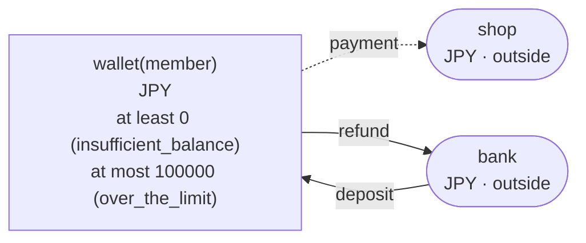
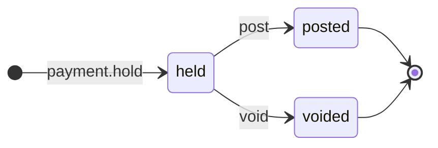

<!-- The output of `chobo doc tests/books/wallet.book`. Do not edit by hand. -->

# wallet v1

A wallet for each member. A deposit from the bank adds to it, a payment holds the amount while it goes through, and a refund returns it to the bank

`tests/books/wallet.book`, as `chobo doc` writes it. Each account keeps a balance: what came in, less what went out. Every transfer keeps the bounds of the accounts: one that would break a bound is refused with the name the book gives that bound, and nothing of it moves. A transfer either moves at once (`do`), or first holds what it moves (`hold`); a hold is then posted (`post`, all of it or part), voided (`void`), or expires.

## Accounts

| Account | One for each | Unit | Bounds | What it is |
|---|---|---|---|---|
| `wallet` | `member` | JPY | at least 0; a transfer that would go below is refused with `insufficient_balance`<br>at most 100000; a transfer that would go above is refused with `over_the_limit` |  |
| `bank` | one account | JPY | outside the book: no bounds, and it may go below 0 |  |
| `shop` | one account | JPY | outside the book: no bounds, and it may go below 0 |  |

## How things move



A box is an account, and an arrow a move of a transfer. A rounded box is an account outside the book, which has no bounds. A dashed arrow belongs to a transfer that holds first, and moves when the hold is posted.

## Transfers

### deposit

- Moves `amount` from `bank` to `wallet(member)`.
- Key: once per `deposit_id`. The same call again does nothing, and answers `done_before`; one that differs only in `member` or `amount` is refused with `key_conflict`.
- Moves at once (`do`).

| Operation | May be refused with | When |
|---|---|---|
| `deposit.do` | `over_the_limit` | `wallet(member)` would go above 100000 |
| `deposit.do` | `key_conflict` | a call with the same `deposit_id` and other arguments came before |
| `deposit.do` | `already_refused` | a call with the same `deposit_id` was refused by a bound before; a key a bound refused stays refused, even once there is enough |

<details><summary>How each refusal comes about</summary>

#### deposit.do: over_the_limit

```text
 1  deposit.do(deposit_id: deposit_id-1, member: member-2, amount: 100000)  done
 2  deposit.do(deposit_id: deposit_id-3, member: member-2, amount: 1)       refused: over_the_limit (move 1 puts 1 into wallet(member-2): posted 100000, held in 0)
```

#### deposit.do: key_conflict

```text
 1  deposit.do(deposit_id: deposit_id-1, member: member-2, amount: 1)  done
 2  deposit.do(deposit_id: deposit_id-1, member: member-2, amount: 2)  refused: key_conflict
```

#### deposit.do: already_refused

```text
 1  deposit.do(deposit_id: deposit_id-1, member: member-2, amount: 100000)  done
 2  deposit.do(deposit_id: deposit_id-3, member: member-2, amount: 1)       refused: over_the_limit (move 1 puts 1 into wallet(member-2): posted 100000, held in 0)
 3  deposit.do(deposit_id: deposit_id-3, member: member-2, amount: 1)       refused: already_refused
```

</details>

### payment

posted when the order ships, voided when it is cancelled; only the caller ends the hold

- Moves `amount` from `wallet(member)` to `shop`.
- Key: once per `order`. The same call again does nothing, and answers `done_before`; one that differs only in `member` or `amount` is refused with `key_conflict`; holding again with the same key after the hold has ended answers `done_before`, and holds nothing.
- Holds first: the caller posts or voids the hold. It never expires, and stays held until one of them comes.



| The hold | post | void |
|---|---|---|
| held | posts it: the amounts given, or all of it, and the rest goes back; more than it holds is refused with `over_hold` | voids it: what it holds goes back |
| posted | `done_before` with the same amounts; refused with `key_conflict` with others | refused with `already_posted` |
| voided | refused with `already_voided` | `done_before` |
| no hold with the key | refused with `no_such_hold` | refused with `no_such_hold` |

| Operation | May be refused with | When |
|---|---|---|
| `payment.hold` | `insufficient_balance` | `wallet(member)` would go below 0 |
| `payment.hold` | `key_conflict` | a call with the same `order` and other arguments came before |
| `payment.hold` | `already_refused` | a call with the same `order` was refused by a bound before; a key a bound refused stays refused, even once there is enough |
| `payment.post` | `key_conflict` | the hold was posted before, for other amounts |
| `payment.post` | `already_voided` | the hold is voided already |
| `payment.post` | `over_hold` | more than the hold holds |
| `payment.post` | `no_such_hold` | there is no hold with that `order` |
| `payment.void` | `already_posted` | the hold is posted already |
| `payment.void` | `no_such_hold` | there is no hold with that `order` |

<details><summary>How each refusal comes about</summary>

#### payment.hold: insufficient_balance

```text
 1  payment.hold(order: order-1, member: member-2, amount: 1)  refused: insufficient_balance (move 1 takes 1 from wallet(member-2): posted 0, held out 0)
```

#### payment.hold: key_conflict

```text
 1  deposit.do(deposit_id: deposit_id-1, member: member-2, amount: 1)  done
 2  payment.hold(order: order-3, member: member-2, amount: 1)          done
 3  payment.hold(order: order-3, member: member-2, amount: 2)          refused: key_conflict
```

#### payment.hold: already_refused

```text
 1  payment.hold(order: order-1, member: member-2, amount: 1)  refused: insufficient_balance (move 1 takes 1 from wallet(member-2): posted 0, held out 0)
 2  payment.hold(order: order-1, member: member-2, amount: 1)  refused: already_refused
```

#### payment.post: key_conflict

```text
 1  deposit.do(deposit_id: deposit_id-1, member: member-2, amount: 2)  done
 2  payment.hold(order: order-3, member: member-2, amount: 2)          done
 3  payment.post(order: order-3)                                       done
 4  payment.post(order: order-3, amount: 1)                            refused: key_conflict
```

#### payment.post: already_voided

```text
 1  deposit.do(deposit_id: deposit_id-1, member: member-2, amount: 2)  done
 2  payment.hold(order: order-3, member: member-2, amount: 2)          done
 3  payment.void(order: order-3)                                       done
 4  payment.post(order: order-3)                                       refused: already_voided
```

#### payment.post: over_hold

```text
 1  deposit.do(deposit_id: deposit_id-1, member: member-2, amount: 2)  done
 2  payment.hold(order: order-3, member: member-2, amount: 2)          done
 3  payment.post(order: order-3, amount: 3)                            refused: over_hold
```

#### payment.post: no_such_hold

```text
 1  payment.post(order: order-1)  refused: no_such_hold
```

#### payment.void: already_posted

```text
 1  deposit.do(deposit_id: deposit_id-1, member: member-2, amount: 2)  done
 2  payment.hold(order: order-3, member: member-2, amount: 2)          done
 3  payment.post(order: order-3)                                       done
 4  payment.void(order: order-3)                                       refused: already_posted
```

#### payment.void: no_such_hold

```text
 1  payment.void(order: order-1)  refused: no_such_hold
```

</details>

### refund

- Moves `amount` from `wallet(member)` to `bank`.
- Key: once per `refund_id`. The same call again does nothing, and answers `done_before`; one that differs only in `member` or `amount` is refused with `key_conflict`.
- Moves at once (`do`).

| Operation | May be refused with | When |
|---|---|---|
| `refund.do` | `insufficient_balance` | `wallet(member)` would go below 0 |
| `refund.do` | `key_conflict` | a call with the same `refund_id` and other arguments came before |
| `refund.do` | `already_refused` | a call with the same `refund_id` was refused by a bound before; a key a bound refused stays refused, even once there is enough |

<details><summary>How each refusal comes about</summary>

#### refund.do: insufficient_balance

```text
 1  refund.do(refund_id: refund_id-1, member: member-2, amount: 1)  refused: insufficient_balance (move 1 takes 1 from wallet(member-2): posted 0, held out 0)
```

#### refund.do: key_conflict

```text
 1  deposit.do(deposit_id: deposit_id-1, member: member-2, amount: 1)  done
 2  refund.do(refund_id: refund_id-3, member: member-2, amount: 1)     done
 3  refund.do(refund_id: refund_id-3, member: member-2, amount: 2)     refused: key_conflict
```

#### refund.do: already_refused

```text
 1  refund.do(refund_id: refund_id-1, member: member-2, amount: 1)  refused: insufficient_balance (move 1 takes 1 from wallet(member-2): posted 0, held out 0)
 2  refund.do(refund_id: refund_id-1, member: member-2, amount: 1)  refused: already_refused
```

</details>

## Scenarios

29 scenarios, which `chobo scenarios` makes from the book: among them each bound just before, at and past it, each key used twice, every way a hold ends, and two callers after the last of something at the same time. The reference interpreter ran each one; after each step come the balances it left. A balance is what is posted, with what is held in brackets.

<details><summary>1. bound: deposit.do fills wallet(member) to 99999, one below <code>at most 100000</code></summary>

| # | Operation | Result | wallet(member-2) | bank |
|---|---|---|---|---|
| 1 | deposit.do(deposit_id: deposit_id-1, member: member-2, amount: 99998) | done | 99998 | -99998 |
| 2 | deposit.do(deposit_id: deposit_id-3, member: member-2, amount: 1) | done | 99999 | -99999 |

</details>

<details><summary>2. bound: deposit.do fills wallet(member) to exactly 100000, its <code>at most 100000</code></summary>

| # | Operation | Result | wallet(member-2) | bank |
|---|---|---|---|---|
| 1 | deposit.do(deposit_id: deposit_id-1, member: member-2, amount: 99998) | done | 99998 | -99998 |
| 2 | deposit.do(deposit_id: deposit_id-3, member: member-2, amount: 2) | done | 100000 | -100000 |

</details>

<details><summary>3. bound: deposit.do would fill wallet(member) to 100001, past <code>at most 100000</code></summary>

| # | Operation | Result | wallet(member-2) | bank |
|---|---|---|---|---|
| 1 | deposit.do(deposit_id: deposit_id-1, member: member-2, amount: 99998) | done | 99998 | -99998 |
| 2 | deposit.do(deposit_id: deposit_id-3, member: member-2, amount: 3) | refused: over_the_limit | 99998 | -99998 |

</details>

<details><summary>4. bound: payment.hold takes wallet(member) to 1, one above <code>at least 0</code></summary>

| # | Operation | Result | wallet(member-2) | bank | shop |
|---|---|---|---|---|---|
| 1 | deposit.do(deposit_id: deposit_id-1, member: member-2, amount: 2) | done | 2 | -2 | 0 |
| 2 | payment.hold(order: order-3, member: member-2, amount: 1) | done | 2 (held out 1) | -2 | 0 (held in 1) |

</details>

<details><summary>5. bound: payment.hold takes wallet(member) to exactly 0, its <code>at least 0</code></summary>

| # | Operation | Result | wallet(member-2) | bank | shop |
|---|---|---|---|---|---|
| 1 | deposit.do(deposit_id: deposit_id-1, member: member-2, amount: 2) | done | 2 | -2 | 0 |
| 2 | payment.hold(order: order-3, member: member-2, amount: 2) | done | 2 (held out 2) | -2 | 0 (held in 2) |

</details>

<details><summary>6. bound: payment.hold would take wallet(member) to -1, below <code>at least 0</code></summary>

| # | Operation | Result | wallet(member-2) | bank | shop |
|---|---|---|---|---|---|
| 1 | deposit.do(deposit_id: deposit_id-1, member: member-2, amount: 2) | done | 2 | -2 | 0 |
| 2 | payment.hold(order: order-3, member: member-2, amount: 3) | refused: insufficient_balance | 2 | -2 | 0 |

</details>

<details><summary>7. bound: refund.do takes wallet(member) to 1, one above <code>at least 0</code></summary>

| # | Operation | Result | wallet(member-2) | bank |
|---|---|---|---|---|
| 1 | deposit.do(deposit_id: deposit_id-1, member: member-2, amount: 2) | done | 2 | -2 |
| 2 | refund.do(refund_id: refund_id-3, member: member-2, amount: 1) | done | 1 | -1 |

</details>

<details><summary>8. bound: refund.do takes wallet(member) to exactly 0, its <code>at least 0</code></summary>

| # | Operation | Result | wallet(member-2) | bank |
|---|---|---|---|---|
| 1 | deposit.do(deposit_id: deposit_id-1, member: member-2, amount: 2) | done | 2 | -2 |
| 2 | refund.do(refund_id: refund_id-3, member: member-2, amount: 2) | done | 0 | 0 |

</details>

<details><summary>9. bound: refund.do would take wallet(member) to -1, below <code>at least 0</code></summary>

| # | Operation | Result | wallet(member-2) | bank |
|---|---|---|---|---|
| 1 | deposit.do(deposit_id: deposit_id-1, member: member-2, amount: 2) | done | 2 | -2 |
| 2 | refund.do(refund_id: refund_id-3, member: member-2, amount: 3) | refused: insufficient_balance | 2 | -2 |

</details>

<details><summary>10. key: deposit.do twice with the same arguments</summary>

| # | Operation | Result | wallet(member-2) | bank |
|---|---|---|---|---|
| 1 | deposit.do(deposit_id: deposit_id-1, member: member-2, amount: 1) | done | 1 | -1 |
| 2 | deposit.do(deposit_id: deposit_id-1, member: member-2, amount: 1) | done_before | 1 | -1 |

</details>

<details><summary>11. key: deposit.do again with another amount</summary>

| # | Operation | Result | wallet(member-2) | bank |
|---|---|---|---|---|
| 1 | deposit.do(deposit_id: deposit_id-1, member: member-2, amount: 1) | done | 1 | -1 |
| 2 | deposit.do(deposit_id: deposit_id-1, member: member-2, amount: 2) | refused: key_conflict | 1 | -1 |

</details>

<details><summary>12. key: deposit.do refused with over_the_limit, then again</summary>

| # | Operation | Result | wallet(member-2) | bank |
|---|---|---|---|---|
| 1 | deposit.do(deposit_id: deposit_id-1, member: member-2, amount: 100000) | done | 100000 | -100000 |
| 2 | deposit.do(deposit_id: deposit_id-3, member: member-2, amount: 1) | refused: over_the_limit | 100000 | -100000 |
| 3 | deposit.do(deposit_id: deposit_id-3, member: member-2, amount: 1) | refused: already_refused | 100000 | -100000 |

</details>

<details><summary>13. key: payment.hold twice with the same arguments</summary>

| # | Operation | Result | wallet(member-2) | bank | shop |
|---|---|---|---|---|---|
| 1 | deposit.do(deposit_id: deposit_id-1, member: member-2, amount: 1) | done | 1 | -1 | 0 |
| 2 | payment.hold(order: order-3, member: member-2, amount: 1) | done | 1 (held out 1) | -1 | 0 (held in 1) |
| 3 | payment.hold(order: order-3, member: member-2, amount: 1) | done_before | 1 (held out 1) | -1 | 0 (held in 1) |

</details>

<details><summary>14. key: payment.hold again with another amount</summary>

| # | Operation | Result | wallet(member-2) | bank | shop |
|---|---|---|---|---|---|
| 1 | deposit.do(deposit_id: deposit_id-1, member: member-2, amount: 1) | done | 1 | -1 | 0 |
| 2 | payment.hold(order: order-3, member: member-2, amount: 1) | done | 1 (held out 1) | -1 | 0 (held in 1) |
| 3 | payment.hold(order: order-3, member: member-2, amount: 2) | refused: key_conflict | 1 (held out 1) | -1 | 0 (held in 1) |

</details>

<details><summary>15. key: payment.hold refused with insufficient_balance, then again, and again once wallet(member) has enough</summary>

| # | Operation | Result | wallet(member-2) | bank | shop |
|---|---|---|---|---|---|
| 1 | payment.hold(order: order-1, member: member-2, amount: 1) | refused: insufficient_balance | 0 | 0 | 0 |
| 2 | payment.hold(order: order-1, member: member-2, amount: 1) | refused: already_refused | 0 | 0 | 0 |
| 3 | deposit.do(deposit_id: deposit_id-3, member: member-2, amount: 1) | done | 1 | -1 | 0 |
| 4 | payment.hold(order: order-1, member: member-2, amount: 1) | refused: already_refused | 1 | -1 | 0 |

</details>

<details><summary>16. key: refund.do twice with the same arguments</summary>

| # | Operation | Result | wallet(member-2) | bank |
|---|---|---|---|---|
| 1 | deposit.do(deposit_id: deposit_id-1, member: member-2, amount: 1) | done | 1 | -1 |
| 2 | refund.do(refund_id: refund_id-3, member: member-2, amount: 1) | done | 0 | 0 |
| 3 | refund.do(refund_id: refund_id-3, member: member-2, amount: 1) | done_before | 0 | 0 |

</details>

<details><summary>17. key: refund.do again with another amount</summary>

| # | Operation | Result | wallet(member-2) | bank |
|---|---|---|---|---|
| 1 | deposit.do(deposit_id: deposit_id-1, member: member-2, amount: 1) | done | 1 | -1 |
| 2 | refund.do(refund_id: refund_id-3, member: member-2, amount: 1) | done | 0 | 0 |
| 3 | refund.do(refund_id: refund_id-3, member: member-2, amount: 2) | refused: key_conflict | 0 | 0 |

</details>

<details><summary>18. key: refund.do refused with insufficient_balance, then again, and again once wallet(member) has enough</summary>

| # | Operation | Result | wallet(member-2) | bank |
|---|---|---|---|---|
| 1 | refund.do(refund_id: refund_id-1, member: member-2, amount: 1) | refused: insufficient_balance | 0 | 0 |
| 2 | refund.do(refund_id: refund_id-1, member: member-2, amount: 1) | refused: already_refused | 0 | 0 |
| 3 | deposit.do(deposit_id: deposit_id-3, member: member-2, amount: 1) | done | 1 | -1 |
| 4 | refund.do(refund_id: refund_id-1, member: member-2, amount: 1) | refused: already_refused | 1 | -1 |

</details>

<details><summary>19. hold: payment posted in full</summary>

| # | Operation | Result | wallet(member-2) | bank | shop |
|---|---|---|---|---|---|
| 1 | deposit.do(deposit_id: deposit_id-1, member: member-2, amount: 2) | done | 2 | -2 | 0 |
| 2 | payment.hold(order: order-3, member: member-2, amount: 2) | done | 2 (held out 2) | -2 | 0 (held in 2) |
| 3 | payment.post(order: order-3) | done | 0 | -2 | 2 |

</details>

<details><summary>20. hold: payment posted in part</summary>

| # | Operation | Result | wallet(member-2) | bank | shop |
|---|---|---|---|---|---|
| 1 | deposit.do(deposit_id: deposit_id-1, member: member-2, amount: 2) | done | 2 | -2 | 0 |
| 2 | payment.hold(order: order-3, member: member-2, amount: 2) | done | 2 (held out 2) | -2 | 0 (held in 2) |
| 3 | payment.post(order: order-3, amount: 1) | done | 1 | -2 | 1 |

</details>

<details><summary>21. hold: payment voided</summary>

| # | Operation | Result | wallet(member-2) | bank | shop |
|---|---|---|---|---|---|
| 1 | deposit.do(deposit_id: deposit_id-1, member: member-2, amount: 2) | done | 2 | -2 | 0 |
| 2 | payment.hold(order: order-3, member: member-2, amount: 2) | done | 2 (held out 2) | -2 | 0 (held in 2) |
| 3 | payment.void(order: order-3) | done | 2 | -2 | 0 |

</details>

<details><summary>22. hold: payment posted, then voided</summary>

| # | Operation | Result | wallet(member-2) | bank | shop |
|---|---|---|---|---|---|
| 1 | deposit.do(deposit_id: deposit_id-1, member: member-2, amount: 2) | done | 2 | -2 | 0 |
| 2 | payment.hold(order: order-3, member: member-2, amount: 2) | done | 2 (held out 2) | -2 | 0 (held in 2) |
| 3 | payment.post(order: order-3) | done | 0 | -2 | 2 |
| 4 | payment.void(order: order-3) | refused: already_posted | 0 | -2 | 2 |

</details>

<details><summary>23. hold: payment voided, then posted</summary>

| # | Operation | Result | wallet(member-2) | bank | shop |
|---|---|---|---|---|---|
| 1 | deposit.do(deposit_id: deposit_id-1, member: member-2, amount: 2) | done | 2 | -2 | 0 |
| 2 | payment.hold(order: order-3, member: member-2, amount: 2) | done | 2 (held out 2) | -2 | 0 (held in 2) |
| 3 | payment.void(order: order-3) | done | 2 | -2 | 0 |
| 4 | payment.post(order: order-3) | refused: already_voided | 2 | -2 | 0 |

</details>

<details><summary>24. hold: payment posted for more than it holds, then for what it holds</summary>

| # | Operation | Result | wallet(member-2) | bank | shop |
|---|---|---|---|---|---|
| 1 | deposit.do(deposit_id: deposit_id-1, member: member-2, amount: 2) | done | 2 | -2 | 0 |
| 2 | payment.hold(order: order-3, member: member-2, amount: 2) | done | 2 (held out 2) | -2 | 0 (held in 2) |
| 3 | payment.post(order: order-3, amount: 3) | refused: over_hold | 2 (held out 2) | -2 | 0 (held in 2) |
| 4 | payment.post(order: order-3, amount: 2) | done | 0 | -2 | 2 |

</details>

<details><summary>25. hold: payment posted before it is held, then held and posted</summary>

| # | Operation | Result | wallet(member-2) | bank | shop |
|---|---|---|---|---|---|
| 1 | payment.post(order: order-1) | refused: no_such_hold | 0 | 0 | 0 |
| 2 | deposit.do(deposit_id: deposit_id-1, member: member-2, amount: 1) | done | 1 | -1 | 0 |
| 3 | payment.hold(order: order-1, member: member-2, amount: 1) | done | 1 (held out 1) | -1 | 0 (held in 1) |
| 4 | payment.post(order: order-1) | done | 0 | -1 | 1 |

</details>

<details><summary>26. hold: payment posted twice, with the same amounts and with others</summary>

| # | Operation | Result | wallet(member-2) | bank | shop |
|---|---|---|---|---|---|
| 1 | deposit.do(deposit_id: deposit_id-1, member: member-2, amount: 2) | done | 2 | -2 | 0 |
| 2 | payment.hold(order: order-3, member: member-2, amount: 2) | done | 2 (held out 2) | -2 | 0 (held in 2) |
| 3 | payment.post(order: order-3) | done | 0 | -2 | 2 |
| 4 | payment.post(order: order-3) | done_before | 0 | -2 | 2 |
| 5 | payment.post(order: order-3, amount: 2) | done_before | 0 | -2 | 2 |
| 6 | payment.post(order: order-3, amount: 1) | refused: key_conflict | 0 | -2 | 2 |

</details>

<details><summary>27. together: two callers fill the last 1 of room in wallet(member) with deposit.do</summary>

It can come out 2 ways, by the order the operations at the same time go in.

Outcome 1:

| # | Operation | Result | wallet(member-2) | bank |
|---|---|---|---|---|
| 1 | deposit.do(deposit_id: deposit_id-1, member: member-2, amount: 99999) | done | 99999 | -99999 |
| 2 | together<br>caller 1: deposit.do(deposit_id: deposit_id-3, member: member-2, amount: 1)<br>caller 2: deposit.do(deposit_id: deposit_id-4, member: member-2, amount: 1) | <br>done<br>refused: over_the_limit | 100000 | -100000 |

Outcome 2:

| # | Operation | Result | wallet(member-2) | bank |
|---|---|---|---|---|
| 1 | deposit.do(deposit_id: deposit_id-1, member: member-2, amount: 99999) | done | 99999 | -99999 |
| 2 | together<br>caller 1: deposit.do(deposit_id: deposit_id-3, member: member-2, amount: 1)<br>caller 2: deposit.do(deposit_id: deposit_id-4, member: member-2, amount: 1) | <br>refused: over_the_limit<br>done | 100000 | -100000 |

</details>

<details><summary>28. together: two callers take the last 1 of wallet(member) with payment.hold</summary>

It can come out 2 ways, by the order the operations at the same time go in.

Outcome 1:

| # | Operation | Result | wallet(member-2) | bank | shop |
|---|---|---|---|---|---|
| 1 | deposit.do(deposit_id: deposit_id-1, member: member-2, amount: 1) | done | 1 | -1 | 0 |
| 2 | together<br>caller 1: payment.hold(order: order-3, member: member-2, amount: 1)<br>caller 2: payment.hold(order: order-4, member: member-2, amount: 1) | <br>done<br>refused: insufficient_balance | 1 (held out 1) | -1 | 0 (held in 1) |

Outcome 2:

| # | Operation | Result | wallet(member-2) | bank | shop |
|---|---|---|---|---|---|
| 1 | deposit.do(deposit_id: deposit_id-1, member: member-2, amount: 1) | done | 1 | -1 | 0 |
| 2 | together<br>caller 1: payment.hold(order: order-3, member: member-2, amount: 1)<br>caller 2: payment.hold(order: order-4, member: member-2, amount: 1) | <br>refused: insufficient_balance<br>done | 1 (held out 1) | -1 | 0 (held in 1) |

</details>

<details><summary>29. together: two callers take the last 1 of wallet(member) with refund.do</summary>

It can come out 2 ways, by the order the operations at the same time go in.

Outcome 1:

| # | Operation | Result | wallet(member-2) | bank |
|---|---|---|---|---|
| 1 | deposit.do(deposit_id: deposit_id-1, member: member-2, amount: 1) | done | 1 | -1 |
| 2 | together<br>caller 1: refund.do(refund_id: refund_id-3, member: member-2, amount: 1)<br>caller 2: refund.do(refund_id: refund_id-4, member: member-2, amount: 1) | <br>done<br>refused: insufficient_balance | 0 | 0 |

Outcome 2:

| # | Operation | Result | wallet(member-2) | bank |
|---|---|---|---|---|
| 1 | deposit.do(deposit_id: deposit_id-1, member: member-2, amount: 1) | done | 1 | -1 |
| 2 | together<br>caller 1: refund.do(refund_id: refund_id-3, member: member-2, amount: 1)<br>caller 2: refund.do(refund_id: refund_id-4, member: member-2, amount: 1) | <br>refused: insufficient_balance<br>done | 0 | 0 |

</details>

