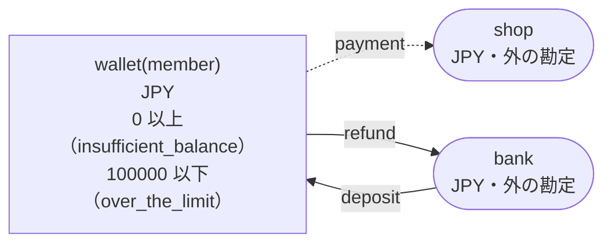
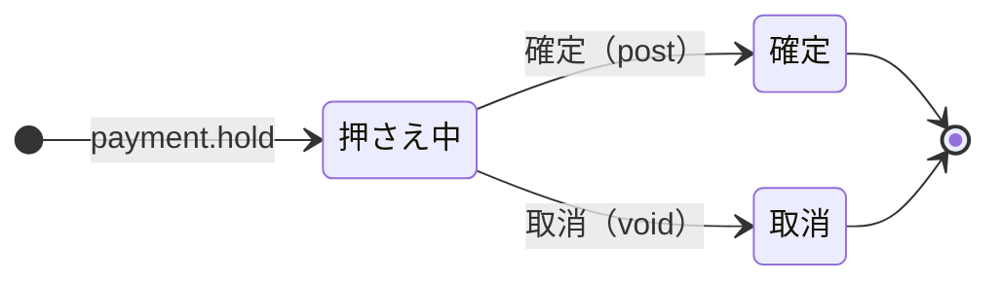

<!-- `chobo doc tests/books/wallet.book --lang ja` の出力です。手で編集しないでください。 -->

# wallet v1

A wallet for each member. A deposit from the bank adds to it, a payment holds the amount while it goes through, and a refund returns it to the bank

`chobo doc` が `tests/books/wallet.book` から作ったページ。勘定ごとに残高を持ち、残高は入った量から出た量を引いたもの。どの振替も勘定の下限と上限を守り、守れない振替は、その境界に付けた名前で拒否されて、どの移動も行われない。振替には、すぐに動かすもの（`do`）と、動かす量をまず押さえるもの（`hold`）がある。押さえた分は、あとで確定される（`post`。全部か一部）か、取り消される（`void`）か、有効期限で切れる。

## 勘定

| 勘定 | 分け方 | 単位 | 境界 | 説明 |
|---|---|---|---|---|
| `wallet` | `member` ごと | JPY | 0 以上。下回る振替は `insufficient_balance` で拒否される<br>100000 以下。超える振替は `over_the_limit` で拒否される |  |
| `bank` | 一つだけ | JPY | 外の勘定。境界は無く、マイナスにもなる |  |
| `shop` | 一つだけ | JPY | 外の勘定。境界は無く、マイナスにもなる |  |

## 勘定のあいだの流れ



四角は勘定で、矢印は振替の移動。角の丸い四角は外の勘定で、境界を持たない。破線の矢印は仮押さえの振替で、まず押さえ、確定したときに動く。

## 振替

### deposit

- 移動: `bank` から `wallet(member)` へ `amount`。
- キー: `deposit_id` ごとに一度だけ動く。同じ呼び出しの二度目は何もせず、`done_before` を返す。キーが同じで `member`、`amount` のどれかが違う二度目の呼び出しは、`key_conflict` で拒否される。
- すぐに動かす（`do`）。

| 操作 | 拒否されうる理由 | いつ |
|---|---|---|
| `deposit.do` | `over_the_limit` | `wallet(member)` が 100000 を超える |
| `deposit.do` | `key_conflict` | `deposit_id` が同じで、ほかの引数が違う呼び出しが、前に済んでいる |
| `deposit.do` | `already_refused` | `deposit_id` が同じ呼び出しが、前に境界で拒否されている。境界で拒否されたキーは、あとで足りるようになっても通らない |

<details><summary>拒否される例</summary>

#### deposit.do: over_the_limit

```text
 1  deposit.do(deposit_id: deposit_id-1, member: member-2, amount: 100000)  通る
 2  deposit.do(deposit_id: deposit_id-3, member: member-2, amount: 1)       over_the_limit で拒否される（1 つ目の移動が wallet(member-2) へ 1 を入れようとしたときの残高は、確定 100000、入ってくる仮押さえ 0）
```

#### deposit.do: key_conflict

```text
 1  deposit.do(deposit_id: deposit_id-1, member: member-2, amount: 1)  通る
 2  deposit.do(deposit_id: deposit_id-1, member: member-2, amount: 2)  key_conflict で拒否される
```

#### deposit.do: already_refused

```text
 1  deposit.do(deposit_id: deposit_id-1, member: member-2, amount: 100000)  通る
 2  deposit.do(deposit_id: deposit_id-3, member: member-2, amount: 1)       over_the_limit で拒否される（1 つ目の移動が wallet(member-2) へ 1 を入れようとしたときの残高は、確定 100000、入ってくる仮押さえ 0）
 3  deposit.do(deposit_id: deposit_id-3, member: member-2, amount: 1)       already_refused で拒否される
```

</details>

### payment

posted when the order ships, voided when it is cancelled; only the caller ends the hold

- 移動: `wallet(member)` から `shop` へ `amount`。
- キー: `order` ごとに一度だけ動く。同じ呼び出しの二度目は何もせず、`done_before` を返す。キーが同じで `member`、`amount` のどれかが違う二度目の呼び出しは、`key_conflict` で拒否される。仮押さえが終わったあとに同じキーでもう一度押さえると、`done_before` を返し、何も押さえない。
- 仮押さえ: まず押さえる。確定と取消は呼ぶ側がする。期限は無く、どちらかが来るまで押さえたまま。



| 仮押さえの状態 | post（確定） | void（取消） |
|---|---|---|
| 押さえ中 | 確定する。額を渡せばその額、渡さなければ全額で、残りは元に戻る。押さえた額を超えれば `over_hold` で拒否される | 取り消す。押さえた量は元に戻る |
| 確定 | 同じ額なら `done_before`、違う額なら `key_conflict` で拒否される | `already_posted` で拒否される |
| 取消 | `already_voided` で拒否される | `done_before` |
| 仮押さえが無い | `no_such_hold` で拒否される | `no_such_hold` で拒否される |

| 操作 | 拒否されうる理由 | いつ |
|---|---|---|
| `payment.hold` | `insufficient_balance` | `wallet(member)` が 0 を下回る |
| `payment.hold` | `key_conflict` | `order` が同じで、ほかの引数が違う呼び出しが、前に済んでいる |
| `payment.hold` | `already_refused` | `order` が同じ呼び出しが、前に境界で拒否されている。境界で拒否されたキーは、あとで足りるようになっても通らない |
| `payment.post` | `key_conflict` | 仮押さえは、違う額で確定済み |
| `payment.post` | `already_voided` | 仮押さえはもう取り消されている |
| `payment.post` | `over_hold` | 押さえた額より多く確定しようとした |
| `payment.post` | `no_such_hold` | その `order` の仮押さえが無い |
| `payment.void` | `already_posted` | 仮押さえはもう確定している |
| `payment.void` | `no_such_hold` | その `order` の仮押さえが無い |

<details><summary>拒否される例</summary>

#### payment.hold: insufficient_balance

```text
 1  payment.hold(order: order-1, member: member-2, amount: 1)  insufficient_balance で拒否される（1 つ目の移動が wallet(member-2) から 1 を取ろうとしたときの残高は、確定 0、出ていく仮押さえ 0）
```

#### payment.hold: key_conflict

```text
 1  deposit.do(deposit_id: deposit_id-1, member: member-2, amount: 1)  通る
 2  payment.hold(order: order-3, member: member-2, amount: 1)          通る
 3  payment.hold(order: order-3, member: member-2, amount: 2)          key_conflict で拒否される
```

#### payment.hold: already_refused

```text
 1  payment.hold(order: order-1, member: member-2, amount: 1)  insufficient_balance で拒否される（1 つ目の移動が wallet(member-2) から 1 を取ろうとしたときの残高は、確定 0、出ていく仮押さえ 0）
 2  payment.hold(order: order-1, member: member-2, amount: 1)  already_refused で拒否される
```

#### payment.post: key_conflict

```text
 1  deposit.do(deposit_id: deposit_id-1, member: member-2, amount: 2)  通る
 2  payment.hold(order: order-3, member: member-2, amount: 2)          通る
 3  payment.post(order: order-3)                                       通る
 4  payment.post(order: order-3, amount: 1)                            key_conflict で拒否される
```

#### payment.post: already_voided

```text
 1  deposit.do(deposit_id: deposit_id-1, member: member-2, amount: 2)  通る
 2  payment.hold(order: order-3, member: member-2, amount: 2)          通る
 3  payment.void(order: order-3)                                       通る
 4  payment.post(order: order-3)                                       already_voided で拒否される
```

#### payment.post: over_hold

```text
 1  deposit.do(deposit_id: deposit_id-1, member: member-2, amount: 2)  通る
 2  payment.hold(order: order-3, member: member-2, amount: 2)          通る
 3  payment.post(order: order-3, amount: 3)                            over_hold で拒否される
```

#### payment.post: no_such_hold

```text
 1  payment.post(order: order-1)  no_such_hold で拒否される
```

#### payment.void: already_posted

```text
 1  deposit.do(deposit_id: deposit_id-1, member: member-2, amount: 2)  通る
 2  payment.hold(order: order-3, member: member-2, amount: 2)          通る
 3  payment.post(order: order-3)                                       通る
 4  payment.void(order: order-3)                                       already_posted で拒否される
```

#### payment.void: no_such_hold

```text
 1  payment.void(order: order-1)  no_such_hold で拒否される
```

</details>

### refund

- 移動: `wallet(member)` から `bank` へ `amount`。
- キー: `refund_id` ごとに一度だけ動く。同じ呼び出しの二度目は何もせず、`done_before` を返す。キーが同じで `member`、`amount` のどれかが違う二度目の呼び出しは、`key_conflict` で拒否される。
- すぐに動かす（`do`）。

| 操作 | 拒否されうる理由 | いつ |
|---|---|---|
| `refund.do` | `insufficient_balance` | `wallet(member)` が 0 を下回る |
| `refund.do` | `key_conflict` | `refund_id` が同じで、ほかの引数が違う呼び出しが、前に済んでいる |
| `refund.do` | `already_refused` | `refund_id` が同じ呼び出しが、前に境界で拒否されている。境界で拒否されたキーは、あとで足りるようになっても通らない |

<details><summary>拒否される例</summary>

#### refund.do: insufficient_balance

```text
 1  refund.do(refund_id: refund_id-1, member: member-2, amount: 1)  insufficient_balance で拒否される（1 つ目の移動が wallet(member-2) から 1 を取ろうとしたときの残高は、確定 0、出ていく仮押さえ 0）
```

#### refund.do: key_conflict

```text
 1  deposit.do(deposit_id: deposit_id-1, member: member-2, amount: 1)  通る
 2  refund.do(refund_id: refund_id-3, member: member-2, amount: 1)     通る
 3  refund.do(refund_id: refund_id-3, member: member-2, amount: 2)     key_conflict で拒否される
```

#### refund.do: already_refused

```text
 1  refund.do(refund_id: refund_id-1, member: member-2, amount: 1)  insufficient_balance で拒否される（1 つ目の移動が wallet(member-2) から 1 を取ろうとしたときの残高は、確定 0、出ていく仮押さえ 0）
 2  refund.do(refund_id: refund_id-1, member: member-2, amount: 1)  already_refused で拒否される
```

</details>

## シナリオ

`chobo scenarios` が帳簿から作ったシナリオ 29 本。境界の手前・ちょうど・超える、同じキーの二度目、仮押さえの終わり方、二つの呼び出し元が同時に最後の一つを取りに来るもの、などがある。どれも参照インタプリタで流したもので、ステップごとに、そのあとの残高を載せている。残高は確定した量で、仮押さえがあれば、その量を括弧の中に添えている。

<details><summary>1. 境界: deposit.do が wallet(member) を 99999 まで増やす（<code>at most 100000</code> の 1 つ手前）</summary>

| # | 操作 | 結果 | wallet(member-2) | bank |
|---|---|---|---|---|
| 1 | deposit.do(deposit_id: deposit_id-1, member: member-2, amount: 99998) | 通る | 99998 | -99998 |
| 2 | deposit.do(deposit_id: deposit_id-3, member: member-2, amount: 1) | 通る | 99999 | -99999 |

</details>

<details><summary>2. 境界: deposit.do が wallet(member) をちょうど 100000 まで増やす（<code>at most 100000</code> ちょうど）</summary>

| # | 操作 | 結果 | wallet(member-2) | bank |
|---|---|---|---|---|
| 1 | deposit.do(deposit_id: deposit_id-1, member: member-2, amount: 99998) | 通る | 99998 | -99998 |
| 2 | deposit.do(deposit_id: deposit_id-3, member: member-2, amount: 2) | 通る | 100000 | -100000 |

</details>

<details><summary>3. 境界: deposit.do は wallet(member) を 100001 まで増やすので拒否される（<code>at most 100000</code> を超える）</summary>

| # | 操作 | 結果 | wallet(member-2) | bank |
|---|---|---|---|---|
| 1 | deposit.do(deposit_id: deposit_id-1, member: member-2, amount: 99998) | 通る | 99998 | -99998 |
| 2 | deposit.do(deposit_id: deposit_id-3, member: member-2, amount: 3) | over_the_limit で拒否される | 99998 | -99998 |

</details>

<details><summary>4. 境界: payment.hold が wallet(member) を 1 まで減らす（<code>at least 0</code> の 1 つ手前）</summary>

| # | 操作 | 結果 | wallet(member-2) | bank | shop |
|---|---|---|---|---|---|
| 1 | deposit.do(deposit_id: deposit_id-1, member: member-2, amount: 2) | 通る | 2 | -2 | 0 |
| 2 | payment.hold(order: order-3, member: member-2, amount: 1) | 通る | 2（出ていく仮押さえ 1） | -2 | 0（入ってくる仮押さえ 1） |

</details>

<details><summary>5. 境界: payment.hold が wallet(member) をちょうど 0 まで減らす（<code>at least 0</code> ちょうど）</summary>

| # | 操作 | 結果 | wallet(member-2) | bank | shop |
|---|---|---|---|---|---|
| 1 | deposit.do(deposit_id: deposit_id-1, member: member-2, amount: 2) | 通る | 2 | -2 | 0 |
| 2 | payment.hold(order: order-3, member: member-2, amount: 2) | 通る | 2（出ていく仮押さえ 2） | -2 | 0（入ってくる仮押さえ 2） |

</details>

<details><summary>6. 境界: payment.hold は wallet(member) を -1 まで減らすので拒否される（<code>at least 0</code> を割る）</summary>

| # | 操作 | 結果 | wallet(member-2) | bank | shop |
|---|---|---|---|---|---|
| 1 | deposit.do(deposit_id: deposit_id-1, member: member-2, amount: 2) | 通る | 2 | -2 | 0 |
| 2 | payment.hold(order: order-3, member: member-2, amount: 3) | insufficient_balance で拒否される | 2 | -2 | 0 |

</details>

<details><summary>7. 境界: refund.do が wallet(member) を 1 まで減らす（<code>at least 0</code> の 1 つ手前）</summary>

| # | 操作 | 結果 | wallet(member-2) | bank |
|---|---|---|---|---|
| 1 | deposit.do(deposit_id: deposit_id-1, member: member-2, amount: 2) | 通る | 2 | -2 |
| 2 | refund.do(refund_id: refund_id-3, member: member-2, amount: 1) | 通る | 1 | -1 |

</details>

<details><summary>8. 境界: refund.do が wallet(member) をちょうど 0 まで減らす（<code>at least 0</code> ちょうど）</summary>

| # | 操作 | 結果 | wallet(member-2) | bank |
|---|---|---|---|---|
| 1 | deposit.do(deposit_id: deposit_id-1, member: member-2, amount: 2) | 通る | 2 | -2 |
| 2 | refund.do(refund_id: refund_id-3, member: member-2, amount: 2) | 通る | 0 | 0 |

</details>

<details><summary>9. 境界: refund.do は wallet(member) を -1 まで減らすので拒否される（<code>at least 0</code> を割る）</summary>

| # | 操作 | 結果 | wallet(member-2) | bank |
|---|---|---|---|---|
| 1 | deposit.do(deposit_id: deposit_id-1, member: member-2, amount: 2) | 通る | 2 | -2 |
| 2 | refund.do(refund_id: refund_id-3, member: member-2, amount: 3) | insufficient_balance で拒否される | 2 | -2 |

</details>

<details><summary>10. キー: deposit.do を同じ引数で二度呼ぶ</summary>

| # | 操作 | 結果 | wallet(member-2) | bank |
|---|---|---|---|---|
| 1 | deposit.do(deposit_id: deposit_id-1, member: member-2, amount: 1) | 通る | 1 | -1 |
| 2 | deposit.do(deposit_id: deposit_id-1, member: member-2, amount: 1) | done_before（前に済んでいる） | 1 | -1 |

</details>

<details><summary>11. キー: deposit.do を amount だけ変えてもう一度呼ぶ</summary>

| # | 操作 | 結果 | wallet(member-2) | bank |
|---|---|---|---|---|
| 1 | deposit.do(deposit_id: deposit_id-1, member: member-2, amount: 1) | 通る | 1 | -1 |
| 2 | deposit.do(deposit_id: deposit_id-1, member: member-2, amount: 2) | key_conflict で拒否される | 1 | -1 |

</details>

<details><summary>12. キー: deposit.do が over_the_limit で拒否されたあと、同じ引数でもう一度呼ぶ</summary>

| # | 操作 | 結果 | wallet(member-2) | bank |
|---|---|---|---|---|
| 1 | deposit.do(deposit_id: deposit_id-1, member: member-2, amount: 100000) | 通る | 100000 | -100000 |
| 2 | deposit.do(deposit_id: deposit_id-3, member: member-2, amount: 1) | over_the_limit で拒否される | 100000 | -100000 |
| 3 | deposit.do(deposit_id: deposit_id-3, member: member-2, amount: 1) | already_refused で拒否される | 100000 | -100000 |

</details>

<details><summary>13. キー: payment.hold を同じ引数で二度呼ぶ</summary>

| # | 操作 | 結果 | wallet(member-2) | bank | shop |
|---|---|---|---|---|---|
| 1 | deposit.do(deposit_id: deposit_id-1, member: member-2, amount: 1) | 通る | 1 | -1 | 0 |
| 2 | payment.hold(order: order-3, member: member-2, amount: 1) | 通る | 1（出ていく仮押さえ 1） | -1 | 0（入ってくる仮押さえ 1） |
| 3 | payment.hold(order: order-3, member: member-2, amount: 1) | done_before（前に済んでいる） | 1（出ていく仮押さえ 1） | -1 | 0（入ってくる仮押さえ 1） |

</details>

<details><summary>14. キー: payment.hold を amount だけ変えてもう一度呼ぶ</summary>

| # | 操作 | 結果 | wallet(member-2) | bank | shop |
|---|---|---|---|---|---|
| 1 | deposit.do(deposit_id: deposit_id-1, member: member-2, amount: 1) | 通る | 1 | -1 | 0 |
| 2 | payment.hold(order: order-3, member: member-2, amount: 1) | 通る | 1（出ていく仮押さえ 1） | -1 | 0（入ってくる仮押さえ 1） |
| 3 | payment.hold(order: order-3, member: member-2, amount: 2) | key_conflict で拒否される | 1（出ていく仮押さえ 1） | -1 | 0（入ってくる仮押さえ 1） |

</details>

<details><summary>15. キー: payment.hold が insufficient_balance で拒否されたあと、同じ引数ですぐにもう一度呼び、wallet(member) が足りるようになってからもう一度呼ぶ</summary>

| # | 操作 | 結果 | wallet(member-2) | bank | shop |
|---|---|---|---|---|---|
| 1 | payment.hold(order: order-1, member: member-2, amount: 1) | insufficient_balance で拒否される | 0 | 0 | 0 |
| 2 | payment.hold(order: order-1, member: member-2, amount: 1) | already_refused で拒否される | 0 | 0 | 0 |
| 3 | deposit.do(deposit_id: deposit_id-3, member: member-2, amount: 1) | 通る | 1 | -1 | 0 |
| 4 | payment.hold(order: order-1, member: member-2, amount: 1) | already_refused で拒否される | 1 | -1 | 0 |

</details>

<details><summary>16. キー: refund.do を同じ引数で二度呼ぶ</summary>

| # | 操作 | 結果 | wallet(member-2) | bank |
|---|---|---|---|---|
| 1 | deposit.do(deposit_id: deposit_id-1, member: member-2, amount: 1) | 通る | 1 | -1 |
| 2 | refund.do(refund_id: refund_id-3, member: member-2, amount: 1) | 通る | 0 | 0 |
| 3 | refund.do(refund_id: refund_id-3, member: member-2, amount: 1) | done_before（前に済んでいる） | 0 | 0 |

</details>

<details><summary>17. キー: refund.do を amount だけ変えてもう一度呼ぶ</summary>

| # | 操作 | 結果 | wallet(member-2) | bank |
|---|---|---|---|---|
| 1 | deposit.do(deposit_id: deposit_id-1, member: member-2, amount: 1) | 通る | 1 | -1 |
| 2 | refund.do(refund_id: refund_id-3, member: member-2, amount: 1) | 通る | 0 | 0 |
| 3 | refund.do(refund_id: refund_id-3, member: member-2, amount: 2) | key_conflict で拒否される | 0 | 0 |

</details>

<details><summary>18. キー: refund.do が insufficient_balance で拒否されたあと、同じ引数ですぐにもう一度呼び、wallet(member) が足りるようになってからもう一度呼ぶ</summary>

| # | 操作 | 結果 | wallet(member-2) | bank |
|---|---|---|---|---|
| 1 | refund.do(refund_id: refund_id-1, member: member-2, amount: 1) | insufficient_balance で拒否される | 0 | 0 |
| 2 | refund.do(refund_id: refund_id-1, member: member-2, amount: 1) | already_refused で拒否される | 0 | 0 |
| 3 | deposit.do(deposit_id: deposit_id-3, member: member-2, amount: 1) | 通る | 1 | -1 |
| 4 | refund.do(refund_id: refund_id-1, member: member-2, amount: 1) | already_refused で拒否される | 1 | -1 |

</details>

<details><summary>19. 仮押さえ: payment を全額で確定する</summary>

| # | 操作 | 結果 | wallet(member-2) | bank | shop |
|---|---|---|---|---|---|
| 1 | deposit.do(deposit_id: deposit_id-1, member: member-2, amount: 2) | 通る | 2 | -2 | 0 |
| 2 | payment.hold(order: order-3, member: member-2, amount: 2) | 通る | 2（出ていく仮押さえ 2） | -2 | 0（入ってくる仮押さえ 2） |
| 3 | payment.post(order: order-3) | 通る | 0 | -2 | 2 |

</details>

<details><summary>20. 仮押さえ: payment を一部だけ確定する</summary>

| # | 操作 | 結果 | wallet(member-2) | bank | shop |
|---|---|---|---|---|---|
| 1 | deposit.do(deposit_id: deposit_id-1, member: member-2, amount: 2) | 通る | 2 | -2 | 0 |
| 2 | payment.hold(order: order-3, member: member-2, amount: 2) | 通る | 2（出ていく仮押さえ 2） | -2 | 0（入ってくる仮押さえ 2） |
| 3 | payment.post(order: order-3, amount: 1) | 通る | 1 | -2 | 1 |

</details>

<details><summary>21. 仮押さえ: payment を取り消す</summary>

| # | 操作 | 結果 | wallet(member-2) | bank | shop |
|---|---|---|---|---|---|
| 1 | deposit.do(deposit_id: deposit_id-1, member: member-2, amount: 2) | 通る | 2 | -2 | 0 |
| 2 | payment.hold(order: order-3, member: member-2, amount: 2) | 通る | 2（出ていく仮押さえ 2） | -2 | 0（入ってくる仮押さえ 2） |
| 3 | payment.void(order: order-3) | 通る | 2 | -2 | 0 |

</details>

<details><summary>22. 仮押さえ: payment を確定してから取り消そうとする</summary>

| # | 操作 | 結果 | wallet(member-2) | bank | shop |
|---|---|---|---|---|---|
| 1 | deposit.do(deposit_id: deposit_id-1, member: member-2, amount: 2) | 通る | 2 | -2 | 0 |
| 2 | payment.hold(order: order-3, member: member-2, amount: 2) | 通る | 2（出ていく仮押さえ 2） | -2 | 0（入ってくる仮押さえ 2） |
| 3 | payment.post(order: order-3) | 通る | 0 | -2 | 2 |
| 4 | payment.void(order: order-3) | already_posted で拒否される | 0 | -2 | 2 |

</details>

<details><summary>23. 仮押さえ: payment を取り消してから確定しようとする</summary>

| # | 操作 | 結果 | wallet(member-2) | bank | shop |
|---|---|---|---|---|---|
| 1 | deposit.do(deposit_id: deposit_id-1, member: member-2, amount: 2) | 通る | 2 | -2 | 0 |
| 2 | payment.hold(order: order-3, member: member-2, amount: 2) | 通る | 2（出ていく仮押さえ 2） | -2 | 0（入ってくる仮押さえ 2） |
| 3 | payment.void(order: order-3) | 通る | 2 | -2 | 0 |
| 4 | payment.post(order: order-3) | already_voided で拒否される | 2 | -2 | 0 |

</details>

<details><summary>24. 仮押さえ: payment を押さえた額より多く確定しようとし、押さえた額で確定する</summary>

| # | 操作 | 結果 | wallet(member-2) | bank | shop |
|---|---|---|---|---|---|
| 1 | deposit.do(deposit_id: deposit_id-1, member: member-2, amount: 2) | 通る | 2 | -2 | 0 |
| 2 | payment.hold(order: order-3, member: member-2, amount: 2) | 通る | 2（出ていく仮押さえ 2） | -2 | 0（入ってくる仮押さえ 2） |
| 3 | payment.post(order: order-3, amount: 3) | over_hold で拒否される | 2（出ていく仮押さえ 2） | -2 | 0（入ってくる仮押さえ 2） |
| 4 | payment.post(order: order-3, amount: 2) | 通る | 0 | -2 | 2 |

</details>

<details><summary>25. 仮押さえ: payment を押さえる前に確定しようとし、押さえてから確定する</summary>

| # | 操作 | 結果 | wallet(member-2) | bank | shop |
|---|---|---|---|---|---|
| 1 | payment.post(order: order-1) | no_such_hold で拒否される | 0 | 0 | 0 |
| 2 | deposit.do(deposit_id: deposit_id-1, member: member-2, amount: 1) | 通る | 1 | -1 | 0 |
| 3 | payment.hold(order: order-1, member: member-2, amount: 1) | 通る | 1（出ていく仮押さえ 1） | -1 | 0（入ってくる仮押さえ 1） |
| 4 | payment.post(order: order-1) | 通る | 0 | -1 | 1 |

</details>

<details><summary>26. 仮押さえ: payment を確定したあと、同じ額でもう一度、違う額でもう一度確定する</summary>

| # | 操作 | 結果 | wallet(member-2) | bank | shop |
|---|---|---|---|---|---|
| 1 | deposit.do(deposit_id: deposit_id-1, member: member-2, amount: 2) | 通る | 2 | -2 | 0 |
| 2 | payment.hold(order: order-3, member: member-2, amount: 2) | 通る | 2（出ていく仮押さえ 2） | -2 | 0（入ってくる仮押さえ 2） |
| 3 | payment.post(order: order-3) | 通る | 0 | -2 | 2 |
| 4 | payment.post(order: order-3) | done_before（前に済んでいる） | 0 | -2 | 2 |
| 5 | payment.post(order: order-3, amount: 2) | done_before（前に済んでいる） | 0 | -2 | 2 |
| 6 | payment.post(order: order-3, amount: 1) | key_conflict で拒否される | 0 | -2 | 2 |

</details>

<details><summary>27. 同時: 二つの呼び出し元が deposit.do で wallet(member) の最後の空き 1 を取り合う</summary>

同時の操作の順序によって、結果は 2 通りある。

結果 1:

| # | 操作 | 結果 | wallet(member-2) | bank |
|---|---|---|---|---|
| 1 | deposit.do(deposit_id: deposit_id-1, member: member-2, amount: 99999) | 通る | 99999 | -99999 |
| 2 | together<br>呼び出し元 1: deposit.do(deposit_id: deposit_id-3, member: member-2, amount: 1)<br>呼び出し元 2: deposit.do(deposit_id: deposit_id-4, member: member-2, amount: 1) | <br>通る<br>over_the_limit で拒否される | 100000 | -100000 |

結果 2:

| # | 操作 | 結果 | wallet(member-2) | bank |
|---|---|---|---|---|
| 1 | deposit.do(deposit_id: deposit_id-1, member: member-2, amount: 99999) | 通る | 99999 | -99999 |
| 2 | together<br>呼び出し元 1: deposit.do(deposit_id: deposit_id-3, member: member-2, amount: 1)<br>呼び出し元 2: deposit.do(deposit_id: deposit_id-4, member: member-2, amount: 1) | <br>over_the_limit で拒否される<br>通る | 100000 | -100000 |

</details>

<details><summary>28. 同時: 二つの呼び出し元が payment.hold で wallet(member) の最後の 1 を取り合う</summary>

同時の操作の順序によって、結果は 2 通りある。

結果 1:

| # | 操作 | 結果 | wallet(member-2) | bank | shop |
|---|---|---|---|---|---|
| 1 | deposit.do(deposit_id: deposit_id-1, member: member-2, amount: 1) | 通る | 1 | -1 | 0 |
| 2 | together<br>呼び出し元 1: payment.hold(order: order-3, member: member-2, amount: 1)<br>呼び出し元 2: payment.hold(order: order-4, member: member-2, amount: 1) | <br>通る<br>insufficient_balance で拒否される | 1（出ていく仮押さえ 1） | -1 | 0（入ってくる仮押さえ 1） |

結果 2:

| # | 操作 | 結果 | wallet(member-2) | bank | shop |
|---|---|---|---|---|---|
| 1 | deposit.do(deposit_id: deposit_id-1, member: member-2, amount: 1) | 通る | 1 | -1 | 0 |
| 2 | together<br>呼び出し元 1: payment.hold(order: order-3, member: member-2, amount: 1)<br>呼び出し元 2: payment.hold(order: order-4, member: member-2, amount: 1) | <br>insufficient_balance で拒否される<br>通る | 1（出ていく仮押さえ 1） | -1 | 0（入ってくる仮押さえ 1） |

</details>

<details><summary>29. 同時: 二つの呼び出し元が refund.do で wallet(member) の最後の 1 を取り合う</summary>

同時の操作の順序によって、結果は 2 通りある。

結果 1:

| # | 操作 | 結果 | wallet(member-2) | bank |
|---|---|---|---|---|
| 1 | deposit.do(deposit_id: deposit_id-1, member: member-2, amount: 1) | 通る | 1 | -1 |
| 2 | together<br>呼び出し元 1: refund.do(refund_id: refund_id-3, member: member-2, amount: 1)<br>呼び出し元 2: refund.do(refund_id: refund_id-4, member: member-2, amount: 1) | <br>通る<br>insufficient_balance で拒否される | 0 | 0 |

結果 2:

| # | 操作 | 結果 | wallet(member-2) | bank |
|---|---|---|---|---|
| 1 | deposit.do(deposit_id: deposit_id-1, member: member-2, amount: 1) | 通る | 1 | -1 |
| 2 | together<br>呼び出し元 1: refund.do(refund_id: refund_id-3, member: member-2, amount: 1)<br>呼び出し元 2: refund.do(refund_id: refund_id-4, member: member-2, amount: 1) | <br>insufficient_balance で拒否される<br>通る | 0 | 0 |

</details>

