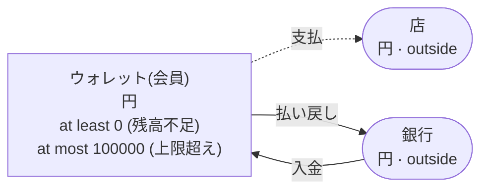
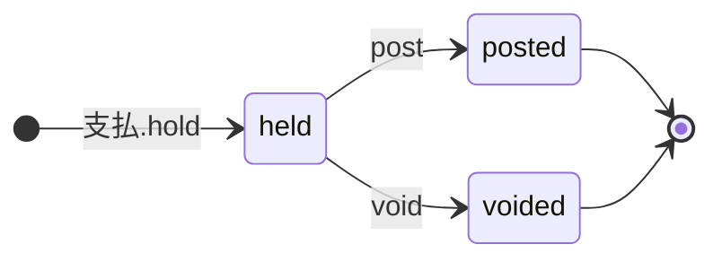

<!-- The output of `chobo doc tests/books/ウォレット.book`. Do not edit by hand. -->

# ウォレット v1

会員ごとのウォレット。銀行からの入金で増え、支払いのあいだ押さえ、払い戻しで銀行へ戻す

`tests/books/ウォレット.book`, as `chobo doc` writes it. Each account keeps a balance: what came in, less what went out. Every transfer keeps the bounds of the accounts: one that would break a bound is refused with the name the book gives that bound, and nothing of it moves. A transfer either moves at once (`do`), or first holds what it moves (`hold`); a hold is then posted (`post`, all of it or part), voided (`void`), or expires.

## Accounts

| Account | One for each | Unit | Bounds | What it is |
|---|---|---|---|---|
| `ウォレット` | `会員` | 円 | at least 0; a transfer that would go below is refused with `残高不足`<br>at most 100000; a transfer that would go above is refused with `上限超え` |  |
| `銀行` | one account | 円 | outside the book: no bounds, and it may go below 0 |  |
| `店` | one account | 円 | outside the book: no bounds, and it may go below 0 |  |

## How things move



A box is an account, and an arrow a move of a transfer. A rounded box is an account outside the book, which has no bounds. A dashed arrow belongs to a transfer that holds first, and moves when the hold is posted.

## Transfers

### 入金

- Moves `額` from `銀行` to `ウォレット(会員)`.
- Key: once per `入金番号`. The same call again does nothing, and answers `done_before`; one that differs only in `会員` or `額` is refused with `key_conflict`.
- Moves at once (`do`).

| Operation | May be refused with | When |
|---|---|---|
| `入金.do` | `上限超え` | `ウォレット(会員)` would go above 100000 |
| `入金.do` | `key_conflict` | a call with the same `入金番号` and other arguments came before |
| `入金.do` | `already_refused` | a call with the same `入金番号` was refused by a bound before; a key a bound refused stays refused, even once there is enough |

<details><summary>How each refusal comes about</summary>

#### 入金.do: 上限超え

```text
 1  入金.do(入金番号: 入金番号-1, 会員: 会員-2, 額: 100000)  done
 2  入金.do(入金番号: 入金番号-3, 会員: 会員-2, 額: 1)       refused: 上限超え (move 1 puts 1 into ウォレット(会員-2): posted 100000, held in 0)
```

#### 入金.do: key_conflict

```text
 1  入金.do(入金番号: 入金番号-1, 会員: 会員-2, 額: 1)  done
 2  入金.do(入金番号: 入金番号-1, 会員: 会員-2, 額: 2)  refused: key_conflict
```

#### 入金.do: already_refused

```text
 1  入金.do(入金番号: 入金番号-1, 会員: 会員-2, 額: 100000)  done
 2  入金.do(入金番号: 入金番号-3, 会員: 会員-2, 額: 1)       refused: 上限超え (move 1 puts 1 into ウォレット(会員-2): posted 100000, held in 0)
 3  入金.do(入金番号: 入金番号-3, 会員: 会員-2, 額: 1)       refused: already_refused
```

</details>

### 支払

出荷で確定し、キャンセルで取り消す。押さえを終わらせるのは呼ぶ側だけ

- Moves `額` from `ウォレット(会員)` to `店`.
- Key: once per `注文`. The same call again does nothing, and answers `done_before`; one that differs only in `会員` or `額` is refused with `key_conflict`; holding again with the same key after the hold has ended answers `done_before`, and holds nothing.
- Holds first: the caller posts or voids the hold. It never expires, and stays held until one of them comes.



| The hold | post | void |
|---|---|---|
| held | posts it: the amounts given, or all of it, and the rest goes back; more than it holds is refused with `over_hold` | voids it: what it holds goes back |
| posted | `done_before` with the same amounts; refused with `key_conflict` with others | refused with `already_posted` |
| voided | refused with `already_voided` | `done_before` |
| no hold with the key | refused with `no_such_hold` | refused with `no_such_hold` |

| Operation | May be refused with | When |
|---|---|---|
| `支払.hold` | `残高不足` | `ウォレット(会員)` would go below 0 |
| `支払.hold` | `key_conflict` | a call with the same `注文` and other arguments came before |
| `支払.hold` | `already_refused` | a call with the same `注文` was refused by a bound before; a key a bound refused stays refused, even once there is enough |
| `支払.post` | `key_conflict` | the hold was posted before, for other amounts |
| `支払.post` | `already_voided` | the hold is voided already |
| `支払.post` | `over_hold` | more than the hold holds |
| `支払.post` | `no_such_hold` | there is no hold with that `注文` |
| `支払.void` | `already_posted` | the hold is posted already |
| `支払.void` | `no_such_hold` | there is no hold with that `注文` |

<details><summary>How each refusal comes about</summary>

#### 支払.hold: 残高不足

```text
 1  支払.hold(注文: 注文-1, 会員: 会員-2, 額: 1)  refused: 残高不足 (move 1 takes 1 from ウォレット(会員-2): posted 0, held out 0)
```

#### 支払.hold: key_conflict

```text
 1  入金.do(入金番号: 入金番号-1, 会員: 会員-2, 額: 1)  done
 2  支払.hold(注文: 注文-3, 会員: 会員-2, 額: 1)        done
 3  支払.hold(注文: 注文-3, 会員: 会員-2, 額: 2)        refused: key_conflict
```

#### 支払.hold: already_refused

```text
 1  支払.hold(注文: 注文-1, 会員: 会員-2, 額: 1)  refused: 残高不足 (move 1 takes 1 from ウォレット(会員-2): posted 0, held out 0)
 2  支払.hold(注文: 注文-1, 会員: 会員-2, 額: 1)  refused: already_refused
```

#### 支払.post: key_conflict

```text
 1  入金.do(入金番号: 入金番号-1, 会員: 会員-2, 額: 2)  done
 2  支払.hold(注文: 注文-3, 会員: 会員-2, 額: 2)        done
 3  支払.post(注文: 注文-3)                             done
 4  支払.post(注文: 注文-3, 額: 1)                      refused: key_conflict
```

#### 支払.post: already_voided

```text
 1  入金.do(入金番号: 入金番号-1, 会員: 会員-2, 額: 2)  done
 2  支払.hold(注文: 注文-3, 会員: 会員-2, 額: 2)        done
 3  支払.void(注文: 注文-3)                             done
 4  支払.post(注文: 注文-3)                             refused: already_voided
```

#### 支払.post: over_hold

```text
 1  入金.do(入金番号: 入金番号-1, 会員: 会員-2, 額: 2)  done
 2  支払.hold(注文: 注文-3, 会員: 会員-2, 額: 2)        done
 3  支払.post(注文: 注文-3, 額: 3)                      refused: over_hold
```

#### 支払.post: no_such_hold

```text
 1  支払.post(注文: 注文-1)  refused: no_such_hold
```

#### 支払.void: already_posted

```text
 1  入金.do(入金番号: 入金番号-1, 会員: 会員-2, 額: 2)  done
 2  支払.hold(注文: 注文-3, 会員: 会員-2, 額: 2)        done
 3  支払.post(注文: 注文-3)                             done
 4  支払.void(注文: 注文-3)                             refused: already_posted
```

#### 支払.void: no_such_hold

```text
 1  支払.void(注文: 注文-1)  refused: no_such_hold
```

</details>

### 払い戻し

- Moves `額` from `ウォレット(会員)` to `銀行`.
- Key: once per `払戻番号`. The same call again does nothing, and answers `done_before`; one that differs only in `会員` or `額` is refused with `key_conflict`.
- Moves at once (`do`).

| Operation | May be refused with | When |
|---|---|---|
| `払い戻し.do` | `残高不足` | `ウォレット(会員)` would go below 0 |
| `払い戻し.do` | `key_conflict` | a call with the same `払戻番号` and other arguments came before |
| `払い戻し.do` | `already_refused` | a call with the same `払戻番号` was refused by a bound before; a key a bound refused stays refused, even once there is enough |

<details><summary>How each refusal comes about</summary>

#### 払い戻し.do: 残高不足

```text
 1  払い戻し.do(払戻番号: 払戻番号-1, 会員: 会員-2, 額: 1)  refused: 残高不足 (move 1 takes 1 from ウォレット(会員-2): posted 0, held out 0)
```

#### 払い戻し.do: key_conflict

```text
 1  入金.do(入金番号: 入金番号-1, 会員: 会員-2, 額: 1)      done
 2  払い戻し.do(払戻番号: 払戻番号-3, 会員: 会員-2, 額: 1)  done
 3  払い戻し.do(払戻番号: 払戻番号-3, 会員: 会員-2, 額: 2)  refused: key_conflict
```

#### 払い戻し.do: already_refused

```text
 1  払い戻し.do(払戻番号: 払戻番号-1, 会員: 会員-2, 額: 1)  refused: 残高不足 (move 1 takes 1 from ウォレット(会員-2): posted 0, held out 0)
 2  払い戻し.do(払戻番号: 払戻番号-1, 会員: 会員-2, 額: 1)  refused: already_refused
```

</details>

## Scenarios

29 scenarios, which `chobo scenarios` makes from the book: among them each bound just before, at and past it, each key used twice, every way a hold ends, and two callers after the last of something at the same time. The reference interpreter ran each one; after each step come the balances it left. A balance is what is posted, with what is held in brackets.

<details><summary>1. bound: 入金.do fills ウォレット(会員) to 99999, one below <code>at most 100000</code></summary>

| # | Operation | Result | ウォレット(会員-2) | 銀行 |
|---|---|---|---|---|
| 1 | 入金.do(入金番号: 入金番号-1, 会員: 会員-2, 額: 99998) | done | 99998 | -99998 |
| 2 | 入金.do(入金番号: 入金番号-3, 会員: 会員-2, 額: 1) | done | 99999 | -99999 |

</details>

<details><summary>2. bound: 入金.do fills ウォレット(会員) to exactly 100000, its <code>at most 100000</code></summary>

| # | Operation | Result | ウォレット(会員-2) | 銀行 |
|---|---|---|---|---|
| 1 | 入金.do(入金番号: 入金番号-1, 会員: 会員-2, 額: 99998) | done | 99998 | -99998 |
| 2 | 入金.do(入金番号: 入金番号-3, 会員: 会員-2, 額: 2) | done | 100000 | -100000 |

</details>

<details><summary>3. bound: 入金.do would fill ウォレット(会員) to 100001, past <code>at most 100000</code></summary>

| # | Operation | Result | ウォレット(会員-2) | 銀行 |
|---|---|---|---|---|
| 1 | 入金.do(入金番号: 入金番号-1, 会員: 会員-2, 額: 99998) | done | 99998 | -99998 |
| 2 | 入金.do(入金番号: 入金番号-3, 会員: 会員-2, 額: 3) | refused: 上限超え | 99998 | -99998 |

</details>

<details><summary>4. bound: 支払.hold takes ウォレット(会員) to 1, one above <code>at least 0</code></summary>

| # | Operation | Result | ウォレット(会員-2) | 銀行 | 店 |
|---|---|---|---|---|---|
| 1 | 入金.do(入金番号: 入金番号-1, 会員: 会員-2, 額: 2) | done | 2 | -2 | 0 |
| 2 | 支払.hold(注文: 注文-3, 会員: 会員-2, 額: 1) | done | 2 (held out 1) | -2 | 0 (held in 1) |

</details>

<details><summary>5. bound: 支払.hold takes ウォレット(会員) to exactly 0, its <code>at least 0</code></summary>

| # | Operation | Result | ウォレット(会員-2) | 銀行 | 店 |
|---|---|---|---|---|---|
| 1 | 入金.do(入金番号: 入金番号-1, 会員: 会員-2, 額: 2) | done | 2 | -2 | 0 |
| 2 | 支払.hold(注文: 注文-3, 会員: 会員-2, 額: 2) | done | 2 (held out 2) | -2 | 0 (held in 2) |

</details>

<details><summary>6. bound: 支払.hold would take ウォレット(会員) to -1, below <code>at least 0</code></summary>

| # | Operation | Result | ウォレット(会員-2) | 銀行 | 店 |
|---|---|---|---|---|---|
| 1 | 入金.do(入金番号: 入金番号-1, 会員: 会員-2, 額: 2) | done | 2 | -2 | 0 |
| 2 | 支払.hold(注文: 注文-3, 会員: 会員-2, 額: 3) | refused: 残高不足 | 2 | -2 | 0 |

</details>

<details><summary>7. bound: 払い戻し.do takes ウォレット(会員) to 1, one above <code>at least 0</code></summary>

| # | Operation | Result | ウォレット(会員-2) | 銀行 |
|---|---|---|---|---|
| 1 | 入金.do(入金番号: 入金番号-1, 会員: 会員-2, 額: 2) | done | 2 | -2 |
| 2 | 払い戻し.do(払戻番号: 払戻番号-3, 会員: 会員-2, 額: 1) | done | 1 | -1 |

</details>

<details><summary>8. bound: 払い戻し.do takes ウォレット(会員) to exactly 0, its <code>at least 0</code></summary>

| # | Operation | Result | ウォレット(会員-2) | 銀行 |
|---|---|---|---|---|
| 1 | 入金.do(入金番号: 入金番号-1, 会員: 会員-2, 額: 2) | done | 2 | -2 |
| 2 | 払い戻し.do(払戻番号: 払戻番号-3, 会員: 会員-2, 額: 2) | done | 0 | 0 |

</details>

<details><summary>9. bound: 払い戻し.do would take ウォレット(会員) to -1, below <code>at least 0</code></summary>

| # | Operation | Result | ウォレット(会員-2) | 銀行 |
|---|---|---|---|---|
| 1 | 入金.do(入金番号: 入金番号-1, 会員: 会員-2, 額: 2) | done | 2 | -2 |
| 2 | 払い戻し.do(払戻番号: 払戻番号-3, 会員: 会員-2, 額: 3) | refused: 残高不足 | 2 | -2 |

</details>

<details><summary>10. key: 入金.do twice with the same arguments</summary>

| # | Operation | Result | ウォレット(会員-2) | 銀行 |
|---|---|---|---|---|
| 1 | 入金.do(入金番号: 入金番号-1, 会員: 会員-2, 額: 1) | done | 1 | -1 |
| 2 | 入金.do(入金番号: 入金番号-1, 会員: 会員-2, 額: 1) | done_before | 1 | -1 |

</details>

<details><summary>11. key: 入金.do again with another 額</summary>

| # | Operation | Result | ウォレット(会員-2) | 銀行 |
|---|---|---|---|---|
| 1 | 入金.do(入金番号: 入金番号-1, 会員: 会員-2, 額: 1) | done | 1 | -1 |
| 2 | 入金.do(入金番号: 入金番号-1, 会員: 会員-2, 額: 2) | refused: key_conflict | 1 | -1 |

</details>

<details><summary>12. key: 入金.do refused with 上限超え, then again</summary>

| # | Operation | Result | ウォレット(会員-2) | 銀行 |
|---|---|---|---|---|
| 1 | 入金.do(入金番号: 入金番号-1, 会員: 会員-2, 額: 100000) | done | 100000 | -100000 |
| 2 | 入金.do(入金番号: 入金番号-3, 会員: 会員-2, 額: 1) | refused: 上限超え | 100000 | -100000 |
| 3 | 入金.do(入金番号: 入金番号-3, 会員: 会員-2, 額: 1) | refused: already_refused | 100000 | -100000 |

</details>

<details><summary>13. key: 支払.hold twice with the same arguments</summary>

| # | Operation | Result | ウォレット(会員-2) | 銀行 | 店 |
|---|---|---|---|---|---|
| 1 | 入金.do(入金番号: 入金番号-1, 会員: 会員-2, 額: 1) | done | 1 | -1 | 0 |
| 2 | 支払.hold(注文: 注文-3, 会員: 会員-2, 額: 1) | done | 1 (held out 1) | -1 | 0 (held in 1) |
| 3 | 支払.hold(注文: 注文-3, 会員: 会員-2, 額: 1) | done_before | 1 (held out 1) | -1 | 0 (held in 1) |

</details>

<details><summary>14. key: 支払.hold again with another 額</summary>

| # | Operation | Result | ウォレット(会員-2) | 銀行 | 店 |
|---|---|---|---|---|---|
| 1 | 入金.do(入金番号: 入金番号-1, 会員: 会員-2, 額: 1) | done | 1 | -1 | 0 |
| 2 | 支払.hold(注文: 注文-3, 会員: 会員-2, 額: 1) | done | 1 (held out 1) | -1 | 0 (held in 1) |
| 3 | 支払.hold(注文: 注文-3, 会員: 会員-2, 額: 2) | refused: key_conflict | 1 (held out 1) | -1 | 0 (held in 1) |

</details>

<details><summary>15. key: 支払.hold refused with 残高不足, then again, and again once ウォレット(会員) has enough</summary>

| # | Operation | Result | ウォレット(会員-2) | 銀行 | 店 |
|---|---|---|---|---|---|
| 1 | 支払.hold(注文: 注文-1, 会員: 会員-2, 額: 1) | refused: 残高不足 | 0 | 0 | 0 |
| 2 | 支払.hold(注文: 注文-1, 会員: 会員-2, 額: 1) | refused: already_refused | 0 | 0 | 0 |
| 3 | 入金.do(入金番号: 入金番号-3, 会員: 会員-2, 額: 1) | done | 1 | -1 | 0 |
| 4 | 支払.hold(注文: 注文-1, 会員: 会員-2, 額: 1) | refused: already_refused | 1 | -1 | 0 |

</details>

<details><summary>16. key: 払い戻し.do twice with the same arguments</summary>

| # | Operation | Result | ウォレット(会員-2) | 銀行 |
|---|---|---|---|---|
| 1 | 入金.do(入金番号: 入金番号-1, 会員: 会員-2, 額: 1) | done | 1 | -1 |
| 2 | 払い戻し.do(払戻番号: 払戻番号-3, 会員: 会員-2, 額: 1) | done | 0 | 0 |
| 3 | 払い戻し.do(払戻番号: 払戻番号-3, 会員: 会員-2, 額: 1) | done_before | 0 | 0 |

</details>

<details><summary>17. key: 払い戻し.do again with another 額</summary>

| # | Operation | Result | ウォレット(会員-2) | 銀行 |
|---|---|---|---|---|
| 1 | 入金.do(入金番号: 入金番号-1, 会員: 会員-2, 額: 1) | done | 1 | -1 |
| 2 | 払い戻し.do(払戻番号: 払戻番号-3, 会員: 会員-2, 額: 1) | done | 0 | 0 |
| 3 | 払い戻し.do(払戻番号: 払戻番号-3, 会員: 会員-2, 額: 2) | refused: key_conflict | 0 | 0 |

</details>

<details><summary>18. key: 払い戻し.do refused with 残高不足, then again, and again once ウォレット(会員) has enough</summary>

| # | Operation | Result | ウォレット(会員-2) | 銀行 |
|---|---|---|---|---|
| 1 | 払い戻し.do(払戻番号: 払戻番号-1, 会員: 会員-2, 額: 1) | refused: 残高不足 | 0 | 0 |
| 2 | 払い戻し.do(払戻番号: 払戻番号-1, 会員: 会員-2, 額: 1) | refused: already_refused | 0 | 0 |
| 3 | 入金.do(入金番号: 入金番号-3, 会員: 会員-2, 額: 1) | done | 1 | -1 |
| 4 | 払い戻し.do(払戻番号: 払戻番号-1, 会員: 会員-2, 額: 1) | refused: already_refused | 1 | -1 |

</details>

<details><summary>19. hold: 支払 posted in full</summary>

| # | Operation | Result | ウォレット(会員-2) | 銀行 | 店 |
|---|---|---|---|---|---|
| 1 | 入金.do(入金番号: 入金番号-1, 会員: 会員-2, 額: 2) | done | 2 | -2 | 0 |
| 2 | 支払.hold(注文: 注文-3, 会員: 会員-2, 額: 2) | done | 2 (held out 2) | -2 | 0 (held in 2) |
| 3 | 支払.post(注文: 注文-3) | done | 0 | -2 | 2 |

</details>

<details><summary>20. hold: 支払 posted in part</summary>

| # | Operation | Result | ウォレット(会員-2) | 銀行 | 店 |
|---|---|---|---|---|---|
| 1 | 入金.do(入金番号: 入金番号-1, 会員: 会員-2, 額: 2) | done | 2 | -2 | 0 |
| 2 | 支払.hold(注文: 注文-3, 会員: 会員-2, 額: 2) | done | 2 (held out 2) | -2 | 0 (held in 2) |
| 3 | 支払.post(注文: 注文-3, 額: 1) | done | 1 | -2 | 1 |

</details>

<details><summary>21. hold: 支払 voided</summary>

| # | Operation | Result | ウォレット(会員-2) | 銀行 | 店 |
|---|---|---|---|---|---|
| 1 | 入金.do(入金番号: 入金番号-1, 会員: 会員-2, 額: 2) | done | 2 | -2 | 0 |
| 2 | 支払.hold(注文: 注文-3, 会員: 会員-2, 額: 2) | done | 2 (held out 2) | -2 | 0 (held in 2) |
| 3 | 支払.void(注文: 注文-3) | done | 2 | -2 | 0 |

</details>

<details><summary>22. hold: 支払 posted, then voided</summary>

| # | Operation | Result | ウォレット(会員-2) | 銀行 | 店 |
|---|---|---|---|---|---|
| 1 | 入金.do(入金番号: 入金番号-1, 会員: 会員-2, 額: 2) | done | 2 | -2 | 0 |
| 2 | 支払.hold(注文: 注文-3, 会員: 会員-2, 額: 2) | done | 2 (held out 2) | -2 | 0 (held in 2) |
| 3 | 支払.post(注文: 注文-3) | done | 0 | -2 | 2 |
| 4 | 支払.void(注文: 注文-3) | refused: already_posted | 0 | -2 | 2 |

</details>

<details><summary>23. hold: 支払 voided, then posted</summary>

| # | Operation | Result | ウォレット(会員-2) | 銀行 | 店 |
|---|---|---|---|---|---|
| 1 | 入金.do(入金番号: 入金番号-1, 会員: 会員-2, 額: 2) | done | 2 | -2 | 0 |
| 2 | 支払.hold(注文: 注文-3, 会員: 会員-2, 額: 2) | done | 2 (held out 2) | -2 | 0 (held in 2) |
| 3 | 支払.void(注文: 注文-3) | done | 2 | -2 | 0 |
| 4 | 支払.post(注文: 注文-3) | refused: already_voided | 2 | -2 | 0 |

</details>

<details><summary>24. hold: 支払 posted for more than it holds, then for what it holds</summary>

| # | Operation | Result | ウォレット(会員-2) | 銀行 | 店 |
|---|---|---|---|---|---|
| 1 | 入金.do(入金番号: 入金番号-1, 会員: 会員-2, 額: 2) | done | 2 | -2 | 0 |
| 2 | 支払.hold(注文: 注文-3, 会員: 会員-2, 額: 2) | done | 2 (held out 2) | -2 | 0 (held in 2) |
| 3 | 支払.post(注文: 注文-3, 額: 3) | refused: over_hold | 2 (held out 2) | -2 | 0 (held in 2) |
| 4 | 支払.post(注文: 注文-3, 額: 2) | done | 0 | -2 | 2 |

</details>

<details><summary>25. hold: 支払 posted before it is held, then held and posted</summary>

| # | Operation | Result | ウォレット(会員-2) | 銀行 | 店 |
|---|---|---|---|---|---|
| 1 | 支払.post(注文: 注文-1) | refused: no_such_hold | 0 | 0 | 0 |
| 2 | 入金.do(入金番号: 入金番号-1, 会員: 会員-2, 額: 1) | done | 1 | -1 | 0 |
| 3 | 支払.hold(注文: 注文-1, 会員: 会員-2, 額: 1) | done | 1 (held out 1) | -1 | 0 (held in 1) |
| 4 | 支払.post(注文: 注文-1) | done | 0 | -1 | 1 |

</details>

<details><summary>26. hold: 支払 posted twice, with the same amounts and with others</summary>

| # | Operation | Result | ウォレット(会員-2) | 銀行 | 店 |
|---|---|---|---|---|---|
| 1 | 入金.do(入金番号: 入金番号-1, 会員: 会員-2, 額: 2) | done | 2 | -2 | 0 |
| 2 | 支払.hold(注文: 注文-3, 会員: 会員-2, 額: 2) | done | 2 (held out 2) | -2 | 0 (held in 2) |
| 3 | 支払.post(注文: 注文-3) | done | 0 | -2 | 2 |
| 4 | 支払.post(注文: 注文-3) | done_before | 0 | -2 | 2 |
| 5 | 支払.post(注文: 注文-3, 額: 2) | done_before | 0 | -2 | 2 |
| 6 | 支払.post(注文: 注文-3, 額: 1) | refused: key_conflict | 0 | -2 | 2 |

</details>

<details><summary>27. together: two callers fill the last 1 of room in ウォレット(会員) with 入金.do</summary>

It can come out 2 ways, by the order the operations at the same time go in.

Outcome 1:

| # | Operation | Result | ウォレット(会員-2) | 銀行 |
|---|---|---|---|---|
| 1 | 入金.do(入金番号: 入金番号-1, 会員: 会員-2, 額: 99999) | done | 99999 | -99999 |
| 2 | together<br>caller 1: 入金.do(入金番号: 入金番号-3, 会員: 会員-2, 額: 1)<br>caller 2: 入金.do(入金番号: 入金番号-4, 会員: 会員-2, 額: 1) | <br>done<br>refused: 上限超え | 100000 | -100000 |

Outcome 2:

| # | Operation | Result | ウォレット(会員-2) | 銀行 |
|---|---|---|---|---|
| 1 | 入金.do(入金番号: 入金番号-1, 会員: 会員-2, 額: 99999) | done | 99999 | -99999 |
| 2 | together<br>caller 1: 入金.do(入金番号: 入金番号-3, 会員: 会員-2, 額: 1)<br>caller 2: 入金.do(入金番号: 入金番号-4, 会員: 会員-2, 額: 1) | <br>refused: 上限超え<br>done | 100000 | -100000 |

</details>

<details><summary>28. together: two callers take the last 1 of ウォレット(会員) with 支払.hold</summary>

It can come out 2 ways, by the order the operations at the same time go in.

Outcome 1:

| # | Operation | Result | ウォレット(会員-2) | 銀行 | 店 |
|---|---|---|---|---|---|
| 1 | 入金.do(入金番号: 入金番号-1, 会員: 会員-2, 額: 1) | done | 1 | -1 | 0 |
| 2 | together<br>caller 1: 支払.hold(注文: 注文-3, 会員: 会員-2, 額: 1)<br>caller 2: 支払.hold(注文: 注文-4, 会員: 会員-2, 額: 1) | <br>done<br>refused: 残高不足 | 1 (held out 1) | -1 | 0 (held in 1) |

Outcome 2:

| # | Operation | Result | ウォレット(会員-2) | 銀行 | 店 |
|---|---|---|---|---|---|
| 1 | 入金.do(入金番号: 入金番号-1, 会員: 会員-2, 額: 1) | done | 1 | -1 | 0 |
| 2 | together<br>caller 1: 支払.hold(注文: 注文-3, 会員: 会員-2, 額: 1)<br>caller 2: 支払.hold(注文: 注文-4, 会員: 会員-2, 額: 1) | <br>refused: 残高不足<br>done | 1 (held out 1) | -1 | 0 (held in 1) |

</details>

<details><summary>29. together: two callers take the last 1 of ウォレット(会員) with 払い戻し.do</summary>

It can come out 2 ways, by the order the operations at the same time go in.

Outcome 1:

| # | Operation | Result | ウォレット(会員-2) | 銀行 |
|---|---|---|---|---|
| 1 | 入金.do(入金番号: 入金番号-1, 会員: 会員-2, 額: 1) | done | 1 | -1 |
| 2 | together<br>caller 1: 払い戻し.do(払戻番号: 払戻番号-3, 会員: 会員-2, 額: 1)<br>caller 2: 払い戻し.do(払戻番号: 払戻番号-4, 会員: 会員-2, 額: 1) | <br>done<br>refused: 残高不足 | 0 | 0 |

Outcome 2:

| # | Operation | Result | ウォレット(会員-2) | 銀行 |
|---|---|---|---|---|
| 1 | 入金.do(入金番号: 入金番号-1, 会員: 会員-2, 額: 1) | done | 1 | -1 |
| 2 | together<br>caller 1: 払い戻し.do(払戻番号: 払戻番号-3, 会員: 会員-2, 額: 1)<br>caller 2: 払い戻し.do(払戻番号: 払戻番号-4, 会員: 会員-2, 額: 1) | <br>refused: 残高不足<br>done | 0 | 0 |

</details>

