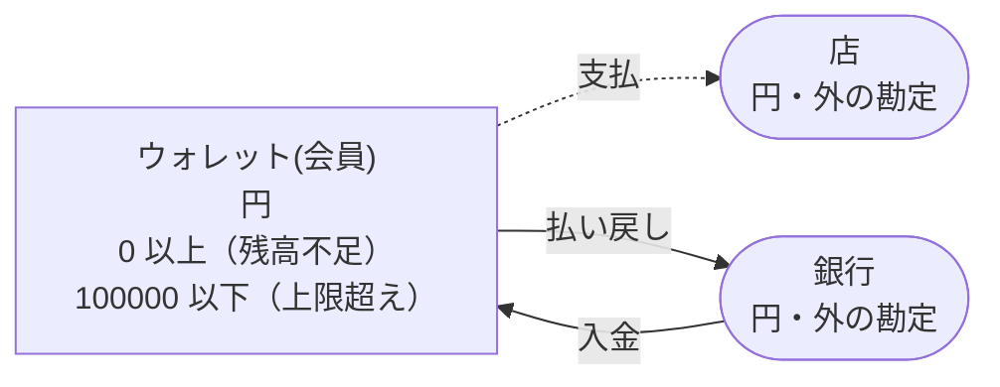
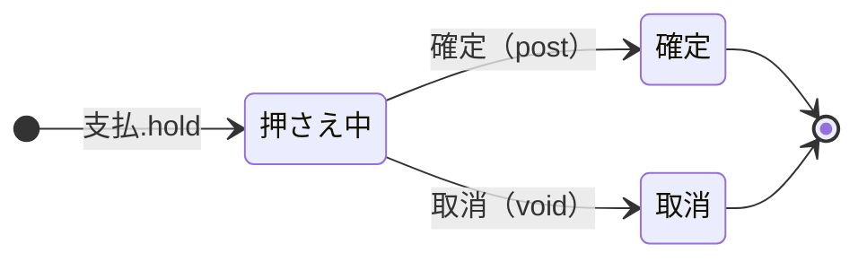

<!-- `chobo doc tests/books/ウォレット.book --lang ja` の出力です。手で編集しないでください。 -->

# ウォレット v1

会員ごとのウォレット。銀行からの入金で増え、支払いのあいだ押さえ、払い戻しで銀行へ戻す

`chobo doc` が `tests/books/ウォレット.book` から作ったページ。勘定ごとに残高を持ち、残高は入った量から出た量を引いたもの。どの振替も勘定の下限と上限を守り、守れない振替は、その境界に付けた名前で断られて、どの移動も行われない。振替には、すぐに動かすもの（`do`）と、動かす量をまず押さえるもの（`hold`）がある。押さえた分は、あとで確定される（`post`。全部か一部）か、取り消される（`void`）か、有効期限で切れる。

## 勘定

| 勘定 | 分け方 | 単位 | 境界 | 説明 |
|---|---|---|---|---|
| `ウォレット` | `会員` ごと | 円 | 0 以上。下回る振替は `残高不足` で断る<br>100000 以下。超える振替は `上限超え` で断る |  |
| `銀行` | 一つだけ | 円 | 外の勘定。境界は無く、マイナスにもなる |  |
| `店` | 一つだけ | 円 | 外の勘定。境界は無く、マイナスにもなる |  |

## 勘定のあいだの流れ



四角は勘定で、矢印は振替の移動。角の丸い四角は外の勘定で、境界を持たない。破線の矢印は仮押さえの振替で、まず押さえ、確定したときに動く。

## 振替

### 入金

- 移動: `銀行` から `ウォレット(会員)` へ `額`。
- キー: `入金番号` ごとに一回。同じ呼び出しの二度目は何もせず、`done_before` を返す。`会員` か `額` だけが違う二度目は `key_conflict` で断られる。
- すぐに動かす（`do`）。

| 操作 | 断られうる理由 | いつ |
|---|---|---|
| `入金.do` | `上限超え` | `ウォレット(会員)` が 100000 を超える |
| `入金.do` | `key_conflict` | `入金番号` が同じで、ほかの引数が違う呼び出しが、前に済んでいる |
| `入金.do` | `already_refused` | `入金番号` が同じ呼び出しが、前に境界で断られている。境界で断られたキーは、あとで足りるようになっても通らない |

<details><summary>断られる例</summary>

#### 入金.do: 上限超え

```text
 1  入金.do(入金番号: 入金番号-1, 会員: 会員-2, 額: 100000)  通る
 2  入金.do(入金番号: 入金番号-3, 会員: 会員-2, 額: 1)       上限超え で断られる（1 つ目の移動が ウォレット(会員-2) へ 1 を入れる。確定 100000、入ってくる仮押さえ 0）
```

#### 入金.do: key_conflict

```text
 1  入金.do(入金番号: 入金番号-1, 会員: 会員-2, 額: 1)  通る
 2  入金.do(入金番号: 入金番号-1, 会員: 会員-2, 額: 2)  key_conflict で断られる
```

#### 入金.do: already_refused

```text
 1  入金.do(入金番号: 入金番号-1, 会員: 会員-2, 額: 100000)  通る
 2  入金.do(入金番号: 入金番号-3, 会員: 会員-2, 額: 1)       上限超え で断られる（1 つ目の移動が ウォレット(会員-2) へ 1 を入れる。確定 100000、入ってくる仮押さえ 0）
 3  入金.do(入金番号: 入金番号-3, 会員: 会員-2, 額: 1)       already_refused で断られる
```

</details>

### 支払

出荷で確定し、キャンセルで取り消す。押さえを終わらせるのは呼ぶ側だけ

- 移動: `ウォレット(会員)` から `店` へ `額`。
- キー: `注文` ごとに一回。同じ呼び出しの二度目は何もせず、`done_before` を返す。`会員` か `額` だけが違う二度目は `key_conflict` で断られる。押さえが終わったあとに同じキーで押さえ直すと `done_before` になり、何も押さえない。
- 仮押さえ: まず押さえる。確定と取消は呼ぶ側がする。期限は無く、どちらかが来るまで押さえたまま。



| 仮押さえの状態 | post（確定） | void（取消） |
|---|---|---|
| 押さえ中 | 確定する。額を渡せばその額、渡さなければ全額で、残りは元に戻る。押さえた額を超えれば `over_hold` で断る | 取り消す。押さえた量は元に戻る |
| 確定 | 同じ額なら `done_before`、違う額なら `key_conflict` で断る | `already_posted` で断る |
| 取消 | `already_voided` で断る | `done_before` |
| 仮押さえが無い | `no_such_hold` で断る | `no_such_hold` で断る |

| 操作 | 断られうる理由 | いつ |
|---|---|---|
| `支払.hold` | `残高不足` | `ウォレット(会員)` が 0 を下回る |
| `支払.hold` | `key_conflict` | `注文` が同じで、ほかの引数が違う呼び出しが、前に済んでいる |
| `支払.hold` | `already_refused` | `注文` が同じ呼び出しが、前に境界で断られている。境界で断られたキーは、あとで足りるようになっても通らない |
| `支払.post` | `key_conflict` | 仮押さえは、違う額で確定済み |
| `支払.post` | `already_voided` | 仮押さえはもう取り消されている |
| `支払.post` | `over_hold` | 押さえた額より多く確定しようとした |
| `支払.post` | `no_such_hold` | その `注文` の仮押さえが無い |
| `支払.void` | `already_posted` | 仮押さえはもう確定している |
| `支払.void` | `no_such_hold` | その `注文` の仮押さえが無い |

<details><summary>断られる例</summary>

#### 支払.hold: 残高不足

```text
 1  支払.hold(注文: 注文-1, 会員: 会員-2, 額: 1)  残高不足 で断られる（1 つ目の移動が ウォレット(会員-2) から 1 を取る。確定 0、出ていく仮押さえ 0）
```

#### 支払.hold: key_conflict

```text
 1  入金.do(入金番号: 入金番号-1, 会員: 会員-2, 額: 1)  通る
 2  支払.hold(注文: 注文-3, 会員: 会員-2, 額: 1)        通る
 3  支払.hold(注文: 注文-3, 会員: 会員-2, 額: 2)        key_conflict で断られる
```

#### 支払.hold: already_refused

```text
 1  支払.hold(注文: 注文-1, 会員: 会員-2, 額: 1)  残高不足 で断られる（1 つ目の移動が ウォレット(会員-2) から 1 を取る。確定 0、出ていく仮押さえ 0）
 2  支払.hold(注文: 注文-1, 会員: 会員-2, 額: 1)  already_refused で断られる
```

#### 支払.post: key_conflict

```text
 1  入金.do(入金番号: 入金番号-1, 会員: 会員-2, 額: 2)  通る
 2  支払.hold(注文: 注文-3, 会員: 会員-2, 額: 2)        通る
 3  支払.post(注文: 注文-3)                             通る
 4  支払.post(注文: 注文-3, 額: 1)                      key_conflict で断られる
```

#### 支払.post: already_voided

```text
 1  入金.do(入金番号: 入金番号-1, 会員: 会員-2, 額: 2)  通る
 2  支払.hold(注文: 注文-3, 会員: 会員-2, 額: 2)        通る
 3  支払.void(注文: 注文-3)                             通る
 4  支払.post(注文: 注文-3)                             already_voided で断られる
```

#### 支払.post: over_hold

```text
 1  入金.do(入金番号: 入金番号-1, 会員: 会員-2, 額: 2)  通る
 2  支払.hold(注文: 注文-3, 会員: 会員-2, 額: 2)        通る
 3  支払.post(注文: 注文-3, 額: 3)                      over_hold で断られる
```

#### 支払.post: no_such_hold

```text
 1  支払.post(注文: 注文-1)  no_such_hold で断られる
```

#### 支払.void: already_posted

```text
 1  入金.do(入金番号: 入金番号-1, 会員: 会員-2, 額: 2)  通る
 2  支払.hold(注文: 注文-3, 会員: 会員-2, 額: 2)        通る
 3  支払.post(注文: 注文-3)                             通る
 4  支払.void(注文: 注文-3)                             already_posted で断られる
```

#### 支払.void: no_such_hold

```text
 1  支払.void(注文: 注文-1)  no_such_hold で断られる
```

</details>

### 払い戻し

- 移動: `ウォレット(会員)` から `銀行` へ `額`。
- キー: `払戻番号` ごとに一回。同じ呼び出しの二度目は何もせず、`done_before` を返す。`会員` か `額` だけが違う二度目は `key_conflict` で断られる。
- すぐに動かす（`do`）。

| 操作 | 断られうる理由 | いつ |
|---|---|---|
| `払い戻し.do` | `残高不足` | `ウォレット(会員)` が 0 を下回る |
| `払い戻し.do` | `key_conflict` | `払戻番号` が同じで、ほかの引数が違う呼び出しが、前に済んでいる |
| `払い戻し.do` | `already_refused` | `払戻番号` が同じ呼び出しが、前に境界で断られている。境界で断られたキーは、あとで足りるようになっても通らない |

<details><summary>断られる例</summary>

#### 払い戻し.do: 残高不足

```text
 1  払い戻し.do(払戻番号: 払戻番号-1, 会員: 会員-2, 額: 1)  残高不足 で断られる（1 つ目の移動が ウォレット(会員-2) から 1 を取る。確定 0、出ていく仮押さえ 0）
```

#### 払い戻し.do: key_conflict

```text
 1  入金.do(入金番号: 入金番号-1, 会員: 会員-2, 額: 1)      通る
 2  払い戻し.do(払戻番号: 払戻番号-3, 会員: 会員-2, 額: 1)  通る
 3  払い戻し.do(払戻番号: 払戻番号-3, 会員: 会員-2, 額: 2)  key_conflict で断られる
```

#### 払い戻し.do: already_refused

```text
 1  払い戻し.do(払戻番号: 払戻番号-1, 会員: 会員-2, 額: 1)  残高不足 で断られる（1 つ目の移動が ウォレット(会員-2) から 1 を取る。確定 0、出ていく仮押さえ 0）
 2  払い戻し.do(払戻番号: 払戻番号-1, 会員: 会員-2, 額: 1)  already_refused で断られる
```

</details>

## シナリオ

`chobo scenarios` が帳簿から作ったシナリオ 29 本。境界の手前・ちょうど・超える、同じキーの二度目、仮押さえの終わり方、二つの呼び出し元が同時に最後の一つを取りに来るもの、などがある。どれも参照インタプリタで流し、ステップごとに、そのあとの残高を載せる。残高は確定した量で、仮押さえがあれば括弧の中に書く。

<details><summary>1. 境界: 入金.do が ウォレット(会員) を 99999 まで増やす。<code>at most 100000</code> の 1 つ手前</summary>

| # | 操作 | 結果 | ウォレット(会員-2) | 銀行 |
|---|---|---|---|---|
| 1 | 入金.do(入金番号: 入金番号-1, 会員: 会員-2, 額: 99998) | 通る | 99998 | -99998 |
| 2 | 入金.do(入金番号: 入金番号-3, 会員: 会員-2, 額: 1) | 通る | 99999 | -99999 |

</details>

<details><summary>2. 境界: 入金.do が ウォレット(会員) をちょうど 100000 まで増やす。<code>at most 100000</code> ちょうど</summary>

| # | 操作 | 結果 | ウォレット(会員-2) | 銀行 |
|---|---|---|---|---|
| 1 | 入金.do(入金番号: 入金番号-1, 会員: 会員-2, 額: 99998) | 通る | 99998 | -99998 |
| 2 | 入金.do(入金番号: 入金番号-3, 会員: 会員-2, 額: 2) | 通る | 100000 | -100000 |

</details>

<details><summary>3. 境界: 入金.do は ウォレット(会員) を 100001 まで増やすので断られる。<code>at most 100000</code> を超える</summary>

| # | 操作 | 結果 | ウォレット(会員-2) | 銀行 |
|---|---|---|---|---|
| 1 | 入金.do(入金番号: 入金番号-1, 会員: 会員-2, 額: 99998) | 通る | 99998 | -99998 |
| 2 | 入金.do(入金番号: 入金番号-3, 会員: 会員-2, 額: 3) | 上限超え で断られる | 99998 | -99998 |

</details>

<details><summary>4. 境界: 支払.hold が ウォレット(会員) を 1 まで減らす。<code>at least 0</code> の 1 つ手前</summary>

| # | 操作 | 結果 | ウォレット(会員-2) | 銀行 | 店 |
|---|---|---|---|---|---|
| 1 | 入金.do(入金番号: 入金番号-1, 会員: 会員-2, 額: 2) | 通る | 2 | -2 | 0 |
| 2 | 支払.hold(注文: 注文-3, 会員: 会員-2, 額: 1) | 通る | 2（出ていく仮押さえ 1） | -2 | 0（入ってくる仮押さえ 1） |

</details>

<details><summary>5. 境界: 支払.hold が ウォレット(会員) をちょうど 0 まで減らす。<code>at least 0</code> ちょうど</summary>

| # | 操作 | 結果 | ウォレット(会員-2) | 銀行 | 店 |
|---|---|---|---|---|---|
| 1 | 入金.do(入金番号: 入金番号-1, 会員: 会員-2, 額: 2) | 通る | 2 | -2 | 0 |
| 2 | 支払.hold(注文: 注文-3, 会員: 会員-2, 額: 2) | 通る | 2（出ていく仮押さえ 2） | -2 | 0（入ってくる仮押さえ 2） |

</details>

<details><summary>6. 境界: 支払.hold は ウォレット(会員) を -1 まで減らすので断られる。<code>at least 0</code> を割る</summary>

| # | 操作 | 結果 | ウォレット(会員-2) | 銀行 | 店 |
|---|---|---|---|---|---|
| 1 | 入金.do(入金番号: 入金番号-1, 会員: 会員-2, 額: 2) | 通る | 2 | -2 | 0 |
| 2 | 支払.hold(注文: 注文-3, 会員: 会員-2, 額: 3) | 残高不足 で断られる | 2 | -2 | 0 |

</details>

<details><summary>7. 境界: 払い戻し.do が ウォレット(会員) を 1 まで減らす。<code>at least 0</code> の 1 つ手前</summary>

| # | 操作 | 結果 | ウォレット(会員-2) | 銀行 |
|---|---|---|---|---|
| 1 | 入金.do(入金番号: 入金番号-1, 会員: 会員-2, 額: 2) | 通る | 2 | -2 |
| 2 | 払い戻し.do(払戻番号: 払戻番号-3, 会員: 会員-2, 額: 1) | 通る | 1 | -1 |

</details>

<details><summary>8. 境界: 払い戻し.do が ウォレット(会員) をちょうど 0 まで減らす。<code>at least 0</code> ちょうど</summary>

| # | 操作 | 結果 | ウォレット(会員-2) | 銀行 |
|---|---|---|---|---|
| 1 | 入金.do(入金番号: 入金番号-1, 会員: 会員-2, 額: 2) | 通る | 2 | -2 |
| 2 | 払い戻し.do(払戻番号: 払戻番号-3, 会員: 会員-2, 額: 2) | 通る | 0 | 0 |

</details>

<details><summary>9. 境界: 払い戻し.do は ウォレット(会員) を -1 まで減らすので断られる。<code>at least 0</code> を割る</summary>

| # | 操作 | 結果 | ウォレット(会員-2) | 銀行 |
|---|---|---|---|---|
| 1 | 入金.do(入金番号: 入金番号-1, 会員: 会員-2, 額: 2) | 通る | 2 | -2 |
| 2 | 払い戻し.do(払戻番号: 払戻番号-3, 会員: 会員-2, 額: 3) | 残高不足 で断られる | 2 | -2 |

</details>

<details><summary>10. キー: 入金.do を同じ引数で二度呼ぶ</summary>

| # | 操作 | 結果 | ウォレット(会員-2) | 銀行 |
|---|---|---|---|---|
| 1 | 入金.do(入金番号: 入金番号-1, 会員: 会員-2, 額: 1) | 通る | 1 | -1 |
| 2 | 入金.do(入金番号: 入金番号-1, 会員: 会員-2, 額: 1) | done_before（前に済んでいる） | 1 | -1 |

</details>

<details><summary>11. キー: 入金.do を 額 だけ変えてもう一度呼ぶ</summary>

| # | 操作 | 結果 | ウォレット(会員-2) | 銀行 |
|---|---|---|---|---|
| 1 | 入金.do(入金番号: 入金番号-1, 会員: 会員-2, 額: 1) | 通る | 1 | -1 |
| 2 | 入金.do(入金番号: 入金番号-1, 会員: 会員-2, 額: 2) | key_conflict で断られる | 1 | -1 |

</details>

<details><summary>12. キー: 入金.do が 上限超え で断られ、同じ引数でもう一度呼ぶ</summary>

| # | 操作 | 結果 | ウォレット(会員-2) | 銀行 |
|---|---|---|---|---|
| 1 | 入金.do(入金番号: 入金番号-1, 会員: 会員-2, 額: 100000) | 通る | 100000 | -100000 |
| 2 | 入金.do(入金番号: 入金番号-3, 会員: 会員-2, 額: 1) | 上限超え で断られる | 100000 | -100000 |
| 3 | 入金.do(入金番号: 入金番号-3, 会員: 会員-2, 額: 1) | already_refused で断られる | 100000 | -100000 |

</details>

<details><summary>13. キー: 支払.hold を同じ引数で二度呼ぶ</summary>

| # | 操作 | 結果 | ウォレット(会員-2) | 銀行 | 店 |
|---|---|---|---|---|---|
| 1 | 入金.do(入金番号: 入金番号-1, 会員: 会員-2, 額: 1) | 通る | 1 | -1 | 0 |
| 2 | 支払.hold(注文: 注文-3, 会員: 会員-2, 額: 1) | 通る | 1（出ていく仮押さえ 1） | -1 | 0（入ってくる仮押さえ 1） |
| 3 | 支払.hold(注文: 注文-3, 会員: 会員-2, 額: 1) | done_before（前に済んでいる） | 1（出ていく仮押さえ 1） | -1 | 0（入ってくる仮押さえ 1） |

</details>

<details><summary>14. キー: 支払.hold を 額 だけ変えてもう一度呼ぶ</summary>

| # | 操作 | 結果 | ウォレット(会員-2) | 銀行 | 店 |
|---|---|---|---|---|---|
| 1 | 入金.do(入金番号: 入金番号-1, 会員: 会員-2, 額: 1) | 通る | 1 | -1 | 0 |
| 2 | 支払.hold(注文: 注文-3, 会員: 会員-2, 額: 1) | 通る | 1（出ていく仮押さえ 1） | -1 | 0（入ってくる仮押さえ 1） |
| 3 | 支払.hold(注文: 注文-3, 会員: 会員-2, 額: 2) | key_conflict で断られる | 1（出ていく仮押さえ 1） | -1 | 0（入ってくる仮押さえ 1） |

</details>

<details><summary>15. キー: 支払.hold が 残高不足 で断られ、同じ引数でもう一度、ウォレット(会員) が足りるようになってからもう一度呼ぶ</summary>

| # | 操作 | 結果 | ウォレット(会員-2) | 銀行 | 店 |
|---|---|---|---|---|---|
| 1 | 支払.hold(注文: 注文-1, 会員: 会員-2, 額: 1) | 残高不足 で断られる | 0 | 0 | 0 |
| 2 | 支払.hold(注文: 注文-1, 会員: 会員-2, 額: 1) | already_refused で断られる | 0 | 0 | 0 |
| 3 | 入金.do(入金番号: 入金番号-3, 会員: 会員-2, 額: 1) | 通る | 1 | -1 | 0 |
| 4 | 支払.hold(注文: 注文-1, 会員: 会員-2, 額: 1) | already_refused で断られる | 1 | -1 | 0 |

</details>

<details><summary>16. キー: 払い戻し.do を同じ引数で二度呼ぶ</summary>

| # | 操作 | 結果 | ウォレット(会員-2) | 銀行 |
|---|---|---|---|---|
| 1 | 入金.do(入金番号: 入金番号-1, 会員: 会員-2, 額: 1) | 通る | 1 | -1 |
| 2 | 払い戻し.do(払戻番号: 払戻番号-3, 会員: 会員-2, 額: 1) | 通る | 0 | 0 |
| 3 | 払い戻し.do(払戻番号: 払戻番号-3, 会員: 会員-2, 額: 1) | done_before（前に済んでいる） | 0 | 0 |

</details>

<details><summary>17. キー: 払い戻し.do を 額 だけ変えてもう一度呼ぶ</summary>

| # | 操作 | 結果 | ウォレット(会員-2) | 銀行 |
|---|---|---|---|---|
| 1 | 入金.do(入金番号: 入金番号-1, 会員: 会員-2, 額: 1) | 通る | 1 | -1 |
| 2 | 払い戻し.do(払戻番号: 払戻番号-3, 会員: 会員-2, 額: 1) | 通る | 0 | 0 |
| 3 | 払い戻し.do(払戻番号: 払戻番号-3, 会員: 会員-2, 額: 2) | key_conflict で断られる | 0 | 0 |

</details>

<details><summary>18. キー: 払い戻し.do が 残高不足 で断られ、同じ引数でもう一度、ウォレット(会員) が足りるようになってからもう一度呼ぶ</summary>

| # | 操作 | 結果 | ウォレット(会員-2) | 銀行 |
|---|---|---|---|---|
| 1 | 払い戻し.do(払戻番号: 払戻番号-1, 会員: 会員-2, 額: 1) | 残高不足 で断られる | 0 | 0 |
| 2 | 払い戻し.do(払戻番号: 払戻番号-1, 会員: 会員-2, 額: 1) | already_refused で断られる | 0 | 0 |
| 3 | 入金.do(入金番号: 入金番号-3, 会員: 会員-2, 額: 1) | 通る | 1 | -1 |
| 4 | 払い戻し.do(払戻番号: 払戻番号-1, 会員: 会員-2, 額: 1) | already_refused で断られる | 1 | -1 |

</details>

<details><summary>19. 仮押さえ: 支払 を全額で確定する</summary>

| # | 操作 | 結果 | ウォレット(会員-2) | 銀行 | 店 |
|---|---|---|---|---|---|
| 1 | 入金.do(入金番号: 入金番号-1, 会員: 会員-2, 額: 2) | 通る | 2 | -2 | 0 |
| 2 | 支払.hold(注文: 注文-3, 会員: 会員-2, 額: 2) | 通る | 2（出ていく仮押さえ 2） | -2 | 0（入ってくる仮押さえ 2） |
| 3 | 支払.post(注文: 注文-3) | 通る | 0 | -2 | 2 |

</details>

<details><summary>20. 仮押さえ: 支払 を一部だけ確定する</summary>

| # | 操作 | 結果 | ウォレット(会員-2) | 銀行 | 店 |
|---|---|---|---|---|---|
| 1 | 入金.do(入金番号: 入金番号-1, 会員: 会員-2, 額: 2) | 通る | 2 | -2 | 0 |
| 2 | 支払.hold(注文: 注文-3, 会員: 会員-2, 額: 2) | 通る | 2（出ていく仮押さえ 2） | -2 | 0（入ってくる仮押さえ 2） |
| 3 | 支払.post(注文: 注文-3, 額: 1) | 通る | 1 | -2 | 1 |

</details>

<details><summary>21. 仮押さえ: 支払 を取り消す</summary>

| # | 操作 | 結果 | ウォレット(会員-2) | 銀行 | 店 |
|---|---|---|---|---|---|
| 1 | 入金.do(入金番号: 入金番号-1, 会員: 会員-2, 額: 2) | 通る | 2 | -2 | 0 |
| 2 | 支払.hold(注文: 注文-3, 会員: 会員-2, 額: 2) | 通る | 2（出ていく仮押さえ 2） | -2 | 0（入ってくる仮押さえ 2） |
| 3 | 支払.void(注文: 注文-3) | 通る | 2 | -2 | 0 |

</details>

<details><summary>22. 仮押さえ: 支払 を確定してから取り消そうとする</summary>

| # | 操作 | 結果 | ウォレット(会員-2) | 銀行 | 店 |
|---|---|---|---|---|---|
| 1 | 入金.do(入金番号: 入金番号-1, 会員: 会員-2, 額: 2) | 通る | 2 | -2 | 0 |
| 2 | 支払.hold(注文: 注文-3, 会員: 会員-2, 額: 2) | 通る | 2（出ていく仮押さえ 2） | -2 | 0（入ってくる仮押さえ 2） |
| 3 | 支払.post(注文: 注文-3) | 通る | 0 | -2 | 2 |
| 4 | 支払.void(注文: 注文-3) | already_posted で断られる | 0 | -2 | 2 |

</details>

<details><summary>23. 仮押さえ: 支払 を取り消してから確定しようとする</summary>

| # | 操作 | 結果 | ウォレット(会員-2) | 銀行 | 店 |
|---|---|---|---|---|---|
| 1 | 入金.do(入金番号: 入金番号-1, 会員: 会員-2, 額: 2) | 通る | 2 | -2 | 0 |
| 2 | 支払.hold(注文: 注文-3, 会員: 会員-2, 額: 2) | 通る | 2（出ていく仮押さえ 2） | -2 | 0（入ってくる仮押さえ 2） |
| 3 | 支払.void(注文: 注文-3) | 通る | 2 | -2 | 0 |
| 4 | 支払.post(注文: 注文-3) | already_voided で断られる | 2 | -2 | 0 |

</details>

<details><summary>24. 仮押さえ: 支払 を押さえた額より多く確定しようとし、押さえた額で確定する</summary>

| # | 操作 | 結果 | ウォレット(会員-2) | 銀行 | 店 |
|---|---|---|---|---|---|
| 1 | 入金.do(入金番号: 入金番号-1, 会員: 会員-2, 額: 2) | 通る | 2 | -2 | 0 |
| 2 | 支払.hold(注文: 注文-3, 会員: 会員-2, 額: 2) | 通る | 2（出ていく仮押さえ 2） | -2 | 0（入ってくる仮押さえ 2） |
| 3 | 支払.post(注文: 注文-3, 額: 3) | over_hold で断られる | 2（出ていく仮押さえ 2） | -2 | 0（入ってくる仮押さえ 2） |
| 4 | 支払.post(注文: 注文-3, 額: 2) | 通る | 0 | -2 | 2 |

</details>

<details><summary>25. 仮押さえ: 支払 を押さえる前に確定しようとし、押さえてから確定する</summary>

| # | 操作 | 結果 | ウォレット(会員-2) | 銀行 | 店 |
|---|---|---|---|---|---|
| 1 | 支払.post(注文: 注文-1) | no_such_hold で断られる | 0 | 0 | 0 |
| 2 | 入金.do(入金番号: 入金番号-1, 会員: 会員-2, 額: 1) | 通る | 1 | -1 | 0 |
| 3 | 支払.hold(注文: 注文-1, 会員: 会員-2, 額: 1) | 通る | 1（出ていく仮押さえ 1） | -1 | 0（入ってくる仮押さえ 1） |
| 4 | 支払.post(注文: 注文-1) | 通る | 0 | -1 | 1 |

</details>

<details><summary>26. 仮押さえ: 支払 を二度確定する。同じ額で、そして違う額で</summary>

| # | 操作 | 結果 | ウォレット(会員-2) | 銀行 | 店 |
|---|---|---|---|---|---|
| 1 | 入金.do(入金番号: 入金番号-1, 会員: 会員-2, 額: 2) | 通る | 2 | -2 | 0 |
| 2 | 支払.hold(注文: 注文-3, 会員: 会員-2, 額: 2) | 通る | 2（出ていく仮押さえ 2） | -2 | 0（入ってくる仮押さえ 2） |
| 3 | 支払.post(注文: 注文-3) | 通る | 0 | -2 | 2 |
| 4 | 支払.post(注文: 注文-3) | done_before（前に済んでいる） | 0 | -2 | 2 |
| 5 | 支払.post(注文: 注文-3, 額: 2) | done_before（前に済んでいる） | 0 | -2 | 2 |
| 6 | 支払.post(注文: 注文-3, 額: 1) | key_conflict で断られる | 0 | -2 | 2 |

</details>

<details><summary>27. 同時: 二つの呼び出し元が 入金.do で ウォレット(会員) の最後の空き 1 を取り合う</summary>

同時の操作の順序によって、結果は 2 通りある。

結果 1:

| # | 操作 | 結果 | ウォレット(会員-2) | 銀行 |
|---|---|---|---|---|
| 1 | 入金.do(入金番号: 入金番号-1, 会員: 会員-2, 額: 99999) | 通る | 99999 | -99999 |
| 2 | together<br>呼び出し元 1: 入金.do(入金番号: 入金番号-3, 会員: 会員-2, 額: 1)<br>呼び出し元 2: 入金.do(入金番号: 入金番号-4, 会員: 会員-2, 額: 1) | <br>通る<br>上限超え で断られる | 100000 | -100000 |

結果 2:

| # | 操作 | 結果 | ウォレット(会員-2) | 銀行 |
|---|---|---|---|---|
| 1 | 入金.do(入金番号: 入金番号-1, 会員: 会員-2, 額: 99999) | 通る | 99999 | -99999 |
| 2 | together<br>呼び出し元 1: 入金.do(入金番号: 入金番号-3, 会員: 会員-2, 額: 1)<br>呼び出し元 2: 入金.do(入金番号: 入金番号-4, 会員: 会員-2, 額: 1) | <br>上限超え で断られる<br>通る | 100000 | -100000 |

</details>

<details><summary>28. 同時: 二つの呼び出し元が 支払.hold で ウォレット(会員) の最後の 1 を取り合う</summary>

同時の操作の順序によって、結果は 2 通りある。

結果 1:

| # | 操作 | 結果 | ウォレット(会員-2) | 銀行 | 店 |
|---|---|---|---|---|---|
| 1 | 入金.do(入金番号: 入金番号-1, 会員: 会員-2, 額: 1) | 通る | 1 | -1 | 0 |
| 2 | together<br>呼び出し元 1: 支払.hold(注文: 注文-3, 会員: 会員-2, 額: 1)<br>呼び出し元 2: 支払.hold(注文: 注文-4, 会員: 会員-2, 額: 1) | <br>通る<br>残高不足 で断られる | 1（出ていく仮押さえ 1） | -1 | 0（入ってくる仮押さえ 1） |

結果 2:

| # | 操作 | 結果 | ウォレット(会員-2) | 銀行 | 店 |
|---|---|---|---|---|---|
| 1 | 入金.do(入金番号: 入金番号-1, 会員: 会員-2, 額: 1) | 通る | 1 | -1 | 0 |
| 2 | together<br>呼び出し元 1: 支払.hold(注文: 注文-3, 会員: 会員-2, 額: 1)<br>呼び出し元 2: 支払.hold(注文: 注文-4, 会員: 会員-2, 額: 1) | <br>残高不足 で断られる<br>通る | 1（出ていく仮押さえ 1） | -1 | 0（入ってくる仮押さえ 1） |

</details>

<details><summary>29. 同時: 二つの呼び出し元が 払い戻し.do で ウォレット(会員) の最後の 1 を取り合う</summary>

同時の操作の順序によって、結果は 2 通りある。

結果 1:

| # | 操作 | 結果 | ウォレット(会員-2) | 銀行 |
|---|---|---|---|---|
| 1 | 入金.do(入金番号: 入金番号-1, 会員: 会員-2, 額: 1) | 通る | 1 | -1 |
| 2 | together<br>呼び出し元 1: 払い戻し.do(払戻番号: 払戻番号-3, 会員: 会員-2, 額: 1)<br>呼び出し元 2: 払い戻し.do(払戻番号: 払戻番号-4, 会員: 会員-2, 額: 1) | <br>通る<br>残高不足 で断られる | 0 | 0 |

結果 2:

| # | 操作 | 結果 | ウォレット(会員-2) | 銀行 |
|---|---|---|---|---|
| 1 | 入金.do(入金番号: 入金番号-1, 会員: 会員-2, 額: 1) | 通る | 1 | -1 |
| 2 | together<br>呼び出し元 1: 払い戻し.do(払戻番号: 払戻番号-3, 会員: 会員-2, 額: 1)<br>呼び出し元 2: 払い戻し.do(払戻番号: 払戻番号-4, 会員: 会員-2, 額: 1) | <br>残高不足 で断られる<br>通る | 0 | 0 |

</details>

