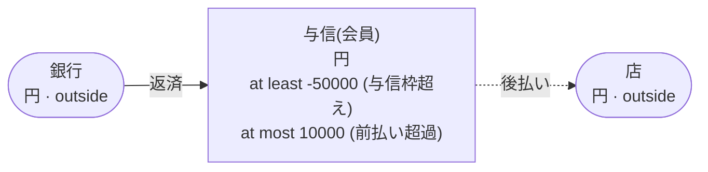
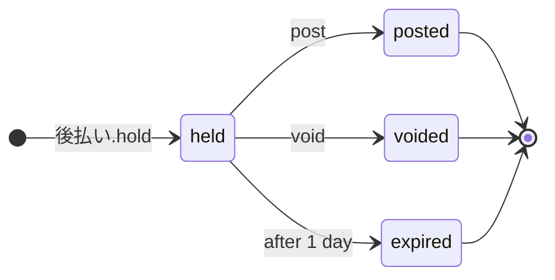

<!-- The output of `chobo doc tests/books/与信.book`. Do not edit by hand. -->

# 与信 v1

会員ごとの後払いの枠。使えるのはマイナス 50000 円まで、前払いは 10000 円まで

`tests/books/与信.book`, as `chobo doc` writes it. Each account keeps a balance: what came in, less what went out. Every transfer keeps the bounds of the accounts: one that would break a bound is refused with the name the book gives that bound, and nothing of it moves. A transfer either moves at once (`do`), or first holds what it moves (`hold`); a hold is then posted (`post`, all of it or part), voided (`void`), or expires.

## Accounts

| Account | One for each | Unit | Bounds | What it is |
|---|---|---|---|---|
| `与信` | `会員` | 円 | at least -50000; a transfer that would go below is refused with `与信枠超え`<br>at most 10000; a transfer that would go above is refused with `前払い超過` |  |
| `店` | one account | 円 | outside the book: no bounds, and it may go below 0 |  |
| `銀行` | one account | 円 | outside the book: no bounds, and it may go below 0 |  |

## How things move



A box is an account, and an arrow a move of a transfer. A rounded box is an account outside the book, which has no bounds. A dashed arrow belongs to a transfer that holds first, and moves when the hold is posted.

## Transfers

### 後払い

- Moves `額` from `与信(会員)` to `店`.
- Key: once per `注文`. The same call again does nothing, and answers `done_before`; one that differs only in `会員` or `額` is refused with `key_conflict`; holding again with the same key after the hold has ended answers `done_before`, and holds nothing.
- Holds first: the caller posts or voids the hold. It expires 1 day after it was made, and what it holds goes back.



| The hold | post | void |
|---|---|---|
| held | posts it: the amounts given, or all of it, and the rest goes back; more than it holds is refused with `over_hold`; once 1 day have passed since it was held, refused with `expired` | voids it: what it holds goes back; once 1 day have passed since it was held, refused with `expired` |
| posted | `done_before` with the same amounts; refused with `key_conflict` with others | refused with `already_posted` |
| voided | refused with `already_voided` | `done_before` |
| expired | refused with `expired` | refused with `expired` |
| no hold with the key | refused with `no_such_hold` | refused with `no_such_hold` |

| Operation | May be refused with | When |
|---|---|---|
| `後払い.hold` | `与信枠超え` | `与信(会員)` would go below -50000 |
| `後払い.hold` | `key_conflict` | a call with the same `注文` and other arguments came before |
| `後払い.hold` | `already_refused` | a call with the same `注文` was refused by a bound before; a key a bound refused stays refused, even once there is enough |
| `後払い.post` | `key_conflict` | the hold was posted before, for other amounts |
| `後払い.post` | `already_voided` | the hold is voided already |
| `後払い.post` | `expired` | the hold has expired |
| `後払い.post` | `over_hold` | more than the hold holds |
| `後払い.post` | `no_such_hold` | there is no hold with that `注文` |
| `後払い.void` | `already_posted` | the hold is posted already |
| `後払い.void` | `expired` | the hold has expired |
| `後払い.void` | `no_such_hold` | there is no hold with that `注文` |

<details><summary>How each refusal comes about</summary>

#### 後払い.hold: 与信枠超え

```text
 1  後払い.hold(注文: 注文-1, 会員: 会員-2, 額: 50001)  refused: 与信枠超え (move 1 takes 50001 from 与信(会員-2): posted 0, held out 0)
```

#### 後払い.hold: key_conflict

```text
 1  後払い.hold(注文: 注文-1, 会員: 会員-2, 額: 1)  done
 2  後払い.hold(注文: 注文-1, 会員: 会員-2, 額: 2)  refused: key_conflict
```

#### 後払い.hold: already_refused

```text
 1  後払い.hold(注文: 注文-1, 会員: 会員-2, 額: 50001)  refused: 与信枠超え (move 1 takes 50001 from 与信(会員-2): posted 0, held out 0)
 2  後払い.hold(注文: 注文-1, 会員: 会員-2, 額: 50001)  refused: already_refused
```

#### 後払い.post: key_conflict

```text
 1  後払い.hold(注文: 注文-1, 会員: 会員-2, 額: 2)  done
 2  後払い.post(注文: 注文-1)                       done
 3  後払い.post(注文: 注文-1, 額: 1)                refused: key_conflict
```

#### 後払い.post: already_voided

```text
 1  後払い.hold(注文: 注文-1, 会員: 会員-2, 額: 2)  done
 2  後払い.void(注文: 注文-1)                       done
 3  後払い.post(注文: 注文-1)                       refused: already_voided
```

#### 後払い.post: expired

```text
 1  後払い.hold(注文: 注文-1, 会員: 会員-2, 額: 2)  done
 2  pass 1 day                                      後払い(注文-1) expired
 3  後払い.post(注文: 注文-1)                       refused: expired
```

#### 後払い.post: over_hold

```text
 1  後払い.hold(注文: 注文-1, 会員: 会員-2, 額: 2)  done
 2  後払い.post(注文: 注文-1, 額: 3)                refused: over_hold
```

#### 後払い.post: no_such_hold

```text
 1  後払い.post(注文: 注文-1)  refused: no_such_hold
```

#### 後払い.void: already_posted

```text
 1  後払い.hold(注文: 注文-1, 会員: 会員-2, 額: 2)  done
 2  後払い.post(注文: 注文-1)                       done
 3  後払い.void(注文: 注文-1)                       refused: already_posted
```

#### 後払い.void: expired

```text
 1  後払い.hold(注文: 注文-1, 会員: 会員-2, 額: 2)  done
 2  pass 1 day                                      後払い(注文-1) expired
 3  後払い.void(注文: 注文-1)                       refused: expired
```

#### 後払い.void: no_such_hold

```text
 1  後払い.void(注文: 注文-1)  refused: no_such_hold
```

</details>

### 返済

- Moves `額` from `銀行` to `与信(会員)`.
- Key: once per `返済番号`. The same call again does nothing, and answers `done_before`; one that differs only in `会員` or `額` is refused with `key_conflict`.
- Moves at once (`do`).

| Operation | May be refused with | When |
|---|---|---|
| `返済.do` | `前払い超過` | `与信(会員)` would go above 10000 |
| `返済.do` | `key_conflict` | a call with the same `返済番号` and other arguments came before |
| `返済.do` | `already_refused` | a call with the same `返済番号` was refused by a bound before; a key a bound refused stays refused, even once there is enough |

<details><summary>How each refusal comes about</summary>

#### 返済.do: 前払い超過

```text
 1  返済.do(返済番号: 返済番号-1, 会員: 会員-2, 額: 10000)  done
 2  返済.do(返済番号: 返済番号-3, 会員: 会員-2, 額: 1)      refused: 前払い超過 (move 1 puts 1 into 与信(会員-2): posted 10000, held in 0)
```

#### 返済.do: key_conflict

```text
 1  返済.do(返済番号: 返済番号-1, 会員: 会員-2, 額: 1)  done
 2  返済.do(返済番号: 返済番号-1, 会員: 会員-2, 額: 2)  refused: key_conflict
```

#### 返済.do: already_refused

```text
 1  返済.do(返済番号: 返済番号-1, 会員: 会員-2, 額: 10000)  done
 2  返済.do(返済番号: 返済番号-3, 会員: 会員-2, 額: 1)      refused: 前払い超過 (move 1 puts 1 into 与信(会員-2): posted 10000, held in 0)
 3  返済.do(返済番号: 返済番号-3, 会員: 会員-2, 額: 1)      refused: already_refused
```

</details>

## Scenarios

24 scenarios, which `chobo scenarios` makes from the book: among them each bound just before, at and past it, each key used twice, every way a hold ends, and two callers after the last of something at the same time. The reference interpreter ran each one; after each step come the balances it left. A balance is what is posted, with what is held in brackets.

<details><summary>1. bound: 後払い.hold takes 与信(会員) to -49999, one above <code>at least -50000</code></summary>

| # | Operation | Result | 与信(会員-2) | 店 | 銀行 |
|---|---|---|---|---|---|
| 1 | 返済.do(返済番号: 返済番号-1, 会員: 会員-2, 額: 2) | done | 2 | 0 | -2 |
| 2 | 後払い.hold(注文: 注文-3, 会員: 会員-2, 額: 50001) | done | 2 (held out 50001) | 0 (held in 50001) | -2 |

</details>

<details><summary>2. bound: 後払い.hold takes 与信(会員) to exactly -50000, its <code>at least -50000</code></summary>

| # | Operation | Result | 与信(会員-2) | 店 | 銀行 |
|---|---|---|---|---|---|
| 1 | 返済.do(返済番号: 返済番号-1, 会員: 会員-2, 額: 2) | done | 2 | 0 | -2 |
| 2 | 後払い.hold(注文: 注文-3, 会員: 会員-2, 額: 50002) | done | 2 (held out 50002) | 0 (held in 50002) | -2 |

</details>

<details><summary>3. bound: 後払い.hold would take 与信(会員) to -50001, below <code>at least -50000</code></summary>

| # | Operation | Result | 与信(会員-2) | 店 | 銀行 |
|---|---|---|---|---|---|
| 1 | 返済.do(返済番号: 返済番号-1, 会員: 会員-2, 額: 2) | done | 2 | 0 | -2 |
| 2 | 後払い.hold(注文: 注文-3, 会員: 会員-2, 額: 50003) | refused: 与信枠超え | 2 | 0 | -2 |

</details>

<details><summary>4. bound: 返済.do fills 与信(会員) to 9999, one below <code>at most 10000</code></summary>

| # | Operation | Result | 与信(会員-2) | 銀行 |
|---|---|---|---|---|
| 1 | 返済.do(返済番号: 返済番号-1, 会員: 会員-2, 額: 9998) | done | 9998 | -9998 |
| 2 | 返済.do(返済番号: 返済番号-3, 会員: 会員-2, 額: 1) | done | 9999 | -9999 |

</details>

<details><summary>5. bound: 返済.do fills 与信(会員) to exactly 10000, its <code>at most 10000</code></summary>

| # | Operation | Result | 与信(会員-2) | 銀行 |
|---|---|---|---|---|
| 1 | 返済.do(返済番号: 返済番号-1, 会員: 会員-2, 額: 9998) | done | 9998 | -9998 |
| 2 | 返済.do(返済番号: 返済番号-3, 会員: 会員-2, 額: 2) | done | 10000 | -10000 |

</details>

<details><summary>6. bound: 返済.do would fill 与信(会員) to 10001, past <code>at most 10000</code></summary>

| # | Operation | Result | 与信(会員-2) | 銀行 |
|---|---|---|---|---|
| 1 | 返済.do(返済番号: 返済番号-1, 会員: 会員-2, 額: 9998) | done | 9998 | -9998 |
| 2 | 返済.do(返済番号: 返済番号-3, 会員: 会員-2, 額: 3) | refused: 前払い超過 | 9998 | -9998 |

</details>

<details><summary>7. key: 後払い.hold twice with the same arguments</summary>

| # | Operation | Result | 与信(会員-2) | 店 |
|---|---|---|---|---|
| 1 | 後払い.hold(注文: 注文-1, 会員: 会員-2, 額: 1) | done | 0 (held out 1) | 0 (held in 1) |
| 2 | 後払い.hold(注文: 注文-1, 会員: 会員-2, 額: 1) | done_before | 0 (held out 1) | 0 (held in 1) |

</details>

<details><summary>8. key: 後払い.hold again with another 額</summary>

| # | Operation | Result | 与信(会員-2) | 店 |
|---|---|---|---|---|
| 1 | 後払い.hold(注文: 注文-1, 会員: 会員-2, 額: 1) | done | 0 (held out 1) | 0 (held in 1) |
| 2 | 後払い.hold(注文: 注文-1, 会員: 会員-2, 額: 2) | refused: key_conflict | 0 (held out 1) | 0 (held in 1) |

</details>

<details><summary>9. key: 後払い.hold refused with 与信枠超え, then again, and again once 与信(会員) has enough</summary>

| # | Operation | Result | 与信(会員-2) | 店 | 銀行 |
|---|---|---|---|---|---|
| 1 | 後払い.hold(注文: 注文-1, 会員: 会員-2, 額: 50001) | refused: 与信枠超え | 0 | 0 | 0 |
| 2 | 後払い.hold(注文: 注文-1, 会員: 会員-2, 額: 50001) | refused: already_refused | 0 | 0 | 0 |
| 3 | 返済.do(返済番号: 返済番号-3, 会員: 会員-2, 額: 1) | done | 1 | 0 | -1 |
| 4 | 後払い.hold(注文: 注文-1, 会員: 会員-2, 額: 50001) | refused: already_refused | 1 | 0 | -1 |

</details>

<details><summary>10. key: 返済.do twice with the same arguments</summary>

| # | Operation | Result | 与信(会員-2) | 銀行 |
|---|---|---|---|---|
| 1 | 返済.do(返済番号: 返済番号-1, 会員: 会員-2, 額: 1) | done | 1 | -1 |
| 2 | 返済.do(返済番号: 返済番号-1, 会員: 会員-2, 額: 1) | done_before | 1 | -1 |

</details>

<details><summary>11. key: 返済.do again with another 額</summary>

| # | Operation | Result | 与信(会員-2) | 銀行 |
|---|---|---|---|---|
| 1 | 返済.do(返済番号: 返済番号-1, 会員: 会員-2, 額: 1) | done | 1 | -1 |
| 2 | 返済.do(返済番号: 返済番号-1, 会員: 会員-2, 額: 2) | refused: key_conflict | 1 | -1 |

</details>

<details><summary>12. key: 返済.do refused with 前払い超過, then again</summary>

| # | Operation | Result | 与信(会員-2) | 銀行 |
|---|---|---|---|---|
| 1 | 返済.do(返済番号: 返済番号-1, 会員: 会員-2, 額: 10000) | done | 10000 | -10000 |
| 2 | 返済.do(返済番号: 返済番号-3, 会員: 会員-2, 額: 1) | refused: 前払い超過 | 10000 | -10000 |
| 3 | 返済.do(返済番号: 返済番号-3, 会員: 会員-2, 額: 1) | refused: already_refused | 10000 | -10000 |

</details>

<details><summary>13. hold: 後払い posted in full</summary>

| # | Operation | Result | 与信(会員-2) | 店 |
|---|---|---|---|---|
| 1 | 後払い.hold(注文: 注文-1, 会員: 会員-2, 額: 2) | done | 0 (held out 2) | 0 (held in 2) |
| 2 | 後払い.post(注文: 注文-1) | done | -2 | 2 |

</details>

<details><summary>14. hold: 後払い posted in part</summary>

| # | Operation | Result | 与信(会員-2) | 店 |
|---|---|---|---|---|
| 1 | 後払い.hold(注文: 注文-1, 会員: 会員-2, 額: 2) | done | 0 (held out 2) | 0 (held in 2) |
| 2 | 後払い.post(注文: 注文-1, 額: 1) | done | -1 | 1 |

</details>

<details><summary>15. hold: 後払い voided</summary>

| # | Operation | Result | 与信(会員-2) | 店 |
|---|---|---|---|---|
| 1 | 後払い.hold(注文: 注文-1, 会員: 会員-2, 額: 2) | done | 0 (held out 2) | 0 (held in 2) |
| 2 | 後払い.void(注文: 注文-1) | done | 0 | 0 |

</details>

<details><summary>16. hold: 後払い posted, then voided</summary>

| # | Operation | Result | 与信(会員-2) | 店 |
|---|---|---|---|---|
| 1 | 後払い.hold(注文: 注文-1, 会員: 会員-2, 額: 2) | done | 0 (held out 2) | 0 (held in 2) |
| 2 | 後払い.post(注文: 注文-1) | done | -2 | 2 |
| 3 | 後払い.void(注文: 注文-1) | refused: already_posted | -2 | 2 |

</details>

<details><summary>17. hold: 後払い voided, then posted</summary>

| # | Operation | Result | 与信(会員-2) | 店 |
|---|---|---|---|---|
| 1 | 後払い.hold(注文: 注文-1, 会員: 会員-2, 額: 2) | done | 0 (held out 2) | 0 (held in 2) |
| 2 | 後払い.void(注文: 注文-1) | done | 0 | 0 |
| 3 | 後払い.post(注文: 注文-1) | refused: already_voided | 0 | 0 |

</details>

<details><summary>18. hold: 後払い posted for more than it holds, then for what it holds</summary>

| # | Operation | Result | 与信(会員-2) | 店 |
|---|---|---|---|---|
| 1 | 後払い.hold(注文: 注文-1, 会員: 会員-2, 額: 2) | done | 0 (held out 2) | 0 (held in 2) |
| 2 | 後払い.post(注文: 注文-1, 額: 3) | refused: over_hold | 0 (held out 2) | 0 (held in 2) |
| 3 | 後払い.post(注文: 注文-1, 額: 2) | done | -2 | 2 |

</details>

<details><summary>19. hold: 後払い posted before it is held, then held and posted</summary>

| # | Operation | Result | 与信(会員-2) | 店 |
|---|---|---|---|---|
| 1 | 後払い.post(注文: 注文-1) | refused: no_such_hold | 0 | 0 |
| 2 | 後払い.hold(注文: 注文-1, 会員: 会員-2, 額: 1) | done | 0 (held out 1) | 0 (held in 1) |
| 3 | 後払い.post(注文: 注文-1) | done | -1 | 1 |

</details>

<details><summary>20. hold: 後払い posted twice, with the same amounts and with others</summary>

| # | Operation | Result | 与信(会員-2) | 店 |
|---|---|---|---|---|
| 1 | 後払い.hold(注文: 注文-1, 会員: 会員-2, 額: 2) | done | 0 (held out 2) | 0 (held in 2) |
| 2 | 後払い.post(注文: 注文-1) | done | -2 | 2 |
| 3 | 後払い.post(注文: 注文-1) | done_before | -2 | 2 |
| 4 | 後払い.post(注文: 注文-1, 額: 2) | done_before | -2 | 2 |
| 5 | 後払い.post(注文: 注文-1, 額: 1) | refused: key_conflict | -2 | 2 |

</details>

<details><summary>21. pass: 後払い expires, then is posted and voided</summary>

| # | Operation | Result | 与信(会員-2) | 店 |
|---|---|---|---|---|
| 1 | 後払い.hold(注文: 注文-1, 会員: 会員-2, 額: 2) | done | 0 (held out 2) | 0 (held in 2) |
| 2 | pass 1441 minutes | 後払い(注文-1) expired | 0 | 0 |
| 3 | 後払い.post(注文: 注文-1) | refused: expired | 0 | 0 |
| 4 | 後払い.void(注文: 注文-1) | refused: expired | 0 | 0 |

</details>

<details><summary>22. pass: 後払い held again with the same key after it expired</summary>

| # | Operation | Result | 与信(会員-2) | 店 |
|---|---|---|---|---|
| 1 | 後払い.hold(注文: 注文-1, 会員: 会員-2, 額: 2) | done | 0 (held out 2) | 0 (held in 2) |
| 2 | pass 1441 minutes | 後払い(注文-1) expired | 0 | 0 |
| 3 | 後払い.hold(注文: 注文-1, 会員: 会員-2, 額: 2) | done_before | 0 | 0 |

</details>

<details><summary>23. together: two callers take the last 50000 of 与信(会員) with 後払い.hold</summary>

It can come out 2 ways, by the order the operations at the same time go in.

Outcome 1:

| # | Operation | Result | 与信(会員-2) | 店 |
|---|---|---|---|---|
| 1 | together<br>caller 1: 後払い.hold(注文: 注文-1, 会員: 会員-2, 額: 50000)<br>caller 2: 後払い.hold(注文: 注文-3, 会員: 会員-2, 額: 50000) | <br>done<br>refused: 与信枠超え | 0 (held out 50000) | 0 (held in 50000) |

Outcome 2:

| # | Operation | Result | 与信(会員-2) | 店 |
|---|---|---|---|---|
| 1 | together<br>caller 1: 後払い.hold(注文: 注文-1, 会員: 会員-2, 額: 50000)<br>caller 2: 後払い.hold(注文: 注文-3, 会員: 会員-2, 額: 50000) | <br>refused: 与信枠超え<br>done | 0 (held out 50000) | 0 (held in 50000) |

</details>

<details><summary>24. together: two callers fill the last 1 of room in 与信(会員) with 返済.do</summary>

It can come out 2 ways, by the order the operations at the same time go in.

Outcome 1:

| # | Operation | Result | 与信(会員-2) | 銀行 |
|---|---|---|---|---|
| 1 | 返済.do(返済番号: 返済番号-1, 会員: 会員-2, 額: 9999) | done | 9999 | -9999 |
| 2 | together<br>caller 1: 返済.do(返済番号: 返済番号-3, 会員: 会員-2, 額: 1)<br>caller 2: 返済.do(返済番号: 返済番号-4, 会員: 会員-2, 額: 1) | <br>done<br>refused: 前払い超過 | 10000 | -10000 |

Outcome 2:

| # | Operation | Result | 与信(会員-2) | 銀行 |
|---|---|---|---|---|
| 1 | 返済.do(返済番号: 返済番号-1, 会員: 会員-2, 額: 9999) | done | 9999 | -9999 |
| 2 | together<br>caller 1: 返済.do(返済番号: 返済番号-3, 会員: 会員-2, 額: 1)<br>caller 2: 返済.do(返済番号: 返済番号-4, 会員: 会員-2, 額: 1) | <br>refused: 前払い超過<br>done | 10000 | -10000 |

</details>

