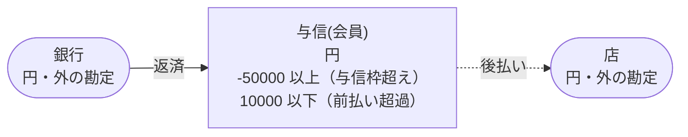
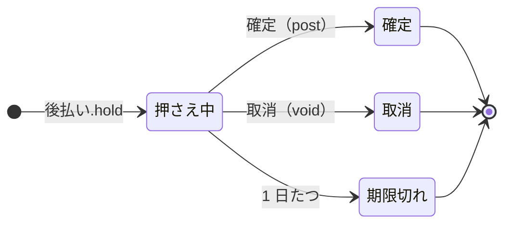

<!-- `chobo doc tests/books/与信.book --lang ja` の出力です。手で編集しないでください。 -->

# 与信 v1

会員ごとの後払いの枠。使えるのはマイナス 50000 円まで、前払いは 10000 円まで

`chobo doc` が `tests/books/与信.book` から作ったページ。勘定ごとに残高を持ち、残高は入った量から出た量を引いたもの。どの振替も勘定の下限と上限を守り、守れない振替は、その境界に付けた名前で断られて、どの移動も行われない。振替には、すぐに動かすもの（`do`）と、動かす量をまず押さえるもの（`hold`）がある。押さえた分は、あとで確定される（`post`。全部か一部）か、取り消される（`void`）か、有効期限で切れる。

## 勘定

| 勘定 | 分け方 | 単位 | 境界 | 説明 |
|---|---|---|---|---|
| `与信` | `会員` ごと | 円 | -50000 以上。下回る振替は `与信枠超え` で断る<br>10000 以下。超える振替は `前払い超過` で断る |  |
| `店` | 一つだけ | 円 | 外の勘定。境界は無く、マイナスにもなる |  |
| `銀行` | 一つだけ | 円 | 外の勘定。境界は無く、マイナスにもなる |  |

## 勘定のあいだの流れ



四角は勘定で、矢印は振替の移動。角の丸い四角は外の勘定で、境界を持たない。破線の矢印は仮押さえの振替で、まず押さえ、確定したときに動く。

## 振替

### 後払い

- 移動: `与信(会員)` から `店` へ `額`。
- キー: `注文` ごとに一回。同じ呼び出しの二度目は何もせず、`done_before` を返す。`会員` か `額` だけが違う二度目は `key_conflict` で断られる。押さえが終わったあとに同じキーで押さえ直すと `done_before` になり、何も押さえない。
- 仮押さえ: まず押さえる。確定と取消は呼ぶ側がする。押さえてから 1 日で期限が切れ、押さえた量は元に戻る。



| 仮押さえの状態 | post（確定） | void（取消） |
|---|---|---|
| 押さえ中 | 確定する。額を渡せばその額、渡さなければ全額で、残りは元に戻る。押さえた額を超えれば `over_hold` で断る。押さえてから 1 日たっていれば `expired` で断る | 取り消す。押さえた量は元に戻る。押さえてから 1 日たっていれば `expired` で断る |
| 確定 | 同じ額なら `done_before`、違う額なら `key_conflict` で断る | `already_posted` で断る |
| 取消 | `already_voided` で断る | `done_before` |
| 期限切れ | `expired` で断る | `expired` で断る |
| 仮押さえが無い | `no_such_hold` で断る | `no_such_hold` で断る |

| 操作 | 断られうる理由 | いつ |
|---|---|---|
| `後払い.hold` | `与信枠超え` | `与信(会員)` が -50000 を下回る |
| `後払い.hold` | `key_conflict` | `注文` が同じで、ほかの引数が違う呼び出しが、前に済んでいる |
| `後払い.hold` | `already_refused` | `注文` が同じ呼び出しが、前に境界で断られている。境界で断られたキーは、あとで足りるようになっても通らない |
| `後払い.post` | `key_conflict` | 仮押さえは、違う額で確定済み |
| `後払い.post` | `already_voided` | 仮押さえはもう取り消されている |
| `後払い.post` | `expired` | 仮押さえの期限が切れている |
| `後払い.post` | `over_hold` | 押さえた額より多く確定しようとした |
| `後払い.post` | `no_such_hold` | その `注文` の仮押さえが無い |
| `後払い.void` | `already_posted` | 仮押さえはもう確定している |
| `後払い.void` | `expired` | 仮押さえの期限が切れている |
| `後払い.void` | `no_such_hold` | その `注文` の仮押さえが無い |

<details><summary>断られる例</summary>

#### 後払い.hold: 与信枠超え

```text
 1  後払い.hold(注文: 注文-1, 会員: 会員-2, 額: 50001)  与信枠超え で断られる（1 つ目の移動が 与信(会員-2) から 50001 を取る。確定 0、出ていく仮押さえ 0）
```

#### 後払い.hold: key_conflict

```text
 1  後払い.hold(注文: 注文-1, 会員: 会員-2, 額: 1)  通る
 2  後払い.hold(注文: 注文-1, 会員: 会員-2, 額: 2)  key_conflict で断られる
```

#### 後払い.hold: already_refused

```text
 1  後払い.hold(注文: 注文-1, 会員: 会員-2, 額: 50001)  与信枠超え で断られる（1 つ目の移動が 与信(会員-2) から 50001 を取る。確定 0、出ていく仮押さえ 0）
 2  後払い.hold(注文: 注文-1, 会員: 会員-2, 額: 50001)  already_refused で断られる
```

#### 後払い.post: key_conflict

```text
 1  後払い.hold(注文: 注文-1, 会員: 会員-2, 額: 2)  通る
 2  後払い.post(注文: 注文-1)                       通る
 3  後払い.post(注文: 注文-1, 額: 1)                key_conflict で断られる
```

#### 後払い.post: already_voided

```text
 1  後払い.hold(注文: 注文-1, 会員: 会員-2, 額: 2)  通る
 2  後払い.void(注文: 注文-1)                       通る
 3  後払い.post(注文: 注文-1)                       already_voided で断られる
```

#### 後払い.post: expired

```text
 1  後払い.hold(注文: 注文-1, 会員: 会員-2, 額: 2)  通る
 2  pass 1 日                                       後払い(注文-1) が期限切れ
 3  後払い.post(注文: 注文-1)                       expired で断られる
```

#### 後払い.post: over_hold

```text
 1  後払い.hold(注文: 注文-1, 会員: 会員-2, 額: 2)  通る
 2  後払い.post(注文: 注文-1, 額: 3)                over_hold で断られる
```

#### 後払い.post: no_such_hold

```text
 1  後払い.post(注文: 注文-1)  no_such_hold で断られる
```

#### 後払い.void: already_posted

```text
 1  後払い.hold(注文: 注文-1, 会員: 会員-2, 額: 2)  通る
 2  後払い.post(注文: 注文-1)                       通る
 3  後払い.void(注文: 注文-1)                       already_posted で断られる
```

#### 後払い.void: expired

```text
 1  後払い.hold(注文: 注文-1, 会員: 会員-2, 額: 2)  通る
 2  pass 1 日                                       後払い(注文-1) が期限切れ
 3  後払い.void(注文: 注文-1)                       expired で断られる
```

#### 後払い.void: no_such_hold

```text
 1  後払い.void(注文: 注文-1)  no_such_hold で断られる
```

</details>

### 返済

- 移動: `銀行` から `与信(会員)` へ `額`。
- キー: `返済番号` ごとに一回。同じ呼び出しの二度目は何もせず、`done_before` を返す。`会員` か `額` だけが違う二度目は `key_conflict` で断られる。
- すぐに動かす（`do`）。

| 操作 | 断られうる理由 | いつ |
|---|---|---|
| `返済.do` | `前払い超過` | `与信(会員)` が 10000 を超える |
| `返済.do` | `key_conflict` | `返済番号` が同じで、ほかの引数が違う呼び出しが、前に済んでいる |
| `返済.do` | `already_refused` | `返済番号` が同じ呼び出しが、前に境界で断られている。境界で断られたキーは、あとで足りるようになっても通らない |

<details><summary>断られる例</summary>

#### 返済.do: 前払い超過

```text
 1  返済.do(返済番号: 返済番号-1, 会員: 会員-2, 額: 10000)  通る
 2  返済.do(返済番号: 返済番号-3, 会員: 会員-2, 額: 1)      前払い超過 で断られる（1 つ目の移動が 与信(会員-2) へ 1 を入れる。確定 10000、入ってくる仮押さえ 0）
```

#### 返済.do: key_conflict

```text
 1  返済.do(返済番号: 返済番号-1, 会員: 会員-2, 額: 1)  通る
 2  返済.do(返済番号: 返済番号-1, 会員: 会員-2, 額: 2)  key_conflict で断られる
```

#### 返済.do: already_refused

```text
 1  返済.do(返済番号: 返済番号-1, 会員: 会員-2, 額: 10000)  通る
 2  返済.do(返済番号: 返済番号-3, 会員: 会員-2, 額: 1)      前払い超過 で断られる（1 つ目の移動が 与信(会員-2) へ 1 を入れる。確定 10000、入ってくる仮押さえ 0）
 3  返済.do(返済番号: 返済番号-3, 会員: 会員-2, 額: 1)      already_refused で断られる
```

</details>

## シナリオ

`chobo scenarios` が帳簿から作ったシナリオ 24 本。境界の手前・ちょうど・超える、同じキーの二度目、仮押さえの終わり方、二つの呼び出し元が同時に最後の一つを取りに来るもの、などがある。どれも参照インタプリタで流し、ステップごとに、そのあとの残高を載せる。残高は確定した量で、仮押さえがあれば括弧の中に書く。

<details><summary>1. 境界: 後払い.hold が 与信(会員) を -49999 まで減らす。<code>at least -50000</code> の 1 つ手前</summary>

| # | 操作 | 結果 | 与信(会員-2) | 店 | 銀行 |
|---|---|---|---|---|---|
| 1 | 返済.do(返済番号: 返済番号-1, 会員: 会員-2, 額: 2) | 通る | 2 | 0 | -2 |
| 2 | 後払い.hold(注文: 注文-3, 会員: 会員-2, 額: 50001) | 通る | 2（出ていく仮押さえ 50001） | 0（入ってくる仮押さえ 50001） | -2 |

</details>

<details><summary>2. 境界: 後払い.hold が 与信(会員) をちょうど -50000 まで減らす。<code>at least -50000</code> ちょうど</summary>

| # | 操作 | 結果 | 与信(会員-2) | 店 | 銀行 |
|---|---|---|---|---|---|
| 1 | 返済.do(返済番号: 返済番号-1, 会員: 会員-2, 額: 2) | 通る | 2 | 0 | -2 |
| 2 | 後払い.hold(注文: 注文-3, 会員: 会員-2, 額: 50002) | 通る | 2（出ていく仮押さえ 50002） | 0（入ってくる仮押さえ 50002） | -2 |

</details>

<details><summary>3. 境界: 後払い.hold は 与信(会員) を -50001 まで減らすので断られる。<code>at least -50000</code> を割る</summary>

| # | 操作 | 結果 | 与信(会員-2) | 店 | 銀行 |
|---|---|---|---|---|---|
| 1 | 返済.do(返済番号: 返済番号-1, 会員: 会員-2, 額: 2) | 通る | 2 | 0 | -2 |
| 2 | 後払い.hold(注文: 注文-3, 会員: 会員-2, 額: 50003) | 与信枠超え で断られる | 2 | 0 | -2 |

</details>

<details><summary>4. 境界: 返済.do が 与信(会員) を 9999 まで増やす。<code>at most 10000</code> の 1 つ手前</summary>

| # | 操作 | 結果 | 与信(会員-2) | 銀行 |
|---|---|---|---|---|
| 1 | 返済.do(返済番号: 返済番号-1, 会員: 会員-2, 額: 9998) | 通る | 9998 | -9998 |
| 2 | 返済.do(返済番号: 返済番号-3, 会員: 会員-2, 額: 1) | 通る | 9999 | -9999 |

</details>

<details><summary>5. 境界: 返済.do が 与信(会員) をちょうど 10000 まで増やす。<code>at most 10000</code> ちょうど</summary>

| # | 操作 | 結果 | 与信(会員-2) | 銀行 |
|---|---|---|---|---|
| 1 | 返済.do(返済番号: 返済番号-1, 会員: 会員-2, 額: 9998) | 通る | 9998 | -9998 |
| 2 | 返済.do(返済番号: 返済番号-3, 会員: 会員-2, 額: 2) | 通る | 10000 | -10000 |

</details>

<details><summary>6. 境界: 返済.do は 与信(会員) を 10001 まで増やすので断られる。<code>at most 10000</code> を超える</summary>

| # | 操作 | 結果 | 与信(会員-2) | 銀行 |
|---|---|---|---|---|
| 1 | 返済.do(返済番号: 返済番号-1, 会員: 会員-2, 額: 9998) | 通る | 9998 | -9998 |
| 2 | 返済.do(返済番号: 返済番号-3, 会員: 会員-2, 額: 3) | 前払い超過 で断られる | 9998 | -9998 |

</details>

<details><summary>7. キー: 後払い.hold を同じ引数で二度呼ぶ</summary>

| # | 操作 | 結果 | 与信(会員-2) | 店 |
|---|---|---|---|---|
| 1 | 後払い.hold(注文: 注文-1, 会員: 会員-2, 額: 1) | 通る | 0（出ていく仮押さえ 1） | 0（入ってくる仮押さえ 1） |
| 2 | 後払い.hold(注文: 注文-1, 会員: 会員-2, 額: 1) | done_before（前に済んでいる） | 0（出ていく仮押さえ 1） | 0（入ってくる仮押さえ 1） |

</details>

<details><summary>8. キー: 後払い.hold を 額 だけ変えてもう一度呼ぶ</summary>

| # | 操作 | 結果 | 与信(会員-2) | 店 |
|---|---|---|---|---|
| 1 | 後払い.hold(注文: 注文-1, 会員: 会員-2, 額: 1) | 通る | 0（出ていく仮押さえ 1） | 0（入ってくる仮押さえ 1） |
| 2 | 後払い.hold(注文: 注文-1, 会員: 会員-2, 額: 2) | key_conflict で断られる | 0（出ていく仮押さえ 1） | 0（入ってくる仮押さえ 1） |

</details>

<details><summary>9. キー: 後払い.hold が 与信枠超え で断られ、同じ引数でもう一度、与信(会員) が足りるようになってからもう一度呼ぶ</summary>

| # | 操作 | 結果 | 与信(会員-2) | 店 | 銀行 |
|---|---|---|---|---|---|
| 1 | 後払い.hold(注文: 注文-1, 会員: 会員-2, 額: 50001) | 与信枠超え で断られる | 0 | 0 | 0 |
| 2 | 後払い.hold(注文: 注文-1, 会員: 会員-2, 額: 50001) | already_refused で断られる | 0 | 0 | 0 |
| 3 | 返済.do(返済番号: 返済番号-3, 会員: 会員-2, 額: 1) | 通る | 1 | 0 | -1 |
| 4 | 後払い.hold(注文: 注文-1, 会員: 会員-2, 額: 50001) | already_refused で断られる | 1 | 0 | -1 |

</details>

<details><summary>10. キー: 返済.do を同じ引数で二度呼ぶ</summary>

| # | 操作 | 結果 | 与信(会員-2) | 銀行 |
|---|---|---|---|---|
| 1 | 返済.do(返済番号: 返済番号-1, 会員: 会員-2, 額: 1) | 通る | 1 | -1 |
| 2 | 返済.do(返済番号: 返済番号-1, 会員: 会員-2, 額: 1) | done_before（前に済んでいる） | 1 | -1 |

</details>

<details><summary>11. キー: 返済.do を 額 だけ変えてもう一度呼ぶ</summary>

| # | 操作 | 結果 | 与信(会員-2) | 銀行 |
|---|---|---|---|---|
| 1 | 返済.do(返済番号: 返済番号-1, 会員: 会員-2, 額: 1) | 通る | 1 | -1 |
| 2 | 返済.do(返済番号: 返済番号-1, 会員: 会員-2, 額: 2) | key_conflict で断られる | 1 | -1 |

</details>

<details><summary>12. キー: 返済.do が 前払い超過 で断られ、同じ引数でもう一度呼ぶ</summary>

| # | 操作 | 結果 | 与信(会員-2) | 銀行 |
|---|---|---|---|---|
| 1 | 返済.do(返済番号: 返済番号-1, 会員: 会員-2, 額: 10000) | 通る | 10000 | -10000 |
| 2 | 返済.do(返済番号: 返済番号-3, 会員: 会員-2, 額: 1) | 前払い超過 で断られる | 10000 | -10000 |
| 3 | 返済.do(返済番号: 返済番号-3, 会員: 会員-2, 額: 1) | already_refused で断られる | 10000 | -10000 |

</details>

<details><summary>13. 仮押さえ: 後払い を全額で確定する</summary>

| # | 操作 | 結果 | 与信(会員-2) | 店 |
|---|---|---|---|---|
| 1 | 後払い.hold(注文: 注文-1, 会員: 会員-2, 額: 2) | 通る | 0（出ていく仮押さえ 2） | 0（入ってくる仮押さえ 2） |
| 2 | 後払い.post(注文: 注文-1) | 通る | -2 | 2 |

</details>

<details><summary>14. 仮押さえ: 後払い を一部だけ確定する</summary>

| # | 操作 | 結果 | 与信(会員-2) | 店 |
|---|---|---|---|---|
| 1 | 後払い.hold(注文: 注文-1, 会員: 会員-2, 額: 2) | 通る | 0（出ていく仮押さえ 2） | 0（入ってくる仮押さえ 2） |
| 2 | 後払い.post(注文: 注文-1, 額: 1) | 通る | -1 | 1 |

</details>

<details><summary>15. 仮押さえ: 後払い を取り消す</summary>

| # | 操作 | 結果 | 与信(会員-2) | 店 |
|---|---|---|---|---|
| 1 | 後払い.hold(注文: 注文-1, 会員: 会員-2, 額: 2) | 通る | 0（出ていく仮押さえ 2） | 0（入ってくる仮押さえ 2） |
| 2 | 後払い.void(注文: 注文-1) | 通る | 0 | 0 |

</details>

<details><summary>16. 仮押さえ: 後払い を確定してから取り消そうとする</summary>

| # | 操作 | 結果 | 与信(会員-2) | 店 |
|---|---|---|---|---|
| 1 | 後払い.hold(注文: 注文-1, 会員: 会員-2, 額: 2) | 通る | 0（出ていく仮押さえ 2） | 0（入ってくる仮押さえ 2） |
| 2 | 後払い.post(注文: 注文-1) | 通る | -2 | 2 |
| 3 | 後払い.void(注文: 注文-1) | already_posted で断られる | -2 | 2 |

</details>

<details><summary>17. 仮押さえ: 後払い を取り消してから確定しようとする</summary>

| # | 操作 | 結果 | 与信(会員-2) | 店 |
|---|---|---|---|---|
| 1 | 後払い.hold(注文: 注文-1, 会員: 会員-2, 額: 2) | 通る | 0（出ていく仮押さえ 2） | 0（入ってくる仮押さえ 2） |
| 2 | 後払い.void(注文: 注文-1) | 通る | 0 | 0 |
| 3 | 後払い.post(注文: 注文-1) | already_voided で断られる | 0 | 0 |

</details>

<details><summary>18. 仮押さえ: 後払い を押さえた額より多く確定しようとし、押さえた額で確定する</summary>

| # | 操作 | 結果 | 与信(会員-2) | 店 |
|---|---|---|---|---|
| 1 | 後払い.hold(注文: 注文-1, 会員: 会員-2, 額: 2) | 通る | 0（出ていく仮押さえ 2） | 0（入ってくる仮押さえ 2） |
| 2 | 後払い.post(注文: 注文-1, 額: 3) | over_hold で断られる | 0（出ていく仮押さえ 2） | 0（入ってくる仮押さえ 2） |
| 3 | 後払い.post(注文: 注文-1, 額: 2) | 通る | -2 | 2 |

</details>

<details><summary>19. 仮押さえ: 後払い を押さえる前に確定しようとし、押さえてから確定する</summary>

| # | 操作 | 結果 | 与信(会員-2) | 店 |
|---|---|---|---|---|
| 1 | 後払い.post(注文: 注文-1) | no_such_hold で断られる | 0 | 0 |
| 2 | 後払い.hold(注文: 注文-1, 会員: 会員-2, 額: 1) | 通る | 0（出ていく仮押さえ 1） | 0（入ってくる仮押さえ 1） |
| 3 | 後払い.post(注文: 注文-1) | 通る | -1 | 1 |

</details>

<details><summary>20. 仮押さえ: 後払い を二度確定する。同じ額で、そして違う額で</summary>

| # | 操作 | 結果 | 与信(会員-2) | 店 |
|---|---|---|---|---|
| 1 | 後払い.hold(注文: 注文-1, 会員: 会員-2, 額: 2) | 通る | 0（出ていく仮押さえ 2） | 0（入ってくる仮押さえ 2） |
| 2 | 後払い.post(注文: 注文-1) | 通る | -2 | 2 |
| 3 | 後払い.post(注文: 注文-1) | done_before（前に済んでいる） | -2 | 2 |
| 4 | 後払い.post(注文: 注文-1, 額: 2) | done_before（前に済んでいる） | -2 | 2 |
| 5 | 後払い.post(注文: 注文-1, 額: 1) | key_conflict で断られる | -2 | 2 |

</details>

<details><summary>21. 期限切れ: 後払い が期限切れになってから、確定と取消を試す</summary>

| # | 操作 | 結果 | 与信(会員-2) | 店 |
|---|---|---|---|---|
| 1 | 後払い.hold(注文: 注文-1, 会員: 会員-2, 額: 2) | 通る | 0（出ていく仮押さえ 2） | 0（入ってくる仮押さえ 2） |
| 2 | pass 1441 分 | 後払い(注文-1) が期限切れ | 0 | 0 |
| 3 | 後払い.post(注文: 注文-1) | expired で断られる | 0 | 0 |
| 4 | 後払い.void(注文: 注文-1) | expired で断られる | 0 | 0 |

</details>

<details><summary>22. 期限切れ: 後払い が期限切れになってから、同じキーで押さえ直す</summary>

| # | 操作 | 結果 | 与信(会員-2) | 店 |
|---|---|---|---|---|
| 1 | 後払い.hold(注文: 注文-1, 会員: 会員-2, 額: 2) | 通る | 0（出ていく仮押さえ 2） | 0（入ってくる仮押さえ 2） |
| 2 | pass 1441 分 | 後払い(注文-1) が期限切れ | 0 | 0 |
| 3 | 後払い.hold(注文: 注文-1, 会員: 会員-2, 額: 2) | done_before（前に済んでいる） | 0 | 0 |

</details>

<details><summary>23. 同時: 二つの呼び出し元が 後払い.hold で 与信(会員) の最後の 50000 を取り合う</summary>

同時の操作の順序によって、結果は 2 通りある。

結果 1:

| # | 操作 | 結果 | 与信(会員-2) | 店 |
|---|---|---|---|---|
| 1 | together<br>呼び出し元 1: 後払い.hold(注文: 注文-1, 会員: 会員-2, 額: 50000)<br>呼び出し元 2: 後払い.hold(注文: 注文-3, 会員: 会員-2, 額: 50000) | <br>通る<br>与信枠超え で断られる | 0（出ていく仮押さえ 50000） | 0（入ってくる仮押さえ 50000） |

結果 2:

| # | 操作 | 結果 | 与信(会員-2) | 店 |
|---|---|---|---|---|
| 1 | together<br>呼び出し元 1: 後払い.hold(注文: 注文-1, 会員: 会員-2, 額: 50000)<br>呼び出し元 2: 後払い.hold(注文: 注文-3, 会員: 会員-2, 額: 50000) | <br>与信枠超え で断られる<br>通る | 0（出ていく仮押さえ 50000） | 0（入ってくる仮押さえ 50000） |

</details>

<details><summary>24. 同時: 二つの呼び出し元が 返済.do で 与信(会員) の最後の空き 1 を取り合う</summary>

同時の操作の順序によって、結果は 2 通りある。

結果 1:

| # | 操作 | 結果 | 与信(会員-2) | 銀行 |
|---|---|---|---|---|
| 1 | 返済.do(返済番号: 返済番号-1, 会員: 会員-2, 額: 9999) | 通る | 9999 | -9999 |
| 2 | together<br>呼び出し元 1: 返済.do(返済番号: 返済番号-3, 会員: 会員-2, 額: 1)<br>呼び出し元 2: 返済.do(返済番号: 返済番号-4, 会員: 会員-2, 額: 1) | <br>通る<br>前払い超過 で断られる | 10000 | -10000 |

結果 2:

| # | 操作 | 結果 | 与信(会員-2) | 銀行 |
|---|---|---|---|---|
| 1 | 返済.do(返済番号: 返済番号-1, 会員: 会員-2, 額: 9999) | 通る | 9999 | -9999 |
| 2 | together<br>呼び出し元 1: 返済.do(返済番号: 返済番号-3, 会員: 会員-2, 額: 1)<br>呼び出し元 2: 返済.do(返済番号: 返済番号-4, 会員: 会員-2, 額: 1) | <br>前払い超過 で断られる<br>通る | 10000 | -10000 |

</details>

