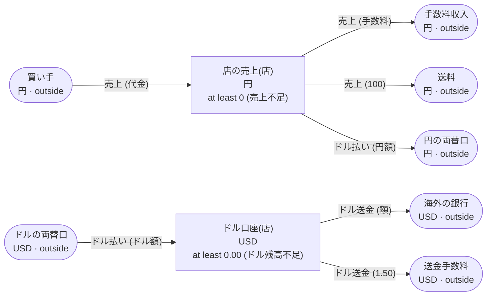

<!-- The output of `chobo doc tests/books/分配.book`. Do not edit by hand. -->

# 分配 v1

マーケットプレイスの売上を店と手数料と送料に分け、店の売上をドルで払い出す

`tests/books/分配.book`, as `chobo doc` writes it. Each account keeps a balance: what came in, less what went out. Every transfer keeps the bounds of the accounts: one that would break a bound is refused with the name the book gives that bound, and nothing of it moves. A transfer either moves at once (`do`), or first holds what it moves (`hold`); a hold is then posted (`post`, all of it or part), voided (`void`), or expires.

## Accounts

| Account | One for each | Unit | Bounds | What it is |
|---|---|---|---|---|
| `買い手` | one account | 円 | outside the book: no bounds, and it may go below 0 |  |
| `手数料収入` | one account | 円 | outside the book: no bounds, and it may go below 0 |  |
| `送料` | one account | 円 | outside the book: no bounds, and it may go below 0 |  |
| `店の売上` | `店` | 円 | at least 0; a transfer that would go below is refused with `売上不足` |  |
| `円の両替口` | one account | 円 | outside the book: no bounds, and it may go below 0 |  |
| `ドルの両替口` | one account | USD | outside the book: no bounds, and it may go below 0 |  |
| `ドル口座` | `店` | USD | at least 0.00; a transfer that would go below is refused with `ドル残高不足` |  |
| `海外の銀行` | one account | USD | outside the book: no bounds, and it may go below 0 |  |
| `送金手数料` | one account | USD | outside the book: no bounds, and it may go below 0 |  |

## How things move



A box is an account, and an arrow a move of a transfer. A rounded box is an account outside the book, which has no bounds. A dashed arrow belongs to a transfer that holds first, and moves when the hold is posted.

## Transfers

### 売上

- 3 moves, made in this order, all or none:
    1. `代金` from `買い手` to `店の売上(店)`
    2. `手数料` from `店の売上(店)` to `手数料収入`
    3. `100` from `店の売上(店)` to `送料`
- Key: once per `注文`. The same call again does nothing, and answers `done_before`; one that differs only in `店`, `代金` or `手数料` is refused with `key_conflict`.
- Moves at once (`do`).

| Operation | May be refused with | When |
|---|---|---|
| `売上.do` | `売上不足` | move 2 would take `店の売上(店)` below 0 |
| `売上.do` | `key_conflict` | a call with the same `注文` and other arguments came before |
| `売上.do` | `already_refused` | a call with the same `注文` was refused by a bound before; a key a bound refused stays refused, even once there is enough |

<details><summary>How each refusal comes about</summary>

#### 売上.do: 売上不足

```text
 1  売上.do(注文: 注文-1, 店: 店-2, 代金: 1, 手数料: 2)  refused: 売上不足 (move 2 takes 2 from 店の売上(店-2): posted 1, held out 0)
```

#### 売上.do: key_conflict

```text
 1  売上.do(注文: 注文-1, 店: 店-2, 代金: 1000, 手数料: 1)  done
 2  売上.do(注文: 注文-1, 店: 店-2, 代金: 3, 手数料: 1)     refused: key_conflict
```

#### 売上.do: already_refused

```text
 1  売上.do(注文: 注文-1, 店: 店-2, 代金: 1, 手数料: 2)  refused: 売上不足 (move 2 takes 2 from 店の売上(店-2): posted 1, held out 0)
 2  売上.do(注文: 注文-1, 店: 店-2, 代金: 1, 手数料: 2)  refused: already_refused
```

</details>

### ドル払い

両替の率は呼ぶ側が決め、円とドルの額を両方渡す

- 2 moves, made in this order, all or none:
    1. `円額` from `店の売上(店)` to `円の両替口`
    2. `ドル額` from `ドルの両替口` to `ドル口座(店)`
- Key: once per `払出番号`. The same call again does nothing, and answers `done_before`; one that differs only in `店`, `円額` or `ドル額` is refused with `key_conflict`.
- Moves at once (`do`).

| Operation | May be refused with | When |
|---|---|---|
| `ドル払い.do` | `売上不足` | move 1 would take `店の売上(店)` below 0 |
| `ドル払い.do` | `key_conflict` | a call with the same `払出番号` and other arguments came before |
| `ドル払い.do` | `already_refused` | a call with the same `払出番号` was refused by a bound before; a key a bound refused stays refused, even once there is enough |

<details><summary>How each refusal comes about</summary>

#### ドル払い.do: 売上不足

```text
 1  ドル払い.do(払出番号: 払出番号-1, 店: 店-2, 円額: 1, ドル額: 0.02)  refused: 売上不足 (move 1 takes 1 from 店の売上(店-2): posted 0, held out 0)
```

#### ドル払い.do: key_conflict

```text
 1  売上.do(注文: 注文-1, 店: 店-2, 代金: 104, 手数料: 3)               done
 2  ドル払い.do(払出番号: 払出番号-3, 店: 店-2, 円額: 1, ドル額: 0.02)  done
 3  ドル払い.do(払出番号: 払出番号-3, 店: 店-2, 円額: 4, ドル額: 0.02)  refused: key_conflict
```

#### ドル払い.do: already_refused

```text
 1  ドル払い.do(払出番号: 払出番号-1, 店: 店-2, 円額: 1, ドル額: 0.02)  refused: 売上不足 (move 1 takes 1 from 店の売上(店-2): posted 0, held out 0)
 2  ドル払い.do(払出番号: 払出番号-1, 店: 店-2, 円額: 1, ドル額: 0.02)  refused: already_refused
```

</details>

### ドル送金

- 2 moves, made in this order, all or none:
    1. `額` from `ドル口座(店)` to `海外の銀行`
    2. `1.50` from `ドル口座(店)` to `送金手数料`
- Key: once per `送金番号`. The same call again does nothing, and answers `done_before`; one that differs only in `店` or `額` is refused with `key_conflict`.
- Moves at once (`do`).

| Operation | May be refused with | When |
|---|---|---|
| `ドル送金.do` | `ドル残高不足` | move 1 would take `ドル口座(店)` below 0.00 |
| `ドル送金.do` | `key_conflict` | a call with the same `送金番号` and other arguments came before |
| `ドル送金.do` | `already_refused` | a call with the same `送金番号` was refused by a bound before; a key a bound refused stays refused, even once there is enough |

<details><summary>How each refusal comes about</summary>

#### ドル送金.do: ドル残高不足

```text
 1  ドル送金.do(送金番号: 送金番号-1, 店: 店-2, 額: 0.01)  refused: ドル残高不足 (move 1 takes 0.01 from ドル口座(店-2): posted 0.00, held out 0.00)
```

#### ドル送金.do: key_conflict

```text
 1  売上.do(注文: 注文-1, 店: 店-2, 代金: 105, 手数料: 3)               done
 2  ドル払い.do(払出番号: 払出番号-3, 店: 店-2, 円額: 2, ドル額: 1.51)  done
 3  ドル送金.do(送金番号: 送金番号-4, 店: 店-2, 額: 0.01)               done
 4  ドル送金.do(送金番号: 送金番号-4, 店: 店-2, 額: 0.04)               refused: key_conflict
```

#### ドル送金.do: already_refused

```text
 1  ドル送金.do(送金番号: 送金番号-1, 店: 店-2, 額: 0.01)  refused: ドル残高不足 (move 1 takes 0.01 from ドル口座(店-2): posted 0.00, held out 0.00)
 2  ドル送金.do(送金番号: 送金番号-1, 店: 店-2, 額: 0.01)  refused: already_refused
```

</details>

## Scenarios

17 scenarios, which `chobo scenarios` makes from the book: among them each bound just before, at and past it, each key used twice, every way a hold ends, and two callers after the last of something at the same time. The reference interpreter ran each one; after each step come the balances it left. A balance is what is posted, with what is held in brackets.

<details><summary>1. bound: ドル払い.do move 1 takes 店の売上(店) to 1, one above <code>at least 0</code></summary>

| # | Operation | Result | 買い手 | 手数料収入 | 送料 | 店の売上(店-2) | 円の両替口 | ドルの両替口 | ドル口座(店-2) |
|---|---|---|---|---|---|---|---|---|---|
| 1 | 売上.do(注文: 注文-1, 店: 店-2, 代金: 105, 手数料: 3) | done | -105 | 3 | 100 | 2 | 0 | 0.00 | 0.00 |
| 2 | ドル払い.do(払出番号: 払出番号-3, 店: 店-2, 円額: 1, ドル額: 0.02) | done | -105 | 3 | 100 | 1 | 1 | -0.02 | 0.02 |

</details>

<details><summary>2. bound: ドル払い.do move 1 takes 店の売上(店) to exactly 0, its <code>at least 0</code></summary>

| # | Operation | Result | 買い手 | 手数料収入 | 送料 | 店の売上(店-2) | 円の両替口 | ドルの両替口 | ドル口座(店-2) |
|---|---|---|---|---|---|---|---|---|---|
| 1 | 売上.do(注文: 注文-1, 店: 店-2, 代金: 105, 手数料: 3) | done | -105 | 3 | 100 | 2 | 0 | 0.00 | 0.00 |
| 2 | ドル払い.do(払出番号: 払出番号-3, 店: 店-2, 円額: 2, ドル額: 0.01) | done | -105 | 3 | 100 | 0 | 2 | -0.01 | 0.01 |

</details>

<details><summary>3. bound: ドル払い.do move 1 would take 店の売上(店) to -1, below <code>at least 0</code></summary>

| # | Operation | Result | 買い手 | 手数料収入 | 送料 | 店の売上(店-2) | 円の両替口 | ドルの両替口 | ドル口座(店-2) |
|---|---|---|---|---|---|---|---|---|---|
| 1 | 売上.do(注文: 注文-1, 店: 店-2, 代金: 106, 手数料: 4) | done | -106 | 4 | 100 | 2 | 0 | 0.00 | 0.00 |
| 2 | ドル払い.do(払出番号: 払出番号-3, 店: 店-2, 円額: 3, ドル額: 0.01) | refused: 売上不足 | -106 | 4 | 100 | 2 | 0 | 0.00 | 0.00 |

</details>

<details><summary>4. key: 売上.do twice with the same arguments</summary>

| # | Operation | Result | 買い手 | 手数料収入 | 送料 | 店の売上(店-2) |
|---|---|---|---|---|---|---|
| 1 | 売上.do(注文: 注文-1, 店: 店-2, 代金: 1000, 手数料: 1) | done | -1000 | 1 | 100 | 899 |
| 2 | 売上.do(注文: 注文-1, 店: 店-2, 代金: 1000, 手数料: 1) | done_before | -1000 | 1 | 100 | 899 |

</details>

<details><summary>5. key: 売上.do again with another 代金</summary>

| # | Operation | Result | 買い手 | 手数料収入 | 送料 | 店の売上(店-2) |
|---|---|---|---|---|---|---|
| 1 | 売上.do(注文: 注文-1, 店: 店-2, 代金: 1000, 手数料: 1) | done | -1000 | 1 | 100 | 899 |
| 2 | 売上.do(注文: 注文-1, 店: 店-2, 代金: 3, 手数料: 1) | refused: key_conflict | -1000 | 1 | 100 | 899 |

</details>

<details><summary>6. key: 売上.do refused with 売上不足, then again, and again once 店の売上(店) has enough</summary>

| # | Operation | Result | 買い手 | 手数料収入 | 送料 | 店の売上(店-2) |
|---|---|---|---|---|---|---|
| 1 | 売上.do(注文: 注文-1, 店: 店-2, 代金: 1, 手数料: 2) | refused: 売上不足 | 0 | 0 | 0 | 0 |
| 2 | 売上.do(注文: 注文-1, 店: 店-2, 代金: 1, 手数料: 2) | refused: already_refused | 0 | 0 | 0 | 0 |
| 3 | 売上.do(注文: 注文-3, 店: 店-2, 代金: 105, 手数料: 3) | done | -105 | 3 | 100 | 2 |
| 4 | 売上.do(注文: 注文-1, 店: 店-2, 代金: 1, 手数料: 2) | refused: already_refused | -105 | 3 | 100 | 2 |

</details>

<details><summary>7. key: ドル払い.do twice with the same arguments</summary>

| # | Operation | Result | 買い手 | 手数料収入 | 送料 | 店の売上(店-2) | 円の両替口 | ドルの両替口 | ドル口座(店-2) |
|---|---|---|---|---|---|---|---|---|---|
| 1 | 売上.do(注文: 注文-1, 店: 店-2, 代金: 104, 手数料: 3) | done | -104 | 3 | 100 | 1 | 0 | 0.00 | 0.00 |
| 2 | ドル払い.do(払出番号: 払出番号-3, 店: 店-2, 円額: 1, ドル額: 0.02) | done | -104 | 3 | 100 | 0 | 1 | -0.02 | 0.02 |
| 3 | ドル払い.do(払出番号: 払出番号-3, 店: 店-2, 円額: 1, ドル額: 0.02) | done_before | -104 | 3 | 100 | 0 | 1 | -0.02 | 0.02 |

</details>

<details><summary>8. key: ドル払い.do again with another 円額</summary>

| # | Operation | Result | 買い手 | 手数料収入 | 送料 | 店の売上(店-2) | 円の両替口 | ドルの両替口 | ドル口座(店-2) |
|---|---|---|---|---|---|---|---|---|---|
| 1 | 売上.do(注文: 注文-1, 店: 店-2, 代金: 104, 手数料: 3) | done | -104 | 3 | 100 | 1 | 0 | 0.00 | 0.00 |
| 2 | ドル払い.do(払出番号: 払出番号-3, 店: 店-2, 円額: 1, ドル額: 0.02) | done | -104 | 3 | 100 | 0 | 1 | -0.02 | 0.02 |
| 3 | ドル払い.do(払出番号: 払出番号-3, 店: 店-2, 円額: 4, ドル額: 0.02) | refused: key_conflict | -104 | 3 | 100 | 0 | 1 | -0.02 | 0.02 |

</details>

<details><summary>9. key: ドル払い.do refused with 売上不足, then again, and again once 店の売上(店) has enough</summary>

| # | Operation | Result | 買い手 | 手数料収入 | 送料 | 店の売上(店-2) | 円の両替口 | ドルの両替口 | ドル口座(店-2) |
|---|---|---|---|---|---|---|---|---|---|
| 1 | ドル払い.do(払出番号: 払出番号-1, 店: 店-2, 円額: 1, ドル額: 0.02) | refused: 売上不足 | 0 | 0 | 0 | 0 | 0 | 0.00 | 0.00 |
| 2 | ドル払い.do(払出番号: 払出番号-1, 店: 店-2, 円額: 1, ドル額: 0.02) | refused: already_refused | 0 | 0 | 0 | 0 | 0 | 0.00 | 0.00 |
| 3 | 売上.do(注文: 注文-3, 店: 店-2, 代金: 104, 手数料: 3) | done | -104 | 3 | 100 | 1 | 0 | 0.00 | 0.00 |
| 4 | ドル払い.do(払出番号: 払出番号-1, 店: 店-2, 円額: 1, ドル額: 0.02) | refused: already_refused | -104 | 3 | 100 | 1 | 0 | 0.00 | 0.00 |

</details>

<details><summary>10. key: ドル送金.do twice with the same arguments</summary>

| # | Operation | Result | 買い手 | 手数料収入 | 送料 | 店の売上(店-2) | 円の両替口 | ドルの両替口 | ドル口座(店-2) | 海外の銀行 | 送金手数料 |
|---|---|---|---|---|---|---|---|---|---|---|---|
| 1 | 売上.do(注文: 注文-1, 店: 店-2, 代金: 105, 手数料: 3) | done | -105 | 3 | 100 | 2 | 0 | 0.00 | 0.00 | 0.00 | 0.00 |
| 2 | ドル払い.do(払出番号: 払出番号-3, 店: 店-2, 円額: 2, ドル額: 1.51) | done | -105 | 3 | 100 | 0 | 2 | -1.51 | 1.51 | 0.00 | 0.00 |
| 3 | ドル送金.do(送金番号: 送金番号-4, 店: 店-2, 額: 0.01) | done | -105 | 3 | 100 | 0 | 2 | -1.51 | 0.00 | 0.01 | 1.50 |
| 4 | ドル送金.do(送金番号: 送金番号-4, 店: 店-2, 額: 0.01) | done_before | -105 | 3 | 100 | 0 | 2 | -1.51 | 0.00 | 0.01 | 1.50 |

</details>

<details><summary>11. key: ドル送金.do again with another 額</summary>

| # | Operation | Result | 買い手 | 手数料収入 | 送料 | 店の売上(店-2) | 円の両替口 | ドルの両替口 | ドル口座(店-2) | 海外の銀行 | 送金手数料 |
|---|---|---|---|---|---|---|---|---|---|---|---|
| 1 | 売上.do(注文: 注文-1, 店: 店-2, 代金: 105, 手数料: 3) | done | -105 | 3 | 100 | 2 | 0 | 0.00 | 0.00 | 0.00 | 0.00 |
| 2 | ドル払い.do(払出番号: 払出番号-3, 店: 店-2, 円額: 2, ドル額: 1.51) | done | -105 | 3 | 100 | 0 | 2 | -1.51 | 1.51 | 0.00 | 0.00 |
| 3 | ドル送金.do(送金番号: 送金番号-4, 店: 店-2, 額: 0.01) | done | -105 | 3 | 100 | 0 | 2 | -1.51 | 0.00 | 0.01 | 1.50 |
| 4 | ドル送金.do(送金番号: 送金番号-4, 店: 店-2, 額: 0.04) | refused: key_conflict | -105 | 3 | 100 | 0 | 2 | -1.51 | 0.00 | 0.01 | 1.50 |

</details>

<details><summary>12. key: ドル送金.do refused with ドル残高不足, then again, and again once ドル口座(店) has enough</summary>

| # | Operation | Result | 買い手 | 手数料収入 | 送料 | 店の売上(店-2) | 円の両替口 | ドルの両替口 | ドル口座(店-2) | 海外の銀行 | 送金手数料 |
|---|---|---|---|---|---|---|---|---|---|---|---|
| 1 | ドル送金.do(送金番号: 送金番号-1, 店: 店-2, 額: 0.01) | refused: ドル残高不足 | 0 | 0 | 0 | 0 | 0 | 0.00 | 0.00 | 0.00 | 0.00 |
| 2 | ドル送金.do(送金番号: 送金番号-1, 店: 店-2, 額: 0.01) | refused: already_refused | 0 | 0 | 0 | 0 | 0 | 0.00 | 0.00 | 0.00 | 0.00 |
| 3 | 売上.do(注文: 注文-3, 店: 店-2, 代金: 105, 手数料: 3) | done | -105 | 3 | 100 | 2 | 0 | 0.00 | 0.00 | 0.00 | 0.00 |
| 4 | ドル払い.do(払出番号: 払出番号-4, 店: 店-2, 円額: 2, ドル額: 0.01) | done | -105 | 3 | 100 | 0 | 2 | -0.01 | 0.01 | 0.00 | 0.00 |
| 5 | ドル送金.do(送金番号: 送金番号-1, 店: 店-2, 額: 0.01) | refused: already_refused | -105 | 3 | 100 | 0 | 2 | -0.01 | 0.01 | 0.00 | 0.00 |

</details>

<details><summary>13. moves: 売上.do refused at move 2 (店の売上(店)), and no move is made</summary>

| # | Operation | Result | 買い手 | 手数料収入 | 送料 | 店の売上(店-2) |
|---|---|---|---|---|---|---|
| 1 | 売上.do(注文: 注文-1, 店: 店-2, 代金: 1, 手数料: 2) | refused: 売上不足 | 0 | 0 | 0 | 0 |

</details>

<details><summary>14. moves: 売上.do refused at move 3 (店の売上(店)), and no move is made</summary>

| # | Operation | Result | 買い手 | 手数料収入 | 送料 | 店の売上(店-2) |
|---|---|---|---|---|---|---|
| 1 | 売上.do(注文: 注文-1, 店: 店-2, 代金: 2, 手数料: 1) | refused: 売上不足 | 0 | 0 | 0 | 0 |

</details>

<details><summary>15. moves: ドル払い.do refused at move 1 (店の売上(店)), and no move is made</summary>

| # | Operation | Result | 店の売上(店-2) | 円の両替口 | ドルの両替口 | ドル口座(店-2) |
|---|---|---|---|---|---|---|
| 1 | ドル払い.do(払出番号: 払出番号-1, 店: 店-2, 円額: 1, ドル額: 0.02) | refused: 売上不足 | 0 | 0 | 0.00 | 0.00 |

</details>

<details><summary>16. moves: ドル送金.do refused at move 1 (ドル口座(店)), and no move is made</summary>

| # | Operation | Result | ドル口座(店-2) | 海外の銀行 | 送金手数料 |
|---|---|---|---|---|---|
| 1 | ドル送金.do(送金番号: 送金番号-1, 店: 店-2, 額: 0.01) | refused: ドル残高不足 | 0.00 | 0.00 | 0.00 |

</details>

<details><summary>17. together: two callers take the last 1 of 店の売上(店) with ドル払い.do</summary>

It can come out 2 ways, by the order the operations at the same time go in.

Outcome 1:

| # | Operation | Result | 買い手 | 手数料収入 | 送料 | 店の売上(店-2) | 円の両替口 | ドルの両替口 | ドル口座(店-2) |
|---|---|---|---|---|---|---|---|---|---|
| 1 | 売上.do(注文: 注文-1, 店: 店-2, 代金: 105, 手数料: 4) | done | -105 | 4 | 100 | 1 | 0 | 0.00 | 0.00 |
| 2 | together<br>caller 1: ドル払い.do(払出番号: 払出番号-3, 店: 店-2, 円額: 1, ドル額: 0.02)<br>caller 2: ドル払い.do(払出番号: 払出番号-4, 店: 店-2, 円額: 1, ドル額: 0.03) | <br>done<br>refused: 売上不足 | -105 | 4 | 100 | 0 | 1 | -0.02 | 0.02 |

Outcome 2:

| # | Operation | Result | 買い手 | 手数料収入 | 送料 | 店の売上(店-2) | 円の両替口 | ドルの両替口 | ドル口座(店-2) |
|---|---|---|---|---|---|---|---|---|---|
| 1 | 売上.do(注文: 注文-1, 店: 店-2, 代金: 105, 手数料: 4) | done | -105 | 4 | 100 | 1 | 0 | 0.00 | 0.00 |
| 2 | together<br>caller 1: ドル払い.do(払出番号: 払出番号-3, 店: 店-2, 円額: 1, ドル額: 0.02)<br>caller 2: ドル払い.do(払出番号: 払出番号-4, 店: 店-2, 円額: 1, ドル額: 0.03) | <br>refused: 売上不足<br>done | -105 | 4 | 100 | 0 | 1 | -0.03 | 0.03 |

</details>

