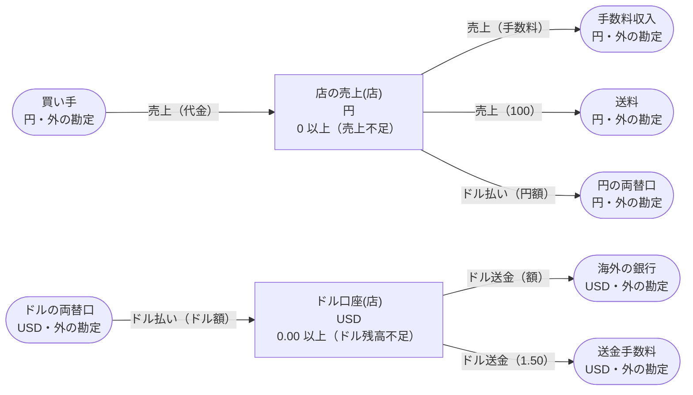

<!-- `chobo doc tests/books/分配.book --lang ja` の出力です。手で編集しないでください。 -->

# 分配 v1

マーケットプレイスの売上を店と手数料と送料に分け、店の売上をドルで払い出す

`chobo doc` が `tests/books/分配.book` から作ったページ。勘定ごとに残高を持ち、残高は入った量から出た量を引いたもの。どの振替も勘定の下限と上限を守り、守れない振替は、その境界に付けた名前で断られて、どの移動も行われない。振替には、すぐに動かすもの（`do`）と、動かす量をまず押さえるもの（`hold`）がある。押さえた分は、あとで確定される（`post`。全部か一部）か、取り消される（`void`）か、有効期限で切れる。

## 勘定

| 勘定 | 分け方 | 単位 | 境界 | 説明 |
|---|---|---|---|---|
| `買い手` | 一つだけ | 円 | 外の勘定。境界は無く、マイナスにもなる |  |
| `手数料収入` | 一つだけ | 円 | 外の勘定。境界は無く、マイナスにもなる |  |
| `送料` | 一つだけ | 円 | 外の勘定。境界は無く、マイナスにもなる |  |
| `店の売上` | `店` ごと | 円 | 0 以上。下回る振替は `売上不足` で断る |  |
| `円の両替口` | 一つだけ | 円 | 外の勘定。境界は無く、マイナスにもなる |  |
| `ドルの両替口` | 一つだけ | USD | 外の勘定。境界は無く、マイナスにもなる |  |
| `ドル口座` | `店` ごと | USD | 0.00 以上。下回る振替は `ドル残高不足` で断る |  |
| `海外の銀行` | 一つだけ | USD | 外の勘定。境界は無く、マイナスにもなる |  |
| `送金手数料` | 一つだけ | USD | 外の勘定。境界は無く、マイナスにもなる |  |

## 勘定のあいだの流れ



四角は勘定で、矢印は振替の移動。角の丸い四角は外の勘定で、境界を持たない。破線の矢印は仮押さえの振替で、まず押さえ、確定したときに動く。

## 振替

### 売上

- 移動は 3 つ。書いた順に行い、どれか一つでも断られたら、どれも行わない:
    1. `買い手` から `店の売上(店)` へ `代金`
    2. `店の売上(店)` から `手数料収入` へ `手数料`
    3. `店の売上(店)` から `送料` へ `100`
- キー: `注文` ごとに一回。同じ呼び出しの二度目は何もせず、`done_before` を返す。`店`、`代金` か `手数料` だけが違う二度目は `key_conflict` で断られる。
- すぐに動かす（`do`）。

| 操作 | 断られうる理由 | いつ |
|---|---|---|
| `売上.do` | `売上不足` | 2 つ目の移動で `店の売上(店)` が 0 を下回る |
| `売上.do` | `key_conflict` | `注文` が同じで、ほかの引数が違う呼び出しが、前に済んでいる |
| `売上.do` | `already_refused` | `注文` が同じ呼び出しが、前に境界で断られている。境界で断られたキーは、あとで足りるようになっても通らない |

<details><summary>断られる例</summary>

#### 売上.do: 売上不足

```text
 1  売上.do(注文: 注文-1, 店: 店-2, 代金: 1, 手数料: 2)  売上不足 で断られる（2 つ目の移動が 店の売上(店-2) から 2 を取る。確定 1、出ていく仮押さえ 0）
```

#### 売上.do: key_conflict

```text
 1  売上.do(注文: 注文-1, 店: 店-2, 代金: 1000, 手数料: 1)  通る
 2  売上.do(注文: 注文-1, 店: 店-2, 代金: 3, 手数料: 1)     key_conflict で断られる
```

#### 売上.do: already_refused

```text
 1  売上.do(注文: 注文-1, 店: 店-2, 代金: 1, 手数料: 2)  売上不足 で断られる（2 つ目の移動が 店の売上(店-2) から 2 を取る。確定 1、出ていく仮押さえ 0）
 2  売上.do(注文: 注文-1, 店: 店-2, 代金: 1, 手数料: 2)  already_refused で断られる
```

</details>

### ドル払い

両替の率は呼ぶ側が決め、円とドルの額を両方渡す

- 移動は 2 つ。書いた順に行い、どれか一つでも断られたら、どれも行わない:
    1. `店の売上(店)` から `円の両替口` へ `円額`
    2. `ドルの両替口` から `ドル口座(店)` へ `ドル額`
- キー: `払出番号` ごとに一回。同じ呼び出しの二度目は何もせず、`done_before` を返す。`店`、`円額` か `ドル額` だけが違う二度目は `key_conflict` で断られる。
- すぐに動かす（`do`）。

| 操作 | 断られうる理由 | いつ |
|---|---|---|
| `ドル払い.do` | `売上不足` | 1 つ目の移動で `店の売上(店)` が 0 を下回る |
| `ドル払い.do` | `key_conflict` | `払出番号` が同じで、ほかの引数が違う呼び出しが、前に済んでいる |
| `ドル払い.do` | `already_refused` | `払出番号` が同じ呼び出しが、前に境界で断られている。境界で断られたキーは、あとで足りるようになっても通らない |

<details><summary>断られる例</summary>

#### ドル払い.do: 売上不足

```text
 1  ドル払い.do(払出番号: 払出番号-1, 店: 店-2, 円額: 1, ドル額: 0.02)  売上不足 で断られる（1 つ目の移動が 店の売上(店-2) から 1 を取る。確定 0、出ていく仮押さえ 0）
```

#### ドル払い.do: key_conflict

```text
 1  売上.do(注文: 注文-1, 店: 店-2, 代金: 104, 手数料: 3)               通る
 2  ドル払い.do(払出番号: 払出番号-3, 店: 店-2, 円額: 1, ドル額: 0.02)  通る
 3  ドル払い.do(払出番号: 払出番号-3, 店: 店-2, 円額: 4, ドル額: 0.02)  key_conflict で断られる
```

#### ドル払い.do: already_refused

```text
 1  ドル払い.do(払出番号: 払出番号-1, 店: 店-2, 円額: 1, ドル額: 0.02)  売上不足 で断られる（1 つ目の移動が 店の売上(店-2) から 1 を取る。確定 0、出ていく仮押さえ 0）
 2  ドル払い.do(払出番号: 払出番号-1, 店: 店-2, 円額: 1, ドル額: 0.02)  already_refused で断られる
```

</details>

### ドル送金

- 移動は 2 つ。書いた順に行い、どれか一つでも断られたら、どれも行わない:
    1. `ドル口座(店)` から `海外の銀行` へ `額`
    2. `ドル口座(店)` から `送金手数料` へ `1.50`
- キー: `送金番号` ごとに一回。同じ呼び出しの二度目は何もせず、`done_before` を返す。`店` か `額` だけが違う二度目は `key_conflict` で断られる。
- すぐに動かす（`do`）。

| 操作 | 断られうる理由 | いつ |
|---|---|---|
| `ドル送金.do` | `ドル残高不足` | 1 つ目の移動で `ドル口座(店)` が 0.00 を下回る |
| `ドル送金.do` | `key_conflict` | `送金番号` が同じで、ほかの引数が違う呼び出しが、前に済んでいる |
| `ドル送金.do` | `already_refused` | `送金番号` が同じ呼び出しが、前に境界で断られている。境界で断られたキーは、あとで足りるようになっても通らない |

<details><summary>断られる例</summary>

#### ドル送金.do: ドル残高不足

```text
 1  ドル送金.do(送金番号: 送金番号-1, 店: 店-2, 額: 0.01)  ドル残高不足 で断られる（1 つ目の移動が ドル口座(店-2) から 0.01 を取る。確定 0.00、出ていく仮押さえ 0.00）
```

#### ドル送金.do: key_conflict

```text
 1  売上.do(注文: 注文-1, 店: 店-2, 代金: 105, 手数料: 3)               通る
 2  ドル払い.do(払出番号: 払出番号-3, 店: 店-2, 円額: 2, ドル額: 1.51)  通る
 3  ドル送金.do(送金番号: 送金番号-4, 店: 店-2, 額: 0.01)               通る
 4  ドル送金.do(送金番号: 送金番号-4, 店: 店-2, 額: 0.04)               key_conflict で断られる
```

#### ドル送金.do: already_refused

```text
 1  ドル送金.do(送金番号: 送金番号-1, 店: 店-2, 額: 0.01)  ドル残高不足 で断られる（1 つ目の移動が ドル口座(店-2) から 0.01 を取る。確定 0.00、出ていく仮押さえ 0.00）
 2  ドル送金.do(送金番号: 送金番号-1, 店: 店-2, 額: 0.01)  already_refused で断られる
```

</details>

## シナリオ

`chobo scenarios` が帳簿から作ったシナリオ 17 本。境界の手前・ちょうど・超える、同じキーの二度目、仮押さえの終わり方、二つの呼び出し元が同時に最後の一つを取りに来るもの、などがある。どれも参照インタプリタで流し、ステップごとに、そのあとの残高を載せる。残高は確定した量で、仮押さえがあれば括弧の中に書く。

<details><summary>1. 境界: ドル払い.do の 1 つ目の移動が 店の売上(店) を 1 まで減らす。<code>at least 0</code> の 1 つ手前</summary>

| # | 操作 | 結果 | 買い手 | 手数料収入 | 送料 | 店の売上(店-2) | 円の両替口 | ドルの両替口 | ドル口座(店-2) |
|---|---|---|---|---|---|---|---|---|---|
| 1 | 売上.do(注文: 注文-1, 店: 店-2, 代金: 105, 手数料: 3) | 通る | -105 | 3 | 100 | 2 | 0 | 0.00 | 0.00 |
| 2 | ドル払い.do(払出番号: 払出番号-3, 店: 店-2, 円額: 1, ドル額: 0.02) | 通る | -105 | 3 | 100 | 1 | 1 | -0.02 | 0.02 |

</details>

<details><summary>2. 境界: ドル払い.do の 1 つ目の移動が 店の売上(店) をちょうど 0 まで減らす。<code>at least 0</code> ちょうど</summary>

| # | 操作 | 結果 | 買い手 | 手数料収入 | 送料 | 店の売上(店-2) | 円の両替口 | ドルの両替口 | ドル口座(店-2) |
|---|---|---|---|---|---|---|---|---|---|
| 1 | 売上.do(注文: 注文-1, 店: 店-2, 代金: 105, 手数料: 3) | 通る | -105 | 3 | 100 | 2 | 0 | 0.00 | 0.00 |
| 2 | ドル払い.do(払出番号: 払出番号-3, 店: 店-2, 円額: 2, ドル額: 0.01) | 通る | -105 | 3 | 100 | 0 | 2 | -0.01 | 0.01 |

</details>

<details><summary>3. 境界: ドル払い.do の 1 つ目の移動は 店の売上(店) を -1 まで減らすので断られる。<code>at least 0</code> を割る</summary>

| # | 操作 | 結果 | 買い手 | 手数料収入 | 送料 | 店の売上(店-2) | 円の両替口 | ドルの両替口 | ドル口座(店-2) |
|---|---|---|---|---|---|---|---|---|---|
| 1 | 売上.do(注文: 注文-1, 店: 店-2, 代金: 106, 手数料: 4) | 通る | -106 | 4 | 100 | 2 | 0 | 0.00 | 0.00 |
| 2 | ドル払い.do(払出番号: 払出番号-3, 店: 店-2, 円額: 3, ドル額: 0.01) | 売上不足 で断られる | -106 | 4 | 100 | 2 | 0 | 0.00 | 0.00 |

</details>

<details><summary>4. キー: 売上.do を同じ引数で二度呼ぶ</summary>

| # | 操作 | 結果 | 買い手 | 手数料収入 | 送料 | 店の売上(店-2) |
|---|---|---|---|---|---|---|
| 1 | 売上.do(注文: 注文-1, 店: 店-2, 代金: 1000, 手数料: 1) | 通る | -1000 | 1 | 100 | 899 |
| 2 | 売上.do(注文: 注文-1, 店: 店-2, 代金: 1000, 手数料: 1) | done_before（前に済んでいる） | -1000 | 1 | 100 | 899 |

</details>

<details><summary>5. キー: 売上.do を 代金 だけ変えてもう一度呼ぶ</summary>

| # | 操作 | 結果 | 買い手 | 手数料収入 | 送料 | 店の売上(店-2) |
|---|---|---|---|---|---|---|
| 1 | 売上.do(注文: 注文-1, 店: 店-2, 代金: 1000, 手数料: 1) | 通る | -1000 | 1 | 100 | 899 |
| 2 | 売上.do(注文: 注文-1, 店: 店-2, 代金: 3, 手数料: 1) | key_conflict で断られる | -1000 | 1 | 100 | 899 |

</details>

<details><summary>6. キー: 売上.do が 売上不足 で断られ、同じ引数でもう一度、店の売上(店) が足りるようになってからもう一度呼ぶ</summary>

| # | 操作 | 結果 | 買い手 | 手数料収入 | 送料 | 店の売上(店-2) |
|---|---|---|---|---|---|---|
| 1 | 売上.do(注文: 注文-1, 店: 店-2, 代金: 1, 手数料: 2) | 売上不足 で断られる | 0 | 0 | 0 | 0 |
| 2 | 売上.do(注文: 注文-1, 店: 店-2, 代金: 1, 手数料: 2) | already_refused で断られる | 0 | 0 | 0 | 0 |
| 3 | 売上.do(注文: 注文-3, 店: 店-2, 代金: 105, 手数料: 3) | 通る | -105 | 3 | 100 | 2 |
| 4 | 売上.do(注文: 注文-1, 店: 店-2, 代金: 1, 手数料: 2) | already_refused で断られる | -105 | 3 | 100 | 2 |

</details>

<details><summary>7. キー: ドル払い.do を同じ引数で二度呼ぶ</summary>

| # | 操作 | 結果 | 買い手 | 手数料収入 | 送料 | 店の売上(店-2) | 円の両替口 | ドルの両替口 | ドル口座(店-2) |
|---|---|---|---|---|---|---|---|---|---|
| 1 | 売上.do(注文: 注文-1, 店: 店-2, 代金: 104, 手数料: 3) | 通る | -104 | 3 | 100 | 1 | 0 | 0.00 | 0.00 |
| 2 | ドル払い.do(払出番号: 払出番号-3, 店: 店-2, 円額: 1, ドル額: 0.02) | 通る | -104 | 3 | 100 | 0 | 1 | -0.02 | 0.02 |
| 3 | ドル払い.do(払出番号: 払出番号-3, 店: 店-2, 円額: 1, ドル額: 0.02) | done_before（前に済んでいる） | -104 | 3 | 100 | 0 | 1 | -0.02 | 0.02 |

</details>

<details><summary>8. キー: ドル払い.do を 円額 だけ変えてもう一度呼ぶ</summary>

| # | 操作 | 結果 | 買い手 | 手数料収入 | 送料 | 店の売上(店-2) | 円の両替口 | ドルの両替口 | ドル口座(店-2) |
|---|---|---|---|---|---|---|---|---|---|
| 1 | 売上.do(注文: 注文-1, 店: 店-2, 代金: 104, 手数料: 3) | 通る | -104 | 3 | 100 | 1 | 0 | 0.00 | 0.00 |
| 2 | ドル払い.do(払出番号: 払出番号-3, 店: 店-2, 円額: 1, ドル額: 0.02) | 通る | -104 | 3 | 100 | 0 | 1 | -0.02 | 0.02 |
| 3 | ドル払い.do(払出番号: 払出番号-3, 店: 店-2, 円額: 4, ドル額: 0.02) | key_conflict で断られる | -104 | 3 | 100 | 0 | 1 | -0.02 | 0.02 |

</details>

<details><summary>9. キー: ドル払い.do が 売上不足 で断られ、同じ引数でもう一度、店の売上(店) が足りるようになってからもう一度呼ぶ</summary>

| # | 操作 | 結果 | 買い手 | 手数料収入 | 送料 | 店の売上(店-2) | 円の両替口 | ドルの両替口 | ドル口座(店-2) |
|---|---|---|---|---|---|---|---|---|---|
| 1 | ドル払い.do(払出番号: 払出番号-1, 店: 店-2, 円額: 1, ドル額: 0.02) | 売上不足 で断られる | 0 | 0 | 0 | 0 | 0 | 0.00 | 0.00 |
| 2 | ドル払い.do(払出番号: 払出番号-1, 店: 店-2, 円額: 1, ドル額: 0.02) | already_refused で断られる | 0 | 0 | 0 | 0 | 0 | 0.00 | 0.00 |
| 3 | 売上.do(注文: 注文-3, 店: 店-2, 代金: 104, 手数料: 3) | 通る | -104 | 3 | 100 | 1 | 0 | 0.00 | 0.00 |
| 4 | ドル払い.do(払出番号: 払出番号-1, 店: 店-2, 円額: 1, ドル額: 0.02) | already_refused で断られる | -104 | 3 | 100 | 1 | 0 | 0.00 | 0.00 |

</details>

<details><summary>10. キー: ドル送金.do を同じ引数で二度呼ぶ</summary>

| # | 操作 | 結果 | 買い手 | 手数料収入 | 送料 | 店の売上(店-2) | 円の両替口 | ドルの両替口 | ドル口座(店-2) | 海外の銀行 | 送金手数料 |
|---|---|---|---|---|---|---|---|---|---|---|---|
| 1 | 売上.do(注文: 注文-1, 店: 店-2, 代金: 105, 手数料: 3) | 通る | -105 | 3 | 100 | 2 | 0 | 0.00 | 0.00 | 0.00 | 0.00 |
| 2 | ドル払い.do(払出番号: 払出番号-3, 店: 店-2, 円額: 2, ドル額: 1.51) | 通る | -105 | 3 | 100 | 0 | 2 | -1.51 | 1.51 | 0.00 | 0.00 |
| 3 | ドル送金.do(送金番号: 送金番号-4, 店: 店-2, 額: 0.01) | 通る | -105 | 3 | 100 | 0 | 2 | -1.51 | 0.00 | 0.01 | 1.50 |
| 4 | ドル送金.do(送金番号: 送金番号-4, 店: 店-2, 額: 0.01) | done_before（前に済んでいる） | -105 | 3 | 100 | 0 | 2 | -1.51 | 0.00 | 0.01 | 1.50 |

</details>

<details><summary>11. キー: ドル送金.do を 額 だけ変えてもう一度呼ぶ</summary>

| # | 操作 | 結果 | 買い手 | 手数料収入 | 送料 | 店の売上(店-2) | 円の両替口 | ドルの両替口 | ドル口座(店-2) | 海外の銀行 | 送金手数料 |
|---|---|---|---|---|---|---|---|---|---|---|---|
| 1 | 売上.do(注文: 注文-1, 店: 店-2, 代金: 105, 手数料: 3) | 通る | -105 | 3 | 100 | 2 | 0 | 0.00 | 0.00 | 0.00 | 0.00 |
| 2 | ドル払い.do(払出番号: 払出番号-3, 店: 店-2, 円額: 2, ドル額: 1.51) | 通る | -105 | 3 | 100 | 0 | 2 | -1.51 | 1.51 | 0.00 | 0.00 |
| 3 | ドル送金.do(送金番号: 送金番号-4, 店: 店-2, 額: 0.01) | 通る | -105 | 3 | 100 | 0 | 2 | -1.51 | 0.00 | 0.01 | 1.50 |
| 4 | ドル送金.do(送金番号: 送金番号-4, 店: 店-2, 額: 0.04) | key_conflict で断られる | -105 | 3 | 100 | 0 | 2 | -1.51 | 0.00 | 0.01 | 1.50 |

</details>

<details><summary>12. キー: ドル送金.do が ドル残高不足 で断られ、同じ引数でもう一度、ドル口座(店) が足りるようになってからもう一度呼ぶ</summary>

| # | 操作 | 結果 | 買い手 | 手数料収入 | 送料 | 店の売上(店-2) | 円の両替口 | ドルの両替口 | ドル口座(店-2) | 海外の銀行 | 送金手数料 |
|---|---|---|---|---|---|---|---|---|---|---|---|
| 1 | ドル送金.do(送金番号: 送金番号-1, 店: 店-2, 額: 0.01) | ドル残高不足 で断られる | 0 | 0 | 0 | 0 | 0 | 0.00 | 0.00 | 0.00 | 0.00 |
| 2 | ドル送金.do(送金番号: 送金番号-1, 店: 店-2, 額: 0.01) | already_refused で断られる | 0 | 0 | 0 | 0 | 0 | 0.00 | 0.00 | 0.00 | 0.00 |
| 3 | 売上.do(注文: 注文-3, 店: 店-2, 代金: 105, 手数料: 3) | 通る | -105 | 3 | 100 | 2 | 0 | 0.00 | 0.00 | 0.00 | 0.00 |
| 4 | ドル払い.do(払出番号: 払出番号-4, 店: 店-2, 円額: 2, ドル額: 0.01) | 通る | -105 | 3 | 100 | 0 | 2 | -0.01 | 0.01 | 0.00 | 0.00 |
| 5 | ドル送金.do(送金番号: 送金番号-1, 店: 店-2, 額: 0.01) | already_refused で断られる | -105 | 3 | 100 | 0 | 2 | -0.01 | 0.01 | 0.00 | 0.00 |

</details>

<details><summary>13. 移動: 売上.do が 2 つ目の移動（店の売上(店)）で断られ、どの移動も行われない</summary>

| # | 操作 | 結果 | 買い手 | 手数料収入 | 送料 | 店の売上(店-2) |
|---|---|---|---|---|---|---|
| 1 | 売上.do(注文: 注文-1, 店: 店-2, 代金: 1, 手数料: 2) | 売上不足 で断られる | 0 | 0 | 0 | 0 |

</details>

<details><summary>14. 移動: 売上.do が 3 つ目の移動（店の売上(店)）で断られ、どの移動も行われない</summary>

| # | 操作 | 結果 | 買い手 | 手数料収入 | 送料 | 店の売上(店-2) |
|---|---|---|---|---|---|---|
| 1 | 売上.do(注文: 注文-1, 店: 店-2, 代金: 2, 手数料: 1) | 売上不足 で断られる | 0 | 0 | 0 | 0 |

</details>

<details><summary>15. 移動: ドル払い.do が 1 つ目の移動（店の売上(店)）で断られ、どの移動も行われない</summary>

| # | 操作 | 結果 | 店の売上(店-2) | 円の両替口 | ドルの両替口 | ドル口座(店-2) |
|---|---|---|---|---|---|---|
| 1 | ドル払い.do(払出番号: 払出番号-1, 店: 店-2, 円額: 1, ドル額: 0.02) | 売上不足 で断られる | 0 | 0 | 0.00 | 0.00 |

</details>

<details><summary>16. 移動: ドル送金.do が 1 つ目の移動（ドル口座(店)）で断られ、どの移動も行われない</summary>

| # | 操作 | 結果 | ドル口座(店-2) | 海外の銀行 | 送金手数料 |
|---|---|---|---|---|---|
| 1 | ドル送金.do(送金番号: 送金番号-1, 店: 店-2, 額: 0.01) | ドル残高不足 で断られる | 0.00 | 0.00 | 0.00 |

</details>

<details><summary>17. 同時: 二つの呼び出し元が ドル払い.do で 店の売上(店) の最後の 1 を取り合う</summary>

同時の操作の順序によって、結果は 2 通りある。

結果 1:

| # | 操作 | 結果 | 買い手 | 手数料収入 | 送料 | 店の売上(店-2) | 円の両替口 | ドルの両替口 | ドル口座(店-2) |
|---|---|---|---|---|---|---|---|---|---|
| 1 | 売上.do(注文: 注文-1, 店: 店-2, 代金: 105, 手数料: 4) | 通る | -105 | 4 | 100 | 1 | 0 | 0.00 | 0.00 |
| 2 | together<br>呼び出し元 1: ドル払い.do(払出番号: 払出番号-3, 店: 店-2, 円額: 1, ドル額: 0.02)<br>呼び出し元 2: ドル払い.do(払出番号: 払出番号-4, 店: 店-2, 円額: 1, ドル額: 0.03) | <br>通る<br>売上不足 で断られる | -105 | 4 | 100 | 0 | 1 | -0.02 | 0.02 |

結果 2:

| # | 操作 | 結果 | 買い手 | 手数料収入 | 送料 | 店の売上(店-2) | 円の両替口 | ドルの両替口 | ドル口座(店-2) |
|---|---|---|---|---|---|---|---|---|---|
| 1 | 売上.do(注文: 注文-1, 店: 店-2, 代金: 105, 手数料: 4) | 通る | -105 | 4 | 100 | 1 | 0 | 0.00 | 0.00 |
| 2 | together<br>呼び出し元 1: ドル払い.do(払出番号: 払出番号-3, 店: 店-2, 円額: 1, ドル額: 0.02)<br>呼び出し元 2: ドル払い.do(払出番号: 払出番号-4, 店: 店-2, 円額: 1, ドル額: 0.03) | <br>売上不足 で断られる<br>通る | -105 | 4 | 100 | 0 | 1 | -0.03 | 0.03 |

</details>

