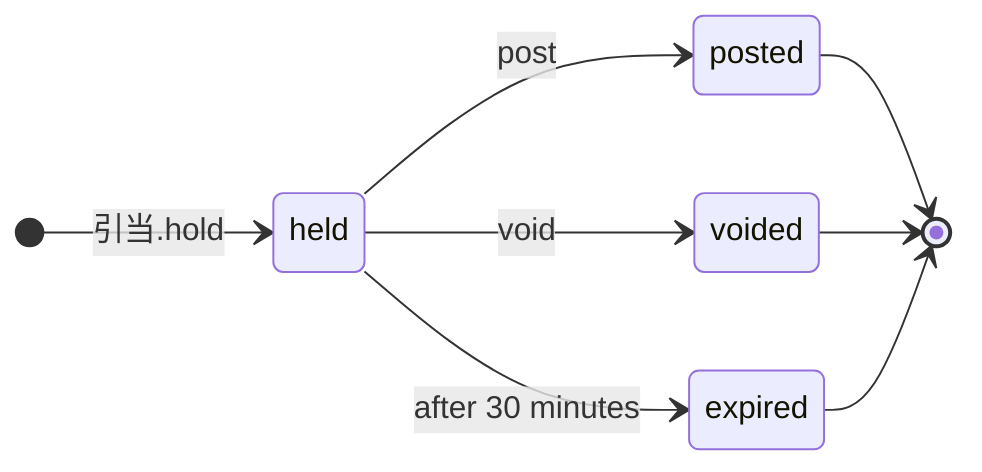

<!-- The output of `chobo doc tests/books/在庫.book`. Do not edit by hand. -->

# 在庫 v1

SKU ごとの在庫。入荷で増え、注文のために 30 分押さえ、出荷で確定し、キャンセルで取り消す

`tests/books/在庫.book`, as `chobo doc` writes it. Each account keeps a balance: what came in, less what went out. Every transfer keeps the bounds of the accounts: one that would break a bound is refused with the name the book gives that bound, and nothing of it moves. A transfer either moves at once (`do`), or first holds what it moves (`hold`); a hold is then posted (`post`, all of it or part), voided (`void`), or expires.

## Accounts

| Account | One for each | Unit | Bounds | What it is |
|---|---|---|---|---|
| `在庫` | `sku` | 個 | at least 0; a transfer that would go below is refused with `在庫切れ` | 倉庫の棚にある数 |
| `仕入先` | one account | 個 | outside the book: no bounds, and it may go below 0 |  |
| `客` | one account | 個 | outside the book: no bounds, and it may go below 0 |  |

## How things move


A box is an account, and an arrow a move of a transfer. A rounded box is an account outside the book, which has no bounds. A dashed arrow belongs to a transfer that holds first, and moves when the hold is posted.

## Transfers

### 入荷

- Moves `数` from `仕入先` to `在庫(sku)`.
- Key: once per `納品書` and `sku`. The same call again does nothing, and answers `done_before`; one that differs only in `数` is refused with `key_conflict`.
- Moves at once (`do`).

| Operation | May be refused with | When |
|---|---|---|
| `入荷.do` | `key_conflict` | a call with the same `納品書` and `sku` and other arguments came before |

<details><summary>How each refusal comes about</summary>

#### 入荷.do: key_conflict

```text
 1  入荷.do(納品書: 納品書-1, sku: sku-2, 数: 1)  done
 2  入荷.do(納品書: 納品書-1, sku: sku-2, 数: 2)  refused: key_conflict
```

</details>

### 引当

確定は出荷、取消はキャンセル

- Moves `数` from `在庫(sku)` to `客`.
- Key: once per `注文` and `sku`. The same call again does nothing, and answers `done_before`; one that differs only in `数` is refused with `key_conflict`; holding again with the same key after the hold has ended answers `done_before`, and holds nothing.
- Holds first: the caller posts or voids the hold. It expires 30 minutes after it was made, and what it holds goes back.



| The hold | post | void |
|---|---|---|
| held | posts it: the amounts given, or all of it, and the rest goes back; more than it holds is refused with `over_hold`; once 30 minutes have passed since it was held, refused with `expired` | voids it: what it holds goes back; once 30 minutes have passed since it was held, refused with `expired` |
| posted | `done_before` with the same amounts; refused with `key_conflict` with others | refused with `already_posted` |
| voided | refused with `already_voided` | `done_before` |
| expired | refused with `expired` | refused with `expired` |
| no hold with the key | refused with `no_such_hold` | refused with `no_such_hold` |

| Operation | May be refused with | When |
|---|---|---|
| `引当.hold` | `在庫切れ` | `在庫(sku)` would go below 0 |
| `引当.hold` | `key_conflict` | a call with the same `注文` and `sku` and other arguments came before |
| `引当.hold` | `already_refused` | a call with the same `注文` and `sku` was refused by a bound before; a key a bound refused stays refused, even once there is enough |
| `引当.post` | `key_conflict` | the hold was posted before, for other amounts |
| `引当.post` | `already_voided` | the hold is voided already |
| `引当.post` | `expired` | the hold has expired |
| `引当.post` | `over_hold` | more than the hold holds |
| `引当.post` | `no_such_hold` | there is no hold with that `注文` and `sku` |
| `引当.void` | `already_posted` | the hold is posted already |
| `引当.void` | `expired` | the hold has expired |
| `引当.void` | `no_such_hold` | there is no hold with that `注文` and `sku` |

<details><summary>How each refusal comes about</summary>

#### 引当.hold: 在庫切れ

```text
 1  引当.hold(注文: 注文-1, sku: sku-2, 数: 1)  refused: 在庫切れ (move 1 takes 1 from 在庫(sku-2): posted 0, held out 0)
```

#### 引当.hold: key_conflict

```text
 1  入荷.do(納品書: 納品書-1, sku: sku-2, 数: 1)  done
 2  引当.hold(注文: 注文-3, sku: sku-2, 数: 1)    done
 3  引当.hold(注文: 注文-3, sku: sku-2, 数: 2)    refused: key_conflict
```

#### 引当.hold: already_refused

```text
 1  引当.hold(注文: 注文-1, sku: sku-2, 数: 1)  refused: 在庫切れ (move 1 takes 1 from 在庫(sku-2): posted 0, held out 0)
 2  引当.hold(注文: 注文-1, sku: sku-2, 数: 1)  refused: already_refused
```

#### 引当.post: key_conflict

```text
 1  入荷.do(納品書: 納品書-1, sku: sku-2, 数: 2)  done
 2  引当.hold(注文: 注文-3, sku: sku-2, 数: 2)    done
 3  引当.post(注文: 注文-3, sku: sku-2)           done
 4  引当.post(注文: 注文-3, sku: sku-2, 数: 1)    refused: key_conflict
```

#### 引当.post: already_voided

```text
 1  入荷.do(納品書: 納品書-1, sku: sku-2, 数: 2)  done
 2  引当.hold(注文: 注文-3, sku: sku-2, 数: 2)    done
 3  引当.void(注文: 注文-3, sku: sku-2)           done
 4  引当.post(注文: 注文-3, sku: sku-2)           refused: already_voided
```

#### 引当.post: expired

```text
 1  入荷.do(納品書: 納品書-1, sku: sku-2, 数: 2)  done
 2  引当.hold(注文: 注文-3, sku: sku-2, 数: 2)    done
 3  pass 30 minutes                               引当(注文-3, sku-2) expired
 4  引当.post(注文: 注文-3, sku: sku-2)           refused: expired
```

#### 引当.post: over_hold

```text
 1  入荷.do(納品書: 納品書-1, sku: sku-2, 数: 2)  done
 2  引当.hold(注文: 注文-3, sku: sku-2, 数: 2)    done
 3  引当.post(注文: 注文-3, sku: sku-2, 数: 3)    refused: over_hold
```

#### 引当.post: no_such_hold

```text
 1  引当.post(注文: 注文-1, sku: sku-2)  refused: no_such_hold
```

#### 引当.void: already_posted

```text
 1  入荷.do(納品書: 納品書-1, sku: sku-2, 数: 2)  done
 2  引当.hold(注文: 注文-3, sku: sku-2, 数: 2)    done
 3  引当.post(注文: 注文-3, sku: sku-2)           done
 4  引当.void(注文: 注文-3, sku: sku-2)           refused: already_posted
```

#### 引当.void: expired

```text
 1  入荷.do(納品書: 納品書-1, sku: sku-2, 数: 2)  done
 2  引当.hold(注文: 注文-3, sku: sku-2, 数: 2)    done
 3  pass 30 minutes                               引当(注文-3, sku-2) expired
 4  引当.void(注文: 注文-3, sku: sku-2)           refused: expired
```

#### 引当.void: no_such_hold

```text
 1  引当.void(注文: 注文-1, sku: sku-2)  refused: no_such_hold
```

</details>

### 返品

- Moves `数` from `客` to `在庫(sku)`.
- Key: once per `返品伝票` and `sku`. The same call again does nothing, and answers `done_before`; one that differs only in `数` is refused with `key_conflict`.
- Moves at once (`do`).

| Operation | May be refused with | When |
|---|---|---|
| `返品.do` | `key_conflict` | a call with the same `返品伝票` and `sku` and other arguments came before |

<details><summary>How each refusal comes about</summary>

#### 返品.do: key_conflict

```text
 1  返品.do(返品伝票: 返品伝票-1, sku: sku-2, 数: 1)  done
 2  返品.do(返品伝票: 返品伝票-1, sku: sku-2, 数: 2)  refused: key_conflict
```

</details>

## Scenarios

21 scenarios, which `chobo scenarios` makes from the book: among them each bound just before, at and past it, each key used twice, every way a hold ends, and two callers after the last of something at the same time. The reference interpreter ran each one; after each step come the balances it left. A balance is what is posted, with what is held in brackets.

<details><summary>1. bound: 引当.hold takes 在庫(sku) to 1, one above <code>at least 0</code></summary>

| # | Operation | Result | 在庫(sku-2) | 仕入先 | 客 |
|---|---|---|---|---|---|
| 1 | 入荷.do(納品書: 納品書-1, sku: sku-2, 数: 2) | done | 2 | -2 | 0 |
| 2 | 引当.hold(注文: 注文-3, sku: sku-2, 数: 1) | done | 2 (held out 1) | -2 | 0 (held in 1) |

</details>

<details><summary>2. bound: 引当.hold takes 在庫(sku) to exactly 0, its <code>at least 0</code></summary>

| # | Operation | Result | 在庫(sku-2) | 仕入先 | 客 |
|---|---|---|---|---|---|
| 1 | 入荷.do(納品書: 納品書-1, sku: sku-2, 数: 2) | done | 2 | -2 | 0 |
| 2 | 引当.hold(注文: 注文-3, sku: sku-2, 数: 2) | done | 2 (held out 2) | -2 | 0 (held in 2) |

</details>

<details><summary>3. bound: 引当.hold would take 在庫(sku) to -1, below <code>at least 0</code></summary>

| # | Operation | Result | 在庫(sku-2) | 仕入先 | 客 |
|---|---|---|---|---|---|
| 1 | 入荷.do(納品書: 納品書-1, sku: sku-2, 数: 2) | done | 2 | -2 | 0 |
| 2 | 引当.hold(注文: 注文-3, sku: sku-2, 数: 3) | refused: 在庫切れ | 2 | -2 | 0 |

</details>

<details><summary>4. key: 入荷.do twice with the same arguments</summary>

| # | Operation | Result | 在庫(sku-2) | 仕入先 |
|---|---|---|---|---|
| 1 | 入荷.do(納品書: 納品書-1, sku: sku-2, 数: 1) | done | 1 | -1 |
| 2 | 入荷.do(納品書: 納品書-1, sku: sku-2, 数: 1) | done_before | 1 | -1 |

</details>

<details><summary>5. key: 入荷.do again with another 数</summary>

| # | Operation | Result | 在庫(sku-2) | 仕入先 |
|---|---|---|---|---|
| 1 | 入荷.do(納品書: 納品書-1, sku: sku-2, 数: 1) | done | 1 | -1 |
| 2 | 入荷.do(納品書: 納品書-1, sku: sku-2, 数: 2) | refused: key_conflict | 1 | -1 |

</details>

<details><summary>6. key: 引当.hold twice with the same arguments</summary>

| # | Operation | Result | 在庫(sku-2) | 仕入先 | 客 |
|---|---|---|---|---|---|
| 1 | 入荷.do(納品書: 納品書-1, sku: sku-2, 数: 1) | done | 1 | -1 | 0 |
| 2 | 引当.hold(注文: 注文-3, sku: sku-2, 数: 1) | done | 1 (held out 1) | -1 | 0 (held in 1) |
| 3 | 引当.hold(注文: 注文-3, sku: sku-2, 数: 1) | done_before | 1 (held out 1) | -1 | 0 (held in 1) |

</details>

<details><summary>7. key: 引当.hold again with another 数</summary>

| # | Operation | Result | 在庫(sku-2) | 仕入先 | 客 |
|---|---|---|---|---|---|
| 1 | 入荷.do(納品書: 納品書-1, sku: sku-2, 数: 1) | done | 1 | -1 | 0 |
| 2 | 引当.hold(注文: 注文-3, sku: sku-2, 数: 1) | done | 1 (held out 1) | -1 | 0 (held in 1) |
| 3 | 引当.hold(注文: 注文-3, sku: sku-2, 数: 2) | refused: key_conflict | 1 (held out 1) | -1 | 0 (held in 1) |

</details>

<details><summary>8. key: 引当.hold refused with 在庫切れ, then again, and again once 在庫(sku) has enough</summary>

| # | Operation | Result | 在庫(sku-2) | 仕入先 | 客 |
|---|---|---|---|---|---|
| 1 | 引当.hold(注文: 注文-1, sku: sku-2, 数: 1) | refused: 在庫切れ | 0 | 0 | 0 |
| 2 | 引当.hold(注文: 注文-1, sku: sku-2, 数: 1) | refused: already_refused | 0 | 0 | 0 |
| 3 | 入荷.do(納品書: 納品書-3, sku: sku-2, 数: 1) | done | 1 | -1 | 0 |
| 4 | 引当.hold(注文: 注文-1, sku: sku-2, 数: 1) | refused: already_refused | 1 | -1 | 0 |

</details>

<details><summary>9. key: 返品.do twice with the same arguments</summary>

| # | Operation | Result | 在庫(sku-2) | 客 |
|---|---|---|---|---|
| 1 | 返品.do(返品伝票: 返品伝票-1, sku: sku-2, 数: 1) | done | 1 | -1 |
| 2 | 返品.do(返品伝票: 返品伝票-1, sku: sku-2, 数: 1) | done_before | 1 | -1 |

</details>

<details><summary>10. key: 返品.do again with another 数</summary>

| # | Operation | Result | 在庫(sku-2) | 客 |
|---|---|---|---|---|
| 1 | 返品.do(返品伝票: 返品伝票-1, sku: sku-2, 数: 1) | done | 1 | -1 |
| 2 | 返品.do(返品伝票: 返品伝票-1, sku: sku-2, 数: 2) | refused: key_conflict | 1 | -1 |

</details>

<details><summary>11. hold: 引当 posted in full</summary>

| # | Operation | Result | 在庫(sku-2) | 仕入先 | 客 |
|---|---|---|---|---|---|
| 1 | 入荷.do(納品書: 納品書-1, sku: sku-2, 数: 2) | done | 2 | -2 | 0 |
| 2 | 引当.hold(注文: 注文-3, sku: sku-2, 数: 2) | done | 2 (held out 2) | -2 | 0 (held in 2) |
| 3 | 引当.post(注文: 注文-3, sku: sku-2) | done | 0 | -2 | 2 |

</details>

<details><summary>12. hold: 引当 posted in part</summary>

| # | Operation | Result | 在庫(sku-2) | 仕入先 | 客 |
|---|---|---|---|---|---|
| 1 | 入荷.do(納品書: 納品書-1, sku: sku-2, 数: 2) | done | 2 | -2 | 0 |
| 2 | 引当.hold(注文: 注文-3, sku: sku-2, 数: 2) | done | 2 (held out 2) | -2 | 0 (held in 2) |
| 3 | 引当.post(注文: 注文-3, sku: sku-2, 数: 1) | done | 1 | -2 | 1 |

</details>

<details><summary>13. hold: 引当 voided</summary>

| # | Operation | Result | 在庫(sku-2) | 仕入先 | 客 |
|---|---|---|---|---|---|
| 1 | 入荷.do(納品書: 納品書-1, sku: sku-2, 数: 2) | done | 2 | -2 | 0 |
| 2 | 引当.hold(注文: 注文-3, sku: sku-2, 数: 2) | done | 2 (held out 2) | -2 | 0 (held in 2) |
| 3 | 引当.void(注文: 注文-3, sku: sku-2) | done | 2 | -2 | 0 |

</details>

<details><summary>14. hold: 引当 posted, then voided</summary>

| # | Operation | Result | 在庫(sku-2) | 仕入先 | 客 |
|---|---|---|---|---|---|
| 1 | 入荷.do(納品書: 納品書-1, sku: sku-2, 数: 2) | done | 2 | -2 | 0 |
| 2 | 引当.hold(注文: 注文-3, sku: sku-2, 数: 2) | done | 2 (held out 2) | -2 | 0 (held in 2) |
| 3 | 引当.post(注文: 注文-3, sku: sku-2) | done | 0 | -2 | 2 |
| 4 | 引当.void(注文: 注文-3, sku: sku-2) | refused: already_posted | 0 | -2 | 2 |

</details>

<details><summary>15. hold: 引当 voided, then posted</summary>

| # | Operation | Result | 在庫(sku-2) | 仕入先 | 客 |
|---|---|---|---|---|---|
| 1 | 入荷.do(納品書: 納品書-1, sku: sku-2, 数: 2) | done | 2 | -2 | 0 |
| 2 | 引当.hold(注文: 注文-3, sku: sku-2, 数: 2) | done | 2 (held out 2) | -2 | 0 (held in 2) |
| 3 | 引当.void(注文: 注文-3, sku: sku-2) | done | 2 | -2 | 0 |
| 4 | 引当.post(注文: 注文-3, sku: sku-2) | refused: already_voided | 2 | -2 | 0 |

</details>

<details><summary>16. hold: 引当 posted for more than it holds, then for what it holds</summary>

| # | Operation | Result | 在庫(sku-2) | 仕入先 | 客 |
|---|---|---|---|---|---|
| 1 | 入荷.do(納品書: 納品書-1, sku: sku-2, 数: 2) | done | 2 | -2 | 0 |
| 2 | 引当.hold(注文: 注文-3, sku: sku-2, 数: 2) | done | 2 (held out 2) | -2 | 0 (held in 2) |
| 3 | 引当.post(注文: 注文-3, sku: sku-2, 数: 3) | refused: over_hold | 2 (held out 2) | -2 | 0 (held in 2) |
| 4 | 引当.post(注文: 注文-3, sku: sku-2, 数: 2) | done | 0 | -2 | 2 |

</details>

<details><summary>17. hold: 引当 posted before it is held, then held and posted</summary>

| # | Operation | Result | 在庫(sku-2) | 仕入先 | 客 |
|---|---|---|---|---|---|
| 1 | 引当.post(注文: 注文-1, sku: sku-2) | refused: no_such_hold | 0 | 0 | 0 |
| 2 | 入荷.do(納品書: 納品書-1, sku: sku-2, 数: 1) | done | 1 | -1 | 0 |
| 3 | 引当.hold(注文: 注文-1, sku: sku-2, 数: 1) | done | 1 (held out 1) | -1 | 0 (held in 1) |
| 4 | 引当.post(注文: 注文-1, sku: sku-2) | done | 0 | -1 | 1 |

</details>

<details><summary>18. hold: 引当 posted twice, with the same amounts and with others</summary>

| # | Operation | Result | 在庫(sku-2) | 仕入先 | 客 |
|---|---|---|---|---|---|
| 1 | 入荷.do(納品書: 納品書-1, sku: sku-2, 数: 2) | done | 2 | -2 | 0 |
| 2 | 引当.hold(注文: 注文-3, sku: sku-2, 数: 2) | done | 2 (held out 2) | -2 | 0 (held in 2) |
| 3 | 引当.post(注文: 注文-3, sku: sku-2) | done | 0 | -2 | 2 |
| 4 | 引当.post(注文: 注文-3, sku: sku-2) | done_before | 0 | -2 | 2 |
| 5 | 引当.post(注文: 注文-3, sku: sku-2, 数: 2) | done_before | 0 | -2 | 2 |
| 6 | 引当.post(注文: 注文-3, sku: sku-2, 数: 1) | refused: key_conflict | 0 | -2 | 2 |

</details>

<details><summary>19. pass: 引当 expires, then is posted and voided</summary>

| # | Operation | Result | 在庫(sku-2) | 仕入先 | 客 |
|---|---|---|---|---|---|
| 1 | 入荷.do(納品書: 納品書-1, sku: sku-2, 数: 2) | done | 2 | -2 | 0 |
| 2 | 引当.hold(注文: 注文-3, sku: sku-2, 数: 2) | done | 2 (held out 2) | -2 | 0 (held in 2) |
| 3 | pass 31 minutes | 引当(注文-3, sku-2) expired | 2 | -2 | 0 |
| 4 | 引当.post(注文: 注文-3, sku: sku-2) | refused: expired | 2 | -2 | 0 |
| 5 | 引当.void(注文: 注文-3, sku: sku-2) | refused: expired | 2 | -2 | 0 |

</details>

<details><summary>20. pass: 引当 held again with the same key after it expired</summary>

| # | Operation | Result | 在庫(sku-2) | 仕入先 | 客 |
|---|---|---|---|---|---|
| 1 | 入荷.do(納品書: 納品書-1, sku: sku-2, 数: 2) | done | 2 | -2 | 0 |
| 2 | 引当.hold(注文: 注文-3, sku: sku-2, 数: 2) | done | 2 (held out 2) | -2 | 0 (held in 2) |
| 3 | pass 31 minutes | 引当(注文-3, sku-2) expired | 2 | -2 | 0 |
| 4 | 引当.hold(注文: 注文-3, sku: sku-2, 数: 2) | done_before | 2 | -2 | 0 |

</details>

<details><summary>21. together: two callers take the last 1 of 在庫(sku) with 引当.hold</summary>

It can come out 2 ways, by the order the operations at the same time go in.

Outcome 1:

| # | Operation | Result | 在庫(sku-2) | 仕入先 | 客 |
|---|---|---|---|---|---|
| 1 | 入荷.do(納品書: 納品書-1, sku: sku-2, 数: 1) | done | 1 | -1 | 0 |
| 2 | together<br>caller 1: 引当.hold(注文: 注文-3, sku: sku-2, 数: 1)<br>caller 2: 引当.hold(注文: 注文-4, sku: sku-2, 数: 1) | <br>done<br>refused: 在庫切れ | 1 (held out 1) | -1 | 0 (held in 1) |

Outcome 2:

| # | Operation | Result | 在庫(sku-2) | 仕入先 | 客 |
|---|---|---|---|---|---|
| 1 | 入荷.do(納品書: 納品書-1, sku: sku-2, 数: 1) | done | 1 | -1 | 0 |
| 2 | together<br>caller 1: 引当.hold(注文: 注文-3, sku: sku-2, 数: 1)<br>caller 2: 引当.hold(注文: 注文-4, sku: sku-2, 数: 1) | <br>refused: 在庫切れ<br>done | 1 (held out 1) | -1 | 0 (held in 1) |

</details>

