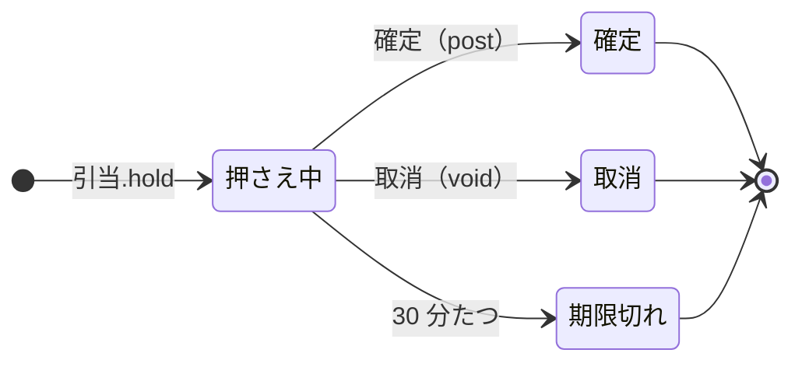

<!-- `chobo doc tests/books/在庫.book --lang ja` の出力です。手で編集しないでください。 -->

# 在庫 v1

SKU ごとの在庫。入荷で増え、注文のために 30 分押さえ、出荷で確定し、キャンセルで取り消す

`chobo doc` が `tests/books/在庫.book` から作ったページ。勘定ごとに残高を持ち、残高は入った量から出た量を引いたもの。どの振替も勘定の下限と上限を守り、守れない振替は、その境界に付けた名前で断られて、どの移動も行われない。振替には、すぐに動かすもの（`do`）と、動かす量をまず押さえるもの（`hold`）がある。押さえた分は、あとで確定される（`post`。全部か一部）か、取り消される（`void`）か、有効期限で切れる。

## 勘定

| 勘定 | 分け方 | 単位 | 境界 | 説明 |
|---|---|---|---|---|
| `在庫` | `sku` ごと | 個 | 0 以上。下回る振替は `在庫切れ` で断る | 倉庫の棚にある数 |
| `仕入先` | 一つだけ | 個 | 外の勘定。境界は無く、マイナスにもなる |  |
| `客` | 一つだけ | 個 | 外の勘定。境界は無く、マイナスにもなる |  |

## 勘定のあいだの流れ


四角は勘定で、矢印は振替の移動。角の丸い四角は外の勘定で、境界を持たない。破線の矢印は仮押さえの振替で、まず押さえ、確定したときに動く。

## 振替

### 入荷

- 移動: `仕入先` から `在庫(sku)` へ `数`。
- キー: `納品書` と `sku` ごとに一回。同じ呼び出しの二度目は何もせず、`done_before` を返す。`数` だけが違う二度目は `key_conflict` で断られる。
- すぐに動かす（`do`）。

| 操作 | 断られうる理由 | いつ |
|---|---|---|
| `入荷.do` | `key_conflict` | `納品書` と `sku` が同じで、ほかの引数が違う呼び出しが、前に済んでいる |

<details><summary>断られる例</summary>

#### 入荷.do: key_conflict

```text
 1  入荷.do(納品書: 納品書-1, sku: sku-2, 数: 1)  通る
 2  入荷.do(納品書: 納品書-1, sku: sku-2, 数: 2)  key_conflict で断られる
```

</details>

### 引当

確定は出荷、取消はキャンセル

- 移動: `在庫(sku)` から `客` へ `数`。
- キー: `注文` と `sku` ごとに一回。同じ呼び出しの二度目は何もせず、`done_before` を返す。`数` だけが違う二度目は `key_conflict` で断られる。押さえが終わったあとに同じキーで押さえ直すと `done_before` になり、何も押さえない。
- 仮押さえ: まず押さえる。確定と取消は呼ぶ側がする。押さえてから 30 分で期限が切れ、押さえた量は元に戻る。



| 仮押さえの状態 | post（確定） | void（取消） |
|---|---|---|
| 押さえ中 | 確定する。額を渡せばその額、渡さなければ全額で、残りは元に戻る。押さえた額を超えれば `over_hold` で断る。押さえてから 30 分たっていれば `expired` で断る | 取り消す。押さえた量は元に戻る。押さえてから 30 分たっていれば `expired` で断る |
| 確定 | 同じ額なら `done_before`、違う額なら `key_conflict` で断る | `already_posted` で断る |
| 取消 | `already_voided` で断る | `done_before` |
| 期限切れ | `expired` で断る | `expired` で断る |
| 仮押さえが無い | `no_such_hold` で断る | `no_such_hold` で断る |

| 操作 | 断られうる理由 | いつ |
|---|---|---|
| `引当.hold` | `在庫切れ` | `在庫(sku)` が 0 を下回る |
| `引当.hold` | `key_conflict` | `注文` と `sku` が同じで、ほかの引数が違う呼び出しが、前に済んでいる |
| `引当.hold` | `already_refused` | `注文` と `sku` が同じ呼び出しが、前に境界で断られている。境界で断られたキーは、あとで足りるようになっても通らない |
| `引当.post` | `key_conflict` | 仮押さえは、違う額で確定済み |
| `引当.post` | `already_voided` | 仮押さえはもう取り消されている |
| `引当.post` | `expired` | 仮押さえの期限が切れている |
| `引当.post` | `over_hold` | 押さえた額より多く確定しようとした |
| `引当.post` | `no_such_hold` | その `注文` と `sku` の仮押さえが無い |
| `引当.void` | `already_posted` | 仮押さえはもう確定している |
| `引当.void` | `expired` | 仮押さえの期限が切れている |
| `引当.void` | `no_such_hold` | その `注文` と `sku` の仮押さえが無い |

<details><summary>断られる例</summary>

#### 引当.hold: 在庫切れ

```text
 1  引当.hold(注文: 注文-1, sku: sku-2, 数: 1)  在庫切れ で断られる（1 つ目の移動が 在庫(sku-2) から 1 を取る。確定 0、出ていく仮押さえ 0）
```

#### 引当.hold: key_conflict

```text
 1  入荷.do(納品書: 納品書-1, sku: sku-2, 数: 1)  通る
 2  引当.hold(注文: 注文-3, sku: sku-2, 数: 1)    通る
 3  引当.hold(注文: 注文-3, sku: sku-2, 数: 2)    key_conflict で断られる
```

#### 引当.hold: already_refused

```text
 1  引当.hold(注文: 注文-1, sku: sku-2, 数: 1)  在庫切れ で断られる（1 つ目の移動が 在庫(sku-2) から 1 を取る。確定 0、出ていく仮押さえ 0）
 2  引当.hold(注文: 注文-1, sku: sku-2, 数: 1)  already_refused で断られる
```

#### 引当.post: key_conflict

```text
 1  入荷.do(納品書: 納品書-1, sku: sku-2, 数: 2)  通る
 2  引当.hold(注文: 注文-3, sku: sku-2, 数: 2)    通る
 3  引当.post(注文: 注文-3, sku: sku-2)           通る
 4  引当.post(注文: 注文-3, sku: sku-2, 数: 1)    key_conflict で断られる
```

#### 引当.post: already_voided

```text
 1  入荷.do(納品書: 納品書-1, sku: sku-2, 数: 2)  通る
 2  引当.hold(注文: 注文-3, sku: sku-2, 数: 2)    通る
 3  引当.void(注文: 注文-3, sku: sku-2)           通る
 4  引当.post(注文: 注文-3, sku: sku-2)           already_voided で断られる
```

#### 引当.post: expired

```text
 1  入荷.do(納品書: 納品書-1, sku: sku-2, 数: 2)  通る
 2  引当.hold(注文: 注文-3, sku: sku-2, 数: 2)    通る
 3  pass 30 分                                    引当(注文-3, sku-2) が期限切れ
 4  引当.post(注文: 注文-3, sku: sku-2)           expired で断られる
```

#### 引当.post: over_hold

```text
 1  入荷.do(納品書: 納品書-1, sku: sku-2, 数: 2)  通る
 2  引当.hold(注文: 注文-3, sku: sku-2, 数: 2)    通る
 3  引当.post(注文: 注文-3, sku: sku-2, 数: 3)    over_hold で断られる
```

#### 引当.post: no_such_hold

```text
 1  引当.post(注文: 注文-1, sku: sku-2)  no_such_hold で断られる
```

#### 引当.void: already_posted

```text
 1  入荷.do(納品書: 納品書-1, sku: sku-2, 数: 2)  通る
 2  引当.hold(注文: 注文-3, sku: sku-2, 数: 2)    通る
 3  引当.post(注文: 注文-3, sku: sku-2)           通る
 4  引当.void(注文: 注文-3, sku: sku-2)           already_posted で断られる
```

#### 引当.void: expired

```text
 1  入荷.do(納品書: 納品書-1, sku: sku-2, 数: 2)  通る
 2  引当.hold(注文: 注文-3, sku: sku-2, 数: 2)    通る
 3  pass 30 分                                    引当(注文-3, sku-2) が期限切れ
 4  引当.void(注文: 注文-3, sku: sku-2)           expired で断られる
```

#### 引当.void: no_such_hold

```text
 1  引当.void(注文: 注文-1, sku: sku-2)  no_such_hold で断られる
```

</details>

### 返品

- 移動: `客` から `在庫(sku)` へ `数`。
- キー: `返品伝票` と `sku` ごとに一回。同じ呼び出しの二度目は何もせず、`done_before` を返す。`数` だけが違う二度目は `key_conflict` で断られる。
- すぐに動かす（`do`）。

| 操作 | 断られうる理由 | いつ |
|---|---|---|
| `返品.do` | `key_conflict` | `返品伝票` と `sku` が同じで、ほかの引数が違う呼び出しが、前に済んでいる |

<details><summary>断られる例</summary>

#### 返品.do: key_conflict

```text
 1  返品.do(返品伝票: 返品伝票-1, sku: sku-2, 数: 1)  通る
 2  返品.do(返品伝票: 返品伝票-1, sku: sku-2, 数: 2)  key_conflict で断られる
```

</details>

## シナリオ

`chobo scenarios` が帳簿から作ったシナリオ 21 本。境界の手前・ちょうど・超える、同じキーの二度目、仮押さえの終わり方、二つの呼び出し元が同時に最後の一つを取りに来るもの、などがある。どれも参照インタプリタで流し、ステップごとに、そのあとの残高を載せる。残高は確定した量で、仮押さえがあれば括弧の中に書く。

<details><summary>1. 境界: 引当.hold が 在庫(sku) を 1 まで減らす。<code>at least 0</code> の 1 つ手前</summary>

| # | 操作 | 結果 | 在庫(sku-2) | 仕入先 | 客 |
|---|---|---|---|---|---|
| 1 | 入荷.do(納品書: 納品書-1, sku: sku-2, 数: 2) | 通る | 2 | -2 | 0 |
| 2 | 引当.hold(注文: 注文-3, sku: sku-2, 数: 1) | 通る | 2（出ていく仮押さえ 1） | -2 | 0（入ってくる仮押さえ 1） |

</details>

<details><summary>2. 境界: 引当.hold が 在庫(sku) をちょうど 0 まで減らす。<code>at least 0</code> ちょうど</summary>

| # | 操作 | 結果 | 在庫(sku-2) | 仕入先 | 客 |
|---|---|---|---|---|---|
| 1 | 入荷.do(納品書: 納品書-1, sku: sku-2, 数: 2) | 通る | 2 | -2 | 0 |
| 2 | 引当.hold(注文: 注文-3, sku: sku-2, 数: 2) | 通る | 2（出ていく仮押さえ 2） | -2 | 0（入ってくる仮押さえ 2） |

</details>

<details><summary>3. 境界: 引当.hold は 在庫(sku) を -1 まで減らすので断られる。<code>at least 0</code> を割る</summary>

| # | 操作 | 結果 | 在庫(sku-2) | 仕入先 | 客 |
|---|---|---|---|---|---|
| 1 | 入荷.do(納品書: 納品書-1, sku: sku-2, 数: 2) | 通る | 2 | -2 | 0 |
| 2 | 引当.hold(注文: 注文-3, sku: sku-2, 数: 3) | 在庫切れ で断られる | 2 | -2 | 0 |

</details>

<details><summary>4. キー: 入荷.do を同じ引数で二度呼ぶ</summary>

| # | 操作 | 結果 | 在庫(sku-2) | 仕入先 |
|---|---|---|---|---|
| 1 | 入荷.do(納品書: 納品書-1, sku: sku-2, 数: 1) | 通る | 1 | -1 |
| 2 | 入荷.do(納品書: 納品書-1, sku: sku-2, 数: 1) | done_before（前に済んでいる） | 1 | -1 |

</details>

<details><summary>5. キー: 入荷.do を 数 だけ変えてもう一度呼ぶ</summary>

| # | 操作 | 結果 | 在庫(sku-2) | 仕入先 |
|---|---|---|---|---|
| 1 | 入荷.do(納品書: 納品書-1, sku: sku-2, 数: 1) | 通る | 1 | -1 |
| 2 | 入荷.do(納品書: 納品書-1, sku: sku-2, 数: 2) | key_conflict で断られる | 1 | -1 |

</details>

<details><summary>6. キー: 引当.hold を同じ引数で二度呼ぶ</summary>

| # | 操作 | 結果 | 在庫(sku-2) | 仕入先 | 客 |
|---|---|---|---|---|---|
| 1 | 入荷.do(納品書: 納品書-1, sku: sku-2, 数: 1) | 通る | 1 | -1 | 0 |
| 2 | 引当.hold(注文: 注文-3, sku: sku-2, 数: 1) | 通る | 1（出ていく仮押さえ 1） | -1 | 0（入ってくる仮押さえ 1） |
| 3 | 引当.hold(注文: 注文-3, sku: sku-2, 数: 1) | done_before（前に済んでいる） | 1（出ていく仮押さえ 1） | -1 | 0（入ってくる仮押さえ 1） |

</details>

<details><summary>7. キー: 引当.hold を 数 だけ変えてもう一度呼ぶ</summary>

| # | 操作 | 結果 | 在庫(sku-2) | 仕入先 | 客 |
|---|---|---|---|---|---|
| 1 | 入荷.do(納品書: 納品書-1, sku: sku-2, 数: 1) | 通る | 1 | -1 | 0 |
| 2 | 引当.hold(注文: 注文-3, sku: sku-2, 数: 1) | 通る | 1（出ていく仮押さえ 1） | -1 | 0（入ってくる仮押さえ 1） |
| 3 | 引当.hold(注文: 注文-3, sku: sku-2, 数: 2) | key_conflict で断られる | 1（出ていく仮押さえ 1） | -1 | 0（入ってくる仮押さえ 1） |

</details>

<details><summary>8. キー: 引当.hold が 在庫切れ で断られ、同じ引数でもう一度、在庫(sku) が足りるようになってからもう一度呼ぶ</summary>

| # | 操作 | 結果 | 在庫(sku-2) | 仕入先 | 客 |
|---|---|---|---|---|---|
| 1 | 引当.hold(注文: 注文-1, sku: sku-2, 数: 1) | 在庫切れ で断られる | 0 | 0 | 0 |
| 2 | 引当.hold(注文: 注文-1, sku: sku-2, 数: 1) | already_refused で断られる | 0 | 0 | 0 |
| 3 | 入荷.do(納品書: 納品書-3, sku: sku-2, 数: 1) | 通る | 1 | -1 | 0 |
| 4 | 引当.hold(注文: 注文-1, sku: sku-2, 数: 1) | already_refused で断られる | 1 | -1 | 0 |

</details>

<details><summary>9. キー: 返品.do を同じ引数で二度呼ぶ</summary>

| # | 操作 | 結果 | 在庫(sku-2) | 客 |
|---|---|---|---|---|
| 1 | 返品.do(返品伝票: 返品伝票-1, sku: sku-2, 数: 1) | 通る | 1 | -1 |
| 2 | 返品.do(返品伝票: 返品伝票-1, sku: sku-2, 数: 1) | done_before（前に済んでいる） | 1 | -1 |

</details>

<details><summary>10. キー: 返品.do を 数 だけ変えてもう一度呼ぶ</summary>

| # | 操作 | 結果 | 在庫(sku-2) | 客 |
|---|---|---|---|---|
| 1 | 返品.do(返品伝票: 返品伝票-1, sku: sku-2, 数: 1) | 通る | 1 | -1 |
| 2 | 返品.do(返品伝票: 返品伝票-1, sku: sku-2, 数: 2) | key_conflict で断られる | 1 | -1 |

</details>

<details><summary>11. 仮押さえ: 引当 を全額で確定する</summary>

| # | 操作 | 結果 | 在庫(sku-2) | 仕入先 | 客 |
|---|---|---|---|---|---|
| 1 | 入荷.do(納品書: 納品書-1, sku: sku-2, 数: 2) | 通る | 2 | -2 | 0 |
| 2 | 引当.hold(注文: 注文-3, sku: sku-2, 数: 2) | 通る | 2（出ていく仮押さえ 2） | -2 | 0（入ってくる仮押さえ 2） |
| 3 | 引当.post(注文: 注文-3, sku: sku-2) | 通る | 0 | -2 | 2 |

</details>

<details><summary>12. 仮押さえ: 引当 を一部だけ確定する</summary>

| # | 操作 | 結果 | 在庫(sku-2) | 仕入先 | 客 |
|---|---|---|---|---|---|
| 1 | 入荷.do(納品書: 納品書-1, sku: sku-2, 数: 2) | 通る | 2 | -2 | 0 |
| 2 | 引当.hold(注文: 注文-3, sku: sku-2, 数: 2) | 通る | 2（出ていく仮押さえ 2） | -2 | 0（入ってくる仮押さえ 2） |
| 3 | 引当.post(注文: 注文-3, sku: sku-2, 数: 1) | 通る | 1 | -2 | 1 |

</details>

<details><summary>13. 仮押さえ: 引当 を取り消す</summary>

| # | 操作 | 結果 | 在庫(sku-2) | 仕入先 | 客 |
|---|---|---|---|---|---|
| 1 | 入荷.do(納品書: 納品書-1, sku: sku-2, 数: 2) | 通る | 2 | -2 | 0 |
| 2 | 引当.hold(注文: 注文-3, sku: sku-2, 数: 2) | 通る | 2（出ていく仮押さえ 2） | -2 | 0（入ってくる仮押さえ 2） |
| 3 | 引当.void(注文: 注文-3, sku: sku-2) | 通る | 2 | -2 | 0 |

</details>

<details><summary>14. 仮押さえ: 引当 を確定してから取り消そうとする</summary>

| # | 操作 | 結果 | 在庫(sku-2) | 仕入先 | 客 |
|---|---|---|---|---|---|
| 1 | 入荷.do(納品書: 納品書-1, sku: sku-2, 数: 2) | 通る | 2 | -2 | 0 |
| 2 | 引当.hold(注文: 注文-3, sku: sku-2, 数: 2) | 通る | 2（出ていく仮押さえ 2） | -2 | 0（入ってくる仮押さえ 2） |
| 3 | 引当.post(注文: 注文-3, sku: sku-2) | 通る | 0 | -2 | 2 |
| 4 | 引当.void(注文: 注文-3, sku: sku-2) | already_posted で断られる | 0 | -2 | 2 |

</details>

<details><summary>15. 仮押さえ: 引当 を取り消してから確定しようとする</summary>

| # | 操作 | 結果 | 在庫(sku-2) | 仕入先 | 客 |
|---|---|---|---|---|---|
| 1 | 入荷.do(納品書: 納品書-1, sku: sku-2, 数: 2) | 通る | 2 | -2 | 0 |
| 2 | 引当.hold(注文: 注文-3, sku: sku-2, 数: 2) | 通る | 2（出ていく仮押さえ 2） | -2 | 0（入ってくる仮押さえ 2） |
| 3 | 引当.void(注文: 注文-3, sku: sku-2) | 通る | 2 | -2 | 0 |
| 4 | 引当.post(注文: 注文-3, sku: sku-2) | already_voided で断られる | 2 | -2 | 0 |

</details>

<details><summary>16. 仮押さえ: 引当 を押さえた額より多く確定しようとし、押さえた額で確定する</summary>

| # | 操作 | 結果 | 在庫(sku-2) | 仕入先 | 客 |
|---|---|---|---|---|---|
| 1 | 入荷.do(納品書: 納品書-1, sku: sku-2, 数: 2) | 通る | 2 | -2 | 0 |
| 2 | 引当.hold(注文: 注文-3, sku: sku-2, 数: 2) | 通る | 2（出ていく仮押さえ 2） | -2 | 0（入ってくる仮押さえ 2） |
| 3 | 引当.post(注文: 注文-3, sku: sku-2, 数: 3) | over_hold で断られる | 2（出ていく仮押さえ 2） | -2 | 0（入ってくる仮押さえ 2） |
| 4 | 引当.post(注文: 注文-3, sku: sku-2, 数: 2) | 通る | 0 | -2 | 2 |

</details>

<details><summary>17. 仮押さえ: 引当 を押さえる前に確定しようとし、押さえてから確定する</summary>

| # | 操作 | 結果 | 在庫(sku-2) | 仕入先 | 客 |
|---|---|---|---|---|---|
| 1 | 引当.post(注文: 注文-1, sku: sku-2) | no_such_hold で断られる | 0 | 0 | 0 |
| 2 | 入荷.do(納品書: 納品書-1, sku: sku-2, 数: 1) | 通る | 1 | -1 | 0 |
| 3 | 引当.hold(注文: 注文-1, sku: sku-2, 数: 1) | 通る | 1（出ていく仮押さえ 1） | -1 | 0（入ってくる仮押さえ 1） |
| 4 | 引当.post(注文: 注文-1, sku: sku-2) | 通る | 0 | -1 | 1 |

</details>

<details><summary>18. 仮押さえ: 引当 を二度確定する。同じ額で、そして違う額で</summary>

| # | 操作 | 結果 | 在庫(sku-2) | 仕入先 | 客 |
|---|---|---|---|---|---|
| 1 | 入荷.do(納品書: 納品書-1, sku: sku-2, 数: 2) | 通る | 2 | -2 | 0 |
| 2 | 引当.hold(注文: 注文-3, sku: sku-2, 数: 2) | 通る | 2（出ていく仮押さえ 2） | -2 | 0（入ってくる仮押さえ 2） |
| 3 | 引当.post(注文: 注文-3, sku: sku-2) | 通る | 0 | -2 | 2 |
| 4 | 引当.post(注文: 注文-3, sku: sku-2) | done_before（前に済んでいる） | 0 | -2 | 2 |
| 5 | 引当.post(注文: 注文-3, sku: sku-2, 数: 2) | done_before（前に済んでいる） | 0 | -2 | 2 |
| 6 | 引当.post(注文: 注文-3, sku: sku-2, 数: 1) | key_conflict で断られる | 0 | -2 | 2 |

</details>

<details><summary>19. 期限切れ: 引当 が期限切れになってから、確定と取消を試す</summary>

| # | 操作 | 結果 | 在庫(sku-2) | 仕入先 | 客 |
|---|---|---|---|---|---|
| 1 | 入荷.do(納品書: 納品書-1, sku: sku-2, 数: 2) | 通る | 2 | -2 | 0 |
| 2 | 引当.hold(注文: 注文-3, sku: sku-2, 数: 2) | 通る | 2（出ていく仮押さえ 2） | -2 | 0（入ってくる仮押さえ 2） |
| 3 | pass 31 分 | 引当(注文-3, sku-2) が期限切れ | 2 | -2 | 0 |
| 4 | 引当.post(注文: 注文-3, sku: sku-2) | expired で断られる | 2 | -2 | 0 |
| 5 | 引当.void(注文: 注文-3, sku: sku-2) | expired で断られる | 2 | -2 | 0 |

</details>

<details><summary>20. 期限切れ: 引当 が期限切れになってから、同じキーで押さえ直す</summary>

| # | 操作 | 結果 | 在庫(sku-2) | 仕入先 | 客 |
|---|---|---|---|---|---|
| 1 | 入荷.do(納品書: 納品書-1, sku: sku-2, 数: 2) | 通る | 2 | -2 | 0 |
| 2 | 引当.hold(注文: 注文-3, sku: sku-2, 数: 2) | 通る | 2（出ていく仮押さえ 2） | -2 | 0（入ってくる仮押さえ 2） |
| 3 | pass 31 分 | 引当(注文-3, sku-2) が期限切れ | 2 | -2 | 0 |
| 4 | 引当.hold(注文: 注文-3, sku: sku-2, 数: 2) | done_before（前に済んでいる） | 2 | -2 | 0 |

</details>

<details><summary>21. 同時: 二つの呼び出し元が 引当.hold で 在庫(sku) の最後の 1 を取り合う</summary>

同時の操作の順序によって、結果は 2 通りある。

結果 1:

| # | 操作 | 結果 | 在庫(sku-2) | 仕入先 | 客 |
|---|---|---|---|---|---|
| 1 | 入荷.do(納品書: 納品書-1, sku: sku-2, 数: 1) | 通る | 1 | -1 | 0 |
| 2 | together<br>呼び出し元 1: 引当.hold(注文: 注文-3, sku: sku-2, 数: 1)<br>呼び出し元 2: 引当.hold(注文: 注文-4, sku: sku-2, 数: 1) | <br>通る<br>在庫切れ で断られる | 1（出ていく仮押さえ 1） | -1 | 0（入ってくる仮押さえ 1） |

結果 2:

| # | 操作 | 結果 | 在庫(sku-2) | 仕入先 | 客 |
|---|---|---|---|---|---|
| 1 | 入荷.do(納品書: 納品書-1, sku: sku-2, 数: 1) | 通る | 1 | -1 | 0 |
| 2 | together<br>呼び出し元 1: 引当.hold(注文: 注文-3, sku: sku-2, 数: 1)<br>呼び出し元 2: 引当.hold(注文: 注文-4, sku: sku-2, 数: 1) | <br>在庫切れ で断られる<br>通る | 1（出ていく仮押さえ 1） | -1 | 0（入ってくる仮押さえ 1） |

</details>

