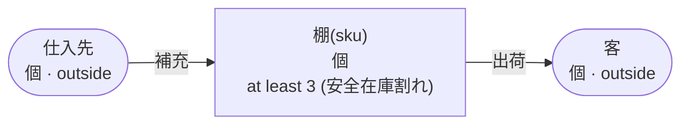

<!-- The output of `chobo doc tests/books/安全在庫.book`. Do not edit by hand. -->

# 安全在庫 v1

棚に 3 個を残し、それより下は出荷しない

`tests/books/安全在庫.book`, as `chobo doc` writes it. Each account keeps a balance: what came in, less what went out. Every transfer keeps the bounds of the accounts: one that would break a bound is refused with the name the book gives that bound, and nothing of it moves. A transfer either moves at once (`do`), or first holds what it moves (`hold`); a hold is then posted (`post`, all of it or part), voided (`void`), or expires.

## Accounts

| Account | One for each | Unit | Bounds | What it is |
|---|---|---|---|---|
| `棚` | `sku` | 個 | at least 3; a transfer that would go below is refused with `安全在庫割れ` |  |
| `仕入先` | one account | 個 | outside the book: no bounds, and it may go below 0 |  |
| `客` | one account | 個 | outside the book: no bounds, and it may go below 0 |  |

## How things move



A box is an account, and an arrow a move of a transfer. A rounded box is an account outside the book, which has no bounds. A dashed arrow belongs to a transfer that holds first, and moves when the hold is posted.

## Transfers

### 補充

- Moves `数` from `仕入先` to `棚(sku)`.
- Key: once per `伝票` and `sku`. The same call again does nothing, and answers `done_before`; one that differs only in `数` is refused with `key_conflict`.
- Moves at once (`do`).

| Operation | May be refused with | When |
|---|---|---|
| `補充.do` | `key_conflict` | a call with the same `伝票` and `sku` and other arguments came before |

<details><summary>How each refusal comes about</summary>

#### 補充.do: key_conflict

```text
 1  補充.do(伝票: 伝票-1, sku: sku-2, 数: 1)  done
 2  補充.do(伝票: 伝票-1, sku: sku-2, 数: 2)  refused: key_conflict
```

</details>

### 出荷

- Moves `数` from `棚(sku)` to `客`.
- Key: once per `注文` and `sku`. The same call again does nothing, and answers `done_before`; one that differs only in `数` is refused with `key_conflict`.
- Moves at once (`do`).

| Operation | May be refused with | When |
|---|---|---|
| `出荷.do` | `安全在庫割れ` | `棚(sku)` would go below 3 |
| `出荷.do` | `key_conflict` | a call with the same `注文` and `sku` and other arguments came before |
| `出荷.do` | `already_refused` | a call with the same `注文` and `sku` was refused by a bound before; a key a bound refused stays refused, even once there is enough |

<details><summary>How each refusal comes about</summary>

#### 出荷.do: 安全在庫割れ

```text
 1  出荷.do(注文: 注文-1, sku: sku-2, 数: 1)  refused: 安全在庫割れ (move 1 takes 1 from 棚(sku-2): posted 0, held out 0)
```

#### 出荷.do: key_conflict

```text
 1  補充.do(伝票: 伝票-1, sku: sku-2, 数: 4)  done
 2  出荷.do(注文: 注文-3, sku: sku-2, 数: 1)  done
 3  出荷.do(注文: 注文-3, sku: sku-2, 数: 2)  refused: key_conflict
```

#### 出荷.do: already_refused

```text
 1  出荷.do(注文: 注文-1, sku: sku-2, 数: 1)  refused: 安全在庫割れ (move 1 takes 1 from 棚(sku-2): posted 0, held out 0)
 2  出荷.do(注文: 注文-1, sku: sku-2, 数: 1)  refused: already_refused
```

</details>

## Scenarios

9 scenarios, which `chobo scenarios` makes from the book: among them each bound just before, at and past it, each key used twice, every way a hold ends, and two callers after the last of something at the same time. The reference interpreter ran each one; after each step come the balances it left. A balance is what is posted, with what is held in brackets.

<details><summary>1. bound: 出荷.do takes 棚(sku) to 4, one above <code>at least 3</code></summary>

| # | Operation | Result | 棚(sku-2) | 仕入先 | 客 |
|---|---|---|---|---|---|
| 1 | 補充.do(伝票: 伝票-1, sku: sku-2, 数: 5) | done | 5 | -5 | 0 |
| 2 | 出荷.do(注文: 注文-3, sku: sku-2, 数: 1) | done | 4 | -5 | 1 |

</details>

<details><summary>2. bound: 出荷.do takes 棚(sku) to exactly 3, its <code>at least 3</code></summary>

| # | Operation | Result | 棚(sku-2) | 仕入先 | 客 |
|---|---|---|---|---|---|
| 1 | 補充.do(伝票: 伝票-1, sku: sku-2, 数: 5) | done | 5 | -5 | 0 |
| 2 | 出荷.do(注文: 注文-3, sku: sku-2, 数: 2) | done | 3 | -5 | 2 |

</details>

<details><summary>3. bound: 出荷.do would take 棚(sku) to 2, below <code>at least 3</code></summary>

| # | Operation | Result | 棚(sku-2) | 仕入先 | 客 |
|---|---|---|---|---|---|
| 1 | 補充.do(伝票: 伝票-1, sku: sku-2, 数: 5) | done | 5 | -5 | 0 |
| 2 | 出荷.do(注文: 注文-3, sku: sku-2, 数: 3) | refused: 安全在庫割れ | 5 | -5 | 0 |

</details>

<details><summary>4. key: 補充.do twice with the same arguments</summary>

| # | Operation | Result | 棚(sku-2) | 仕入先 |
|---|---|---|---|---|
| 1 | 補充.do(伝票: 伝票-1, sku: sku-2, 数: 1) | done | 1 | -1 |
| 2 | 補充.do(伝票: 伝票-1, sku: sku-2, 数: 1) | done_before | 1 | -1 |

</details>

<details><summary>5. key: 補充.do again with another 数</summary>

| # | Operation | Result | 棚(sku-2) | 仕入先 |
|---|---|---|---|---|
| 1 | 補充.do(伝票: 伝票-1, sku: sku-2, 数: 1) | done | 1 | -1 |
| 2 | 補充.do(伝票: 伝票-1, sku: sku-2, 数: 2) | refused: key_conflict | 1 | -1 |

</details>

<details><summary>6. key: 出荷.do twice with the same arguments</summary>

| # | Operation | Result | 棚(sku-2) | 仕入先 | 客 |
|---|---|---|---|---|---|
| 1 | 補充.do(伝票: 伝票-1, sku: sku-2, 数: 4) | done | 4 | -4 | 0 |
| 2 | 出荷.do(注文: 注文-3, sku: sku-2, 数: 1) | done | 3 | -4 | 1 |
| 3 | 出荷.do(注文: 注文-3, sku: sku-2, 数: 1) | done_before | 3 | -4 | 1 |

</details>

<details><summary>7. key: 出荷.do again with another 数</summary>

| # | Operation | Result | 棚(sku-2) | 仕入先 | 客 |
|---|---|---|---|---|---|
| 1 | 補充.do(伝票: 伝票-1, sku: sku-2, 数: 4) | done | 4 | -4 | 0 |
| 2 | 出荷.do(注文: 注文-3, sku: sku-2, 数: 1) | done | 3 | -4 | 1 |
| 3 | 出荷.do(注文: 注文-3, sku: sku-2, 数: 2) | refused: key_conflict | 3 | -4 | 1 |

</details>

<details><summary>8. key: 出荷.do refused with 安全在庫割れ, then again, and again once 棚(sku) has enough</summary>

| # | Operation | Result | 棚(sku-2) | 仕入先 | 客 |
|---|---|---|---|---|---|
| 1 | 出荷.do(注文: 注文-1, sku: sku-2, 数: 1) | refused: 安全在庫割れ | 0 | 0 | 0 |
| 2 | 出荷.do(注文: 注文-1, sku: sku-2, 数: 1) | refused: already_refused | 0 | 0 | 0 |
| 3 | 補充.do(伝票: 伝票-3, sku: sku-2, 数: 4) | done | 4 | -4 | 0 |
| 4 | 出荷.do(注文: 注文-1, sku: sku-2, 数: 1) | refused: already_refused | 4 | -4 | 0 |

</details>

<details><summary>9. together: two callers take the last 1 of 棚(sku) with 出荷.do</summary>

It can come out 2 ways, by the order the operations at the same time go in.

Outcome 1:

| # | Operation | Result | 棚(sku-2) | 仕入先 | 客 |
|---|---|---|---|---|---|
| 1 | 補充.do(伝票: 伝票-1, sku: sku-2, 数: 4) | done | 4 | -4 | 0 |
| 2 | together<br>caller 1: 出荷.do(注文: 注文-3, sku: sku-2, 数: 1)<br>caller 2: 出荷.do(注文: 注文-4, sku: sku-2, 数: 1) | <br>done<br>refused: 安全在庫割れ | 3 | -4 | 1 |

Outcome 2:

| # | Operation | Result | 棚(sku-2) | 仕入先 | 客 |
|---|---|---|---|---|---|
| 1 | 補充.do(伝票: 伝票-1, sku: sku-2, 数: 4) | done | 4 | -4 | 0 |
| 2 | together<br>caller 1: 出荷.do(注文: 注文-3, sku: sku-2, 数: 1)<br>caller 2: 出荷.do(注文: 注文-4, sku: sku-2, 数: 1) | <br>refused: 安全在庫割れ<br>done | 3 | -4 | 1 |

</details>

