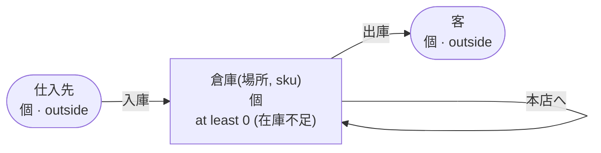

<!-- The output of `chobo doc tests/books/自分あて.book`. Do not edit by hand. -->

# 自分あて v1

倉庫のあいだの移し替え

`tests/books/自分あて.book`, as `chobo doc` writes it. Each account keeps a balance: what came in, less what went out. Every transfer keeps the bounds of the accounts: one that would break a bound is refused with the name the book gives that bound, and nothing of it moves. A transfer either moves at once (`do`), or first holds what it moves (`hold`); a hold is then posted (`post`, all of it or part), voided (`void`), or expires.

## Accounts

| Account | One for each | Unit | Bounds | What it is |
|---|---|---|---|---|
| `倉庫` | `場所` and `sku` | 個 | at least 0; a transfer that would go below is refused with `在庫不足` |  |
| `仕入先` | one account | 個 | outside the book: no bounds, and it may go below 0 |  |
| `客` | one account | 個 | outside the book: no bounds, and it may go below 0 |  |

## How things move



A box is an account, and an arrow a move of a transfer. A rounded box is an account outside the book, which has no bounds. A dashed arrow belongs to a transfer that holds first, and moves when the hold is posted.

## Transfers

### 入庫

- Moves `数` from `仕入先` to `倉庫(場所, sku)`.
- Key: once per `伝票`. The same call again does nothing, and answers `done_before`; one that differs only in `場所`, `sku` or `数` is refused with `key_conflict`.
- Moves at once (`do`).

| Operation | May be refused with | When |
|---|---|---|
| `入庫.do` | `key_conflict` | a call with the same `伝票` and other arguments came before |

<details><summary>How each refusal comes about</summary>

#### 入庫.do: key_conflict

```text
 1  入庫.do(伝票: 伝票-1, 場所: 場所-2, sku: sku-3, 数: 1)  done
 2  入庫.do(伝票: 伝票-1, 場所: 場所-2, sku: sku-3, 数: 2)  refused: key_conflict
```

</details>

### 移し替え

- Moves `数` from `倉庫(元, sku)` to `倉庫(先, sku)`.
- Key: once per `伝票`. The same call again does nothing, and answers `done_before`; one that differs only in `元`, `先`, `sku` or `数` is refused with `key_conflict`.
- Moves at once (`do`).

| Operation | May be refused with | When |
|---|---|---|
| `移し替え.do` | `在庫不足` | `倉庫(元, sku)` would go below 0 |
| `移し替え.do` | `key_conflict` | a call with the same `伝票` and other arguments came before |
| `移し替え.do` | `already_refused` | a call with the same `伝票` was refused by a bound before; a key a bound refused stays refused, even once there is enough |
| `移し替え.do` | `same_account` | a move would go from an account to itself |

<details><summary>How each refusal comes about</summary>

#### 移し替え.do: 在庫不足

```text
 1  移し替え.do(伝票: 伝票-1, 元: 元-2, 先: 先-3, sku: sku-4, 数: 1)  refused: 在庫不足 (move 1 takes 1 from 倉庫(元-2, sku-4): posted 0, held out 0)
```

#### 移し替え.do: key_conflict

```text
 1  入庫.do(伝票: 伝票-1, 場所: 元-2, sku: sku-3, 数: 1)              done
 2  移し替え.do(伝票: 伝票-4, 元: 元-2, 先: 先-5, sku: sku-3, 数: 1)  done
 3  移し替え.do(伝票: 伝票-4, 元: 元-2, 先: 先-5, sku: sku-3, 数: 2)  refused: key_conflict
```

#### 移し替え.do: already_refused

```text
 1  移し替え.do(伝票: 伝票-1, 元: 元-2, 先: 先-3, sku: sku-4, 数: 1)  refused: 在庫不足 (move 1 takes 1 from 倉庫(元-2, sku-4): posted 0, held out 0)
 2  移し替え.do(伝票: 伝票-1, 元: 元-2, 先: 先-3, sku: sku-4, 数: 1)  refused: already_refused
```

#### 移し替え.do: same_account

```text
 1  移し替え.do(伝票: 伝票-1, 元: 元-2, 先: 元-2, sku: sku-3, 数: 1)  refused: same_account
```

</details>

### 本店へ

- Moves `数` from `倉庫(元, sku)` to `倉庫("本店", sku)`.
- Key: once per `伝票`. The same call again does nothing, and answers `done_before`; one that differs only in `元`, `sku` or `数` is refused with `key_conflict`.
- Moves at once (`do`).

| Operation | May be refused with | When |
|---|---|---|
| `本店へ.do` | `在庫不足` | `倉庫(元, sku)` would go below 0 |
| `本店へ.do` | `key_conflict` | a call with the same `伝票` and other arguments came before |
| `本店へ.do` | `already_refused` | a call with the same `伝票` was refused by a bound before; a key a bound refused stays refused, even once there is enough |
| `本店へ.do` | `same_account` | a move would go from an account to itself |

<details><summary>How each refusal comes about</summary>

#### 本店へ.do: 在庫不足

```text
 1  本店へ.do(伝票: 伝票-1, 元: 元-2, sku: sku-3, 数: 1)  refused: 在庫不足 (move 1 takes 1 from 倉庫(元-2, sku-3): posted 0, held out 0)
```

#### 本店へ.do: key_conflict

```text
 1  入庫.do(伝票: 伝票-1, 場所: 元-2, sku: sku-3, 数: 1)  done
 2  本店へ.do(伝票: 伝票-4, 元: 元-2, sku: sku-3, 数: 1)  done
 3  本店へ.do(伝票: 伝票-4, 元: 元-2, sku: sku-3, 数: 2)  refused: key_conflict
```

#### 本店へ.do: already_refused

```text
 1  本店へ.do(伝票: 伝票-1, 元: 元-2, sku: sku-3, 数: 1)  refused: 在庫不足 (move 1 takes 1 from 倉庫(元-2, sku-3): posted 0, held out 0)
 2  本店へ.do(伝票: 伝票-1, 元: 元-2, sku: sku-3, 数: 1)  refused: already_refused
```

#### 本店へ.do: same_account

```text
 1  本店へ.do(伝票: 伝票-1, 元: 本店, sku: sku-2, 数: 1)  refused: same_account
```

</details>

### 出庫

- Moves `数` from `倉庫(場所, sku)` to `客`.
- Key: once per `伝票`. The same call again does nothing, and answers `done_before`; one that differs only in `場所`, `sku` or `数` is refused with `key_conflict`.
- Moves at once (`do`).

| Operation | May be refused with | When |
|---|---|---|
| `出庫.do` | `在庫不足` | `倉庫(場所, sku)` would go below 0 |
| `出庫.do` | `key_conflict` | a call with the same `伝票` and other arguments came before |
| `出庫.do` | `already_refused` | a call with the same `伝票` was refused by a bound before; a key a bound refused stays refused, even once there is enough |

<details><summary>How each refusal comes about</summary>

#### 出庫.do: 在庫不足

```text
 1  出庫.do(伝票: 伝票-1, 場所: 場所-2, sku: sku-3, 数: 1)  refused: 在庫不足 (move 1 takes 1 from 倉庫(場所-2, sku-3): posted 0, held out 0)
```

#### 出庫.do: key_conflict

```text
 1  入庫.do(伝票: 伝票-1, 場所: 場所-2, sku: sku-3, 数: 1)  done
 2  出庫.do(伝票: 伝票-4, 場所: 場所-2, sku: sku-3, 数: 1)  done
 3  出庫.do(伝票: 伝票-4, 場所: 場所-2, sku: sku-3, 数: 2)  refused: key_conflict
```

#### 出庫.do: already_refused

```text
 1  出庫.do(伝票: 伝票-1, 場所: 場所-2, sku: sku-3, 数: 1)  refused: 在庫不足 (move 1 takes 1 from 倉庫(場所-2, sku-3): posted 0, held out 0)
 2  出庫.do(伝票: 伝票-1, 場所: 場所-2, sku: sku-3, 数: 1)  refused: already_refused
```

</details>

## Scenarios

25 scenarios, which `chobo scenarios` makes from the book: among them each bound just before, at and past it, each key used twice, every way a hold ends, and two callers after the last of something at the same time. The reference interpreter ran each one; after each step come the balances it left. A balance is what is posted, with what is held in brackets.

<details><summary>1. bound: 移し替え.do takes 倉庫(元, sku) to 1, one above <code>at least 0</code></summary>

| # | Operation | Result | 倉庫(元-2, sku-3) | 倉庫(先-5, sku-3) | 仕入先 |
|---|---|---|---|---|---|
| 1 | 入庫.do(伝票: 伝票-1, 場所: 元-2, sku: sku-3, 数: 2) | done | 2 | 0 | -2 |
| 2 | 移し替え.do(伝票: 伝票-4, 元: 元-2, 先: 先-5, sku: sku-3, 数: 1) | done | 1 | 1 | -2 |

</details>

<details><summary>2. bound: 移し替え.do takes 倉庫(元, sku) to exactly 0, its <code>at least 0</code></summary>

| # | Operation | Result | 倉庫(元-2, sku-3) | 倉庫(先-5, sku-3) | 仕入先 |
|---|---|---|---|---|---|
| 1 | 入庫.do(伝票: 伝票-1, 場所: 元-2, sku: sku-3, 数: 2) | done | 2 | 0 | -2 |
| 2 | 移し替え.do(伝票: 伝票-4, 元: 元-2, 先: 先-5, sku: sku-3, 数: 2) | done | 0 | 2 | -2 |

</details>

<details><summary>3. bound: 移し替え.do would take 倉庫(元, sku) to -1, below <code>at least 0</code></summary>

| # | Operation | Result | 倉庫(元-2, sku-3) | 倉庫(先-5, sku-3) | 仕入先 |
|---|---|---|---|---|---|
| 1 | 入庫.do(伝票: 伝票-1, 場所: 元-2, sku: sku-3, 数: 2) | done | 2 | 0 | -2 |
| 2 | 移し替え.do(伝票: 伝票-4, 元: 元-2, 先: 先-5, sku: sku-3, 数: 3) | refused: 在庫不足 | 2 | 0 | -2 |

</details>

<details><summary>4. bound: 本店へ.do takes 倉庫(元, sku) to 1, one above <code>at least 0</code></summary>

| # | Operation | Result | 倉庫(元-2, sku-3) | 倉庫(本店, sku-3) | 仕入先 |
|---|---|---|---|---|---|
| 1 | 入庫.do(伝票: 伝票-1, 場所: 元-2, sku: sku-3, 数: 2) | done | 2 | 0 | -2 |
| 2 | 本店へ.do(伝票: 伝票-4, 元: 元-2, sku: sku-3, 数: 1) | done | 1 | 1 | -2 |

</details>

<details><summary>5. bound: 本店へ.do takes 倉庫(元, sku) to exactly 0, its <code>at least 0</code></summary>

| # | Operation | Result | 倉庫(元-2, sku-3) | 倉庫(本店, sku-3) | 仕入先 |
|---|---|---|---|---|---|
| 1 | 入庫.do(伝票: 伝票-1, 場所: 元-2, sku: sku-3, 数: 2) | done | 2 | 0 | -2 |
| 2 | 本店へ.do(伝票: 伝票-4, 元: 元-2, sku: sku-3, 数: 2) | done | 0 | 2 | -2 |

</details>

<details><summary>6. bound: 本店へ.do would take 倉庫(元, sku) to -1, below <code>at least 0</code></summary>

| # | Operation | Result | 倉庫(元-2, sku-3) | 倉庫(本店, sku-3) | 仕入先 |
|---|---|---|---|---|---|
| 1 | 入庫.do(伝票: 伝票-1, 場所: 元-2, sku: sku-3, 数: 2) | done | 2 | 0 | -2 |
| 2 | 本店へ.do(伝票: 伝票-4, 元: 元-2, sku: sku-3, 数: 3) | refused: 在庫不足 | 2 | 0 | -2 |

</details>

<details><summary>7. bound: 出庫.do takes 倉庫(場所, sku) to 1, one above <code>at least 0</code></summary>

| # | Operation | Result | 倉庫(場所-2, sku-3) | 仕入先 | 客 |
|---|---|---|---|---|---|
| 1 | 入庫.do(伝票: 伝票-1, 場所: 場所-2, sku: sku-3, 数: 2) | done | 2 | -2 | 0 |
| 2 | 出庫.do(伝票: 伝票-4, 場所: 場所-2, sku: sku-3, 数: 1) | done | 1 | -2 | 1 |

</details>

<details><summary>8. bound: 出庫.do takes 倉庫(場所, sku) to exactly 0, its <code>at least 0</code></summary>

| # | Operation | Result | 倉庫(場所-2, sku-3) | 仕入先 | 客 |
|---|---|---|---|---|---|
| 1 | 入庫.do(伝票: 伝票-1, 場所: 場所-2, sku: sku-3, 数: 2) | done | 2 | -2 | 0 |
| 2 | 出庫.do(伝票: 伝票-4, 場所: 場所-2, sku: sku-3, 数: 2) | done | 0 | -2 | 2 |

</details>

<details><summary>9. bound: 出庫.do would take 倉庫(場所, sku) to -1, below <code>at least 0</code></summary>

| # | Operation | Result | 倉庫(場所-2, sku-3) | 仕入先 | 客 |
|---|---|---|---|---|---|
| 1 | 入庫.do(伝票: 伝票-1, 場所: 場所-2, sku: sku-3, 数: 2) | done | 2 | -2 | 0 |
| 2 | 出庫.do(伝票: 伝票-4, 場所: 場所-2, sku: sku-3, 数: 3) | refused: 在庫不足 | 2 | -2 | 0 |

</details>

<details><summary>10. key: 入庫.do twice with the same arguments</summary>

| # | Operation | Result | 倉庫(場所-2, sku-3) | 仕入先 |
|---|---|---|---|---|
| 1 | 入庫.do(伝票: 伝票-1, 場所: 場所-2, sku: sku-3, 数: 1) | done | 1 | -1 |
| 2 | 入庫.do(伝票: 伝票-1, 場所: 場所-2, sku: sku-3, 数: 1) | done_before | 1 | -1 |

</details>

<details><summary>11. key: 入庫.do again with another 数</summary>

| # | Operation | Result | 倉庫(場所-2, sku-3) | 仕入先 |
|---|---|---|---|---|
| 1 | 入庫.do(伝票: 伝票-1, 場所: 場所-2, sku: sku-3, 数: 1) | done | 1 | -1 |
| 2 | 入庫.do(伝票: 伝票-1, 場所: 場所-2, sku: sku-3, 数: 2) | refused: key_conflict | 1 | -1 |

</details>

<details><summary>12. key: 移し替え.do twice with the same arguments</summary>

| # | Operation | Result | 倉庫(元-2, sku-3) | 倉庫(先-5, sku-3) | 仕入先 |
|---|---|---|---|---|---|
| 1 | 入庫.do(伝票: 伝票-1, 場所: 元-2, sku: sku-3, 数: 1) | done | 1 | 0 | -1 |
| 2 | 移し替え.do(伝票: 伝票-4, 元: 元-2, 先: 先-5, sku: sku-3, 数: 1) | done | 0 | 1 | -1 |
| 3 | 移し替え.do(伝票: 伝票-4, 元: 元-2, 先: 先-5, sku: sku-3, 数: 1) | done_before | 0 | 1 | -1 |

</details>

<details><summary>13. key: 移し替え.do again with another 数</summary>

| # | Operation | Result | 倉庫(元-2, sku-3) | 倉庫(先-5, sku-3) | 仕入先 |
|---|---|---|---|---|---|
| 1 | 入庫.do(伝票: 伝票-1, 場所: 元-2, sku: sku-3, 数: 1) | done | 1 | 0 | -1 |
| 2 | 移し替え.do(伝票: 伝票-4, 元: 元-2, 先: 先-5, sku: sku-3, 数: 1) | done | 0 | 1 | -1 |
| 3 | 移し替え.do(伝票: 伝票-4, 元: 元-2, 先: 先-5, sku: sku-3, 数: 2) | refused: key_conflict | 0 | 1 | -1 |

</details>

<details><summary>14. key: 移し替え.do refused with 在庫不足, then again, and again once 倉庫(元, sku) has enough</summary>

| # | Operation | Result | 倉庫(元-2, sku-4) | 倉庫(先-3, sku-4) | 仕入先 |
|---|---|---|---|---|---|
| 1 | 移し替え.do(伝票: 伝票-1, 元: 元-2, 先: 先-3, sku: sku-4, 数: 1) | refused: 在庫不足 | 0 | 0 | 0 |
| 2 | 移し替え.do(伝票: 伝票-1, 元: 元-2, 先: 先-3, sku: sku-4, 数: 1) | refused: already_refused | 0 | 0 | 0 |
| 3 | 入庫.do(伝票: 伝票-5, 場所: 元-2, sku: sku-4, 数: 1) | done | 1 | 0 | -1 |
| 4 | 移し替え.do(伝票: 伝票-1, 元: 元-2, 先: 先-3, sku: sku-4, 数: 1) | refused: already_refused | 1 | 0 | -1 |

</details>

<details><summary>15. key: 本店へ.do twice with the same arguments</summary>

| # | Operation | Result | 倉庫(元-2, sku-3) | 倉庫(本店, sku-3) | 仕入先 |
|---|---|---|---|---|---|
| 1 | 入庫.do(伝票: 伝票-1, 場所: 元-2, sku: sku-3, 数: 1) | done | 1 | 0 | -1 |
| 2 | 本店へ.do(伝票: 伝票-4, 元: 元-2, sku: sku-3, 数: 1) | done | 0 | 1 | -1 |
| 3 | 本店へ.do(伝票: 伝票-4, 元: 元-2, sku: sku-3, 数: 1) | done_before | 0 | 1 | -1 |

</details>

<details><summary>16. key: 本店へ.do again with another 数</summary>

| # | Operation | Result | 倉庫(元-2, sku-3) | 倉庫(本店, sku-3) | 仕入先 |
|---|---|---|---|---|---|
| 1 | 入庫.do(伝票: 伝票-1, 場所: 元-2, sku: sku-3, 数: 1) | done | 1 | 0 | -1 |
| 2 | 本店へ.do(伝票: 伝票-4, 元: 元-2, sku: sku-3, 数: 1) | done | 0 | 1 | -1 |
| 3 | 本店へ.do(伝票: 伝票-4, 元: 元-2, sku: sku-3, 数: 2) | refused: key_conflict | 0 | 1 | -1 |

</details>

<details><summary>17. key: 本店へ.do refused with 在庫不足, then again, and again once 倉庫(元, sku) has enough</summary>

| # | Operation | Result | 倉庫(元-2, sku-3) | 倉庫(本店, sku-3) | 仕入先 |
|---|---|---|---|---|---|
| 1 | 本店へ.do(伝票: 伝票-1, 元: 元-2, sku: sku-3, 数: 1) | refused: 在庫不足 | 0 | 0 | 0 |
| 2 | 本店へ.do(伝票: 伝票-1, 元: 元-2, sku: sku-3, 数: 1) | refused: already_refused | 0 | 0 | 0 |
| 3 | 入庫.do(伝票: 伝票-4, 場所: 元-2, sku: sku-3, 数: 1) | done | 1 | 0 | -1 |
| 4 | 本店へ.do(伝票: 伝票-1, 元: 元-2, sku: sku-3, 数: 1) | refused: already_refused | 1 | 0 | -1 |

</details>

<details><summary>18. key: 出庫.do twice with the same arguments</summary>

| # | Operation | Result | 倉庫(場所-2, sku-3) | 仕入先 | 客 |
|---|---|---|---|---|---|
| 1 | 入庫.do(伝票: 伝票-1, 場所: 場所-2, sku: sku-3, 数: 1) | done | 1 | -1 | 0 |
| 2 | 出庫.do(伝票: 伝票-4, 場所: 場所-2, sku: sku-3, 数: 1) | done | 0 | -1 | 1 |
| 3 | 出庫.do(伝票: 伝票-4, 場所: 場所-2, sku: sku-3, 数: 1) | done_before | 0 | -1 | 1 |

</details>

<details><summary>19. key: 出庫.do again with another 数</summary>

| # | Operation | Result | 倉庫(場所-2, sku-3) | 仕入先 | 客 |
|---|---|---|---|---|---|
| 1 | 入庫.do(伝票: 伝票-1, 場所: 場所-2, sku: sku-3, 数: 1) | done | 1 | -1 | 0 |
| 2 | 出庫.do(伝票: 伝票-4, 場所: 場所-2, sku: sku-3, 数: 1) | done | 0 | -1 | 1 |
| 3 | 出庫.do(伝票: 伝票-4, 場所: 場所-2, sku: sku-3, 数: 2) | refused: key_conflict | 0 | -1 | 1 |

</details>

<details><summary>20. key: 出庫.do refused with 在庫不足, then again, and again once 倉庫(場所, sku) has enough</summary>

| # | Operation | Result | 倉庫(場所-2, sku-3) | 仕入先 | 客 |
|---|---|---|---|---|---|
| 1 | 出庫.do(伝票: 伝票-1, 場所: 場所-2, sku: sku-3, 数: 1) | refused: 在庫不足 | 0 | 0 | 0 |
| 2 | 出庫.do(伝票: 伝票-1, 場所: 場所-2, sku: sku-3, 数: 1) | refused: already_refused | 0 | 0 | 0 |
| 3 | 入庫.do(伝票: 伝票-4, 場所: 場所-2, sku: sku-3, 数: 1) | done | 1 | -1 | 0 |
| 4 | 出庫.do(伝票: 伝票-1, 場所: 場所-2, sku: sku-3, 数: 1) | refused: already_refused | 1 | -1 | 0 |

</details>

<details><summary>21. together: two callers take the last 1 of 倉庫(元, sku) with 移し替え.do</summary>

It can come out 2 ways, by the order the operations at the same time go in.

Outcome 1:

| # | Operation | Result | 倉庫(元-2, sku-3) | 倉庫(先-5, sku-3) | 倉庫(先-7, sku-3) | 仕入先 |
|---|---|---|---|---|---|---|
| 1 | 入庫.do(伝票: 伝票-1, 場所: 元-2, sku: sku-3, 数: 1) | done | 1 | 0 | 0 | -1 |
| 2 | together<br>caller 1: 移し替え.do(伝票: 伝票-4, 元: 元-2, 先: 先-5, sku: sku-3, 数: 1)<br>caller 2: 移し替え.do(伝票: 伝票-6, 元: 元-2, 先: 先-7, sku: sku-3, 数: 1) | <br>done<br>refused: 在庫不足 | 0 | 1 | 0 | -1 |

Outcome 2:

| # | Operation | Result | 倉庫(元-2, sku-3) | 倉庫(先-5, sku-3) | 倉庫(先-7, sku-3) | 仕入先 |
|---|---|---|---|---|---|---|
| 1 | 入庫.do(伝票: 伝票-1, 場所: 元-2, sku: sku-3, 数: 1) | done | 1 | 0 | 0 | -1 |
| 2 | together<br>caller 1: 移し替え.do(伝票: 伝票-4, 元: 元-2, 先: 先-5, sku: sku-3, 数: 1)<br>caller 2: 移し替え.do(伝票: 伝票-6, 元: 元-2, 先: 先-7, sku: sku-3, 数: 1) | <br>refused: 在庫不足<br>done | 0 | 0 | 1 | -1 |

</details>

<details><summary>22. together: two callers take the last 1 of 倉庫(元, sku) with 本店へ.do</summary>

It can come out 2 ways, by the order the operations at the same time go in.

Outcome 1:

| # | Operation | Result | 倉庫(元-2, sku-3) | 倉庫(本店, sku-3) | 仕入先 |
|---|---|---|---|---|---|
| 1 | 入庫.do(伝票: 伝票-1, 場所: 元-2, sku: sku-3, 数: 1) | done | 1 | 0 | -1 |
| 2 | together<br>caller 1: 本店へ.do(伝票: 伝票-4, 元: 元-2, sku: sku-3, 数: 1)<br>caller 2: 本店へ.do(伝票: 伝票-5, 元: 元-2, sku: sku-3, 数: 1) | <br>done<br>refused: 在庫不足 | 0 | 1 | -1 |

Outcome 2:

| # | Operation | Result | 倉庫(元-2, sku-3) | 倉庫(本店, sku-3) | 仕入先 |
|---|---|---|---|---|---|
| 1 | 入庫.do(伝票: 伝票-1, 場所: 元-2, sku: sku-3, 数: 1) | done | 1 | 0 | -1 |
| 2 | together<br>caller 1: 本店へ.do(伝票: 伝票-4, 元: 元-2, sku: sku-3, 数: 1)<br>caller 2: 本店へ.do(伝票: 伝票-5, 元: 元-2, sku: sku-3, 数: 1) | <br>refused: 在庫不足<br>done | 0 | 1 | -1 |

</details>

<details><summary>23. together: two callers take the last 1 of 倉庫(場所, sku) with 出庫.do</summary>

It can come out 2 ways, by the order the operations at the same time go in.

Outcome 1:

| # | Operation | Result | 倉庫(場所-2, sku-3) | 仕入先 | 客 |
|---|---|---|---|---|---|
| 1 | 入庫.do(伝票: 伝票-1, 場所: 場所-2, sku: sku-3, 数: 1) | done | 1 | -1 | 0 |
| 2 | together<br>caller 1: 出庫.do(伝票: 伝票-4, 場所: 場所-2, sku: sku-3, 数: 1)<br>caller 2: 出庫.do(伝票: 伝票-5, 場所: 場所-2, sku: sku-3, 数: 1) | <br>done<br>refused: 在庫不足 | 0 | -1 | 1 |

Outcome 2:

| # | Operation | Result | 倉庫(場所-2, sku-3) | 仕入先 | 客 |
|---|---|---|---|---|---|
| 1 | 入庫.do(伝票: 伝票-1, 場所: 場所-2, sku: sku-3, 数: 1) | done | 1 | -1 | 0 |
| 2 | together<br>caller 1: 出庫.do(伝票: 伝票-4, 場所: 場所-2, sku: sku-3, 数: 1)<br>caller 2: 出庫.do(伝票: 伝票-5, 場所: 場所-2, sku: sku-3, 数: 1) | <br>refused: 在庫不足<br>done | 0 | -1 | 1 |

</details>

<details><summary>24. same_account: 移し替え.do moves 倉庫(元, sku) to 倉庫(先, sku), the same account</summary>

| # | Operation | Result | 倉庫(元-2, sku-3) |
|---|---|---|---|
| 1 | 移し替え.do(伝票: 伝票-1, 元: 元-2, 先: 元-2, sku: sku-3, 数: 1) | refused: same_account | 0 |

</details>

<details><summary>25. same_account: 本店へ.do moves 倉庫(元, sku) to 倉庫(&quot;本店&quot;, sku), the same account</summary>

| # | Operation | Result | 倉庫(本店, sku-2) |
|---|---|---|---|
| 1 | 本店へ.do(伝票: 伝票-1, 元: 本店, sku: sku-2, 数: 1) | refused: same_account | 0 |

</details>

