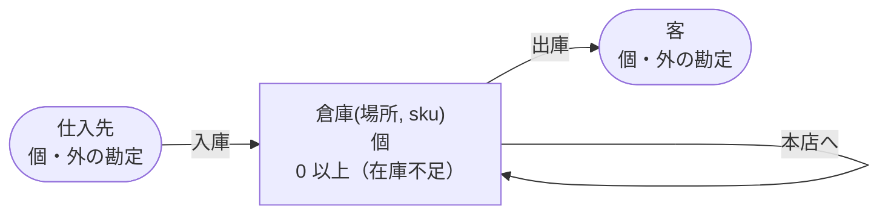

<!-- `chobo doc tests/books/自分あて.book --lang ja` の出力です。手で編集しないでください。 -->

# 自分あて v1

倉庫のあいだの移し替え

`chobo doc` が `tests/books/自分あて.book` から作ったページ。勘定ごとに残高を持ち、残高は入った量から出た量を引いたもの。どの振替も勘定の下限と上限を守り、守れない振替は、その境界に付けた名前で断られて、どの移動も行われない。振替には、すぐに動かすもの（`do`）と、動かす量をまず押さえるもの（`hold`）がある。押さえた分は、あとで確定される（`post`。全部か一部）か、取り消される（`void`）か、有効期限で切れる。

## 勘定

| 勘定 | 分け方 | 単位 | 境界 | 説明 |
|---|---|---|---|---|
| `倉庫` | `場所` と `sku` ごと | 個 | 0 以上。下回る振替は `在庫不足` で断る |  |
| `仕入先` | 一つだけ | 個 | 外の勘定。境界は無く、マイナスにもなる |  |
| `客` | 一つだけ | 個 | 外の勘定。境界は無く、マイナスにもなる |  |

## 勘定のあいだの流れ



四角は勘定で、矢印は振替の移動。角の丸い四角は外の勘定で、境界を持たない。破線の矢印は仮押さえの振替で、まず押さえ、確定したときに動く。

## 振替

### 入庫

- 移動: `仕入先` から `倉庫(場所, sku)` へ `数`。
- キー: `伝票` ごとに一回。同じ呼び出しの二度目は何もせず、`done_before` を返す。`場所`、`sku` か `数` だけが違う二度目は `key_conflict` で断られる。
- すぐに動かす（`do`）。

| 操作 | 断られうる理由 | いつ |
|---|---|---|
| `入庫.do` | `key_conflict` | `伝票` が同じで、ほかの引数が違う呼び出しが、前に済んでいる |

<details><summary>断られる例</summary>

#### 入庫.do: key_conflict

```text
 1  入庫.do(伝票: 伝票-1, 場所: 場所-2, sku: sku-3, 数: 1)  通る
 2  入庫.do(伝票: 伝票-1, 場所: 場所-2, sku: sku-3, 数: 2)  key_conflict で断られる
```

</details>

### 移し替え

- 移動: `倉庫(元, sku)` から `倉庫(先, sku)` へ `数`。
- キー: `伝票` ごとに一回。同じ呼び出しの二度目は何もせず、`done_before` を返す。`元`、`先`、`sku` か `数` だけが違う二度目は `key_conflict` で断られる。
- すぐに動かす（`do`）。

| 操作 | 断られうる理由 | いつ |
|---|---|---|
| `移し替え.do` | `在庫不足` | `倉庫(元, sku)` が 0 を下回る |
| `移し替え.do` | `key_conflict` | `伝票` が同じで、ほかの引数が違う呼び出しが、前に済んでいる |
| `移し替え.do` | `already_refused` | `伝票` が同じ呼び出しが、前に境界で断られている。境界で断られたキーは、あとで足りるようになっても通らない |
| `移し替え.do` | `same_account` | 移動の元と先が同じ勘定になる |

<details><summary>断られる例</summary>

#### 移し替え.do: 在庫不足

```text
 1  移し替え.do(伝票: 伝票-1, 元: 元-2, 先: 先-3, sku: sku-4, 数: 1)  在庫不足 で断られる（1 つ目の移動が 倉庫(元-2, sku-4) から 1 を取る。確定 0、出ていく仮押さえ 0）
```

#### 移し替え.do: key_conflict

```text
 1  入庫.do(伝票: 伝票-1, 場所: 元-2, sku: sku-3, 数: 1)              通る
 2  移し替え.do(伝票: 伝票-4, 元: 元-2, 先: 先-5, sku: sku-3, 数: 1)  通る
 3  移し替え.do(伝票: 伝票-4, 元: 元-2, 先: 先-5, sku: sku-3, 数: 2)  key_conflict で断られる
```

#### 移し替え.do: already_refused

```text
 1  移し替え.do(伝票: 伝票-1, 元: 元-2, 先: 先-3, sku: sku-4, 数: 1)  在庫不足 で断られる（1 つ目の移動が 倉庫(元-2, sku-4) から 1 を取る。確定 0、出ていく仮押さえ 0）
 2  移し替え.do(伝票: 伝票-1, 元: 元-2, 先: 先-3, sku: sku-4, 数: 1)  already_refused で断られる
```

#### 移し替え.do: same_account

```text
 1  移し替え.do(伝票: 伝票-1, 元: 元-2, 先: 元-2, sku: sku-3, 数: 1)  same_account で断られる
```

</details>

### 本店へ

- 移動: `倉庫(元, sku)` から `倉庫("本店", sku)` へ `数`。
- キー: `伝票` ごとに一回。同じ呼び出しの二度目は何もせず、`done_before` を返す。`元`、`sku` か `数` だけが違う二度目は `key_conflict` で断られる。
- すぐに動かす（`do`）。

| 操作 | 断られうる理由 | いつ |
|---|---|---|
| `本店へ.do` | `在庫不足` | `倉庫(元, sku)` が 0 を下回る |
| `本店へ.do` | `key_conflict` | `伝票` が同じで、ほかの引数が違う呼び出しが、前に済んでいる |
| `本店へ.do` | `already_refused` | `伝票` が同じ呼び出しが、前に境界で断られている。境界で断られたキーは、あとで足りるようになっても通らない |
| `本店へ.do` | `same_account` | 移動の元と先が同じ勘定になる |

<details><summary>断られる例</summary>

#### 本店へ.do: 在庫不足

```text
 1  本店へ.do(伝票: 伝票-1, 元: 元-2, sku: sku-3, 数: 1)  在庫不足 で断られる（1 つ目の移動が 倉庫(元-2, sku-3) から 1 を取る。確定 0、出ていく仮押さえ 0）
```

#### 本店へ.do: key_conflict

```text
 1  入庫.do(伝票: 伝票-1, 場所: 元-2, sku: sku-3, 数: 1)  通る
 2  本店へ.do(伝票: 伝票-4, 元: 元-2, sku: sku-3, 数: 1)  通る
 3  本店へ.do(伝票: 伝票-4, 元: 元-2, sku: sku-3, 数: 2)  key_conflict で断られる
```

#### 本店へ.do: already_refused

```text
 1  本店へ.do(伝票: 伝票-1, 元: 元-2, sku: sku-3, 数: 1)  在庫不足 で断られる（1 つ目の移動が 倉庫(元-2, sku-3) から 1 を取る。確定 0、出ていく仮押さえ 0）
 2  本店へ.do(伝票: 伝票-1, 元: 元-2, sku: sku-3, 数: 1)  already_refused で断られる
```

#### 本店へ.do: same_account

```text
 1  本店へ.do(伝票: 伝票-1, 元: 本店, sku: sku-2, 数: 1)  same_account で断られる
```

</details>

### 出庫

- 移動: `倉庫(場所, sku)` から `客` へ `数`。
- キー: `伝票` ごとに一回。同じ呼び出しの二度目は何もせず、`done_before` を返す。`場所`、`sku` か `数` だけが違う二度目は `key_conflict` で断られる。
- すぐに動かす（`do`）。

| 操作 | 断られうる理由 | いつ |
|---|---|---|
| `出庫.do` | `在庫不足` | `倉庫(場所, sku)` が 0 を下回る |
| `出庫.do` | `key_conflict` | `伝票` が同じで、ほかの引数が違う呼び出しが、前に済んでいる |
| `出庫.do` | `already_refused` | `伝票` が同じ呼び出しが、前に境界で断られている。境界で断られたキーは、あとで足りるようになっても通らない |

<details><summary>断られる例</summary>

#### 出庫.do: 在庫不足

```text
 1  出庫.do(伝票: 伝票-1, 場所: 場所-2, sku: sku-3, 数: 1)  在庫不足 で断られる（1 つ目の移動が 倉庫(場所-2, sku-3) から 1 を取る。確定 0、出ていく仮押さえ 0）
```

#### 出庫.do: key_conflict

```text
 1  入庫.do(伝票: 伝票-1, 場所: 場所-2, sku: sku-3, 数: 1)  通る
 2  出庫.do(伝票: 伝票-4, 場所: 場所-2, sku: sku-3, 数: 1)  通る
 3  出庫.do(伝票: 伝票-4, 場所: 場所-2, sku: sku-3, 数: 2)  key_conflict で断られる
```

#### 出庫.do: already_refused

```text
 1  出庫.do(伝票: 伝票-1, 場所: 場所-2, sku: sku-3, 数: 1)  在庫不足 で断られる（1 つ目の移動が 倉庫(場所-2, sku-3) から 1 を取る。確定 0、出ていく仮押さえ 0）
 2  出庫.do(伝票: 伝票-1, 場所: 場所-2, sku: sku-3, 数: 1)  already_refused で断られる
```

</details>

## シナリオ

`chobo scenarios` が帳簿から作ったシナリオ 25 本。境界の手前・ちょうど・超える、同じキーの二度目、仮押さえの終わり方、二つの呼び出し元が同時に最後の一つを取りに来るもの、などがある。どれも参照インタプリタで流し、ステップごとに、そのあとの残高を載せる。残高は確定した量で、仮押さえがあれば括弧の中に書く。

<details><summary>1. 境界: 移し替え.do が 倉庫(元, sku) を 1 まで減らす。<code>at least 0</code> の 1 つ手前</summary>

| # | 操作 | 結果 | 倉庫(元-2, sku-3) | 倉庫(先-5, sku-3) | 仕入先 |
|---|---|---|---|---|---|
| 1 | 入庫.do(伝票: 伝票-1, 場所: 元-2, sku: sku-3, 数: 2) | 通る | 2 | 0 | -2 |
| 2 | 移し替え.do(伝票: 伝票-4, 元: 元-2, 先: 先-5, sku: sku-3, 数: 1) | 通る | 1 | 1 | -2 |

</details>

<details><summary>2. 境界: 移し替え.do が 倉庫(元, sku) をちょうど 0 まで減らす。<code>at least 0</code> ちょうど</summary>

| # | 操作 | 結果 | 倉庫(元-2, sku-3) | 倉庫(先-5, sku-3) | 仕入先 |
|---|---|---|---|---|---|
| 1 | 入庫.do(伝票: 伝票-1, 場所: 元-2, sku: sku-3, 数: 2) | 通る | 2 | 0 | -2 |
| 2 | 移し替え.do(伝票: 伝票-4, 元: 元-2, 先: 先-5, sku: sku-3, 数: 2) | 通る | 0 | 2 | -2 |

</details>

<details><summary>3. 境界: 移し替え.do は 倉庫(元, sku) を -1 まで減らすので断られる。<code>at least 0</code> を割る</summary>

| # | 操作 | 結果 | 倉庫(元-2, sku-3) | 倉庫(先-5, sku-3) | 仕入先 |
|---|---|---|---|---|---|
| 1 | 入庫.do(伝票: 伝票-1, 場所: 元-2, sku: sku-3, 数: 2) | 通る | 2 | 0 | -2 |
| 2 | 移し替え.do(伝票: 伝票-4, 元: 元-2, 先: 先-5, sku: sku-3, 数: 3) | 在庫不足 で断られる | 2 | 0 | -2 |

</details>

<details><summary>4. 境界: 本店へ.do が 倉庫(元, sku) を 1 まで減らす。<code>at least 0</code> の 1 つ手前</summary>

| # | 操作 | 結果 | 倉庫(元-2, sku-3) | 倉庫(本店, sku-3) | 仕入先 |
|---|---|---|---|---|---|
| 1 | 入庫.do(伝票: 伝票-1, 場所: 元-2, sku: sku-3, 数: 2) | 通る | 2 | 0 | -2 |
| 2 | 本店へ.do(伝票: 伝票-4, 元: 元-2, sku: sku-3, 数: 1) | 通る | 1 | 1 | -2 |

</details>

<details><summary>5. 境界: 本店へ.do が 倉庫(元, sku) をちょうど 0 まで減らす。<code>at least 0</code> ちょうど</summary>

| # | 操作 | 結果 | 倉庫(元-2, sku-3) | 倉庫(本店, sku-3) | 仕入先 |
|---|---|---|---|---|---|
| 1 | 入庫.do(伝票: 伝票-1, 場所: 元-2, sku: sku-3, 数: 2) | 通る | 2 | 0 | -2 |
| 2 | 本店へ.do(伝票: 伝票-4, 元: 元-2, sku: sku-3, 数: 2) | 通る | 0 | 2 | -2 |

</details>

<details><summary>6. 境界: 本店へ.do は 倉庫(元, sku) を -1 まで減らすので断られる。<code>at least 0</code> を割る</summary>

| # | 操作 | 結果 | 倉庫(元-2, sku-3) | 倉庫(本店, sku-3) | 仕入先 |
|---|---|---|---|---|---|
| 1 | 入庫.do(伝票: 伝票-1, 場所: 元-2, sku: sku-3, 数: 2) | 通る | 2 | 0 | -2 |
| 2 | 本店へ.do(伝票: 伝票-4, 元: 元-2, sku: sku-3, 数: 3) | 在庫不足 で断られる | 2 | 0 | -2 |

</details>

<details><summary>7. 境界: 出庫.do が 倉庫(場所, sku) を 1 まで減らす。<code>at least 0</code> の 1 つ手前</summary>

| # | 操作 | 結果 | 倉庫(場所-2, sku-3) | 仕入先 | 客 |
|---|---|---|---|---|---|
| 1 | 入庫.do(伝票: 伝票-1, 場所: 場所-2, sku: sku-3, 数: 2) | 通る | 2 | -2 | 0 |
| 2 | 出庫.do(伝票: 伝票-4, 場所: 場所-2, sku: sku-3, 数: 1) | 通る | 1 | -2 | 1 |

</details>

<details><summary>8. 境界: 出庫.do が 倉庫(場所, sku) をちょうど 0 まで減らす。<code>at least 0</code> ちょうど</summary>

| # | 操作 | 結果 | 倉庫(場所-2, sku-3) | 仕入先 | 客 |
|---|---|---|---|---|---|
| 1 | 入庫.do(伝票: 伝票-1, 場所: 場所-2, sku: sku-3, 数: 2) | 通る | 2 | -2 | 0 |
| 2 | 出庫.do(伝票: 伝票-4, 場所: 場所-2, sku: sku-3, 数: 2) | 通る | 0 | -2 | 2 |

</details>

<details><summary>9. 境界: 出庫.do は 倉庫(場所, sku) を -1 まで減らすので断られる。<code>at least 0</code> を割る</summary>

| # | 操作 | 結果 | 倉庫(場所-2, sku-3) | 仕入先 | 客 |
|---|---|---|---|---|---|
| 1 | 入庫.do(伝票: 伝票-1, 場所: 場所-2, sku: sku-3, 数: 2) | 通る | 2 | -2 | 0 |
| 2 | 出庫.do(伝票: 伝票-4, 場所: 場所-2, sku: sku-3, 数: 3) | 在庫不足 で断られる | 2 | -2 | 0 |

</details>

<details><summary>10. キー: 入庫.do を同じ引数で二度呼ぶ</summary>

| # | 操作 | 結果 | 倉庫(場所-2, sku-3) | 仕入先 |
|---|---|---|---|---|
| 1 | 入庫.do(伝票: 伝票-1, 場所: 場所-2, sku: sku-3, 数: 1) | 通る | 1 | -1 |
| 2 | 入庫.do(伝票: 伝票-1, 場所: 場所-2, sku: sku-3, 数: 1) | done_before（前に済んでいる） | 1 | -1 |

</details>

<details><summary>11. キー: 入庫.do を 数 だけ変えてもう一度呼ぶ</summary>

| # | 操作 | 結果 | 倉庫(場所-2, sku-3) | 仕入先 |
|---|---|---|---|---|
| 1 | 入庫.do(伝票: 伝票-1, 場所: 場所-2, sku: sku-3, 数: 1) | 通る | 1 | -1 |
| 2 | 入庫.do(伝票: 伝票-1, 場所: 場所-2, sku: sku-3, 数: 2) | key_conflict で断られる | 1 | -1 |

</details>

<details><summary>12. キー: 移し替え.do を同じ引数で二度呼ぶ</summary>

| # | 操作 | 結果 | 倉庫(元-2, sku-3) | 倉庫(先-5, sku-3) | 仕入先 |
|---|---|---|---|---|---|
| 1 | 入庫.do(伝票: 伝票-1, 場所: 元-2, sku: sku-3, 数: 1) | 通る | 1 | 0 | -1 |
| 2 | 移し替え.do(伝票: 伝票-4, 元: 元-2, 先: 先-5, sku: sku-3, 数: 1) | 通る | 0 | 1 | -1 |
| 3 | 移し替え.do(伝票: 伝票-4, 元: 元-2, 先: 先-5, sku: sku-3, 数: 1) | done_before（前に済んでいる） | 0 | 1 | -1 |

</details>

<details><summary>13. キー: 移し替え.do を 数 だけ変えてもう一度呼ぶ</summary>

| # | 操作 | 結果 | 倉庫(元-2, sku-3) | 倉庫(先-5, sku-3) | 仕入先 |
|---|---|---|---|---|---|
| 1 | 入庫.do(伝票: 伝票-1, 場所: 元-2, sku: sku-3, 数: 1) | 通る | 1 | 0 | -1 |
| 2 | 移し替え.do(伝票: 伝票-4, 元: 元-2, 先: 先-5, sku: sku-3, 数: 1) | 通る | 0 | 1 | -1 |
| 3 | 移し替え.do(伝票: 伝票-4, 元: 元-2, 先: 先-5, sku: sku-3, 数: 2) | key_conflict で断られる | 0 | 1 | -1 |

</details>

<details><summary>14. キー: 移し替え.do が 在庫不足 で断られ、同じ引数でもう一度、倉庫(元, sku) が足りるようになってからもう一度呼ぶ</summary>

| # | 操作 | 結果 | 倉庫(元-2, sku-4) | 倉庫(先-3, sku-4) | 仕入先 |
|---|---|---|---|---|---|
| 1 | 移し替え.do(伝票: 伝票-1, 元: 元-2, 先: 先-3, sku: sku-4, 数: 1) | 在庫不足 で断られる | 0 | 0 | 0 |
| 2 | 移し替え.do(伝票: 伝票-1, 元: 元-2, 先: 先-3, sku: sku-4, 数: 1) | already_refused で断られる | 0 | 0 | 0 |
| 3 | 入庫.do(伝票: 伝票-5, 場所: 元-2, sku: sku-4, 数: 1) | 通る | 1 | 0 | -1 |
| 4 | 移し替え.do(伝票: 伝票-1, 元: 元-2, 先: 先-3, sku: sku-4, 数: 1) | already_refused で断られる | 1 | 0 | -1 |

</details>

<details><summary>15. キー: 本店へ.do を同じ引数で二度呼ぶ</summary>

| # | 操作 | 結果 | 倉庫(元-2, sku-3) | 倉庫(本店, sku-3) | 仕入先 |
|---|---|---|---|---|---|
| 1 | 入庫.do(伝票: 伝票-1, 場所: 元-2, sku: sku-3, 数: 1) | 通る | 1 | 0 | -1 |
| 2 | 本店へ.do(伝票: 伝票-4, 元: 元-2, sku: sku-3, 数: 1) | 通る | 0 | 1 | -1 |
| 3 | 本店へ.do(伝票: 伝票-4, 元: 元-2, sku: sku-3, 数: 1) | done_before（前に済んでいる） | 0 | 1 | -1 |

</details>

<details><summary>16. キー: 本店へ.do を 数 だけ変えてもう一度呼ぶ</summary>

| # | 操作 | 結果 | 倉庫(元-2, sku-3) | 倉庫(本店, sku-3) | 仕入先 |
|---|---|---|---|---|---|
| 1 | 入庫.do(伝票: 伝票-1, 場所: 元-2, sku: sku-3, 数: 1) | 通る | 1 | 0 | -1 |
| 2 | 本店へ.do(伝票: 伝票-4, 元: 元-2, sku: sku-3, 数: 1) | 通る | 0 | 1 | -1 |
| 3 | 本店へ.do(伝票: 伝票-4, 元: 元-2, sku: sku-3, 数: 2) | key_conflict で断られる | 0 | 1 | -1 |

</details>

<details><summary>17. キー: 本店へ.do が 在庫不足 で断られ、同じ引数でもう一度、倉庫(元, sku) が足りるようになってからもう一度呼ぶ</summary>

| # | 操作 | 結果 | 倉庫(元-2, sku-3) | 倉庫(本店, sku-3) | 仕入先 |
|---|---|---|---|---|---|
| 1 | 本店へ.do(伝票: 伝票-1, 元: 元-2, sku: sku-3, 数: 1) | 在庫不足 で断られる | 0 | 0 | 0 |
| 2 | 本店へ.do(伝票: 伝票-1, 元: 元-2, sku: sku-3, 数: 1) | already_refused で断られる | 0 | 0 | 0 |
| 3 | 入庫.do(伝票: 伝票-4, 場所: 元-2, sku: sku-3, 数: 1) | 通る | 1 | 0 | -1 |
| 4 | 本店へ.do(伝票: 伝票-1, 元: 元-2, sku: sku-3, 数: 1) | already_refused で断られる | 1 | 0 | -1 |

</details>

<details><summary>18. キー: 出庫.do を同じ引数で二度呼ぶ</summary>

| # | 操作 | 結果 | 倉庫(場所-2, sku-3) | 仕入先 | 客 |
|---|---|---|---|---|---|
| 1 | 入庫.do(伝票: 伝票-1, 場所: 場所-2, sku: sku-3, 数: 1) | 通る | 1 | -1 | 0 |
| 2 | 出庫.do(伝票: 伝票-4, 場所: 場所-2, sku: sku-3, 数: 1) | 通る | 0 | -1 | 1 |
| 3 | 出庫.do(伝票: 伝票-4, 場所: 場所-2, sku: sku-3, 数: 1) | done_before（前に済んでいる） | 0 | -1 | 1 |

</details>

<details><summary>19. キー: 出庫.do を 数 だけ変えてもう一度呼ぶ</summary>

| # | 操作 | 結果 | 倉庫(場所-2, sku-3) | 仕入先 | 客 |
|---|---|---|---|---|---|
| 1 | 入庫.do(伝票: 伝票-1, 場所: 場所-2, sku: sku-3, 数: 1) | 通る | 1 | -1 | 0 |
| 2 | 出庫.do(伝票: 伝票-4, 場所: 場所-2, sku: sku-3, 数: 1) | 通る | 0 | -1 | 1 |
| 3 | 出庫.do(伝票: 伝票-4, 場所: 場所-2, sku: sku-3, 数: 2) | key_conflict で断られる | 0 | -1 | 1 |

</details>

<details><summary>20. キー: 出庫.do が 在庫不足 で断られ、同じ引数でもう一度、倉庫(場所, sku) が足りるようになってからもう一度呼ぶ</summary>

| # | 操作 | 結果 | 倉庫(場所-2, sku-3) | 仕入先 | 客 |
|---|---|---|---|---|---|
| 1 | 出庫.do(伝票: 伝票-1, 場所: 場所-2, sku: sku-3, 数: 1) | 在庫不足 で断られる | 0 | 0 | 0 |
| 2 | 出庫.do(伝票: 伝票-1, 場所: 場所-2, sku: sku-3, 数: 1) | already_refused で断られる | 0 | 0 | 0 |
| 3 | 入庫.do(伝票: 伝票-4, 場所: 場所-2, sku: sku-3, 数: 1) | 通る | 1 | -1 | 0 |
| 4 | 出庫.do(伝票: 伝票-1, 場所: 場所-2, sku: sku-3, 数: 1) | already_refused で断られる | 1 | -1 | 0 |

</details>

<details><summary>21. 同時: 二つの呼び出し元が 移し替え.do で 倉庫(元, sku) の最後の 1 を取り合う</summary>

同時の操作の順序によって、結果は 2 通りある。

結果 1:

| # | 操作 | 結果 | 倉庫(元-2, sku-3) | 倉庫(先-5, sku-3) | 倉庫(先-7, sku-3) | 仕入先 |
|---|---|---|---|---|---|---|
| 1 | 入庫.do(伝票: 伝票-1, 場所: 元-2, sku: sku-3, 数: 1) | 通る | 1 | 0 | 0 | -1 |
| 2 | together<br>呼び出し元 1: 移し替え.do(伝票: 伝票-4, 元: 元-2, 先: 先-5, sku: sku-3, 数: 1)<br>呼び出し元 2: 移し替え.do(伝票: 伝票-6, 元: 元-2, 先: 先-7, sku: sku-3, 数: 1) | <br>通る<br>在庫不足 で断られる | 0 | 1 | 0 | -1 |

結果 2:

| # | 操作 | 結果 | 倉庫(元-2, sku-3) | 倉庫(先-5, sku-3) | 倉庫(先-7, sku-3) | 仕入先 |
|---|---|---|---|---|---|---|
| 1 | 入庫.do(伝票: 伝票-1, 場所: 元-2, sku: sku-3, 数: 1) | 通る | 1 | 0 | 0 | -1 |
| 2 | together<br>呼び出し元 1: 移し替え.do(伝票: 伝票-4, 元: 元-2, 先: 先-5, sku: sku-3, 数: 1)<br>呼び出し元 2: 移し替え.do(伝票: 伝票-6, 元: 元-2, 先: 先-7, sku: sku-3, 数: 1) | <br>在庫不足 で断られる<br>通る | 0 | 0 | 1 | -1 |

</details>

<details><summary>22. 同時: 二つの呼び出し元が 本店へ.do で 倉庫(元, sku) の最後の 1 を取り合う</summary>

同時の操作の順序によって、結果は 2 通りある。

結果 1:

| # | 操作 | 結果 | 倉庫(元-2, sku-3) | 倉庫(本店, sku-3) | 仕入先 |
|---|---|---|---|---|---|
| 1 | 入庫.do(伝票: 伝票-1, 場所: 元-2, sku: sku-3, 数: 1) | 通る | 1 | 0 | -1 |
| 2 | together<br>呼び出し元 1: 本店へ.do(伝票: 伝票-4, 元: 元-2, sku: sku-3, 数: 1)<br>呼び出し元 2: 本店へ.do(伝票: 伝票-5, 元: 元-2, sku: sku-3, 数: 1) | <br>通る<br>在庫不足 で断られる | 0 | 1 | -1 |

結果 2:

| # | 操作 | 結果 | 倉庫(元-2, sku-3) | 倉庫(本店, sku-3) | 仕入先 |
|---|---|---|---|---|---|
| 1 | 入庫.do(伝票: 伝票-1, 場所: 元-2, sku: sku-3, 数: 1) | 通る | 1 | 0 | -1 |
| 2 | together<br>呼び出し元 1: 本店へ.do(伝票: 伝票-4, 元: 元-2, sku: sku-3, 数: 1)<br>呼び出し元 2: 本店へ.do(伝票: 伝票-5, 元: 元-2, sku: sku-3, 数: 1) | <br>在庫不足 で断られる<br>通る | 0 | 1 | -1 |

</details>

<details><summary>23. 同時: 二つの呼び出し元が 出庫.do で 倉庫(場所, sku) の最後の 1 を取り合う</summary>

同時の操作の順序によって、結果は 2 通りある。

結果 1:

| # | 操作 | 結果 | 倉庫(場所-2, sku-3) | 仕入先 | 客 |
|---|---|---|---|---|---|
| 1 | 入庫.do(伝票: 伝票-1, 場所: 場所-2, sku: sku-3, 数: 1) | 通る | 1 | -1 | 0 |
| 2 | together<br>呼び出し元 1: 出庫.do(伝票: 伝票-4, 場所: 場所-2, sku: sku-3, 数: 1)<br>呼び出し元 2: 出庫.do(伝票: 伝票-5, 場所: 場所-2, sku: sku-3, 数: 1) | <br>通る<br>在庫不足 で断られる | 0 | -1 | 1 |

結果 2:

| # | 操作 | 結果 | 倉庫(場所-2, sku-3) | 仕入先 | 客 |
|---|---|---|---|---|---|
| 1 | 入庫.do(伝票: 伝票-1, 場所: 場所-2, sku: sku-3, 数: 1) | 通る | 1 | -1 | 0 |
| 2 | together<br>呼び出し元 1: 出庫.do(伝票: 伝票-4, 場所: 場所-2, sku: sku-3, 数: 1)<br>呼び出し元 2: 出庫.do(伝票: 伝票-5, 場所: 場所-2, sku: sku-3, 数: 1) | <br>在庫不足 で断られる<br>通る | 0 | -1 | 1 |

</details>

<details><summary>24. 同じ勘定: 移し替え.do が 倉庫(元, sku) から 倉庫(先, sku) へ動かそうとし、元と先が同じ勘定になる</summary>

| # | 操作 | 結果 | 倉庫(元-2, sku-3) |
|---|---|---|---|
| 1 | 移し替え.do(伝票: 伝票-1, 元: 元-2, 先: 元-2, sku: sku-3, 数: 1) | same_account で断られる | 0 |

</details>

<details><summary>25. 同じ勘定: 本店へ.do が 倉庫(元, sku) から 倉庫(&quot;本店&quot;, sku) へ動かそうとし、元と先が同じ勘定になる</summary>

| # | 操作 | 結果 | 倉庫(本店, sku-2) |
|---|---|---|---|
| 1 | 本店へ.do(伝票: 伝票-1, 元: 本店, sku: sku-2, 数: 1) | same_account で断られる | 0 |

</details>

