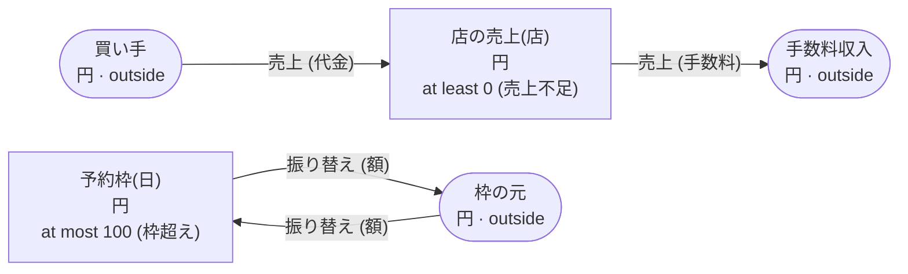

<!-- The output of `chobo doc tests/fixtures/順序.book`. Do not edit by hand. -->

# 順序 v1

`tests/fixtures/順序.book`, as `chobo doc` writes it. Each account keeps a balance: what came in, less what went out. Every transfer keeps the bounds of the accounts: one that would break a bound is refused with the name the book gives that bound, and nothing of it moves. A transfer either moves at once (`do`), or first holds what it moves (`hold`); a hold is then posted (`post`, all of it or part), voided (`void`), or expires.

## What the check warns about

What `chobo check` says; each comes with the operations that get there.

```text
warning[W103]: tests/fixtures/順序.book:15:3: move 1 takes from 店の売上(店) before move 2 puts into it: when 店の売上(店) is short at that point, the call is refused with 売上不足, even when the two moves together would leave enough
    15 |   move 手数料 from 店の売上(店) to 手数料収入
  the operations that get there:
       1  売上.do(注文: 注文-1, 店: 店-2, 代金: 1, 手数料: 1)  refused: 売上不足 (move 1 takes 1 from 店の売上(店-2): posted 0, held out 0)
  hint: write the move that puts into 店の売上(店) first
```

```text
warning[W103]: tests/fixtures/順序.book:19:3: move 1 puts into 予約枠(日) before move 2 takes from it: when 予約枠(日) has no room at that point, the call is refused with 枠超え, even when the two moves together would stay within its bound
    19 |   move 額 from 枠の元 to 予約枠(日)
  the operations that get there:
       1  振り替え.do(伝票: 伝票-1, 日: 日-2, 額: 101)  refused: 枠超え (move 1 puts 101 into 予約枠(日-2): posted 0, held in 0)
  hint: write the move that takes from 予約枠(日) first
```

## Accounts

| Account | One for each | Unit | Bounds | What it is |
|---|---|---|---|---|
| `買い手` | one account | 円 | outside the book: no bounds, and it may go below 0 |  |
| `手数料収入` | one account | 円 | outside the book: no bounds, and it may go below 0 |  |
| `店の売上` | `店` | 円 | at least 0; a transfer that would go below is refused with `売上不足` |  |
| `予約枠` | `日` | 円 | at most 100; a transfer that would go above is refused with `枠超え` |  |
| `枠の元` | one account | 円 | outside the book: no bounds, and it may go below 0 |  |

## How things move



A box is an account, and an arrow a move of a transfer. A rounded box is an account outside the book, which has no bounds. A dashed arrow belongs to a transfer that holds first, and moves when the hold is posted.

## Transfers

### 売上

- 2 moves, made in this order, all or none:
    1. `手数料` from `店の売上(店)` to `手数料収入`
    2. `代金` from `買い手` to `店の売上(店)`
- Key: once per `注文`. The same call again does nothing, and answers `done_before`.
- Moves at once (`do`).

| Operation | May be refused with | When |
|---|---|---|
| `売上.do` | `売上不足` | move 1 would take `店の売上(店)` below 0 |
| `売上.do` | `already_refused` | a call with the same `注文` was refused by a bound before; a key a bound refused stays refused, even once there is enough |

<details><summary>How each refusal comes about</summary>

#### 売上.do: 売上不足

```text
 1  売上.do(注文: 注文-1, 店: 店-2, 代金: 1, 手数料: 1)  refused: 売上不足 (move 1 takes 1 from 店の売上(店-2): posted 0, held out 0)
```

#### 売上.do: already_refused

```text
 1  売上.do(注文: 注文-1, 店: 店-2, 代金: 1, 手数料: 1)  refused: 売上不足 (move 1 takes 1 from 店の売上(店-2): posted 0, held out 0)
 2  売上.do(注文: 注文-1, 店: 店-2, 代金: 1, 手数料: 1)  refused: already_refused
```

</details>

### 振り替え

- 2 moves, made in this order, all or none:
    1. `額` from `枠の元` to `予約枠(日)`
    2. `額` from `予約枠(日)` to `枠の元`
- Key: once per `伝票`. The same call again does nothing, and answers `done_before`; one that differs only in `日` or `額` is refused with `key_conflict`.
- Moves at once (`do`).

| Operation | May be refused with | When |
|---|---|---|
| `振り替え.do` | `枠超え` | move 1 would take `予約枠(日)` above 100 |
| `振り替え.do` | `key_conflict` | a call with the same `伝票` and other arguments came before |
| `振り替え.do` | `already_refused` | a call with the same `伝票` was refused by a bound before; a key a bound refused stays refused, even once there is enough |

<details><summary>How each refusal comes about</summary>

#### 振り替え.do: 枠超え

```text
 1  振り替え.do(伝票: 伝票-1, 日: 日-2, 額: 101)  refused: 枠超え (move 1 puts 101 into 予約枠(日-2): posted 0, held in 0)
```

#### 振り替え.do: key_conflict

```text
 1  振り替え.do(伝票: 伝票-1, 日: 日-2, 額: 1)  done
 2  振り替え.do(伝票: 伝票-1, 日: 日-2, 額: 2)  refused: key_conflict
```

#### 振り替え.do: already_refused

```text
 1  振り替え.do(伝票: 伝票-1, 日: 日-2, 額: 101)  refused: 枠超え (move 1 puts 101 into 予約枠(日-2): posted 0, held in 0)
 2  振り替え.do(伝票: 伝票-1, 日: 日-2, 額: 101)  refused: already_refused
```

</details>

## Scenarios

5 scenarios, which `chobo scenarios` makes from the book: among them each bound just before, at and past it, each key used twice, every way a hold ends, and two callers after the last of something at the same time. The reference interpreter ran each one; after each step come the balances it left. A balance is what is posted, with what is held in brackets.

<details><summary>1. key: 振り替え.do twice with the same arguments</summary>

| # | Operation | Result | 予約枠(日-2) | 枠の元 |
|---|---|---|---|---|
| 1 | 振り替え.do(伝票: 伝票-1, 日: 日-2, 額: 1) | done | 0 | 0 |
| 2 | 振り替え.do(伝票: 伝票-1, 日: 日-2, 額: 1) | done_before | 0 | 0 |

</details>

<details><summary>2. key: 振り替え.do again with another 額</summary>

| # | Operation | Result | 予約枠(日-2) | 枠の元 |
|---|---|---|---|---|
| 1 | 振り替え.do(伝票: 伝票-1, 日: 日-2, 額: 1) | done | 0 | 0 |
| 2 | 振り替え.do(伝票: 伝票-1, 日: 日-2, 額: 2) | refused: key_conflict | 0 | 0 |

</details>

<details><summary>3. key: 振り替え.do refused with 枠超え, then again</summary>

| # | Operation | Result | 予約枠(日-2) | 枠の元 |
|---|---|---|---|---|
| 1 | 振り替え.do(伝票: 伝票-1, 日: 日-2, 額: 101) | refused: 枠超え | 0 | 0 |
| 2 | 振り替え.do(伝票: 伝票-1, 日: 日-2, 額: 101) | refused: already_refused | 0 | 0 |

</details>

<details><summary>4. moves: 売上.do refused at move 1 (店の売上(店)), and no move is made</summary>

| # | Operation | Result | 買い手 | 手数料収入 | 店の売上(店-2) |
|---|---|---|---|---|---|
| 1 | 売上.do(注文: 注文-1, 店: 店-2, 代金: 1, 手数料: 1) | refused: 売上不足 | 0 | 0 | 0 |

</details>

<details><summary>5. moves: 振り替え.do refused at move 1 (予約枠(日)), and no move is made</summary>

| # | Operation | Result | 予約枠(日-2) | 枠の元 |
|---|---|---|---|---|
| 1 | 振り替え.do(伝票: 伝票-1, 日: 日-2, 額: 101) | refused: 枠超え | 0 | 0 |

</details>

