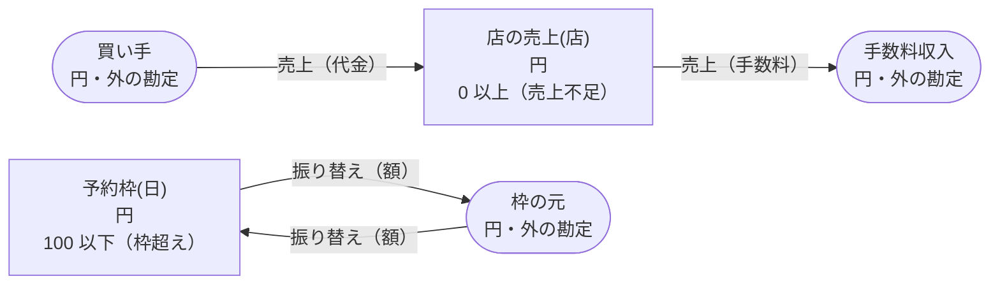

<!-- `chobo doc tests/fixtures/順序.book --lang ja` の出力です。手で編集しないでください。 -->

# 順序 v1

`chobo doc` が `tests/fixtures/順序.book` から作ったページ。勘定ごとに残高を持ち、残高は入った量から出た量を引いたもの。どの振替も勘定の下限と上限を守り、守れない振替は、その境界に付けた名前で断られて、どの移動も行われない。振替には、すぐに動かすもの（`do`）と、動かす量をまず押さえるもの（`hold`）がある。押さえた分は、あとで確定される（`post`。全部か一部）か、取り消される（`void`）か、有効期限で切れる。

## 検査の警告

`chobo check` が言うこと。どれも、ここに書いた操作の列で起きる。

```text
警告[W103]: tests/fixtures/順序.book:15:3: 1 つ目の移動が 店の売上(店) から取るのは、2 つ目の移動が 店の売上(店) へ入れるより前です。そのとき 店の売上(店) が足りないと、二つの移動を合わせれば足りる場合でも 売上不足 で断られます
    15 |   move 手数料 from 店の売上(店) to 手数料収入
  そうなる例:
       1  売上.do(注文: 注文-1, 店: 店-2, 代金: 1, 手数料: 1)  売上不足 で断られる（1 つ目の移動が 店の売上(店-2) から 1 を取る。確定 0、出ていく仮押さえ 0）
  ヒント: 店の売上(店) へ入れる移動を先に書きます
```

```text
警告[W103]: tests/fixtures/順序.book:19:3: 1 つ目の移動が 予約枠(日) へ入れるのは、2 つ目の移動が 予約枠(日) から取るより前です。そのとき 予約枠(日) に空きが無いと、二つの移動を合わせれば上限に収まる場合でも 枠超え で断られます
    19 |   move 額 from 枠の元 to 予約枠(日)
  そうなる例:
       1  振り替え.do(伝票: 伝票-1, 日: 日-2, 額: 101)  枠超え で断られる（1 つ目の移動が 予約枠(日-2) へ 101 を入れる。確定 0、入ってくる仮押さえ 0）
  ヒント: 予約枠(日) から取る移動を先に書きます
```

## 勘定

| 勘定 | 分け方 | 単位 | 境界 | 説明 |
|---|---|---|---|---|
| `買い手` | 一つだけ | 円 | 外の勘定。境界は無く、マイナスにもなる |  |
| `手数料収入` | 一つだけ | 円 | 外の勘定。境界は無く、マイナスにもなる |  |
| `店の売上` | `店` ごと | 円 | 0 以上。下回る振替は `売上不足` で断る |  |
| `予約枠` | `日` ごと | 円 | 100 以下。超える振替は `枠超え` で断る |  |
| `枠の元` | 一つだけ | 円 | 外の勘定。境界は無く、マイナスにもなる |  |

## 勘定のあいだの流れ



四角は勘定で、矢印は振替の移動。角の丸い四角は外の勘定で、境界を持たない。破線の矢印は仮押さえの振替で、まず押さえ、確定したときに動く。

## 振替

### 売上

- 移動は 2 つ。書いた順に行い、どれか一つでも断られたら、どれも行わない:
    1. `店の売上(店)` から `手数料収入` へ `手数料`
    2. `買い手` から `店の売上(店)` へ `代金`
- キー: `注文` ごとに一回。同じ呼び出しの二度目は何もせず、`done_before` を返す。
- すぐに動かす（`do`）。

| 操作 | 断られうる理由 | いつ |
|---|---|---|
| `売上.do` | `売上不足` | 1 つ目の移動で `店の売上(店)` が 0 を下回る |
| `売上.do` | `already_refused` | `注文` が同じ呼び出しが、前に境界で断られている。境界で断られたキーは、あとで足りるようになっても通らない |

<details><summary>断られる例</summary>

#### 売上.do: 売上不足

```text
 1  売上.do(注文: 注文-1, 店: 店-2, 代金: 1, 手数料: 1)  売上不足 で断られる（1 つ目の移動が 店の売上(店-2) から 1 を取る。確定 0、出ていく仮押さえ 0）
```

#### 売上.do: already_refused

```text
 1  売上.do(注文: 注文-1, 店: 店-2, 代金: 1, 手数料: 1)  売上不足 で断られる（1 つ目の移動が 店の売上(店-2) から 1 を取る。確定 0、出ていく仮押さえ 0）
 2  売上.do(注文: 注文-1, 店: 店-2, 代金: 1, 手数料: 1)  already_refused で断られる
```

</details>

### 振り替え

- 移動は 2 つ。書いた順に行い、どれか一つでも断られたら、どれも行わない:
    1. `枠の元` から `予約枠(日)` へ `額`
    2. `予約枠(日)` から `枠の元` へ `額`
- キー: `伝票` ごとに一回。同じ呼び出しの二度目は何もせず、`done_before` を返す。`日` か `額` だけが違う二度目は `key_conflict` で断られる。
- すぐに動かす（`do`）。

| 操作 | 断られうる理由 | いつ |
|---|---|---|
| `振り替え.do` | `枠超え` | 1 つ目の移動で `予約枠(日)` が 100 を超える |
| `振り替え.do` | `key_conflict` | `伝票` が同じで、ほかの引数が違う呼び出しが、前に済んでいる |
| `振り替え.do` | `already_refused` | `伝票` が同じ呼び出しが、前に境界で断られている。境界で断られたキーは、あとで足りるようになっても通らない |

<details><summary>断られる例</summary>

#### 振り替え.do: 枠超え

```text
 1  振り替え.do(伝票: 伝票-1, 日: 日-2, 額: 101)  枠超え で断られる（1 つ目の移動が 予約枠(日-2) へ 101 を入れる。確定 0、入ってくる仮押さえ 0）
```

#### 振り替え.do: key_conflict

```text
 1  振り替え.do(伝票: 伝票-1, 日: 日-2, 額: 1)  通る
 2  振り替え.do(伝票: 伝票-1, 日: 日-2, 額: 2)  key_conflict で断られる
```

#### 振り替え.do: already_refused

```text
 1  振り替え.do(伝票: 伝票-1, 日: 日-2, 額: 101)  枠超え で断られる（1 つ目の移動が 予約枠(日-2) へ 101 を入れる。確定 0、入ってくる仮押さえ 0）
 2  振り替え.do(伝票: 伝票-1, 日: 日-2, 額: 101)  already_refused で断られる
```

</details>

## シナリオ

`chobo scenarios` が帳簿から作ったシナリオ 5 本。境界の手前・ちょうど・超える、同じキーの二度目、仮押さえの終わり方、二つの呼び出し元が同時に最後の一つを取りに来るもの、などがある。どれも参照インタプリタで流し、ステップごとに、そのあとの残高を載せる。残高は確定した量で、仮押さえがあれば括弧の中に書く。

<details><summary>1. キー: 振り替え.do を同じ引数で二度呼ぶ</summary>

| # | 操作 | 結果 | 予約枠(日-2) | 枠の元 |
|---|---|---|---|---|
| 1 | 振り替え.do(伝票: 伝票-1, 日: 日-2, 額: 1) | 通る | 0 | 0 |
| 2 | 振り替え.do(伝票: 伝票-1, 日: 日-2, 額: 1) | done_before（前に済んでいる） | 0 | 0 |

</details>

<details><summary>2. キー: 振り替え.do を 額 だけ変えてもう一度呼ぶ</summary>

| # | 操作 | 結果 | 予約枠(日-2) | 枠の元 |
|---|---|---|---|---|
| 1 | 振り替え.do(伝票: 伝票-1, 日: 日-2, 額: 1) | 通る | 0 | 0 |
| 2 | 振り替え.do(伝票: 伝票-1, 日: 日-2, 額: 2) | key_conflict で断られる | 0 | 0 |

</details>

<details><summary>3. キー: 振り替え.do が 枠超え で断られ、同じ引数でもう一度呼ぶ</summary>

| # | 操作 | 結果 | 予約枠(日-2) | 枠の元 |
|---|---|---|---|---|
| 1 | 振り替え.do(伝票: 伝票-1, 日: 日-2, 額: 101) | 枠超え で断られる | 0 | 0 |
| 2 | 振り替え.do(伝票: 伝票-1, 日: 日-2, 額: 101) | already_refused で断られる | 0 | 0 |

</details>

<details><summary>4. 移動: 売上.do が 1 つ目の移動（店の売上(店)）で断られ、どの移動も行われない</summary>

| # | 操作 | 結果 | 買い手 | 手数料収入 | 店の売上(店-2) |
|---|---|---|---|---|---|
| 1 | 売上.do(注文: 注文-1, 店: 店-2, 代金: 1, 手数料: 1) | 売上不足 で断られる | 0 | 0 | 0 |

</details>

<details><summary>5. 移動: 振り替え.do が 1 つ目の移動（予約枠(日)）で断られ、どの移動も行われない</summary>

| # | 操作 | 結果 | 予約枠(日-2) | 枠の元 |
|---|---|---|---|---|
| 1 | 振り替え.do(伝票: 伝票-1, 日: 日-2, 額: 101) | 枠超え で断られる | 0 | 0 |

</details>

