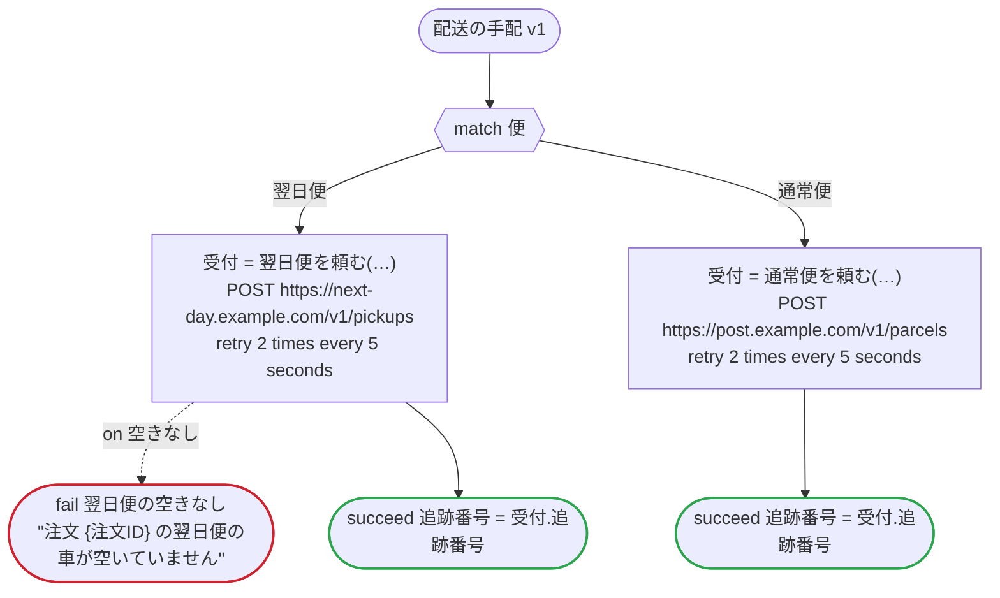

# 配送の手配 v1

注文の配送を、急ぎの規則が選んだ便で頼み、追跡番号を返す。呼び出しはどれも、dandori がプラットフォームごとに生成する HTTP の呼び出しなので、すべてのプラットフォーム向けにこの一つだけを書く（`connection` は Step Functions のためのもの）。引当と発送のどの版も、これを子として走らせる。Temporal では子ワークフロー、Lambda durable functions では invoke する durable function、Argo ではこの WorkflowTemplate のワークフロー、Step Functions ではネストした実行になる

`examples/fulfillment/arrange_delivery.ja.flow`, drawn by `dandori doc`. Inputs: `注文ID: string`, `便: 便`, `宛名: string?`, `付帯: json`. Outputs: `追跡番号: string`.

## flow

A rectangle is a task, one with a line down each side a rule, a slanted one a task whose value comes from outside (an event, or the answer to a callback), a hexagon a `match`, a rounded box a wait, and a box around steps a loop. A dashed arrow is an error the call handles.

## Calls

| Line | Call | Calls | Retries | Timeout | When it fails |
|---:|---|---|---|---|---|
| 35 | `受付 = 翌日便を頼む(…)` | `POST https://next-day.example.com/v1/pickups`, `key` | 2 times every 5 seconds (failure, timeout) | — | `空きなし` → line 36 `timeout`, `failure` → the workflow fails |
| 39 | `受付 = 通常便を頼む(…)` | `POST https://post.example.com/v1/parcels`, `key` | 2 times every 5 seconds (failure, timeout) | — | `timeout`, `failure` → the workflow fails |

## Ends

Every way the workflow can end.

| Line | End |
|---:|---|
| 36 | `fail 翌日便の空きなし` "注文 {注文ID} の翌日便の車が空いていません" |
| 37 | `succeed 追跡番号 = 受付.追跡番号` |
| 40 | `succeed 追跡番号 = 受付.追跡番号` |

