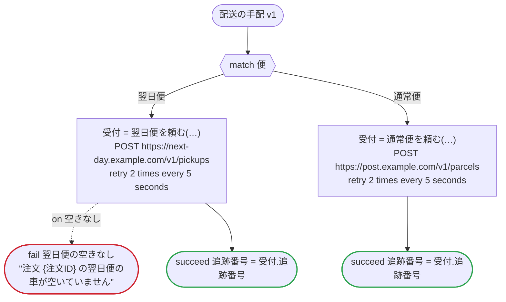

# 配送の手配 v1

注文の配送を、急ぎの規則が選んだ便で頼み、追跡番号を返す。呼び出しはどれも、dandori がプラットフォームごとに生成する HTTP の呼び出しなので、すべてのプラットフォーム向けにこの一つだけを書く（`connection` は Step Functions のためのもの）。引当と発送のどの版も、これを子として走らせる。Temporal では子ワークフロー、Lambda durable functions では invoke する durable function、Argo ではこの WorkflowTemplate のワークフロー、Step Functions ではネストした実行になる

`examples/fulfillment/arrange_delivery.ja.flow` を `dandori doc` で描いたものです。入力は `注文ID: string`, `便: 便`, `宛名: string?`, `付帯: json`、出力は `追跡番号: string` です。

## flow

四角はタスク、両脇に線のある四角は規則、斜めの四角は外から値が届くタスク（イベントやコールバックの応答）、六角形は `match`、角の丸い四角は待ち、ステップを囲む枠はループです。破線の矢印は、呼び出しがその場で処理するエラーです。

## 呼び出し

| 行 | 呼び出し | 呼ぶもの | リトライ | タイムアウト | 失敗したとき |
|---:|---|---|---|---|---|
| 35 | `受付 = 翌日便を頼む(…)` | `POST https://next-day.example.com/v1/pickups`, `key` | 5 秒おきに 2 回（failure, timeout） | — | `空きなし` → 36 行目 `timeout`, `failure` → ワークフローが失敗する |
| 39 | `受付 = 通常便を頼む(…)` | `POST https://post.example.com/v1/parcels`, `key` | 5 秒おきに 2 回（failure, timeout） | — | `timeout`, `failure` → ワークフローが失敗する |

## 終わり方

ワークフローの終わり方のすべてです。

| 行 | 終わり方 |
|---:|---|
| 36 | `fail 翌日便の空きなし` "注文 {注文ID} の翌日便の車が空いていません" |
| 37 | `succeed 追跡番号 = 受付.追跡番号` |
| 40 | `succeed 追跡番号 = 受付.追跡番号` |

