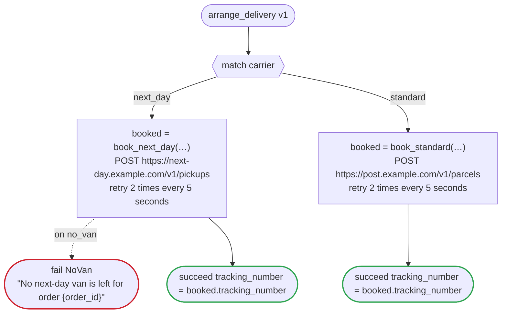

# arrange_delivery v1

Book the delivery of an order with the carrier the urgency rule chose, and answer with its tracking number. Written once for every platform, since its calls are HTTP ones that dandori writes for each (`connection` is what Step Functions needs of them): each version of fulfillment runs it as its child, a child workflow on Temporal, an invoked durable function on Lambda durable functions, a workflow of this WorkflowTemplate on Argo, a nested execution on Step Functions

`examples/fulfillment/arrange_delivery.flow`, drawn by `dandori doc`. Inputs: `order_id: string`, `carrier: carrier`, `recipient: string?`, `extra: json`. Outputs: `tracking_number: string`.

## flow

A rectangle is a task, one with a line down each side a rule, a slanted one a task whose value comes from outside (an event, or the answer to a callback), a hexagon a `match`, a rounded box a wait, and a box around steps a loop. A dashed arrow is an error the call handles.

## Calls

| Line | Call | Calls | Retries | Timeout | When it fails |
|---:|---|---|---|---|---|
| 35 | `booked = book_next_day(…)` | `POST https://next-day.example.com/v1/pickups`, `key` | 2 times every 5 seconds (failure, timeout) | — | `no_van` → line 36 `timeout`, `failure` → the workflow fails |
| 39 | `booked = book_standard(…)` | `POST https://post.example.com/v1/parcels`, `key` | 2 times every 5 seconds (failure, timeout) | — | `timeout`, `failure` → the workflow fails |

## Ends

Every way the workflow can end.

| Line | End |
|---:|---|
| 36 | `fail NoVan` "No next-day van is left for order {order_id}" |
| 37 | `succeed tracking_number = booked.tracking_number` |
| 40 | `succeed tracking_number = booked.tracking_number` |

