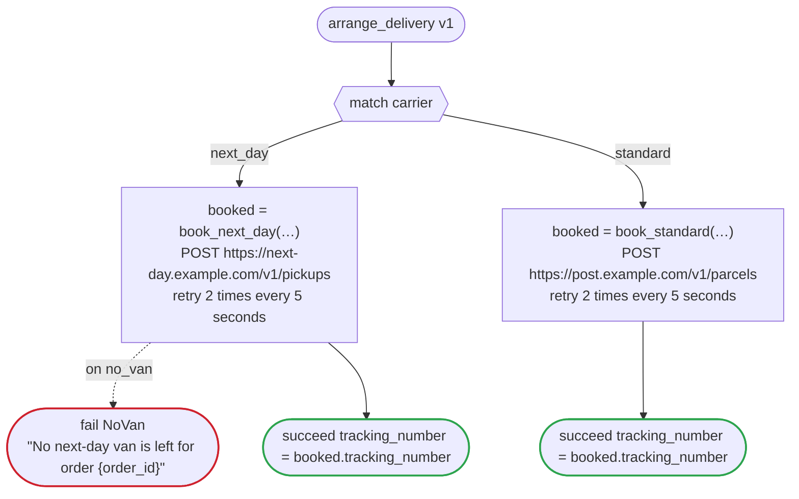

# arrange_delivery v1

Book the delivery of an order with the carrier the urgency rule chose, and answer with its tracking number. Written once for every platform, since its calls are HTTP ones that dandori writes for each (`connection` is what Step Functions needs of them): each version of fulfillment runs it as its child, a child workflow on Temporal, an invoked durable function on Lambda durable functions, a workflow of this WorkflowTemplate on Argo, a nested execution on Step Functions

`examples/fulfillment/arrange_delivery.flow` を `dandori doc` で描いたものです。入力は `order_id: string`, `carrier: carrier`, `recipient: string?`, `extra: json`、出力は `tracking_number: string` です。

## flow

四角はタスク、両脇に線のある四角は規則、斜めの四角は外から値が届くタスク（イベントやコールバックの応答）、六角形は `match`、角の丸い四角は待ち、ステップを囲む枠はループです。破線の矢印は、呼び出しがその場で処理するエラーです。

## 呼び出し

| 行 | 呼び出し | 呼ぶもの | リトライ | タイムアウト | 失敗したとき |
|---:|---|---|---|---|---|
| 35 | `booked = book_next_day(…)` | `POST https://next-day.example.com/v1/pickups`, `key` | 5 秒おきに 2 回（failure, timeout） | — | `no_van` → 36 行目 `timeout`, `failure` → ワークフローが失敗する |
| 39 | `booked = book_standard(…)` | `POST https://post.example.com/v1/parcels`, `key` | 5 秒おきに 2 回（failure, timeout） | — | `timeout`, `failure` → ワークフローが失敗する |

## 終わり方

ワークフローの終わり方のすべてです。

| 行 | 終わり方 |
|---:|---|
| 36 | `fail NoVan` "No next-day van is left for order {order_id}" |
| 37 | `succeed tracking_number = booked.tracking_number` |
| 40 | `succeed tracking_number = booked.tracking_number` |

