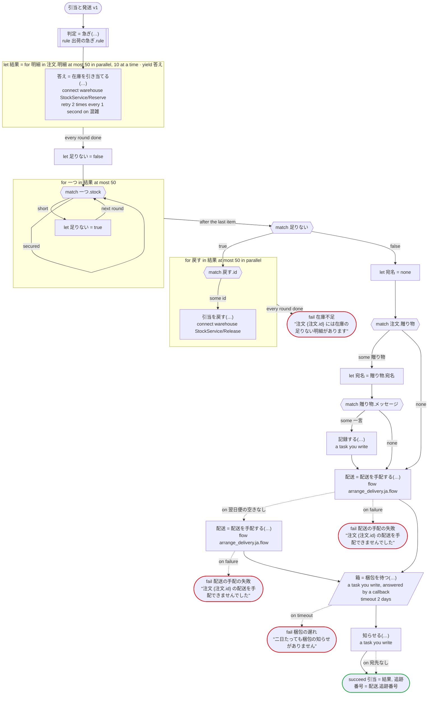

# 引当と発送 v1

注文の明細ごとに在庫を引き当て、配送を手配し、倉庫の梱包を待ってから、お客さまに知らせる。明細は並べて引き当て、足りない明細があれば、引き当てたぶんを戻す。Temporal 向けの版：倉庫の呼び出しは dandori が Connect で生成するアクティビティ。配送チームのワークフローが専用のタスクキューで配送を手配し（子ワークフロー、arrange_delivery.ja.flow）、翌日便の車がなければ通常便で頼み直す。梱包の依頼、お知らせ、記録は自分で書くアクティビティで、梱包の担当者は、生成したクライアントが送る Update でコールバックに応答する

`examples/fulfillment/temporal/fulfillment.ja.flow`, drawn by `dandori doc`. Inputs: `注文: 注文`. Outputs: `引当: list[引当]`, `追跡番号: string`.

## flow

A rectangle is a task, one with a line down each side a rule, a slanted one a task whose value comes from outside (an event, or the answer to a callback), a hexagon a `match`, a rounded box a wait, and a box around steps a loop. A dashed arrow is an error the call handles.

## Calls

| Line | Call | Calls | Retries | Timeout | When it fails |
|---:|---|---|---|---|---|
| 79 | `判定 = 急ぎ(…)` | rule `出荷の急ぎ.rule` | 2 times, after 1 second and 2 (failure) | — | `timeout`, `failure` → the workflow fails |
| 81 | `答え = 在庫を引き当てる(…)` | `connect warehouse StockService/Reserve`, `key` | 2 times every 1 second (混雑) | — | `混雑`, `timeout`, `failure` → the round fails, and then the workflow |
| 92 | `引当を戻す(…)` | `connect warehouse StockService/Release`, `idempotent` | — | — | `timeout`, `failure` → the round fails, and then the workflow |
| 101 | `記録する(…)` | a task you write, `idempotent` | — | — | `timeout`, `failure` → the workflow fails |
| 104 | `配送 = 配送を手配する(…)` | `flow arrange_delivery.ja.flow` | — | — | `翌日便の空きなし` → line 105 `timeout`, `failure` → line 108 |
| 106 | `配送 = 配送を手配する(…)` | `flow arrange_delivery.ja.flow` | — | — | `翌日便の空きなし`, `timeout`, `failure` → line 107 |
| 109 | `箱 = 梱包を待つ(…)` | a task you write, answered by a callback | — | 2 days | `timeout` → line 110 `failure` → the workflow fails |
| 111 | `知らせる(…)` | a task you write | — | — | `宛先なし` → line 112 `timeout`, `failure` → the workflow fails |

## Ends

Every way the workflow can end.

| Line | End |
|---:|---|
| 94 | `fail 在庫不足` "注文 {注文.id} には在庫の足りない明細があります" |
| 107 | `fail 配送の手配の失敗` "注文 {注文.id} の配送を手配できませんでした" |
| 108 | `fail 配送の手配の失敗` "注文 {注文.id} の配送を手配できませんでした" |
| 110 | `fail 梱包の遅れ` "二日たっても梱包の知らせがありません" |
| 113 | `succeed 引当 = 結果, 追跡番号 = 配送.追跡番号` |

