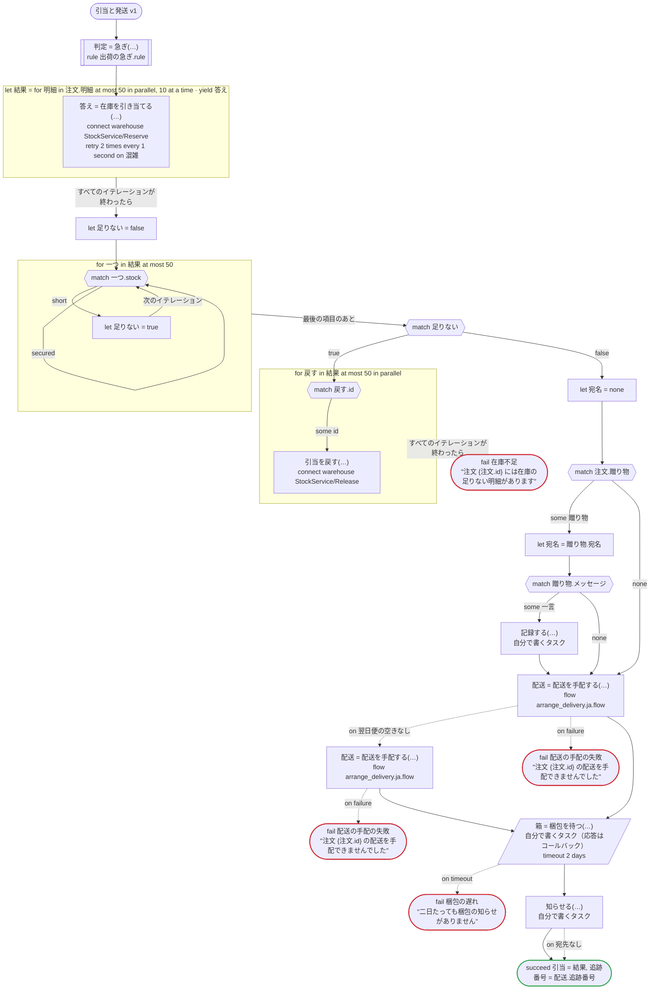

# 引当と発送 v1

注文の明細ごとに在庫を引き当て、配送を手配し、倉庫の梱包を待ってから、お客さまに知らせる。明細は並べて引き当て、足りない明細があれば、引き当てたぶんを戻す。Temporal 向けの版：倉庫の呼び出しは dandori が Connect で生成するアクティビティ。配送チームのワークフローが専用のタスクキューで配送を手配し（子ワークフロー、arrange_delivery.ja.flow）、翌日便の車がなければ通常便で頼み直す。梱包の依頼、お知らせ、記録は自分で書くアクティビティで、梱包の担当者は、生成したクライアントが送る Update でコールバックに応答する

`examples/fulfillment/temporal/fulfillment.ja.flow` を `dandori doc` で描いたものです。入力は `注文: 注文`、出力は `引当: list[引当]`, `追跡番号: string` です。

## flow

四角はタスク、両脇に線のある四角は規則、斜めの四角は外から値が届くタスク（イベントやコールバックの応答）、六角形は `match`、角の丸い四角は待ち、ステップを囲む枠はループです。破線の矢印は、呼び出しがその場で処理するエラーです。

## 呼び出し

| 行 | 呼び出し | 呼ぶもの | リトライ | タイムアウト | 失敗したとき |
|---:|---|---|---|---|---|
| 79 | `判定 = 急ぎ(…)` | 規則 `出荷の急ぎ.rule` | 2 回（1 秒後と 2 秒後、failure） | — | `timeout`, `failure` → ワークフローが失敗する |
| 81 | `答え = 在庫を引き当てる(…)` | `connect warehouse StockService/Reserve`, `key` | 1 秒おきに 2 回（混雑） | — | `混雑`, `timeout`, `failure` → そのイテレーションが失敗し、ワークフローも失敗する |
| 92 | `引当を戻す(…)` | `connect warehouse StockService/Release`, `idempotent` | — | — | `timeout`, `failure` → そのイテレーションが失敗し、ワークフローも失敗する |
| 101 | `記録する(…)` | 自分で書くタスク, `idempotent` | — | — | `timeout`, `failure` → ワークフローが失敗する |
| 104 | `配送 = 配送を手配する(…)` | `flow arrange_delivery.ja.flow` | — | — | `翌日便の空きなし` → 105 行目 `timeout`, `failure` → 108 行目 |
| 106 | `配送 = 配送を手配する(…)` | `flow arrange_delivery.ja.flow` | — | — | `翌日便の空きなし`, `timeout`, `failure` → 107 行目 |
| 109 | `箱 = 梱包を待つ(…)` | 自分で書くタスク（応答はコールバック） | — | 2 日 | `timeout` → 110 行目 `failure` → ワークフローが失敗する |
| 111 | `知らせる(…)` | 自分で書くタスク | — | — | `宛先なし` → 112 行目 `timeout`, `failure` → ワークフローが失敗する |

## 終わり方

ワークフローの終わり方のすべてです。

| 行 | 終わり方 |
|---:|---|
| 94 | `fail 在庫不足` "注文 {注文.id} には在庫の足りない明細があります" |
| 107 | `fail 配送の手配の失敗` "注文 {注文.id} の配送を手配できませんでした" |
| 108 | `fail 配送の手配の失敗` "注文 {注文.id} の配送を手配できませんでした" |
| 110 | `fail 梱包の遅れ` "二日たっても梱包の知らせがありません" |
| 113 | `succeed 引当 = 結果, 追跡番号 = 配送.追跡番号` |

