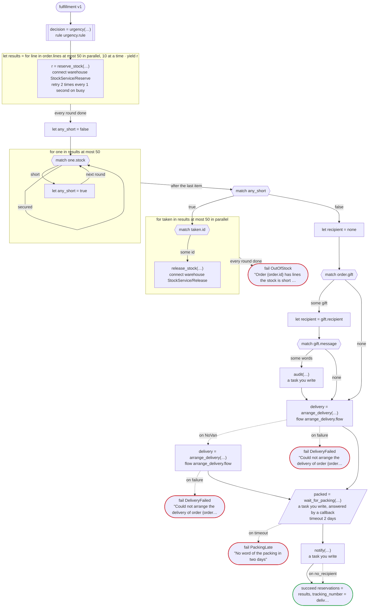

# fulfillment v1

Reserve stock for each line of an order, arrange the delivery, wait for the warehouse to pack it, and then tell the customer. The lines are reserved side by side, and when one is short, what was reserved is released. Written for Temporal: the warehouse's calls are activities dandori writes, by Connect; a workflow of the delivery team, on its own task queue, arranges the delivery (a child workflow, arrange_delivery.flow), and when it finds no next-day van the standard carrier is asked; and the packing request, the notice and the audit log are activities you write, the packing crew answering the callback by the update the generated client sends

`examples/fulfillment/temporal/fulfillment.flow`, drawn by `dandori doc`. Inputs: `order: Order`. Outputs: `reservations: list[warehouse.ReserveResponse]`, `tracking_number: string`. It implements `shop.v1.FulfillmentService` (`../specs/fulfillment.proto`).

## flow

A rectangle is a task, one with a line down each side a rule, a slanted one a task whose value comes from outside (an event, or the answer to a callback), a hexagon a `match`, a rounded box a wait, and a box around steps a loop. A dashed arrow is an error the call handles.

## Service

What each method of the service does to a run.

| Method | What it does | Task |
|---|---|---|
| `Fulfill` | starts a run; it can fail with `OutOfStock`, `DeliveryFailed`, `PackingLate` | — |
| `AnswerPacking` | answers the callback | `wait_for_packing` |

## Calls

| Line | Call | Calls | Retries | Timeout | When it fails |
|---:|---|---|---|---|---|
| 73 | `decision = urgency(…)` | rule `urgency.rule` | 2 times, after 1 second and 2 (failure) | — | `timeout`, `failure` → the workflow fails |
| 75 | `r = reserve_stock(…)` | `connect warehouse StockService/Reserve`, `key` | 2 times every 1 second (busy) | — | `busy`, `timeout`, `failure` → the round fails, and then the workflow |
| 86 | `release_stock(…)` | `connect warehouse StockService/Release`, `idempotent` | — | — | `timeout`, `failure` → the round fails, and then the workflow |
| 95 | `audit(…)` | a task you write, `idempotent` | — | — | `timeout`, `failure` → the workflow fails |
| 98 | `delivery = arrange_delivery(…)` | `flow arrange_delivery.flow` | — | — | `NoVan` → line 99 `timeout`, `failure` → line 102 |
| 100 | `delivery = arrange_delivery(…)` | `flow arrange_delivery.flow` | — | — | `NoVan`, `timeout`, `failure` → line 101 |
| 103 | `packed = wait_for_packing(…)` | a task you write, answered by a callback | — | 2 days | `timeout` → line 104 `failure` → the workflow fails |
| 105 | `notify(…)` | a task you write | — | — | `no_recipient` → line 106 `timeout`, `failure` → the workflow fails |

## Ends

Every way the workflow can end.

| Line | End |
|---:|---|
| 88 | `fail OutOfStock` "Order {order.id} has lines the stock is short of" |
| 101 | `fail DeliveryFailed` "Could not arrange the delivery of order {order.id}" |
| 102 | `fail DeliveryFailed` "Could not arrange the delivery of order {order.id}" |
| 104 | `fail PackingLate` "No word of the packing in two days" |
| 107 | `succeed reservations = results, tracking_number = delivery.tracking_number` |

## Rules

The rules this workflow calls, as `rulec doc` renders them for whoever approves them.

<code>urgency</code> · urgency v1 · <code>../../order/rules/urgency.rule</code>

<!-- Generated by rulec 0.22.0 from urgency.rule (sha256:5ff6efc93a9b). This is a read-only rendering; the source of truth is the .rule file. Edits cannot be carried back (§1.6). -->
# Rule urgency v1

Whether an order goes out in a hurry, and by which carrier: a member's always does, and anyone else's from 30,000 yen. Written for the example

## Inputs

| Name | Type | Range | Notes |
|---|---|---|---|
| member | bool |  |  |
| amount | money[JPY, incl_tax] | 0JPY 〜 100万JPY |  |

## Outputs

| Name | Type | Rounding | Notes |
|---|---|---|---|
| urgent | bool |  |  |
| carrier | carrier (2 values) |  |  |

## Types

An enum is a **closed** finite set. Add a value, and every table that does not look at it fails the completeness check.

- **carrier** (2 values) — standard, next_day

## Table decide (policy unique)

| Column | Source |
|---|---|
| member | Input |
| amount | Input |
| → urgent | Output of this rule |
| → carrier | Output of this rule |

| # | member | amount | → urgent (bool) | → carrier (carrier) |
|---|---|---|---|---|
| 1 | true | - | true | next_day |
| 2 | false | >=30000JPY | true | next_day |
| 3 | false | <30000JPY | false | standard |

**What `rulec check` verified**

- Every combination of inputs matches some row (E101 completeness)
- There is no row that can never match (E102 unreachable row)
- No input matches two or more rows at once (E105 overlap). Reordering the rows does not change the meaning

## Examples (verified)

| member | amount | → urgent | carrier |
|---|---|---|---|
| true | 1000JPY | true | next_day |
| false | 5000JPY | false | standard |
| false | 30000JPY | true | next_day |

`rulec check` ran these 3 examples through the reference evaluator, and every one produced the declared values (E107). The examples are an **executable specification**.

