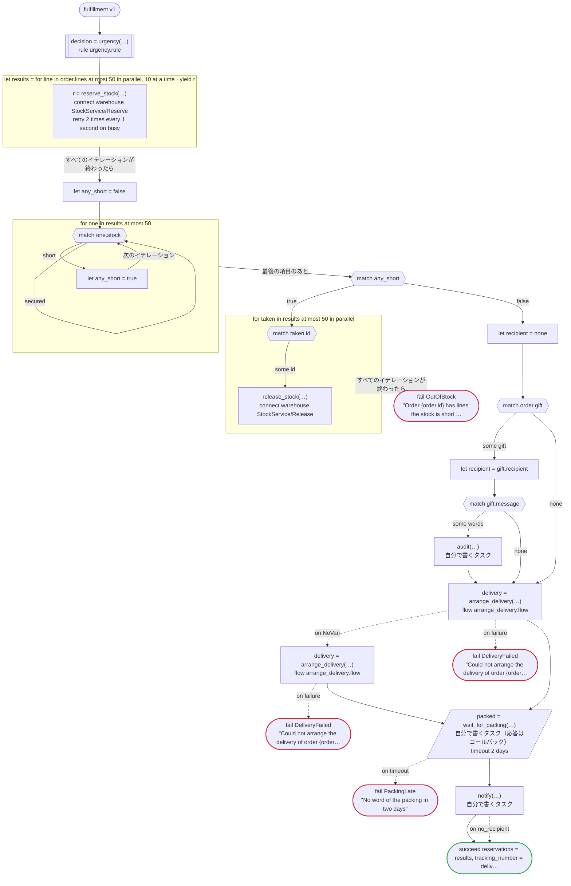

# fulfillment v1

Reserve stock for each line of an order, arrange the delivery, wait for the warehouse to pack it, and then tell the customer. The lines are reserved side by side, and when one is short, what was reserved is released. Written for Temporal: the warehouse's calls are activities dandori writes, by Connect; a workflow of the delivery team, on its own task queue, arranges the delivery (a child workflow, arrange_delivery.flow), and when it finds no next-day van the standard carrier is asked; and the packing request, the notice and the audit log are activities you write, the packing crew answering the callback by the update the generated client sends

`examples/fulfillment/temporal/fulfillment.flow` を `dandori doc` で描いたものです。入力は `order: Order`、出力は `reservations: list[Reservation]`, `tracking_number: string` です。

## flow

四角はタスク、両脇に線のある四角は規則、斜めの四角は外から値が届くタスク（イベントやコールバックの応答）、六角形は `match`、角の丸い四角は待ち、ステップを囲む枠はループです。破線の矢印は、呼び出しがその場で処理するエラーです。

## 呼び出し

| 行 | 呼び出し | 呼ぶもの | リトライ | タイムアウト | 失敗したとき |
|---:|---|---|---|---|---|
| 79 | `decision = urgency(…)` | 規則 `urgency.rule` | 2 回（1 秒後と 2 秒後、failure） | — | `timeout`, `failure` → ワークフローが失敗する |
| 81 | `r = reserve_stock(…)` | `connect warehouse StockService/Reserve`, `key` | 1 秒おきに 2 回（busy） | — | `busy`, `timeout`, `failure` → そのイテレーションが失敗し、ワークフローも失敗する |
| 92 | `release_stock(…)` | `connect warehouse StockService/Release`, `idempotent` | — | — | `timeout`, `failure` → そのイテレーションが失敗し、ワークフローも失敗する |
| 101 | `audit(…)` | 自分で書くタスク, `idempotent` | — | — | `timeout`, `failure` → ワークフローが失敗する |
| 104 | `delivery = arrange_delivery(…)` | `flow arrange_delivery.flow` | — | — | `NoVan` → 105 行目 `timeout`, `failure` → 108 行目 |
| 106 | `delivery = arrange_delivery(…)` | `flow arrange_delivery.flow` | — | — | `NoVan`, `timeout`, `failure` → 107 行目 |
| 109 | `packed = wait_for_packing(…)` | 自分で書くタスク（応答はコールバック） | — | 2 日 | `timeout` → 110 行目 `failure` → ワークフローが失敗する |
| 111 | `notify(…)` | 自分で書くタスク | — | — | `no_recipient` → 112 行目 `timeout`, `failure` → ワークフローが失敗する |

## 終わり方

ワークフローの終わり方のすべてです。

| 行 | 終わり方 |
|---:|---|
| 94 | `fail OutOfStock` "Order {order.id} has lines the stock is short of" |
| 107 | `fail DeliveryFailed` "Could not arrange the delivery of order {order.id}" |
| 108 | `fail DeliveryFailed` "Could not arrange the delivery of order {order.id}" |
| 110 | `fail PackingLate` "No word of the packing in two days" |
| 113 | `succeed reservations = results, tracking_number = delivery.tracking_number` |

