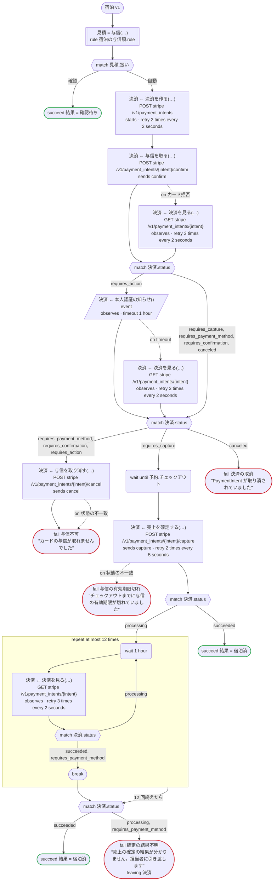
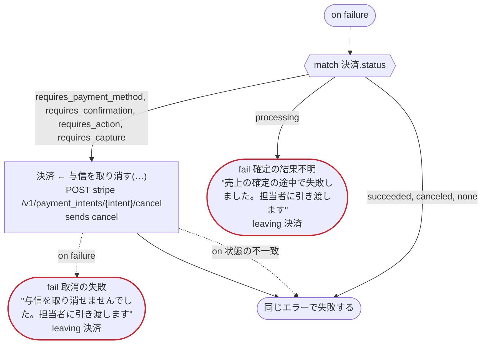
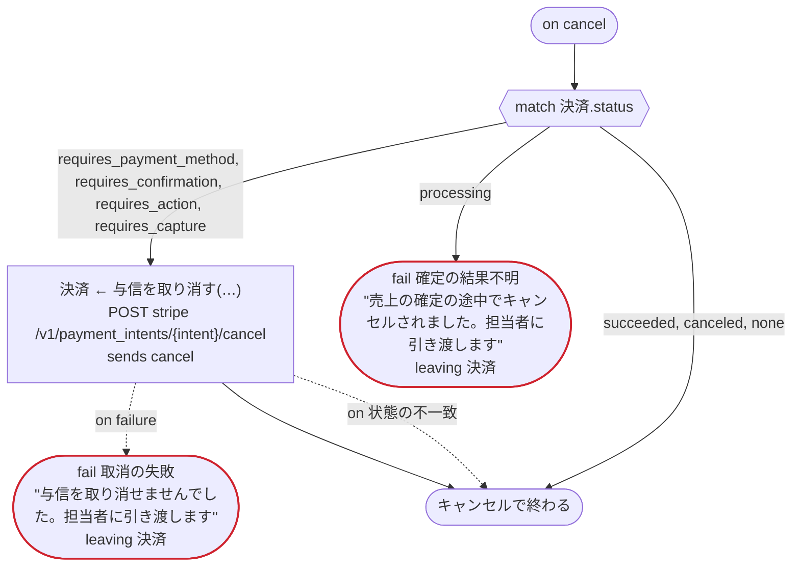

# 宿泊 v1

宿泊の予約を受けたらカードに与信を取り、チェックアウトの日に売上を確定する。与信の額と、フロントが先に確認するかどうかは規則が決め、決済は Stripe の PaymentIntent で行う。Temporal 向けの版：Stripe の呼び出しは dandori が生成するアクティビティで、秘密鍵は Transport が付ける。お客さまの 3-D セキュアの手続きが済んだことは、Stripe の Webhook が予約の ID を宛先にして知らせる（event）。お客さまが予約を取り消すと、与信も取り消す（on cancel）

`examples/hotel/temporal/hotel.ja.flow` を `dandori doc` で描いたものです。入力は `予約: 予約`、出力は `結果: 結果` です。

## flow

四角はタスク、両脇に線のある四角は規則、斜めの四角は外から値が届くタスク（イベントやコールバックの応答）、六角形は `match`、角の丸い四角は待ち、ステップを囲む枠はループです。破線の矢印は、呼び出しがその場で処理するエラーです。

## on failure

呼び出しが失敗し、そのエラーをその場で処理しないときに走ります（75・78・79・80・83・84・89・93・100 行目の呼び出しから）。最後まで走ると、ワークフローはそのエラーで失敗します。

## on cancel

ワークフローがキャンセルされると、そのとき待っている呼び出しや wait から、ここに来ます。最後まで走ると、ワークフローはキャンセルで終わります。

## 呼び出し

| 行 | 呼び出し | 呼ぶもの | リトライ | タイムアウト | 失敗したとき | 呼び出しのあとの案件 |
|---:|---|---|---|---|---|---|
| 75 | `見積 = 与信(…)` | 規則 `宿泊の与信額.rule` | 2 回（1 秒後と 2 秒後、failure） | — | `timeout`, `failure` → `on failure` | — |
| 78 | `決済 ← 決済を作る(…)` | `POST stripe /v1/payment_intents`, `starts payment_intent.payment then attach`, `key` | 2 秒おきに 2 回（failure, timeout） | — | `timeout`, `failure` → `on failure` | `決済`: `requires_confirmation` |
| 79 | `決済 ← 与信を取る(…)` | `POST stripe /v1/payment_intents/{intent}/confirm`, `sends confirm`, `key` | — | — | `カード拒否` → 80 行目 `状態の不一致`, `timeout`, `failure` → `on failure` | `決済`: `requires_payment_method`, `requires_action`, `requires_capture`, `canceled` |
| 80 | `決済 ← 決済を見る(…)` | `GET stripe /v1/payment_intents/{intent}`, `observes`, `idempotent` | 2 秒おきに 3 回（failure, timeout） | — | `timeout`, `failure` → `on failure` | `決済`: `requires_payment_method`, `requires_confirmation`, `requires_action`, `requires_capture`, `canceled` |
| 83 | `決済 ← 本人認証の知らせ()` | `event`, `observes` | — | 1 時間 | `timeout` → 84 行目 `failure` → `on failure` | `決済`: `requires_payment_method`, `requires_action`, `requires_capture`, `canceled` |
| 84 | `決済 ← 決済を見る(…)` | `GET stripe /v1/payment_intents/{intent}`, `observes`, `idempotent` | 2 秒おきに 3 回（failure, timeout） | — | `timeout`, `failure` → `on failure` | `決済`: `requires_payment_method`, `requires_action`, `requires_capture`, `canceled` |
| 89 | `決済 ← 与信を取り消す(…)` | `POST stripe /v1/payment_intents/{intent}/cancel`, `sends cancel`, `key` | — | — | `状態の不一致` → 90 行目 `timeout`, `failure` → `on failure` | `決済`: `canceled` |
| 93 | `決済 ← 売上を確定する(…)` | `POST stripe /v1/payment_intents/{intent}/capture`, `sends capture`, `key` | 5 秒おきに 2 回（failure, timeout） | — | `状態の不一致` → 94 行目 `timeout`, `failure` → `on failure` | `決済`: `processing`, `succeeded` |
| 100 | `決済 ← 決済を見る(…)` | `GET stripe /v1/payment_intents/{intent}`, `observes`, `idempotent` | 2 秒おきに 3 回（failure, timeout） | — | `timeout`, `failure` → `on failure` | `決済`: `requires_payment_method`, `processing`, `succeeded` |
| 112 | `決済 ← 与信を取り消す(…)` | `POST stripe /v1/payment_intents/{intent}/cancel`, `sends cancel`, `key` | — | — | `状態の不一致` → 113 行目 `timeout`, `failure` → 114 行目 | `決済`: `canceled` |
| 122 | `決済 ← 与信を取り消す(…)` | `POST stripe /v1/payment_intents/{intent}/cancel`, `sends cancel`, `key` | — | — | `状態の不一致` → 123 行目 `timeout`, `failure` → 124 行目 | `決済`: `canceled` |

## 終わり方

ワークフローの終わり方のすべてと、そのとき各案件がとりうる状態です。外部のサービスで起きるイベントも含めています。

| 行 | 終わり方 | `決済` |
|---:|---|---|
| 77 | `succeed 結果 = 確認待ち` | 始まっていない |
| 91 | `fail 与信不可` "カードの与信が取れませんでした" | `canceled` |
| 92 | `fail 決済の取消` "PaymentIntent が取り消されていました" | `canceled` |
| 94 | `fail 与信の有効期限切れ` "チェックアウトまでに与信の有効期限が切れていました" | `canceled` |
| 96 | `succeed 結果 = 宿泊済` | `succeeded` |
| 105 | `succeed 結果 = 宿泊済` | `succeeded` |
| 106 | `fail 確定の結果不明` "売上の確定の結果が分かりません。担当者に引き渡します" `leaving 決済` | そのまま引き渡す: `requires_payment_method`, `processing`, `succeeded` |
| 114 | `fail 取消の失敗` "与信を取り消せませんでした。担当者に引き渡します" `leaving 決済` | そのまま引き渡す: `requires_payment_method`, `requires_confirmation`, `requires_action`, `requires_capture`, `canceled` |
| 115 | `fail 確定の結果不明` "売上の確定の途中で失敗しました。担当者に引き渡します" `leaving 決済` | そのまま引き渡す: `requires_payment_method`, `processing`, `succeeded` |
| 115 | `on failure` が最後まで走り、ワークフローは始まりのエラーで失敗する | 始まっていないか、`succeeded`, `canceled` |
| 124 | `fail 取消の失敗` "与信を取り消せませんでした。担当者に引き渡します" `leaving 決済` | そのまま引き渡す: `requires_payment_method`, `requires_confirmation`, `requires_action`, `requires_capture`, `canceled` |
| 125 | `fail 確定の結果不明` "売上の確定の途中でキャンセルされました。担当者に引き渡します" `leaving 決済` | そのまま引き渡す: `requires_payment_method`, `processing`, `succeeded` |
| 125 | `on cancel` が最後まで走り、ワークフローはキャンセルで終わる | 始まっていないか、`succeeded`, `canceled` |

