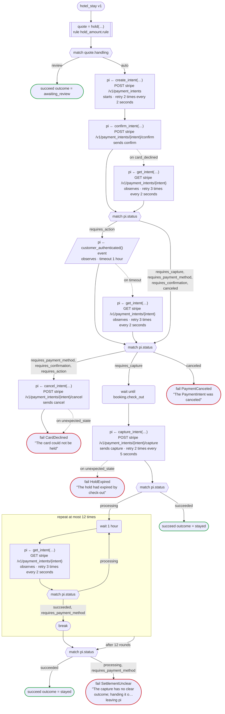
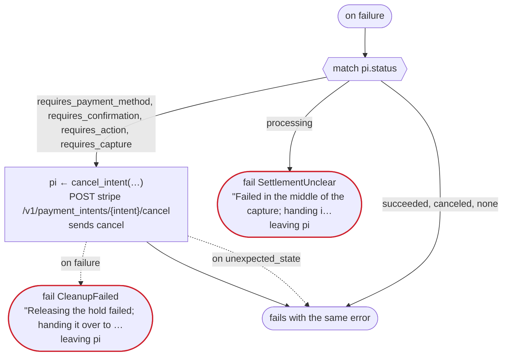
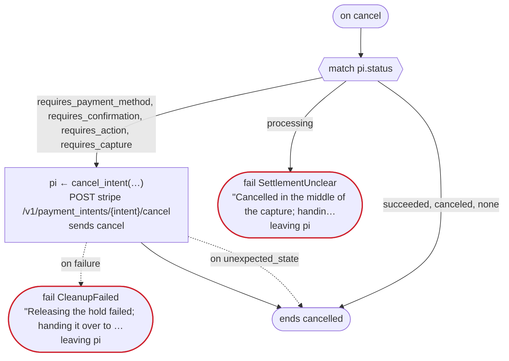

# hotel_stay v1

When a stay is booked, hold an amount on the card, and capture it on the day of check-out. A rule decides the amount and whether the front desk looks first; the payment is a Stripe PaymentIntent. Written for Temporal: the Stripe calls are activities dandori writes, and the Transport gives them the secret key; Stripe's webhook tells the workflow of the booking that the customer's 3-D Secure step is over, by the booking's id (an event); and a booking the guest cancels releases its hold (on cancel)

`examples/hotel/temporal/hotel.flow`, drawn by `dandori doc`. Inputs: `booking: Booking`. Outputs: `outcome: Outcome`.

## flow

A rectangle is a task, one with a line down each side a rule, a slanted one a task whose value comes from outside (an event, or the answer to a callback), a hexagon a `match`, a rounded box a wait, and a box around steps a loop. A dashed arrow is an error the call handles.

## on failure

Runs when a call fails and nothing at the call handles the error: from the calls on lines 75, 78, 79, 80, 83, 84, 89, 93 and 100. When it runs to its end, the workflow fails with that error.

## on cancel

Runs when the workflow is cancelled, from the call or the wait the run is at. When it runs to its end, the workflow ends cancelled.

## Calls

| Line | Call | Calls | Retries | Timeout | When it fails | Case after |
|---:|---|---|---|---|---|---|
| 75 | `quote = hold(…)` | rule `hold_amount.rule` | 2 times, after 1 second and 2 (failure) | — | `timeout`, `failure` → `on failure` | — |
| 78 | `pi ← create_intent(…)` | `POST stripe /v1/payment_intents`, `starts payment_intent.payment then attach`, `key` | 2 times every 2 seconds (failure, timeout) | — | `timeout`, `failure` → `on failure` | `pi`: `requires_confirmation` |
| 79 | `pi ← confirm_intent(…)` | `POST stripe /v1/payment_intents/{intent}/confirm`, `sends confirm`, `key` | — | — | `card_declined` → line 80 `unexpected_state`, `timeout`, `failure` → `on failure` | `pi`: `requires_payment_method`, `requires_action`, `requires_capture`, `canceled` |
| 80 | `pi ← get_intent(…)` | `GET stripe /v1/payment_intents/{intent}`, `observes`, `idempotent` | 3 times every 2 seconds (failure, timeout) | — | `timeout`, `failure` → `on failure` | `pi`: `requires_payment_method`, `requires_confirmation`, `requires_action`, `requires_capture`, `canceled` |
| 83 | `pi ← customer_authenticated()` | `event`, `observes` | — | 1 hour | `timeout` → line 84 `failure` → `on failure` | `pi`: `requires_payment_method`, `requires_action`, `requires_capture`, `canceled` |
| 84 | `pi ← get_intent(…)` | `GET stripe /v1/payment_intents/{intent}`, `observes`, `idempotent` | 3 times every 2 seconds (failure, timeout) | — | `timeout`, `failure` → `on failure` | `pi`: `requires_payment_method`, `requires_action`, `requires_capture`, `canceled` |
| 89 | `pi ← cancel_intent(…)` | `POST stripe /v1/payment_intents/{intent}/cancel`, `sends cancel`, `key` | — | — | `unexpected_state` → line 90 `timeout`, `failure` → `on failure` | `pi`: `canceled` |
| 93 | `pi ← capture_intent(…)` | `POST stripe /v1/payment_intents/{intent}/capture`, `sends capture`, `key` | 2 times every 5 seconds (failure, timeout) | — | `unexpected_state` → line 94 `timeout`, `failure` → `on failure` | `pi`: `processing`, `succeeded` |
| 100 | `pi ← get_intent(…)` | `GET stripe /v1/payment_intents/{intent}`, `observes`, `idempotent` | 3 times every 2 seconds (failure, timeout) | — | `timeout`, `failure` → `on failure` | `pi`: `requires_payment_method`, `processing`, `succeeded` |
| 112 | `pi ← cancel_intent(…)` | `POST stripe /v1/payment_intents/{intent}/cancel`, `sends cancel`, `key` | — | — | `unexpected_state` → line 113 `timeout`, `failure` → line 114 | `pi`: `canceled` |
| 122 | `pi ← cancel_intent(…)` | `POST stripe /v1/payment_intents/{intent}/cancel`, `sends cancel`, `key` | — | — | `unexpected_state` → line 123 `timeout`, `failure` → line 124 | `pi`: `canceled` |

## Ends

Every way the workflow can end, and what each case can be then, the events on the other side included.

| Line | End | `pi` |
|---:|---|---|
| 77 | `succeed outcome = awaiting_review` | not started |
| 91 | `fail CardDeclined` "The card could not be held" | `canceled` |
| 92 | `fail PaymentCanceled` "The PaymentIntent was canceled" | `canceled` |
| 94 | `fail HoldExpired` "The hold had expired by check-out" | `canceled` |
| 96 | `succeed outcome = stayed` | `succeeded` |
| 105 | `succeed outcome = stayed` | `succeeded` |
| 106 | `fail SettlementUnclear` "The capture has no clear outcome; handing it over to staff" `leaving pi` | handed over as it is: `requires_payment_method`, `processing`, `succeeded` |
| 114 | `fail CleanupFailed` "Releasing the hold failed; handing it over to staff" `leaving pi` | handed over as it is: `requires_payment_method`, `requires_confirmation`, `requires_action`, `requires_capture`, `canceled` |
| 115 | `fail SettlementUnclear` "Failed in the middle of the capture; handing it over to staff" `leaving pi` | handed over as it is: `requires_payment_method`, `processing`, `succeeded` |
| 115 | `on failure` runs to its end, and the workflow fails with the error that started it | not started, or `succeeded`, `canceled` |
| 124 | `fail CleanupFailed` "Releasing the hold failed; handing it over to staff" `leaving pi` | handed over as it is: `requires_payment_method`, `requires_confirmation`, `requires_action`, `requires_capture`, `canceled` |
| 125 | `fail SettlementUnclear` "Cancelled in the middle of the capture; handing it over to staff" `leaving pi` | handed over as it is: `requires_payment_method`, `processing`, `succeeded` |
| 125 | `on cancel` runs to its end, and the workflow ends cancelled | not started, or `succeeded`, `canceled` |

