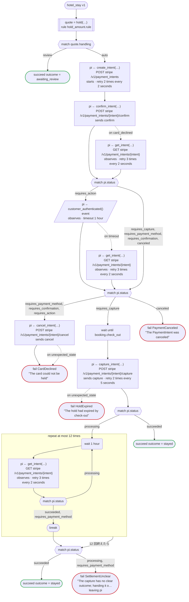

# hotel_stay v1

When a stay is booked, hold an amount on the card, and capture it on the day of check-out. A rule decides the amount and whether the front desk looks first; the payment is a Stripe PaymentIntent. Written for Temporal: the Stripe calls are activities dandori writes, and the Transport gives them the secret key; Stripe's webhook tells the workflow of the booking that the customer's 3-D Secure step is over, by the booking's id (an event); and a booking the guest cancels releases its hold (on cancel)

`examples/hotel/temporal/hotel.flow` を `dandori doc` で描いたものです。入力は `booking: Booking`、出力は `outcome: Outcome` です。

## flow

四角はタスク、両脇に線のある四角は規則、斜めの四角は外から値が届くタスク（イベントやコールバックの応答）、六角形は `match`、角の丸い四角は待ち、ステップを囲む枠はループです。破線の矢印は、呼び出しがその場で処理するエラーです。

## on failure

呼び出しが失敗し、そのエラーをその場で処理しないときに走ります（75・78・79・80・83・84・89・93・100 行目の呼び出しから）。最後まで走ると、ワークフローはそのエラーで失敗します。

## on cancel

ワークフローがキャンセルされると、そのとき待っている呼び出しや wait から、ここに来ます。最後まで走ると、ワークフローはキャンセルで終わります。

## 呼び出し

| 行 | 呼び出し | 呼ぶもの | リトライ | タイムアウト | 失敗したとき | 呼び出しのあとの案件 |
|---:|---|---|---|---|---|---|
| 75 | `quote = hold(…)` | 規則 `hold_amount.rule` | 2 回（1 秒後と 2 秒後、failure） | — | `timeout`, `failure` → `on failure` | — |
| 78 | `pi ← create_intent(…)` | `POST stripe /v1/payment_intents`, `starts payment_intent.payment then attach`, `key` | 2 秒おきに 2 回（failure, timeout） | — | `timeout`, `failure` → `on failure` | `pi`: `requires_confirmation` |
| 79 | `pi ← confirm_intent(…)` | `POST stripe /v1/payment_intents/{intent}/confirm`, `sends confirm`, `key` | — | — | `card_declined` → 80 行目 `unexpected_state`, `timeout`, `failure` → `on failure` | `pi`: `requires_payment_method`, `requires_action`, `requires_capture`, `canceled` |
| 80 | `pi ← get_intent(…)` | `GET stripe /v1/payment_intents/{intent}`, `observes`, `idempotent` | 2 秒おきに 3 回（failure, timeout） | — | `timeout`, `failure` → `on failure` | `pi`: `requires_payment_method`, `requires_confirmation`, `requires_action`, `requires_capture`, `canceled` |
| 83 | `pi ← customer_authenticated()` | `event`, `observes` | — | 1 時間 | `timeout` → 84 行目 `failure` → `on failure` | `pi`: `requires_payment_method`, `requires_action`, `requires_capture`, `canceled` |
| 84 | `pi ← get_intent(…)` | `GET stripe /v1/payment_intents/{intent}`, `observes`, `idempotent` | 2 秒おきに 3 回（failure, timeout） | — | `timeout`, `failure` → `on failure` | `pi`: `requires_payment_method`, `requires_action`, `requires_capture`, `canceled` |
| 89 | `pi ← cancel_intent(…)` | `POST stripe /v1/payment_intents/{intent}/cancel`, `sends cancel`, `key` | — | — | `unexpected_state` → 90 行目 `timeout`, `failure` → `on failure` | `pi`: `canceled` |
| 93 | `pi ← capture_intent(…)` | `POST stripe /v1/payment_intents/{intent}/capture`, `sends capture`, `key` | 5 秒おきに 2 回（failure, timeout） | — | `unexpected_state` → 94 行目 `timeout`, `failure` → `on failure` | `pi`: `processing`, `succeeded` |
| 100 | `pi ← get_intent(…)` | `GET stripe /v1/payment_intents/{intent}`, `observes`, `idempotent` | 2 秒おきに 3 回（failure, timeout） | — | `timeout`, `failure` → `on failure` | `pi`: `requires_payment_method`, `processing`, `succeeded` |
| 112 | `pi ← cancel_intent(…)` | `POST stripe /v1/payment_intents/{intent}/cancel`, `sends cancel`, `key` | — | — | `unexpected_state` → 113 行目 `timeout`, `failure` → 114 行目 | `pi`: `canceled` |
| 122 | `pi ← cancel_intent(…)` | `POST stripe /v1/payment_intents/{intent}/cancel`, `sends cancel`, `key` | — | — | `unexpected_state` → 123 行目 `timeout`, `failure` → 124 行目 | `pi`: `canceled` |

## 終わり方

ワークフローの終わり方のすべてと、そのとき各案件がとりうる状態です。外部のサービスで起きるイベントも含めています。

| 行 | 終わり方 | `pi` |
|---:|---|---|
| 77 | `succeed outcome = awaiting_review` | 始まっていない |
| 91 | `fail CardDeclined` "The card could not be held" | `canceled` |
| 92 | `fail PaymentCanceled` "The PaymentIntent was canceled" | `canceled` |
| 94 | `fail HoldExpired` "The hold had expired by check-out" | `canceled` |
| 96 | `succeed outcome = stayed` | `succeeded` |
| 105 | `succeed outcome = stayed` | `succeeded` |
| 106 | `fail SettlementUnclear` "The capture has no clear outcome; handing it over to staff" `leaving pi` | そのまま引き渡す: `requires_payment_method`, `processing`, `succeeded` |
| 114 | `fail CleanupFailed` "Releasing the hold failed; handing it over to staff" `leaving pi` | そのまま引き渡す: `requires_payment_method`, `requires_confirmation`, `requires_action`, `requires_capture`, `canceled` |
| 115 | `fail SettlementUnclear` "Failed in the middle of the capture; handing it over to staff" `leaving pi` | そのまま引き渡す: `requires_payment_method`, `processing`, `succeeded` |
| 115 | `on failure` が最後まで走り、ワークフローは始まりのエラーで失敗する | 始まっていないか、`succeeded`, `canceled` |
| 124 | `fail CleanupFailed` "Releasing the hold failed; handing it over to staff" `leaving pi` | そのまま引き渡す: `requires_payment_method`, `requires_confirmation`, `requires_action`, `requires_capture`, `canceled` |
| 125 | `fail SettlementUnclear` "Cancelled in the middle of the capture; handing it over to staff" `leaving pi` | そのまま引き渡す: `requires_payment_method`, `processing`, `succeeded` |
| 125 | `on cancel` が最後まで走り、ワークフローはキャンセルで終わる | 始まっていないか、`succeeded`, `canceled` |

