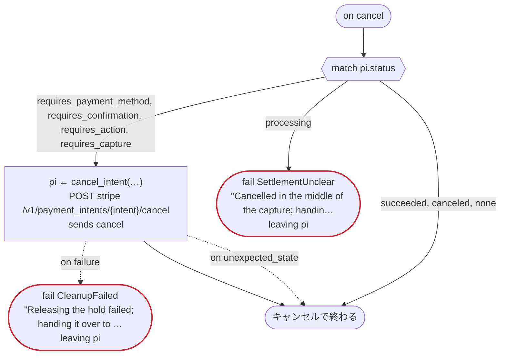
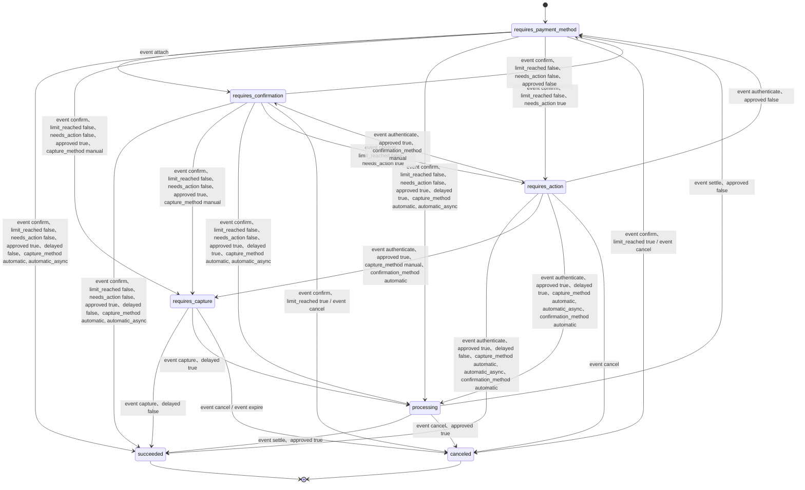

# hotel_stay v1

When a stay is booked, hold an amount on the card, and capture it on the day of check-out. A rule decides the amount and whether the front desk looks first; the payment is a Stripe PaymentIntent. Written for Temporal: the Stripe calls are activities dandori writes, and the Transport gives them the secret key; Stripe's webhook tells the workflow of the booking that the customer's 3-D Secure step is over, by the booking's id (an event); and a booking the guest cancels releases its hold (on cancel)

`examples/hotel/temporal/hotel.flow` を `dandori doc` で描いたものです。入力は `booking: Booking`、出力は `outcome: Outcome` です。

## flow

四角はタスク、両脇に線のある四角は規則、斜めの四角は外から値が届くタスク（イベントやコールバックの応答）、六角形は `match`、角の丸い四角は待ち、ステップを囲む枠はループです。破線の矢印は、呼び出しがその場で処理するエラーです。

## on failure

呼び出しが失敗し、そのエラーをその場で処理しないときに走ります（75・78・79・80・83・84・89・93・100 行目の呼び出しから）。最後まで走ると、ワークフローはそのエラーで失敗します。

## on cancel

ワークフローがキャンセルされると、そのとき待っている呼び出しや wait から、ここに来ます。最後まで走ると、ワークフローはキャンセルで終わります。

## 呼び出し

| 行 | 呼び出し | 呼ぶもの | リトライ | タイムアウト | 失敗したとき | 呼び出しのあとの案件 |
|---:|---|---|---|---|---|---|
| 75 | `quote = hold(…)` | 規則 `hold_amount.rule` | 2 回（1 秒後と 2 秒後、failure） | — | `timeout`, `failure` → `on failure` | — |
| 78 | `pi ← create_intent(…)` | `POST stripe /v1/payment_intents`, `starts payment_intent.payment then attach`, `key` | 2 秒おきに 2 回（failure, timeout） | — | `timeout`, `failure` → `on failure` | `pi`: `requires_confirmation` |
| 79 | `pi ← confirm_intent(…)` | `POST stripe /v1/payment_intents/{intent}/confirm`, `sends confirm`, `key` | — | — | `card_declined` → 80 行目 `unexpected_state`, `timeout`, `failure` → `on failure` | `pi`: `requires_payment_method`, `requires_action`, `requires_capture`, `canceled` |
| 80 | `pi ← get_intent(…)` | `GET stripe /v1/payment_intents/{intent}`, `observes`, `idempotent` | 2 秒おきに 3 回（failure, timeout） | — | `timeout`, `failure` → `on failure` | `pi`: `requires_payment_method`, `requires_confirmation`, `requires_action`, `requires_capture`, `canceled` |
| 83 | `pi ← customer_authenticated()` | `event`, `observes` | — | 1 時間 | `timeout` → 84 行目 `failure` → `on failure` | `pi`: `requires_payment_method`, `requires_action`, `requires_capture`, `canceled` |
| 84 | `pi ← get_intent(…)` | `GET stripe /v1/payment_intents/{intent}`, `observes`, `idempotent` | 2 秒おきに 3 回（failure, timeout） | — | `timeout`, `failure` → `on failure` | `pi`: `requires_payment_method`, `requires_action`, `requires_capture`, `canceled` |
| 89 | `pi ← cancel_intent(…)` | `POST stripe /v1/payment_intents/{intent}/cancel`, `sends cancel`, `key` | — | — | `unexpected_state` → 90 行目 `timeout`, `failure` → `on failure` | `pi`: `canceled` |
| 93 | `pi ← capture_intent(…)` | `POST stripe /v1/payment_intents/{intent}/capture`, `sends capture`, `key` | 5 秒おきに 2 回（failure, timeout） | — | `unexpected_state` → 94 行目 `timeout`, `failure` → `on failure` | `pi`: `processing`, `succeeded` |
| 100 | `pi ← get_intent(…)` | `GET stripe /v1/payment_intents/{intent}`, `observes`, `idempotent` | 2 秒おきに 3 回（failure, timeout） | — | `timeout`, `failure` → `on failure` | `pi`: `requires_payment_method`, `processing`, `succeeded` |
| 112 | `pi ← cancel_intent(…)` | `POST stripe /v1/payment_intents/{intent}/cancel`, `sends cancel`, `key` | — | — | `unexpected_state` → 113 行目 `timeout`, `failure` → 114 行目 | `pi`: `canceled` |
| 122 | `pi ← cancel_intent(…)` | `POST stripe /v1/payment_intents/{intent}/cancel`, `sends cancel`, `key` | — | — | `unexpected_state` → 123 行目 `timeout`, `failure` → 124 行目 | `pi`: `canceled` |

## 終わり方

ワークフローの終わり方のすべてと、そのとき各案件がとりうる状態です。外部のサービスで起きるイベントも含めています。

| 行 | 終わり方 | `pi` |
|---:|---|---|
| 77 | `succeed outcome = awaiting_review` | 始まっていない |
| 91 | `fail CardDeclined` "The card could not be held" | `canceled` |
| 92 | `fail PaymentCanceled` "The PaymentIntent was canceled" | `canceled` |
| 94 | `fail HoldExpired` "The hold had expired by check-out" | `canceled` |
| 96 | `succeed outcome = stayed` | `succeeded` |
| 105 | `succeed outcome = stayed` | `succeeded` |
| 106 | `fail SettlementUnclear` "The capture has no clear outcome; handing it over to staff" `leaving pi` | そのまま引き渡す: `requires_payment_method`, `processing`, `succeeded` |
| 114 | `fail CleanupFailed` "Releasing the hold failed; handing it over to staff" `leaving pi` | そのまま引き渡す: `requires_payment_method`, `requires_confirmation`, `requires_action`, `requires_capture`, `canceled` |
| 115 | `fail SettlementUnclear` "Failed in the middle of the capture; handing it over to staff" `leaving pi` | そのまま引き渡す: `requires_payment_method`, `processing`, `succeeded` |
| 115 | `on failure` が最後まで走り、ワークフローは始まりのエラーで失敗する | 始まっていないか、`succeeded`, `canceled` |
| 124 | `fail CleanupFailed` "Releasing the hold failed; handing it over to staff" `leaving pi` | そのまま引き渡す: `requires_payment_method`, `requires_confirmation`, `requires_action`, `requires_capture`, `canceled` |
| 125 | `fail SettlementUnclear` "Cancelled in the middle of the capture; handing it over to staff" `leaving pi` | そのまま引き渡す: `requires_payment_method`, `processing`, `succeeded` |
| 125 | `on cancel` が最後まで走り、ワークフローはキャンセルで終わる | 始まっていないか、`succeeded`, `canceled` |

## 規則

このワークフローが呼ぶ規則を、`rulec doc` が承認する人向けに描いたものです。

<code>hold</code> · hold_amount v1 · <code>../rules/hold_amount.rule</code>

<!-- rulec 0.21.2 が hold_amount.rule (sha256:0ce5f2bc9d81) から生成。これは読み取り専用の資料で、本物は .rule のほうです。編集しても戻せません（§1.6）。 -->
# 規則 hold_amount v1

How much a booking holds on the card, and whether the front desk looks at it first: the nightly rate times the nights, and a stay of fifteen nights or more goes to the desk. Written for the example

## 入力

| 名前 | 型 | 範囲 | 注記 |
|---|---|---|---|
| room | room（3 値） |  |  |
| nights | number | 1 〜 30 |  |

## 出力

| 名前 | 型 | 丸め | 注記 |
|---|---|---|---|
| amount | money[JPY, incl_tax] | down(1JPY) |  |
| handling | handling（2 値） |  |  |

## 型

列挙は**閉じた**有限集合です。値を足すと、それを見ていない表が完全性検査で割れます。

- **room**（3 値）— standard、deluxe、suite
- **handling**（2 値）— auto、review

## 導出と定義

表の列に置ける中間の値です。式はもとの規則のとおりで、範囲は宣言されたものです。

| 名前 | 種類 | 式 | 範囲 | 注記 |
|---|---|---|---|---|
| amount | 定義 | `per_night * nights` |  |  |

## 表 rate（policy unique）

| 列 | 出どころ |
|---|---|
| room | 入力 |
| → per_night | （この表の中だけ） |

| # | room | → per_night（money[JPY, incl_tax]） |
|---|---|---|
| 1 | standard | 12000JPY |
| 2 | deluxe | 18000JPY |
| 3 | suite | 40000JPY |

**`rulec check` が確かめたこと**

- どの入力の組合せも、いずれかの行に当てはまります（E101 完全性）
- どの入力にも当てはまらない行はありません（E102）
- 二つ以上の行に同時に当てはまる入力はありません（E105 重なり）。行の並べ替えは意味を変えません

## 表 decide（policy unique）

| 列 | 出どころ |
|---|---|
| nights | 入力 |
| → handling | この規則の出力 |

| # | nights | → handling（handling） |
|---|---|---|
| 1 | <=14 | auto |
| 2 | >=15 | review |

**`rulec check` が確かめたこと**

- どの入力の組合せも、いずれかの行に当てはまります（E101 完全性）
- どの入力にも当てはまらない行はありません（E102）
- 二つ以上の行に同時に当てはまる入力はありません（E105 重なり）。行の並べ替えは意味を変えません

## 例（検証済み）

| room | nights | → amount | handling |
|---|---|---|---|
| standard | 2 | 24000JPY | auto |
| suite | 15 | 600000JPY | review |

この 2 件は `rulec check` が参照評価器で実行し、すべて宣言どおりの値になりました（E107）。例は**実行される仕様**です。

<code>payment_intent</code> · payment_intent v1 · <code>../rules/payment_intent.rule</code>

<!-- rulec 0.21.2 が payment_intent.rule (sha256:ec6477bfd9ec) から生成。これは読み取り専用の資料で、本物は .rule のほうです。編集しても戻せません（§1.6）。 -->
# 規則 payment_intent v1

Where a Stripe PaymentIntent's status goes when it is confirmed, authenticated, captured or canceled, and when a delayed payment settles. Transcribed from Stripe's documentation

## 入力

| 名前 | 型 | 範囲 | 注記 |
|---|---|---|---|
| status | status（7 値） |  |  |
| event | event（7 値） |  | attach: a payment method is attached without confirming |
| limit_reached | bool |  | this confirmation is past the limit Stripe puts on one PaymentIntent, which varies |
| needs_action | bool |  | the payment method asks for a further step, such as 3D Secure |
| approved | bool |  | the issuer or the bank lets the attempt through; for a cancel, Stripe accepts it |
| delayed | bool |  | the payment method confirms success only days later, as a bank debit does |
| capture_method | capture_method（3 値） |  |  |
| confirmation_method | confirmation_method（2 値） |  |  |

## 出力

| 名前 | 型 | 丸め | 注記 |
|---|---|---|---|
| next_status | status（7 値） |  |  |
| funds | funds（4 値） |  |  |
| refused | bool |  | the status does not take this event: an API call gets payment_intent_unexpected_state |

## 型

列挙は**閉じた**有限集合です。値を足すと、それを見ていない表が完全性検査で割れます。

- **status**（7 値）— requires_payment_method、requires_confirmation、requires_action、processing、requires_capture、succeeded、canceled
- **event**（7 値）— attach、confirm、authenticate、settle、capture、cancel、expire
- **capture_method**（3 値）— automatic、automatic_async、manual
- **confirmation_method**（2 値）— automatic、manual
- **funds**（4 値）— untouched、held、captured、released

## グループ

グループは列挙の一部に名前を付けたものです。表のセルに書かれた一語が、下の値をまとめて指しています。

- **unconfirmed**（2 値）— requires_payment_method、requires_confirmation

この 1 グループが覆うのは status の 7 値のうち 2 値で、requires_action、processing、requires_capture、succeeded、canceled はどのグループにも入っていません（この資料が宣言から数えました）。

## 表 transition（policy unique）

lifecycle, status, and the API reference for each call

| 列 | 出どころ |
|---|---|
| status | 入力 |
| event | 入力 |
| limit_reached | 入力 |
| needs_action | 入力 |
| approved | 入力 |
| delayed | 入力 |
| capture_method | 入力 |
| confirmation_method | 入力 |
| → next_status | この規則の出力 |
| → funds | この規則の出力 |
| → refused | この規則の出力 |

| # | status | event | limit_reached | needs_action | approved | delayed | capture_method | confirmation_method | → next_status（status） | → funds（funds） | → refused（bool） | 注記 |
|---|---|---|---|---|---|---|---|---|---|---|---|---|
| 1 | unconfirmed | attach | - | - | - | - | - | - | requires_confirmation | untouched | false | lifecycle; from requires_confirmation, assumed the same |
| 2 | unconfirmed | confirm | true | - | - | - | - | - | canceled | untouched | false | confirm |
| 3 | unconfirmed | confirm | false | true | - | - | - | - | requires_action | untouched | false | confirm |
| 4 | unconfirmed | confirm | false | false | false | - | - | - | requires_payment_method | untouched | false | confirm |
| 5 | unconfirmed | confirm | false | false | true | - | manual | - | requires_capture | held | false | confirm |
| 6 | unconfirmed | confirm | false | false | true | true | automatic, automatic_async | - | processing | untouched | false | lifecycle |
| 7 | unconfirmed | confirm | false | false | true | false | automatic, automatic_async | - | succeeded | captured | false | confirm |
| 8 | unconfirmed | cancel | - | - | - | - | - | - | canceled | untouched | false | cancel |
| 9 | unconfirmed | authenticate, settle, capture, expire | - | - | - | - | - | - | status | untouched | true | capture, errors |
| 10 | requires_action | authenticate | - | - | false | - | - | - | requires_payment_method | untouched | false | 3ds |
| 11 | requires_action | authenticate | - | - | true | - | - | manual | requires_confirmation | untouched | false | confirm |
| 12 | requires_action | authenticate | - | - | true | - | manual | automatic | requires_capture | held | false | 3ds |
| 13 | requires_action | authenticate | - | - | true | true | automatic, automatic_async | automatic | processing | untouched | false | lifecycle |
| 14 | requires_action | authenticate | - | - | true | false | automatic, automatic_async | automatic | succeeded | captured | false | 3ds, lifecycle |
| 15 | requires_action | cancel | - | - | - | - | - | - | canceled | untouched | false | cancel |
| 16 | requires_action | attach, confirm, settle, capture, expire | - | - | - | - | - | - | status | untouched | true | errors; for attach and confirm the pages say nothing, assumed refused |
| 17 | processing | settle | - | - | true | - | - | - | succeeded | captured | false | lifecycle, status |
| 18 | processing | settle | - | - | false | - | - | - | requires_payment_method | untouched | false | lifecycle |
| 19 | processing | cancel | - | - | true | - | - | - | canceled | untouched | false | lifecycle: ACH, ACSS, AU BECS, BACS, NZ BECS and SEPA, inside a window |
| 20 | processing | cancel | - | - | false | - | - | - | status | untouched | true | lifecycle; cancel says "in rare cases" |
| 21 | processing | attach, confirm, authenticate, capture, expire | - | - | - | - | - | - | status | untouched | true | errors |
| 22 | requires_capture | capture | - | - | - | false | - | - | succeeded | captured | false | capture, lifecycle |
| 23 | requires_capture | capture | - | - | - | true | - | - | processing | untouched | false | lifecycle names no method; hold says bank debits cannot be held |
| 24 | requires_capture | cancel | - | - | - | - | - | - | canceled | released | false | cancel |
| 25 | requires_capture | expire | - | - | - | - | - | - | canceled | released | false | hold, capture |
| 26 | requires_capture | attach, confirm, authenticate, settle | - | - | - | - | - | - | status | untouched | true | errors |
| 27 | succeeded | - | - | - | - | - | - | - | status | untouched | true | lifecycle, status: refunds go through the Refunds API |
| 28 | canceled | - | - | - | - | - | - | - | status | untouched | true | cancel, lifecycle |

この表のセルに現れるグループ: **unconfirmed**（2 値）。中身は「グループ」の節にあります。

**`rulec check` が確かめたこと**

- どの入力の組合せも、いずれかの行に当てはまります（E101 完全性）
- どの入力にも当てはまらない行はありません（E102）
- 二つ以上の行に同時に当てはまる入力はありません（E105 重なり）。行の並べ替えは意味を変えません

## ステートマシン: payment

この規則はステートマシンの一歩です。呼び出しのたびに状態（入力 status）を受け取り、次の状態（出力 next_status）を返します。**状態を覚えておくのは呼び出す側で、生成コードは何も覚えません。**行き先を決めるのは表 transition です。

| 始まりの状態 | 終わりの状態 |
|---|---|
| requires_payment_method | succeeded、canceled |

一つの案件は、capture_method、confirmation_method を最初の呼び出しから最後の呼び出しまで同じ値で渡します（`held`）。下の主張は、それを変えない呼び出しの並びについてのものです。

### 状態ごとの行き先

| 状態 | 行き先（表 transition の行） |
|---|---|
| requires_payment_method | event attach（行1） → requires_confirmation / event confirm、limit_reached true（行2） → canceled / event confirm、limit_reached false、needs_action true（行3） → requires_action / event confirm、limit_reached false、needs_action false、approved false（行4） → 留まる / event confirm、limit_reached false、needs_action false、approved true、capture_method manual（行5） → requires_capture / event confirm、limit_reached false、needs_action false、approved true、delayed true、capture_method automatic, automatic_async（行6） → processing / event confirm、limit_reached false、needs_action false、approved true、delayed false、capture_method automatic, automatic_async（行7） → succeeded / event cancel（行8） → canceled / event authenticate, settle, capture, expire（行9） → 留まる |
| requires_confirmation | event attach（行1） → 留まる / event confirm、limit_reached true（行2） → canceled / event confirm、limit_reached false、needs_action true（行3） → requires_action / event confirm、limit_reached false、needs_action false、approved false（行4） → requires_payment_method / event confirm、limit_reached false、needs_action false、approved true、capture_method manual（行5） → requires_capture / event confirm、limit_reached false、needs_action false、approved true、delayed true、capture_method automatic, automatic_async（行6） → processing / event confirm、limit_reached false、needs_action false、approved true、delayed false、capture_method automatic, automatic_async（行7） → succeeded / event cancel（行8） → canceled / event authenticate, settle, capture, expire（行9） → 留まる |
| requires_action | event authenticate、approved false（行10） → requires_payment_method / event authenticate、approved true、confirmation_method manual（行11） → requires_confirmation / event authenticate、approved true、capture_method manual、confirmation_method automatic（行12） → requires_capture / event authenticate、approved true、delayed true、capture_method automatic, automatic_async、confirmation_method automatic（行13） → processing / event authenticate、approved true、delayed false、capture_method automatic, automatic_async、confirmation_method automatic（行14） → succeeded / event cancel（行15） → canceled / event attach, confirm, settle, capture, expire（行16） → 留まる |
| processing | event settle、approved true（行17） → succeeded / event settle、approved false（行18） → requires_payment_method / event cancel、approved true（行19） → canceled / event cancel、approved false（行20） → 留まる / event attach, confirm, authenticate, capture, expire（行21） → 留まる |
| requires_capture | event capture、delayed false（行22） → succeeded / event capture、delayed true（行23） → processing / event cancel（行24） → canceled / event expire（行25） → canceled / event attach, confirm, authenticate, settle（行26） → 留まる |
| succeeded | どの呼び出しでも（行27） → 留まる |
| canceled | どの呼び出しでも（行28） → 留まる |

### `rulec check` が呼び出しの並び全体について確かめたこと

- requires_payment_method から着ける状態は requires_payment_method・requires_confirmation・requires_action・processing・requires_capture・succeeded・canceled です。すべての状態に着けます。
- 終わりの状態 succeeded・canceled からは、ほかの状態へ移る呼び出しがありません。
- どの状態に着いても、終わりの状態へ行く手順が残っています。
- `never succeeded after canceled`: canceled のあとに succeeded に着く手順はありません。
- `once funds captured`: funds が captured になる呼び出しは、一件の案件で一回までです。

### 手順の例（検証済み）

**card_with_3ds**

| # | status | event | limit_reached | needs_action | approved | delayed | capture_method | confirmation_method | → next_status | funds | refused |
|---|---|---|---|---|---|---|---|---|---|---|---|
| 1 | requires_payment_method | confirm | false | true | false | false | automatic_async | automatic | requires_action | untouched | false |
| 2 | requires_action | authenticate | false | false | true | false | automatic_async | automatic | succeeded | captured | false |

**authorize_then_capture**

| # | status | event | limit_reached | needs_action | approved | delayed | capture_method | confirmation_method | → next_status | funds | refused |
|---|---|---|---|---|---|---|---|---|---|---|---|
| 1 | requires_payment_method | confirm | false | false | true | false | manual | automatic | requires_capture | held | false |
| 2 | requires_capture | capture | false | false | true | false | manual | automatic | succeeded | captured | false |

**hold_expires**

| # | status | event | limit_reached | needs_action | approved | delayed | capture_method | confirmation_method | → next_status | funds | refused |
|---|---|---|---|---|---|---|---|---|---|---|---|
| 1 | requires_payment_method | confirm | false | false | true | false | manual | automatic | requires_capture | held | false |
| 2 | requires_capture | expire | false | false | false | false | manual | automatic | canceled | released | false |
| 3 | canceled | capture | false | false | true | false | manual | automatic | canceled | untouched | true |

**debit_fails_card_retries**

| # | status | event | limit_reached | needs_action | approved | delayed | capture_method | confirmation_method | → next_status | funds | refused |
|---|---|---|---|---|---|---|---|---|---|---|---|
| 1 | requires_payment_method | confirm | false | false | true | true | automatic | automatic | processing | untouched | false |
| 2 | processing | cancel | false | false | false | true | automatic | automatic | processing | untouched | true |
| 3 | processing | settle | false | false | false | true | automatic | automatic | requires_payment_method | untouched | false |
| 4 | requires_payment_method | confirm | false | false | true | false | automatic | automatic | succeeded | captured | false |

**manual_confirmation**

| # | status | event | limit_reached | needs_action | approved | delayed | capture_method | confirmation_method | → next_status | funds | refused |
|---|---|---|---|---|---|---|---|---|---|---|---|
| 1 | requires_payment_method | attach | false | false | false | false | automatic | manual | requires_confirmation | untouched | false |
| 2 | requires_confirmation | confirm | false | true | false | false | automatic | manual | requires_action | untouched | false |
| 3 | requires_action | authenticate | false | false | true | false | automatic | manual | requires_confirmation | untouched | false |
| 4 | requires_confirmation | confirm | false | false | true | false | automatic | manual | succeeded | captured | false |

**too_many_confirmations**

| # | status | event | limit_reached | needs_action | approved | delayed | capture_method | confirmation_method | → next_status | funds | refused |
|---|---|---|---|---|---|---|---|---|---|---|---|
| 1 | requires_payment_method | confirm | false | false | false | false | automatic | automatic | requires_payment_method | untouched | false |
| 2 | requires_payment_method | confirm | true | false | false | false | automatic | automatic | canceled | untouched | false |
| 3 | canceled | confirm | false | false | true | false | automatic | automatic | canceled | untouched | true |

一行目は requires_payment_method から始まり、二行目からは一つ前の呼び出しが返した状態から始まります（左の列）。`rulec check` が参照評価器で順に実行し、すべて宣言どおりの値になりました（E107）。

## 例（検証済み）

| status | event | limit_reached | needs_action | approved | delayed | capture_method | confirmation_method | → next_status | funds | refused |
|---|---|---|---|---|---|---|---|---|---|---|
| requires_capture | cancel | false | false | false | false | manual | automatic | canceled | released | false |
| succeeded | cancel | false | false | false | false | automatic | automatic | succeeded | untouched | true |
| processing | cancel | false | false | true | true | automatic | automatic | canceled | untouched | false |

この 3 件は `rulec check` が参照評価器で実行し、すべて宣言どおりの値になりました（E107）。例は**実行される仕様**です。

