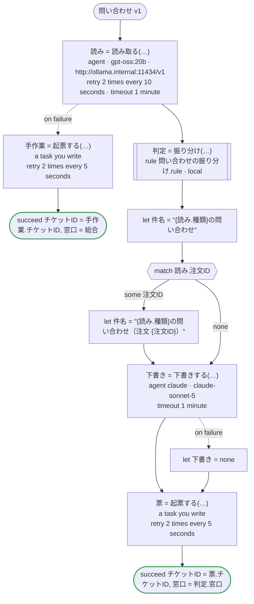

# 問い合わせ v1

お客さまの問い合わせをエージェントが読んで、種類と注文番号と要点を取り出す。受け持つ窓口と最初の返事までの時間は規則が決め、返事の下書きは別のエージェントが書き、窓口のシステムに起票する。読むことと書くことはエージェント（読むのは会社が自分で動かしているモデル、書くのは Claude）が、決めることは規則が受け持つ。Temporal 向けの版：エージェントは dandori が生成するアクティビティで、読み取りは Open Responses を話す会社の Ollama に（`url`）、下書きはワーカーが持つ鍵で Claude に送る。規則はワークフローと同じワーカーでローカルアクティビティとして動き、その結果はマーカーとして履歴に残る。起票は自分で書くアクティビティ

`examples/inquiry/temporal/inquiry.ja.flow`, drawn by `dandori doc`. Inputs: `問い合わせ: 問い合わせ`. Outputs: `チケットID: string`, `窓口: 振り分け.窓口`.

## flow

A rectangle is a task, one with a line down each side a rule, a slanted one a task whose value comes from outside (an event, or the answer to a callback), a hexagon a `match`, a rounded box a wait, and a box around steps a loop. A dashed arrow is an error the call handles.

## Calls

| Line | Call | Calls | Retries | Timeout | When it fails |
|---:|---|---|---|---|---|
| 49 | `読み = 読み取る(…)` | `agent · gpt-oss:20b · http://ollama.internal:11434/v1` | 2 times every 10 seconds (failure, timeout) | 1 minute | `timeout`, `failure` → line 50 |
| 51 | `手作業 = 起票する(…)` | a task you write, `key` | 2 times every 5 seconds (failure, timeout) | — | `timeout`, `failure` → the workflow fails |
| 53 | `判定 = 振り分け(…)` | rule `問い合わせの振り分け.rule`, a local activity on Temporal | 2 times, after 1 second and 2 (failure) | — | `timeout`, `failure` → the workflow fails |
| 58 | `下書き = 下書きする(…)` | `agent claude · claude-sonnet-5` | — | 1 minute | `timeout`, `failure` → line 59 |
| 60 | `票 = 起票する(…)` | a task you write, `key` | 2 times every 5 seconds (failure, timeout) | — | `timeout`, `failure` → the workflow fails |

## Ends

Every way the workflow can end.

| Line | End |
|---:|---|
| 52 | `succeed チケットID = 手作業.チケットID, 窓口 = 総合` |
| 61 | `succeed チケットID = 票.チケットID, 窓口 = 判定.窓口` |

