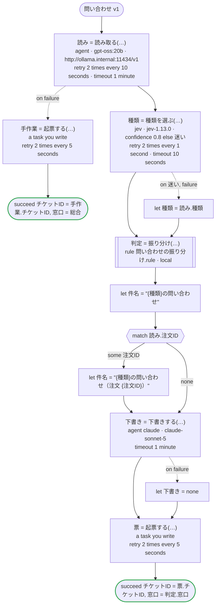

# 問い合わせ v1

お客さまの問い合わせの種類を Jev が選び、その確信度も返す。エージェントは問い合わせを読んで注文番号と要点を取り出し、種類も読む。Jev が種類に十分な確信を持てないときは、エージェントが読んだ種類を使う。受け持つ窓口と最初の返事までの時間は規則が決め、返事の下書きは別のエージェントが書き、窓口のシステムに起票する。選ぶことは Jev が、読むことと書くことはエージェント（読むのは会社が自分で動かしているモデル、書くのは Claude）が、決めることは規則が受け持つ。Temporal 向けの版：Jev とエージェントは生成したアクティビティで、Jev は TypeSafe の API キー（TYPESAFE_API_KEY）で呼び、読み取りは Open Responses を話す会社の Ollama に（`url`）、下書きはワーカーが持つ鍵で Claude に送る。規則はワークフローと同じワーカーでローカルアクティビティとして動き、その結果はマーカーとして履歴に残る。起票は自分で書くアクティビティ

`examples/inquiry/temporal/inquiry.ja.flow`, drawn by `dandori doc`. Inputs: `問い合わせ: 問い合わせ`. Outputs: `チケットID: string`, `窓口: 振り分け.窓口`.

## flow

A rectangle is a task, one with a line down each side a rule, a slanted one a task whose value comes from outside (an event, or the answer to a callback), a hexagon a `match`, a rounded box a wait, and a box around steps a loop. A dashed arrow is an error the call handles.

## Calls

| Line | Call | Calls | Retries | Timeout | When it fails |
|---:|---|---|---|---|---|
| 61 | `読み = 読み取る(…)` | `agent · gpt-oss:20b · http://ollama.internal:11434/v1` | 2 times every 10 seconds (failure, timeout) | 1 minute | `timeout`, `failure` → line 62 |
| 63 | `手作業 = 起票する(…)` | a task you write, `key` | 2 times every 5 seconds (failure, timeout) | — | `timeout`, `failure` → the workflow fails |
| 66 | `種類 = 種類を選ぶ(…)` | `jev · jev-1.13.0 · confidence 0.8 else 迷い` | 2 times every 1 second (failure, timeout) | 10 seconds | `迷い`, `timeout`, `failure` → line 67 |
| 68 | `判定 = 振り分け(…)` | rule `問い合わせの振り分け.rule`, a local activity on Temporal | 2 times, after 1 second and 2 (failure) | — | `timeout`, `failure` → the workflow fails |
| 73 | `下書き = 下書きする(…)` | `agent claude · claude-sonnet-5` | — | 1 minute | `timeout`, `failure` → line 74 |
| 75 | `票 = 起票する(…)` | a task you write, `key` | 2 times every 5 seconds (failure, timeout) | — | `timeout`, `failure` → the workflow fails |

## Ends

Every way the workflow can end.

| Line | End |
|---:|---|
| 64 | `succeed チケットID = 手作業.チケットID, 窓口 = 総合` |
| 76 | `succeed チケットID = 票.チケットID, 窓口 = 判定.窓口` |

## Rules

The rules this workflow calls, as `rulec doc` renders them for whoever approves them.

<code>振り分け</code> · 問い合わせの振り分け v1 · <code>../rules/問い合わせの振り分け.rule</code>

<!-- Generated by rulec 0.21.2 from 問い合わせの振り分け.rule (sha256:a2cf77a8b5e1). This is a read-only rendering; the source of truth is the .rule file. Edits cannot be carried back (§1.6). -->
# Rule 問い合わせの振り分け v1

問い合わせの種類と、会員かどうかから、受け持つ窓口と最初の返事までの時間を決める。書き下ろしの例

## Inputs

| Name | Type | Range | Notes |
|---|---|---|---|
| 種類 | 種類 (4 values) |  |  |
| 会員 | bool |  |  |

## Outputs

| Name | Type | Rounding | Notes |
|---|---|---|---|
| 窓口 | 窓口 (3 values) |  |  |
| 期限 | duration[h] | down(1h) |  |

## Types

An enum is a **closed** finite set. Add a value, and every table that does not look at it fails the completeness check.

- **種類** (4 values) — 返品, 配送, 請求, その他
- **窓口** (3 values) — 物流, 経理, 総合

## Table 振り分け (policy unique)

| Column | Source |
|---|---|
| 種類 | Input |
| 会員 | Input |
| → 窓口 | Output of this rule |
| → 期限 | Output of this rule |

| # | 種類 | 会員 | → 窓口 (窓口) | → 期限 (duration[h] / down(1h)) |
|---|---|---|---|---|
| 1 | 返品 | true | 物流 | 24h |
| 2 | 返品 | false | 物流 | 48h |
| 3 | 配送 | - | 物流 | 24h |
| 4 | 請求 | - | 経理 | 48h |
| 5 | その他 | true | 総合 | 48h |
| 6 | その他 | false | 総合 | 72h |

**What `rulec check` verified**

- Every combination of inputs matches some row (E101 completeness)
- There is no row that can never match (E102 unreachable row)
- No input matches two or more rows at once (E105 overlap). Reordering the rows does not change the meaning

## Examples (verified)

| 種類 | 会員 | → 窓口 | 期限 |
|---|---|---|---|
| 返品 | true | 物流 | 24h |
| 請求 | false | 経理 | 48h |
| その他 | false | 総合 | 72h |

`rulec check` ran these 3 examples through the reference evaluator, and every one produced the declared values (E107). The examples are an **executable specification**.

