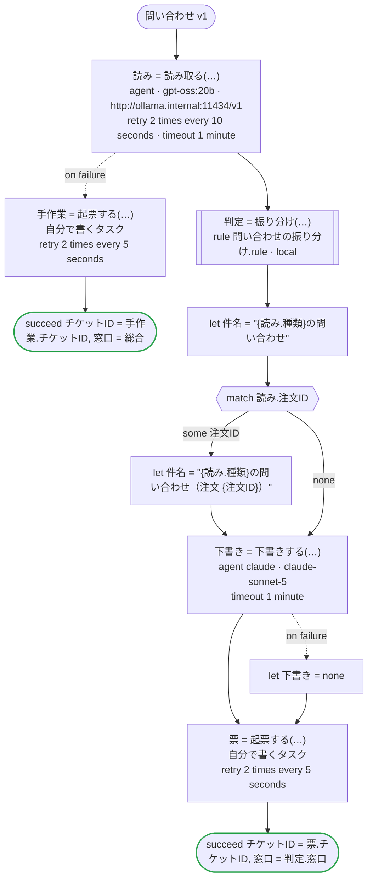

# 問い合わせ v1

お客さまの問い合わせをエージェントが読んで、種類と注文番号と要点を取り出す。受け持つ窓口と最初の返事までの時間は規則が決め、返事の下書きは別のエージェントが書き、窓口のシステムに起票する。読むことと書くことはエージェント（読むのは会社が自分で動かしているモデル、書くのは Claude）が、決めることは規則が受け持つ。Temporal 向けの版：エージェントは dandori が生成するアクティビティで、読み取りは Open Responses を話す会社の Ollama に（`url`）、下書きはワーカーが持つ鍵で Claude に送る。規則はワークフローと同じワーカーでローカルアクティビティとして動き、その結果はマーカーとして履歴に残る。起票は自分で書くアクティビティ

`examples/inquiry/temporal/inquiry.ja.flow` を `dandori doc` で描いたものです。入力は `問い合わせ: 問い合わせ`、出力は `チケットID: string`, `窓口: 振り分け.窓口` です。

## flow

四角はタスク、両脇に線のある四角は規則、斜めの四角は外から値が届くタスク（イベントやコールバックの応答）、六角形は `match`、角の丸い四角は待ち、ステップを囲む枠はループです。破線の矢印は、呼び出しがその場で処理するエラーです。

## 呼び出し

| 行 | 呼び出し | 呼ぶもの | リトライ | タイムアウト | 失敗したとき |
|---:|---|---|---|---|---|
| 49 | `読み = 読み取る(…)` | `agent · gpt-oss:20b · http://ollama.internal:11434/v1` | 10 秒おきに 2 回（failure, timeout） | 1 分 | `timeout`, `failure` → 50 行目 |
| 51 | `手作業 = 起票する(…)` | 自分で書くタスク, `key` | 5 秒おきに 2 回（failure, timeout） | — | `timeout`, `failure` → ワークフローが失敗する |
| 53 | `判定 = 振り分け(…)` | 規則 `問い合わせの振り分け.rule`（Temporal ではローカルアクティビティ） | 2 回（1 秒後と 2 秒後、failure） | — | `timeout`, `failure` → ワークフローが失敗する |
| 58 | `下書き = 下書きする(…)` | `agent claude · claude-sonnet-5` | — | 1 分 | `timeout`, `failure` → 59 行目 |
| 60 | `票 = 起票する(…)` | 自分で書くタスク, `key` | 5 秒おきに 2 回（failure, timeout） | — | `timeout`, `failure` → ワークフローが失敗する |

## 終わり方

ワークフローの終わり方のすべてです。

| 行 | 終わり方 |
|---:|---|
| 52 | `succeed チケットID = 手作業.チケットID, 窓口 = 総合` |
| 61 | `succeed チケットID = 票.チケットID, 窓口 = 判定.窓口` |

