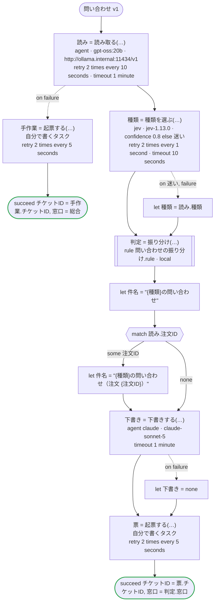

# 問い合わせ v1

お客さまの問い合わせの種類を Jev が選び、その確信度も返す。エージェントは問い合わせを読んで注文番号と要点を取り出し、種類も読む。Jev が種類に十分な確信を持てないときは、エージェントが読んだ種類を使う。受け持つ窓口と最初の返事までの時間は規則が決め、返事の下書きは別のエージェントが書き、窓口のシステムに起票する。選ぶことは Jev が、読むことと書くことはエージェント（読むのは会社が自分で動かしているモデル、書くのは Claude）が、決めることは規則が受け持つ。Temporal 向けの版：Jev とエージェントは生成したアクティビティで、Jev は TypeSafe の API キー（TYPESAFE_API_KEY）で呼び、読み取りは Open Responses を話す会社の Ollama に（`url`）、下書きはワーカーが持つ鍵で Claude に送る。規則はワークフローと同じワーカーでローカルアクティビティとして動き、その結果はマーカーとして履歴に残る。起票は自分で書くアクティビティ

`examples/inquiry/temporal/inquiry.ja.flow` を `dandori doc` で描いたものです。入力は `問い合わせ: 問い合わせ`、出力は `チケットID: string`, `窓口: 振り分け.窓口` です。

## flow

四角はタスク、両脇に線のある四角は規則、斜めの四角は外から値が届くタスク（イベントやコールバックの応答）、六角形は `match`、角の丸い四角は待ち、ステップを囲む枠はループです。破線の矢印は、呼び出しがその場で処理するエラーです。

## 呼び出し

| 行 | 呼び出し | 呼ぶもの | リトライ | タイムアウト | 失敗したとき |
|---:|---|---|---|---|---|
| 61 | `読み = 読み取る(…)` | `agent · gpt-oss:20b · http://ollama.internal:11434/v1` | 10 秒おきに 2 回（failure, timeout） | 1 分 | `timeout`, `failure` → 62 行目 |
| 63 | `手作業 = 起票する(…)` | 自分で書くタスク, `key` | 5 秒おきに 2 回（failure, timeout） | — | `timeout`, `failure` → ワークフローが失敗する |
| 66 | `種類 = 種類を選ぶ(…)` | `jev · jev-1.13.0 · confidence 0.8 else 迷い` | 1 秒おきに 2 回（failure, timeout） | 10 秒 | `迷い`, `timeout`, `failure` → 67 行目 |
| 68 | `判定 = 振り分け(…)` | 規則 `問い合わせの振り分け.rule`（Temporal ではローカルアクティビティ） | 2 回（1 秒後と 2 秒後、failure） | — | `timeout`, `failure` → ワークフローが失敗する |
| 73 | `下書き = 下書きする(…)` | `agent claude · claude-sonnet-5` | — | 1 分 | `timeout`, `failure` → 74 行目 |
| 75 | `票 = 起票する(…)` | 自分で書くタスク, `key` | 5 秒おきに 2 回（failure, timeout） | — | `timeout`, `failure` → ワークフローが失敗する |

## 終わり方

ワークフローの終わり方のすべてです。

| 行 | 終わり方 |
|---:|---|
| 64 | `succeed チケットID = 手作業.チケットID, 窓口 = 総合` |
| 76 | `succeed チケットID = 票.チケットID, 窓口 = 判定.窓口` |

## 規則

このワークフローが呼ぶ規則を、`rulec doc` が承認する人向けに描いたものです。

<code>振り分け</code> · 問い合わせの振り分け v1 · <code>../rules/問い合わせの振り分け.rule</code>

<!-- rulec 0.21.2 が 問い合わせの振り分け.rule (sha256:a2cf77a8b5e1) から生成。これは読み取り専用の資料で、本物は .rule のほうです。編集しても戻せません（§1.6）。 -->
# 規則 問い合わせの振り分け v1

問い合わせの種類と、会員かどうかから、受け持つ窓口と最初の返事までの時間を決める。書き下ろしの例

## 入力

| 名前 | 型 | 範囲 | 注記 |
|---|---|---|---|
| 種類 | 種類（4 値） |  |  |
| 会員 | bool |  |  |

## 出力

| 名前 | 型 | 丸め | 注記 |
|---|---|---|---|
| 窓口 | 窓口（3 値） |  |  |
| 期限 | duration[h] | down(1h) |  |

## 型

列挙は**閉じた**有限集合です。値を足すと、それを見ていない表が完全性検査で割れます。

- **種類**（4 値）— 返品、配送、請求、その他
- **窓口**（3 値）— 物流、経理、総合

## 表 振り分け（policy unique）

| 列 | 出どころ |
|---|---|
| 種類 | 入力 |
| 会員 | 入力 |
| → 窓口 | この規則の出力 |
| → 期限 | この規則の出力 |

| # | 種類 | 会員 | → 窓口（窓口） | → 期限（duration[h] / down(1h)） |
|---|---|---|---|---|
| 1 | 返品 | true | 物流 | 24h |
| 2 | 返品 | false | 物流 | 48h |
| 3 | 配送 | - | 物流 | 24h |
| 4 | 請求 | - | 経理 | 48h |
| 5 | その他 | true | 総合 | 48h |
| 6 | その他 | false | 総合 | 72h |

**`rulec check` が確かめたこと**

- どの入力の組合せも、いずれかの行に当てはまります（E101 完全性）
- どの入力にも当てはまらない行はありません（E102）
- 二つ以上の行に同時に当てはまる入力はありません（E105 重なり）。行の並べ替えは意味を変えません

## 例（検証済み）

| 種類 | 会員 | → 窓口 | 期限 |
|---|---|---|---|
| 返品 | true | 物流 | 24h |
| 請求 | false | 経理 | 48h |
| その他 | false | 総合 | 72h |

この 3 件は `rulec check` が参照評価器で実行し、すべて宣言どおりの値になりました（E107）。例は**実行される仕様**です。

