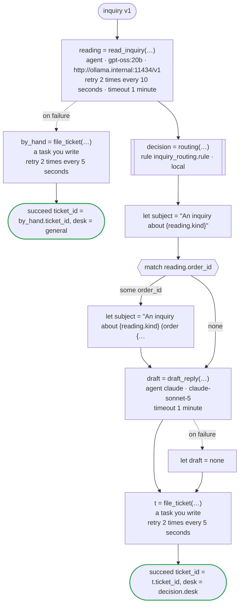

# inquiry v1

An agent reads a customer's inquiry for its kind, an order number and its point; a rule decides the desk that takes it and how soon it is answered; another agent drafts the first reply; and a ticket goes into the desk's system. Agents read and write (a model the company runs itself reads, Claude writes); the rule decides. Written for Temporal: the agents are activities dandori writes, the reading sent to the company's Ollama, which serves Open Responses (`url`), and the draft to Claude with the key the worker has; the rule runs in the worker of the workflow as a local activity, its answer kept in the history as a marker; and filing the ticket is an activity you write

`examples/inquiry/temporal/inquiry.flow`, drawn by `dandori doc`. Inputs: `inquiry: Inquiry`. Outputs: `ticket_id: string`, `desk: routing.desk`.

## flow

A rectangle is a task, one with a line down each side a rule, a slanted one a task whose value comes from outside (an event, or the answer to a callback), a hexagon a `match`, a rounded box a wait, and a box around steps a loop. A dashed arrow is an error the call handles.

## Calls

| Line | Call | Calls | Retries | Timeout | When it fails |
|---:|---|---|---|---|---|
| 49 | `reading = read_inquiry(…)` | `agent · gpt-oss:20b · http://ollama.internal:11434/v1` | 2 times every 10 seconds (failure, timeout) | 1 minute | `timeout`, `failure` → line 50 |
| 51 | `by_hand = file_ticket(…)` | a task you write, `key` | 2 times every 5 seconds (failure, timeout) | — | `timeout`, `failure` → the workflow fails |
| 53 | `decision = routing(…)` | rule `inquiry_routing.rule`, a local activity on Temporal | 2 times, after 1 second and 2 (failure) | — | `timeout`, `failure` → the workflow fails |
| 58 | `draft = draft_reply(…)` | `agent claude · claude-sonnet-5` | — | 1 minute | `timeout`, `failure` → line 59 |
| 60 | `t = file_ticket(…)` | a task you write, `key` | 2 times every 5 seconds (failure, timeout) | — | `timeout`, `failure` → the workflow fails |

## Ends

Every way the workflow can end.

| Line | End |
|---:|---|
| 52 | `succeed ticket_id = by_hand.ticket_id, desk = general` |
| 61 | `succeed ticket_id = t.ticket_id, desk = decision.desk` |

